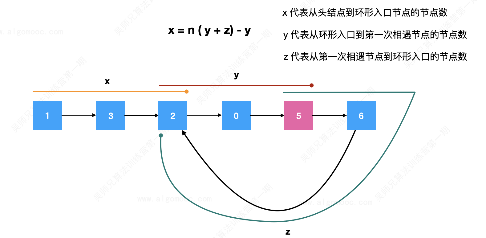

# 142.环形链表II

## 题目描述 

https://leetcode.cn/problems/linked-list-cycle-ii/

给定一个链表的头节点  `head` ，返回链表开始入环的第一个节点。 *如果链表无环，则返回 `null`。*

如果链表中有某个节点，可以通过连续跟踪 `next` 指针再次到达，则链表中存在环。 为了表示给定链表中的环，评测系统内部使用整数 `pos` 来表示链表尾连接到链表中的位置（**索引从 0 开始**）。如果 `pos` 是 `-1`，则在该链表中没有环。**注意：`pos` 不作为参数进行传递**，仅仅是为了标识链表的实际情况。

**不允许修改** 链表。

**示例 1：**

```
输入：head = [3,2,0,-4], pos = 1
输出：返回索引为 1 的链表节点
解释：链表中有一个环，其尾部连接到第二个节点。
```

**示例 2：**

```
输入：head = [1,2], pos = 0
输出：返回索引为 0 的链表节点
解释：链表中有一个环，其尾部连接到第一个节点。
```

**示例 3：**

```
输入：head = [1], pos = -1
输出：返回 null
解释：链表中没有环。
```

**提示：**

- 链表中节点的数目范围在范围 `[0, 104]` 内
- `-105 <= Node.val <= 105`
- `pos` 的值为 `-1` 或者链表中的一个有效索引

**进阶：**你是否可以使用 `O(1)` 空间解决此题？


## 题目分析

1、通过快慢指针的方式，在环中寻找它们的第一次相遇的节点位置

2、当快慢指针相遇的时候：



x 代表从头节点到环形入口节点的节点数（不包含头节点）

y 代表从环形入口到第一次相遇节点的节点数（不包含环形入口节点）

z 代表从第一次相遇节点到环形入口的节点数（不包含第一次相遇节点）

此时，快指针走了 x + y + n (y + z)，其中，x + y 表示快指针第一次到达相遇节点，n 代表快指针在环里面绕了多少圈。

而慢指针走了 x + y 步。

那么就出现了一个等式 `x + y = [x + y + n (y + z)] / 2`，即`x = n（y + z）- y`。

**n（y + z）- y** 代表的含义是**一个指针从相遇节点开始出发，走了 n 圈之后回到原来的出发位置，往后退 y 步**。

由于 x 代表从头节点到环形入口节点的节点数，并且`x = n（y + z）- y`，所以**n（y + z）- y** 代表的含义就是**一个指针从相遇节点开始出发，走了 n 圈之后回到原来的出发位置，往后退 y 步来到了环的入口位置**。

那么，我们就可以设置两个指针，一个从链表的头节点开始出发，一个指针从相遇节点开始出发，当它们相遇的时候，代表着环的入口节点找到了。

## 题目解答

C++代码

```c++
class Solution {
public:
    ListNode *detectCycle(ListNode *head) {
        // 1、通过快慢指针的方式，在环中寻找它们的第一次相遇的节点位置

        // 2、定义一个慢指针，每次只会向前移动 1 步
        ListNode *slow = head;
        // 3、定义一个快指针，每次只会向前移动 2 步
        ListNode *fast = head;

        // 4、如果链表有环，那么无论怎么移动，fast 指向的节点都是有值的
        while (fast != NULL && fast->next != NULL) {
            // 慢指针每次只会向前移动 1 步
            slow = slow->next;
            // 快指针每次只会向前移动 2 步
            fast = fast->next->next;   
            // 5、开始寻找环入口
            if (slow == fast) {

                // 定义两个指针，一个指向相遇节点，定义为 b，一个指向链表头节点，定义为 a
                // 一个指向相遇节点，定义为 b
                ListNode *b = fast;

                // 一个指向链表头节点，定义为 a
                ListNode *a = head;

                // 让 a 、b 两个指针向前移动，每次移动一步，直到相遇位置
                // 由于有环，必然相遇
                // 当 b 走了 n（y + z） - y 时，b 到达了环形入口节点位置
                // 当 a 走了 x 步时，a 到达了环形入口节点位置
                // a 与 b 相遇
                while (a != b) {
                    // a 指针每次只会向前移动 1 步
                    a = a->next;
                    // b 指针每次只会向前移动 1 步
                    b = b->next;
                }

                // 6、返回 a 和 b 相遇的节点位置就是环形入口节点位置
                return a;
            }
        }
        // 没有环，返回 NULL
        return NULL;     
    }
};
```

TypeScript代码

```typescript

```

复杂度分析：

* 时间复杂度：O(N)，其中 N为链表中节点的数目。在最初判断快慢指针是否相遇时，slow 指针走过的距离不会超过链表的总长度；随后寻找入环点时，走过的距离也不会超过链表的总长度。因此，总的执行时间为 O(N)+O(N)=O(N)。
* 空间复杂度：O(1)

