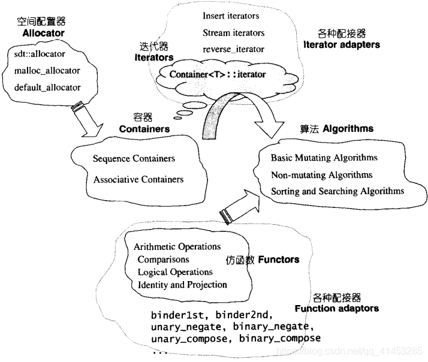

> 身为C++标准库中最重要的组成部分，STL(标准模板库)不仅是一个可复用组件库，而且是一个包罗算法与数据结构的软件框架。
>
> STL是精致的软件框架，是为优化效率而无所不用其极的艺术品，是数据结构和算法大师经年累月的智能结晶，是泛型思想的光辉篇章，是C++高级技术的精彩亮相。
>
> ​                                                                                                                   --<<STL源码剖析>>引介

# 1 STL概论与版本简介

## STL概论

**为了建立数据结构和算法的一套标准**，并且降低其间的耦合（coupling）关系以提升各自的独立性、弹性、交互操作性（相互合作性，interoperability），**C++社群里诞生了 STL**。

**STL的价值在两方面：**

* **低层次而言，STL 带给我们一套极具实用价值的零组件， 以及一个整合的组织**。这种价值就像 MFC 或 VCL 之于 Windows 软件开发过程 所带来的价值一样，直接而明朗，令大多数人有最立即明显的感受。
* **除此之外 STL 还带给我们一个高层次的、以泛型思维（Generic Paradigm）为基础的、系统化的、 条理分明的“软件组件分类学（components taxonomy）”**。从这个角度来看，STL 是个抽象概念库（library of abstract concepts），这些“抽象概念”包括最基础的 Assignable（可被赋值）、Default Constructible（不需任何自变量就可建构）、 Equality Comparable（可判断是否等同）、LessThan Comparable（可比较大 小）、Regular （正规）…，高阶一点的概念则包括 Input Iterator（具输入功能的迭代器）、 Output Iterator（具输出功能的迭代器）、Forward Iterator（单向迭代器）、 Bidirectional Iterator（双向迭代器）、Random Access Iterator（随机存取迭代 器）、Unary Function （一元函数）、Binary Function（二元函数）、Predicate（传回真假值的一元判断 式）、Binary Predicate（传回真假值的二元判断式）…
* **更高阶的概念**包括 sequence container（序列式容器）、associative container（关系型容器）…

**STL 的创新价值便在于具体叙述了上述这些抽象概念，并加以系统化**。 换句话说，STL 所实现的，是依据泛型思维架设起来的一个概念结构。这个以抽象概念（abstract concepts）为主体而非以实际类别（classes）为主体的结构，形成 了一个严谨的接口标准。在此接口之下，任何组件有最大的独立性，并以所谓迭 代 器（iterator）胶合起来，或以所谓配接器（adapter）互相配接，或以所谓仿函式 （functor）动态选择某种策略（policy 或 strategy）。

### 1. STL的历史

- **STL系由 Alexander Stepanov创造于1979年前后**，这也正是Bjarne Stroustrup 创造C++的年代。虽然 David R. Musser 于 1971 开始即在计算器几何领域中发展并倡导某些泛型程序设计观念，但早期并没有任何程序语言支持泛型编程
- **第一 个支持泛型概念的语言是 Ada**。Alexander 和 Musser 曾于 1987 开发出㆒套相关的 Ada library。然而 Ada 在美国国防工业以外并未被广泛接受，C++ 却如星火燎原 般地在程序设计领域中攻城略地。当时的C++ 尚未导入template 性质，但Alexander 却已经意识到，C++ 允许程序员透过指针以极佳弹性处理内存，这一点正是既 要 求㆒般化（泛型）又不失效能的一个重要关键
- 更重要的是，必须研究并实验出一个“建立在泛型编程之上”的组件库完整架构。 Alexander 在AT&T 实验室以及惠普公司的帕罗奥图（Hewlett-Packard Palo Alto） 实验室，分别实验了多种架构和算法公式，先以C 完成，而后再以 C++ 完成。 1992 年 Meng Lee 加入 Alex 的项目，成为 STL 的另一位主要贡献 者
- 贝尔（Bell）实验室的 Andrew Koenig 于1993 年知道这个研究计划后，邀请 Alexander 于是年 11 月的 ANSI/ISO C++ 标准委员会会议上展示其观念。获得热 烈回应。 Alexander 于是再接再励于次年夏天的 Waterloo（滑铁卢）会议开幕 前，**完成正式提案，并以压倒性多数一举让这个巨大的计划成为 C++ 标准规格的一部分**。

### 2 STL与C++标准程序库

- 1993/09，Alexander Stepanov 和他一手创建的 STL，**与 C++ 标准委员会有了第一次接触**

- 当时 Alexander 在硅谷（圣荷西）给了C++ 标准委员会一个演讲，讲题是：The Science of C++ Programming。题目很理论，但很受欢迎。1994/01/06 Alexander 收到 Andy Koenig（C++ 标准委员会成员，当时的 C++ Standard 文件审核编辑）来信，言明 如果希望 STL 成为 C++ 标准链接库的一部份，可于 1994/01/25 前送交一份提案 报告到委员会。Alexander 和 Lee 于是拼命赶工完成了那份提案

- 然后是 1994/03 的圣地牙哥会议。STL 在会议上获得了很好的回响，但也有许多 反对意见。主要的反对意见是，C++ 即将完成最终草案，而 STL 却是如此庞大， 似乎有点时不我予。投票结果压倒性地认为应该给予这份提案一个机会，并把决 定 性投票延到下次会议

- 下次会议到来之前，STL 做了几番重大的改善，并获得诸如 Bjarne Stroustrup、 Andy Koenig 等人的强力支持

- 然后便是滑铁卢会议。这个名称对拿破仑而言，标示的是失败，对Alexander 和 Lee， 以及他们的辛苦成果而言，标示的却是巨大的成功。投票结果，80 % 赞 成，20 % 反 对，于是 STL 进入了 C++ 标准化的正式流程，并终于成为 1998/09 定案的 C++ 标 准规格中的 C++ 标准链接库的一大脉系。影响所及，原本就有的 C++ 链接库如 stream, string 等也都以 template 重新写过。到处都是 templates！ 整个 C++ 标准 链接库呈现「春城无处不飞花」的场面。

  

## STL六大组件 功能与运用

* **容器（containers）：**各种数据结构，如vector, list, deque, set,map，用来存放数据从实作的角度看，STL 容器是一种class template。就体积而言，这一部份很像冰山在海面下的比率。
* **算法（algorithms）：**各种常用算法如sort,search,copy,erase…从实作的角度看，STL算法是一种function template。
* **迭代器（iterators）：**扮演容器与算法之间的胶着剂，是所谓的“泛型指标”。共有五种类型，以及其他衍生变化。从实作的角度看， 迭代器是一种将 operator*, operator->, operator++, operator--等指针相关操作予以重载的class template。所有STL容器都附带有自己专属的迭代器——是的，只有容器设计者才知道如何遍历自己的元素。原生指针（native pointer）也是一种迭代器。
* **仿函数（functors）：**行为类似函数，可做为算法的某种策略（policy）。从实作的角度看，仿函数是一种重载了operator()的class或class template。一般函数指针可视为狭义的仿函数。
* **配接器（adapters）：**一种用来修饰容器（containers）或仿函数（functors） 或迭代器（iterators）接口的东西。例如STL提供的queue和stack，虽然看似容器，其实只能算是一种容器配接器，因为它们的底部完 全借助 deque，所有动作都由底层的 deque 供应。改变functor接口者，称 为function adapter，改变 container 接口者，称为 container adapter，改变 iterator 接口者，称为 iterator adapter。
* **配置器（allocators）：**负责空间配置与管理。从实作的角度 看， 配置器是一个实现了动态空间配置、空间管理、空间释放的 class template。

六大组件的交互关系：

Container通过Allocator取得数据储存空间，Algorithm通过Iterator存取Container内容，Functor可以协助Algorithm完成不同的策略变化，Adapter可以修饰或套接Functor。

## STL的实现版本

* HP实现版本

  **HP版本是所有 STL实现版本的始祖。**每一个HP STL 表头档都有如下一份声明， 允许任何人免费使用、拷贝、修改、传播、贩卖这份软件及其说明文件，**唯一需要遵守的是，必须在所有档案中加上 HP 的版本声明和运用权限声明**。这种授权并不属于GNU GPL范畴，但属于open source范畴。

* P.J.Plauger实现版本

  **P.J. Plauger版本由P.J. Plauger开发。 PJ 版本承继HP版本，**所以它的每一个表头档都有 HP 的版本声明，此外还加上Rouge Wave 的公司版权声明。

  这个产品既不属于open source 范畴，更不是GNU GPL。

  **P.J. Plauger 版本被Visual C++采用**

* Rouge Wave实现版本

  **RougeWave 版本由 Rouge Wave 公司开发。RW 版本承继HP版本，**所以它的每一个表头档都有 HP 的版本声明，此外还加上Rouge Wave 的公司版权声明。

  这份产品既不属于open source 范畴，更不是GNU GPL。

  **Rouge Wave 版本被C++Builder采用**

* STLport实现版本

  网络上有个 STLport 站点，**提供一个以SGI STL为蓝本的高度可移植性实现版本。**

* SGI STL实现版本

  **SGI 版本由Silicon Graphics Computer Systems, Inc.公司发展，承继HP版本，**所以它的每一个表头档也都有 HP 的版本声明。此外还加上SGI 的公司版权声明。 从其声明可知，它属于 open source 的一员，但不属于 GNU GPL（广泛开放授权）。

  **SGI 版本被GCC采用**。

  GCC 对C++语言特性的支持相当良好，在 C++ 主流编译程序中表现耀眼，连带地给予了SGI STL 正面影响。事实上SGI STL 为了高度移植性，已经考虑了不同编译器的不同的编译能力。

  **SGI STL也采用某些 GPL（广泛性开放授权）档案**，例如<std\complext.h>、<std\complext.cc>、<std\bastring.h>、<std\bastring.cc>。

## STL文件的分布

**STL的源码都存在于C++的头文件中，C++标准规定，所有头文件都不再有扩展名，**但是为了向下兼容，或是为了内部组织规划：

- 某些STL版本同时存在具扩展名和无扩展名的两份文件，例如Visual C++的Dinkumware版本同时具备<vector.h>和<vector>
- 某些STL版本只存在具扩展名的头文件，例如C++Builder的RaugeWave版本只有<vector.h>
- 某些STL版本不仅有一线装配，还有二线装配，例如GNU C++的SGI版本不但有一线的<vector.h>和<vector>，还有二线的<stl_vector.h>

**SGL STL的文件类型大致可以分为以下3组：**

* **STL标准头文件（无扩展名）：**例如vector、deque、list、map、algorithm、functional......
* **C++ Standard定案前，HP所规范的STL头文件：**例如vector.h、deque.h、list.h、map.h、algo.h、function.h......
* **SGI STL内部文件（STL真正实现于此）：**例如 stl_vector.h、stl_deque.h、stl_list.h、stl_map.h、stl_algo.h、stl_function.h......

## 组态头文件stl_config.h

不同的编译器对C++语言的支持程序不同，作为一个希望具备广泛移植能力的程序库，SGI STL准备了一个环境组态文件<stl_config.h>，其中定义了很多常量、标志某些组态的成立与否。所有STL头文件都会直接或间接包含这个组态头文件**，并以条件式写法**，让预处理器根据各个常量决定取舍哪一段程序。

**备注：**SGI STL源码中名为<stl_config.h>，gcc源码中名为<pstl_config.h>。

