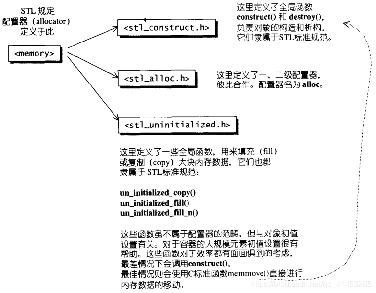
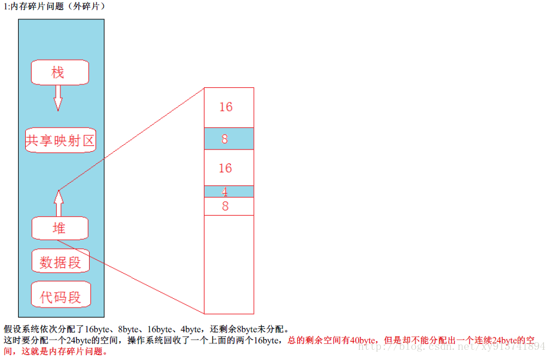
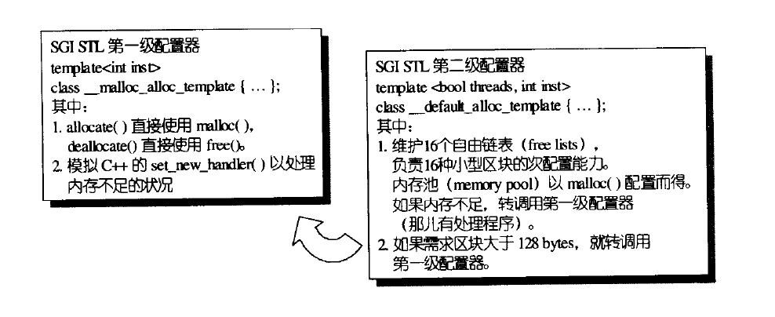
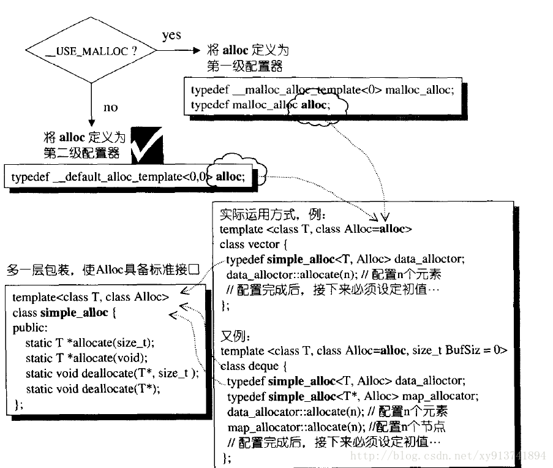
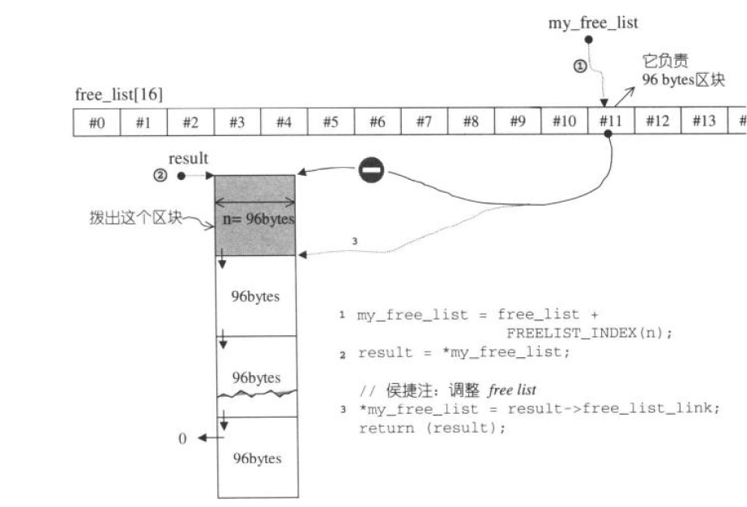
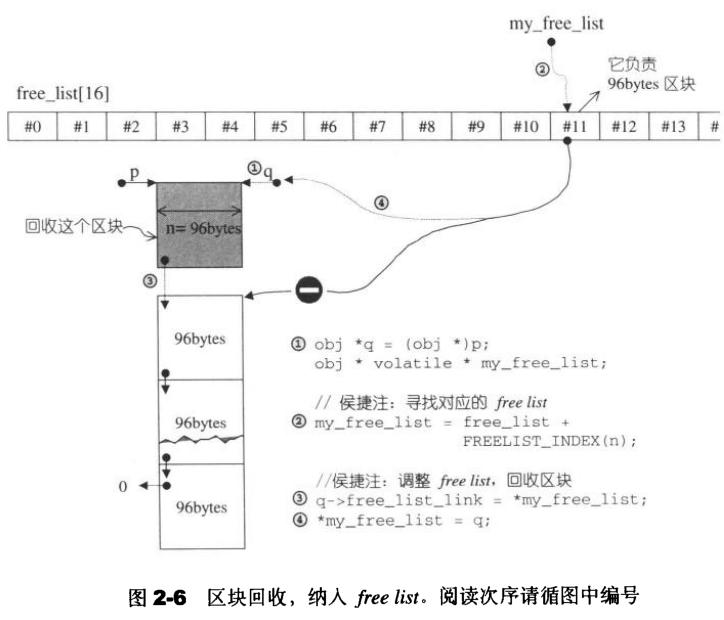
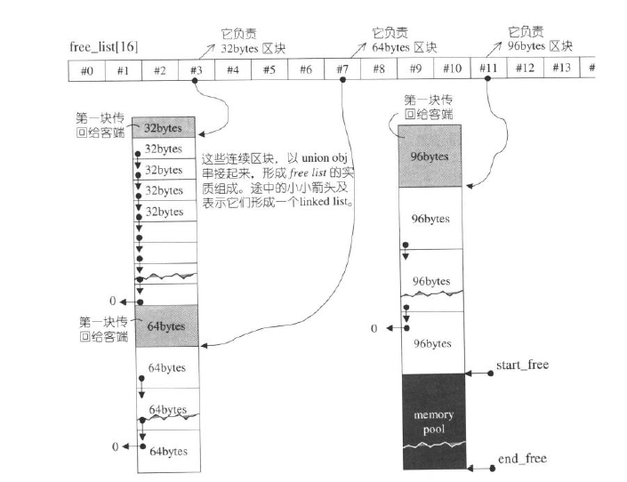
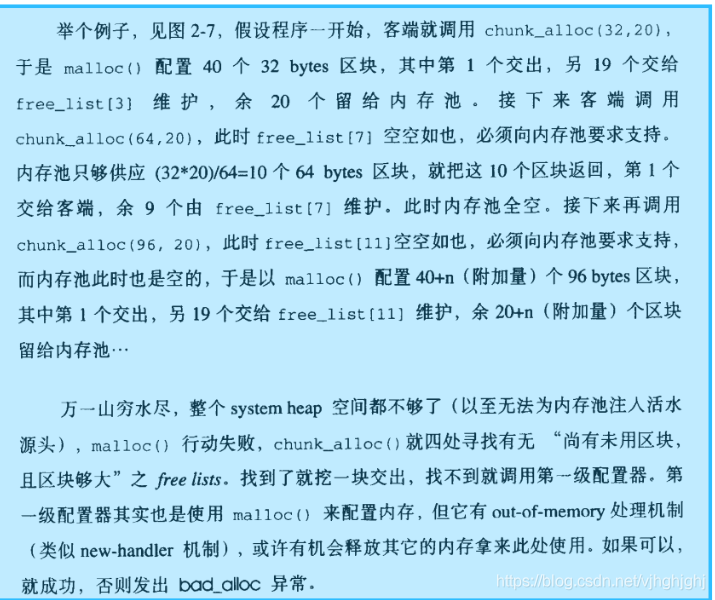

# 2 空间配置器

allocator是**隐藏**在STL组件（容器vector、map等）背后的，用来分配内存，这样STL容器才能有空间存放元素。

## 空间配置器的标准接口

pointer allocator::**allocate**(size_type n, const void* = 0)配置空间

void allocator::**deallocate**(pointer p, size_type n) 归还先前配置的空间

void allocator::**construct**(pointer p, const T& x) 等同于new(const void*) p) T(x)

void allocator::**destroy**(pointer p) 等同于p->~T()

## 设计一个简单的空间配置器JJ::allocator

```c++
#include <iostream>
#include <new>
#include <cstdlib>
#include <cstddef>
#include <climits>
#include <vector>
 
using namespace std;
 
namespace JJ
{
	//申请size个类型为T的地址空间
	template<class T>
	inline T* __allocate(ptrdiff_t size, T*)
	{
		std::set_new_handler(0);//设置内存分配出错处理函数
		//调用new操作符申请空间，大小为size个T类型的大小
		T *tmp = (T*)(::operator new((size_t)(size*sizeof(T))));
 
		//如果分配失败
		if (tmp == 0) {
			std::cerr << "out of memory" << std::endl;
			exit(1);
		}
		//分配成功返回分配的首地址
		return tmp;
	}
 
	//释放buffer所指的地址
	template<class T>
	inline void __deallocate(T* buffer)
	{
		::operator delete(buffer);
	}
 
	//使用placement new来在p所指的地址中构造一个类型为T1的对象，对象的值为value
	template<class T1, class T2>
	inline void __construct(T1* p, const T2& value)
	{
		new(p) T1(value);
	}
 
	//对ptr所指的对象执行析构函数
	template<class T>
	inline void __destory(T* ptr)
	{
		ptr->~T();
	}
 
	template<class T>
	class allocator
	{
	public:
		typedef T value_type;
		typedef T* pointer;
		typedef const T* const_pointer;
		typedef T& reference;
		typedef const T& const_reference;
		typedef size_t size_type;
		typedef ptrdiff_t difference_type;  //两个指针之间的距离大小
 
		template<class U>
		struct rebind {
			typedef allocator<U> other;
		};
 
		//分配n个大小为T的地址空间（参数2为类型T）
		pointer allocate(size_type n, const void* hint = 0) {
			return _allocate((difference_type)n, (pointer)0);
		}
 
		//从p所指的地址开始，释放n个类型为T的对象
		void deallocate(pointer p, size_type n) { __deallocate(p); }
 
		/*p为自身T*类型的指针，指向一块内存，这个内存是先前分配过且未释放的
		value为传递给类型为T的构造函数，用来对p所指的内存中构造一个对象，placement new*/
		void construct(pointer p, const T& value) {
			__construct(p, value);
		}
 
		//对p所指的对象执行析构函数
		void destory(pointer p) { __destory(p); }
 
		//返回x的地址
		pointer address(reference x) { return (pointer)&x; }
 
		//返回x的地址（const类型）
		const_pointer const_address(const_reference x) { return (const_pointer)&x; }
 
		//返回系统中可以分配类型为T的对象的最大量
		size_type max_size()const {
			return size_type(UINT_MAX / sizeof(T));
		}
	};
}
```

## SGI标准的空间配置器std::allocator

SGI STL定义了一个符合部分标准，名为allocator的配置器，但是SGI并未使用过，也不建议使用，主要因为效率不佳，其只是把C++的::operator new和::operator delete做一层简单地封装而已。位于defalloc.h头文件中。

```c++
#ifndef DEFALLOC_H
#define DEFALLOC_H
 
#include <new.h>
#include <stddef.h>
#include <stdlib.h>
#include <limits.h>
#include <iostream.h>
#include <algobase.h>
 
 
template <class T>
inline T* allocate(ptrdiff_t size, T*) {
    set_new_handler(0);
    T* tmp = (T*)(::operator new((size_t)(size * sizeof(T))));
    if (tmp == 0) {
	cerr << "out of memory" << endl; 
	exit(1);
    }
    return tmp;
}
 
 
template <class T>
inline void deallocate(T* buffer) {
    ::operator delete(buffer);
}
 
template <class T>
class allocator {
public:
    typedef T value_type;
    typedef T* pointer;
    typedef const T* const_pointer;
    typedef T& reference;
    typedef const T& const_reference;
    typedef size_t size_type;
    typedef ptrdiff_t difference_type;
    pointer allocate(size_type n) { 
	return ::allocate((difference_type)n, (pointer)0);
    }
    void deallocate(pointer p) { ::deallocate(p); }
    pointer address(reference x) { return (pointer)&x; }
    const_pointer const_address(const_reference x) { 
	return (const_pointer)&x; 
    }
    size_type init_page_size() { 
	return max(size_type(1), size_type(4096/sizeof(T))); 
    }
    size_type max_size() const { 
	return max(size_type(1), size_type(UINT_MAX/sizeof(T))); 
    }
};
 
class allocator<void> {
public:
    typedef void* pointer;
};
 
#endif
```

## SGI特殊的空间配置器std::alloc(STL标准版本的allocator)

- 上面介绍的SGI STL版本的allocator只是基层内存配置/释放行为（也就是::operator new和::operator delete）的一层薄薄的封装，并为考虑到任何效率上的强化
- SGI STL的配置器与众不同，也与标准规范不同，其名称是alloc而非allocator，而且不接受任何参数。SGI STL allocator未能符合标准规范，这个事实通常不会给我们带来困扰，因为通常我们使用缺省的空间配置器，很少需要自行指定配置器名称，而SGI STL的每一个容器都已经指定其缺省的空间配置器为alloc。
- STL标准定义的allocator定义在<memory>头文件中

- **STL标准实现的allocator也是将allocator分为几步来实现：**
  - 1.内存配置操作由alloc::allocate()负责
  - 2.内存释放操作由alloc::deallocate()负责
  - 3.对象构造操作由::construct()负责
  - 4.对象析构操作由::destroy()负责
- **<memory>头文件包含以下头文件：**
  - \#include <stl_alloc.h>：定义了alloc::allocate()、alloc::deallocate()等，负责内存空间的配置和释放。
  - \#include <stl_construct.h>：定义了::construct()、::destroy()，负责对象内容的构造和析构。
  - \#include <stl_uninitiallized.h>：定义了一些内存处理工具函数。



## 构造和析构基本工具：constrcut()和destroy()

以下源码在<stl_constrct.h>中。

construct()接受一个指针p和一个初值value，该函数的用途就是将初值设定到指针所指的空间上。

```c++
template <class _T1, class _T2>
inline void _Construct(_T1* __p, const _T2& __value) {
  new ((void*) __p) _T1(__value);
}
```

构造工具和之前介绍的简单空间配置器并无区别，主要区别在析构操作上，提供了两个版本的析构工具，一个是销毁单个对象，另外一个是销毁多个：

```c++
// 第一版本，接受一个指针
template <class _Tp>
inline void _Destroy(_Tp* __pointer) {
  __pointer->~_Tp();
}

// 第二版本，接受两个迭代器，此函数设法找出元素的数值型别，进而利用__type_traits<>求取最适当措施
template <class _ForwardIterator>
inline void _Destroy(_ForwardIterator __first, _ForwardIterator __last) {
  __destroy(__first, __last, __VALUE_TYPE(__first));
}
```

第二个版本通过 **__VALUE_TYPE**获得迭代器所指对象的型别，再利用__type_traits<T>判断对象是否有**trivial destructor**（无关痛痒的析构函数），然后调用不同的__destroy_aux，如果有执行它的析构函数（_Destroy(&*__first)），如果没有就什么也不做，因此提高了效率：

```c++
template <class _ForwardIterator>
void
__destroy_aux(_ForwardIterator __first, _ForwardIterator __last, __false_type)
{
  for ( ; __first != __last; ++__first)
    destroy(&*__first);
}

template <class _ForwardIterator> 
inline void __destroy_aux(_ForwardIterator, _ForwardIterator, __true_type) {}
```

和destroy()示意图.png)

## 空间的配置和释放std::alloc

以下源码在<stl_alloc.h>中。

SGI在空间配置上考虑了以下问题：

- 向system heap申请空间

- 考虑多线程的影响

- 考虑内存不足的影响

- 考虑过多小型区块可能造成的内存碎片问题

  关于内存碎片问题，下图可以解释：

  

c++的内存配置基本操作是：operator new和operator delete，其相当于C语言的malloc和free函数。
考虑内存碎片的问题，SGI配置器采用双层级配置器：

- 第一级采用malloc和free函数。
- 第二级视情况采用不同策略，当申请内存大于128 bytes时，直接采用第一级配置器；当小于时，采用**内存池**整理方式。
- 是否开放第二级取决于 **__USE_MALLOC**是否定义。**SGI未定义该宏，也就是说默认使用第二级配置器**。

不论采用第一级还是第二级，SGI都为他们包装了一个接口以供使用（simple_alloc）。**无论是用哪一级都以模板参数alloc传给simple_alloc，这样对外体现都只是simple_alloc**。





### 第一级配置器

第一级配置器采用malloc、free、realloc等执行实际内存操作，而不是使用operator new，因此不能直接运用**c++ new-handler**机制（即如果operator new无法完成操作，在抛出bad_alloc之前会先调用客户指定的处理程序，此程序称为new-handler）。需要自己实现new-handler机制：

```c++
  static void (* __set_malloc_handler(void (*__f)()))()
  {
    void (* __old)() = __malloc_alloc_oom_handler;
    __malloc_alloc_oom_handler = __f;
    return(__old);
  }

template <int __inst>
void*
__malloc_alloc_template<__inst>::_S_oom_malloc(size_t __n)
{
    void (* __my_malloc_handler)();
    void* __result;

    for (;;) {
        __my_malloc_handler = __malloc_alloc_oom_handler;
        if (0 == __my_malloc_handler) { __THROW_BAD_ALLOC; }
        (*__my_malloc_handler)();
        __result = malloc(__n);
        if (__result) return(__result);
    }
}
```

SGI第一级配置器的allocate()和realloc()都是在调用malloc()和realloc()不成功后，改调用oom_malloc()和oom_realloc()，后两者都有内循环，不断调用"内存不足处理例程"，期望在某次调用之后，获得足够的内存而圆满完成任务。但如果"内存不足处理例程new-handler"并未被客户端设置，则抛出bad_alloc异常。

### 第二级配置器

当区块小于128 bytes时，则以内存池(memory pool)管理，此法又称为次层配置(sub-allocation)：每次配置一大块内存，并维护对应之自由链表(free-list)。下次若再有相同大小的内存需求，就直接从free-lists中拔出。如果客户端释放小额区块，就由配置器回收到free-lists中。

第二级配置器维护16个free-lists，分别管理8,16,24,32,40,48,56,64,72,80,88,96,104,112,120,128大小的区块。


**自由链表是一个指针数组，有点类似与hash桶，它的数组大小为16，每个数组元素代表所挂的区块大小，比如free_list[0]代表下面挂的是8bytes的区块，free_list[1]代表下面挂的是16bytes的区块…….依次类推，直到free_list[15]代表下面挂的是128bytes的区块。同时我们还有一个被称为内存池地方，以start_free和 end_free记录其大小，用于保存未被挂在自由链表的区块，它和自由链表构成了伙伴系统。**

客户端配置内存时过程如下：

1. 先从free-list中申请满足大小要求并且最小的区块，申请成功就返回给客户端并且该free-list的指针指向下一个区块。
2. 如果在该free-list中没有申请到，就调用refill从内存池中申请20区块大小填充该free-list。
内存池的操作如下：
3. 如果内存池水量充足，就调出20个区块返回。
4. 如果水量不足，但还够一个以上区块，就调出这些区块然后返回。
5. 如果水量连一个区块都不足以提供，就从系统heap申请内存。在申请前，先把内存池中的零头分配给free-list，比如内存池中还剩35字节，就分配给区块大小为32的free-list。
6. 从系统申请40+n的内存，然后将第一个区块交给客户端，将剩余19个区块交给free-list维护，剩下的20+n个留给内存池。
7. 如果整个系统heap都不够了，就查找是否还有足够大且没有使用的free-list，然后释放这些区块（大的放入内存池，小的零头被编入free-list，通过递归调用自己实现）。

第二级配置器部分实现内容：

```c++
enum {_ALIGN = 8}; //小型区块的上调边界
enum {_MAX_BYTES = 128}; // 小型区块的上限
enum {_NFREELISTS = 16}; // _MAX_BYTES/_ALIGN free-lists个数

template <bool threads, int inst>
class __default_alloc_template {
private:
  // 将__bytes上调至8度倍数
  static size_t _S_round_up(size_t __bytes) 
    { return (((__bytes) + (size_t) _ALIGN-1) & ~((size_t) _ALIGN - 1)); }
  
  //free-lists的节点构造
  union _Obj { 
    union _Obj* _M_free_list_link;
    char _M_client_data[1];    /* The client sees this.        */
  };
  };
private:
  static _Obj* __STL_VOLATILE _S_free_list[_NFREELISTS]; 
  // 根据区块大小，决定使用第n号free-list，n从1起算
  static  size_t _S_freelist_index(size_t __bytes) {
        return (((__bytes) + (size_t)_ALIGN-1)/(size_t)_ALIGN - 1);
  }
  
  // 返回一个大小为n的对象，并可能加入大小为n的其他区块到free list
  // Returns an object of size __n, and optionally adds to size __n free list.
  static void* _S_refill(size_t __n);
  // 配置一大块空间，可容纳nobjs个大小为“size"的区块，如果配置nobjs个区块有所不便，nobjs可能会降低
  // Allocates a chunk for nobjs of size size.  nobjs may be reduced
  // if it is inconvenient to allocate the requested number.
  static char* _S_chunk_alloc(size_t __size, int& __nobjs);

  // Chunk allocation state.
  static char* _S_start_free; //内存池起始位置，只在_S_chunk_alloc()中变化
  static char* _S_end_free; // 内存池结束位置，只在_S_chunk_alloc()中变化
  static size_t _S_heap_size;

public:
  static void* allocate(size_t __n){}
  static void deallocate(void* __p, size_t __n){}
  static void* reallocate(void* __p, size_t __old_sz, size_t __new_sz);
```

上述obj所用的是union，由于union之故，从其第一字段观之，obj可被视为一个指针，指向相同形式的另一个obj，从其第二字段观之，obj可被视为一个指针，指向实际区块。一物二用的结果是，不会为了维护链表所必须的指针而造成内存的另一种浪费。这种技巧在强型语言如Java中行不通，但是在非强型语言如C++中十分普遍。


### 空间配置函数allocate()

```c++
static void* allocate(size_t __n)
{
  void* __ret = 0;
  //大于128就调用第一级配置器
  if (__n > (size_t) _MAX_BYTES) {
    __ret = malloc_alloc::allocate(__n);
  }
  else {
    // 寻找16个free lists中适当的一个
    _Obj* __STL_VOLATILE* __my_free_list = _S_free_list + _S_freelist_index(__n);

    _Obj* __RESTRICT __result = *__my_free_list;
    if (__result == 0)
      // 没找到可用的free list，准备重新填充free list
      __ret = _S_refill(_S_round_up(__n));
    else {
      // 调整free list
      *__my_free_list = __result -> _M_free_list_link;
      __ret = __result;
    }
  }

  return __ret;
};
```

1. 如果申请内存大于128 bytes，就调用第一级配置器，否则说明申请内存小于128 bytes，转到2

2. 根据申请内存的大小n在16个free lists中找出其对应的my_free_list

3. 如果对应的my_free_list中没有空闲区块，分配器首先将申请内存的大小上调至8的倍数n，调用refill()，准备重新填充my_free_list

4. 否则说明有可用的空闲区块，更新my_free_list并将第一块空闲区块返回

   

### 空间释放函数deallocate()

```c++
static void deallocate(void* __p, size_t __n)
{
  //大于128就调用第一级配置器
  if (__n > (size_t) _MAX_BYTES)
    malloc_alloc::deallocate(__p, __n);
  else {
    // 寻找对应的free list
    _Obj* __STL_VOLATILE*  __my_free_list = _S_free_list + _S_freelist_index(__n);
    _Obj* __q = (_Obj*)__p;

		// 调整free list，回收区块
    __q -> _M_free_list_link = *__my_free_list;
    *__my_free_list = __q;
  }
}
```

首先判断区块大小，大于128bytes就调用第一级配置器，小于128bytes就找出对应的free list，将区块回收。



### 重新填充free lists

先前讨论allocate()。当发现free list中没有可用区块了时，就调用refill()，准备为free list重新填充空间。新的空间取自内存池（经由chunk_allock()完成）。缺省取得20个新节点（新区块），但万一内存池空间不足，获得的节点数（区块数）可能小于20。

```c++
// 返回一个大小为n的对象，并且有时候会为适当的free list增加节点 假设n已经适当上调至8的倍数
template <bool __threads, int __inst>
void* __default_alloc_template<__threads, __inst>::_S_refill(size_t __n)
{
    int __nobjs = 20;
    // 调用chunk_alloc()，尝试取得nobjs个区块作为free list的新节点
    char* __chunk = _S_chunk_alloc(__n, __nobjs);
    _Obj* __STL_VOLATILE* __my_free_list;
    _Obj* __result;
    _Obj* __current_obj;
    _Obj* __next_obj;
    int __i;

    // 如果只取得一个区块，这个区块就分配给调用者用，free list无新节点
    if (1 == __nobjs) return(__chunk);
    // 否则准备调整free list，纳入新节点
    __my_free_list = _S_free_list + _S_freelist_index(__n);

    //以下在chunk空间内建立free list
    /* Build free list in chunk */
      __result = (_Obj*)__chunk; //这一块准备返回给客端
      // 以下导引free list指向新配置的空间(取自内存池)
      *__my_free_list = __next_obj = (_Obj*)(__chunk + __n);
      // 以下将free list的各节点串接起来
      for (__i = 1; ; __i++) { // 从1开始，因为第0个将返回给客端
        __current_obj = __next_obj;
        __next_obj = (_Obj*)((char*)__next_obj + __n);
        if (__nobjs - 1 == __i) {
            __current_obj -> _M_free_list_link = 0;
            break;
        } else {
            __current_obj -> _M_free_list_link = __next_obj;
        }
      }
    return(__result);
}
```

### 内存池(memory pool)

从内存池中取空间给free list使用，是chunk_alloc()函数工作：

```c++
template <bool __threads, int __inst>
char*
__default_alloc_template<__threads, __inst>::_S_chunk_alloc(size_t __size, 
                                                            int& __nobjs)
{
    char* __result;
    size_t __total_bytes = __size * __nobjs;
    size_t __bytes_left = _S_end_free - _S_start_free;// 内存池剩余空间

    if (__bytes_left >= __total_bytes) {
        // 内存池剩余空间完全满足需求量
        __result = _S_start_free;
        _S_start_free += __total_bytes;
        return(__result);
    } else if (__bytes_left >= __size) {
        // 内存池剩余空间不能完全满足需求量，但足够供应一个以上的区块
        __nobjs = (int)(__bytes_left/__size);
        __total_bytes = __size * __nobjs;
        __result = _S_start_free;
        _S_start_free += __total_bytes;
        return(__result);
    } else {
        // 内存池剩余空间连一个区块的大小都无法提供
        size_t __bytes_to_get = 
	  2 * __total_bytes + _S_round_up(_S_heap_size >> 4);
        // Try to make use of the left-over piece.
        if (__bytes_left > 0) {
            // 内存池内还有一些零头，先配给适当的free list
            _Obj* __STL_VOLATILE* __my_free_list =
                        _S_free_list + _S_freelist_index(__bytes_left);
            // 调整free list，将内存池中的剩余空间编入
            ((_Obj*)_S_start_free) -> _M_free_list_link = *__my_free_list;
            *__my_free_list = (_Obj*)_S_start_free;
        }
        // 配置heap空间，用来补充内存池
        _S_start_free = (char*)malloc(__bytes_to_get);
        if (0 == _S_start_free) {
            size_t __i;
            _Obj* __STL_VOLATILE* __my_free_list;
	    _Obj* __p;
            // Try to make do with what we have.  That can't
            // hurt.  We do not try smaller requests, since that tends
            // to result in disaster on multi-process machines.
            // 试着检视我们手上拥有的东西，这不会造成伤害。我们不打算尝试配置较小的区块，因为那在多进程机器
            // 上容易导致灾难
            // 以下搜寻适当的free list。所谓适当是指“尚有未用区块，且区块够大”之free list
            for (__i = __size;
                 __i <= (size_t) _MAX_BYTES;
                 __i += (size_t) _ALIGN) {
                __my_free_list = _S_free_list + _S_freelist_index(__i);
                __p = *__my_free_list;
                if (0 != __p) {// free list内尚有未用区块
                    // 调整free list以释放出未用区块
                    *__my_free_list = __p -> _M_free_list_link;
                    _S_start_free = (char*)__p;
                    _S_end_free = _S_start_free + __i;
                    // 递归调用自己，为了修正nobjs
                    return(_S_chunk_alloc(__size, __nobjs));
                    // Any leftover piece will eventually make it to the
                    // right free list.任何残余零头终将被编入适当的free-list中备用
                }
            }
	    _S_end_free = 0;	// In case of exception.
            // 调用第一级配置器，看看out-of-memory机制能否尽点力
            _S_start_free = (char*)malloc_alloc::allocate(__bytes_to_get);
            // This should either throw an
            // exception or remedy the situation.  Thus we assume it
            // succeeded.这会导致抛出异常，或内存不足的情况获得改善
        }
        _S_heap_size += __bytes_to_get;
        _S_end_free = _S_start_free + __bytes_to_get;
        // 递归调用自己，为了修正nobjs
        return(_S_chunk_alloc(__size, __nobjs));
    }
}
```

1. 如果内存池剩余空间大于或等于`20*n`的内存空间，则从这个空间中取出`n*20`大小的内存空间，更新start_free并返回申请到的内存空间的起始地址，否则转到2)

2. 如果内存池剩余空间足够分配一个及以上的区块，则分配整数倍于n的内存空间，更新start_free，由nobjs返回实际分配到的区块个数，并返回申请到的内存空间的起始地址，否则转到3)

3. 内存池中无法提供一个大小为n的区块，此时如果内存池中还有一些残余内存（这些内存大小小于n），则将这些内存插入到其对应大小的空闲分区链中

4.  调用malloc向运行时库申请大小为（`2*20*n` + 附加量）的内存空间， 如果申请成功，更新start_free，end_free和heap_size，并递归调用chunk_alloc()，修正nobjs，否则转到5)

5. 4)中调用malloc失败，这时分配器依次遍历区块足够大的freelists，只要有一个未用区块，就释放该区块，递归调用chunk_alloc()，修正nobjs

6. 如果出现意外，到处都没有内存可用了，则调用第一级配置器，看out-of-memory机制能否尽点力

   
   
   

引入相对的复杂的空间配置器，主要源自两点：

**1. 频繁使用malloc，free开辟释放小块内存带来的性能效率的低下**
**2. 内存碎片问题，导致不连续内存不可用的浪费**

引入两层配置器帮我们解决以上的问题，但是也带来一些问题：

1. 内碎片的问题，自由链表所挂区块都是8的整数倍，因此当我们需要非8倍数的区块，往往会导致浪费，比如我只要1字节的大小，但是自由链表最低分配8块，也就是浪费了7字节，我以为这也就是通常的以空间换时间的做法，这一点在计算机科学中很常见。
2. 我们发现似乎没有释放自由链表所挂区块的函数？确实是的，由于配置器的所有方法，成员都是静态的，那么他们就是存放在静态区。释放时机就是程序结束，这样子会导致自由链表一直占用内存，自己进程可以用，其他进程却用不了。

## 总结

C++ SGI 设计了双层级配置器。

第一级配置器：__malloc_alloc_template

第二级配置器 ：__default_alloc_template

第一级配置器直接使用 malloc()和 free()完成内存的分配和回收。第二级配置器则根据需求量的大小选择不同的策略执行。 

对于第二级配置器，如果需求块大小大于 128bytes，则直接转而调用第一级配置器，使用 malloc()分配内存。

如果需求块大小小于 128 bytes，第二级配置器中维护了 16 个自由链表，负责 16 种小型区块的次配置能力。

即当有小于 128bytes 的需求块要求时，首先查看所需需求块大小所对应的链表中是否有空闲空间，如果有则直接返回，如果没有，则向内存池中申请所需需求块大小的内存空间，如果申请成功，则将其加入到自由链表中。

如果内存池中没有空间，则使用 malloc() 从堆中进行申请，且申请到的大小是需求量的二倍（或二倍＋n 附加量），一倍放在自由空间中，一倍（或一倍＋n）放入内存池中。

如果 malloc()也失败，则会遍历自由空间链表，四处寻找“尚有未用区块，且区块够大”的 freelist，找到一 块就挖出一块交出。

如果还是没有，仍交由 malloc()处理，因为 malloc()有 out-of-memory 处理机制或许有机会释放其他的内存拿来用，如果可以就成功， 如果不行就报 bad_alloc 异常。