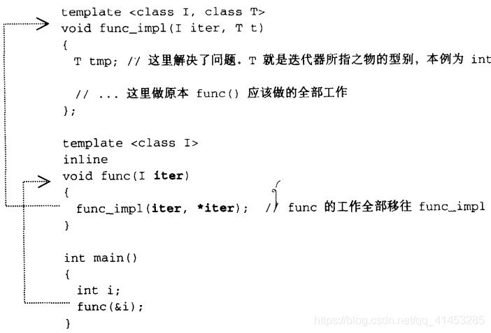
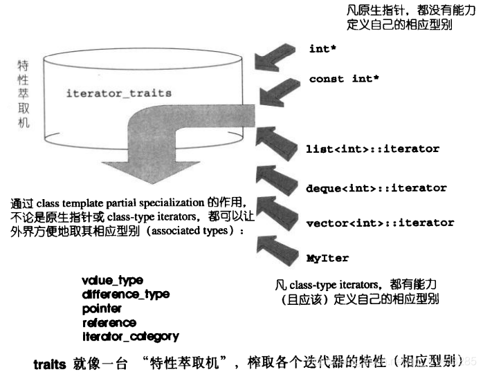

# 迭代器

## 迭代器概述

- 不论是泛型思想或是STL的实际运用，迭代器都扮演着重要的角色。

- **STL的中心思想在于：**将数据容器和算法分开，彼此独立设计，最后再以一种胶着剂将它们撮合在一起。

  下面是一个容器、算法、迭代器(iterator,扮演粘胶角色)的合作展示，以算法find()为例，它接受两个迭代器和一个搜寻目标。

  ```c++
  template<class InputIterator,class T>
  InputIterator find(InputIterator first, InputIterator last,
      const T& value)
  {
      while (first != last&&*first != value)
          ++first;
      return first;
  }
  ```

  只要给予不同的迭代器，find()能够根据不同的容器进行查找操作

  ```c++
  const int arraySize = 7;
  int ia[arraySize] = { 0,1,2,3,4,5,6 };
  
  vector<int> ivect(ia, ia + arraySize);
  list<int> ilist(ia, ia + arraySize);
  deque<int> ideque(ia, ia + arraySize);
  
  vector<int>::iterator iter1 = find(ivect.begin(), ivect.end(), 4);
  if (iter1 == ivect.end())
    std::cout << "4 not found" << std::endl;
  else
    std::cout << "4 found" << std::endl;
  
  list<int>::iterator iter2 = find(ilist.begin(), ilist.end(), 6);
  if (iter2 == ilist.end())
    std::cout << "6 not found" << std::endl;
  else
    std::cout << "6 found" << std::endl;
  
  deque<int>::iterator iter3 = find(ideque.begin(), ideque.end(), 8);
  if (iter3 == ideque.end())
    std::cout << "8 not found" << std::endl;
  else
    std::cout << "8 found" << std::endl;
  ```

  可以看出，迭代器是独立于容器和算法而存在的。

- 迭代器是一种行为类似指针的对象，而指针的各种行为中最常见的便是**“内容提领(dereference)”与“成员访问(member access)”**。因此迭代器最重要的工作就是**对operator\*和operator->进行重载。**

## 每一种STL容器都提供专属迭代器

我们有一个自己的链表容器类List，其中ListItem是链表的节点类

```c++
template<typename T>
class List
{
public:
    void insert_front(T value);
    void insert_end(T value);
    void display(std::ostream &os = std::cout)const;
 
    ListItem* end()const { return _end; }
    ListItem* front()const { return _front; }
private:
    ListItem<T>* _end;
    ListItem<T>* _front;
    long _size;
};
 
template<typename T>
class ListItem
{
public:
    T value()const { reutrn value; }
    ListItem* next()const { return return _next; }
private:
    T _value;
    ListItem* _next;
};
```

如何将我们的List应用于我们的find()函数呢？我们需要为它设计一个行为类似指针的外衣，也就是一个迭代器：

- 我们提领（*）这个迭代器时，返回的是节点对象ListItem
- 当我们递增该迭代器时，指向于下一个ListItem对象

- 为了让迭代器适用于任何类型的节点，而不仅限于ListItem，我们**将迭代器设计为一个类模板**

```c++
template<class Item>
struct ListIter
{
    Item* ptr;
 
    ListIter(Item* p = 0) :ptr(p) {}
 
    Item& operator*()const { return *ptr; }
    Item* operator->()const { return ptr; }
 
    ListIter& operator++() { 
        ptr = ptr->next();
        return *this;
    }
    ListIter& operator++(int) {
        ListIter tmp = *this;
        ++*this;
        return tmp;
    }
 
    bool operator==(const ListIter& i)const { return ptr == i.ptr; }
    bool operator!=(const ListIter& i)const { return ptr != i.ptr; }
};
```

由于find()算法内以*iter!=value来检查元素值是否吻合，而本例中的value的类型是int，iter的类型是ListItem<int>，两者不能直接进行比较，因此还需要设计一个全局的operator!=重载函数，并以int和ListItem<int>为参数：

```c++
template<typename T>
bool operator!=(const ListItem<T>& item, T n)
{
    return (item->value() != n);
}
```

现在我们可以使用我们自己的容器与迭代器了：

```c++
int main()
{
    List<int> myList;
 
    for (int i = 0; i < 5; ++i) {
        myList.insert_front(i);
        myList.insert_end(i + 2);
    }
 
    ListIter<ListItem<int> > begin(myList.front());
    ListIter<ListItem<int> > end;
    ListIter<ListItem<int> > iter;
 
    iter = find(begin, end, 3);
    if (iter == end)
        std::cout << "3 not found" << std::endl;
    else 
        std::cout << "3 found" << std::endl;
 
    return 0;
}
```

从上面的实现可以看出，为了完成一个针对List而设计的迭代器，我们**暴露了太多List实现细节：**

- 在main函数中，为了制作begin()和end()两个迭代器，我们暴露了ListItem
- 在ListIter类中为了达成operator++的目的，我们暴露了ListItem的操作函数next()

如果不是为了迭代器的设计，ListItem原本应该完全隐藏。换句话说，要设计出ListIter，首先必须对List的实现细节有非常丰富的了解。既然这无可避免，干脆就把迭代器的开发工作交给List的设计者好了。如此一来，所有实现细节反而得以封装起来不被使用者看到。

所以，为了避免暴露我们设计容器的细节，我们应该将迭代器的所有实现细节也封装其容器类中，这也正是每一个**STL容器都提供了一份专属于自己的迭代器的缘故**

## 迭代器相应类型

在使用迭代器的时候，我们可能需要知道这个迭代器所指之物的数据类型，但是C++不支持typeof()这种机制，因此我们**需要一种技术来获取迭代器所指之物的类型**

利用function template的**参数推导(argument deducation)机制**



迭代器相应类型不只是“迭代器所指对象的类型”一种而已。最常见的相应类型有5种，然而并非任何情况下任何一种都可利用上述的template参数推导机制来取得。

## 声明内嵌类型

推导机制虽然好，但是只能获取参数的类型，不能获取函数返回值的类型。作为解决办法，声明内嵌类型是一个好主意。

下面我们在MyIter中**使用typedef声明一个别名，**这个别名就是传入迭代器的类型的别名。在func函数中，我们返回迭代器中的元素，因此我们需要知道迭代器所指之物的类型才能为其声明返回值类型，此处我们**使用了typename来引出迭代器中的类型别名**

```c++
//迭代器类
template<class T>
struct MyIter {
    typedef T value_type; //内嵌类型别名，用value_type来表示迭代器类所指之物的类型
    T* ptr;
    MyIter(T* p = 0) :ptr(p) {}
    T& operator*()const { return *ptr; }
};
 
/*
    为什么要使用typename：因为编译器不知道T是什么，也就是说编译器不知道MyIter<T>::value_type
    是一个类型还是一个成员函数还是一个成员变量，此处我们使用typename告诉编译器这是一种类型，
    这样才能顺利编译通过
*/
template<class I>
typename I::value_type  //一整行为func的返回值类型
func(I ite){
    return *ite;
}
 
MyIter<int> ite(new int(8));
cout << func(ite);
```

## 偏特化

上面的声明内嵌类型很好用，但是并不是所有迭代器的都是class，例如原生指针就不是class（例如int*，stirng*），那么此时我们就无法使用内嵌类型了，但是STL算法、容器等都是接受原生指针作为一种迭代器的。那么针对于原生指针我们该如何处理呢？偏特化（Paritial Specialization）可以做到。

偏特化的概念是：如果类模板class template拥有一个以上的template参数，我们针对类模板中的某个（或数个，但非全部）template参数进行特化工作。为其提供一个特化版本（也就是将template中参数赋予明确的指定）
下面是一个特化版本，允许接收T为原生指针的情况 

```c++
template<typename T>
class C<T*>{};
```

在MyIter中我们迭代器没有偏特化版本，因此传入原生指针之后就不可以推导出迭代器所指之物的类型了。有了偏特化，我们就可以对迭代器进行偏特化，设计出下面的迭代器

```c++
//偏特化迭代器类
template<class T>
struct MyIter<T*> {
    typedef T value_type; //这个迭代器接受原生指针，从而获得指针所指之物的数据类型
    T* ptr;
    MyIter(T* p = 0) :ptr(p) {}
    T& operator*()const { return *ptr; }
};
```

## Traits编程技术

**下面的类模板专门用来“萃取”迭代器的类型，**value_type就是迭代器的特性之一：

```c++
//如果I为迭代器类，并且迭代器类中声明有类型别名，那么我们就可以萃取出其中的数据类型
template<class I>
struct iterator_traits {  // traits意为“特性”
    typedef typename I::value_type value_type;
};
```

**traits是指：**如果I定义有自己的value type，那么我们就可以通过上面设计的iterator_traits类来萃取出I的value_type（数据类型）。我们上面的func函数还可以更改为：

```c++
//萃取的使用场景
template<class I>
typename iterator_traits<I>::value_type  //一整行为func的返回值类型
func(I ite){
    return *ite;
}
```

**traits也可以有特化版本：**例如下面只针对于迭代器是原生指针的偏特化版本，其能萃取出指针所指之物的数据类型

```c++
template<class T>
struct iterator_traits<T*> {
    typedef T value_type;
};
```

> ### 注意“指向常数对象的指针”特化本
>
> 针对“指向常数对象的指针”，下面的式子会得出什么结果呢？
>
> ```cpp
> iterator_traits<const int*>::value_type;
> ```
>
> 我们希望这种traits机制来获取迭代器的类型，但是如果上面的式子萃取出的是const int类型，那么声明就无法赋值了，因此如果迭代器是个pointer-to-const，我们应该设置下面的特化版本
>
> ```cpp
> template<class T>
> struct iterator_traits<const T*> {
>     typedef T value_type;  //萃取出的是T，而不是const T
> };
> ```

下图说明了traits所扮演的“特性萃取机”角色，萃取各个迭代器的特性。当然如果希望“特性萃取机”traits能够正常工作，**前提是迭代器必须在自己的类中声明类型别名（typedef）**



下面是**迭代器源码中的iterator_traits类**（其中的一个版本），其用来**萃取迭代器中的相应类型**

```c++
//迭代器的源码
template<class Category,class T,class Distance=ptrdiff_t,
	class Pointer=T*,class Reference=T&>
struct iterator {
	typedef Category iterator_category;
	typedef T value_type; //迭代器所指之物的数据类型(其余的见下面介绍)
	typedef Distance difference_type;
	typedef Pointer pointer;
	typedef Reference reference;
};
 
 
//traits萃取机，其中I为迭代器类
template<class I>
struct iterator_traits {
    typedef typename I::iterator_category iterator_category;
    typedef typename I::value_type value_type;
    typedef typename I::difference_type difference_type;
    typedef typename I::pointer pointer;
    typedef typename I::reference reference;
};
```

当然，iteraotr_traits类还必须设计针对于迭代器是pointer以及pointer-to-const的特化版本

常用的迭代器相应类型有5中：value type、difference type、pointer、reference、iterator catagory

### 迭代器相应类型之一：value type

- 所谓value type，就是**指迭代器所指对象的类型**
- 任何一个与STL搭配的迭代器，都应该定义自己的value type内嵌类型

### 迭代器相应类型之二：difference the

- difference type用来**表示两个迭代器之间的距离**
- 因此可以用来表示一个容器的最大容量（对于连续空间的容器而言，头尾之间的距离就是其最大容量）
- 如果一个泛型算法提供计数功能，例如STL的count()算法，其返回值就必须使用迭代器的difference type

```c++
template<class I,class T>
typename iterator_traits<I>::difference_type //函数的返回值类型
count(I first, I last, const T& value) {
	typename iterator_traits<I>::difference n = 0;
	for (; first != last; ++first)
		++n;
	return n;
}
```

