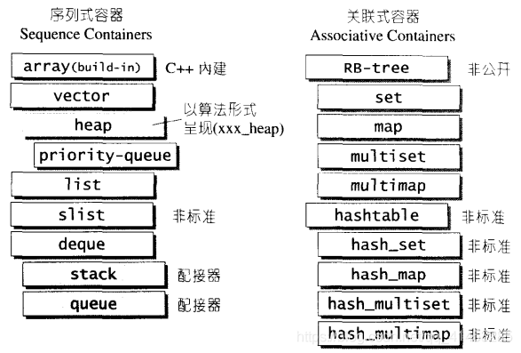

# 容器的概述与分类

- STL容器即是将运用最广的一些数据结构实现出来

- 常用的数据结构有array（数组）、list（链表）、tree（树）、stack（堆栈）、queue（队列）、hash table（散列表）、set（集合）、map（映射表）...等等，根据“数据在容器中的排列特性”，这些数据结构分为**序列式（sequence）和关联式（associative）**两种

  

# 序列式容器

- 所谓序列式容器，其中的元素都是可序的，但是未必都是有序的
- **分类：**
  - vector、list、deque、stack、queue、priority-queue等
  - 其中stack、queue由于只是将deque改头换面而已，所以**它们是一种配接器（adapter）**
  - 备注：C++语言本身提供一个序列式array（不属于STL范畴）
- **详细介绍：**
  - **[vector](./容器/vector.md)**
  - **list：**
  - **deque：**
  - **stack：**
  - **queue：**
  - **heap：**
  - **priority_queue：**
  - **slist：**

# 关联式容器

- **概念：**关联式容器，每笔数据（每个数据）**都有一个键值（key）和一个实值（value）**
- **特点：**
  - 当元素被插入到关联式容器中时，容器内部数据结构（RB-tree或hash-table等）依据其键值大小，以某种特定规则将这个元素放置于适当位置
  - 关联式容器没有头尾（只有最大元素和最小元素），所以不会有push_back()、push_front()、pop_back()、pop_front()、begin()、end()等操作
  - 关联式容器依据特定的排序准则，自动为其元素排序。元素可以是任何类型的value，也可以是key/value pair，其中key可以是任何类型，映射至一个相关value，而value也可以是任意类型
  - **排序准则：**
    - **对于只有value的关联式容器，**例如set、multiset，其对value进行排序。**对于key/value pair的关联式容器**，例如map、multimap，其根据key进行排序
    - **默认情况所有容器都以操作符<进行排序，**不过你可以提供自己的比较函数，定义出不同的排序准则
  - **关联式容器拥有自动排序能力，并不意味着它们在排序方面的执行效能更高**。实际上，由于容器每安插一个新元素都要进行一次排序，速度反而不及序列式容器经常采用的收发：先安插所有元素，然后调用STL提供的排序算法进行一次完全排序
- **分类：**
  - 分为set（集合）、map（映射表）两大类，以及两大类的衍生体multiset（多键集合）、multimap（多键映射表）
  - SGI STL还提供了一个不在标准规格之列的关联式容器：hash table（散列表）以及以此hash table为底层机制而完成的hash_set（散列集合）、hash_map（散列映射表）、hash_multiset（散列多键集合）、hash_multimap（散列多键映射表）
- **底层实现：**
  - 关联式容器的内部结构是一个balanced binary tree（平衡二叉树），以便获得良好的搜索效率。balanced binary tree有许多种类，包括AVL-tree、RB-tree、AA-tree，其中最被广泛应用于STL的是RB-tree（红黑树）
  - set、map、multiset、multimap底层均以RB-tree（红黑树）完成。RB-tree（红黑树）也是一个独立容器，但并不开放给外界使用
  - 因为使用平衡二叉树实现，所以对于特定的key或value，其能很快的找到特定的元素，因为其操作具备的是对数复杂度，而普通的循序式容器的复杂度是线型的。
- **详细介绍：**
  - **[set](./容器/set.md)：**元素依据其value自动排序，每个元素只能出现一次，不允许重复
  - map：每个元素都是key/value pair，其中key是排序准则的基准。每个key只能出现一次，不允许重复。Map也被视为一种关联式数组，也就是“索引可为任意类型”的数组
  - **multiset：**和set的唯一差别是，其元素可以重复
  - **multimap：**和map的唯一差别是，其元素都可以重复。multimap可被当做字典使用
  - **hashtable：**
  - **hash_set：**
  - **hash_map：**
  - **hash_multiset：**
  - **hash_multimap：**