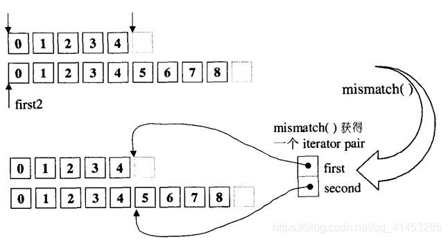
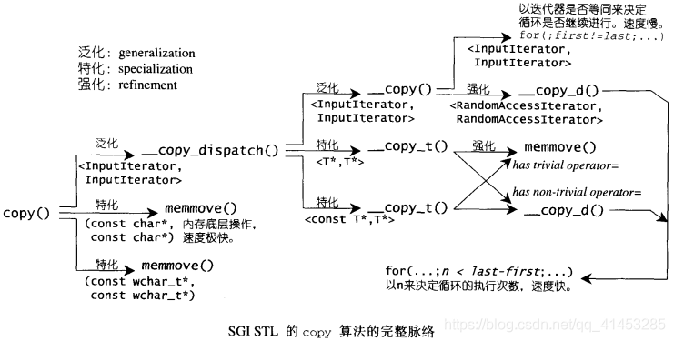
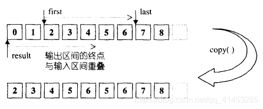
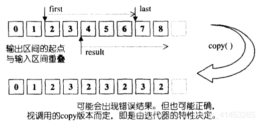
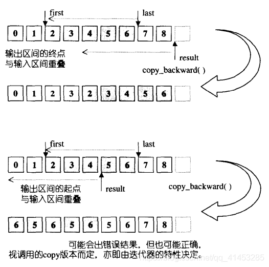

# 算法

## 算法概论

- **算法，问题之解法也**
- 广义而言，写的每个程序都是一个算法，其中的每个函数也都是一个算法
- 下面的一些文章我们将探讨极具复用价值的70余个STL算法，包括排序（sorting）、查找（searching）、排列组合（permutation）、以及用于数据移动、赋值、删除、比较、组合、运算等的算法
- 特定的算法往往搭配特定的数据结构，例如二叉搜索树（binary search tree）和红黑树（RB-tree）、哈希表（hash table）等

### 算法分析与算法复杂度

- **算法分析：**分析算法所耗费的资源，包括空间和时间
- 算法的复杂度，可以作为我们衡量算法的效率的标准
- 一般而言，算法的**执行时间和其所要处理的数据量有关，两者之间存在某种函数关系**，可能是一次（线型，linear）、二次（quadratic）、三次（cubic）或对数（logarithm）关系
  - **但数据量很小时，**其中的每一项都可能对结果带来相当程度的影响
  - **但是数据量很大时，**只有最高次的项目才具有主导地位

> ### 算法复杂度表示方法
>
> - **大O记法（Big-Oh）：**
>
> 如果有任何正值常数c和$N_0$，使得当$N\geq N_0$时，$T(N)\leq cF(N)$，那么我们便可将T(N)的复杂度表示为$O(F(N))$。
>
> - 其他方法**还有Big-Omega、Big-Theta、Little-Oh等**
> - 其中大O记法使用最广泛，但是不适用来标记小数据量的情况

> ### 下面是三个复杂度各异的问题
>
> - **①最小元素问题：**求取array中的最小元素
>
>   该问题的解法必须两两元素对比，因此N个元素需要N次对比，所以数据量与执行时间呈线性关系。**该问题的复杂度为O(N)**
>
> - **②最短距离问题：**求取X-Y平面上的N个点中，距离最近的两个点
>
>   该问题所需要计算的元素对共有N/(N-Z)/2!，所以大数据量和执行时间呈二次关系。**该问题的复杂度为$O(N^2)$**
>
> - **③三点共线问题：**决定X-Y平面上的N个点中，是否有任何三点共线
>
>   该问题要计算的元素对共有N(N-1)(N-2)/3!，所以大数据量和执行时间呈三次关系。**该问题的复杂度为$O(N^3)$**
>
> ### 下面三个问题出现一种新的复杂度形式
>
> - **④需要多少bits才能表现出N个连续整数**
>
>   该问题中，B个bits可表现出$2^B$个不同的整数，因此想要表现出N个连续整数，需要满足方程式$2^B\geq N$，即$B\geq logN$
>
> - **⑤从X=1开始，每次将X扩充两倍，需要多少次扩充才能使X>=N**
>
>   该问题称为“持续加倍问题”，必须满足方程式$2^k\geq N$，此问题与上面的问题4相同，因此解答相同
>
> - ⑥从X=N开始，每次将X缩减一半，需要多少次缩减才能使X<=1
>
>   该问题成为“持续减半问题”，与上面的问题相同，只不过方向相反
>
> 如果一个算法，花费固定时间（常数时间，O(1)）将问题的规模降低某个固定比例（通常是1/2），基于上述问题⑥的解答，我们便说此算法的复杂度是$O(logN)$
>
> 注意：问题规模的降低比例如何，并不会带来影响，因为他会反应在对数的底上，而底对于BIg-Oh标记法是没有影响的（任何的算法书上应该都会有证明）

### STL算法总览

- 下图显示了STL算法（以及一些非标准的SGI STL算法）的名称、用途、文件分布等等
- 凡是不在STL标准之中的，都以*标记


### 质变算法、非质变算法

> ### 质变算法（mutating algorithms）——会改变操作对象的值
>
> - 所有的STL算法都作用在由迭代器[first,last)所标示出来的区间上
> - 质变算法在运算过程中**会更改区间内的元素内容**。但是不一定改变传入的对象，可能是复制一份再改变
> - 例如**拷贝（copy）、交换（swap）、替换（replace）、填写（file）、删除（remove）、排列组合（permutation）、分割（partition）、随机重排（random shuffling）、排序（sort）**等算法
> - 所以如果你把**这些算法运用在一个常数区间上是错误的。**例如：
>
> ```c++
> #include <vector>
> #include <algorithm>
> using namespace std;
>  
>  
> int main()
> {
>     int ia[] = { 22,30,30,17,33,40,19,23,22,12,20 };
>     vector<int> iv(ia, ia + sizeof(ia) / sizeof(int));
>  
>     vector<int>::const_iterator citer1 = iv.begin();
>     vector<int>::const_iterator citer2 = iv.end();
>     
>     sort(citer1, citer2);
>     
>     return 0;
> }
> ```

> ### 非质变算法（nonmutating algorithms）——不会改变操作对象的值
>
> - 所有的STL算法都作用在由迭代器[first,last)所标示出来的区间上
> - 非质变算法在运算过程中**不会更改区间内的元素内容**
> - 例如**查找（find）、匹配（search）、计数（count）、遍历（for_each）、比较（equal,mismatch）、寻找极值（max,min）**等算法
> - 例如你在for_each算法身上**应用一个会改变元素内容的仿函数，那么也可以让非质变算法变为质变算法**
>
> ```c++
> #include <vector>
> #include <algorithm>
> using namespace std;
>  
> template<class T>
> struct plus2
> {
> 	void operator()(T& x)const
> 	{
> 		x += 2;
> 	}
> };
>  
> int main()
> {
> 	int ia[] = { 22,30,30,17,33,40,19,23,22,12,20 };
> 	vector<int> iv(ia, ia + sizeof(ia) / sizeof(int));
>  
> 	for_each(iv.begin(), iv.end(), plus2<int>()); //正确
> 	return 0;
> }
> ```

### STL算法的一些性质

> ### 算法操作的是迭代器的区间
>
> - 算法的前**两个参数都是一对迭代器，**通常为分别为first和last
> - STL习惯**采用前闭后开区间。**例如[first,last)区间表示包含first至last（但是不含last）。当first==last时，是一个空区间
> - 这个[first,last)区间**必要条件是，必须能够从first遍历到last**。编译器本身无法强求这一点，但是如果你的程序不支持，那么就会造成不可预期的后果
> - 在迭代器的文章中我们介绍了**，迭代器可以分为5类：**
>
> 
>
> * **最低程度迭代器类型：**
>   * 每种算法都需要其最低程序的迭代器类型。例如find()最低要求需要一个Input Iterator，这是其最低的要求
>   * 但是其也可以接受更高类型的迭代器，例如Forward Iterator，Bidirectiona Iterator或RandomAccess Iterator（因为这3个迭代器也都是Input Iterator的一种）
>   * 但是你绝不能将Output Interator传递给find()

> ### 有些算法不止一个版本
>
> - **STL有些算法不只支持一个版本。**
>
>   这类算法的某个版本采用缺省运算行为，其他版本提供额外的参数，接受外界传入一个仿函数
>
>   - 例如unique()缺省下使用equality操作符来比较两个相邻元素，但是用户也可以自己定义equality操作符然后传递给unique()
>
> - **有些算法将两个不同版本的函数不同命名，**附从的那个以_if结尾
>
>   - 例如find()的另一个版本为fond_if()
>   - 例如replace()的的另一个版本为replace_if()

> ### 质变算法通常提供两个版本
>
> - **质变算法通常提供两个版本：**
>   - 一个是in-place（就地进行）版本，就地改变其操作对象
>   - 另一个是copy（另地进行）版本，将操作对象的内容复制一份副本，然后在副本上修改并返回该副本。copy版本的总是以_copy的结尾
> - 例如replace()是in-place版本的，但是replace_copy()是copy版本的
> - 并不是所有质变算法都有copy版，例如sort()就没有两个版本，如果我们希望以这类“无copy”版本的质变算法实施于某一段区间元素的副本身上，我们必须自行制作并传递那一份副本。

> ### 头文件
>
> - **所有的数值算法**等都实现于<stl_numeric.h>中（这是个内部头文件）。应用层使用应该包含<numeric>
> - **其他STL算法**都实现于<stl_algo.h>和<stl_algobase.h>中（也是内部头文件）。应用层使用应该包含<algorithm>

## 算法的泛化过程

- **算法的泛化过程就是将算法独立于其所处理的数据结构之外，**不受数据结构的约束。使一个算法适用于所有的数据结构（不论传入算的是vector、list还是deque等）
- 关键在于，只要把操作对象的类型加以抽象化，把操作对象的标示法和区间目标的移动行为抽象化，整个算法就可以在一个抽象层面上工作了。**整个过程称为算法的泛型化，简称泛化**

> ### 演示案例（一步一步的进行泛化）
>
> **第一步：**
>
> 现在我们需要设计一个算法，在数组中查找某一个特定的值，那么我们可能会设计下面的函数：
>
> - 该算法在数组中查找元素，返回一个指针。如果找到就返回这个位置的地址，如果没有找到就返回数组最后一个元素的下一个位置
> - **这种算法的缺点：**这种算法暴露了容器太多的细节，也太过依赖于容器的类型
>
> ```c++
> int* find(int* arrayHead, int arraySize, int value)
> {
>     int i=0;
>     for (; i < arraySize; ++i)
>     {
>         if (arrayHead[i] == value)
>             break;
>     }
> 	
>     return &(arrayHead[i]);
> }
>  
> int main()
> {
>     const int arraySize = 7;
>     int ia[arraySize] = { 0,1,2,3,4,5,6 };
>     int *end = ia + arraySize;
>  
>     int* ip = find(ia, arraySize, 4);
>     if (ip == end)
>         std::cout << "4 not found" << std::endl;
>     else
>         std::cout << "4 found." << *ip << std::endl;
>     return 0;
> }
> ```
>
> **第二步：**为了让算法更抽象些，应该让算法接受两个指针作为参数，表示出操作一个区间
>
> - 这个函数在“前闭后开”区间[begin,end)内查找元素，返回值与第一步中的函数相同
> - 但是这个算法只能适用于int型的数组，不能适用于其他类型的容器
>
> ```c++
> int* find(int* begin, int* end, int value)
> {
>     while ((begin != end) && (*begin != value))
>         ++begin;
>  
>     return begin;
> }
>  
> int main()
> {
>     const int arraySize = 7;
>     int ia[arraySize] = { 0,1,2,3,4,5,6 };
>     int *end = ia + arraySize;
>  
>     int* ip = find(ia, end, 4);
>     if (ip == end)
>         std::cout << "4 not found" << std::endl;
>     else
>         std::cout << "4 found." << *ip << std::endl;
>     return 0;
> }
> ```
>
> **第三步：**我们可以将第二步的算法进行加工，声明为一个模板，使其适用于所有的类型
>
> - 注意：参数3改了，改为了pass-by-reference-to-const
> - 这个模板可以适用于任何容器
>
> ```c++
> template<typename T>
> T* find(T* begin, T* end, const T& value)
> {
>     while ((begin != end) && (*begin != value))
>         ++begin;
>  
>     return begin;
> }
> ```
>
> **第四步：**上面的模板只能使用指针作为区间传入函数，但是STL设计的迭代器就是一种智能指针，迭代器是一种类似指针的对象。因此我们可以将指针改为迭代器然后作为算法的参数和返回值
>
> - **这就是算法最终的泛化版本，**在STL中的算法都是这样实现的
>
> ```c++
> template<class Iterator,typename T>
> Iterator* find(Iterator* begin, Iterator* end, const T& value)
> {
>     while ((begin != end) && (*begin != value))
>         ++begin;
>  
>     return begin;
> }
> ```
>

## 数值算法

- 这些算法STL内部实现于<stl_numeric.h>中，**应用层实现应该包含头文件<numeric>**

### accumulate

- **功能：**默认情况下，用来计算init和[first，last)区间内所有元素的总和
- init一定要提供。这么做的原因是当[first，last)为空区间时仍能获得一个明确的值
- 版本②接受一个仿函数
- **返回值：**返回计算出的和
- 版本②中的二元操作符不必满足交换律和结合律

> ### 版本①
>
> ```c++
> template <class _InputIterator, class _Tp>
> _Tp accumulate(_InputIterator __first, _InputIterator __last, _Tp __init)
> {
>   __STL_REQUIRES(_InputIterator, _InputIterator);
>   for ( ; __first != __last; ++__first) //将每个元素值累加到初值init身上
>     __init = __init + *__first;
>   return __init;
> }
> ```
>
> ### 版本②
>
> ```c++
> template <class _InputIterator, class _Tp, class _BinaryOperation>
> _Tp accumulate(_InputIterator __first, _InputIterator __last, _Tp __init,
>                _BinaryOperation __binary_op)
> {
>   __STL_REQUIRES(_InputIterator, _InputIterator);
>   for ( ; __first != __last; ++__first)
>     __init = __binary_op(__init, *__first);// 对每一个元素执行二元操作
>   return __init;
> }
> ```

> ### 演示案例
>
> ```c++
> #include <iostream>
> #include <iterator> //ostream_iterator
> #include <numeric>
> #include <vector>
> using namespace std;
>  
> int main()
> {
>     int ia[5] = { 1,2,3,4,5 };
>     vector<int> iv(ia, ia + 5);
>  
>     //15。计算过程：0+1+2+3+4+5
>     std::cout << accumulate(iv.begin(), iv.end(), 0) << std::endl;
>  
>     //-15。计算过程：0-1-2-3-4-5
>     std::cout << accumulate(iv.begin(), iv.end(), 0, minus<int>()) << std::endl;
>  
>     return 0;
> }
> ```

### adjacent_difference

- **功能：**默认情况下，用来计算[first，last)区间内每两个元素之间的差，并将差保存在参数3所指向的result中

  注意对应关系：result[0]=*first、result[1]=*(first+1)-*(first)、result[1]=*(first+2)-*(first+1)...以此类推

- 版本②接受一个仿函数

- **该函数与partial_sum互为逆运算。**例如对区间1、2、3、4、5执行adjacent_difference获得结果为1、1、1、1、1，再对此结果执行partial_sum，便可以得到原始区间值1、2、3、4、5

- **返回值：**返回参数3

> ### 版本①
>
> ```c++
> template <class _InputIterator, class _OutputIterator, class _Tp>
> _OutputIterator 
> __adjacent_difference(_InputIterator __first, _InputIterator __last,
>                       _OutputIterator __result, _Tp*)
> {
>   _Tp __value = *__first;
>   while (++__first != __last) { //走过整个区间
>     _Tp __tmp = *__first;
>     *++__result = __tmp - __value; // 将相邻两元素的差额（后-前），赋值给目的端
>     __value = __tmp;
>   }
>   return ++__result;
> }
> 
> template <class _InputIterator, class _OutputIterator>
> _OutputIterator
> adjacent_difference(_InputIterator __first,
>                     _InputIterator __last, _OutputIterator __result)
> {
>   __STL_REQUIRES(_InputIterator, _InputIterator);
>   __STL_REQUIRES(_OutputIterator, _OutputIterator);
>   if (__first == __last) return __result;
>   *__result = *__first;//首先记录第一个元素
>   return __adjacent_difference(__first, __last, __result,
>                                __VALUE_TYPE(__first));
> }
> ```
>
> ### 版本②
>
> ```c++
> template <class _InputIterator, class _OutputIterator, class _Tp, 
>           class _BinaryOperation>
> _OutputIterator
> __adjacent_difference(_InputIterator __first, _InputIterator __last, 
>                       _OutputIterator __result, _Tp*,
>                       _BinaryOperation __binary_op) {
>   _Tp __value = *__first;
>   while (++__first != __last) {
>     _Tp __tmp = *__first;
>     *++__result = __binary_op(__tmp, __value);
>     __value = __tmp;
>   }
>   return ++__result;
> }
> 
> template <class _InputIterator, class _OutputIterator, class _BinaryOperation>
> _OutputIterator 
> adjacent_difference(_InputIterator __first, _InputIterator __last,
>                     _OutputIterator __result, _BinaryOperation __binary_op)
> {
>   __STL_REQUIRES(_InputIterator, _InputIterator);
>   __STL_REQUIRES(_OutputIterator, _OutputIterator);
>   if (__first == __last) return __result;
>   *__result = *__first;
>   return __adjacent_difference(__first, __last, __result,
>                                __VALUE_TYPE(__first),
>                                __binary_op);
> }
> ```

> ### 演示案例
>
> ```c++
> #include <iostream>
> #include <iterator> //ostream_iterator
> #include <numeric>
> #include <vector>
> using namespace std;
>  
> int main()
> {
>     int ia[5] = { 1,2,3,4,5 };
>     vector<int> iv(ia, ia + 5);
>  
>     //将这个迭代器绑定到cout上，作为下面的输出
>     ostream_iterator<int> oiter(std::cout, " ");
>  
>     //1 1 1 1 1
>     adjacent_difference(iv.begin(), iv.end(), oiter);
>     std::cout << std::endl;
>  
>     //1 3 5 7 9
>     adjacent_difference(iv.begin(), iv.end(), oiter, plus<int>());
>     std::cout << std::endl;
>  
>     return 0;
> }
> ```

### inner_product

- **功能：**默认情况下，以init参数为初始值，将[first1，last1)区间内的元素与以first2区间开始的元素进行内积（乘）操作，然后将结果返回
- **返回值：**返回内积的总和
- 版本②提供两个仿函数参数，第一个用于表示两个区间之间对应元素操作之后是加、还是减等。第二个用于代表函数返回的是[first1，last1)区间与first2区间的各个元素之间是加还是减等

> ### 版本①
>
> ```c++
> template <class _InputIterator1, class _InputIterator2, class _Tp>
> _Tp inner_product(_InputIterator1 __first1, _InputIterator1 __last1,
>                   _InputIterator2 __first2, _Tp __init)
> {
>   __STL_REQUIRES(_InputIterator2, _InputIterator);
>   __STL_REQUIRES(_InputIterator2, _InputIterator);
>   for ( ; __first1 != __last1; ++__first1, ++__first2)
>     __init = __init + (*__first1 * *__first2);
>   return __init;
> }
> ```
>
> ### 版本②
>
> ```c++
> template <class _InputIterator1, class _InputIterator2, class _Tp,
>           class _BinaryOperation1, class _BinaryOperation2>
> _Tp inner_product(_InputIterator1 __first1, _InputIterator1 __last1,
>                   _InputIterator2 __first2, _Tp __init, 
>                   _BinaryOperation1 __binary_op1,
>                   _BinaryOperation2 __binary_op2)
> {
>   __STL_REQUIRES(_InputIterator2, _InputIterator);
>   __STL_REQUIRES(_InputIterator2, _InputIterator);
>   for ( ; __first1 != __last1; ++__first1, ++__first2)
>     __init = __binary_op1(__init, __binary_op2(*__first1, *__first2));
>   return __init;
> }
> ```

> ### 演示案例
>
> ```c++
> #include <iostream>
> #include <iterator> //ostream_iterator
> #include <numeric>
> #include <vector>
> using namespace std;
>  
> int main()
> {
>     int ia[5] = { 1,2,3,4,5 };
>     vector<int> iv(ia, ia + 5);
>  
>     //65。计算过程：10 + 1*1 + 2*2 + 3*3 + 4*4 + 5*5
>     std::cout << inner_product(iv.begin(), iv.end(), iv.begin(), 10) << std::endl;
>  
>     //-65。计算过程：10 - 1+1 - 2+2 - 3+3 - 4+4 - 5+5
>     std::cout << inner_product(iv.begin(), iv.end(), iv.begin(), 10,
>         minus<int>(), plus<int>()) << std::endl;
>     return 0;
> }
> ```

### partial_sum

- **功能：**默认情况下，用来计算局部和。在[first，last)区间上，迭代器每移动一次，就将其以及前面所有的元素的值进行一个和，然后保存到存储参数3中

  形式是result[0]=*first、result[1]=*(first)+*(first+1)、result[1]=*(first)+*(first+1)+*(first+2)...以此类推

- **返回值：**参数3

- 备注：运算的时候是从前向后运算，而不是从后向前运算

- 版本②提供一个仿函数，用来指定是每回运算是加还是减等

> ### 版本①
>
> ```c++
> template <class _InputIterator, class _OutputIterator, class _Tp>
> _OutputIterator 
> __partial_sum(_InputIterator __first, _InputIterator __last,
>               _OutputIterator __result, _Tp*)
> {
>   _Tp __value = *__first;
>   while (++__first != __last) {
>     __value = __value + *__first;
>     *++__result = __value;
>   }
>   return ++__result;
> }
> 
> template <class _InputIterator, class _OutputIterator>
> _OutputIterator 
> partial_sum(_InputIterator __first, _InputIterator __last,
>             _OutputIterator __result)
> {
>   __STL_REQUIRES(_InputIterator, _InputIterator);
>   __STL_REQUIRES(_OutputIterator, _OutputIterator);
>   if (__first == __last) return __result;
>   *__result = *__first;
>   return __partial_sum(__first, __last, __result, __VALUE_TYPE(__first));
> }
> ```
>
> ### 版本②
>
> ```c++
> template <class _InputIterator, class _OutputIterator, class _Tp,
>           class _BinaryOperation>
> _OutputIterator 
> __partial_sum(_InputIterator __first, _InputIterator __last, 
>               _OutputIterator __result, _Tp*, _BinaryOperation __binary_op)
> {
>   _Tp __value = *__first;
>   while (++__first != __last) {
>     __value = __binary_op(__value, *__first);
>     *++__result = __value;
>   }
>   return ++__result;
> }
> 
> template <class _InputIterator, class _OutputIterator, class _BinaryOperation>
> _OutputIterator 
> partial_sum(_InputIterator __first, _InputIterator __last,
>             _OutputIterator __result, _BinaryOperation __binary_op)
> {
>   __STL_REQUIRES(_InputIterator, _InputIterator);
>   __STL_REQUIRES(_OutputIterator, _OutputIterator);
>   if (__first == __last) return __result;
>   *__result = *__first;
>   return __partial_sum(__first, __last, __result, __VALUE_TYPE(__first), 
>                        __binary_op);
> }
> ```

> ### 演示案例
>
> ```c++
> #include <iostream>
> #include <iterator> //ostream_iterator
> #include <numeric>
> #include <vector>
> using namespace std;
>  
> int main()
> {
>     int ia[5] = { 1,2,3,4,5 };
>     vector<int> iv(ia, ia + 5);
>  
>     //将这个迭代器绑定到cout上，作为下面的输出
>     ostream_iterator<int> oiter(std::cout, " ");
>  
>     //1 3 6 10 15
>     partial_sum(iv.begin(), iv.end(), oiter);
>     std::cout << std::endl;
>     
>     //1 -1 -4 -8 -13
>     partial_sum(iv.begin(), iv.end(), oiter, minus<int>());
>     std::cout << std::endl;
>  
>     return 0;
> }
> ```

### power

- **功能：**返回某数的n幂次方。这里的n幂次是指自己对自己进行某种运算达n次
- 运算类型可由外界指定。例如指定乘法，那就是乘幂

> ### 版本①
>
> ```c++
> // 乘幂
> template <class _Tp, class _Integer>
> inline _Tp __power(_Tp __x, _Integer __n)
> {
>   return __power(__x, __n, multiplies<_Tp>());
> }
> ```
>
> ### 版本②
>
> ```c++
> // 幂次方。如果指定为乘法运算，则当n>=0时返回x^n
> template <class _Tp, class _Integer, class _MonoidOperation>
> _Tp __power(_Tp __x, _Integer __n, _MonoidOperation __opr)
> {
>   if (__n == 0)
>     return identity_element(__opr);
>   else {
>     while ((__n & 1) == 0) {
>       __n >>= 1;
>       __x = __opr(__x, __x);
>     }
> 
>     _Tp __result = __x;
>     __n >>= 1;
>     while (__n != 0) {
>       __x = __opr(__x, __x);
>       if ((__n & 1) != 0)
>         __result = __opr(__result, __x);
>       __n >>= 1;
>     }
>     return __result;
>   }
> }
> ```

### itoa

- **功能：**把区间[first,last)内的元素依次改变为：*(first)=value、*(first+1)=value+1、*(first+2)=value+2...、*(first+(last-first-1))=value+(last-first-1)。用来设定某个区间的内容，使其内的每一个元素从指定的value值开始，呈现递增状态。
- **无返回值**
- 属于质变算法

> ```c++
> template <class _ForwardIter, class _Tp>
> void 
> iota(_ForwardIter __first, _ForwardIter __last, _Tp __value)
> {
>   __STL_REQUIRES(_ForwardIter, _Mutable_ForwardIterator);
>   __STL_CONVERTIBLE(_Tp, typename iterator_traits<_ForwardIter>::value_type);
>   while (__first != __last)
>     *__first++ = __value++;
> }
> ```

>### 演示案例
>
>```c++
>#include <iostream>
>#include <iterator> //ostream_iterator
>#include <numeric>
>#include <vector>
>using namespace std;
> 
>int main()
>{
>    int ia[5] = { 1,2,3,4,5 };
>    vector<int> iv(ia, ia + 5);
> 
>    int n = 3;
>    iota(iv.begin(), iv.end(), n);
> 
>    //3 4 5 6 7
>    for (int i = 0; i < iv.size(); ++i)
>        std::cout << iv[i] << " ";
>    std::cout << std::endl;
>    return 0;
>}
>```

## 基本算法

- STL标准没有区分基本算法或复杂算法，但是SGI却把一些常用的**基本算法定义在<stl_algobase.h>中**，**其他算法定义于<stl_algo.h>中**
- 应用层使用的**头文件<algorithm>包含<stl_algobase.h>与<stl_algo.h>**

### equal

- **功能：**用来比较两个序列在[first，last)区间内是否相等
- **返回值：**相同返回true，否则返回false
- **备注：**
  - 如果第二个序列元素比较多，多出来的元素不考虑
  - 如果第二个序列元素比第一个序列元素少，则比较会超越第二个序列的尾端，后果不可预期
- 版本②允许我们提供一个仿函数作为比较依据
- 因此，如果我们想比较两个容器是否相等，可以使用下面的代码

```c++
if(vec1.size()==vec2.size()&&
    equal(vec1.begin(),vec1.end(),vec2.begin()));
```

> ```c++
> template <class _InputIter1, class _InputIter2>
> inline bool equal(_InputIter1 __first1, _InputIter1 __last1,
>                   _InputIter2 __first2) {
>   __STL_REQUIRES(_InputIter1, _InputIterator);
>   __STL_REQUIRES(_InputIter2, _InputIterator);
>   __STL_REQUIRES(typename iterator_traits<_InputIter1>::value_type,
>                  _EqualityComparable);
>   __STL_REQUIRES(typename iterator_traits<_InputIter2>::value_type,
>                  _EqualityComparable);
>   for ( ; __first1 != __last1; ++__first1, ++__first2)
>     if (*__first1 != *__first2)
>       return false;
>   return true;
> }
> 
> template <class _InputIter1, class _InputIter2, class _BinaryPredicate>
> inline bool equal(_InputIter1 __first1, _InputIter1 __last1,
>                   _InputIter2 __first2, _BinaryPredicate __binary_pred) {
>   __STL_REQUIRES(_InputIter1, _InputIterator);
>   __STL_REQUIRES(_InputIter2, _InputIterator);
>   for ( ; __first1 != __last1; ++__first1, ++__first2)
>     if (!__binary_pred(*__first1, *__first2))
>       return false;
>   return true;
> }
> ```

### fill

将[first,last)内的所有元素改填新值

> ```c++
> template <class _ForwardIter, class _Tp>
> void fill(_ForwardIter __first, _ForwardIter __last, const _Tp& __value) {
>   __STL_REQUIRES(_ForwardIter, _Mutable_ForwardIterator);
>   for ( ; __first != __last; ++__first)
>     *__first = __value;
> }
> ```

### fill_n

将[first,last)内的前n个元素改填新值，返回的迭代器指向被填入的最后一个元素的下一位置。

> ```c++
> template <class _OutputIter, class _Size, class _Tp>
> _OutputIter fill_n(_OutputIter __first, _Size __n, const _Tp& __value) {
>   __STL_REQUIRES(_OutputIter, _OutputIterator);
>   for ( ; __n > 0; --__n, ++__first)
>     *__first = __value;
>   return __first;
> }
> ```

由于每次迭代进行的是assignment操作，是一种覆写(overwrite)操作，所以一旦操作区间超越了容器大小，就会造成不可预期的结果。解决办法之一是，利用inserter()产生一个具有插入(insert)而非覆写(overwrite)能力的迭代器。inserter()可产生一个用来修饰迭代器的配接器(iterator adapter)。

```c++
int ia[3]={0,1,2};
vector<int> iv(ia,ia+3);
fill_n(inserter(iv,iv.begin()),5,7);
```

### iter_swap

将两个ForwardIterrators所指的对象对调

> ```c++
> template <class _ForwardIter1, class _ForwardIter2, class _Tp>
> inline void __iter_swap(_ForwardIter1 __a, _ForwardIter2 __b, _Tp*) {
>   _Tp __tmp = *__a;
>   *__a = *__b;
>   *__b = __tmp;
> }
> 
> template <class _ForwardIter1, class _ForwardIter2>
> inline void iter_swap(_ForwardIter1 __a, _ForwardIter2 __b) {
>   __STL_REQUIRES(_ForwardIter1, _Mutable_ForwardIterator);
>   __STL_REQUIRES(_ForwardIter2, _Mutable_ForwardIterator);
>   __STL_CONVERTIBLE(typename iterator_traits<_ForwardIter1>::value_type,
>                     typename iterator_traits<_ForwardIter2>::value_type);
>   __STL_CONVERTIBLE(typename iterator_traits<_ForwardIter2>::value_type,
>                     typename iterator_traits<_ForwardIter1>::value_type);
>   __iter_swap(__a, __b, __VALUE_TYPE(__a));
> }
> ```

iter_swap()是“迭代器之value type”派上用场的一个好例子。是的，该函数必须知道迭代器的value type，才能够据此声明一个对象，用来暂时存放迭代器所指对象。

### lexicographical_compare

以“字典排列方式”对两个序列[first1,last1)和[first2,last2)进行比较。比较操作针对两序列中的对应位置上的元素进行，并持续直到

* 某一组对应元素彼此不相等
* 同时到达last1和last2(当两序列的大小相同)
* 到达last1或last2(当两序列的大小不同)

> ### 版本①
>
> ```c++
> template <class _InputIter1, class _InputIter2>
> bool lexicographical_compare(_InputIter1 __first1, _InputIter1 __last1,
>                              _InputIter2 __first2, _InputIter2 __last2) {
>   __STL_REQUIRES(_InputIter1, _InputIterator);
>   __STL_REQUIRES(_InputIter2, _InputIterator);
>   __STL_REQUIRES(typename iterator_traits<_InputIter1>::value_type,
>                  _LessThanComparable);
>   __STL_REQUIRES(typename iterator_traits<_InputIter2>::value_type,
>                  _LessThanComparable);
>   // 以下，任何一个序列到达尾端，就结束。否则两序列就相应元素一一进行比对
>   for ( ; __first1 != __last1 && __first2 != __last2
>         ; ++__first1, ++__first2) {
>     if (*__first1 < *__first2) // 第一序列元素值小于第二序列的相应元素值
>       return true;
>     if (*__first2 < *__first1) // 第二序列元素值小于第一序列的相应元素值
>       return false;
>     // 如果不符合以上两条件，表示两值相等，那就进行下一组相应元素值的比对
>   }
>   // 进行到这里，如果第一序列到达尾端而第二序列尚有余额，那么第一序列小于第二序列
>   return __first1 == __last1 && __first2 != __last2;
> }
> ```
>
> ### 版本②
>
> ```c++
> template <class _InputIter1, class _InputIter2, class _Compare>
> bool lexicographical_compare(_InputIter1 __first1, _InputIter1 __last1,
>                              _InputIter2 __first2, _InputIter2 __last2,
>                              _Compare __comp) {
>   __STL_REQUIRES(_InputIter1, _InputIterator);
>   __STL_REQUIRES(_InputIter2, _InputIterator);
>   for ( ; __first1 != __last1 && __first2 != __last2
>         ; ++__first1, ++__first2) {
>     if (__comp(*__first1, *__first2))
>       return true;
>     if (__comp(*__first2, *__first1))
>       return false;
>   }
>   return __first1 == __last1 && __first2 != __last2;
> }
> ```
>
> ### 特化版本
>
> 为了增进效率，SGI还设计了一个特化版本，用于原生指针const unsigned char*。
>
> ```c++
> inline bool 
> lexicographical_compare(const unsigned char* __first1,
>                         const unsigned char* __last1,
>                         const unsigned char* __first2,
>                         const unsigned char* __last2)
> {
>   const size_t __len1 = __last1 - __first1;
>   const size_t __len2 = __last2 - __first2;
>   // 先比较相同长度的一段，memcmp()速度极快
>   const int __result = memcmp(__first1, __first2, min(__len1, __len2));
>   // 如果不相上下，则长度较长者被视为比较大
>   return __result != 0 ? __result < 0 : __len1 < __len2;
> }
> ```
>
> 其中memcmp()是C标准函数，正是以unsigned char的方式来比较两序列中一一对应的每一个bytes。

### max

- **功能：**取两个对象中的较大值
- 版本①使用类型T所提供的greater-than操作符来判断大小
- 版本②使用仿函数comp来判断大小

> ```c++
> template <class _Tp>
> inline const _Tp& max(const _Tp& __a, const _Tp& __b) {
>   __STL_REQUIRES(_Tp, _LessThanComparable);
>   return  __a < __b ? __b : __a;
> }
> 
> template <class _Tp, class _Compare>
> inline const _Tp& max(const _Tp& __a, const _Tp& __b, _Compare __comp) {
>   return __comp(__a, __b) ? __b : __a;
> }
> ```

### min

- **功能：**取两个对象中的较小值
- 版本①使用类型T所提供的greater-than操作符来判断大小
- 版本②使用仿函数comp来判断大小

> ```c++
> template <class _Tp>
> inline const _Tp& min(const _Tp& __a, const _Tp& __b) {
>   __STL_REQUIRES(_Tp, _LessThanComparable);
>   return __b < __a ? __b : __a;
> }
> 
> template <class _Tp, class _Compare>
> inline const _Tp& min(const _Tp& __a, const _Tp& __b, _Compare __comp) {
>   return __comp(__b, __a) ? __b : __a;
> }
> ```

### mismatch

用来平行比较两个序列，指出两者之间的第一个不匹配点。返回一对迭代器，分别指向两序列中的不匹配点。



如果两序列的所有对应元素都匹配，返回的便是两序列各自的last迭代器。缺省情况下是以equality操作符来比较元素；但第二版本允许用户指定比较操作。如果第二序列的元素个数比第一序列多，多出来的元素忽略不计。如果第二序列的元素个数比第一序列少，会发生未可预期的行为。

> ### 版本①
>
> ```c++
> template <class _InputIter1, class _InputIter2>
> pair<_InputIter1, _InputIter2> mismatch(_InputIter1 __first1,
>                                         _InputIter1 __last1,
>                                         _InputIter2 __first2) {
>   __STL_REQUIRES(_InputIter1, _InputIterator);
>   __STL_REQUIRES(_InputIter2, _InputIterator);
>   __STL_REQUIRES(typename iterator_traits<_InputIter1>::value_type,
>                  _EqualityComparable);
>   __STL_REQUIRES(typename iterator_traits<_InputIter2>::value_type,
>                  _EqualityComparable);
>   while (__first1 != __last1 && *__first1 == *__first2) {
>     ++__first1;
>     ++__first2;
>   }
>   return pair<_InputIter1, _InputIter2>(__first1, __first2);
> }
> ```
>
> ### 版本②
>
> ```c++
> template <class _InputIter1, class _InputIter2, class _BinaryPredicate>
> pair<_InputIter1, _InputIter2> mismatch(_InputIter1 __first1,
>                                         _InputIter1 __last1,
>                                         _InputIter2 __first2,
>                                         _BinaryPredicate __binary_pred) {
>   __STL_REQUIRES(_InputIter1, _InputIterator);
>   __STL_REQUIRES(_InputIter2, _InputIterator);
>   while (__first1 != __last1 && __binary_pred(*__first1, *__first2)) {
>     ++__first1;
>     ++__first2;
>   }
>   return pair<_InputIter1, _InputIter2>(__first1, __first2);
> }
> ```

### swap

- **功能：**用来交换（对调）两个对象的内容

> ```c++
> template <class _Tp>
> inline void swap(_Tp& __a, _Tp& __b) {
>   __STL_REQUIRES(_Tp, _Assignable);
>   _Tp __tmp = __a;
>   __a = __b;
>   __b = __tmp;
> }
> ```

### copy

- 不论是对客户端程序还是对STL内部而言，copy()都是一个常常被调用的函数，copy做的就是复制操作

- **copy的实现有两种：**

  一种利用赋值运算符（=），另一种直接复制内存（memmove或memcpy）

  - 对于简单类型的复制，copy选择前者。对于复杂类型的复制，copy选择后者

- SGI STL的copy算法用尽各种办法，包括函数重载、类型特性、偏特化等变成技巧来增强其效率。下图是copy()操作的脉络



- **功能：**将输入区间[first，last)内的元素复制到输出区间[result,result+(last-first))内
- **参数的类型：**
  - copy算法的**输入区间**由InputIterators构成，**输出区间**由OutputItertor构成
  - 因此可以将任何容器一段区间的内容复制到任何容器的任何一段区间上

> ### copy算法的区间重叠问题（重点）
>
> - copy算法使用时要注意区间重叠问题
> - **如果输入区间和输出区间完全没有重叠，那么复制操作就不会发生任何错误**。但是如果输入区间和输出区间发生重叠，那么就需要考虑区间重叠问题
> - **如果输出区间的终点与输入区间重叠：**那么就不会发生错误
>
> 
>
> **如果输出区间的起点与输入区间重叠：**
>
> - 那么可能会发生错误。如果copy执行的是逐个的复制，那么就会发生重叠问题（见下图）
> - 但是也可能不发生错误。如果copy算法使用的是memmove()来执行拷贝，那么就不会造成区间重叠问题。因为memmove()会先将整个输入区间的内容复制下来，没有被覆盖的危险。
>
> 
>
> ### 区间重叠演示案例
>
> ```c++
> //程序1
> #include <iostream>
> #include <algorithm>
> using namespace std;
>  
> template<typename T>
> struct display{
>     void operator()(const T& x){
>         std::cout << x << " ";
>     }
> };
>  
> int main()
> {
>     int ia[] = { 0,1,2,3,4,5,6,7,8 };
>  
>     copy(ia + 2, ia + 7, ia);
>     for_each(ia, ia + 9, display<int>()); // 2 3 4 5 6 5 6 7 8
>     std::cout << std::endl;
>  
>     return 0;
> }
> ```
>
> - **程序1：**运行结果与上面图①一致
>
> ```c++
> //程序2
> #include <iostream>
> #include <algorithm>
> using namespace std;
>  
> template<typename T>
> struct display{
>     void operator()(const T& x){
>         std::cout << x << " ";
>     }
> };
>  
> int main()
> {
>     int ia[] = { 0,1,2,3,4,5,6,7,8 };
>  
>     copy(ia + 2, ia + 7, ia);
>     for_each(ia, ia + 9, display<int>());// 0 1 2 3 2 3 4 5 6
>     std::cout << std::endl;
>  
>     return 0;
> }
> ```
>
> **程序2：**此程序本来想模仿上图2，看看是否会发生覆盖操作，但是没有。程序2结果正确，因为调用的copy()算法使用memmove()执行实际复制操作
>
> ```c++
> //程序3
> #include <iostream>
> #include <algorithm>
> #include <deque>
> using namespace std;
>  
> template<typename T>
> struct display{
>     void operator()(const T& x){
>         std::cout << x << " ";
>     }
> };
>  
> int main()
> {
>     int ia[] = { 0,1,2,3,4,5,6,7,8 };
>  
>     deque<int> id(ia, ia + 9);
>     auto iter = id.begin();
>  
>     copy(iter + 2, iter + 7, iter);
>     for_each(id.begin(), id.end(), display<int>());// 2 3 4 5 6 5 6 7 8
>     std::cout << std::endl;
>  
>     return 0;
> }
> ```
>
> - **程序3：**运行结果与上面图①一致。输出区间的终点与输入区间重叠，因此不会发生错误
>
> ```c++
> //程序4
> #include <iostream>
> #include <algorithm>
> #include <deque>
> using namespace std;
>  
> template<typename T>
> struct display {
>     void operator()(const T& x) {
>         std::cout << x << " ";
>     }
> };
>  
> int main()
> {
>     int ia[] = { 0,1,2,3,4,5,6,7,8 };
>  
>     deque<int> id(ia, ia + 9);
>     auto iter = id.begin();
>  
> 	
>     copy(iter + 2, iter + 7, iter + 4);
>     for_each(id.begin(), id.end(), display<int>());// 0 1 2 3 2 3 2 3 2 
>     std::cout << std::endl;
>  
>     return 0;
> }
> ```
>
> **程序4：**此处模仿上图2，可以看到发生了内容覆盖。覆盖是因为针对于deque的迭代器类型（RandomAccessiterator），调用的copy版本不再使用memmove()执行复制操作，因此会造成覆盖行为
>
> - 因为deque的内存空间不是连续的，所以需要一个一个的进行移动复制
> - 如果你以vector代替deque进行测试，复制结果会是正确的，因为vector迭代器是原生指针，内存是连续的，因此是采用memmove()来复制的

> ### copy不能复制给空容器
>
> - copy更改的是[result+result+(last-first))中的迭代器所指对象，而非更改迭代器本身，copy会为输出区间内的元素赋予新值，而不是产生新的元素。因此copy不能直接用来将元素插入空容器
> - 如果你想要将元素插入（而非赋值）序列之内，要么使用序列容器的insert成员函数，要么使用copy算法并搭配insert_iterator来使用

> ### 编码实现
>
> - copy算法比较庞大，下面是唯一的对外接口（完全泛化版本）
>
> ```c++
> template <class _InputIter, class _OutputIter>
> inline _OutputIter copy(_InputIter __first, _InputIter __last,
>                         _OutputIter __result)
> {
>   return __copy(__first, __last, __result,
>                 __ITERATOR_CATEGORY(__first),
>                 __DISTANCE_TYPE(__first));
> }
> 
> template <class _InputIter, class _OutputIter, class _Distance>
> inline _OutputIter __copy(_InputIter __first, _InputIter __last,
>                           _OutputIter __result,
>                           input_iterator_tag, _Distance*)
> {
>   for ( ; __first != __last; ++__result, ++__first)
>     *__result = *__first;
>   return __result;
> }
> 
> template <class _RandomAccessIter, class _OutputIter, class _Distance>
> inline _OutputIter
> __copy(_RandomAccessIter __first, _RandomAccessIter __last,
>        _OutputIter __result, random_access_iterator_tag, _Distance*)
> {
>   for (_Distance __n = __last - __first; __n > 0; --__n) {
>     *__result = *__first;
>     ++__first;
>     ++__result;
>   }
>   return __result;
> }
> ```

### copy_backward

此算法是将[first，last)区间内的每一个元素，以逆行的方向复制到以result-1为起点，方向亦为逆行的区间上



- 注意，你可以使用copy_backward算法将任何容器的任何一段区间内容复制给任何容器的任何一段区间上。如果输入区间和输出区间没有完全重叠，那么也不会有问题，否则就需要像copy一样，考虑区间重叠问题

## set相关算法

- **STL一共提供了4种与set相关的算法，**分别为：并集（union）、交集（intersection）、差集（difference）、对称差集（symmetric_difference）
- 注意：此set与set容器不是一个东西。这个set是数学概念的上的
- 这些算法**接受的区间必须是有序区间**，因此可以使用set/multiset容器作为输入区间，但是不能以hash_set或hash_multiset作为输入容器，因为其内的元素并未呈现排序状态
- **4个算法都至少有四个参数，**分别为两个set区间。下面以S1代表第一区间[first1，last1)，以S2代表第二区间[first2，last2)

### set_union

- **功能：**该算法可以构造S1、S2的并集，也就是构造出集合S1$\cup$S2，此集合内含S1或S2内的每一个元素。
- **返回值：**返回一个迭代器，指向输出区间的尾端
- 由于S1和S2内的每个元素都不必唯一，因此，如果某个值在S1出现n次，在S2出现m次，那么**该值在输出区间中会出现max(m，n)次**，其中n个来自S1，其余来自S2
- set_union是一种稳定操作，意思是输入区间内的**每个元素的相对顺序都不会改变**

> ### 版本①
>
> - 版本①为默认版本，第一版本使用operator<进行比较
>
> ```c++
> // 并集，求存在于[first1，last1)或存在于[first2，last2)的所有元素
> // 注意，set是一种sorted range，这是以下算法的前提
> template <class _InputIter1, class _InputIter2, class _OutputIter>
> _OutputIter set_union(_InputIter1 __first1, _InputIter1 __last1,
>                       _InputIter2 __first2, _InputIter2 __last2,
>                       _OutputIter __result) {
>   __STL_REQUIRES(_InputIter1, _InputIterator);
>   __STL_REQUIRES(_InputIter2, _InputIterator);
>   __STL_REQUIRES(_OutputIter, _OutputIterator);
>   __STL_REQUIRES_SAME_TYPE(
>        typename iterator_traits<_InputIter1>::value_type,
>        typename iterator_traits<_InputIter2>::value_type);
>   __STL_REQUIRES(typename iterator_traits<_InputIter1>::value_type,
>                  _LessThanComparable);
>   while (__first1 != __last1 && __first2 != __last2) {
>     // 在两区间内分别移动迭代器。首先将元素值较小者（假设为A区）记录于目标区，然后移动A区迭代器使之前进
>     // 同时间之另一个区迭代器不动。然后进行新一次的比大小、记录小值、迭代器移动...直到两区中有一区到达
>     // 尾端。如果元素相等，取S1者记录于目标区，并同时移动两个迭代器
>     if (*__first1 < *__first2) {
>       *__result = *__first1;
>       ++__first1;
>     }
>     else if (*__first2 < *__first1) {
>       *__result = *__first2;
>       ++__first2;
>     }
>     else {
>       *__result = *__first1;
>       ++__first1;
>       ++__first2;
>     }
>     ++__result;
>   }
>   // 只要两区之中有一区到达尾端，就结束上述的while循环
>   // 以下将尚未到达尾端的区间的所有剩余元素拷贝到目的端
>   // 此刻的[first1,last1)和[first2,last2)之中有一个是空白区间
>   return copy(__first2, __last2, copy(__first1, __last1, __result));
> }
> ```
>
> ### 版本②
>
> - 版本②采用仿函数comp进行比较。

> ### 演示案例
>
> ```c++
> #include <iostream>
> #include <algorithm>
> #include <set>
> #include <iterator>
> using namespace std;
>  
> int main()
> {
>     int ia1[6] = { 1,3,5,7,9,11 };
>     int ia2[7] = { 1,1,2,3,5,8,13 };
>  
>     multiset<int> S1(ia1, ia1 + 6);
>     multiset<int> S2(ia2, ia2 + 7);
>     
>     std::cout << "Union of S1 and S2: "; // 1 1 2 3 5 7 8 9 11 13
>     set_union(S1.begin(), S1.end(), 
>         S2.begin(), S2.end(), 
>         ostream_iterator<int>(std::cout, " "));
>     std::cout << std::endl;
>  
>     return 0;
> }
> ```

### set_intersection

- **功能：**该算法可以构造S1、S2的交集，也就是构造出集合S1$\cap$S2，此集合内含同时出现于S1和S2内的每一个元素。
- **返回值：**返回一个迭代器，指向输出区间的尾端
- 由于S1和S2内的每个元素都不必唯一，因此，如果某个值在S1出现n次，在S2出现m次，那么**该值在输出区间中会出现min(m，n)次**，并且全部来自S1
- set_intersection是一种稳定操作，意思是输出区间内的**每个元素的相对顺序都和S1内的相对顺序相同**

> ### 版本①
>
> - 版本①使用operator<进行比较
>
> ```c++
> // 交集，求存在于[first1，last1)且存在于[first2，last2)的所有元素
> // 注意，set是一种sorted range，这是以下算法的前提
> template <class _InputIter1, class _InputIter2, class _OutputIter>
> _OutputIter set_intersection(_InputIter1 __first1, _InputIter1 __last1,
>                              _InputIter2 __first2, _InputIter2 __last2,
>                              _OutputIter __result) {
>   __STL_REQUIRES(_InputIter1, _InputIterator);
>   __STL_REQUIRES(_InputIter2, _InputIterator);
>   __STL_REQUIRES(_OutputIter, _OutputIterator);
>   __STL_REQUIRES_SAME_TYPE(
>        typename iterator_traits<_InputIter1>::value_type,
>        typename iterator_traits<_InputIter2>::value_type);
>   __STL_REQUIRES(typename iterator_traits<_InputIter1>::value_type,
>                  _LessThanComparable);
>   // 在两区间内分别移动迭代器，直到遇有元素值相同，暂停，将该值记录于目标区，
>   // 再继续移动迭代器...直到两区之中有一区到达尾端
>   while (__first1 != __last1 && __first2 != __last2) 
>     if (*__first1 < *__first2) 
>       ++__first1;
>     else if (*__first2 < *__first1) 
>       ++__first2;
>     else {
>       *__result = *__first1;
>       ++__first1;
>       ++__first2;
>       ++__result;
>     }
>   return __result;
> }
> ```
>
> ### 版本②
>
> - 版本②采用仿函数comp进行比较

> ### 演示案例
>
> ```c++
> #include <iostream>
> #include <algorithm>
> #include <set>
> #include <iterator>
> using namespace std;
>  
> int main()
> {
>     int ia1[6] = { 1,3,5,7,9,11 };
>     int ia2[7] = { 1,1,2,3,5,8,13 };
>  
>     multiset<int> S1(ia1, ia1 + 6);
>     multiset<int> S2(ia2, ia2 + 7);
>  
>     std::cout << "Intersection of S1 and S2: "; //1 3 5
>     set_intersection(S1.begin(), S1.end(),
>         S2.begin(), S2.end(),
>         ostream_iterator<int>(std::cout, " "));
>     std::cout << std::endl;
>  
>     return 0;
> }
> ```

### set_difference

- **功能：**该算法可以构造S1、S2的差集，也就是构造出集合S1-S2
- 此集合内含“出现于S1但不出现于S2”的每一个元素。S1、S2及其交集都是以排序区间表示
- **返回值：**返回一个迭代器，指向输出区间的尾端
- 由于S1和S2内的每个元素都不必唯一，因此，如果某个值在S1出现n次，在S2出现m次，那么**该值在输出区间中会出现max(n-m，0)次**，并且全部来自S1
- set_difference是一种稳定操作，意思是输出区间内的**每个元素的相对顺序都和S1内的相对顺序相同**

> ### 版本①
>
> - 版本①使用operator<进行比较
>
> ```c++
> // 差集，求存在于[first1，last1)且不存在于[first2，last2)的所有元素
> // 注意，set是一种sorted range，这是以下算法的前提
> template <class _InputIter1, class _InputIter2, class _OutputIter>
> _OutputIter set_difference(_InputIter1 __first1, _InputIter1 __last1,
>                            _InputIter2 __first2, _InputIter2 __last2,
>                            _OutputIter __result) {
>   __STL_REQUIRES(_InputIter1, _InputIterator);
>   __STL_REQUIRES(_InputIter2, _InputIterator);
>   __STL_REQUIRES(_OutputIter, _OutputIterator);
>   __STL_REQUIRES_SAME_TYPE(
>        typename iterator_traits<_InputIter1>::value_type,
>        typename iterator_traits<_InputIter2>::value_type);
>   __STL_REQUIRES(typename iterator_traits<_InputIter1>::value_type,
>                  _LessThanComparable);
>   // 在两区间内分别移动迭代器。当第一区间的元素等于第二区间的元素（表示此值同时存在于两区间），就让两
>   // 区间同时前进；当第一区间的元素大于第二区间的元素，就让第二区间前进；有了这两种处理，就保证当第一
>   // 区间的元素小于第二区间的元素时，第一区间的元素只存在于第一区间中，不存在于第二区间，于是将它记录
>   // 于目标区
>   while (__first1 != __last1 && __first2 != __last2)
>     if (*__first1 < *__first2) {
>       *__result = *__first1;
>       ++__first1;
>       ++__result;
>     }
>     else if (*__first2 < *__first1)
>       ++__first2;
>     else {
>       ++__first1;
>       ++__first2;
>     }
>   return copy(__first1, __last1, __result);
> }
> ```
>
> ### 版本②
>
> - 版本②采用仿函数comp进行比较

> ### 演示案例
>
> ```c++
> #include <iostream>
> #include <algorithm>
> #include <set>
> #include <iterator>
> using namespace std;
>  
> int main()
> {
>     int ia1[6] = { 1,3,5,7,9,11 };
>     int ia2[7] = { 1,1,2,3,5,8,13 };
>  
>     multiset<int> S1(ia1, ia1 + 6);
>     multiset<int> S2(ia2, ia2 + 7);
>  
>     std::cout << "Difference of S1 and S2 (S1-S2): "; // 7 9 11
>     set_difference(S1.begin(), S1.end(),
>         S2.begin(), S2.end(),
>         ostream_iterator<int>(std::cout, " "));
>     std::cout << std::endl;
>  
>     return 0;
> }
> ```

### set_symmetric_difference

- **功能：**该算法可以构造S1、S2的对称差集，也就是构造出集合(S1-S2)$\cup $(S2-S1)

- 此集合内含“出现于S1但不出现于S2”以及“出现于S2但不出现于S1”的每一个元素。S1、S2及其交集都是以排序区间表示

- **返回值：**返回一个迭代器，指向输出区间的尾端

- 由于S1和S2内的每个元素都不必唯一，因此，如果某个值在S1出现n次，在S2出现m次，那么

  **该值在输出区间中会出现|n-m|次**

  - 如果n>m，输出区间内的最后n-m个元素将由S1复制而来
  - 如果n<m，输出区间内的最后n-m个元素将由S2复制而来

- set_symmetric_difference是一种稳定操作，意思是输入区间内的**每个元素的相对顺序都不会改变**

> ### 版本①
>
> - 版本①使用operator<进行比较
>
> ```c++
> // 对称差集，求存在于[first1，last1)且不存在于[first2，last2)的所有元素，
> // 以及存在于[first2，last2)且不存在于[first1，last1)的所有元素，
> // 注意，上述定义只有在“元素值独一无二”的情况下才成立。如果将set一般化，
> // 允许出现重复元素，那么set_symmetric_difference的定义应该是：
> // 如果某值在[first1，last1)出现n次，在[first2，last2)出现m次，
> // 那么它在result range中应该出现abs(n-m)次
> // 注意，set是一种sorted range，这是以下算法的前提
> template <class _InputIter1, class _InputIter2, class _OutputIter>
> _OutputIter 
> set_symmetric_difference(_InputIter1 __first1, _InputIter1 __last1,
>                          _InputIter2 __first2, _InputIter2 __last2,
>                          _OutputIter __result) {
>   __STL_REQUIRES(_InputIter1, _InputIterator);
>   __STL_REQUIRES(_InputIter2, _InputIterator);
>   __STL_REQUIRES(_OutputIter, _OutputIterator);
>   __STL_REQUIRES_SAME_TYPE(
>        typename iterator_traits<_InputIter1>::value_type,
>        typename iterator_traits<_InputIter2>::value_type);
>   __STL_REQUIRES(typename iterator_traits<_InputIter1>::value_type,
>                  _LessThanComparable);
>   // 在两区间内分别移动迭代器，当两区间内的元素相等，就让两区同时前进；
>   // 当两区间内的元素不等，就记录较小值于目标区，并令较小值所在区间前进
>   while (__first1 != __last1 && __first2 != __last2)
>     if (*__first1 < *__first2) {
>       *__result = *__first1;
>       ++__first1;
>       ++__result;
>     }
>     else if (*__first2 < *__first1) {
>       *__result = *__first2;
>       ++__first2;
>       ++__result;
>     }
>     else {
>       ++__first1;
>       ++__first2;
>     }
>   return copy(__first2, __last2, copy(__first1, __last1, __result));
> }
> ```
>
> ### 版本②
>
> - 版本②采用仿函数comp进行比较

> ### 演示案例
>
> ```c++
> #include <iostream>
> #include <algorithm>
> #include <set>
> #include <iterator>
> using namespace std;
>  
> int main()
> {
>     int ia1[6] = { 1,3,5,7,9,11 };
>     int ia2[7] = { 1,1,2,3,5,8,13 };
>  
>     multiset<int> S1(ia1, ia1 + 6);
>     multiset<int> S2(ia2, ia2 + 7);
>  
>     std::cout << "Symmetric difference of S1 and S2: ";// 1 2 7 8 9 11 13
>     set_symmetric_difference(S1.begin(), S1.end(),
>         S2.begin(), S2.end(),
>         ostream_iterator<int>(std::cout, " "));
>     std::cout << std::endl;
>  
>     return 0;
> }
> ```
>

## heap相关算法

参考[heap](./容器/heap.md)

## 其它算法

定义于SGI<stl_algo.h>内的所有算法

### 单纯的数据处理

这里列出的算法，都只是单纯的数据移动、线性查找、计数、循环遍历、逐一对元素施行指定运算等操作。它们的运作逻辑都相对单纯，直观而移动

* adjacent_find

  找出第一组满足条件的相邻元素

* count

  运用equality操作符，将[first,last)区间内的每一个元素拿来和指定值value比较，并返回与value相等的元素个数

* count_if

* find

* find_if

* find_end

* find_first_of

* for_each

* generate

* generate_n

* includes(应用于有序区间)

* max_element

* merge(应用于有序区间)

* min_element

  返回一个迭代器，指向序列之中数值最小的元素

* partition

* remove移除(但不删除)

* remove_copy

* remove_if

* remove_copy_if

* replace

* replace_copy

* replace_if

* replace_copy_if

* reverse

* reverse_copy

* rotate

  将[first,middle)内的元素和[middle,last)内的元素互换。middle所指的元素会成为容器的第一个元素。

* rotate_copy

* search

* search_n

* swap_ranges

* transform

* unique

* unique_copy

### lower_bound(应用于有序区间)

### upper_bound(应用于有序区间)

### binary_search(应用于有序区间)

### next_permutation

取得[first,last)所标示之序列的下一个排列组合。如果没有下一个排列组合，便返回false；否则返回true。

### prev_permutation

### random_shuffle

* 这个算法将[first,last)的元素次序随机重排。也就是说，在N!种可能的元素排列顺序中随机选出一种，此处N为last-first。
* N个元素的序列，其排列方式有N!种，random_shuffle会产生一个均匀分布，因此任何一个排列被选中的机率为1/N!。

### partial_sort/partial_sort_copy

### sort

### equal_range(应用于有序区间)

算法equal_range是二分查找法的一个版本，试图在已排序的[first,last)中寻找value。

### inplace_merge(应用于有序区间)

### nth_element

### merge sort

