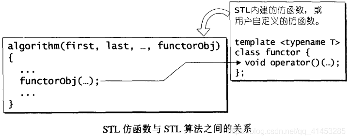

# 仿函数

## 仿函数概述

- **仿函数**（functors）是早期的命名，C++标准规则定案后所采用的的新名称是**函数对象**（function objects）
- **仿函数的作用是什么？**从前面的算法解析可以看出，有的算法提供第二个版本，该版本提供允许用户指定任何“操作”，然后以该操作来决定算法的执行功能。要将这种“操作”当做算法的参数，先将该操作设计为一个函数，再将函数指针当做算法的一个参数或者将该“操作”设计为一个所谓的仿函数（就语言层面来说是个class），再以该仿函数产生一个对象，并以此对象作为算法的一个参数
- 上面提到，既然函数指针可以达到“将函数当做算法的参数”，那又为什么设计仿函数呢？是因为函数指针不能满足STL对抽象性的要求，也不能满足软件积木的要求——函数指针无法和STL其他组件（如配接器adapter）搭配，产生更灵活的变化



> ### 仿函数就是一个“行为类似函数”的对象
>
> - 为了能够达到“行为类似函数”的目的，其类型定义中必须自定义（或者说重载、改写）function call**运算子（operator()）**
> - 拥有这样的运算子后，我们就可以**在仿函数的对象后面加上一对小括号，**以此来**调用仿函数所定义的operator()**
> - 例如下面就是调用STL提供的greater仿函数：
>   - 第一种用法是产生一个名为ig的对象，然后调用其operator()
>   - 第二种调用方式是产生一个临时（无名的）对象，然后调用其operator()。这种方式才**是仿函数的主流用法**
>
> ```c++
> #include <iostream>
> #include <functional>
> using namespace std;
>  
> int main()
> {
>     greater<int> ig;
>  
>     std::cout << boolalpha << ig(4, 6) << std::endl;
>     std::cout << greater<int>()(6, 4) << std::endl;
>  
>     return 0;
> }
>  
> //boolalpha是把bool值显示为true或false
> ```
>
> ### 仿函数的分类
>
> - **以操作数的个数划分：**分为一元仿函数与二元仿函数
> - **以功能划分：**分为算术运算、关系运算、逻辑运算

- 应用层头文件为：<functional>；STL源码实现于<stl_function.h>

## 可配接的关键

- 在STL六大组件中，仿函数是体积最小、观念最简单、实现最容易的一种。而仿函数扮演着一种“策略”角色：
  - 可以让STL算法有更灵活的演出
  - 更加灵活的关键在于STL**仿函数的可配接性**
- 仿函数可以让函数配接器（function adapter）修饰，彼此串接在一起。为了拥有配接能力，**每一个仿函数必须定义自己的相应类型：**
  - 这些类型是为了**让配接器能够取出，获得仿函数的某些信息**。相应的类型都只是一些typedef，所有必要操作在编译器就能全部完成了，对程序的执行效率没有任何影响，不带来任何额外负担
  - 仿函数的相应类型主要用来表现**仿函数参数类型和返回值类型**
  - 这就类似于迭代器如果想要融入STL，迭代器定义了自己的5个相应类型
- 为了方便起见，<stl_function.h>中**定义了两个类**，分别代表**一元仿函数和二元仿函数**，其中没有任何data members或member functions，**唯有一些类型定义**
- 对于仿函数，只要根据个人需要**选择继承其中一个就可以了，**便自动拥有了那些相应类型，也就自动拥有了配接能力

> ### unary_function
>
> - unary_function用来表现**一元函数的参数类型和返回值类型**
> - **其定义如下：**
>
> ```c++
> //STL规定，每一个Adaptable Unary Function都应该继承这个类
> template <class _Arg, class _Result>
> struct unary_function {
>   typedef _Arg argument_type;  //参数类型
>   typedef _Result result_type; //返回值类型
> };
> ```
>
> - 一旦某个仿函数继承了unary_function，其用户就可以**取得该仿函数的参数类型，或其返回值类型**（下面未显示）：
>
> ```c++
> //此仿函数继承于unary_function
> template<class T>
> struct negate :public unary_function<T, T>{
>     T operator()(const T& x)const { return -x; }
> };
>  
> //以下配接器用来表示某个仿函数的逻辑负值
> template<class Predicate>
> class unary_negate
> {
>     //...
> public:
>     //通过typename获得其中的参数类型
>     bool operator()(const typename Predicate::argument_type& x)const {
>     //...
>     }
>     //...
> };
> ```

> ### binary_function
>
> - binary_function用来表现二**元函数的参数类型和返回值类型**
> - **其定义如下：：**
>
> ```c++
> template <class _Arg1, class _Arg2, class _Result>
> struct binary_function {
>   typedef _Arg1 first_argument_type;
>   typedef _Arg2 second_argument_type;
>   typedef _Result result_type;
> }; 
> ```
>
> - 一旦某个仿函数继承了binary_function，其用户就可以**取得该仿函数的参数类型，或其返回值类型**（下面未显示）：
>
> ```c++
> //此仿函数继承于binary_function
> template<class T>
> struct plus :public binary_function<T, T, T>{
> 	T operator()(const T& x, const T& y)const { return x + y; }
> };
>  
> //以下配接器用来将某个二元仿函数转换为一元仿函数
> template<class Operation>
> class binder1st
> {
>     //...
> protected:
> 	Operation op;
> 	typename Operation::fist_argument_type value; //将其参数1类型，别名为value
> public:
>     //下面是operator()的定义
> 	typename Operation::result_type
> 		operator()(const typename Operation::second_argument_type& x)
> 	{
> 		//...
> 	}
>     //...
> };
> ```

## 算术类(Arithmetic)仿函数

- STL内建的“算术类仿函数”，支持加法、减法、乘法、除法、模数（余数）、和否定运算
- 除了“否定”运算为一元运算，其余都是二元运算
- **包含如下：**
  - **加法：plus<T>**
  - **减法：minus<T>**
  - **乘法：multiplies<T>**
  - **除法：divides<T>**
  - **模取（modulus）：modulus<T>**
  - **否定（negation）：negate<T>**
- **例如下面的代码表示要以1为基本元素，对vector中的每一个元素进行乘法运算：**

```c++
accumulate(iv.begin(), iv.end(), multiplies<int>());
```

> ### 源码如下：
>
> ```c++
> template <class _Tp>
> struct plus : public binary_function<_Tp,_Tp,_Tp> {
>   _Tp operator()(const _Tp& __x, const _Tp& __y) const { return __x + __y; }
> };
> 
> template <class _Tp>
> struct minus : public binary_function<_Tp,_Tp,_Tp> {
>   _Tp operator()(const _Tp& __x, const _Tp& __y) const { return __x - __y; }
> };
> 
> template <class _Tp>
> struct multiplies : public binary_function<_Tp,_Tp,_Tp> {
>   _Tp operator()(const _Tp& __x, const _Tp& __y) const { return __x * __y; }
> };
> 
> template <class _Tp>
> struct divides : public binary_function<_Tp,_Tp,_Tp> {
>   _Tp operator()(const _Tp& __x, const _Tp& __y) const { return __x / __y; }
> };
> 
> template <class _Tp>
> struct modulus : public binary_function<_Tp,_Tp,_Tp> 
> {
>   _Tp operator()(const _Tp& __x, const _Tp& __y) const { return __x % __y; }
> };
> 
> template <class _Tp>
> struct negate : public unary_function<_Tp,_Tp> 
> {
>   _Tp operator()(const _Tp& __x) const { return -__x; }
> };
> ```

> ### 演示案例
>
> ```c++
> #include <iostream>
> #include <functional>
> using namespace std;
>  
> int main()
> {
>     plus<int> plusobj;
>     minus<int> minusobj;
>     multiplies<int> multipliesobj;
>     divides<int> dividesobj;
>     modulus<int> modulusobj;
>     negate<int> negateobj;
>  
>     std::cout << plusobj(3, 5) << std::endl;
>     std::cout << minusobj(3, 5) << std::endl;
>     std::cout << multipliesobj(3, 5) << std::endl;
>     std::cout << dividesobj(3, 5) << std::endl;
>     std::cout << modulusobj(3, 5) << std::endl;
>     std::cout << negateobj(3) << std::endl;
>  
>     std::cout << "**************************" << std::endl;
>  
>     std::cout << plus<int>()(3, 5) << std::endl;
>     std::cout << minus<int>()(3, 5) << std::endl;
>     std::cout << multiplies<int>()(3, 5) << std::endl;
>     std::cout << divides<int>()(3, 5) << std::endl;
>     std::cout << modulus<int>()(3, 5) << std::endl;
>     std::cout << negate<int>()(3) << std::endl;
>  
>     return 0;
> }
> ```

> ### 证同元素（identity element）
>
> - 所谓“运算op的证同元素”，意思是说**数值A若与该元素做op运算，会得到A自己**
> - **例如：**加法的证同元素为0（因为任何元素加上0仍为自己）。乘法的证同元素为1（任何元素乘以1仍为自己）
> - 下面这些函数并非STL标准中的一员，但很多STL实现都有它们：
>
> ```c++
> // identity_element (not part of the C++ standard).
> 
> template <class _Tp> inline _Tp identity_element(plus<_Tp>) {
>   return _Tp(0);
> }
> template <class _Tp> inline _Tp identity_element(multiplies<_Tp>) {
>   return _Tp(1);
> }
> ```

## 关系运算类(Relational)仿函数

- STL内建的“关系运算类仿函数”，支持等于、不等于、大于、大于等于、小于、小于等于六种运算
- 每一个都是二元运算
- **包含如下：**
  - **等于（equality）：equal_to<T>**
  - **不等于（inequality）：not_equal_to<T>**
  - **大于（greater than）：greater<T>**
  - **大于或等于（greater than or equal）：greater_equal<T>**
  - **小于（less than）：less<T>**
  - **小于或等于（less than or equal）：less_equal<T>**
- **例如下面的代码表示以递增次序对vector进行排序：**

```c++
sort(iv.begin(), iv.end(), greater<int>());
```

> ### **源码如下：**
>
> ```c++
> template <class _Tp>
> struct equal_to : public binary_function<_Tp,_Tp,bool> 
> {
>   bool operator()(const _Tp& __x, const _Tp& __y) const { return __x == __y; }
> };
> 
> template <class _Tp>
> struct not_equal_to : public binary_function<_Tp,_Tp,bool> 
> {
>   bool operator()(const _Tp& __x, const _Tp& __y) const { return __x != __y; }
> };
> 
> template <class _Tp>
> struct greater : public binary_function<_Tp,_Tp,bool> 
> {
>   bool operator()(const _Tp& __x, const _Tp& __y) const { return __x > __y; }
> };
> 
> template <class _Tp>
> struct less : public binary_function<_Tp,_Tp,bool> 
> {
>   bool operator()(const _Tp& __x, const _Tp& __y) const { return __x < __y; }
> };
> 
> template <class _Tp>
> struct greater_equal : public binary_function<_Tp,_Tp,bool>
> {
>   bool operator()(const _Tp& __x, const _Tp& __y) const { return __x >= __y; }
> };
> 
> template <class _Tp>
> struct less_equal : public binary_function<_Tp,_Tp,bool> 
> {
>   bool operator()(const _Tp& __x, const _Tp& __y) const { return __x <= __y; }
> };
> ```

> ### 演示案例
>
> ```c++
> #include <iostream>
> #include <functional>
> using namespace std;
>  
> int main()
> {
>     equal_to<int> equal_to_obj;
>     not_equal_to<int> not_equal_to_obj;
>     greater<int> greater_obj;
>     greater_equal<int> greater_equal_obj;
>     less<int> less_obj;
>     less_equal<int> less_equal_obj;
>  
>     std::cout << equal_to_obj(3, 5) << std::endl;
>     std::cout << not_equal_to_obj(3, 5) << std::endl;
>     std::cout << greater_obj(3, 5) << std::endl;
>     std::cout << greater_equal_obj(3, 5) << std::endl;
>     std::cout << less_obj(3, 5) << std::endl;
>     std::cout << less_equal_obj(3, 5) << std::endl;
>  
>     std::cout << "**************************" << std::endl;
>  
>     std::cout << equal_to<int>()(3, 5) << std::endl;
>     std::cout << not_equal_to<int>()(3, 5) << std::endl;
>     std::cout << greater<int>()(3, 5) << std::endl;
>     std::cout << greater_equal<int>()(3, 5) << std::endl;
>     std::cout << less<int>()(3, 5) << std::endl;
>     std::cout << less_equal<int>()(3, 5) << std::endl;
>  
>     return 0;
> }
> ```

## 逻辑运算类(Logical)仿函数

- STL内建的“逻辑运算类仿函数”，支持逻辑运算中的And、Or、Not三种运算
- 其中And和Or为二元运算，Not为一元运算
- **包含如下：**
  - **逻辑运算 And：logical_and<T>**
  - **逻辑运算Or：logical_or<T>**
  - **逻辑运算 Not：logical_not<T>**

> ### 源码如下：
>
> ```c++
> template <class _Tp>
> struct logical_and : public binary_function<_Tp,_Tp,bool>
> {
>   bool operator()(const _Tp& __x, const _Tp& __y) const { return __x && __y; }
> };
> 
> template <class _Tp>
> struct logical_or : public binary_function<_Tp,_Tp,bool>
> {
>   bool operator()(const _Tp& __x, const _Tp& __y) const { return __x || __y; }
> };
> 
> template <class _Tp>
> struct logical_not : public unary_function<_Tp,bool>
> {
>   bool operator()(const _Tp& __x) const { return !__x; }
> };
> ```

> ### 演示案例
>
> ```c++
> #include <iostream>
> #include <functional>
> using namespace std;
>  
> int main()
> {
> 	
>     logical_and<int> and_obj;
>     logical_or<int> or_obj;
>     logical_not<int> not_obj;
>     
>     std::cout << and_obj(true, true) << std::endl;
>     std::cout << or_obj(true, true) << std::endl;
>     std::cout << not_obj(true) << std::endl;
>  
>     std::cout << "**************************" << std::endl;
>  
>     std::cout << logical_and<int>()(true, true) << std::endl;
>     std::cout << logical_or<int>()(true, true) << std::endl;
>     std::cout << logical_not<int>()(true) << std::endl;
>  
>     return 0;
> }
> ```

## 证同(identity)、选择(select)、投射(project)

- 下面介绍的这些仿函数，都只是将其参数原封不动地传回。其中某些仿函数对传回的参数有刻意的选择，或者刻意的忽略
- 之所以不在STL或其他泛型程序中直接使用原本及其简单的identity、project、select等操作，而要再划分一层出来，全是为了间接性——间接性是抽象化的重要工具
- C++标准并未包含下面的这几个仿函数，不过它们常常存在于各个实现品作为内部使用。下面是SGI STL的版本

> ### identity
>
> ```c++
> //证同函数。任何数值通过此函数后，不会有任何改变
> // 此式运用于<stl_set.h>，用来指定RB-tree所需的KeyOfValue op
> // 那是因为set元素的键值即实值，所以采用identity
> // identity is an extensions: it is not part of the standard.
> template <class _Tp>
> struct _Identity : public unary_function<_Tp,_Tp> {
>   const _Tp& operator()(const _Tp& __x) const { return __x; }
> };
> template <class _Tp> struct identity : public _Identity<_Tp> {};
> ```

> ### select1st select2nd
>
> ```c++
> // select1st and select2nd are extensions: they are not part of the standard.
> // 选择函数。接受一个pair，传回其第一元素
> // 此式运用于<stl_map.h>，用来指定RB-tree所需的KeyOfValue op
> // 由于map系以pair元素的第一元素为其键值，所以采用select1st
> template <class _Pair>
> struct _Select1st : public unary_function<_Pair, typename _Pair::first_type> {
>   const typename _Pair::first_type& operator()(const _Pair& __x) const {
>     return __x.first;
>   }
> };
> 
> // 选择函数。接受一个pair，传回其第二元素
> template <class _Pair>
> struct _Select2nd : public unary_function<_Pair, typename _Pair::second_type>
> {
>   const typename _Pair::second_type& operator()(const _Pair& __x) const {
>     return __x.second;
>   }
> };
> 
> template <class _Pair> struct select1st : public _Select1st<_Pair> {};
> template <class _Pair> struct select2nd : public _Select2nd<_Pair> {};
> ```

> ### project1st project1st
>
> ```c++
> // project1st and project2nd are extensions: they are not part of the standard
> // 投射函数：传回第一参数，忽略第二参数
> template <class _Arg1, class _Arg2>
> struct _Project1st : public binary_function<_Arg1, _Arg2, _Arg1> {
>   _Arg1 operator()(const _Arg1& __x, const _Arg2&) const { return __x; }
> };
> 
> // 投射函数：传回第二参数，忽略第一参数
> template <class _Arg1, class _Arg2>
> struct _Project2nd : public binary_function<_Arg1, _Arg2, _Arg2> {
>   _Arg2 operator()(const _Arg1&, const _Arg2& __y) const { return __y; }
> };
> 
> template <class _Arg1, class _Arg2> 
> struct project1st : public _Project1st<_Arg1, _Arg2> {};
> 
> template <class _Arg1, class _Arg2>
> struct project2nd : public _Project2nd<_Arg1, _Arg2> {};
> ```