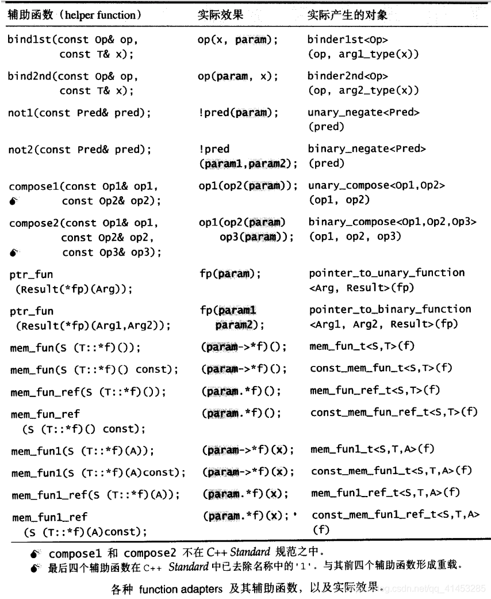

# 配接器

## 配接器介绍

配接器(adapters)在STL组件的灵活组合运用功能上，扮演着轴承、转换器的角色。Adapter这个概念，事实上是一种设计模式。<<Design Patterns>>一书中对adapter的定义如下：将一个class的接口转换为另一个class的接口，使原本因接口不兼容而不能合作的classes，可以一起运作。

**STL提供的各种配接器中：**

- 改变仿函数接口者：称为function adapter
- 改变容器接口者：称为container adapter
- 改变迭代器接口者：称为iterator adapter

## 容器配接器(container adapters)

- STL提供的两个容器queue和stack，其实**都只是配接器而已**
- 它们都是**修饰deque的接口而形成另一种容器风格**

### stack

- stack的底层由deque构成
- 应用层使用要包含头文件<stack>，SGI STL将所有的实现细节定义于<stl_stack.h>中
- stack类封装了deque对外接口，只开放符合stack原则的几个函数，所以说stack是一个配接器，一个作用于容器之上的配接器

```c++
template<class T,class Sequence=deque<T>>
class stack
{
protected:
    Sequence c; //底层容器
};
```

### queue

- queue的底层由deque构成
- 应用层使用要包含头文件<queue>，SGI STL将所有的实现细节定义于<stl_queue.h>中
- queue类封装了deque对外接口，只开放符合queue原则的几个函数，所以说queue是一个配接器，一个作用于容器之上的配接器

```c++
template<class T, class Sequence = deque<T>>
class queue
{
protected:
    Sequence c; //底层容器
};
```

## 迭代器配接器(iterator adapters)

- STL提供了很多用于迭代器身上的配接器，包括insert iterator、reverse iterator、iostream iterator
- 应用层使用应该包含<iterator>，SGI STL将它们实现于<stl_iterator.h>中
- 不同于后面介绍的仿函数配接器总以仿函数为参数。这里介绍的迭代器配接器**很少以迭代器作为直接参数**。所谓迭代器的修饰，只是一种概念上的改变

### Insert Iterators

- 所谓insert iterators，可以将**一般迭代器的赋值操作转换为插入操作**
- **大致介绍：**
  - 每一个insert iterators内部都维护一个容器（必须由用户指定）
  - 容器当然有自己的迭代器，于是，当客户端对insert iterators做赋值操作时，就在insert iterators中被转换为对该容器的迭代器做插入操作。也就是说，在insert iterators的operator=操作符中调用底层容器的push_front()、push_back()、或insert()操作函数
  - 至于其他的迭代器行为例如：operator++、operator*、operator--、operator->等都被关闭了
  - 也就是说insert itertators的前进、后退、取值、成员取用等操作都是没有意义的
- **这样的迭代器类包括：**
  - 专用于尾端插入操作的back_insert_iterator
  - 专用于头端插入操作的front_insert_iterator
  - 可从任意位置插入操作的insert_iterator
- 由于上面三个iterator adapters的使用接口不是很直观，于是**STL提供了下图所示的三个函数，提升使用时的便利性：**

| 辅助函数(help function)             | 实际产生的对象                                         |
| ----------------------------------- | ------------------------------------------------------ |
| Back_inserter(Container& x);        | back_insert_iterator<Container>(x);                    |
| front_inserter(Container& x);       | front_insert_iterator<Container>(x);                   |
| inserter(Container& x, Iterator i); | insert_iterator<Container>(x, Container::iterator(i)); |

> ### back_insert_iterator类、back_inserter()函数
>
> ```c++
> //这是一个迭代器配接器，用来将某个迭代器的赋值操作改为插入操作——改为从容器的尾端插入
> template <class _Container>
> class back_insert_iterator {
> protected:
>   _Container* container; // 底层容器
> public:
>   typedef _Container          container_type;
>   typedef output_iterator_tag iterator_category;
>   typedef void                value_type;
>   typedef void                difference_type;
>   typedef void                pointer;
>   typedef void                reference;
> 
>   //构造函数使back_insert_iterator与容器绑定起来
>   explicit back_insert_iterator(_Container& __x) : container(&__x) {}
>   back_insert_iterator<_Container>&
>   operator=(const typename _Container::value_type& __value) { 
>     container->push_back(__value); //这里是关键，直接调用push_back()
>     return *this;
>   }
>   
>   //下面的操作符对back_insert_iterator不起作用(关闭功能)
>   //因此都返回自己
>   back_insert_iterator<_Container>& operator*() { return *this; }
>   back_insert_iterator<_Container>& operator++() { return *this; }
>   back_insert_iterator<_Container>& operator++(int) { return *this; }
> };
> ```
>
> ```c++
> //这是一个辅助函数，方便我们使用back_insert_iterator
> template <class _Container>
> inline back_insert_iterator<_Container> back_inserter(_Container& __x) {
>   return back_insert_iterator<_Container>(__x);
> }
> ```
>
> ### 演示案例
>
> ```c++
> #include <iostream>
> #include <iterator>
> #include <deque>
> #include <algorithm>
> using namespace std;
>  
> int main()
> {
>     ostream_iterator<int> outiter(cout, " ");
>  
>     int ia[] = { 0,1,2,3,4,5 };
>     deque<int> id(ia, ia + 6);
>  
>     //将3插入id的尾部
>     copy(ia+3, ia + 4, back_inserter(id));
>  
>     //输出id的内容
>     copy(id.begin(), id.end(), outiter);  // 0 1 2 3 4 5 3
>     cout << endl;
>  
>     return 0;
> }
> ```

> ### front_insert_iterator类、front_inserter()函数
>
> ```c++
> //这是一个迭代器配接器，用来将某个迭代器的赋值操作改为插入操作——改为从容器的头部插入
> //注意，该容器不支持vector，因为vector没有提供push_front()函数
> template <class _Container>
> class front_insert_iterator {
> protected:
>   _Container* container;
> public:
>   typedef _Container          container_type;
>   typedef output_iterator_tag iterator_category;
>   typedef void                value_type;
>   typedef void                difference_type;
>   typedef void                pointer;
>   typedef void                reference;
> 
>   explicit front_insert_iterator(_Container& __x) : container(&__x) {}
>   front_insert_iterator<_Container>&
>   operator=(const typename _Container::value_type& __value) { 
>     container->push_front(__value);//这里是关键，直接调用push_front()
>     return *this;
>   }
>   front_insert_iterator<_Container>& operator*() { return *this; }
>   front_insert_iterator<_Container>& operator++() { return *this; }
>   front_insert_iterator<_Container>& operator++(int) { return *this; }
> };
> ```
>
> ```c++
> //这是一个辅助函数，方便我们使用front_insert_iterator
> template <class _Container>
> inline front_insert_iterator<_Container> front_inserter(_Container& __x) {
>   return front_insert_iterator<_Container>(__x);
> }
> ```
>
> ### 演示案例
>
> ```c++
> #include <iostream>
> #include <iterator>
> #include <deque>
> #include <algorithm>
> using namespace std;
>  
> int main()
> {
>     ostream_iterator<int> outiter(cout, " ");
>  
>     int ia[] = { 0,1,2,3,4,5 };
>     deque<int> id(ia, ia + 6);
>  
>     //将1插入头部
>     copy(ia + 1, ia + 2, front_inserter(id));
>  
>     //输出容器中的内容
>     copy(id.begin(), id.end(), outiter); // 1 0 1 2 3 4 5
>     cout << endl;
>     
>     return 0;
> }
> ```

>### insert_iterator类、inserter()函数
>
>```c++
>//这是一个迭代器配接器，用来将某个迭代器的赋值操作改为插入操作——在任意位置上插入
>//并将迭代器右移一个位置——如此便可以方便地连续插入
>//表面上是赋值操作，实际上是插入操作
>template <class _Container>
>class insert_iterator {
>protected:
>  _Container* container;
>  typename _Container::iterator iter;
>public:
>  typedef _Container          container_type;
>  typedef output_iterator_tag iterator_category;
>  typedef void                value_type;
>  typedef void                difference_type;
>  typedef void                pointer;
>  typedef void                reference;
>
>  insert_iterator(_Container& __x, typename _Container::iterator __i) 
>    : container(&__x), iter(__i) {}
>  insert_iterator<_Container>&
>  operator=(const typename _Container::value_type& __value) { 
>    iter = container->insert(iter, __value);//关键，直接调用insert()
>    ++iter;//使insert iterator永远随其目标而移动
>    return *this;
>  }
>  insert_iterator<_Container>& operator*() { return *this; }
>  insert_iterator<_Container>& operator++() { return *this; }
>  insert_iterator<_Container>& operator++(int) { return *this; }
>};
>```
>
>```c++
>//这是一个辅助函数，方便我们使用insert_iterator
>template <class _Container, class _Iterator>
>inline 
>insert_iterator<_Container> inserter(_Container& __x, _Iterator __i)
>{
>  typedef typename _Container::iterator __iter;
>  return insert_iterator<_Container>(__x, __iter(__i));
>}
>```
>
>### 演示案例
>
>```c++
>#include <iostream>
>#include <iterator>
>#include <deque>
>#include <algorithm>
>using namespace std;
> 
>int main()
>{
>    ostream_iterator<int> outiter(cout, " ");
> 
>    int ia[] = { 0,1,2,3,4,5 };
>    deque<int> id(ia, ia + 6);
> 
>    //找出元素5所在的迭代器位置
>    deque<int>::iterator iter = find(id.begin(), id.end(), 5);
> 
>    //将0、1、2插入在5的前面
>    copy(ia + 0, ia + 3, inserter(id, iter));
> 
>    //于是输出0 1 2 3 4 0 1 2 5
>    copy(id.begin(), id.end(), outiter); //0 1 2 3 4 0 1 2 5
>    cout << endl;
>    return 0;
>}
>```

### Reverse Iterators

- Reverse Iterators，就是将一般迭代器的行进方向逆转：
  - 使原本应该前进的operator++变成后退操作
  - 使原本应该后退的operator--变成前进操作
- 如果STL算法接受的不是一般的迭代器，而是这种逆向迭代器，它就会从尾到头的方向来处理序列中的元素。例如：

```c++
//将所有元素逆向拷贝到iter迭代器所在的位置
//rbegin、rend与reverse_iterator有关
copy(id.rbegin(), id.rend(), iter);
```

> ### rbegin()、rend()
>
> - 大部分STL容器实现了这两个操作
> - 单向序列容器如slist不可以使用reverse iterators，有些容器如stack、queue、priority_queue并不提供begin()、end()，当然也就没有rbegin()、rend()
> - **例如下面是vector的源码：**
>
> ```c++
> template<class T,class Alloc=alloc>
> class vector
> {
> public:
>     typedef T value_type;
>     typedef value_type* iterator;
>     typedef reverse_iterator<iterator> reverse_iterator;
>  
>     reverse_iterator rbegin() { return reverse_iterator(end()); }
>     reverse_iterator rend() { return reverse_iterator(begin()); }
> };
> ```
>
> - **例如下面是list的源码：**
>
> ```c++
> template<class T, class Alloc = alloc>
> class list
> {
> public:
>     typedef __list_iterator<T, T&, T*> iterator;
>     typedef reverse_iterator<iterator> reverse_iterator;
>  
>     reverse_iterator rbegin() { return reverse_iterator(end()); }
>     reverse_iterator rend() { return reverse_iterator(begin()); }
> };
> ```
>
> - **例如下面是deque的源码：**
>
> ```c++
> template<class T, class Alloc = alloc,size_t BufSiz=0>
> class deque
> {
> public:
>     typedef __deque_iterator<T, T&, T*,BufSiz> iterator;
>     typedef reverse_iterator<iterator> reverse_iterator;
> 	
>     iterator begin() { return start; }
>     iterator end() { return finish; }
>  
>     reverse_iterator rbegin() { return reverse_iterator(finish()); }
>     reverse_iterator rend() { return reverse_iterator(start()); }
> };
> ```
>
> ### 演示案例
>
> ```c++
> #include <iostream>
> #include <iterator>
> #include <deque>
> #include <algorithm>
> using namespace std;
>  
> int main()
> {
>     int ia[] = { 32,26,99,1,0,1,2,3,4,0,1,2,5,3 };
>     deque<int> id(ia, ia + 14);
>  
>     std::cout << *(id.begin()) << std::endl;  //32
>     std::cout << *(id.rbegin()) << std::endl; //3
>     //*(id.end())   //0
>     //*(id.rend())  //0
>     std::cout << std::endl;
>  
>     auto iter = find(id.begin(), id.end(), 99);
>     reverse_iterator<deque<int>::iterator > riter(iter);
>     std::cout << *iter << std::endl; //99
>     std::cout << *riter << std::endl;//26
>     return 0;
> }
> ```
>
> - 为什么上面“正向迭代器”和“逆向迭代器”取出不同的元素呢？因为begin()、end()与rbegin()、rend()的逻辑位置变了
>
> 
>
> - 当我们将一个正向迭代器区间转换为一个逆向迭代器区间后，不必再有任何额外处理，就可以让接受这个逆向迭代器区间的算法，以相反的元素依次来处理区间中的每一个元素，例如：
>
> ```c++
> #include <iostream>
> #include <iterator>
> #include <deque>
> #include <algorithm>
> using namespace std;
>  
> int main()
> {
>     ostream_iterator<int> outiter(cout, " ");
>  
>     int ia[] = { 0,1,2,3,4,5 };
>     deque<int> id(ia, ia + 6);
>  
>     //0 1 2 3 4 5
>     copy(id.begin(), id.end(), outiter);
>     cout << endl;
>  
>     //5 4 3 2 1 0
>     copy(id.rbegin(), id.rend(), outiter);
>     cout << endl;
>  
>     return 0;
> }
> ```
>
> - 注意，上述的id.rbegin()是个暂时对象，相当于：
>
> ```c++
> reverse_iterator<deque<int>::iterator >(id.end());//指向本例的最后元素
> deque<int>::reverse_iterator(id.end()); //指向本例的最后元素
> ```
>
> - 其中的deque<int>::reverse_iterator是一种类型定义

> ### reverse_iterator源码
>
> ```c++
> //迭代器配接器，用来将某个迭代器逆反前进方向
> template <class _Iterator>
> class reverse_iterator 
> {
> protected:
>   _Iterator current; //记录对应之正向迭代器
> public:
>   //5种与迭代器相关的类型
>   typedef typename iterator_traits<_Iterator>::iterator_category
>           iterator_category;
>   typedef typename iterator_traits<_Iterator>::value_type
>           value_type;
>   typedef typename iterator_traits<_Iterator>::difference_type
>           difference_type;
>   typedef typename iterator_traits<_Iterator>::pointer
>           pointer;
>   typedef typename iterator_traits<_Iterator>::reference
>           reference;
> 
>   typedef _Iterator iterator_type; //正向迭代器
>   typedef reverse_iterator<_Iterator> _Self; //逆向迭代器
> 
> public:
>   reverse_iterator() {}
>   //将reverse_iterator与某个迭代器x关联起来
>   explicit reverse_iterator(iterator_type __x) : current(__x) {}
> 
>   reverse_iterator(const _Self& __x) : current(__x.current) {}
> #ifdef __STL_MEMBER_TEMPLATES
>   template <class _Iter>
>   reverse_iterator(const reverse_iterator<_Iter>& __x)
>     : current(__x.base()) {}
> #endif /* __STL_MEMBER_TEMPLATES */
>     
>   iterator_type base() const { return current; }//取出对应的正向迭代器
>   reference operator*() const {
>     _Iterator __tmp = current;
>     return *--__tmp;
>     //以上关键在于。对逆向迭代器取值，“对应的正向迭代器”后退一位取值
>   }
> #ifndef __SGI_STL_NO_ARROW_OPERATOR
>   pointer operator->() const { return &(operator*()); }
> #endif /* __SGI_STL_NO_ARROW_OPERATOR */
> 
>   //前进变后退
>   _Self& operator++() {
>     --current;
>     return *this;
>   }
>   _Self operator++(int) {
>     _Self __tmp = *this;
>     --current;
>     return __tmp;
>   }
>   //后退变前进
>   _Self& operator--() {
>     ++current;
>     return *this;
>   }
>   _Self operator--(int) {
>     _Self __tmp = *this;
>     ++current;
>     return __tmp;
>   }
>   //前进与后退方向逆转
>   _Self operator+(difference_type __n) const {
>     return _Self(current - __n);
>   }
>   _Self& operator+=(difference_type __n) {
>     current -= __n;
>     return *this;
>   }
>   _Self operator-(difference_type __n) const {
>     return _Self(current + __n);
>   }
>   _Self& operator-=(difference_type __n) {
>     current += __n;
>     return *this;
>   }
>   //下面第一个*和唯一一个+都会调用本类的operator*和operator+
>   //第二个*则不会
>   reference operator[](difference_type __n) const { return *(*this + __n); }  
> }; 
> ```
>
> - 下面是另一些测试：
>
> ```c++
> #include <iostream>
> #include <iterator>
> #include <deque>
> #include <algorithm>
> using namespace std;
>  
> int main()
> {
>     int ia[] = { 1,0,1,2,3,4,0,1,2,5,3 };
>     deque<int> id(ia, ia + 11);
>  
>     deque<int>::reverse_iterator riter(id.end());
>     std::cout << *(riter) << std::endl;       //3
>     std::cout << *(++++++riter) << std::endl; //1(前进3个位置后取值)
>     std::cout << *(--riter) << std::endl;     //2(后退1个位置后取值)
>     std::cout << *(riter.base()) << std::endl;//5(恢复正向迭代器后，取值)
>     std::cout << riter[3] << std::endl;       //4(前进3个位置后取值)
>     return 0;
> }
> ```
>
> 
>
> - 图片说明：rbegin()连续三次累加后，退后一格，然后再以标注表示法[3]前进三格。由于是逆向迭代器，所以方向与一般的正向迭代器恰恰相反

### IOStream Iterators

- IOStream Iterators，就是将迭代器绑定到某个iostream对象身上
- **这样的迭代器类包括：**
  - 绑定istream（例如std::cin）身上，称为istream_iterator，拥有输入能力
  - 绑定ostream（例如std::cout）身上，称为ostream_iterator，拥有输出能力，这种迭代器运用于屏幕输出，十分方便
- 以它们为蓝图，稍加修改，便可适用于任何输出或输入装置上。例如，你可以在了解iostream iterator之后，完成一个绑定到Internet Explorer cache身上的迭代器，或是完成一个系结到磁盘目录上的一个迭代器

> ### istream_iterator源码
>
> - 所谓绑定一个istream，其实就是在istream iterator内部维护 一个istream member，客户端对于这个迭代器所做的operator++操作，会被引导调用迭代器内部所含的那个istream member的输入操作（operator>>）
> - 这个迭代器是个Input Iterator，不具备operator--
> - **源码如下：**
>
> ```c++
> template <class _Tp, class _Dist>
> class istream_iterator {
> #ifdef __STL_TEMPLATE_FRIENDS
>   template <class _T1, class _D1>
>   friend bool operator==(const istream_iterator<_T1, _D1>&,
>                          const istream_iterator<_T1, _D1>&);
> #else /* __STL_TEMPLATE_FRIENDS */
>   friend bool __STD_QUALIFIER
>   operator== __STL_NULL_TMPL_ARGS (const istream_iterator&,
>                                    const istream_iterator&);
> #endif /* __STL_TEMPLATE_FRIENDS */
> 
> protected:
>   istream* _M_stream;
>   _Tp _M_value;
>   bool _M_end_marker;
>   void _M_read() {
>     _M_end_marker = (*_M_stream) ? true : false;
>     if (_M_end_marker) *_M_stream >> _M_value;
>     //以上，输入之后，stream的状态可能改变，所以下面再判断一次以决定end_marker
>     //当读到eof或读到类型不符的数据时，stream处于false状态
>     _M_end_marker = (*_M_stream) ? true : false;
>   }
> public:
>   typedef input_iterator_tag  iterator_category;
>   typedef _Tp                 value_type;
>   typedef _Dist               difference_type;
>   typedef const _Tp*          pointer;
>   typedef const _Tp&          reference;
> 
>   istream_iterator() : _M_stream(&cin), _M_end_marker(false) {}
>   istream_iterator(istream& __s) : _M_stream(&__s) { _M_read(); }
>   reference operator*() const { return _M_value; }
> #ifndef __SGI_STL_NO_ARROW_OPERATOR
>   pointer operator->() const { return &(operator*()); }
> #endif /* __SGI_STL_NO_ARROW_OPERATOR */
>   
>   //迭代器前进一个位置，就代表要读取一次数据
>   istream_iterator<_Tp, _Dist>& operator++() { 
>     _M_read(); 
>     return *this;
>   }
>   istream_iterator<_Tp, _Dist> operator++(int)  {
>     istream_iterator<_Tp, _Dist> __tmp = *this;
>     _M_read();
>     return __tmp;
>   }
> };
> ```
>
> - 源码告诉我们，只要客户端定义一个istream iterator并绑定到某个istream对象上，程序便会停在istream_iterator<T>::read()函数等待输入。这并不是我们预期的行为，因此，请在绝对必要的时候才定义你所需要的istream iterator
>
> ### 演示案例
>
> - 下图是copy()和istream iterator使用的例子：
>   - copy()有能力判断各种迭代器的类型，由于istream_iterator是个InputIterator，所以copy()最后会进入下图中的copy()源码中
> - 我们发现，当客户端初次定义了一个istream_iterator<T>对象并绑定到标准输入设备cin时，便调用istream_iterator<T>::read()读取cin的值，此值被放置于data member value中。然后进入循环，做这样的事情：
>
> ```c++
> *result = *first;  // first是一个istream_iterator object
> ```
>
> - 根据istream_iterator的定义，对first取值就是返回data member value，也就是从cin获得的值。此值被赋值给*result。当copy()中的for循环进入下一次迭代时，会引发++first，而根据istream_iterator的定义，对first累加，就是再从cin中读值...如此持续下去，直到first==last为止。last代表的是一个end-of-stream标记，在各个系统上可能都不相同
>
> 

> ### ostream_iterator源码
>
> - 所谓绑定一个ostream，其实就是在ostream iterator内部维护 一个ostream member，客户端对于这个迭代器所做的operator=操作，会被引导调用迭代器内部所含的那个ostream member的输出操作（operator<<）
> - 这个迭代器是个Output Iterator
>
> ```c++
> template <class _Tp>
> class ostream_iterator {
> protected:
>   ostream* _M_stream;
>   const char* _M_string;//每次输出后的间隔符号,变量名称为string
> public:
>   typedef output_iterator_tag iterator_category;
>   typedef void                value_type;
>   typedef void                difference_type;
>   typedef void                pointer;
>   typedef void                reference;
> 
>   ostream_iterator(ostream& __s) : _M_stream(&__s), _M_string(0) {}
>   ostream_iterator(ostream& __s, const char* __c) 
>     : _M_stream(&__s), _M_string(__c)  {}
>   /*上面构造函数的用法：
>         ostream_iterator<int> outiter(cout,' '); 输出至cout，每次间隔一空格    
>   */
>   
>   //对迭代器做赋值操作，就代表要输出一次数据
>   ostream_iterator<_Tp>& operator=(const _Tp& __value) { 
>     *_M_stream << __value;//关键，输出值
>     if (_M_string) *_M_stream << _M_string;//如果输出状态没错，输出间隔符号
>     return *this;
>   }
>   ostream_iterator<_Tp>& operator*() { return *this; }
>   ostream_iterator<_Tp>& operator++() { return *this; } 
>   ostream_iterator<_Tp>& operator++(int) { return *this; } 
> };
> ```
>
> ### 演示案例
>
> -  下面给出了copy()和ostream_iterator使用的例子。本例将ostream_iterator绑定到标准输出设备cout上
> - copy()能判断出迭代器的类型，采用最佳处理方法
> - 由于deque<int>::iterator是个RandomAccessIterator，所以copy()最后会进入下图所示的摘录的代码中。我们发现迭代器都做下面的事情：
>
> ```c++
> *result = *first;  // first是一个ostream_iterator object
> ```
>
> - 根据ostream_iterator的定义，对result取值，返回的是自己。对result执行赋值操作，则是将operator=右边的东西输出到cout去。当copy()算法进入for循环的下一次迭代时，会引发++result，而根据ostream_iterator的定义，对result的累加，返回的是自己...如此持续下去，知道数据来源结束（first==last）位置
>
> 

## 仿函数配接器(function adapters)

- 仿函数配接器是所有配接器中数量最庞大的，可以配接、配接、再配接。这些配接器操作包含绑定、否定、组合以及对一般函数或成员函数的修饰（使其成为一个仿函数）
- **应用层头文件为<functional>，**SGI STL实现于<stl_function.h>中
- function adapters的价值在于，通过它们之间的**绑定、组合、修饰能力，**几乎可以无限制地创造出各种可能的表达式，搭配STL算法一起使用
- 容器是以class template完成，算法以function template完成，仿函数是一种将operator()重载的class template，迭代器则是一种将operator++、operator*等指针习惯常行为重载的class template，然而配接器呢？引用于容器和迭代器身上的配接器都是一种class template
- 就像container adapters内藏一个container member一样，或是像reverse iterator内藏一个iterator member一样，每个function dapters内藏了一个member object，其类型等同于它所要配接的对象（一个可配接的仿函数）

> ### 可配接的关键
>
> - **所有期望获得配接能力的组件，本身都必须是可配接的，因此：**
>   - **一元仿函数必须继承自unary_function**
>   - **二元仿函数必须继承自binary_function**
>   - **成员函数必须以mem_fun处理过**
>   - **一般函数必须以ptr_fun处理过。**一个未经ptr_fun处理过的一般函数，虽然也可以函数指针的形式传给STL算法使用，但是却没有任何配接能力

> ### 例如：
>
> - **问题：**找出某个序列中所有**“不小于12”**的元素
> - **解法①：**“不小于”就是**“大于等于”**，我们因此可以选择greater_equal仿函数
>
> ```c++
> #include <iostream>
> #include <vector>
> #include <functional>
> using namespace std;
>  
> int main()
> {
>     std::vector<int> myVer = { 1,2,12,16,18 };
>     auto iter = myVer.cbegin();
>  
>     for (; iter != myVer.cend(); ++iter) {
>         if (greater_equal<int>()(*iter, 12))//如果大于等于12为真
>             std::cout << *iter << std::endl;
>     }
>     return 0;
> }
> ```
>
> **解法②：**但如果希望完全遵守题目语义，坚持找出“不小于”12的元素个数，那么可以这么做：
>
> - bin2nd：将小于12的元素进行绑定
> - not1：然后再将bin2nd否定，就得到了“不小于”12的语义
>
> ```c++
> not1(bind2nd(less<int>(),12));
> ```
>
> ```c++
> #include <iostream>
> #include <vector>
> #include <functional>
> using namespace std;
>  
> int main()
> {
>     std::vector<int> myVer = { 1,2,12,16,18 };
>     auto iter = myVer.cbegin();
>  
>     for (; iter != myVer.cend(); ++iter) {
>         if (not1(bind2nd(less<int>(), 12))(*iter))
>             std::cout << *iter << std::endl;
>     }
>     return 0;
> }
> ```

>### 例如：
>
>- 我们希望对序列中的每一个元素都**做某个特殊运算，**这个运算的数学表达式为：
>
>```c++
>f(g(elem))
> 
>//其中f和g都是数学函数
>```
>
>- 那么上面的公式可以这么写：
>
>```c++
>compose1(f(x), g(y));
>```
>
>### 例如：
>
>- 我们希望对容器内的每一个元素v都进行(v+2)*3的操作
>- 那么我们另f(x)=x*3，g(y)=y+2，于是可以写出下面的式子
>
>```c++
>//第一个参数当做f()，第二个参数当做g()
>compose1(bind2nd(multiplies<int>(), 3), bind2nd(plus<int>(), 2));
>```
>
>- 注意，这一长串形成一个表达式，可以拿来和任何接受表达式的算法搭配。不过请注意，这个算法会改变参数的值，所以不能和non-mutating算法搭配。例如不能和for_each搭配，但可以和transform搭配，将结果输出另一地点
>
>```c++
>//注意：compose1接口不在C++标准中，因此无法使用
>#include <iostream>
>#include <vector>
>#include <functional>
>#include <algorithm>
>#include <iterator>
>using namespace std;
> 
>int main()
>{
>    ostream_iterator<int> outiter(cout, " ");
> 
>    int ia[6] = { 2,21,12,7,19,23 };
>    vector<int> iv(ia, ia + 6);
> 
>    //对每一个元素v执行(v+2)*3
>    //注意：for_each是nonmutating algorithm，所以元素内容不能被改变，执行之后iv的内容都不变
>    for_each(iv.begin(), iv.end(),
>        compose1(bind2nd(multiplies<int>(), 3),bind2nd(plus<int>(), 2)));
> 
>    copy(iv.begin(), iv.end(), outiter);//2 21 12 7 19 23
>    cout << endl;
> 
>    //输出到标准输出上，并改变内容
>    transform(iv.begin(), iv.end(), outiter,
>        compose1(bind2nd(multiplies<int>(), 3), bind2nd(plus<int>(), 2)));
>    cout << endl; //12 69 42 27 63 75
> 
>    return 0;
>}
>```

### 仿函数配接器总览

- 下图是STL function adapters的总览
- 实际运用时通常我们**使用图左的辅助函数而不是自行创建图右边的对象，**因为辅助函数的接口比较直观
- 有些辅助函数可以重载（例如下面的mem_fun()和mem_fun_ref()）



> ### 配接器使用解析
>
> - 下面是count_if与bind2nd()使用的例子
>
> 

### 对返回值进行逻辑否定（not1、not2）

- 源代码中出现的pred是predicate的缩写，意思为会返回真假值的表达式

> ### not1
>
> ```c++
> //配接器，用来表示某个Adaptable Predicate的逻辑负值
> template <class _Predicate>
> class unary_negate
>   : public unary_function<typename _Predicate::argument_type, bool> {
> protected:
>   _Predicate _M_pred;
> public:
>   explicit unary_negate(const _Predicate& __x) : _M_pred(__x) {}
>   bool operator()(const typename _Predicate::argument_type& __x) const {
>     return !_M_pred(__x); //将pred的运算结果加上否定运算
>   }
> };
> 
> //辅助函数，内部直接使用unary_negate
> template <class _Predicate>
> inline unary_negate<_Predicate> 
> not1(const _Predicate& __pred)
> {
>   return unary_negate<_Predicate>(__pred);
> }
> ```

> ### not2
>
> ```c++
> //配接器，用来表示某个Adaptable Binary Predicate的逻辑负值
> template <class _Predicate> 
> class binary_negate 
>   : public binary_function<typename _Predicate::first_argument_type,
>                            typename _Predicate::second_argument_type,
>                            bool> {
> protected:
>   _Predicate _M_pred;
> public:
>   explicit binary_negate(const _Predicate& __x) : _M_pred(__x) {}
>   bool operator()(const typename _Predicate::first_argument_type& __x, 
>                   const typename _Predicate::second_argument_type& __y) const
>   {
>     return !_M_pred(__x, __y); //将pred的运算结果加上否定运算
>   }
> };
> 
> //辅助函数，内部直接使用binary_negate
> template <class _Predicate>
> inline binary_negate<_Predicate> 
> not2(const _Predicate& __pred)
> {
>   return binary_negate<_Predicate>(__pred);
> }
> ```

### 对参数进行绑定（bind1st、bind2nd）

> ### bind1st
>
> ```c++
> //配接器，用来表示某个Adaptable Binary Predicate转换为Unary Function
> template <class _Operation> 
> class binder1st
>   : public unary_function<typename _Operation::second_argument_type,
>                           typename _Operation::result_type> {
> protected:
>   _Operation op;
>   typename _Operation::first_argument_type value;
> public:
>   binder1st(const _Operation& __x,
>             const typename _Operation::first_argument_type& __y)
>       : op(__x), value(__y) {} //将表达式和第一参数记录在内部成员
>   typename _Operation::result_type
>   operator()(const typename _Operation::second_argument_type& __x) const {
>     return op(value, __x); //实际调用表达式，并将value绑定为第一参数
>   }
> };
> 
> //辅助函数，内部直接使用binder1st
> template <class _Operation, class _Tp>
> inline binder1st<_Operation> 
> bind1st(const _Operation& __fn, const _Tp& __x) 
> {
>   typedef typename _Operation::first_argument_type _Arg1_type;
>   return binder1st<_Operation>(__fn, _Arg1_type(__x));
>   //注意，上面先把x转换为op的第一参数类型
> }
> ```

> ### bind2nd
>
> ```c++
> //配接器，用来表示某个Adaptable Binary Predicate转换为Unary Function
> template <class _Operation> 
> class binder2nd
>   : public unary_function<typename _Operation::first_argument_type,
>                           typename _Operation::result_type> {
> protected:
>   _Operation op;
>   typename _Operation::second_argument_type value;
> public:
>   binder2nd(const _Operation& __x,
>             const typename _Operation::second_argument_type& __y) 
>       : op(__x), value(__y) {} //将表达式和第一参数记录在内部成员
>   typename _Operation::result_type
>   operator()(const typename _Operation::first_argument_type& __x) const {
>     return op(__x, value); //实际调用表达式，并将value绑定为第二参数
>   }
> };
> 
> //辅助函数，内部直接使用binder1st
> template <class _Operation, class _Tp>
> inline binder2nd<_Operation> 
> bind2nd(const _Operation& __fn, const _Tp& __x) 
> {
>   typedef typename _Operation::second_argument_type _Arg2_type;
>   return binder2nd<_Operation>(__fn, _Arg2_type(__x));
>   //注意，上面先把x转换为op的第二参数类型
> }
> ```

### 用于函数合成（compose1、compose2）

- 这两个配接器不在C++标准中，因此应用层不可以使用，是SGI的私有品

> ### compose1
>
> ```c++
> // 已知两个Adaptable Unary Functions f()，g()，以下配接器用来产生一个h()，使h(x) = f(g(x))
> template <class _Operation1, class _Operation2>
> class unary_compose
>   : public unary_function<typename _Operation2::argument_type,
>                           typename _Operation1::result_type> 
> {
> protected:
>   _Operation1 _M_fn1;
>   _Operation2 _M_fn2;
> public:
>   unary_compose(const _Operation1& __x, const _Operation2& __y) 
>     : _M_fn1(__x), _M_fn2(__y) {}
>   typename _Operation1::result_type
>   operator()(const typename _Operation2::argument_type& __x) const {
>     return _M_fn1(_M_fn2(__x)); // 函数合成
>   }
> };
> 
> template <class _Operation1, class _Operation2>
> inline unary_compose<_Operation1,_Operation2> 
> compose1(const _Operation1& __fn1, const _Operation2& __fn2)
> {
>   return unary_compose<_Operation1,_Operation2>(__fn1, __fn2);
> }
> ```

> ### compose2
>
> ```c++
> // 已知一个Adaptable Binary Function f和两个Adaptable Unary Functions g1()，g2()，
> // 以下配接器用来产生一个h()，使h(x) = f(g1(x),g2(x))
> template <class _Operation1, class _Operation2, class _Operation3>
> class binary_compose
>   : public unary_function<typename _Operation2::argument_type,
>                           typename _Operation1::result_type> {
> protected:
>   _Operation1 _M_fn1;
>   _Operation2 _M_fn2;
>   _Operation3 _M_fn3;
> public:
>   binary_compose(const _Operation1& __x, const _Operation2& __y, 
>                  const _Operation3& __z) 
>     : _M_fn1(__x), _M_fn2(__y), _M_fn3(__z) { }
>   typename _Operation1::result_type
>   operator()(const typename _Operation2::argument_type& __x) const {
>     return _M_fn1(_M_fn2(__x), _M_fn3(__x));
>   }
> };
> 
> template <class _Operation1, class _Operation2, class _Operation3>
> inline binary_compose<_Operation1, _Operation2, _Operation3> 
> compose2(const _Operation1& __fn1, const _Operation2& __fn2, 
>          const _Operation3& __fn3)
> {
>   return binary_compose<_Operation1,_Operation2,_Operation3>
>     (__fn1, __fn2, __fn3);
> }
> ```

### 用于函数指针（ptr_fun）

- 这种配接器使我们将一般函数当做仿函数使用。一般函数当做仿函数传递给STL算法，就好像原生指针可被当做迭代器传送STL算法一样
- 但如果你不是用这里所说明的两个配接器先做一下包装，你所使用的那个一般算法将无配接能力，也就无法和前面介绍的其它配接器相使用

> ### ptr_fun版本①
>
> ```c++
> // 以下配接器其实就是把一个一元函数指针包起来：当仿函数被使用时，就调用该函数指针
> template <class _Arg, class _Result>
> class pointer_to_unary_function : public unary_function<_Arg, _Result> {
> protected:
>   _Result (*_M_ptr)(_Arg);
> public:
>   pointer_to_unary_function() {}
>   explicit pointer_to_unary_function(_Result (*__x)(_Arg)) : _M_ptr(__x) {}
>   // 以下，通过函数指针执行函数
>   _Result operator()(_Arg __x) const { return _M_ptr(__x); }
> };
> 
> template <class _Arg, class _Result>
> inline pointer_to_unary_function<_Arg, _Result> ptr_fun(_Result (*__x)(_Arg))
> {
>   return pointer_to_unary_function<_Arg, _Result>(__x);
> }
> ```

> ### ptr_fun版本②
>
> ```c++
> // 以下配接器其实就是把一个二元函数指针包起来：当仿函数被使用时，就调用该函数指针
> template <class _Arg1, class _Arg2, class _Result>
> class pointer_to_binary_function : 
>   public binary_function<_Arg1,_Arg2,_Result> {
> protected:
>     _Result (*_M_ptr)(_Arg1, _Arg2);
> public:
>     pointer_to_binary_function() {}
>     explicit pointer_to_binary_function(_Result (*__x)(_Arg1, _Arg2)) 
>       : _M_ptr(__x) {}
>     _Result operator()(_Arg1 __x, _Arg2 __y) const {
>       return _M_ptr(__x, __y);
>     }
> };
> 
> template <class _Arg1, class _Arg2, class _Result>
> inline pointer_to_binary_function<_Arg1,_Arg2,_Result> 
> ptr_fun(_Result (*__x)(_Arg1, _Arg2)) {
>   return pointer_to_binary_function<_Arg1,_Arg2,_Result>(__x);
> }
> ```

### 用于成员函数指针（mem_fun、mem_fun_ref）

- 这种配接器使我们能够将成员函数当做仿函数来使用，于是成员函数可以搭配各种泛型算法。当容器的元素类型是X&或X*，而我们又以虚拟成员函数作为仿函数，便可以由泛型算法完成所谓的多态调用。这是泛型与多态之间的一个重要接轨

> ### 演示案例
>
> - 下面是一个实例，下图是案例中的类阶层体系和实际产生出来的容器状态
>
> 
>
> ```c++
> #include <iostream>
> #include <vector>
> #include <functional>
> #include <algorithm>
> using namespace std;
>  
> class Shape { public:virtual void display() = 0; };
>  
> class Rect :public Shape {
> public:
>     virtual void display() {
>         cout << "Rect";
>     }
> };
>  
> class Circle :public Shape {
> public:
>     virtual void display() {
>         cout << "Circle";
>     }
> };
>  
> class Square :public Shape {
> public:
>     virtual void display() {
>         cout << "Square";
>     }
> };
>  
> int main()
> {
>     vector<Shape*> V;
>     V.push_back(new Rect);
>     V.push_back(new Circle);
>     V.push_back(new Square);
>     V.push_back(new Circle);
>     V.push_back(new Rect);
>  
>     for (int i = 0; i < V.size(); ++i)
>         (V[i])->display();
>     cout << endl;
>  
>     for_each(V.begin(), V.end(), mem_fun(&Shape::display));
>     cout << endl;
>  
>     return 0;
> }
> ```
>
> - 就语法而言，你不能写成：
>
> ```c++
> for_each(V.begin(), V.end(), &Shape::display);
> ```
>
> - 也不能写成：
>
> ```c++
> for_each(V.begin(), V.end(), Shape::display);
> ```
>
> - 一定要以配接器mem_fun修饰才能被算法接受
> - 另外一个需要注意的是，虽然多态可以对pointer或reference起作用，但很可惜，STL容器只支持“实值语意”，不支持“引用语意”，因此下面这样无法通过编译
>
> ```c++
> vector<Shape&> V;
> ```

>### 源码
>
>```c++
>// Adapter function objects: pointers to member function
>// 这个族群一共有8=2^3个function objects。
>// (1) “无任何参数” vs "有一个参数"
>// (2) "通过pointer调用" vs "通过reference调用"
>// (3) "const成员函数" vs "non-const成员函数"
>template <class _Ret, class _Tp>
>class mem_fun_t : public unary_function<_Tp*,_Ret> {
>public:
>  explicit mem_fun_t(_Ret (_Tp::*__pf)()) : _M_f(__pf) {}
>  _Ret operator()(_Tp* __p) const { return (__p->*_M_f)(); }
>private:
>  _Ret (_Tp::*_M_f)();
>};
>
>template <class _Ret, class _Tp>
>class const_mem_fun_t : public unary_function<const _Tp*,_Ret> {
>public:
>  explicit const_mem_fun_t(_Ret (_Tp::*__pf)() const) : _M_f(__pf) {}
>  _Ret operator()(const _Tp* __p) const { return (__p->*_M_f)(); }
>private:
>  _Ret (_Tp::*_M_f)() const;
>};
>
>
>template <class _Ret, class _Tp>
>class mem_fun_ref_t : public unary_function<_Tp,_Ret> {
>public:
>  explicit mem_fun_ref_t(_Ret (_Tp::*__pf)()) : _M_f(__pf) {}
>  _Ret operator()(_Tp& __r) const { return (__r.*_M_f)(); }
>private:
>  _Ret (_Tp::*_M_f)();
>};
>
>template <class _Ret, class _Tp>
>class const_mem_fun_ref_t : public unary_function<_Tp,_Ret> {
>public:
>  explicit const_mem_fun_ref_t(_Ret (_Tp::*__pf)() const) : _M_f(__pf) {}
>  _Ret operator()(const _Tp& __r) const { return (__r.*_M_f)(); }
>private:
>  _Ret (_Tp::*_M_f)() const;
>};
>
>template <class _Ret, class _Tp, class _Arg>
>class mem_fun1_t : public binary_function<_Tp*,_Arg,_Ret> {
>public:
>  explicit mem_fun1_t(_Ret (_Tp::*__pf)(_Arg)) : _M_f(__pf) {}
>  _Ret operator()(_Tp* __p, _Arg __x) const { return (__p->*_M_f)(__x); }
>private:
>  _Ret (_Tp::*_M_f)(_Arg);
>};
>
>template <class _Ret, class _Tp, class _Arg>
>class const_mem_fun1_t : public binary_function<const _Tp*,_Arg,_Ret> {
>public:
>  explicit const_mem_fun1_t(_Ret (_Tp::*__pf)(_Arg) const) : _M_f(__pf) {}
>  _Ret operator()(const _Tp* __p, _Arg __x) const
>    { return (__p->*_M_f)(__x); }
>private:
>  _Ret (_Tp::*_M_f)(_Arg) const;
>};
>
>template <class _Ret, class _Tp, class _Arg>
>class mem_fun1_ref_t : public binary_function<_Tp,_Arg,_Ret> {
>public:
>  explicit mem_fun1_ref_t(_Ret (_Tp::*__pf)(_Arg)) : _M_f(__pf) {}
>  _Ret operator()(_Tp& __r, _Arg __x) const { return (__r.*_M_f)(__x); }
>private:
>  _Ret (_Tp::*_M_f)(_Arg);
>};
>
>template <class _Ret, class _Tp, class _Arg>
>class const_mem_fun1_ref_t : public binary_function<_Tp,_Arg,_Ret> {
>public:
>  explicit const_mem_fun1_ref_t(_Ret (_Tp::*__pf)(_Arg) const) : _M_f(__pf) {}
>  _Ret operator()(const _Tp& __r, _Arg __x) const { return (__r.*_M_f)(__x); }
>private:
>  _Ret (_Tp::*_M_f)(_Arg) const;
>};
>```
>
>
>
>```c++
>// mem_fun adapter的辅助函数
>template <class _Ret, class _Tp>
>inline mem_fun_t<_Ret,_Tp> mem_fun(_Ret (_Tp::*__f)())
>  { return mem_fun_t<_Ret,_Tp>(__f); }
>
>template <class _Ret, class _Tp>
>inline const_mem_fun_t<_Ret,_Tp> mem_fun(_Ret (_Tp::*__f)() const)
>  { return const_mem_fun_t<_Ret,_Tp>(__f); }
>
>template <class _Ret, class _Tp>
>inline mem_fun_ref_t<_Ret,_Tp> mem_fun_ref(_Ret (_Tp::*__f)()) 
>  { return mem_fun_ref_t<_Ret,_Tp>(__f); }
>
>template <class _Ret, class _Tp>
>inline const_mem_fun_ref_t<_Ret,_Tp> mem_fun_ref(_Ret (_Tp::*__f)() const)
>  { return const_mem_fun_ref_t<_Ret,_Tp>(__f); }
>
>template <class _Ret, class _Tp, class _Arg>
>inline mem_fun1_t<_Ret,_Tp,_Arg> mem_fun(_Ret (_Tp::*__f)(_Arg))
>  { return mem_fun1_t<_Ret,_Tp,_Arg>(__f); }
>
>template <class _Ret, class _Tp, class _Arg>
>inline const_mem_fun1_t<_Ret,_Tp,_Arg> mem_fun(_Ret (_Tp::*__f)(_Arg) const)
>  { return const_mem_fun1_t<_Ret,_Tp,_Arg>(__f); }
>
>template <class _Ret, class _Tp, class _Arg>
>inline mem_fun1_ref_t<_Ret,_Tp,_Arg> mem_fun_ref(_Ret (_Tp::*__f)(_Arg))
>  { return mem_fun1_ref_t<_Ret,_Tp,_Arg>(__f); }
>
>template <class _Ret, class _Tp, class _Arg>
>inline const_mem_fun1_ref_t<_Ret,_Tp,_Arg>
>mem_fun_ref(_Ret (_Tp::*__f)(_Arg) const)
>  { return const_mem_fun1_ref_t<_Ret,_Tp,_Arg>(__f); }
>```
>
>