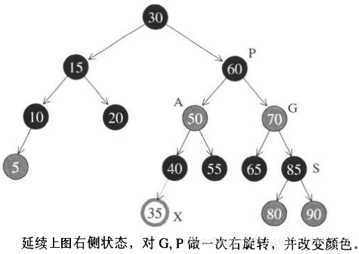

# RB-tree(红黑树)

## 定义

- 红黑树（RB-tree）也是广泛应用的平衡二叉树，也是SGI STL唯一实现的一种搜寻树，作为关联式容器的底部机制之用。
- **红黑树必须满足下面的规则：**
  - 1.每个节点不是红色就是黑色
  - 2.根节点为黑色
  - 3.如果节点为红色，那么子节点必须为黑（也就是说不能有两个节点连续为红色）
  - 4.任一节点到NULL（树尾端）的任何路径上，所含的黑色节点数目必须相同
- **下图是一个图示。深色的为黑色，浅色的为红色**


## 插入节点

> ### 新插入的节点必为红色
>
> - 如果插入前树非空，插入的新节点为黑色，肯定不满足上面的规则4
> - 如果插入前树非空，插入的新节点为红色，那么可能会不满足上面的规则3（如插入节点的父节点为红色），也可能满足上面的规则3（如插入节点的父节点为黑色）
> - **总结：我们应该将新插入的节点设置为红色，**如果满足红黑树条件那么就插入成功；如果不满足红黑树条件那么可以通过改变颜色或旋转来调节不平衡

> - 假设：新节点为X，父节点为P，祖父节点为G，伯父节点（父节点的兄弟节点）为S，曾祖父节点为GG
> - 根据二叉搜索树的规则，新节点X必为叶节点。根据红黑树规则4，X必为红，若P亦为红(这就违反了规则3，必须调整树形)，则G必为黑(因为原为RB-tree，必须遵循规则3)。于是，根据X的插入位置及外围节点的颜色，有了以下四种考虑：

> ### 状况①
>
> - **插入前：**S为黑色且X为外侧插入
> - **调整平衡：**我们先对P、G做一次单旋转，然后再改变P、G的颜色，就可以满足红黑树的规则3
>
> 
>
> - 备注：此时可能会产生不平衡状态（高度相差1以上）。例如图中的A和B为NULL，而D和E不为NULL。这也没关系，因为红黑树的平衡性本来就比AVL-tree弱。然而RB-tree通常能够导致良好的平衡状态。经验总结，RB-tree的搜寻效率和AVL-tree几乎相等

> ### 状况②
>
> - **插入前：**S为黑且X为内侧插入
> - **调整平衡：**先对P、X做一次单旋转，并改变G、X的颜色，再将结果对G做一次单旋转，就可以满足红黑树的规则3
>
> 

> ### 状况③
>
> - **插入前：**S为红色且X为外侧插入
> - **调整平衡：**先对P、G做一次单旋转，并改变X的颜色。此时如果GG为黑色，那么没有问题（如果GG为红色，那么就参阅下面的状况④）
>
> 

> ### 状况④
>
> - **插入前：**S为红色且X为外侧插入
> - **调整平衡：**先对P、G做一次单旋转，并改变X的颜色。如果GG也为红色，那么需要持续向上做，直到不再有父子连续为红色位置
>
> 

## 一个由上而下的程序

- 为了避免上面状况④“父子节点都为红色”的情况持续向RB-tree的上层结构发展，形成处理时效率上的瓶颈，我们可以**施行一个由上而下的程序：**假设新增节点为A，那么就沿着A的路径，只要看到有某节点X的两个子节点都为红色，就把X改为红色，并把两个子节点改为黑色。如下图所示


- 但是如果X的父节点P还为红色（注意，此时S绝不可能为红色），就得向状况①一样地做一次单旋转并改变颜色，或是像状况②一样地做一次双旋转并改变颜色
- 在此之后，节点35的插入就变得简单了：要么直接插入，要么插入后再一次单旋转即可。如下图所示



## RB-tree的节点设计

- 红黑树有红黑二色，并且有用左右子节点和父节点
- 下面是SGI STL的实现源码。为了有更大的弹性，**节点分为两层实现**。将后面介绍迭代器的时候将会显示节点双层结构和迭代器双层结构的关系

> ### _Rb_tree_node_base、 _Rb_tree_node
>
> - _Rb_tree_node_base**定义了节点的基本结构**
> - _Rb_tree_node**继承于**_Rb_tree_node_base，**并且定义了节点的值**。这个就是红黑树节点的最终表示
>
> ```c++
> typedef bool _Rb_tree_Color_type;
> const _Rb_tree_Color_type _S_rb_tree_red = false;//红色为0
> const _Rb_tree_Color_type _S_rb_tree_black = true;//黑色为1
> 
> struct _Rb_tree_node_base
> {
>   typedef _Rb_tree_Color_type _Color_type;
>   typedef _Rb_tree_node_base* _Base_ptr;
> 
>   _Color_type _M_color; //节点颜色
>   _Base_ptr _M_parent; // 父节点
>   _Base_ptr _M_left; // 左子节点
>   _Base_ptr _M_right; // 右子节点
> 
>   // 一直向左走，就会找到最小值
>   static _Base_ptr _S_minimum(_Base_ptr __x)
>   {
>     while (__x->_M_left != 0) __x = __x->_M_left;
>     return __x;
>   }
>   //一直向右走，就会找到最大值
>   static _Base_ptr _S_maximum(_Base_ptr __x)
>   {
>     while (__x->_M_right != 0) __x = __x->_M_right;
>     return __x;
>   }
> };
> ```
>
> ```c++
> template <class _Value>
> struct _Rb_tree_node : public _Rb_tree_node_base
> {
>   typedef _Rb_tree_node<_Value>* _Link_type;
>   _Value _M_value_field; // 节点值
> };
> ```

## RB-tree的迭代器

- 为了有更大的弹性，**SGI将RB-tree的迭代器实现为两层**。这种设计理念和前面介绍的slist容器比较类似

- **下图便是双层节点结构和双层迭代器结构之间的关系，**

  其中主要意义是：

  - __rb_tree_node继承自__rb_tree_node_base
  - __rb_tree_iterator继承自__rb_tree_base_iterator，__rb_tree_iterator才是RB-tree最终使用到的迭代器


- RB-tree迭代器属于**双向迭代器**，但**不具备随机定位能力，**其提领操作和成员访问操作与list十分类似
- **注意：**
  - RB-tree迭代器的前进操作**operator++()调用的是基类中的increment()函数**
  - RB-tree迭代器的后退操作**operator--()调用的是基类中的decrement()函数**
- 前进或后退的行为依据二叉搜索树的节点排列规则，再加上实现上的某些特殊技巧

>### 基类中的迭代器（__rb_tree_base_iterator）
>
>```c++
>struct _Rb_tree_base_iterator//基层迭代器
>{
>typedef _Rb_tree_node_base::_Base_ptr _Base_ptr;
>typedef bidirectional_iterator_tag iterator_category;
>typedef ptrdiff_t difference_type;
>_Base_ptr _M_node;//用来与容器之间产生一个连结关系（make a reference）
>
>void _M_increment()
>{
>  //如果有右子节点（状况1）就向右走，然后一直往左子树走到底即是解答
>  if (_M_node->_M_right != 0) {
>   _M_node = _M_node->_M_right;
>   while (_M_node->_M_left != 0)
>     _M_node = _M_node->_M_left;
>  }
>  else {//没有右子节点（状况2），找出父节点，如果现行节点本身是个右子节点就一直上溯，直到“不为右子节点”为止
>   _Base_ptr __y = _M_node->_M_parent;
>   while (_M_node == __y->_M_right) {
>     _M_node = __y;
>     __y = __y->_M_parent;
>   }
>   //若此时的右子节点不等于此时的父节点，此时的父节点（状况3），此时的父节点即为解答。否则此时的node为解答（状况4）
>   if (_M_node->_M_right != __y)
>     _M_node = __y;
>  }
>    /*
>    注意：以上判断“若此时的右子节点不等于此时的父节点”，是为了应付的一种特殊情况：我们想要
>    寻找根节点的下一节点，而恰巧根节点无右子节点，当然，以上特殊做法必须配合红黑树根节点与特殊的
>    header之间的关系
>    */
>}
>
>void _M_decrement()
>{
>  //如果是红节点，且父节点的父节点等于自己（状况1）右子节点即为解答
>  if (_M_node->_M_color == _S_rb_tree_red &&
>     _M_node->_M_parent->_M_parent == _M_node)
>   _M_node = _M_node->_M_right;
>   //以上情况发生于node为header时（即node为end()时）
>    //注意，header的右子节点即mostright，指向整棵树的max节点
>  
>  //如果有左子节点（状况2）令y指向左子节点，当y有右子节点时，一直往右子节点走到底最后即为答案
>  else if (_M_node->_M_left != 0) {
>   _Base_ptr __y = _M_node->_M_left;
>   while (__y->_M_right != 0)
>     __y = __y->_M_right;
>   _M_node = __y;
>  }
>  //既非根节点，也没有左子节点（状况3），找出父节点，当现行节点身为左子节点，一直交替向上走，知道现行节点不为左子节点
>  else {
>   _Base_ptr __y = _M_node->_M_parent;
>   while (_M_node == __y->_M_left) {
>     _M_node = __y;
>     __y = __y->_M_parent;
>   }
>   _M_node = __y;//此时的父节点即为答案
>  }
>}
>};
>```
>
>- 针对increment()和decrement()两个函数，比较难理解的**是increment的状况4和decrement状况1**。它们分别发生于下图所展示的状态下
>
>
>
>### 派生类中的迭代器（__rb_tree_iterator）
>
>```c++
>template <class _Value, class _Ref, class _Ptr>
>struct _Rb_tree_iterator : public _Rb_tree_base_iterator
>{
>  typedef _Value value_type;
>  typedef _Ref reference;
>  typedef _Ptr pointer;
>  typedef _Rb_tree_iterator<_Value, _Value&, _Value*>             
>    iterator;
>  typedef _Rb_tree_iterator<_Value, const _Value&, const _Value*> 
>    const_iterator;
>  typedef _Rb_tree_iterator<_Value, _Ref, _Ptr>                   
>    _Self;
>  typedef _Rb_tree_node<_Value>* _Link_type;
>
>  _Rb_tree_iterator() {}
>  _Rb_tree_iterator(_Link_type __x) { _M_node = __x; }
>  _Rb_tree_iterator(const iterator& __it) { _M_node = __it._M_node; }
>
>  reference operator*() const { return _Link_type(_M_node)->_M_value_field; }
>#ifndef __SGI_STL_NO_ARROW_OPERATOR
>  pointer operator->() const { return &(operator*()); }
>#endif /* __SGI_STL_NO_ARROW_OPERATOR */
>
>  _Self& operator++() { _M_increment(); return *this; }
>  _Self operator++(int) {
>    _Self __tmp = *this;
>    _M_increment();
>    return __tmp;
>  }
>    
>  _Self& operator--() { _M_decrement(); return *this; }
>  _Self operator--(int) {
>    _Self __tmp = *this;
>    _M_decrement();
>    return __tmp;
>  }
>};
>```

## RB-tree的数据结构

- **下面是RB-tree的定义（_Rb_tree）。可以看到其中有：**
  - \_Rb_tree继承于_Rb_tree_base
  - **专属的空间配置器**，每次用来配置一个节点的大小
  - 也可以看到**各种型别定义**，用来维护整棵RB-tree的三种数据（其中有个仿函数，functor，用来表现节点的大小比较方式）
  - **以及一些成员函数的定义和声明**

```c++
template <class _Tp, class _Alloc>
struct _Rb_tree_base
{
  typedef _Alloc allocator_type;
  allocator_type get_allocator() const { return allocator_type(); }

  _Rb_tree_base(const allocator_type&) 
    : _M_header(0) { _M_header = _M_get_node(); }
  ~_Rb_tree_base() { _M_put_node(_M_header); }

protected:
  _Rb_tree_node<_Tp>* _M_header;

  typedef simple_alloc<_Rb_tree_node<_Tp>, _Alloc> _Alloc_type;

  _Rb_tree_node<_Tp>* _M_get_node()
    { return _Alloc_type::allocate(1); }
  void _M_put_node(_Rb_tree_node<_Tp>* __p)
    { _Alloc_type::deallocate(__p, 1); }
};

template <class _Key, class _Value, class _KeyOfValue, class _Compare,
          class _Alloc = __STL_DEFAULT_ALLOCATOR(_Value) >
class _Rb_tree : protected _Rb_tree_base<_Value, _Alloc> {
  typedef _Rb_tree_base<_Value, _Alloc> _Base;
protected:
  typedef _Rb_tree_node_base* _Base_ptr;
  typedef _Rb_tree_node<_Value> _Rb_tree_node;
  typedef _Rb_tree_Color_type _Color_type;
public:
  typedef _Key key_type;
  typedef _Value value_type;
  typedef value_type* pointer;
  typedef const value_type* const_pointer;
  typedef value_type& reference;
  typedef const value_type& const_reference;
  typedef _Rb_tree_node* _Link_type;
  typedef size_t size_type;
  typedef ptrdiff_t difference_type;

  typedef typename _Base::allocator_type allocator_type;
  allocator_type get_allocator() const { return _Base::get_allocator(); }

protected:
#ifdef __STL_USE_NAMESPACES
  using _Base::_M_get_node;
  using _Base::_M_put_node;
  using _Base::_M_header;
#endif /* __STL_USE_NAMESPACES */

protected:

  _Link_type _M_create_node(const value_type& __x)
  {
    _Link_type __tmp = _M_get_node();//配置空间
    __STL_TRY {
      construct(&__tmp->_M_value_field, __x);//构造内容
    }
    __STL_UNWIND(_M_put_node(__tmp));
    return __tmp;
  }

  _Link_type _M_clone_node(_Link_type __x)//复制一个节点（值和颜色）
  {
    _Link_type __tmp = _M_create_node(__x->_M_value_field);
    __tmp->_M_color = __x->_M_color;
    __tmp->_M_left = 0;
    __tmp->_M_right = 0;
    return __tmp;
  }

  void destroy_node(_Link_type __p)
  {
    destroy(&__p->_M_value_field);//析构内容
    _M_put_node(__p);//释放内存
  }

protected:
  size_type _M_node_count; // keeps track of size of tree追踪记录树的大小（节点数量）
  _Compare _M_key_compare;//节点间的键值大小比较准则，应该会是个function object

  //以下3个函数用来方便取得header的成员
  _Link_type& _M_root() const 
    { return (_Link_type&) _M_header->_M_parent; }
  _Link_type& _M_leftmost() const 
    { return (_Link_type&) _M_header->_M_left; }
  _Link_type& _M_rightmost() const 
    { return (_Link_type&) _M_header->_M_right; }

  //以下6个函数用来方便取得节点x的成员
  static _Link_type& _S_left(_Link_type __x)
    { return (_Link_type&)(__x->_M_left); }
  static _Link_type& _S_right(_Link_type __x)
    { return (_Link_type&)(__x->_M_right); }
  static _Link_type& _S_parent(_Link_type __x)
    { return (_Link_type&)(__x->_M_parent); }
  static reference _S_value(_Link_type __x)
    { return __x->_M_value_field; }
  static const _Key& _S_key(_Link_type __x)
    { return _KeyOfValue()(_S_value(__x)); }
  static _Color_type& _S_color(_Link_type __x)
    { return (_Color_type&)(__x->_M_color); }

  //以下6个函数用来方便取得节点x的成员
  static _Link_type& _S_left(_Base_ptr __x)
    { return (_Link_type&)(__x->_M_left); }
  static _Link_type& _S_right(_Base_ptr __x)
    { return (_Link_type&)(__x->_M_right); }
  static _Link_type& _S_parent(_Base_ptr __x)
    { return (_Link_type&)(__x->_M_parent); }
  static reference _S_value(_Base_ptr __x)
    { return ((_Link_type)__x)->_M_value_field; }
  static const _Key& _S_key(_Base_ptr __x)
    { return _KeyOfValue()(_S_value(_Link_type(__x)));} 
  static _Color_type& _S_color(_Base_ptr __x)
    { return (_Color_type&)(_Link_type(__x)->_M_color); }

  //求取极大值和极小值。node class有实现此功能，交给他们完成即可
  static _Link_type _S_minimum(_Link_type __x) 
    { return (_Link_type)  _Rb_tree_node_base::_S_minimum(__x); }

  static _Link_type _S_maximum(_Link_type __x)
    { return (_Link_type) _Rb_tree_node_base::_S_maximum(__x); }

public:
  typedef _Rb_tree_iterator<value_type, reference, pointer> iterator;
  typedef _Rb_tree_iterator<value_type, const_reference, const_pointer> 
          const_iterator;

#ifdef __STL_CLASS_PARTIAL_SPECIALIZATION
  typedef reverse_iterator<const_iterator> const_reverse_iterator;
  typedef reverse_iterator<iterator> reverse_iterator;
#else /* __STL_CLASS_PARTIAL_SPECIALIZATION */
  typedef reverse_bidirectional_iterator<iterator, value_type, reference,
                                         difference_type>
          reverse_iterator; 
  typedef reverse_bidirectional_iterator<const_iterator, value_type,
                                         const_reference, difference_type>
          const_reverse_iterator;
#endif /* __STL_CLASS_PARTIAL_SPECIALIZATION */ 

private:
  iterator _M_insert(_Base_ptr __x, _Base_ptr __y, const value_type& __v);
  _Link_type _M_copy(_Link_type __x, _Link_type __p);
  void _M_erase(_Link_type __x);

public:
                                // allocation/deallocation
  _Rb_tree()
    : _Base(allocator_type()), _M_node_count(0), _M_key_compare()
    { _M_empty_initialize(); }

  _Rb_tree(const _Compare& __comp)
    : _Base(allocator_type()), _M_node_count(0), _M_key_compare(__comp) 
    { _M_empty_initialize(); }

  _Rb_tree(const _Compare& __comp, const allocator_type& __a)
    : _Base(__a), _M_node_count(0), _M_key_compare(__comp) 
    { _M_empty_initialize(); }

  _Rb_tree(const _Rb_tree<_Key,_Value,_KeyOfValue,_Compare,_Alloc>& __x) 
    : _Base(__x.get_allocator()),
      _M_node_count(0), _M_key_compare(__x._M_key_compare)
  { 
    if (__x._M_root() == 0)
      _M_empty_initialize();
    else {
      _S_color(_M_header) = _S_rb_tree_red;
      _M_root() = _M_copy(__x._M_root(), _M_header);
      _M_leftmost() = _S_minimum(_M_root());
      _M_rightmost() = _S_maximum(_M_root());
    }
    _M_node_count = __x._M_node_count;
  }
  ~_Rb_tree() { clear(); }
  _Rb_tree<_Key,_Value,_KeyOfValue,_Compare,_Alloc>& 
  operator=(const _Rb_tree<_Key,_Value,_KeyOfValue,_Compare,_Alloc>& __x);

private:
  void _M_empty_initialize() {
    //令header为红色，用来区分header和root，在iterator.operator++之中
    _S_color(_M_header) = _S_rb_tree_red; // used to distinguish header from 
                                          // __root, in iterator.operator++
    _M_root() = 0;
    _M_leftmost() = _M_header;//令header的左子节点为自己
    _M_rightmost() = _M_header;//令header的右子节点为自己
  }

public:    
                                // accessors:
  _Compare key_comp() const { return _M_key_compare; }
  iterator begin() { return _M_leftmost(); }
  const_iterator begin() const { return _M_leftmost(); }
  iterator end() { return _M_header; }
  const_iterator end() const { return _M_header; }
  reverse_iterator rbegin() { return reverse_iterator(end()); }
  const_reverse_iterator rbegin() const { 
    return const_reverse_iterator(end()); 
  }
  reverse_iterator rend() { return reverse_iterator(begin()); }
  const_reverse_iterator rend() const { 
    return const_reverse_iterator(begin());
  } 
  bool empty() const { return _M_node_count == 0; }
  size_type size() const { return _M_node_count; }
  size_type max_size() const { return size_type(-1); }

  void swap(_Rb_tree<_Key,_Value,_KeyOfValue,_Compare,_Alloc>& __t) {
    __STD::swap(_M_header, __t._M_header);
    __STD::swap(_M_node_count, __t._M_node_count);
    __STD::swap(_M_key_compare, __t._M_key_compare);
  }
    
public:
                                // insert/erase
  pair<iterator,bool> insert_unique(const value_type& __x);//将x插入到RB-tree中（保持节点值第一无二）
  iterator insert_equal(const value_type& __x);//将x插入到RB-tree中（允许节点值重复）

  iterator insert_unique(iterator __position, const value_type& __x);
  iterator insert_equal(iterator __position, const value_type& __x);

#ifdef __STL_MEMBER_TEMPLATES  
  template <class _InputIterator>
  void insert_unique(_InputIterator __first, _InputIterator __last);
  template <class _InputIterator>
  void insert_equal(_InputIterator __first, _InputIterator __last);
#else /* __STL_MEMBER_TEMPLATES */
  void insert_unique(const_iterator __first, const_iterator __last);
  void insert_unique(const value_type* __first, const value_type* __last);
  void insert_equal(const_iterator __first, const_iterator __last);
  void insert_equal(const value_type* __first, const value_type* __last);
#endif /* __STL_MEMBER_TEMPLATES */

  void erase(iterator __position);
  size_type erase(const key_type& __x);
  void erase(iterator __first, iterator __last);
  void erase(const key_type* __first, const key_type* __last);
  void clear() {
    if (_M_node_count != 0) {
      _M_erase(_M_root());
      _M_leftmost() = _M_header;
      _M_root() = 0;
      _M_rightmost() = _M_header;
      _M_node_count = 0;
    }
  }      

public:
                                // set operations:
  iterator find(const key_type& __x);
  const_iterator find(const key_type& __x) const;
  size_type count(const key_type& __x) const;
  iterator lower_bound(const key_type& __x);
  const_iterator lower_bound(const key_type& __x) const;
  iterator upper_bound(const key_type& __x);
  const_iterator upper_bound(const key_type& __x) const;
  pair<iterator,iterator> equal_range(const key_type& __x);
  pair<const_iterator, const_iterator> equal_range(const key_type& __x) const;

public:
                                // Debugging.
  bool __rb_verify() const;
};
```

## RB-tree的数据结构的构造与内存管理

> ### 空间配置器_Alloc_type
>
> - 下面是RB-tree所定义的专属空间配置器_Alloc_type，**每次可恰恰配置一个节点，**它所使用的simple_alloc<>定义在前面的文章
>
> ```c++
> template <class _Tp, class _Alloc>
> struct _Rb_tree_base
> {
>   ...
> protected:
>   _Rb_tree_node<_Tp>* _M_header;
> 
>   typedef simple_alloc<_Rb_tree_node<_Tp>, _Alloc> _Alloc_type;
>   ...
> };
> ```

- 前面的代码中也显示了节点相关的函数，如get_node()、put_node()、create_node()、clone_node()、destory_node()
- **RB-tree的构造方式有两种：**
  - 一种是以现有的RB-tree**复制一个新的RB-tree**
  - 另一种是**产生一棵空树**

> ### 演示说明
>
> - **下面定义一个红黑树**（备注：RB-tree并未明列于STL标准规则之中，因为我们了解SGI STL的底层，因此能这么用）：
>
> ```c++
> rb_tree<int,int,identity<int>,less<int> > itree; 
> ```
>
> - 这行代码分别指定了节点的键值、实值、大小比较标准，然后**调用RB-tree的默认构造函数**。默认构造函数如下
>
> ```c++
>   _Rb_tree(const _Compare& __comp)
>     : _Base(allocator_type()), _M_node_count(0), _M_key_compare(__comp) 
>     { _M_empty_initialize(); }
> ```
>
> -  **_M_empty_initialize的实现如下：**
>
> ```c++
>   void _M_empty_initialize() {
>     _S_color(_M_header) = _S_rb_tree_red; //令header为红色，用来区分header和root，在iterator.operator++之中
>     _M_root() = 0;
>     _M_leftmost() = _M_header;//令header的左子节点为自己
>     _M_rightmost() = _M_header;//令header的右子节点为自己
>   }
> ```

> ### header节点
>
> - 我们知道，树结构的各种操作最需要注意的就是边界情况的发生，也就是走到根节点时要有特殊处理。为了简化处理，SGI STL特别**为根节点再设计一个父节点，名为header**，并令其初始状态如下图所示：
>
> 
>
> - 接下来，每当插入新节点时，**不但要依照RB-tree的规则来调整，并且维护header的正确性**，使其父节点指向根节点，左子节点指向最小节点，右子节点指向最大节点。节点的插入所带来的的影响，是下面要描述的重点

## RB-tree的元素操作

- 接下来主要谈元素（节点）的插入和查找
- **RB-tree提供两种类型的插入操作：**
  - **insert_unique()：**表示被插入节点的键值（key）在整棵树中必须独一无二（因此，如果树中已存在相同的键值，插入操作就不会真正进行）
  - **insert_equal()：**表示被插入节点的键值在整棵树中可以重复。因此，无论如何插入都会成功（除非空间不足）
  - **这两个函数也有数个版本，下面以最简单的版本作为说明对象**（单一参数，用以表现将被插入的节点实值（values））。注意，虽然只指定实值，但是RB-tree一开始即要求用户必须明确设定所谓的KeyOfValue仿函数，因此，从实值（value）中取出键值（key）是毫无问题的

> ### 元素插入操作（insert_equal()）
>
> ```c++
> //插入新值：节点允许重复
> //返回是一个迭代器，指向于新增节点
> template <class _Key, class _Value, class _KeyOfValue, 
>           class _Compare, class _Alloc>
> typename _Rb_tree<_Key,_Value,_KeyOfValue,_Compare,_Alloc>::iterator
> _Rb_tree<_Key,_Value,_KeyOfValue,_Compare,_Alloc>
>   ::insert_equal(const _Value& __v)
> {
>   _Link_type __y = _M_header;
>   _Link_type __x = _M_root();//从根节点开始
>   while (__x != 0) {//往下寻找适当的插入点
>     __y = __x;
>     __x = _M_key_compare(_KeyOfValue()(__v), _S_key(__x)) ? 
>             _S_left(__x) : _S_right(__x);
>   }
>   return _M_insert(__x, __y, __v);
> }
> ```

> ### 元素插入操作（insert_unique()）
>
> ```c++
> //插入新值：节点键值不允许重复，若重复则插入无效
> //返回值是个pair。pair中的第一个元素是个RB-tree迭代器，指向于新增节点。第二个元素表示插入成功
> template <class _Key, class _Value, class _KeyOfValue, 
>           class _Compare, class _Alloc>
> pair<typename _Rb_tree<_Key,_Value,_KeyOfValue,_Compare,_Alloc>::iterator, 
>      bool>
> _Rb_tree<_Key,_Value,_KeyOfValue,_Compare,_Alloc>
>   ::insert_unique(const _Value& __v)
> {
>   _Link_type __y = _M_header;
>   _Link_type __x = _M_root();//从根节点开始
>   bool __comp = true;
>   while (__x != 0) {//从根节点开始，往下寻找适当的插入点
>     __y = __x;
>     __comp = _M_key_compare(_KeyOfValue()(__v), _S_key(__x));
>     __x = __comp ? _S_left(__x) : _S_right(__x);
>   }//while结束之后，y所指即插入点的父节点（此时的它必为叶节点）
>   iterator __j = iterator(__y);   
>   if (__comp)//离开时while后，comp为真（表示遇“大”，将插入于左侧）
>     if (__j == begin())     
>       return pair<iterator,bool>(_M_insert(__x, __y, __v), true);
>     else
>       --__j;
>   //小于新值（插入右侧）
>   if (_M_key_compare(_S_key(__j._M_node), _KeyOfValue()(__v)))
>     return pair<iterator,bool>(_M_insert(__x, __y, __v), true);
>   //运行到这里，表示新值一定与树中键值重复，那么就不插入
>   return pair<iterator,bool>(__j, false);
> }
> ```

> ### 真正的插入执行程序（_M_insert()）
>
> ```c++
> template <class _Key, class _Value, class _KeyOfValue, 
>           class _Compare, class _Alloc>
> typename _Rb_tree<_Key,_Value,_KeyOfValue,_Compare,_Alloc>::iterator
> _Rb_tree<_Key,_Value,_KeyOfValue,_Compare,_Alloc>
>   ::_M_insert(_Base_ptr __x_, _Base_ptr __y_, const _Value& __v)
> {
>   //参数x为新值插入点，参数y为插入点的父节点，参数v为新值
>   _Link_type __x = (_Link_type) __x_;
>   _Link_type __y = (_Link_type) __y_;
>   _Link_type __z;
> 
>   if (__y == _M_header || __x != 0 || 
>       _M_key_compare(_KeyOfValue()(__v), _S_key(__y))) {
>     __z = _M_create_node(__v);
>     _S_left(__y) = __z;               // also makes _M_leftmost() = __z 
>                                       //    when __y == _M_header
>     if (__y == _M_header) {
>       _M_root() = __z;
>       _M_rightmost() = __z;
>     }
>     else if (__y == _M_leftmost())
>       _M_leftmost() = __z;   // maintain _M_leftmost() pointing to min node
>   }
>   else {
>     __z = _M_create_node(__v);
>     _S_right(__y) = __z;
>     if (__y == _M_rightmost())
>       _M_rightmost() = __z;  // maintain _M_rightmost() pointing to max node
>   }
>   _S_parent(__z) = __y;
>   _S_left(__z) = 0;
>   _S_right(__z) = 0;
>   _Rb_tree_rebalance(__z, _M_header->_M_parent);
>   ++_M_node_count;
>   return iterator(__z);
> }
> ```

> ### 调整RB-tree（旋转及改变颜色）
>
> - 任何插入操作，插入完毕之后**都要做一次调整操作，**将树的状态调整到符合红黑树的要求
>
> - **_Rb_tree_rebalance函数：**
>
>   是一个全局函数，用来对RB-tree进行调整
>
>   - 下面的函数就是上面所说的“由上而下的程序”。从源代码可以看到，有些时候只需调整节点颜色，有些时候需要做单旋转或双旋转；有些时候要左旋，有些时候要右旋
>
> ```c++
> //全局函数，重新令树平衡（改变颜色及旋转）
> //参数1新增节点，参数2root
> inline void 
> _Rb_tree_rebalance(_Rb_tree_node_base* __x, _Rb_tree_node_base*& __root)
> {
>   __x->_M_color = _S_rb_tree_red;//新增节点必为红
>   while (__x != __root && __x->_M_parent->_M_color == _S_rb_tree_red) {//父节点为红
>     if (__x->_M_parent == __x->_M_parent->_M_parent->_M_left) {//父节点为祖父节点的左孩子
>       _Rb_tree_node_base* __y = __x->_M_parent->_M_parent->_M_right;//令y为伯父节点
>       if (__y && __y->_M_color == _S_rb_tree_red) {//伯父节点存在，且为红
>         __x->_M_parent->_M_color = _S_rb_tree_black;//更改父节点为黑
>         __y->_M_color = _S_rb_tree_black;//更改伯父节点为红
>         __x->_M_parent->_M_parent->_M_color = _S_rb_tree_red;//更改祖父节点为红
>         __x = __x->_M_parent->_M_parent;
>       }
>       else {//无伯父节点，或伯父节点为红
>         if (__x == __x->_M_parent->_M_right) {//新节点为父节点的右孩子
>           __x = __x->_M_parent;
>           _Rb_tree_rotate_left(__x, __root);//第一参数为左旋点
>         }
>         __x->_M_parent->_M_color = _S_rb_tree_black;//改变颜色
>         __x->_M_parent->_M_parent->_M_color = _S_rb_tree_red;
>         _Rb_tree_rotate_right(__x->_M_parent->_M_parent, __root);//第一参数为右旋点
>       }
>     }
>     else {//父节点为祖父节点的右孩子
>       _Rb_tree_node_base* __y = __x->_M_parent->_M_parent->_M_left;//令y为伯父节点
>       if (__y && __y->_M_color == _S_rb_tree_red) {//有伯父节点，且为红
>         __x->_M_parent->_M_color = _S_rb_tree_black;//更改父节点为黑
>         __y->_M_color = _S_rb_tree_black;//更改伯父节点为黑
>         __x->_M_parent->_M_parent->_M_color = _S_rb_tree_red;//更改祖父节点为红
>         __x = __x->_M_parent->_M_parent;//准备继续向上层检查
>       }
>       else {//无伯父节点，或伯父节点为黑
>         if (__x == __x->_M_parent->_M_left) {//如果新节点为父节点的左孩子
>           __x = __x->_M_parent;
>           _Rb_tree_rotate_right(__x, __root);//第一参数为右旋点
>         }
>         __x->_M_parent->_M_color = _S_rb_tree_black;//更改颜色
>         __x->_M_parent->_M_parent->_M_color = _S_rb_tree_red;
>         _Rb_tree_rotate_left(__x->_M_parent->_M_parent, __root);//第一参数为左旋点
>       }
>     }
>   }
>   __root->_M_color = _S_rb_tree_black;//根节点永远为黑
> }
> ```
>
> * **_Rb_tree_rotate_left：**左旋函数
>
> ```c++
> //全局函数
> //新节点必为红节点，如果插入之处父节点也为红色，就违反了规则，此时需要做树形旋转（及颜色改变,颜色改变不是在这里）
> inline void 
> _Rb_tree_rotate_left(_Rb_tree_node_base* __x, _Rb_tree_node_base*& __root)
> {
>   //x为旋转点
>   _Rb_tree_node_base* __y = __x->_M_right; //令y为旋转点的右子节点
>   __x->_M_right = __y->_M_left;
>   if (__y->_M_left !=0)
>     __y->_M_left->_M_parent = __x; //别忘了设定父节点
>   __y->_M_parent = __x->_M_parent;
>  
>   //令y完全顶替x的地位（必须将x对齐父节点的关系完全接收过来）
>   if (__x == __root) //x为根节点
>     __root = __y;
>   else if (__x == __x->_M_parent->_M_left) //x为其父节点的左子节点
>     __x->_M_parent->_M_left = __y;
>   else
>     __x->_M_parent->_M_right = __y; //x为其父节点的右子节点
>   __y->_M_left = __x;
>   __x->_M_parent = __y;
> }
> ```
>
> * **_Rb_tree_rotate_right：**右旋函数
>
> ```c++
> //全局函数
> //新节点必为红节点，如果插入之处父节点也为红色，就违反了规则，此时需要做树形旋转（及颜色改变,颜色改变不是在这里）
> inline void 
> _Rb_tree_rotate_right(_Rb_tree_node_base* __x, _Rb_tree_node_base*& __root)
> {
>   //y为旋转点
>   _Rb_tree_node_base* __y = __x->_M_left; //令y为旋转点的左子节点
>   __x->_M_left = __y->_M_right;
>   if (__y->_M_right != 0)
>     __y->_M_right->_M_parent = __x; //别忘了设定父节点
>   __y->_M_parent = __x->_M_parent;
>  
>   //令y完全顶替x的地位（必须将x对齐父节点的关系完全接收过来）
>   if (__x == __root)//x为根节点
>     __root = __y;
>   else if (__x == __x->_M_parent->_M_right)//x为其父节点的右子节点
>     __x->_M_parent->_M_right = __y;
>   else//x为其父节点的左子节点
>     __x->_M_parent->_M_left = __y;
>   __y->_M_right = __x;
>   __x->_M_parent = __y;
> }
> ```
>
> - **下面是一个演示案例**
>
> 
>
> - 下图是上面那个演示案例的完整过程
>
> 
>
> 
>
> 

> ### 元素的搜索（find()）
>
> - RB-tree是一个二叉搜索树，因此搜寻才是其最拿手的地方。下面是RB-tree提供的find函数
>
> ```c++
> //寻找树中是否有键值为k的节点
> template <class _Key, class _Value, class _KeyOfValue, 
>           class _Compare, class _Alloc>
> typename _Rb_tree<_Key,_Value,_KeyOfValue,_Compare,_Alloc>::iterator 
> _Rb_tree<_Key,_Value,_KeyOfValue,_Compare,_Alloc>::find(const _Key& __k)
> {
>   _Link_type __y = _M_header;      // Last node which is not less than __k. 
>   _Link_type __x = _M_root();      // Current node. 
> 
>   while (__x != 0) 
>     //以下，key_compare是节点键值大小比较准则，应该会是个function object
>     if (!_M_key_compare(_S_key(__x), __k))
>       //进行到这里，表示x键值大于k，遇到大值就向左走
>       __y = __x, __x = _S_left(__x);
>     else
>       //进行到这里，表示x键值小于k，遇到大值就向右走
>       __x = _S_right(__x);
> 
>   iterator __j = iterator(__y);   
>   return (__j == end() || _M_key_compare(__k, _S_key(__j._M_node))) ? 
>      end() : __j;
> }
> ```