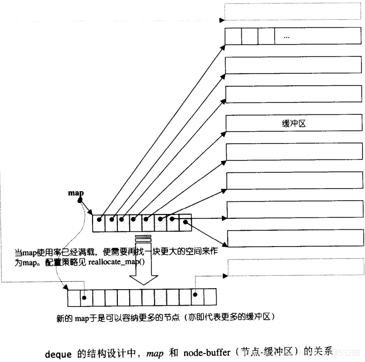
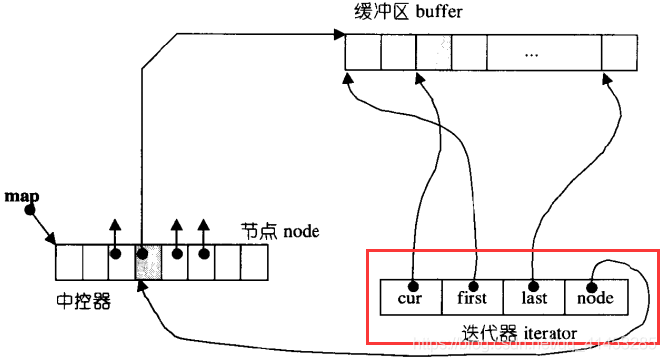
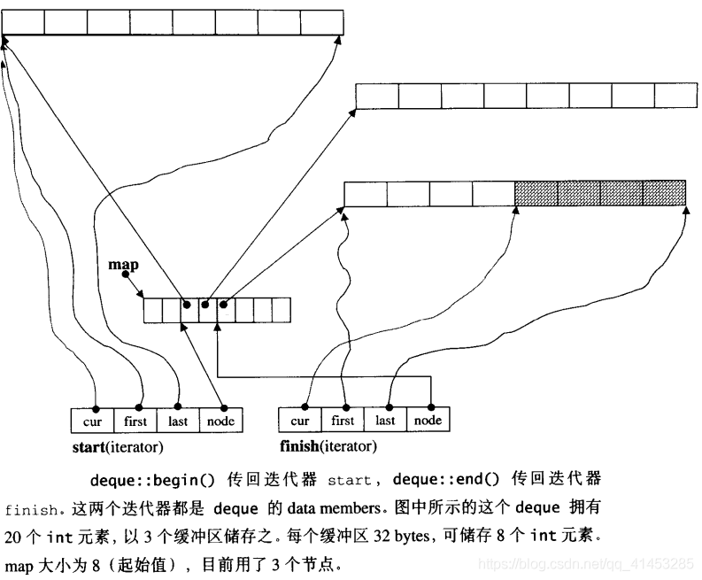
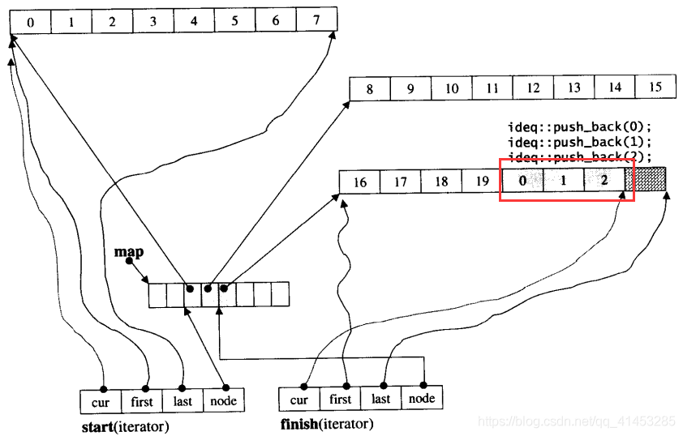
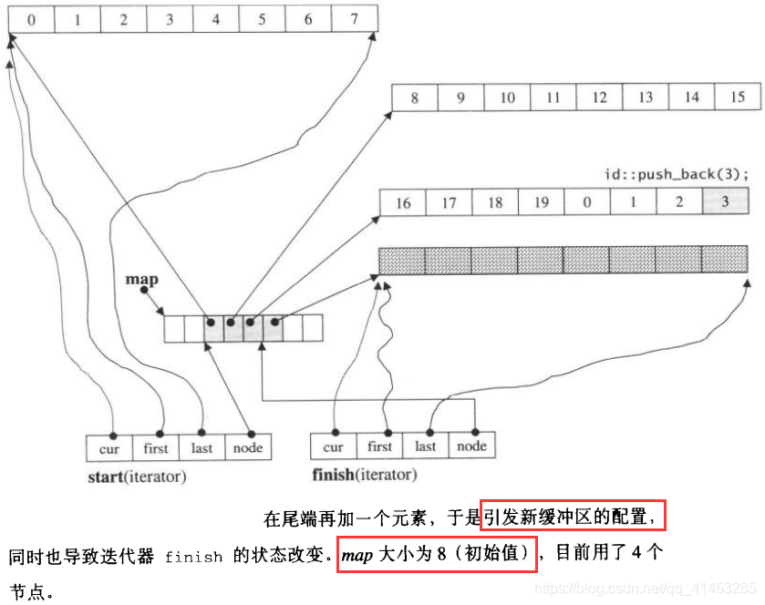

# deque

## deque概述

**双端队列**

**特点**：

- 支持快速随机访问（支持索引取值）
- 在头尾插入/删除速度很快
- deque是非常复杂的数据结构，由**多个vector**组成，迭代器使用时会在不同的区间跳转
- 存取元素的时候，deque的内部结构会多出一个间接过程，相比vector操作会慢一些
- 对内存有限制的系统中，deque比vector可以包含更多元素，因为它不止使用一块内存

**设计目的**：

在头尾两端分别做元素的插入和删除操作。相比于vector，vector在头部操作效率太低

**何时使用**：

需要在两端进行插入删除操作

**与vector最大差异：**

- 一在于deque**允许于常数时间内**对起头端进行元素的插入或移除动作
- **二在于deque没有所谓容量（capacity）观念**，因为它是动态地以分段连续空间组合而成，随时可以增加一段新的空间并链接起来。 换句话说，像vector那样“因旧空间不足而重新配置一块更大空间，然后复制元素，再释放旧空间”这样的事情在deque 是不会发生的。也因此，deque**没有必要提供所谓的空间保留（reserve）功能**

虽然deque也提供 Ramdon Access Iterator，**但它的迭代器并不是原生指标**，其复杂度和 vector不可以相对比，这当然在在影响了各个运算层面 。 因此 ， **除非必要 ， 我们应尽可能选择使用vector而非deque**。 对deque进行的排序动作，为了最高效率，可将deque先完整复制到一个vector中，将vector排序后（利用STL sort 算法），再复制回deque。

## deque使用

- **头文件：**#include <deque>

- **using声明：**using std::deque;

- **初始化**

  deque<T> v1; ==>v1是一个空的deque

  deque<T> v2(v1); ===>v2是v1的副本，拷贝构造

  deque<T> v2=v1; ===>同上

  deque<T> v1(n,val); ===>初始化n个value

  deque<T> v1(iter1,iter2); ===>用迭代器iter1与iter2所指的区间内元素进行初始化

  deque<T> v1(n); ===>初始化n个元素，每个元素使用默认值（int为0，string为空...）

  deque<T> v1{a,b,c...}; ===>用元素a,b,c进行初始化

  deque<T> v1={a,b,c...}; ===>同上

- **相关操作**

  运算符

  ```c++
  d1==d2;//判断d1和d2是否相等
  d1!=d2;//判断d1和d2是否相等
  >、>=、<、<= //以字典顺序进行比较
  ```

  取值：索引取值d[0]，d[1]，d[2]...

- **相关函数**

  相比于vector：deque不支持capacity()和reserve();。支持push_front();和emplace_front();

  ```c++
  d.empty();//判断是否为空，返回布尔值
  d.size();//返回容器中的元素个数
  d.max_size();//返回容器的容量
  
  d.front();//得到头元素
  d.back();//得到尾元素
  d.at(int i);//得到下标i处的元素，若下标越界，会抛出异常
  
  d1.swap(d2);//将d1和d2进行交换。容器的成员函数版本
  swap(d1,d2);//同上。系统函数版本
   
  d.assign(iter1,iter2);//将容器元素更换为一个迭代器的区间元素
  d.assign(n,t);//将容器元素变为n个t元素
  
  d.insert(iter,t);//在迭代器iter处插入t。返回所插位置处的迭代器
  d.insert(v.end(),10,t);//在容器v的末尾插入10个元素，每个元素都是t。返回新添加元素的第一个元素的迭代器
  d.insert(v.end(),{"a","b"...});//将后面花括号的每个元素插入容器v的尾部。返回新添加元素的第一个元素的迭代器
  d.insert(d.begin(),d2.end()-2,d2.end());//将容器d2的最后两个元素插入容器d的头部。返回新添加元素的第一个元素的迭代器
  注意：上面这个用法，后面两个参数不能为自身容器的范围（d.insert(d.begin(),d.end()-2,d.end());是错误的）
   
  //利用insert的返回值，下面代码为一直在d容器的头部插入元素(类似于push_front的功能)
  deque<string> d;
  auto iter=d.begin();
  while(cin>> word)
      iter=d.insert(iter,word);//insert函数每回执行完，返回容器的首元素位置
  
  d.push_back(t);//尾部追加元素t
  d.push_front(t);//头部追加元素t
  d.pop_back();//删除尾元素
   
  d.earse(iter);//删除迭代器iter所指位置处的元素。返回删除位置处后一个元素迭代器
  d.erase(iter1,iter2);//删除迭代器iter1与iter2区间内的元素。返回删除最后一个元素的后一个元素迭代器
   
  d.clear();//清空容器，重新初始化容器
  
  d.resize(n);//将容器d的元素变为n个。若n<原始元素个数，删除多于元素。若n>原始元素个数，则用默认初始值初始化容器
  d.resize(n,t);//将容器元素变为n个t。与容器原始个数无关
   
  deque<int> d(5,666);
  d.resize(3);//d内有3个元素，都是666
  d.resize(8);;//d内有8个元素，前5个个是666，后3个都是0(默认)
  d.resize(10,666);//d内有10个元素，都是666
  
  //下面的两个函数，是在在内存中创建一个对象，然后添加进相应的位置
  d.empalce(iter,args);//在容器d的位置添加创建一个args对象
  d.emplace_back(args);//在容器d的尾部添加创建一个args对象
  d.emplace_front(args);//在容器d的头部添加创建一个args对象
   
  例如
  class A{
      string name;int age;
  public:
      A(string name, int age);
  };
  int main()
  {
      deque<A> d;
      d.emplace_back("C语言", 18);//在尾部创建一个元素
      d.emplace(v.begin(),"C++",18);//在容器d的头部添加一个元素
  }
   
  ```

- **容器操作使迭代器、引用、指针失效**

  向容器中添加或者删除元素可能会使容器的迭代器、引用、指针失效。失效的迭代器、引用、指针不再表示任何元素，使用起来非常危险

  **添加元素**

  - 如果添加到首尾元素之外的任何位置都会导致迭代器、引用、指针失效
  - 如果在首尾位置添加元素，迭代器会失效，但是引用、指针不会失效

  **删除元素**

  - 如果删除的是首尾之外的元素，那么指向被删除元素外的其它元素的迭代器、引用、指针都会失效
  - 如果删除的是首元素，迭代器、引用、指针不受影响
  - 如果删除的是尾元素，尾后迭代器失效，但其它迭代器、指针、引用都不受影响 

## deque的中控器与缓冲区

- **deque是由一段一段的定量连续空间构成**
  - 一旦有必要在deque 的前端或尾端增加新空间，便配置一段定量连续空间，串接在整个 deque的头端或尾端。
  - deque的最大任务，便是在这些分段的定量连续空间上，维护其整体连续的假象，并提供随机存取的接口。避开了“重新配置、复制、释放”的轮回，代价则是复杂的迭代器架构。
- 受到分段连续线性空间的字面影响，我们可能以为deque的实现复杂度和vector相比虽不中亦不远矣，其实不然。主要因为，既要分段连续线性空间，就必须有中央控制，而为了维护整体连续的假象，数据结构的设计及迭代器前进后退等动作都颇为繁琐。deque的实现代码量远比vector或 list都多得多。

> - deque采用一块所谓的map（注意，不是STL的map容器）做为主控
> - 这里**所谓map是一小块连续空间，其中每个元素（此处称为一个节点，node）都是指针**， 指向另一段（较大的）连续线性空间，称为缓冲区
> - 缓冲区才是deque 的储存空间主体。SGI STL允许我们指定缓冲区大小，**默认值0表示将使用512 bytes缓冲区**
>
> ```c++
> template <class _Tp, class _Alloc>
> class _Deque_base {
> public:
>   typedef _Deque_iterator<_Tp,_Tp&,_Tp*>             iterator;
>   ...
> protected:
>   _Tp** _M_map; //指向 map，map是块连续空间，其内的每个元素都是一个指针（称为节点），指向一块缓冲区
>   size_t _M_map_size; //map内可容纳多少指针
>   iterator _M_start;
>   iterator _M_finish;    
>   ...
> };
> 
> template <class _Tp, class _Alloc = __STL_DEFAULT_ALLOCATOR(_Tp) >
> class deque : protected _Deque_base<_Tp, _Alloc> {
> public:                         // Basic types
>   typedef _Tp value_type;
>   typedef value_type* pointer;
>   ...
> protected:                      // Internal typedefs
>   typedef pointer* _Map_pointer;      
>   ...
> };
> ```

* map其实是一个T**，也就是说它是一个指针，所指之物又是一个指针，指向型别为T的一块空间，如下图所示



## deque的迭代器

- deque是分段连续空间。**维护其“整体连续”假象的任务**，落在迭代器的operator++ 和 operator-- 两个运算符身上
- **让我们思考一下，deque迭代器应该具备什么结构：**
  - 首先，它必须能够指出分段连续空间（亦即缓冲区）在哪里
  - 其次它必须能够判断自己是否已经处于其所在缓冲区的边缘，如果是，一旦前进或后退时就必须跳跃至下一个或上一个缓冲区
  - 为了能够正确跳跃，deque必须随时掌握管控中心（map）

> ### cur、first、last、node、buffer_size()函数
>
> - cur：当前迭代器所指的元素
> - first：迭代器当前所指的缓冲区区间的头
> - last：迭代器当前所指的缓冲区区间的尾
> - node：指向deque管控器中的一个指针。用来指示当前迭代器所指的缓冲区归管控器中的哪一个指针所管理
> - buffer_size()函数：绝对缓冲区大小的函数，调用__deque_buf_size()全局函数（见下面介绍）
>
> ```c++
> template <class _Tp, class _Ref, class _Ptr>
> struct _Deque_iterator {
>   typedef _Deque_iterator<_Tp, _Tp&, _Tp*>             iterator;
>   typedef _Deque_iterator<_Tp, const _Tp&, const _Tp*> const_iterator;
>   static size_t _S_buffer_size() { return __deque_buf_size(sizeof(_Tp)); }
> 
>   // 未继承 std::iterator，所以必须自行撰写五个必要的迭代器相应型别
>   typedef random_access_iterator_tag iterator_category; //(1)
>   typedef _Tp value_type;              //(2)
>   typedef _Ptr pointer;                //(3)
>   typedef _Ref reference;              //(4)
>   typedef size_t size_type;
>   typedef ptrdiff_t difference_type;   //(5)
>   typedef _Tp** _Map_pointer;
> 
>   typedef _Deque_iterator _Self;
> 
>   //保持与容器的联结
>   _Tp* _M_cur; // 此迭代器所指之缓冲区中的现行（current）元素
>   _Tp* _M_first; // 此迭代器所指之缓冲区的头
>   _Tp* _M_last; // 此迭代器所指之缓冲区的尾（含备用空间）
>   _Map_pointer _M_node; // 指向管控中心
> ```
>
> 
>
> ### deque_buf_size()全局函数
>
> - 迭代器中用来决定缓冲区大小的函数buffer_size()，直接调用__deque_buf_size()， 这是个全局函数，定义如下：
>   - 如果size（元素大小，sizeof(value_type)）小于512，传回512/size
>   - 如果size不小于 512，返回1
>
> ```c++
> inline size_t __deque_buf_size(size_t __size) {
>   return __size < 512 ? size_t(512 / __size) : size_t(1);
> }
> ```
>
> ### 演示说明
>
> - 假设我们声明一个deque<int,alloc,8>，那么这个deque的缓冲区大小为8（是指缓冲区可以存放8个int类型的元素），缓冲区的字节数为4*8=32bytes
> - 再假设经过某些操作之后，deque拥有20个元素， 那么其**begin() 和 end()所传回的两个迭代器应该如下图所示**。这两个迭代器事实上一直保持在deque内，名为start 和 finish，稍后在deque数据结构中便可看到
> - **20个元素需要20/8=3个缓冲区，所以map之内运用了三个节点**
>   - 迭代器start内的cur指标当然指向缓冲区的第一个元素
>   - 迭代器finish内的cur指标当然指向缓冲区的最后元素（的下一位置）
>   - 注意，**最后一个缓冲区尚有备用空间**。 如果有新元素要插入于尾端，可直接拿此备用空间来使用
>
> 

> ### 迭代器其他函数（附set_node函数）
>
> - 下面是deque迭代器的几个关键行为。由于迭代器内对各种指标运算都做了重载操作，所以各种指标运算如加、减、前进、后退都不能直观视之
> - 其中最重点的关键就是：一旦行进时遇到缓冲区边缘，要特别当心，视前进或后退而定， **可能需要调用set_node() 跳一个缓冲区：**
>
> ```c++
>   void _M_set_node(_Map_pointer __new_node) {
>     _M_node = __new_node;
>     _M_first = *__new_node;
>     _M_last = _M_first + difference_type(_S_buffer_size());
>   }
> ```
>
> ```c++
>   reference operator*() const { return *_M_cur; }
>   pointer operator->() const { return _M_cur; }
> ```
>
> ```c++
>   difference_type operator-(const _Self& __x) const {
>     return difference_type(_S_buffer_size()) * (_M_node - __x._M_node - 1) +
>       (_M_cur - _M_first) + (__x._M_last - __x._M_cur);
>   }
> 
>   _Self& operator++() {
>     ++_M_cur;//切换至下个元素
>     if (_M_cur == _M_last) {  //如果已达所在缓冲区的尾端，就切换至下一节点（亦即缓冲区）的第一个元素
>       _M_set_node(_M_node + 1);
>       _M_cur = _M_first;
>     }
>     return *this; 
>   }
>   _Self operator++(int)  {  //后置式，标准写法
>     _Self __tmp = *this;
>     ++*this;
>     return __tmp;
>   }
> 
>   _Self& operator--() {
>     if (_M_cur == _M_first) {  //如果已达所在缓冲区的头端， 就切换至前一节点（亦即缓冲区）的最后一个元素
>       _M_set_node(_M_node - 1);
>       _M_cur = _M_last;
>     }
>     --_M_cur;  //切换至前一个元素
>     return *this;
>   }
>   _Self operator--(int) {
>     _Self __tmp = *this;
>     --*this;
>     return __tmp;
>   }
> 
>   // 以下实现随机存取。迭代器可以直接跳跃n个距离
>   _Self& operator+=(difference_type __n)
>   {
>     difference_type __offset = __n + (_M_cur - _M_first);
>     if (__offset >= 0 && __offset < difference_type(_S_buffer_size()))
>       //标的位置在同一缓冲区内
>       _M_cur += __n; 
>     else {
>       //标的位置不在同一缓冲区内
>       difference_type __node_offset =
>         __offset > 0 ? __offset / difference_type(_S_buffer_size())
>                    : -difference_type((-__offset - 1) / _S_buffer_size()) - 1;
>       // 切换至正确的节点（亦即缓冲区）
>       _M_set_node(_M_node + __node_offset);
>       // 切换至正确的元素
>       _M_cur = _M_first + 
>         (__offset - __node_offset * difference_type(_S_buffer_size()));
>     }
>     return *this;
>   }
> ```

## deque的数据结构

deque除了维护一个先前说过的指向map的指标外，**也维护start, finish两个迭代器：**

- 分别指向第一缓冲区的第一个元素和最后缓冲区的最后一个元素的下一位置（可以参见上图）
- 此外它也记住目前的map大小。因为一旦map所提供的节点不足，就必须重新配置更大的以块map

```c++
template <class _Tp, class _Alloc>
class _Deque_base {
public:
  typedef _Deque_iterator<_Tp,_Tp&,_Tp*>             iterator;
  ...
protected:
  _Tp** _M_map;// 指向 map，map是块连续空间，其每个元素都是个指针，指向一个节点（缓冲区）
  size_t _M_map_size;  // map内有多少指针　
  iterator _M_start;  // 表现第一个节点。
  iterator _M_finish; // 表现最后一个节点。
```

- 有了上述结构，以下几个机能便可轻易完成：

```c++
public:                         // Basic accessors
  iterator begin() { return _M_start; }
  iterator end() { return _M_finish; }

  reference operator[](size_type __n)
    { return _M_start[difference_type(__n)]; }

  reference front() { return *_M_start; }
  reference back() {
    iterator __tmp = _M_finish;
    --__tmp;
    return *__tmp;
  }

  size_type size() const { return _M_finish - _M_start; }
  size_type max_size() const { return size_type(-1); }
  bool empty() const { return _M_finish == _M_start; }
```

## deque的构造与内存管理

测试程序

```c++
#include <deque>
#include <iostream>
#include <algorithm>
using namespace std;

int main()
{
  deque<int,alloc,32> ideq(20,9);
  cout<<"size="<<ideq.size()<<endl;//构造了一个deque，有20个int元素，初值皆为9，缓冲区大小为32bytes
  
  // 为每一个元素设定新值
  for(int i=0;i<ideq.size();++i)
    ideq[i] = i;
  for(int i=0;i<ideq.size();++i)
    cout<<ideq[i]<<' ';           //0 1 2 3 4 5 6...19
  cout<<endl;

  // 在最尾端增加3个元素，其值为0,1,2
  for(int i=0;i<3;i++)
    ideq.push_back(i);
  for(int i=0;i<ideq.size();++i)
    cout<<ideq[i]<<' ';           //0 1 2 3...19 0 1 2
  cout<<endl;
  cout<<"size="<<ideq.size()<<endl; // size=23
  
  // 在最尾端增加一个元素，其值为3
  ideq.push_back(3)
  for(int i=0;i<ideq.size();++i)
  cout<<ideq[i]<<' ';           //0 1 2 3...19 0 1 2 3
  cout<<endl;
  cout<<"size="<<ideq.size()<<endl; // size=24
  
    // 在最前端增加一个元素，其值为99
  ideq.push_front(99)
  for(int i=0;i<ideq.size();++i)
  cout<<ideq[i]<<' ';           //99 0 1 2 3...19 0 1 2 3
  cout<<endl;
  cout<<"size="<<ideq.size()<<endl; // size=25
  
    // 在最前端增加2个元素，其值为98，97
  ideq.push_front(98)
  ideq.push_front(97)
  for(int i=0;i<ideq.size();++i)
  cout<<ideq[i]<<' ';           //97 98 99 0 1 2 3...19 0 1 2 3
  cout<<endl;
  cout<<"size="<<ideq.size()<<endl; // size=27
  
  // 搜寻数值为99的元素，并打印出来
  deque<int,alloc,32>::iterator itr;
  itr=find(ideq.begin(), ideq.end(), 99);
  cout<<*itr<<endl;       // 99
  cout<<*(itr.cur)<<endl; // 99
}
```

> ### deque的内存分配
>
> - deque的缓冲区扩充动作相当琐碎繁杂，以下将以分解动作的方式一步一步说明
> - 程序一开始声明了一个deque：其缓冲区大小为8（保存8个int类型的元素），并令其保留20个元素空间，每个元素初值为9。为了指定 deque的第3个 template 参数（缓冲区大小），我们必须将前两个参数都指明出来（C++语法规则），因此必须明确指定alloc为空间配置器
> - 现在，deque的情况如下图所示（该图并未显示每个元素的初值为 9）
>
> 
>
> * deque自行定义了两个专属的空间配置器
>
> ```c++
> template <class _Tp, class _Alloc>
> class _Deque_base {
>   ...
>   protected:
>     typedef simple_alloc<_Tp, _Alloc>  _Node_alloc_type;
>     typedef simple_alloc<_Tp*, _Alloc> _Map_alloc_type;
>   
>     _Tp* _M_allocate_node()
>     { return _Node_alloc_type::allocate(__deque_buf_size(sizeof(_Tp))); }
>   void _M_deallocate_node(_Tp* __p)
>     { _Node_alloc_type::deallocate(__p, __deque_buf_size(sizeof(_Tp))); }
>   _Tp** _M_allocate_map(size_t __n) 
>     { return _Map_alloc_type::allocate(__n); }
>   void _M_deallocate_map(_Tp** __p, size_t __n) 
>     { _Map_alloc_type::deallocate(__p, __n); }
> ```

> ### 构造函数
>
> - 其中一个构造函数的版本如下
>
> ```c++
>   _Deque_base(const allocator_type&, size_t __num_elements)
>     : _M_map(0), _M_map_size(0),  _M_start(), _M_finish() {
>     _M_initialize_map(__num_elements);
>   }
> ```
>
> - 其内所调用的_M_initialize_map() 负责产生并安排好deque的结构，并将元素的初值设定妥当：
>
> ```c++
> template <class _Tp, class _Alloc>
> void
> _Deque_base<_Tp,_Alloc>::_M_initialize_map(size_t __num_elements)
> {
>   //需要节点数=(元素个数/每个缓冲区可容纳的元素个数)+1  如果刚好整除，会多配一个节点
>   size_t __num_nodes = 
>     __num_elements / __deque_buf_size(sizeof(_Tp)) + 1;
> 
>   //一个 map 要管理几个节点。最少8个，最多是 “所需节点数加 2”
>   // （前后各预留一个，扩充时可用）
>   _M_map_size = max((size_t) _S_initial_map_size, __num_nodes + 2);
>   _M_map = _M_allocate_map(_M_map_size);
>   // 以上配置出一个 “具有 map_size个节点” 的 map
>   
>   // 以下令 nstart和 nfinish指向 map所拥有之全部节点的最中央区段
>   // 保持在最中央，可使头尾两端的扩充能量一样大。每个节点可对应一个缓冲区
>   _Tp** __nstart = _M_map + (_M_map_size - __num_nodes) / 2;
>   _Tp** __nfinish = __nstart + __num_nodes;
>     
>   __STL_TRY {
>     _M_create_nodes(__nstart, __nfinish);
>   }
>   __STL_UNWIND((_M_deallocate_map(_M_map, _M_map_size), 
>                 _M_map = 0, _M_map_size = 0));
>   
>   // 为 deque内的两个迭代器start和end设定正确内容
>   _M_start._M_set_node(__nstart);
>   _M_finish._M_set_node(__nfinish - 1);
>   _M_start._M_cur = _M_start._M_first;
>   _M_finish._M_cur = _M_finish._M_first +
>                __num_elements % __deque_buf_size(sizeof(_Tp));
>   // 前面说过，如果刚好整除，会多配一个节点，此时即令 cur指向这多配的一个节点（所对映之缓冲区）的起头处
> }
> ```
>
> ```c++
> template <class _Tp, class _Alloc>
> void _Deque_base<_Tp,_Alloc>::_M_create_nodes(_Tp** __nstart, _Tp** __nfinish)
> {
>   _Tp** __cur;
>   __STL_TRY {
>     // 为 map内的每个现用节点配置缓冲区。所有缓冲区加起来就是 deque的
>     // 可用空间（最后一个缓冲区可能留有一些余裕）
>     for (__cur = __nstart; __cur < __nfinish; ++__cur)
>       *__cur = _M_allocate_node();
>   }
>   __STL_UNWIND(_M_destroy_nodes(__nstart, __cur));
> }
> ```
>
> - 在上面的演示案例中，我们的第3个缓冲区还有4个空间使用，现在我们执行下面的代码在尾部增加3个元素：
>
> ```c++
> for(int i=0;i<3;i++)
>     ideq.push_back(i);
> ```
>
> * 由于此时最后一个缓冲区仍有4个备用元素空间，所以不会引起缓冲区的再配置。 此时的deque状态如下图所示
>
> 

> ### push_back()
>
> - 以下是 push_back()函数的内容：
>
> ```c++
>   void push_front(const value_type& __t) {
>     if (_M_start._M_cur != _M_start._M_first) {
>       // 最后缓冲区尚有一个以上的备用空间
>       construct(_M_start._M_cur - 1, __t);//直接在备用空间上构造元素
>       --_M_start._M_cur;//调整最后缓冲区的使用状态
>     }
>     else //最后缓冲区已无（或只剩一个）元素备用空间
>       _M_push_front_aux(__t);
>   }
> ```
>
> ### push_back_aux()
>
> - 当尾端没有剩余空间或者只剩一个元素备用空间，**push_back()就会调用push_back_aux()， 先配置一整块新的缓冲区，再设妥新元素内容，然后更改迭代器finish的状态：**
>
> ```c++
> // Called only if _M_finish._M_cur == _M_finish._M_last - 1.
> // 也就是说只有当最后一个缓冲区只剩一个备用元素空间时才会被调用
> template <class _Tp, class _Alloc>
> void deque<_Tp,_Alloc>::_M_push_back_aux(const value_type& __t)
> {
>   value_type __t_copy = __t;
>   _M_reserve_map_at_back(); //若符合某种条件则必须重换一个map
>   *(_M_finish._M_node + 1) = _M_allocate_node();//配置一个新节点（缓冲区）
>   __STL_TRY {
>     construct(_M_finish._M_cur, __t_copy);//针对标的元素设值
>     _M_finish._M_set_node(_M_finish._M_node + 1);//改变 finish，令其指向新节点
>     _M_finish._M_cur = _M_finish._M_first;//设定 finish的状态
>   }
>   __STL_UNWIND(_M_deallocate_node(*(_M_finish._M_node + 1)));
> }
> ```
>
> ### 演示说明
>
> - 如果当前deque的状态如上图所示。现在，如果再新增加一个新元素于尾端：
>
> ```cpp
> ideq.push_back(3);
> ```
>
> - 现在，deque的状态将如下所示，多申请了一个缓冲区
>
> 
>
> 