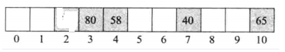
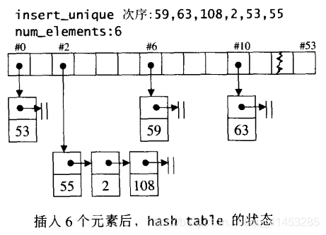

# hash table

二叉搜索树具有对数平均时间的表现，但这样的表现构造在一个假设上：输入数据有足够的随机性。

本文要介绍一种名为hash table（哈希表/散列表）的数据结构，这种结构**在插入、删除、搜索等操作上也具有“常数平均时间”的表现，**而且这种表现是以统计为基础，不需依赖输入元素的随机性。

## hash table（哈希表）概述

哈希表最大的优点，就是把数据的存储和查找消耗的时间大大降低，几乎可以看成是常数时间；而代价仅仅是消耗比较多的内存。然而在当前可利用内存越来越多的情况下，用空间换时间的做法是值得的。

其基本原理是：使用一个下标范围比较大的数组来存储元素。可以设计一个函数（哈希函数，也叫做散列函数），使得每个元素的关键字都与一个函数值（即数组下标，hash值）相对应，于是用这个数组单元来存储这个元素；也可以简单的理解为，按照关键字为每一个元素“分类”，然后将这个元素存储在相应“类”所对应的地方，称为桶。

## 散列（哈希）介绍

- 散列使用一个散列函数（也称为哈希函数）把字典的数对映射到一个散列表（也称为哈希表）的具体位置
- **散列的存储与查找：**
  - **查找：**如果数对p的关键字是k，散列函数为f，那么在理想的情况下，p在散列表中的位置为f(k)，我们首先计算f(k)，然后查看在散列表的f(k)处是否存在要查找的值
  - **存储：**与查找相同，使用f(k)函数算出键值对k在散列表的位置，然后把元素插入到散列表对应的位置
- **复杂度：**在理想情况下，初始化一个空字典的时间为O(b)（b为散列表拥有的位置数），查找、插入、删除操作的时间均为Θ(1)

- **桶：**散列表的每一个位置叫一个桶
- **起始桶：**对关键字为k的数对，f(k)是起始桶
- **桶的数量**等于散列表的长度或大小

## 散列函数

- 散列函数是一个将关键字k映射到散列表对应位置的函数
- 散列函数根据需求，可以有多种不同的种类

> ### 普通的散列函数
>
> - 例如一个班级最多有1000个学生，它们的ID号位于951000~952000之间，那么可以设计一个**散列函数f(k)=k-951000**把学生ID号映射到散列表的位置0到1000之间，所以可以用数组table[10001]来存储这些ID号

> ### 除法散列函数
>
> - 在多种散列函数中，除法散列函数是最常用的
>
> - 其形式如下：k是关键字，D是散列表的长度（即桶的数量），%为求模操作符
>
>   $f(k)=k\%D$
>
> - 例如下面D为11，序号从0到10，则24的散列索引为2（24%11=2）、80对应的散列索引为3（80%11=3）、40对应的散列索引为7（40%11=7）、65的散列索引为10（65%11=10）。如下图所示
>
> 

## 散列冲突与散列溢出

> ### 散列冲突
>
> - 当多个不同的关键字所对应的起始桶相同时，就会发生冲突
> - 散列冲突之后可以根据策略来进行解决，例如将冲突数据向后存储或者在同一个桶处存储多个数对
> - 比如一上面那张图来说，索引3处已经存在关键字80了，如果此时58也要加入散列表中，其根据散列函数求得58%11=3，因此跟80产生冲突，这个就叫做散列冲突
>
> 

> ### 散列溢出
>
> - 一个桶之可以存储多个数对，那么发生散列冲突也没事，因为可以将多个数据存储在一个桶中
> - 但是如果散列表中的一个桶数量用完时，没有多余的空间来存储新数对，那么就称之为散列溢出
> - 散列溢出时有很多的解决办法，其中最常用的方法是线性探针法

## 均匀散列函数、良好散列函数

> ### 均匀散列函数
>
> - 因为有散列冲突和散列溢出问题的存在，所以我们要设计一个优良的散列函数，**使的散列表中每一个桶可以存储的关键字数量大致相等且均匀**，那么冲突和溢出就会减少。我们将这样的函数成为均匀散列函数
>
> **例如：**
>
> - **非均匀散列函数：**假设散列有b个桶，且b>1。散列函数f(k)=0，那么无论什么关键字都只能存储在散列表的0索引处，其他桶都使用不到就造成冲突与浪费了，那么这个散列函数就不是均匀散列函数
> - **均匀散列函数：**假设b=11，关键字的范围为[0,98]，散列函数为f(k)=k%b。那么关键字[0,98]会把大约每9个关键字映射到一个桶中，这样一来，每个桶存储的数字都比较均匀，那么产生散列冲突的概率就会减少，那么这个散列函数相对来说就是均匀的散列函数

> ### 良好散列函数
>
> - 遗憾的是，我们无法使用某一种固定的方法选择一个关键字来设计均匀散列函数。在应用中，关键字都有某种程序的关联性
> - 例如，当关键字是整数时，可能是奇数占优或者偶数占优，不会是奇数和偶数均等。当关键字是字母数字形式的时候，前缀或后缀相同的关键字可能会占堆儿
> - 在实际应用中，关键字不是从关键字范围内均匀选择的，因此有的均匀散列函数表现好一点，有一些就差一些。在实际应用中性能表现好的均匀散列函数称为**良好散列函数**

## 散列函数除数D的选择

- 除法散列函数的格式如下：$f(k)=k\%D$

- **原则：**对于D的选择，有些会产生良好散列函数，有些会产生不良散列函数。但是只要D>1，**对D的所有选择，都会产生均匀散列函数**
- **D的选择：**
  - **如果D选择为偶数：**
    - 当k是偶数时，f(k)结果为偶数；当k是奇数时，f(k)结果为奇数；
    - 例如如果应用中以偶数关键字为主，则大部分关键字会被映射到序号为偶数的起始桶中。如果应用中以奇数关键字为主，则大部分关键字会被映射到序号为奇数的起始桶中
    - 因此使用D为偶数，得到的是不良散列函数
  - **如果D可以被诸如3、5、7这样的小奇数整除时**，不会产生良好散列函数
  - 因此，**选择的除数D应该既不是偶数也不能被小的奇数整除**
  - **理想的D是一个素数/质数**（素数与质数是一个概念）。如果你找到一个接近散列表长度的素数时，你应该选择不能被2和19之间的整数整除的D。
- **总结：**当使用除法散列函数时，选择除数D为奇数，可以是散列值依赖关键字的所有位。当D即是素数又不能被小于20的整数除，就能得到良好散列函数

## 非整型关键字

- 如果用哈希存储字典，如果字典的关键字不是一个整型，那么就需要将字典的关键字转换为整型，然后插入到对应的桶中

> ### 程序①
>
> - 下面创建一个函数，用来将一个长度为3的字符串转换为一个长整型
>
> ```c++
> long threeToLong(std::string s)
> {
> 	//最左边的字符
> 	long answer = s.at(0);
>  
> 	//左移8位，加入下一个字符
> 	answer = (answer << 8) + s.at(1);
>  
> 	//左移8位，加入下一个字符
> 	return ((answer << 8) + s.at(2));
> }
> ```
>
> - 当输入s为abc时，s.at(0)=a、s.at(1)=b、s.at(2)=c，它们的值分别为97、98、99
> - 3个字符构成的串不同，转换的长整型数也不同，因此此函数可以把一个长度为3的字符串转换为唯一的长整型数（长整型数的范围为$[0,2^{24}-1]$
> - 因为一个左移8位的操作符等价于乘以2^8=256，所以输出abc会输出((97\*256+98)\*256)+99=6382179

> ### 程序②
>
> ```c++
> long threeToInt(std::string s)
> {
> 	int length = (int)s.length(); //s中的字符个数
> 	int answer = 0;
>  
> 	//如果字符串长度为奇数
> 	if (length % 2 == 1) {
> 		answer = s.at(length - 1);
> 		length--;
> 	}
>  
> 	//长度为偶数
> 	for (int i = 0; i < length; i += 2) {
> 		//同时转换两个字符
> 		answer += s.at(i);
> 		answer += ((int)s.at(i + 1)) << 8;
> 	}
>  
> 	return (answer < 0) ? -answer : answer;
> }
> ```
>
> - 上面的程序①只可以把长度为3个字符的字符串转换为一个唯一的整数，但是这样方法比较有局限性
> - 在实际应用中，**散列函数可以把若干个关键字散列到相同的起始桶处，因此我们不必要把每个字符串转换为唯一的一个整数**，此处我们的函数采用一个算法，用来把一个任意长的字符串转换为一个整数，不同字符串转换之后可能得到的值会相同
> - 函数的思想：我们取输入的字符串的每个字符，并把每个字符转换为整数，然后将这些整数相加（相加的时候可以自己设计一算算法，例如上面每两个字符进行一次<<8的操作）

> ### hash函数
>
> ```c++
> template<class K> class hash;
>  
> template<>
> class hash<std::string>
> {
> public:
> 	std::size_t operator()(const std::string theKey)const
> 	{
> 		unsigned long hashValue = 0;
> 		int length = (int)theKey.length();
> 		for (int i = 0; i < length; i++) {
> 			hashValue = hashValue * 5 + theKey.at(i);
> 		}
>  
> 		return std::size_t(hashValue);
> 	}
> };
> ```
>
> - 我们定义了一个模板类，这个类用来将一个字符串转换为一个size_t类型的非负整数
> - 当然，我们也可以把一个int或long类型的整数转换为size_t类型的非负整数
>
> ```c++
> template<>
> class hash<int>
> {
> public:
> 	std::size_t operator()(const int theKey) const
> 	{
> 		return std::size_t(theKey);
> 	}
> };
>  
> template<>
> class hash<long>
> {
> public:
> 	std::size_t operator()(const long theKey) const
> 	{
> 		return std::size_t(theKey);
> 	}
> };
> ```

## 散列（哈希）冲突之线性探查法

- **线性探查法的基本思想：**在产生散列冲突时，将产生散列冲突的关键字向后存储
- 当使用了线性探查法之后，**整个散列表就被视为一个环形表了**

### 图示说明

- 散列函数为f(k)=k%11。且散列表的当前状态如下图所示


- 当要插入58关键字时，求得其起始桶为3=58%11，但是3号桶已经存放了80，那么就将其插入到4的索引处



- 此时再插入一个关键字24，其起始桶为2=24%11，那么直接插入桶2处


- 当再要插入35时，求得其起始桶为2=35%11，但是桶2已经有元素了，那就向后移动，一直移动到桶5处才有地方存储，那么就存储在桶5处


- 这就是线性探查法的基本思想

### 线性探查法下关键字的增加、查询、删除

> ### 增加：
>
> - 就是上面图示说明所介绍的思想

> ### 查询：
>
> - 1.首先根据要查找的关键字k，首先搜索起始桶f(k)，如果起始桶就是要查找的关键字就退出(查找的关键字不存在)；如果起始桶为空就退出；如果起始桶不为空，说明产生了散列冲突就进行下一步
> - 2.接着向后面遍历，如果查找到了就返回；如果再向后遍历的时候遇到了空桶就退出
> - 3.如果向后遍历的时候循环遍历又再次回到起始桶f(k)还是没有找到就退出(查找的关键字不存在)

> ### 删除：
>
> - **删除一个关键字需要删除之后保证查询操作可以正常进行，**例如下面如果删除了关键字58，那么35这个关键字就永远也找不到了，因为删除58之后，桶4被置位空。当查找35的时候首先查找桶2、再对比桶3、再对比桶4，发现桶4为空，那么就退出查找（此时35显示未查找到，实际上存在于散列表中）
>
>   
>
> - **删除的方法①：**删除之后，从删除的下一个桶开始，逐个检查每个桶，以确定要移动的元素，直到达到一个空桶或者回到删除位置为止就退出移动操作（但是需要注意，不要把一个数对移到它的起始桶之前，否则对这个数的查找就可能失败）。例如删除下面的58之后，就要把35移到桶4处，其余元素不动
>
> - **删除的方法②：**
>
>   为每个桶增加一个域neverUsed，思想如下：
>
>   - 在散列表初始化时，每个域被置位true。当一个关键字被插入桶之后，域neverUsed被置为false。当关键字被删除之后，域neverUsed也不会被重新置为true
>   - 在增加了域neverUsed的散列表中，查找元素在遇到空桶时不会退出查找，而是遇到一个桶为true时才退出。因此删除一个散列表的元素之后，不需要考虑移动元素了，因为查找操作遇到空桶但是桶的域neverUsed为false还继续会向后查找
>   - 为了提高性能，如果桶中的所有或大多数桶的域neverUsed变为false之后，搜索操作可能会失败。因此当很多桶的域neverUsed变为false之后，就必须重新组织这个散列表

## 散列（哈希）冲突之链地址法

- **链地址法的基本思想：**在散列表的每一个位置分配一个线性表。这样，每一个数对就可以存储在它的起始桶线性表中了
- 链地址法**同时也解决了散列表移除的问题**

- 例如，下图就是一个散列表，其中产生散列冲突的元素存储在同一个桶链表中了


### 链地址法的增加、删除、查找

> ### 查找
>
> - 根据关键字k与散列函数f(k)=k%D，计算起始桶。然后搜索该桶对应的链表
>
> ### 增加：
>
> - 首先保证散列表没有一个记录与该记录的关键字相同，为此而进行的搜索仅限于该记录的起始桶所对应的链表
>
> ### 删除：
>
> - 删除一个关键字为k的记录，先搜索它所对应的起始桶链表，找到该记录然后删除

### 一种改进的实现方法

- 在每个链表上增加一个尾节点，可以改进一些程序的性能
- 尾节点的关键字值最起码要比插入的所有数对的关键字都大
- 有了尾节点就省去了在链表中出现的大部分对空指针的检验操作
- 备注：每个链表都有不同的尾节点，实际上，所有的链表可共用一个尾节点
- 例如在下图中，尾节点的关键字用$\infty$表示（实际中用整数表示），可以使用limits.h头文件中定义的INT_MAX来替代


## hash table源码剖析

- hash table是作为hash_set、hash_map、hash_multiset、hash_multimap容器的**底层实现**
- 并且hash table**解决哈希冲突的方式是链地址法（开链）的形式**
- **SGI STL的哈希表结构：**
  - 哈希表用vector实现
  - vector的一个索引出代表一个桶子（bucket）
  - 每个桶子内含有一串链表，链中有含有节点

### 哈希冲突

* 使用hash function带来一个问题：可能有不同的元素被映射到相同的位置（亦即有相同的索引）。这便是所谓的“碰撞(collision)”问题。解决碰撞问题的方法有许多种，包括线性探测(linear probing)、二次探测(quadratic probing)、开链(separate chaining)等做法。
* 负载系数（loading factor），意指元素个数除以表格大小，负载系数永远在0-1之间，除非采用开链策略。

> ### 线性探测（Linear Probing）
>
> 在哈希表的连续空间上，当发生冲突的时候，向后存储。
>
> 根据元素的值然后除以数组大小，然后插入指定的位置。
>
> 
>
> - **主集团现象：**在上图中，如果我们插入的新元素为8、9、0、1、2、3中，第一次的落脚点一定在#3上，这就造成了性能的降低，平均插入成本增加，这种现象在哈希过程中称为主集团（primary clustering）

> ### 二次探测（quadratic probing）
>
> - 二次探测用来**解决主集团问题的**。其解决哈希冲突的方式下列公式：
>
> $F(i)=i^2$
>
> * 也就说，如果新元素的起始插入位置为H的话但是H已被占用，那么就会依次尝试$H+1^2$，$H+2^2$，$H+3^2$……，$H+i^2$。
>
> 
>
> - **二次探测带来一些疑问：**
>
>   - ①线性探测每次探测的都必然是一个不同的位置，二次探测能够保证如此？二次探测能否保证如果表格之中没有X，那么我们插入X一定能够成功？
>   - ②线性探测的运算过程极其简单，二次探测则显然复杂得多。这是否会在执行效率上带来太多的负面影响？
>   - ③不论线性探测还是二次探测，当负载系数过高时，表格是否能够动态成长？
>
> - **疑惑①：**幸运的是，如果**假设表格大小为质数，**而且永远保持负载系数在0.5以下（也就是说超过0.5就要重新配置表格），那么就可以确定每插入一个元素所需要的探测次数不多于2
>
> - **疑惑②：**至于复杂度问题，一般总是这样考虑：收获的比付出的多，才值得这么做。我们增加了探测次数，所获得的利益好歹比二次函数计算所花的时间多。线性探测需要的是一个加法（加1），一个测试（看是否回头），以及一个可能用到的减法（用以绕转回头）。二次探测需要的则是一个加法（从i-1到i）、一个乘法（计算$i^2$），另一个加法以及一个mod运算。看起来得不偿失。然而中间却又一些技巧，可以除去耗时的乘法和除法：
>
>   $H_i=H_0+i^2(mod M)$
>
>   $H_{i-1}=H_0+(i-1)^2(mod M)$
>
>   整理可得：
>
>   $H_i-H_{i-1}=i^2-(i-1)^2(mod M)$
>
>   $H_i-H_{i-1}=2i-1(mod M)$
>
> - 因此，如果我们能够以前一个H值来计算下一个H值，就不需要执行二次方所需要的乘法了。虽然还是一个乘法，但那是乘以2，可以位移位快速完成。置于mod运算，也可证明并非真有需要
> - 疑惑③：array的增长。如果想要扩充表格，首先必须要找出下一个新的且足够大（大约两倍）的质数，然后考虑表格重建的成本——不仅要拷贝元素，还需要考虑元素在新表格中的位置然后再插入
> - **二次探测可以消除主集团，却可能造成次集团：**两个元素经由哈希函数计算出来的位置若相同，则插入时所探测的位置也相同，形成了某种浪费。消除次集团的方法也有，例如复式散列

> ### 开链（链地址法）
>
> - 所谓的开链，就是在每一个表格元素中维护一个链表
> - 使用这种方法，表格的负载系数将大于1
> - SGI STL的哈希表便是采用这种做法
>
> 

### hash table的节点定义

SGL STL称hash table表格内的元素为桶子(bucket)，此名称的大约意义是，表格内的每个单元，涵盖的不只是个节点(元素)，甚至可能是一“桶”节点。

以下是hash table的节点定义

```c++
template <class _Val>
struct _Hashtable_node
{
  _Hashtable_node* _M_next;
  _Val _M_val;
}; 
```

注意，bucket所维护的linked list，并不采用STL的list或slist，而是自行维护上述的hash table node，至于buckets聚合体，则以vector完成，以便有动态扩充能力。

### hash table的迭代器

**下面是迭代器的定义：**

- 迭代器必须永远维系着与整个“bucket vector”的关系，并记录目前所知的节点

```c++
template <class _Val, class _Key, class _HashFcn,
          class _ExtractKey, class _EqualKey, class _Alloc>
struct _Hashtable_iterator {
  typedef hashtable<_Val,_Key,_HashFcn,_ExtractKey,_EqualKey,_Alloc>
          _Hashtable;
  typedef _Hashtable_iterator<_Val, _Key, _HashFcn, 
                              _ExtractKey, _EqualKey, _Alloc>
          iterator;
  typedef _Hashtable_const_iterator<_Val, _Key, _HashFcn, 
                                    _ExtractKey, _EqualKey, _Alloc>
          const_iterator;
  typedef _Hashtable_node<_Val> _Node;

  typedef forward_iterator_tag iterator_category;
  typedef _Val value_type;
  typedef ptrdiff_t difference_type;
  typedef size_t size_type;
  typedef _Val& reference;
  typedef _Val* pointer;

  _Node* _M_cur; //迭代器目前所指节点
  _Hashtable* _M_ht;//保持对容器的连结关系（因为可能需要从bucket跳到bucket）

  _Hashtable_iterator(_Node* __n, _Hashtable* __tab) 
    : _M_cur(__n), _M_ht(__tab) {}
  _Hashtable_iterator() {}
  reference operator*() const { return _M_cur->_M_val; }
#ifndef __SGI_STL_NO_ARROW_OPERATOR
  pointer operator->() const { return &(operator*()); }
#endif /* __SGI_STL_NO_ARROW_OPERATOR */
  iterator& operator++();
  iterator operator++(int);
  bool operator==(const iterator& __it) const
    { return _M_cur == __it._M_cur; }
  bool operator!=(const iterator& __it) const
    { return _M_cur != __it._M_cur; }
};
```

- 迭代器**没有后退操作（operator--）**，也没有定义所谓的逆向迭代器（reverse iterator）
- **迭代器前进操作（operator++）：**
  - 其前进操作时首先尝试从目前所知的节点出发，前进一个位置（节点），由于节点被安置于list内，所以利用节点的next指针即可轻易达到前进的目的
  - 如果目前节点正巧是list的尾端，就跳到下一个bucket内，跳过之后指向下一个list的头节点
  - 下面是operator++的定义

```c++
template <class _Val, class _Key, class _HF, class _ExK, class _EqK, 
          class _All>
_Hashtable_iterator<_Val,_Key,_HF,_ExK,_EqK,_All>&
_Hashtable_iterator<_Val,_Key,_HF,_ExK,_EqK,_All>::operator++()
{
  const _Node* __old = _M_cur;
  _M_cur = _M_cur->_M_next;//如果存在，就是它，否则进入if
  if (!_M_cur) {
    //根据元素值，定位出下一个bucket。其起头处就是我们的目的地
    size_type __bucket = _M_ht->_M_bkt_num(__old->_M_val);
    while (!_M_cur && ++__bucket < _M_ht->_M_buckets.size())
      _M_cur = _M_ht->_M_buckets[__bucket];
  }
  return *this;
}

template <class _Val, class _Key, class _HF, class _ExK, class _EqK, 
          class _All>
inline _Hashtable_iterator<_Val,_Key,_HF,_ExK,_EqK,_All>
_Hashtable_iterator<_Val,_Key,_HF,_ExK,_EqK,_All>::operator++(int)
{
  iterator __tmp = *this;
  ++*this;
  return __tmp;
}
```

### hash table的数据结构

- 下面就是哈希表的结构，其**内部是以vector实现的**
- **模板参数比较多，包括：**
  - _Val：节点的实值类型
  - _Key：节点的键值类型
  - _HF：hash function的函数类型
  - _Ex：从节点取出键值的方法（函数或仿函数）
  - _Eq：判断键值相同与否的方法（函数或仿函数）
  - _All：空间配置器。缺省使用std::alloc

```c++
template <class _Val, class _Key, class _HashFcn,
          class _ExtractKey, class _EqualKey, class _Alloc>
class hashtable {
public:
  typedef _Key key_type;
  typedef _Val value_type;
  typedef _HashFcn hasher;
  typedef _EqualKey key_equal;

  typedef size_t            size_type;
  typedef ptrdiff_t         difference_type;
  typedef value_type*       pointer;
  typedef const value_type* const_pointer;
  typedef value_type&       reference;
  typedef const value_type& const_reference;

  hasher hash_funct() const { return _M_hash; }
  key_equal key_eq() const { return _M_equals; }

private:
  typedef _Hashtable_node<_Val> _Node;

#ifdef __STL_USE_STD_ALLOCATORS
public:
  typedef typename _Alloc_traits<_Val,_Alloc>::allocator_type allocator_type;
  allocator_type get_allocator() const { return _M_node_allocator; }
private:
  typename _Alloc_traits<_Node, _Alloc>::allocator_type _M_node_allocator;
  _Node* _M_get_node() { return _M_node_allocator.allocate(1); }
  void _M_put_node(_Node* __p) { _M_node_allocator.deallocate(__p, 1); }
# define __HASH_ALLOC_INIT(__a) _M_node_allocator(__a), 
#else /* __STL_USE_STD_ALLOCATORS */
public:
  typedef _Alloc allocator_type;
  allocator_type get_allocator() const { return allocator_type(); }
private:
  typedef simple_alloc<_Node, _Alloc> _M_node_allocator_type;
  _Node* _M_get_node() { return _M_node_allocator_type::allocate(1); }
  void _M_put_node(_Node* __p) { _M_node_allocator_type::deallocate(__p, 1); }
# define __HASH_ALLOC_INIT(__a)
#endif /* __STL_USE_STD_ALLOCATORS */

private:
  hasher                _M_hash;
  key_equal             _M_equals;
  _ExtractKey           _M_get_key;
  vector<_Node*,_Alloc> _M_buckets;
  size_type             _M_num_elements;

public:
  typedef _Hashtable_iterator<_Val,_Key,_HashFcn,_ExtractKey,_EqualKey,_Alloc>
          iterator;
  typedef _Hashtable_const_iterator<_Val,_Key,_HashFcn,_ExtractKey,_EqualKey,
                                    _Alloc>
          const_iterator;

  friend struct
  _Hashtable_iterator<_Val,_Key,_HashFcn,_ExtractKey,_EqualKey,_Alloc>;
  friend struct
  _Hashtable_const_iterator<_Val,_Key,_HashFcn,_ExtractKey,_EqualKey,_Alloc>;

public:
  hashtable(size_type __n,
            const _HashFcn&    __hf,
            const _EqualKey&   __eql,
            const _ExtractKey& __ext,
            const allocator_type& __a = allocator_type())
    : __HASH_ALLOC_INIT(__a)
      _M_hash(__hf),
      _M_equals(__eql),
      _M_get_key(__ext),
      _M_buckets(__a),
      _M_num_elements(0)
  {
    _M_initialize_buckets(__n);
  }

  hashtable(size_type __n,
            const _HashFcn&    __hf,
            const _EqualKey&   __eql,
            const allocator_type& __a = allocator_type())
    : __HASH_ALLOC_INIT(__a)
      _M_hash(__hf),
      _M_equals(__eql),
      _M_get_key(_ExtractKey()),
      _M_buckets(__a),
      _M_num_elements(0)
  {
    _M_initialize_buckets(__n);
  }

  hashtable(const hashtable& __ht)
    : __HASH_ALLOC_INIT(__ht.get_allocator())
      _M_hash(__ht._M_hash),
      _M_equals(__ht._M_equals),
      _M_get_key(__ht._M_get_key),
      _M_buckets(__ht.get_allocator()),
      _M_num_elements(0)
  {
    _M_copy_from(__ht);
  }

#undef __HASH_ALLOC_INIT

  hashtable& operator= (const hashtable& __ht)
  {
    if (&__ht != this) {
      clear();
      _M_hash = __ht._M_hash;
      _M_equals = __ht._M_equals;
      _M_get_key = __ht._M_get_key;
      _M_copy_from(__ht);
    }
    return *this;
  }

  ~hashtable() { clear(); }

  size_type size() const { return _M_num_elements; }
  size_type max_size() const { return size_type(-1); }
  bool empty() const { return size() == 0; }

  void swap(hashtable& __ht)
  {
    __STD::swap(_M_hash, __ht._M_hash);
    __STD::swap(_M_equals, __ht._M_equals);
    __STD::swap(_M_get_key, __ht._M_get_key);
    _M_buckets.swap(__ht._M_buckets);
    __STD::swap(_M_num_elements, __ht._M_num_elements);
  }

  iterator begin()
  { 
    for (size_type __n = 0; __n < _M_buckets.size(); ++__n)
      if (_M_buckets[__n])
        return iterator(_M_buckets[__n], this);
    return end();
  }

  iterator end() { return iterator(0, this); }

  const_iterator begin() const
  {
    for (size_type __n = 0; __n < _M_buckets.size(); ++__n)
      if (_M_buckets[__n])
        return const_iterator(_M_buckets[__n], this);
    return end();
  }

  const_iterator end() const { return const_iterator(0, this); }

#ifdef __STL_MEMBER_TEMPLATES
  template <class _Vl, class _Ky, class _HF, class _Ex, class _Eq, class _Al>
  friend bool operator== (const hashtable<_Vl, _Ky, _HF, _Ex, _Eq, _Al>&,
                          const hashtable<_Vl, _Ky, _HF, _Ex, _Eq, _Al>&);
#else /* __STL_MEMBER_TEMPLATES */
  friend bool __STD_QUALIFIER
  operator== __STL_NULL_TMPL_ARGS (const hashtable&, const hashtable&);
#endif /* __STL_MEMBER_TEMPLATES */

public:

  size_type bucket_count() const { return _M_buckets.size(); }

  size_type max_bucket_count() const
    { return __stl_prime_list[(int)__stl_num_primes - 1]; } 

  size_type elems_in_bucket(size_type __bucket) const
  {
    size_type __result = 0;
    for (_Node* __cur = _M_buckets[__bucket]; __cur; __cur = __cur->_M_next)
      __result += 1;
    return __result;
  }

  pair<iterator, bool> insert_unique(const value_type& __obj)
  {
    resize(_M_num_elements + 1);
    return insert_unique_noresize(__obj);
  }

  iterator insert_equal(const value_type& __obj)
  {
    resize(_M_num_elements + 1);
    return insert_equal_noresize(__obj);
  }

  pair<iterator, bool> insert_unique_noresize(const value_type& __obj);
  iterator insert_equal_noresize(const value_type& __obj);
 
#ifdef __STL_MEMBER_TEMPLATES
  template <class _InputIterator>
  void insert_unique(_InputIterator __f, _InputIterator __l)
  {
    insert_unique(__f, __l, __ITERATOR_CATEGORY(__f));
  }

  template <class _InputIterator>
  void insert_equal(_InputIterator __f, _InputIterator __l)
  {
    insert_equal(__f, __l, __ITERATOR_CATEGORY(__f));
  }

  template <class _InputIterator>
  void insert_unique(_InputIterator __f, _InputIterator __l,
                     input_iterator_tag)
  {
    for ( ; __f != __l; ++__f)
      insert_unique(*__f);
  }

  template <class _InputIterator>
  void insert_equal(_InputIterator __f, _InputIterator __l,
                    input_iterator_tag)
  {
    for ( ; __f != __l; ++__f)
      insert_equal(*__f);
  }

  template <class _ForwardIterator>
  void insert_unique(_ForwardIterator __f, _ForwardIterator __l,
                     forward_iterator_tag)
  {
    size_type __n = 0;
    distance(__f, __l, __n);
    resize(_M_num_elements + __n);
    for ( ; __n > 0; --__n, ++__f)
      insert_unique_noresize(*__f);
  }

  template <class _ForwardIterator>
  void insert_equal(_ForwardIterator __f, _ForwardIterator __l,
                    forward_iterator_tag)
  {
    size_type __n = 0;
    distance(__f, __l, __n);
    resize(_M_num_elements + __n);
    for ( ; __n > 0; --__n, ++__f)
      insert_equal_noresize(*__f);
  }

#else /* __STL_MEMBER_TEMPLATES */
  void insert_unique(const value_type* __f, const value_type* __l)
  {
    size_type __n = __l - __f;
    resize(_M_num_elements + __n);
    for ( ; __n > 0; --__n, ++__f)
      insert_unique_noresize(*__f);
  }

  void insert_equal(const value_type* __f, const value_type* __l)
  {
    size_type __n = __l - __f;
    resize(_M_num_elements + __n);
    for ( ; __n > 0; --__n, ++__f)
      insert_equal_noresize(*__f);
  }

  void insert_unique(const_iterator __f, const_iterator __l)
  {
    size_type __n = 0;
    distance(__f, __l, __n);
    resize(_M_num_elements + __n);
    for ( ; __n > 0; --__n, ++__f)
      insert_unique_noresize(*__f);
  }

  void insert_equal(const_iterator __f, const_iterator __l)
  {
    size_type __n = 0;
    distance(__f, __l, __n);
    resize(_M_num_elements + __n);
    for ( ; __n > 0; --__n, ++__f)
      insert_equal_noresize(*__f);
  }
#endif /*__STL_MEMBER_TEMPLATES */

  reference find_or_insert(const value_type& __obj);

  iterator find(const key_type& __key) 
  {
    size_type __n = _M_bkt_num_key(__key);
    _Node* __first;
    for ( __first = _M_buckets[__n];
          __first && !_M_equals(_M_get_key(__first->_M_val), __key);
          __first = __first->_M_next)
      {}
    return iterator(__first, this);
  } 

  const_iterator find(const key_type& __key) const
  {
    size_type __n = _M_bkt_num_key(__key);
    const _Node* __first;
    for ( __first = _M_buckets[__n];
          __first && !_M_equals(_M_get_key(__first->_M_val), __key);
          __first = __first->_M_next)
      {}
    return const_iterator(__first, this);
  } 

  size_type count(const key_type& __key) const
  {
    const size_type __n = _M_bkt_num_key(__key);
    size_type __result = 0;

    for (const _Node* __cur = _M_buckets[__n]; __cur; __cur = __cur->_M_next)
      if (_M_equals(_M_get_key(__cur->_M_val), __key))
        ++__result;
    return __result;
  }

  pair<iterator, iterator> 
  equal_range(const key_type& __key);

  pair<const_iterator, const_iterator> 
  equal_range(const key_type& __key) const;

  size_type erase(const key_type& __key);
  void erase(const iterator& __it);
  void erase(iterator __first, iterator __last);

  void erase(const const_iterator& __it);
  void erase(const_iterator __first, const_iterator __last);

  void resize(size_type __num_elements_hint);
  void clear();

private:
  size_type _M_next_size(size_type __n) const
    { return __stl_next_prime(__n); }

  void _M_initialize_buckets(size_type __n)
  {
    const size_type __n_buckets = _M_next_size(__n);
    _M_buckets.reserve(__n_buckets);
    _M_buckets.insert(_M_buckets.end(), __n_buckets, (_Node*) 0);
    _M_num_elements = 0;
  }

  size_type _M_bkt_num_key(const key_type& __key) const
  {
    return _M_bkt_num_key(__key, _M_buckets.size());
  }

  size_type _M_bkt_num(const value_type& __obj) const
  {
    return _M_bkt_num_key(_M_get_key(__obj));
  }

  size_type _M_bkt_num_key(const key_type& __key, size_t __n) const
  {
    return _M_hash(__key) % __n;
  }

  size_type _M_bkt_num(const value_type& __obj, size_t __n) const
  {
    return _M_bkt_num_key(_M_get_key(__obj), __n);
  }

  _Node* _M_new_node(const value_type& __obj)
  {
    _Node* __n = _M_get_node();
    __n->_M_next = 0;
    __STL_TRY {
      construct(&__n->_M_val, __obj);
      return __n;
    }
    __STL_UNWIND(_M_put_node(__n));
  }
  
  void _M_delete_node(_Node* __n)
  {
    destroy(&__n->_M_val);
    _M_put_node(__n);
  }

  void _M_erase_bucket(const size_type __n, _Node* __first, _Node* __last);
  void _M_erase_bucket(const size_type __n, _Node* __last);

  void _M_copy_from(const hashtable& __ht);

};
```

> ### 系统预定义的哈希大小
>
> - 虽然链地址法并不要求哈希表大小必须为质数，但SGI STL仍然以质数来设计哈希表大小，并且先将28个质数（主键呈现大约2倍的关系）计算好，以备随时使用，同时提供一个函数，用来查询在这28个质数之中，“最接近某数并大于某数”的质数
>
> ```c++
> enum { __stl_num_primes = 28 };
> 
> static const unsigned long __stl_prime_list[__stl_num_primes] =
> {
>   53ul,         97ul,         193ul,       389ul,       769ul,
>   1543ul,       3079ul,       6151ul,      12289ul,     24593ul,
>   49157ul,      98317ul,      196613ul,    393241ul,    786433ul,
>   1572869ul,    3145739ul,    6291469ul,   12582917ul,  25165843ul,
>   50331653ul,   100663319ul,  201326611ul, 402653189ul, 805306457ul, 
>   1610612741ul, 3221225473ul, 4294967291ul
> };
> 
> inline unsigned long __stl_next_prime(unsigned long __n)
> {
>   const unsigned long* __first = __stl_prime_list;
>   const unsigned long* __last = __stl_prime_list + (int)__stl_num_primes;
>   const unsigned long* pos = lower_bound(__first, __last, __n);
>   return pos == __last ? *(__last - 1) : *pos;
> }
> ```
>
> ```c++
> class hashtable {
>   ...
>   public:
>   //总共可以有多少buckets
>   size_type max_bucket_count() const
>     { return __stl_prime_list[(int)__stl_num_primes - 1]; } 
>   ...
> };
> ```

### hash table的构造和内存管理

- 在hashtable类中有一个专**属的节点配置器_M_node_allocator_type**

```c++
class hashtable {
//...
private:
  typedef simple_alloc<_Node, _Alloc> _M_node_allocator_type;
//...
};
```

- 下面是定义在hashtable类中的**节点的配置函数与释放函数**

```c++
  _Node* _M_new_node(const value_type& __obj)
  {
    _Node* __n = _M_get_node();
    __n->_M_next = 0;
    __STL_TRY {
      construct(&__n->_M_val, __obj);
      return __n;
    }
    __STL_UNWIND(_M_put_node(__n));
  }
  
  void _M_delete_node(_Node* __n)
  {
    destroy(&__n->_M_val);
    _M_put_node(__n);
  }
```

- hashtable没有提供默认的构造函数。下面是一种构造函数

```c++
class hashtable {
  ...
public:
  hashtable(size_type __n,
            const _HashFcn&    __hf,
            const _EqualKey&   __eql,
            const _ExtractKey& __ext,
            const allocator_type& __a = allocator_type())
    : __HASH_ALLOC_INIT(__a)
      _M_hash(__hf),
      _M_equals(__eql),
      _M_get_key(__ext),
      _M_buckets(__a),
      _M_num_elements(0)
  {
    _M_initialize_buckets(__n);
  }
  
private:
  //该函数返回最近接n并大于n的质数。其中调用了我们上面介绍的__stl_next_prime函数
  size_type _M_next_size(size_type __n) const
    { return __stl_next_prime(__n); }

  void _M_initialize_buckets(size_type __n)
  {
    const size_type __n_buckets = _M_next_size(__n);
    //举例：传入50，返回53.以下首先保留53个元素空间，然后将其全部填0
    _M_buckets.reserve(__n_buckets);
    _M_buckets.insert(_M_buckets.end(), __n_buckets, (_Node*) 0);
    _M_num_elements = 0;
  }
  ...
};
```

- 例如下面我们定义一个hashtable就会调用上面的构造函数

```c++
hashtable<int,int,hash<iny>,identity<int>,equal_to<int>,alloc> iht(50,hash<int>(),equal_to<int>());
 
std::cout<<iht.size()<<std::endl; //0
std::cout<<iht.bucket_count()<<std::endl; //53。STL提供的第一个质数
```

### 插入操作和表格重整

- **insert_unique()：**插入元素，不允许重复

```c++
  pair<iterator, bool> insert_unique(const value_type& __obj)
  {
    resize(_M_num_elements + 1);//判断是否需要重建表格
    return insert_unique_noresize(__obj);//在不需要重建表格的情况下插入节点，键值不允许重复
  }
```

- **resize()函数：**

```c++
//以下函数判断是否需要重建表格。不需要就返回
template <class _Val, class _Key, class _HF, class _Ex, class _Eq, class _All>
void hashtable<_Val,_Key,_HF,_Ex,_Eq,_All>
  ::resize(size_type __num_elements_hint)
{
  //下面是否重建表格的判断原则很奇怪，是拿元素个数（把新增元素计入后）和bucket vector的大小来比较
  //如果前者大于后者，就重建表格
  //由此可知，每个bucket（list）的最大容量和buckets vector的大小相同
  const size_type __old_n = _M_buckets.size();
  if (__num_elements_hint > __old_n) {//确定真的需要重新配置
    const size_type __n = _M_next_size(__num_elements_hint);//找出下一个质数
    if (__n > __old_n) {
      vector<_Node*, _All> __tmp(__n, (_Node*)(0),
                                 _M_buckets.get_allocator());//建立新的buckets
      __STL_TRY {
        //以下处理每一个旧的bucket
        for (size_type __bucket = 0; __bucket < __old_n; ++__bucket) {
          _Node* __first = _M_buckets[__bucket];
          while (__first) {
            size_type __new_bucket = _M_bkt_num(__first->_M_val, __n);
            _M_buckets[__bucket] = __first->_M_next;
            __first->_M_next = __tmp[__new_bucket];
            __tmp[__new_bucket] = __first;
            __first = _M_buckets[__bucket];          
          }
        }
        _M_buckets.swap(__tmp);
      }
#         ifdef __STL_USE_EXCEPTIONS
      catch(...) {
        for (size_type __bucket = 0; __bucket < __tmp.size(); ++__bucket) {
          while (__tmp[__bucket]) {
            _Node* __next = __tmp[__bucket]->_M_next;
            _M_delete_node(__tmp[__bucket]);
            __tmp[__bucket] = __next;
          }
        }
        throw;
      }
#         endif /* __STL_USE_EXCEPTIONS */
    }
  }
}
```

- 在上面的resize()函数中，如果有必要就做表格重建。操作分解如下：

```c++
_M_buckets[__bucket] = __first->_M_next; //(1)令旧的bucket指向其所对应之链表的下一个节点
__first->_M_next = __tmp[__new_bucket]; 
__tmp[__new_bucket] = __first;//(2)(3)将当前节点插入到新bucket内，成为其对应链表的第一个节点
__first = _M_buckets[__bucket];  //(4)回到旧的bucket所指的待处理链表，准备处理下一个节点
```


```c++
//在不需要重建表格的情况下插入节点，键值不允许重复
template <class _Val, class _Key, class _HF, class _Ex, class _Eq, class _All>
pair<typename hashtable<_Val,_Key,_HF,_Ex,_Eq,_All>::iterator, bool> 
hashtable<_Val,_Key,_HF,_Ex,_Eq,_All>
  ::insert_unique_noresize(const value_type& __obj)
{
  const size_type __n = _M_bkt_num(__obj);
  _Node* __first = _M_buckets[__n];//令first指向bucket对应之串行头部

  //如果buckets[n]已被占用，此时first将不为0，于是进入以下循环，走过bucket所对应的整个链表
  for (_Node* __cur = __first; __cur; __cur = __cur->_M_next) 
    if (_M_equals(_M_get_key(__cur->_M_val), _M_get_key(__obj)))
      //如果发现与链表中的某键值相同，就不插入，立即返回
      return pair<iterator, bool>(iterator(__cur, this), false);
  //离开循环（或根本不进入循环）时，first指向bucket所指链表的头结点
  _Node* __tmp = _M_new_node(__obj);
  __tmp->_M_next = __first;
  _M_buckets[__n] = __tmp;//令新节点称为链表的第一个节点
  ++_M_num_elements;//节点个数累加1
  return pair<iterator, bool>(iterator(__tmp, this), true);
}
```

* **insert_equal()**：插入元素，允许重复

```c++
  iterator insert_equal(const value_type& __obj)
  {
    resize(_M_num_elements + 1);
    return insert_equal_noresize(__obj);
  }
```

```c++
//在不需要重建表格的情况下插入新节点，键值允许重复
template <class _Val, class _Key, class _HF, class _Ex, class _Eq, class _All>
typename hashtable<_Val,_Key,_HF,_Ex,_Eq,_All>::iterator 
hashtable<_Val,_Key,_HF,_Ex,_Eq,_All>
  ::insert_equal_noresize(const value_type& __obj)
{
  const size_type __n = _M_bkt_num(__obj);
  _Node* __first = _M_buckets[__n];

  for (_Node* __cur = __first; __cur; __cur = __cur->_M_next) 
    if (_M_equals(_M_get_key(__cur->_M_val), _M_get_key(__obj))) {
      _Node* __tmp = _M_new_node(__obj);
      __tmp->_M_next = __cur->_M_next;//将新节点插入于目前位置
      __cur->_M_next = __tmp;
      ++_M_num_elements;
      return iterator(__tmp, this);
    }
  // 进行至此，表示没有发现重复的键值
  _Node* __tmp = _M_new_node(__obj);
  __tmp->_M_next = __first;// 将新节点插入于链表头部
  _M_buckets[__n] = __tmp;
  ++_M_num_elements;
  return iterator(__tmp, this);
}
```

> ### 判断元素落脚点（bkt_num）
>
> - **插入元素之后需要知道某个元素落脚于哪一个bucket内。**这本来是哈希函数的责任，但是SGI把这个任务包装了一层，先交给bkt_num()函数，再由此函数调用哈希函数，取得一个可以执行modulus（取模）运算的数值
> - **为什么要这么做？**因为有些函数类型无法直接拿来对哈表表的大小进行模运算，例如字符串，这时候我们需要做一些转换
> - **下面是bkt_num函数：**
>
> ```c++
> //版本1：接受实值（value）和buckets个数
> size_type _M_bkt_num(const value_type& __obj, size_t __n) const
> {
>     return _M_bkt_num_key(_M_get_key(__obj), __n); //调用版本4
> }
>  
> //版本2：只接受实值（value）
> size_type _M_bkt_num(const value_type& __obj) const
> {
>     return _M_bkt_num_key(_M_get_key(__obj)); //调用版本3
> }
>  
> //版本3，只接受键值
> size_type _M_bkt_num_key(const key_type& __key) const
> {
>     return _M_bkt_num_key(__key, _M_buckets.size()); //调用版本4
> }
>  
> //版本4：接受键值和buckets个数
> size_type _M_bkt_num_key(const key_type& __key, size_t __n) const
> {
>     return _M_hash(__key) % __n; //SGI的所有内建的hash()，在后面的hash functions中介绍
> }
>  
> ```

> ### 复制（copy_from）和整体删除（clear）
>
> - 由于整个哈希表由vector和链表组成，因此，复制和整体删除，都需要特别注意内存的释放问题
> - **下面是clear()的定义：**
>
> ```c++
> template <class _Val, class _Key, class _HF, class _Ex, class _Eq, class _All>
> void hashtable<_Val,_Key,_HF,_Ex,_Eq,_All>::clear()
> {
>   //针对每一个bucket
>   for (size_type __i = 0; __i < _M_buckets.size(); ++__i) {
>     _Node* __cur = _M_buckets[__i];
>     //将bucket list中的每一个节点删除
>     while (__cur != 0) {
>       _Node* __next = __cur->_M_next;
>       _M_delete_node(__cur);
>       __cur = __next;
>     }
>     _M_buckets[__i] = 0;//令bucket内容为null指针
>   }
>   _M_num_elements = 0;//令总节点个数为0
>   //注意，buckets vector并未释放掉空间，仍然保有原来大小
> }
> ```
>
> * **下面是copy_from()的定义：**
>
> ```c++
> template <class _Val, class _Key, class _HF, class _Ex, class _Eq, class _All>
> void hashtable<_Val,_Key,_HF,_Ex,_Eq,_All>
>   ::_M_copy_from(const hashtable& __ht)
> {
>   _M_buckets.clear();//先清除自己的bucket vector
>   //为自己的buckets vector保留空间，使与对方相同
>   //如果自己空间大于对方就不动。如果自己空间小于对方，就增大
>   _M_buckets.reserve(__ht._M_buckets.size());
>   _M_buckets.insert(_M_buckets.end(), __ht._M_buckets.size(), (_Node*) 0);
>   __STL_TRY {
>     for (size_type __i = 0; __i < __ht._M_buckets.size(); ++__i) {
>       //复制vector的每一个元素（是个指针，指向节点）
>       const _Node* __cur = __ht._M_buckets[__i];
>       if (__cur) {
>         _Node* __copy = _M_new_node(__cur->_M_val);
>         _M_buckets[__i] = __copy;
> 
>         //针对同一个bucket list，复制每一个节点
>         for (_Node* __next = __cur->_M_next; 
>              __next; 
>              __cur = __next, __next = __cur->_M_next) {
>           __copy->_M_next = _M_new_node(__next->_M_val);
>           __copy = __copy->_M_next;
>         }
>       }
>     }
>     _M_num_elements = __ht._M_num_elements;//重新记录节点个数（哈希表的大小）
>   }
>   __STL_UNWIND(clear());
> }
> ```

### hansh functions

- 在**<stl_hash_fun.h>**中定义了一些hash functions，全都是仿函数
- **hash functions是计算元素位置的函数**
- SGI将这项任务赋予了先前提到过的bkt_num()函数，再**由bkt_num()函数调用这些hash function，**取得一个可以对hashtable进行模运算的值
- 针对char、int、long等整数类型，这里大部分的hash function什么都没有做，只是直接返回原值。但是**对于字符串类型，**就设计了一个转换函数如下：

```c++
template <class _Key> struct hash { };

inline size_t __stl_hash_string(const char* __s)
{
  unsigned long __h = 0; 
  for ( ; *__s; ++__s)
    __h = 5*__h + *__s;
  
  return size_t(__h);
}

__STL_TEMPLATE_NULL struct hash<char*>
{
  size_t operator()(const char* __s) const { return __stl_hash_string(__s); }
};

__STL_TEMPLATE_NULL struct hash<const char*>
{
  size_t operator()(const char* __s) const { return __stl_hash_string(__s); }
};

__STL_TEMPLATE_NULL struct hash<char> {
  size_t operator()(char __x) const { return __x; }
};
__STL_TEMPLATE_NULL struct hash<unsigned char> {
  size_t operator()(unsigned char __x) const { return __x; }
};
__STL_TEMPLATE_NULL struct hash<signed char> {
  size_t operator()(unsigned char __x) const { return __x; }
};
__STL_TEMPLATE_NULL struct hash<short> {
  size_t operator()(short __x) const { return __x; }
};
__STL_TEMPLATE_NULL struct hash<unsigned short> {
  size_t operator()(unsigned short __x) const { return __x; }
};
__STL_TEMPLATE_NULL struct hash<int> {
  size_t operator()(int __x) const { return __x; }
};
__STL_TEMPLATE_NULL struct hash<unsigned int> {
  size_t operator()(unsigned int __x) const { return __x; }
};
__STL_TEMPLATE_NULL struct hash<long> {
  size_t operator()(long __x) const { return __x; }
};
__STL_TEMPLATE_NULL struct hash<unsigned long> {
  size_t operator()(unsigned long __x) const { return __x; }
};
```

> ### hash functions无法处理的类型
>
> - hashtable**无法处理上述所列各项类型之外的元素**。例如string、double、float等，这些类型**用户必须自己定义hash function**

## 演示案例

```c++
#include <hash_set> //会包含<stl_hashtable.h>
#include <iostream>
using namespace std;
 
int main()
{
	hashtable<int, int, hash<int>, identity<int>, equal_to<int>, alloc>
		iht(50, hash<int>(), equal_to<int>());
 
	std::cout << iht.size() << std::endl; //0
	std::cout << iht.bucket_count()() << std::endl; //53。这是STL供应的第一个质数
	std::cout << iht.max_bucket_count() << std::endl; //4294967291，这是STL供应的最后一个质数
 
	iht.insert_unique(59);
	iht.insert_unique(63);
	iht.insert_unique(108);
	iht.insert_unique(2);
	iht.insert_unique(53);
	iht.insert_unique(55);
	std::cout << iht.size() << std::endl; //6。这个就是hashtable<T>::num_element
	
	
	//下面声明一个hashtable迭代器
	hashtable<int, int, hash<int>, identity<int>, equal_to<int>, alloc>::iterator
		ite = iht.begin();
		
	//遍历hashtable
	for (int i = 0; i < iht.size(); ++i, ++ite)
		std::cout << *ite << std::endl; //53 55 2 108 59 53
	std::cout << std::endl;
 
	//遍历所有buckets。如果其节点个数不为0，就打印节点个数
	for (int i = 0; i < iht.bucket_count(); ++i) {
		int n = iht.elems_in_bucket(i);
		if (n != 0)
			std::cout << "bucket[" << i << "]has"<<n<<"elems." << std::endl;
	}
	//会打印如下内容
	//bucket[0] has 1 elems
	//bucket[2] has 3 elems
	//bucket[6] has 1 elems
	//bucket[10] has 1 elems
 
	/*为了验证bucket(list)的容量就是buckets vector的大小，
	这里从hastable<T>::Resize()得到结果。此处刻意将元素加到54个，
	看看是否发生”表格重建“
	*/
	for (int i = 0; i <= 47; ++i)
		iht.insert_equal(i);
	std::cout << iht.size() << std::endl; //54。元素(节点)个数
	std::cout << iht.bucket_count() << std::endl; //97，buckets个数
 
	//遍历所有buckets，如果其节点个数不为0，就打印节点个数
	for (int i = 0; i < iht.bucket_count(); ++i) {
		int n = iht.elems_in_bucket(i);
		if (n != 0)
			std::cout << "bucket[" << i << "]has" << n << "elems." << std::endl;
	}
	//打印的结果为：bucket[2]和bucket[11]的节点个数为2
	//其余的bucket[0]~bucket[47]的节点个数为1
	//此外，bucket[53],[55],[59],[63]的节点个数均为1
 
	//以迭代器遍历hashtable，将所有节点的值打印出来
	ite = iht.begin();
	for (int i = 0; i < iht.size(); ++i, ++ite)
		std::cout << *ite << " ";
	std::cout << std::endl;
	//0 1 2 2 3 4 5 6 7 8 9 10 11 108 12 13 14 15 16 17 18 19 20 21
	//22 23 24 25 26 27 28 29 30 31 32 33 34 35 36 37 38 39 40 41 42
	//43 44 45 46 47 53 55 59 63
 
	std::cout << *(iht.find(2)) << std::endl;  //2
	std::cout << *(iht.count(2)) << std::endl; //2
 
	return 0;
}
```

- 一开始保留了50个节点，由于最接近的STL质数为53，所以buckets vector保留的是53个buckets，每个buckets（指针，指向一个hashtable节点）的初值为0
- 接下来，循环加入6个元素：53、55、2、108、59、63。于是hash table变为下面的样子



- 接下来，再插入48个元素，总元素达到54个，超过当时的buckets vector的大小，哈希表需要重建，于是哈希表变为下面的样子


- 程序最后使用了hash table提供的find和count函数，寻找键值为2的元素，以及计算键值为2的元素个数。注意：键值相同的元素，一定落在同一个bucket list中。下面是find和count的源码

```c++
  iterator find(const key_type& __key) 
  {
    size_type __n = _M_bkt_num_key(__key);//查看在哪一个bucket内
    _Node* __first;
    //下面，从bucket list的头开始，一一对比每个元素的键值，对比成功就退出
    for ( __first = _M_buckets[__n];
          __first && !_M_equals(_M_get_key(__first->_M_val), __key);
          __first = __first->_M_next)
      {}
    return iterator(__first, this);
  } 
```

```c++
  size_type count(const key_type& __key) const
  {
    const size_type __n = _M_bkt_num_key(__key);//查看在哪一个bucket内
    size_type __result = 0;
    //下面，从bucket list的头开始，一一对比每个元素的键值，对比成功就累加1
    for (const _Node* __cur = _M_buckets[__n]; __cur; __cur = __cur->_M_next)
      if (_M_equals(_M_get_key(__cur->_M_val), __key))
        ++__result;
    return __result;
  }

```

## hash_set、hash_map、hash_multiset、hash_multimap源码剖析

- **这些关联容器底层都是使用hash table实现的**
- **这几个函数已经过时了，**被分别替换成了unordered_set、unordered_multiset、unordered_map、unordered_multimap

### hash_set

- 由于hash_set**底层是以hash table实现的**，因此hash_set只是简单的调用hash table的方法即可
- **与set的异同点：**
  - hash_set与set**都是用来快速查找元素的**
  - 但是set会**对元素自动排序，而hash_set没有**
  - hash_set和set的**使用方法相同**
- 在介绍hash table的hash functions的时候说过，hash table有一些无法处理的类型（除非用户自己书写hash function）。**因此hash_set也无法自己处理**

```c++
template <class _Value, class _HashFcn, class _EqualKey, class _Alloc>
class hash_set
{
  // requirements:

  __STL_CLASS_REQUIRES(_Value, _Assignable);
  __STL_CLASS_UNARY_FUNCTION_CHECK(_HashFcn, size_t, _Value);
  __STL_CLASS_BINARY_FUNCTION_CHECK(_EqualKey, bool, _Value, _Value);

private:
  typedef hashtable<_Value, _Value, _HashFcn, _Identity<_Value>, 
                    _EqualKey, _Alloc> _Ht;
  _Ht _M_ht;

public:
  typedef typename _Ht::key_type key_type;
  typedef typename _Ht::value_type value_type;
  typedef typename _Ht::hasher hasher;
  typedef typename _Ht::key_equal key_equal;

  typedef typename _Ht::size_type size_type;
  typedef typename _Ht::difference_type difference_type;
  typedef typename _Ht::const_pointer pointer;
  typedef typename _Ht::const_pointer const_pointer;
  typedef typename _Ht::const_reference reference;
  typedef typename _Ht::const_reference const_reference;

  typedef typename _Ht::const_iterator iterator;
  typedef typename _Ht::const_iterator const_iterator;

  typedef typename _Ht::allocator_type allocator_type;

  hasher hash_funct() const { return _M_ht.hash_funct(); }
  key_equal key_eq() const { return _M_ht.key_eq(); }
  allocator_type get_allocator() const { return _M_ht.get_allocator(); }

public:
  hash_set()
    : _M_ht(100, hasher(), key_equal(), allocator_type()) {}
  explicit hash_set(size_type __n)
    : _M_ht(__n, hasher(), key_equal(), allocator_type()) {}
  hash_set(size_type __n, const hasher& __hf)
    : _M_ht(__n, __hf, key_equal(), allocator_type()) {}
  hash_set(size_type __n, const hasher& __hf, const key_equal& __eql,
           const allocator_type& __a = allocator_type())
    : _M_ht(__n, __hf, __eql, __a) {}

#ifdef __STL_MEMBER_TEMPLATES
  template <class _InputIterator>
  hash_set(_InputIterator __f, _InputIterator __l)
    : _M_ht(100, hasher(), key_equal(), allocator_type())
    { _M_ht.insert_unique(__f, __l); }
  template <class _InputIterator>
  hash_set(_InputIterator __f, _InputIterator __l, size_type __n)
    : _M_ht(__n, hasher(), key_equal(), allocator_type())
    { _M_ht.insert_unique(__f, __l); }
  template <class _InputIterator>
  hash_set(_InputIterator __f, _InputIterator __l, size_type __n,
           const hasher& __hf)
    : _M_ht(__n, __hf, key_equal(), allocator_type())
    { _M_ht.insert_unique(__f, __l); }
  template <class _InputIterator>
  hash_set(_InputIterator __f, _InputIterator __l, size_type __n,
           const hasher& __hf, const key_equal& __eql,
           const allocator_type& __a = allocator_type())
    : _M_ht(__n, __hf, __eql, __a)
    { _M_ht.insert_unique(__f, __l); }
#else

  hash_set(const value_type* __f, const value_type* __l)
    : _M_ht(100, hasher(), key_equal(), allocator_type())
    { _M_ht.insert_unique(__f, __l); }
  hash_set(const value_type* __f, const value_type* __l, size_type __n)
    : _M_ht(__n, hasher(), key_equal(), allocator_type())
    { _M_ht.insert_unique(__f, __l); }
  hash_set(const value_type* __f, const value_type* __l, size_type __n,
           const hasher& __hf)
    : _M_ht(__n, __hf, key_equal(), allocator_type())
    { _M_ht.insert_unique(__f, __l); }
  hash_set(const value_type* __f, const value_type* __l, size_type __n,
           const hasher& __hf, const key_equal& __eql,
           const allocator_type& __a = allocator_type())
    : _M_ht(__n, __hf, __eql, __a)
    { _M_ht.insert_unique(__f, __l); }

  hash_set(const_iterator __f, const_iterator __l)
    : _M_ht(100, hasher(), key_equal(), allocator_type())
    { _M_ht.insert_unique(__f, __l); }
  hash_set(const_iterator __f, const_iterator __l, size_type __n)
    : _M_ht(__n, hasher(), key_equal(), allocator_type())
    { _M_ht.insert_unique(__f, __l); }
  hash_set(const_iterator __f, const_iterator __l, size_type __n,
           const hasher& __hf)
    : _M_ht(__n, __hf, key_equal(), allocator_type())
    { _M_ht.insert_unique(__f, __l); }
  hash_set(const_iterator __f, const_iterator __l, size_type __n,
           const hasher& __hf, const key_equal& __eql,
           const allocator_type& __a = allocator_type())
    : _M_ht(__n, __hf, __eql, __a)
    { _M_ht.insert_unique(__f, __l); }
#endif /*__STL_MEMBER_TEMPLATES */

public:
  size_type size() const { return _M_ht.size(); }
  size_type max_size() const { return _M_ht.max_size(); }
  bool empty() const { return _M_ht.empty(); }
  void swap(hash_set& __hs) { _M_ht.swap(__hs._M_ht); }

#ifdef __STL_MEMBER_TEMPLATES
  template <class _Val, class _HF, class _EqK, class _Al>  
  friend bool operator== (const hash_set<_Val, _HF, _EqK, _Al>&,
                          const hash_set<_Val, _HF, _EqK, _Al>&);
#else /* __STL_MEMBER_TEMPLATES */
  friend bool __STD_QUALIFIER
  operator== __STL_NULL_TMPL_ARGS (const hash_set&, const hash_set&);
#endif /* __STL_MEMBER_TEMPLATES */

  iterator begin() const { return _M_ht.begin(); }
  iterator end() const { return _M_ht.end(); }

public:
  pair<iterator, bool> insert(const value_type& __obj)
    {
      pair<typename _Ht::iterator, bool> __p = _M_ht.insert_unique(__obj);
      return pair<iterator,bool>(__p.first, __p.second);
    }
#ifdef __STL_MEMBER_TEMPLATES
  template <class _InputIterator>
  void insert(_InputIterator __f, _InputIterator __l) 
    { _M_ht.insert_unique(__f,__l); }
#else
  void insert(const value_type* __f, const value_type* __l) {
    _M_ht.insert_unique(__f,__l);
  }
  void insert(const_iterator __f, const_iterator __l) 
    {_M_ht.insert_unique(__f, __l); }
#endif /*__STL_MEMBER_TEMPLATES */
  pair<iterator, bool> insert_noresize(const value_type& __obj)
  {
    pair<typename _Ht::iterator, bool> __p = 
      _M_ht.insert_unique_noresize(__obj);
    return pair<iterator, bool>(__p.first, __p.second);
  }

  iterator find(const key_type& __key) const { return _M_ht.find(__key); }

  size_type count(const key_type& __key) const { return _M_ht.count(__key); }
  
  pair<iterator, iterator> equal_range(const key_type& __key) const
    { return _M_ht.equal_range(__key); }

  size_type erase(const key_type& __key) {return _M_ht.erase(__key); }
  void erase(iterator __it) { _M_ht.erase(__it); }
  void erase(iterator __f, iterator __l) { _M_ht.erase(__f, __l); }
  void clear() { _M_ht.clear(); }

public:
  void resize(size_type __hint) { _M_ht.resize(__hint); }
  size_type bucket_count() const { return _M_ht.bucket_count(); }
  size_type max_bucket_count() const { return _M_ht.max_bucket_count(); }
  size_type elems_in_bucket(size_type __n) const
    { return _M_ht.elems_in_bucket(__n); }
};

template <class _Value, class _HashFcn, class _EqualKey, class _Alloc>
inline bool 
operator==(const hash_set<_Value,_HashFcn,_EqualKey,_Alloc>& __hs1,
           const hash_set<_Value,_HashFcn,_EqualKey,_Alloc>& __hs2)
{
  return __hs1._M_ht == __hs2._M_ht;
}
```

> ### hash_set使用演示案例
>
> - hash_set并不会对元素进行排序
> - 下面演示在hash_set中存储字符串
>
> ```c++
> #include <iostream>
> #include <hash_set>
> #include <string.h>
> using namespace std;
>  
> struct eqstr
> {
> 	bool operator()(const char* s1, const char* s2)
> 	{
> 		return strcmp(s1, s2) == 0;
> 	}
> };
>  
> void loopup(const hash_set<const char*, hash<const char*>, eqstr>& Set,const char* word)
> {
> 	hash_set<const char*, hash<const char*>, eqstr>::const_iterator it 
> 		= Set.find(word);
> 	std::cout << " " << word << ": " 
> 		<< (it != Set.end() ? "present" : "not present") << std::endl;
> }
>  
> int main()
> {
> 	hash_set<const char*, hash<const char*>, eqstr> Set;
> 	Set.insert("kiwi");
> 	Set.insert("plum");
> 	Set.insert("apple");
> 	Set.insert("mango");
> 	Set.insert("apricot");
> 	Set.insert("banana");
>  
> 	loopup(Set, "mango");   //mango: present
> 	loopup(Set, "apple");   //apple: present
> 	loopup(Set, "durian");  //durian: not present
>  
> 	//ite1类型为hash_set<const char*, hash<const char*>, eqstr>::iterator
> 	auto iter = Set.begin();
> 	for (; iter != Set.end(); ++iter)
> 		std::cout << *iter << ""; //banana plum mango apple kiwi apricot
> 	std::cout << std::endl;
> 	return 0;
> }
> ```
>
> - 下面演示在hash_set中存储int整型
>
> ```c++
> int main()
> {
> 	hash_set<int> Set; //hash_set默认缺省为100。SGI内部采用质数193
> 	Set.insert(3);  //实际大小为193
> 	Set.insert(196);
> 	Set.insert(1);
> 	Set.insert(389);
> 	Set.insert(194);
> 	Set.insert(387);
>  
> 	//ite1类型为hash_set<const char*, hash<const char*>, eqstr>::iterator
> 	auto iter = Set.begin();
> 	for (; iter != Set.end(); ++iter)
> 		std::cout << *iter << ""; //387 194 1 389 196 3
> 	std::cout << std::endl;
> 	return 0;
> }
> ```

### hash_map

- 由于hash_map**底层是以hash table实现的**，因此hash_map只是简单的调用hash table的方法即可
- **与map的异同点：**
  - hash_map与map**都是用来快速查找元素的**
  - 但是map会**对元素自动排序，而hash_map没有**
  - hash_map和map的**使用方法相同**
- 在介绍hash table的hash functions的时候说过，hash table有一些无法处理的类型（除非用户自己书写hash function）。**因此hash_map也无法自己处理**

```c++
template <class _Key, class _Tp, class _HashFcn, class _EqualKey,
          class _Alloc>
class hash_map
{
  // requirements:

  __STL_CLASS_REQUIRES(_Key, _Assignable);
  __STL_CLASS_REQUIRES(_Tp, _Assignable);
  __STL_CLASS_UNARY_FUNCTION_CHECK(_HashFcn, size_t, _Key);
  __STL_CLASS_BINARY_FUNCTION_CHECK(_EqualKey, bool, _Key, _Key);

private:
  typedef hashtable<pair<const _Key,_Tp>,_Key,_HashFcn,
                    _Select1st<pair<const _Key,_Tp> >,_EqualKey,_Alloc> _Ht;
  _Ht _M_ht;

public:
  typedef typename _Ht::key_type key_type;
  typedef _Tp data_type;
  typedef _Tp mapped_type;
  typedef typename _Ht::value_type value_type;
  typedef typename _Ht::hasher hasher;
  typedef typename _Ht::key_equal key_equal;
  
  typedef typename _Ht::size_type size_type;
  typedef typename _Ht::difference_type difference_type;
  typedef typename _Ht::pointer pointer;
  typedef typename _Ht::const_pointer const_pointer;
  typedef typename _Ht::reference reference;
  typedef typename _Ht::const_reference const_reference;

  typedef typename _Ht::iterator iterator;
  typedef typename _Ht::const_iterator const_iterator;

  typedef typename _Ht::allocator_type allocator_type;

  hasher hash_funct() const { return _M_ht.hash_funct(); }
  key_equal key_eq() const { return _M_ht.key_eq(); }
  allocator_type get_allocator() const { return _M_ht.get_allocator(); }

public:
  hash_map() : _M_ht(100, hasher(), key_equal(), allocator_type()) {}
  explicit hash_map(size_type __n)
    : _M_ht(__n, hasher(), key_equal(), allocator_type()) {}
  hash_map(size_type __n, const hasher& __hf)
    : _M_ht(__n, __hf, key_equal(), allocator_type()) {}
  hash_map(size_type __n, const hasher& __hf, const key_equal& __eql,
           const allocator_type& __a = allocator_type())
    : _M_ht(__n, __hf, __eql, __a) {}

#ifdef __STL_MEMBER_TEMPLATES
  template <class _InputIterator>
  hash_map(_InputIterator __f, _InputIterator __l)
    : _M_ht(100, hasher(), key_equal(), allocator_type())
    { _M_ht.insert_unique(__f, __l); }
  template <class _InputIterator>
  hash_map(_InputIterator __f, _InputIterator __l, size_type __n)
    : _M_ht(__n, hasher(), key_equal(), allocator_type())
    { _M_ht.insert_unique(__f, __l); }
  template <class _InputIterator>
  hash_map(_InputIterator __f, _InputIterator __l, size_type __n,
           const hasher& __hf)
    : _M_ht(__n, __hf, key_equal(), allocator_type())
    { _M_ht.insert_unique(__f, __l); }
  template <class _InputIterator>
  hash_map(_InputIterator __f, _InputIterator __l, size_type __n,
           const hasher& __hf, const key_equal& __eql,
           const allocator_type& __a = allocator_type())
    : _M_ht(__n, __hf, __eql, __a)
    { _M_ht.insert_unique(__f, __l); }

#else
  hash_map(const value_type* __f, const value_type* __l)
    : _M_ht(100, hasher(), key_equal(), allocator_type())
    { _M_ht.insert_unique(__f, __l); }
  hash_map(const value_type* __f, const value_type* __l, size_type __n)
    : _M_ht(__n, hasher(), key_equal(), allocator_type())
    { _M_ht.insert_unique(__f, __l); }
  hash_map(const value_type* __f, const value_type* __l, size_type __n,
           const hasher& __hf)
    : _M_ht(__n, __hf, key_equal(), allocator_type())
    { _M_ht.insert_unique(__f, __l); }
  hash_map(const value_type* __f, const value_type* __l, size_type __n,
           const hasher& __hf, const key_equal& __eql,
           const allocator_type& __a = allocator_type())
    : _M_ht(__n, __hf, __eql, __a)
    { _M_ht.insert_unique(__f, __l); }

  hash_map(const_iterator __f, const_iterator __l)
    : _M_ht(100, hasher(), key_equal(), allocator_type())
    { _M_ht.insert_unique(__f, __l); }
  hash_map(const_iterator __f, const_iterator __l, size_type __n)
    : _M_ht(__n, hasher(), key_equal(), allocator_type())
    { _M_ht.insert_unique(__f, __l); }
  hash_map(const_iterator __f, const_iterator __l, size_type __n,
           const hasher& __hf)
    : _M_ht(__n, __hf, key_equal(), allocator_type())
    { _M_ht.insert_unique(__f, __l); }
  hash_map(const_iterator __f, const_iterator __l, size_type __n,
           const hasher& __hf, const key_equal& __eql,
           const allocator_type& __a = allocator_type())
    : _M_ht(__n, __hf, __eql, __a)
    { _M_ht.insert_unique(__f, __l); }
#endif /*__STL_MEMBER_TEMPLATES */

public:
  size_type size() const { return _M_ht.size(); }
  size_type max_size() const { return _M_ht.max_size(); }
  bool empty() const { return _M_ht.empty(); }
  void swap(hash_map& __hs) { _M_ht.swap(__hs._M_ht); }

#ifdef __STL_MEMBER_TEMPLATES
  template <class _K1, class _T1, class _HF, class _EqK, class _Al>
  friend bool operator== (const hash_map<_K1, _T1, _HF, _EqK, _Al>&,
                          const hash_map<_K1, _T1, _HF, _EqK, _Al>&);
#else /* __STL_MEMBER_TEMPLATES */
  friend bool __STD_QUALIFIER
  operator== __STL_NULL_TMPL_ARGS (const hash_map&, const hash_map&);
#endif /* __STL_MEMBER_TEMPLATES */


  iterator begin() { return _M_ht.begin(); }
  iterator end() { return _M_ht.end(); }
  const_iterator begin() const { return _M_ht.begin(); }
  const_iterator end() const { return _M_ht.end(); }

public:
  pair<iterator,bool> insert(const value_type& __obj)
    { return _M_ht.insert_unique(__obj); }
#ifdef __STL_MEMBER_TEMPLATES
  template <class _InputIterator>
  void insert(_InputIterator __f, _InputIterator __l)
    { _M_ht.insert_unique(__f,__l); }
#else
  void insert(const value_type* __f, const value_type* __l) {
    _M_ht.insert_unique(__f,__l);
  }
  void insert(const_iterator __f, const_iterator __l)
    { _M_ht.insert_unique(__f, __l); }
#endif /*__STL_MEMBER_TEMPLATES */
  pair<iterator,bool> insert_noresize(const value_type& __obj)
    { return _M_ht.insert_unique_noresize(__obj); }    

  iterator find(const key_type& __key) { return _M_ht.find(__key); }
  const_iterator find(const key_type& __key) const 
    { return _M_ht.find(__key); }

  _Tp& operator[](const key_type& __key) {
    return _M_ht.find_or_insert(value_type(__key, _Tp())).second;
  }

  size_type count(const key_type& __key) const { return _M_ht.count(__key); }
  
  pair<iterator, iterator> equal_range(const key_type& __key)
    { return _M_ht.equal_range(__key); }
  pair<const_iterator, const_iterator>
  equal_range(const key_type& __key) const
    { return _M_ht.equal_range(__key); }

  size_type erase(const key_type& __key) {return _M_ht.erase(__key); }
  void erase(iterator __it) { _M_ht.erase(__it); }
  void erase(iterator __f, iterator __l) { _M_ht.erase(__f, __l); }
  void clear() { _M_ht.clear(); }

  void resize(size_type __hint) { _M_ht.resize(__hint); }
  size_type bucket_count() const { return _M_ht.bucket_count(); }
  size_type max_bucket_count() const { return _M_ht.max_bucket_count(); }
  size_type elems_in_bucket(size_type __n) const
    { return _M_ht.elems_in_bucket(__n); }
};

template <class _Key, class _Tp, class _HashFcn, class _EqlKey, class _Alloc>
inline bool 
operator==(const hash_map<_Key,_Tp,_HashFcn,_EqlKey,_Alloc>& __hm1,
           const hash_map<_Key,_Tp,_HashFcn,_EqlKey,_Alloc>& __hm2)
{
  return __hm1._M_ht == __hm2._M_ht;
}

#ifdef __STL_FUNCTION_TMPL_PARTIAL_ORDER

template <class _Key, class _Tp, class _HashFcn, class _EqlKey, class _Alloc>
inline bool 
operator!=(const hash_map<_Key,_Tp,_HashFcn,_EqlKey,_Alloc>& __hm1,
           const hash_map<_Key,_Tp,_HashFcn,_EqlKey,_Alloc>& __hm2) {
  return !(__hm1 == __hm2);
}

template <class _Key, class _Tp, class _HashFcn, class _EqlKey, class _Alloc>
inline void 
swap(hash_map<_Key,_Tp,_HashFcn,_EqlKey,_Alloc>& __hm1,
     hash_map<_Key,_Tp,_HashFcn,_EqlKey,_Alloc>& __hm2)
{
  __hm1.swap(__hm2);
}

#endif /* __STL_FUNCTION_TMPL_PARTIAL_ORDER */

// Forward declaration of equality operator; needed for friend declaration.

template <class _Key, class _Tp,
          class _HashFcn  __STL_DEPENDENT_DEFAULT_TMPL(hash<_Key>),
          class _EqualKey __STL_DEPENDENT_DEFAULT_TMPL(equal_to<_Key>),
          class _Alloc =  __STL_DEFAULT_ALLOCATOR(_Tp) >
class hash_multimap;

template <class _Key, class _Tp, class _HF, class _EqKey, class _Alloc>
inline bool 
operator==(const hash_multimap<_Key,_Tp,_HF,_EqKey,_Alloc>& __hm1,
           const hash_multimap<_Key,_Tp,_HF,_EqKey,_Alloc>& __hm2);

template <class _Key, class _Tp, class _HashFcn, class _EqualKey, 
          class _Alloc>
class hash_multimap
{
  // requirements:

  __STL_CLASS_REQUIRES(_Key, _Assignable);
  __STL_CLASS_REQUIRES(_Tp, _Assignable);
  __STL_CLASS_UNARY_FUNCTION_CHECK(_HashFcn, size_t, _Key);
  __STL_CLASS_BINARY_FUNCTION_CHECK(_EqualKey, bool, _Key, _Key);

private:
  typedef hashtable<pair<const _Key, _Tp>, _Key, _HashFcn,
                    _Select1st<pair<const _Key, _Tp> >, _EqualKey, _Alloc> 
          _Ht;
  _Ht _M_ht;

public:
  typedef typename _Ht::key_type key_type;
  typedef _Tp data_type;
  typedef _Tp mapped_type;
  typedef typename _Ht::value_type value_type;
  typedef typename _Ht::hasher hasher;
  typedef typename _Ht::key_equal key_equal;

  typedef typename _Ht::size_type size_type;
  typedef typename _Ht::difference_type difference_type;
  typedef typename _Ht::pointer pointer;
  typedef typename _Ht::const_pointer const_pointer;
  typedef typename _Ht::reference reference;
  typedef typename _Ht::const_reference const_reference;

  typedef typename _Ht::iterator iterator;
  typedef typename _Ht::const_iterator const_iterator;

  typedef typename _Ht::allocator_type allocator_type;

  hasher hash_funct() const { return _M_ht.hash_funct(); }
  key_equal key_eq() const { return _M_ht.key_eq(); }
  allocator_type get_allocator() const { return _M_ht.get_allocator(); }

public:
  hash_multimap() : _M_ht(100, hasher(), key_equal(), allocator_type()) {}
  explicit hash_multimap(size_type __n)
    : _M_ht(__n, hasher(), key_equal(), allocator_type()) {}
  hash_multimap(size_type __n, const hasher& __hf)
    : _M_ht(__n, __hf, key_equal(), allocator_type()) {}
  hash_multimap(size_type __n, const hasher& __hf, const key_equal& __eql,
                const allocator_type& __a = allocator_type())
    : _M_ht(__n, __hf, __eql, __a) {}

#ifdef __STL_MEMBER_TEMPLATES
  template <class _InputIterator>
  hash_multimap(_InputIterator __f, _InputIterator __l)
    : _M_ht(100, hasher(), key_equal(), allocator_type())
    { _M_ht.insert_equal(__f, __l); }
  template <class _InputIterator>
  hash_multimap(_InputIterator __f, _InputIterator __l, size_type __n)
    : _M_ht(__n, hasher(), key_equal(), allocator_type())
    { _M_ht.insert_equal(__f, __l); }
  template <class _InputIterator>
  hash_multimap(_InputIterator __f, _InputIterator __l, size_type __n,
                const hasher& __hf)
    : _M_ht(__n, __hf, key_equal(), allocator_type())
    { _M_ht.insert_equal(__f, __l); }
  template <class _InputIterator>
  hash_multimap(_InputIterator __f, _InputIterator __l, size_type __n,
                const hasher& __hf, const key_equal& __eql,
                const allocator_type& __a = allocator_type())
    : _M_ht(__n, __hf, __eql, __a)
    { _M_ht.insert_equal(__f, __l); }

#else
  hash_multimap(const value_type* __f, const value_type* __l)
    : _M_ht(100, hasher(), key_equal(), allocator_type())
    { _M_ht.insert_equal(__f, __l); }
  hash_multimap(const value_type* __f, const value_type* __l, size_type __n)
    : _M_ht(__n, hasher(), key_equal(), allocator_type())
    { _M_ht.insert_equal(__f, __l); }
  hash_multimap(const value_type* __f, const value_type* __l, size_type __n,
                const hasher& __hf)
    : _M_ht(__n, __hf, key_equal(), allocator_type())
    { _M_ht.insert_equal(__f, __l); }
  hash_multimap(const value_type* __f, const value_type* __l, size_type __n,
                const hasher& __hf, const key_equal& __eql,
                const allocator_type& __a = allocator_type())
    : _M_ht(__n, __hf, __eql, __a)
    { _M_ht.insert_equal(__f, __l); }

  hash_multimap(const_iterator __f, const_iterator __l)
    : _M_ht(100, hasher(), key_equal(), allocator_type())
    { _M_ht.insert_equal(__f, __l); }
  hash_multimap(const_iterator __f, const_iterator __l, size_type __n)
    : _M_ht(__n, hasher(), key_equal(), allocator_type())
    { _M_ht.insert_equal(__f, __l); }
  hash_multimap(const_iterator __f, const_iterator __l, size_type __n,
                const hasher& __hf)
    : _M_ht(__n, __hf, key_equal(), allocator_type())
    { _M_ht.insert_equal(__f, __l); }
  hash_multimap(const_iterator __f, const_iterator __l, size_type __n,
                const hasher& __hf, const key_equal& __eql,
                const allocator_type& __a = allocator_type())
    : _M_ht(__n, __hf, __eql, __a)
    { _M_ht.insert_equal(__f, __l); }
#endif /*__STL_MEMBER_TEMPLATES */

public:
  size_type size() const { return _M_ht.size(); }
  size_type max_size() const { return _M_ht.max_size(); }
  bool empty() const { return _M_ht.empty(); }
  void swap(hash_multimap& __hs) { _M_ht.swap(__hs._M_ht); }

#ifdef __STL_MEMBER_TEMPLATES
  template <class _K1, class _T1, class _HF, class _EqK, class _Al>
  friend bool operator== (const hash_multimap<_K1, _T1, _HF, _EqK, _Al>&,
                          const hash_multimap<_K1, _T1, _HF, _EqK, _Al>&);
#else /* __STL_MEMBER_TEMPLATES */
  friend bool __STD_QUALIFIER
  operator== __STL_NULL_TMPL_ARGS (const hash_multimap&,const hash_multimap&);
#endif /* __STL_MEMBER_TEMPLATES */

  iterator begin() { return _M_ht.begin(); }
  iterator end() { return _M_ht.end(); }
  const_iterator begin() const { return _M_ht.begin(); }
  const_iterator end() const { return _M_ht.end(); }

public:
  iterator insert(const value_type& __obj) 
    { return _M_ht.insert_equal(__obj); }
#ifdef __STL_MEMBER_TEMPLATES
  template <class _InputIterator>
  void insert(_InputIterator __f, _InputIterator __l) 
    { _M_ht.insert_equal(__f,__l); }
#else
  void insert(const value_type* __f, const value_type* __l) {
    _M_ht.insert_equal(__f,__l);
  }
  void insert(const_iterator __f, const_iterator __l) 
    { _M_ht.insert_equal(__f, __l); }
#endif /*__STL_MEMBER_TEMPLATES */
  iterator insert_noresize(const value_type& __obj)
    { return _M_ht.insert_equal_noresize(__obj); }    

  iterator find(const key_type& __key) { return _M_ht.find(__key); }
  const_iterator find(const key_type& __key) const 
    { return _M_ht.find(__key); }

  size_type count(const key_type& __key) const { return _M_ht.count(__key); }
  
  pair<iterator, iterator> equal_range(const key_type& __key)
    { return _M_ht.equal_range(__key); }
  pair<const_iterator, const_iterator>
  equal_range(const key_type& __key) const
    { return _M_ht.equal_range(__key); }

  size_type erase(const key_type& __key) {return _M_ht.erase(__key); }
  void erase(iterator __it) { _M_ht.erase(__it); }
  void erase(iterator __f, iterator __l) { _M_ht.erase(__f, __l); }
  void clear() { _M_ht.clear(); }

public:
  void resize(size_type __hint) { _M_ht.resize(__hint); }
  size_type bucket_count() const { return _M_ht.bucket_count(); }
  size_type max_bucket_count() const { return _M_ht.max_bucket_count(); }
  size_type elems_in_bucket(size_type __n) const
    { return _M_ht.elems_in_bucket(__n); }
};

template <class _Key, class _Tp, class _HF, class _EqKey, class _Alloc>
inline bool 
operator==(const hash_multimap<_Key,_Tp,_HF,_EqKey,_Alloc>& __hm1,
           const hash_multimap<_Key,_Tp,_HF,_EqKey,_Alloc>& __hm2)
{
  return __hm1._M_ht == __hm2._M_ht;
}
```

> ### hash_map使用演示案例
>
> ```c++
> #include <iostream>
> #include <hash_map>
> #include <string.h>
> using namespace std;
>  
> struct eqstr
> {
> 	bool operator()(const char* s1, const char* s2)
> 	{
> 		return strcmp(s1, s2) == 0;
> 	}
> };
>  
> int main()
> {
> 	hash_map<const char*, int,hash<const char*>, eqstr> days;
> 	days["january"] = 31;
> 	days["february"] = 28;
> 	days["march"] = 31;
> 	days["april"] = 30;
> 	days["may"] = 31;
> 	days["june"] = 30;
> 	days["july"] = 31;
> 	days["august"] = 31;
> 	days["september"] = 30;
> 	days["october"] = 31;
> 	days["november"] = 30;
> 	days["december"] = 31;
>  
>  
> 	std::cout << "september ->" << days["september"] << std::endl;//30
> 	std::cout << "june ->" << days["june"] << std::endl;          //30
> 	std::cout << "february ->" << days["february"] << std::endl;  //28
> 	std::cout << "december ->" << days["december"] << std::endl;  //31
>  
>  
> 	//ite1类型为hash_map<const char*, int,hash<const char*>, eqstr>::iterator
> 	auto iter = days.begin();
> 	for (; iter != days.end(); ++iter)
> 		std::cout << iter->first << "";
> 	//september june july may january february december 
> 	//march april november october august
> 	std::cout << std::endl;
> 	return 0;
> }
> ```

### hash_multiset

- hash_multiset与hash_set使用起来相同，只是hash_multiset中**允许键值重复**
- 在源码中，hash_multiset调用的是insert_equal()，而hash_set调用的是insert_unique()

### hash_multimap

- hash_multimap与hash_map使用起来相同，只是hash_multimap中**允许键值重复**
- 在源码中，hash_multimap调用的是insert_equal()，而hash_map调用的是insert_unique()

## 其他问题

#### hash_map和map的区别在哪里？

- 构造函数。hash_map需要hash函数，等于函数；map只需要比较函数(小于函数).
- 存储结构。hash_map采用hash表存储，map一般采用红黑树(RB Tree)实现。因此其memory数据结构是不一样的。

#### 什么时候需要用hash_map，什么时候需要用map?

总体来说，hash_map 查找速度会比map快，而且查找速度基本和数据量大小，属于常数级别；而map的查找速度是log(n)级别。并不一定常数就比log(n)小，hash还有hash函数的耗时。如果你考虑效率，特别是在元素达到一定数量级时，考虑hash_map。但若你对内存使用特别严格，希望程序尽可能少消耗内存，那么一定要小心，hash_map可能会让你陷入尴尬，特别是当你的hash_map对象特别多时，你就更无法控制了，而且hash_map的构造速度较慢。

现在知道如何选择了吗？权衡三个因素: 查找速度, 数据量, 内存使用。