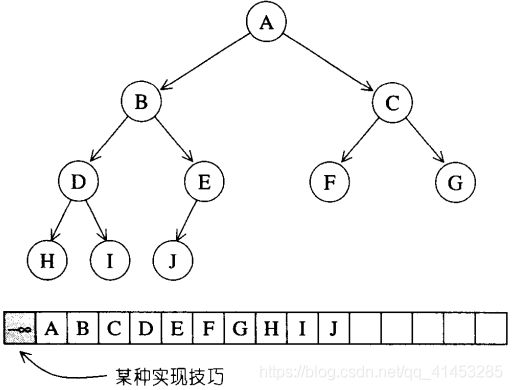
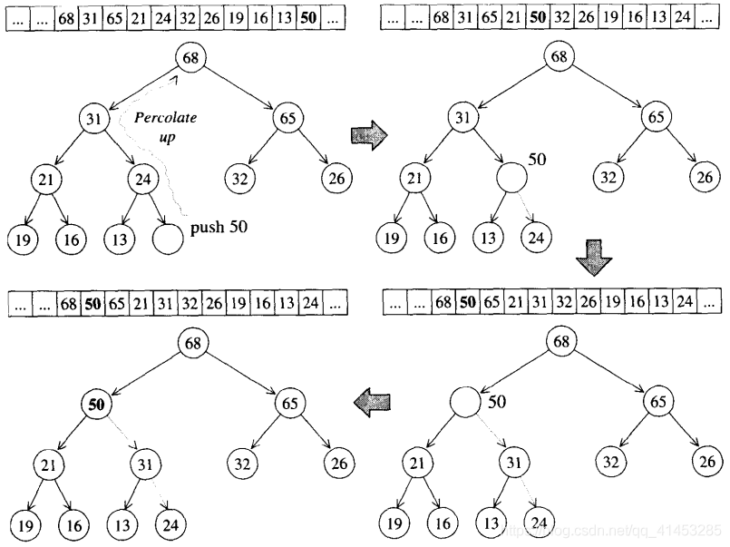
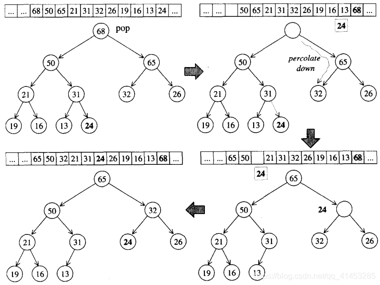
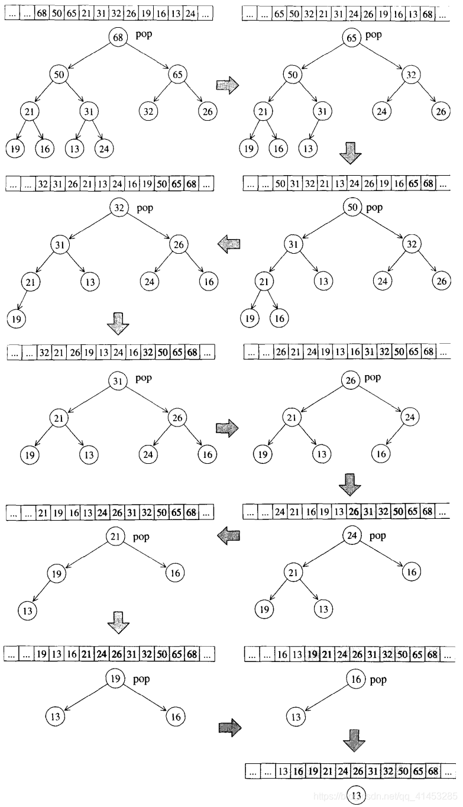
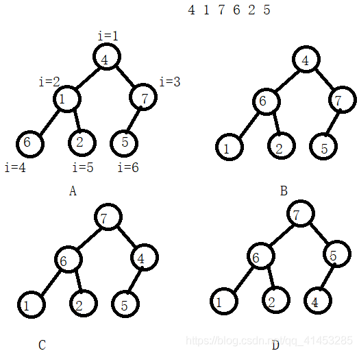

# heap

## heap概述

- heap并不归属于 STL 容器组件
- **binary heap作为priority queue的底层实现机制**。顾名思义，priority queue允许使用者以任何次序将任何元素推入容器内，但取出时一定是从优先权最高（也就是数值最高）之元素开始取。binary max heap正是具有这样的特性，适合做为priorityqueue的底层机制。

> ### heap作为**priority queue的底层实现**
>
> - **假设list作为priority queue的底层机制：**
>   - 元素插入动作可享**常数时间**
>   - 但是要找到list中的极值，**却需要对整个list进行线性扫描**。我们也可以改个做法，让元素插入前先经过排序这一关，使得list的元素值总是由小到大（或由大到小），但这么一来：虽然取得极值以及元素删除动作达到最高效率，可元素的插入却只有线性表现
> - **如果以binary serach tree（二叉搜索树，如RB-tree）作为priority queue的底层机制：**
>   - 这么一来元素的插入和极值的取得就有O(logN)的表现
>   - 但是这么一来binary search tree的输入需要足够的随机性，二来 binary search tree**并不容易实现**
> - **如果以binary heap作为priority queue的底层机制：**
>   - 为了减少复杂度，我们选择介于queue和binary search tree之间的binary heap作为priority queue的底层实现

> ### heap的分类
>
> - 根据元素排列方式，
>
>   **heap可分为max-heap和 min-heap两种：**
>
>   - max-heap：每个节点的 键值（key）都大于或等于其子节点键值
>   - min-heap：的每个节点键值（key）都小于或等于其子节点键值。
>
> - **因此：**
>
>   - max-heap的最大值在根节点，并总是位于底层array或vector的起头处
>   - min-heap的最小值在根节点，亦总是位于底层 array或vector 的起头处
>   - STL 供应的是 max-heap，**因此本文下面介绍的heap，指的是max-heap**

> ### heap没有迭代器
>
> - heap的所有元素都必须遵循特别的（complete binary tree）排列规则，所以 heap 不提供遍历功能，也不提供迭代器

## binary heap概述

- 所谓binary heap就是一种**complete binary tree（完全二叉树）**，也就是说，整个binary tree除了最底层的叶节点之外，是填满的，而最底层的叶节点由左至右又不得有空隙。



## heap的实现

- complete binary tree整棵树内没有任何节点为空，这带来一个极大好处：**我们可以利用array来储存所有节点**。
- 假设array的0索引处元素保留（或设为无限大值或无限小值），那么当完全二叉树中的某个节点位于array的i索引i处时，有如下规则：
  - **其左子节点**必位于array的2i索引处
  - **其右子节点**必位于array 的2i+1索引处
  - **其父节点**必位于i/2索引处
- 通过这么简单的位置规则，array可以轻易实作出完全二叉树。 这种以array表述tree的方式 ， 我们称为**隐式表述法（ implicit representation）**
- 这么一来，我们需要的工具就很简单了：一个array和一组heap算法（用来插入元素、删除元素、取极值、将某一整组数据排列成一个 heap）。array的缺点是无法动态改变大小，而heap却需要这项功能，**因此以vector代替array是更好的选择**。

## push_heap算法

> ### 算法图解
>
> - **push_heap算法思路如下：**
>   - 1.把新元素插入在底层vector的end()处
>   - 2.如果其有父节点，将其与父节点比较，如果值比父节点小，就保持位置不变，结束算法；如果值比父节点大，进行下一步
>   - 3.如果值比父节点大，将其与父节点进行位置交换；交换之后如果还有父节点，那么再次回到步骤2
> - **下面是一个演示：**
>   - 1.将插入的新元素50放在vector的末尾
>   - 2.因为其父节点24比自己小，所以将父节点与自己交换位置
>   - 3.交换之后，其父节点变为31，其值比31大，所以继续交换位置
>   - 4.接着其父节点变为68，其值比68小，所以结束push_heap算法
>
> 

- 上面这种比较方式我们称之为：**percolate up（上溯）程序**：将新节点拿来与其父节点比较，如果其键值(key)比父节点大，就父子对换位置，如此一直上溯，直到不需对换或直到根节点为止。

> ### push_heap源码
>
> - 下面便是 push_heap 算法的实现细节。此函数接受两个迭代器，用来表现一个heap底部容器（vector）的头尾，新元素并且已经插入到底部容器的最尾端。 如果不符合这两个条件，push_heap的执行结果未可预期
>
> ```c++
> template <class _RandomAccessIterator>
> inline void 
> push_heap(_RandomAccessIterator __first, _RandomAccessIterator __last)
> {
>   __STL_REQUIRES(_RandomAccessIterator, _Mutable_RandomAccessIterator);
>   __STL_REQUIRES(typename iterator_traits<_RandomAccessIterator>::value_type,
>                  _LessThanComparable);
>   // 注意，此函式被调用时，新元素已置于底部容器的最尾端
>   __push_heap_aux(__first, __last,
>                   __DISTANCE_TYPE(__first), __VALUE_TYPE(__first));
> }
> 
> template <class _RandomAccessIterator, class _Compare,
>           class _Distance, class _Tp>
> inline void 
> __push_heap_aux(_RandomAccessIterator __first,
>                 _RandomAccessIterator __last, _Compare __comp,
>                 _Distance*, _Tp*) 
> {
>   __push_heap(__first, _Distance((__last - __first) - 1), _Distance(0), 
>               _Tp(*(__last - 1)), __comp);
>   // 以上系根据implicit representation heap的结构特性：新值必置于底部
>   // 容器的最尾端，此即第一个洞号：(last-first)–1
> }
> ```

> ```c++
> template <class _RandomAccessIterator, class _Distance, class _Tp>
> void 
> __push_heap(_RandomAccessIterator __first,
>             _Distance __holeIndex, _Distance __topIndex, _Tp __value)
> {
>   _Distance __parent = (__holeIndex - 1) / 2; // 找出父节点
>   while (__holeIndex > __topIndex && *(__first + __parent) < __value) {
>     // 当尚未到达顶端，且父节点小于新值（于是不符合 heap 的次序特性）
>     // 由于以上使用 operator<，可知 STL heap 是一种 max-heap（大者为父）
>     *(__first + __holeIndex) = *(__first + __parent); //令洞值为父值
>     __holeIndex = __parent; // percolate up：调整洞号，向上提升至父节点
>     __parent = (__holeIndex - 1) / 2; // 新洞的父节点
>   } // 持续至顶端，或满足heap的次序特性为止   
>   *(__first + __holeIndex) = __value; //令洞值为新值，完成插入动作
> }
> ```

## pop_heap算法

> ### 算法图解
>
> - 因为是max-heap，最大值必然在根节点，pop操作时取走根节点（取走vector的最后一个元素），取走根节点之后，为了满足完全二叉树的规则，我们需要重新调整二叉树的结构
> - **pop_heap算法思路如下：**
>   - 1.把根节点元素取出，把最后一个节点的元素取出
>   - 2.将原根节点元素放在vector的最后一个节点处
>   - 3.将原先的最后一个节点的元素放置到原根节点处作为新根节点
>   - 4.将新根节点逐个与子节点比较，直到其值比子节点都大时，结束算法
> - **下面是一个演示：**
>   - 1.取出根节点元素68，取出最后一个节点的元素24
>   - 2.将原根节点元素68放在vector的最后一个位置
>   - 3.将原先最后一个节点的元素24放置到原根节点68处作为新根节点
>   - 4.接着其值24比左、右节点50、65都小，但是65比50大，于是就将其值24与值68的子节点互换
>   - 5.接着其值24又比左、右节点32、26都小，但是32比26大，于是就将其值24与值32的子节点互换
>   - 6.最后其没有子节点可以比较了，结束算法
>
> 

- 上面这种比较方式我们称之为：**percolate down（下溯）程序**：将根节点（最大值被取走后，形成一个“洞”）填入上述那个失去生存空间的叶节点值，再将它拿来和其两个子节点比较键值(key)，并与较大子节点对调位置。如此一直下放，直到这个“洞”的键值大于左右两个子节点，或直到下放至叶节点为止。
- 注意，**pop_heap 之后，最大元素只是被置放于底部容器的最尾端，尚未被取走**。 如果要取其值，可使用底部容器（vector）所提供的 back() 操作函数。如果要移除它，可使用底部容器（vector）所提供的 pop_back() 操作函数

> ### pop_heap源码
>
> - 下面便是 pop_heap算法的实现细节。此函数接受两个迭代器，用来表现以个 heap 底部容器（vector）的头尾。如果不符合这个条件，pop_heap 的执行结果 未可预期。
>
> ```c++
> template <class _RandomAccessIterator>
> inline void pop_heap(_RandomAccessIterator __first, 
>                      _RandomAccessIterator __last)
> {
>   __STL_REQUIRES(_RandomAccessIterator, _Mutable_RandomAccessIterator);
>   __STL_REQUIRES(typename iterator_traits<_RandomAccessIterator>::value_type,
>                  _LessThanComparable);
>   __pop_heap_aux(__first, __last, __VALUE_TYPE(__first));
> }
> 
> template <class _RandomAccessIterator, class _Tp>
> inline void 
> __pop_heap_aux(_RandomAccessIterator __first, _RandomAccessIterator __last,
>                _Tp*)
> {
>   // 以上，根据 implicit representation heap 的次序特性，pop操作的结果
>   // 应为底部容器的第一个元素。因此，首先设定欲调整值为尾值，然后将首值调至
>   // 尾节点（所以以上将迭代器 result设为 last-1）。然后重整 [first, last-1)，
>   // 使之重新成一个合格的 heap
>   __pop_heap(__first, __last - 1, __last - 1, 
>              _Tp(*(__last - 1)), __DISTANCE_TYPE(__first));
> }
> 
> template <class _RandomAccessIterator, class _Tp, class _Distance>
> inline void 
> __pop_heap(_RandomAccessIterator __first, _RandomAccessIterator __last,
>            _RandomAccessIterator __result, _Tp __value, _Distance*)
> {
>   *__result = *__first; // 设定尾值为首值，于是尾值即为欲求结果，
>                         // 可由客端稍后再以底层容器之 pop_back() 取出尾值
>    // 以上欲重新调整 heap，洞号为 0（亦即树根处），欲调整值为 value（原尾值）
>   __adjust_heap(__first, _Distance(0), _Distance(__last - __first), __value);
> }
> ```
>
> ```c++
> template <class _RandomAccessIterator, class _Distance, class _Tp>
> void 
> __adjust_heap(_RandomAccessIterator __first, _Distance __holeIndex,
>               _Distance __len, _Tp __value)
> {
>   _Distance __topIndex = __holeIndex;
>   _Distance __secondChild = 2 * __holeIndex + 2; // 洞节点之右子节点
>   while (__secondChild < __len) {
>     // 比较洞节点之左右两个子值，然后以 secondChild 代表较大子节点
>     if (*(__first + __secondChild) < *(__first + (__secondChild - 1)))
>       __secondChild--;
>     // Percolate down：令较大子值为洞值，再令洞号下移至较大子节点处
>     *(__first + __holeIndex) = *(__first + __secondChild);
>     __holeIndex = __secondChild;
>     // 找出新洞节点的右子节点
>     __secondChild = 2 * (__secondChild + 1);
>   }
>   if (__secondChild == __len) { // 没有右子节点，只有左子节点
>      // Percolate down：令左子值为洞值，再令洞号下移至左子节点处
>     *(__first + __holeIndex) = *(__first + (__secondChild - 1));
>     __holeIndex = __secondChild - 1;
>   }
>   // 将欲调整值填入目前的洞号内。注意，此时肯定满足次序特性
>   __push_heap(__first, __holeIndex, __topIndex, __value);
> }
> ```

## sort_heap算法

> ### **算法图解**
>
> - 既然每次pop_heap可获得heap之中键值最大的元素，如果持续对整个heap做pop_heap动作，每次将操作范围从后向前缩减一个元素（因为pop_heap会把键值最大的元素放在底部容器的最尾端），当整个程序执行完毕，我们便有了一个递增序列
> - 下图展示sort_heap算法的实际演示操作
>
> 

> ### sort_heap源码
>
> - 下面是sort_heap算法的实作细节。此函数接受两个迭代器，用来表现一个 heap 底部容器（vector）的头尾。如果不符合这个条件，sort_heap 的执行结 果未可预期。注意，排序过后，原来的heap就不再是个合法的 heap 了
>
> ```c++
> template <class _RandomAccessIterator>
> void sort_heap(_RandomAccessIterator __first, _RandomAccessIterator __last)
> {
>   __STL_REQUIRES(_RandomAccessIterator, _Mutable_RandomAccessIterator);
>   __STL_REQUIRES(typename iterator_traits<_RandomAccessIterator>::value_type,
>                  _LessThanComparable);
>   // 以下，每执行一次 pop_heap()，极值（在STL heap中为极大值）即被放在尾端
>   // 扣除尾端再执行一次 pop_heap()，次极值又被放在新尾端。一直下去，最后即得排序结果
>   while (__last - __first > 1)
>     pop_heap(__first, __last--); // 每执行 pop_heap() 一次，操作范围即退缩一格
> }
> ```

## make_heap算法

- 这个算法用来将一段现有的数据转化为一个heap。其主要依据就是文章一开始提到的complete binary tree的隐式表述（implicit representation）
- 这个算法是将一个迭代器区间数据转换为一个大根堆

```c++
template <class _RandomAccessIterator, class _Tp, class _Distance>
void 
__make_heap(_RandomAccessIterator __first,
            _RandomAccessIterator __last, _Tp*, _Distance*)
{
  if (__last - __first < 2) return; //如果长度为0或1，不必重新排列
  _Distance __len = __last - __first;
  // 找出第一个需要重排的子树头部，以parent标示出。由于任何叶节点都不需执行
  // perlocate down，所以有以下计算。parent命名不佳，名为holeIndex 更好
  _Distance __parent = (__len - 2)/2;
    
  while (true) {
    // 重排以 parent 为首的子树。len是为了让__adjust_heap() 判断操作范围
    __adjust_heap(__first, __parent, __len, _Tp(*(__first + __parent)));
    if (__parent == 0) return; // 走完根节点，就结束
    __parent--; // （即将重排之子树的）头部向前一个节点
  }
}

template <class _RandomAccessIterator>
inline void 
make_heap(_RandomAccessIterator __first, _RandomAccessIterator __last)
{
  __STL_REQUIRES(_RandomAccessIterator, _Mutable_RandomAccessIterator);
  __STL_REQUIRES(typename iterator_traits<_RandomAccessIterator>::value_type,
                 _LessThanComparable);
  __make_heap(__first, __last,
              __VALUE_TYPE(__first), __DISTANCE_TYPE(__first));
}
```

## heap没有迭代器

heap的所有元素都必须遵循特别的(complete binary tree)排列规则，所以heap不提供遍历功能，也不提供迭代器。

## heap算法演示案例

> ### 演示案例①
>
> ```c++
> #include <iostream>
> #include <algorithm>
>  
> using namespace std;
>  
> int main()
> {
>  
> 	int arr[6] = { 4,1,7,6,2,5 };
>  
> 	std::make_heap(arr, arr + 6);
> 	for (int i = 0; i < 6; ++i)
> 		std::cout << arr[i] << " "; //7 6 5 1 2 4
> 	std::cout << std::endl;
> 	
> 	return 0;
> }
> ```
>
> **初始化堆（make_heap）的步骤如下（下面的演示案例相同）：**
>
> - 1.从最后一个具有孩子的节点开始检查（i=6/2=3），于是先检查i=3这个节点，其子节点都比其小，所以保持不变（图A所示）
> - 2.接着检查i=3-1=2这个节点，其值1比两个子节点都小，但是左子节点6比右子节点2大，因此与左子节点6进行互换，得到结果如图B所示
> - 3.接着检查i=2-1=1这个节点，其值比两个子节点都小，但是右子节点7比左子节点6大，因此与右子节点7进行互换，得到结果如图C所示。比较之后其还有子节点，于是继续与子节点进行比较，发现比左子节点5值小，于是就继续进行互换，结果如下图D所示。（备注：这两步是同一步中完成的，我们分开来讲解）
> - 4.由于已经遍历到根节点了，所以结束make_heap
>
> 

> ### 演示案例②
>
> ```c++
> #include <iostream>
> #include <vector>
> #include <algorithm>
>  
> using namespace std;
>  
> int main()
> {
>     // test heap(底层以vector完成)
> 	int arr[9] = { 0,1,2,3,4,8,9,3,5 };
> 	std::vector<int> ivec(arr, arr + 9);
>  
>     //构造一个最大堆
> 	std::make_heap(ivec.begin(), ivec.end());
> 	for (int i = 0; i < ivec.size(); ++i)
> 		std::cout << ivec[i] << " ";     //9 5 8 3 4 0 2 3 1
> 	std::cout << std::endl;
>  
> 	ivec.push_back(7); //将7添加到尾部
> 	for (int i = 0; i < ivec.size(); ++i)
> 		std::cout << ivec[i] << " ";     //9 5 8 3 4 0 2 3 1 7
> 	std::cout << std::endl;
>  
> 	/*
> 	上面将7添加到尾部，破坏了完全二叉树的结构，因此需要调用此函数
> 	显式说明尾部有个元素需要插入到完全二叉树中，因此下面打印的为重新调整后的元素顺序
> 	*/
> 	std::push_heap(ivec.begin(), ivec.end()); 
> 	for (int i = 0; i < ivec.size(); ++i)
> 		std::cout << ivec[i] << " ";     //9 7 8 3 5 0 2 3 1 4
> 	std::cout << std::endl;
>  
> 	std::pop_heap(ivec.begin(), ivec.end());//只是将根节点移到容器尾部，但是还没有删除
> 	std::cout << ivec.back() << std::endl;  //打印9
> 	ivec.pop_back();                        //将最后的尾节点9移除
>  
> 	for (int i = 0; i < ivec.size(); ++i)
> 		std::cout << ivec[i] << " ";     //8 7 4 3 5 0 2 3 1
> 	std::cout << std::endl;
>  
>  
> 	std::sort_heap(ivec.begin(), ivec.end()); //对vector进行堆排序
> 	for (int i = 0; i < ivec.size(); ++i)
> 		std::cout << ivec[i] << " ";     //0 1 2 3 3 4 5 7 8
> 	std::cout << std::endl;
>  
> 	return 0;
> }
> ```

> ### 演示案例③
>
> - 下面的arr为数组（array），数组是不能动态改变大小的，因此当数组满载时不能对数组进行push_heap()操作
>
> ```c++
> #include <iostream>
> #include <vector>
> #include <algorithm>
>  
> using namespace std;
>  
> int main()
> {
>  
> 	int arr[9] = { 0,1,2,3,4,8,9,3,5 };
> 	std::vector<int> ivec(arr, arr + 9);
>  
> 	std::make_heap(arr, arr + 9);
> 	for (int i = 0; i < 9; ++i)
> 		std::cout << arr[i] << " "; //9 5 8 3 4 0 2 3 1
> 	std::cout << std::endl;
>  
> 	std::sort_heap(arr, arr + 9);
> 	for (int i = 0; i < 9; ++i)
> 		std::cout << arr[i] << " "; //0 1 2 3 3 4 5 8 9
> 	std::cout << std::endl;
>  
> 	//以上面的arr顺序再次构造一个最大堆
> 	std::make_heap(arr, arr + 9);
> 	for (int i = 0; i < 9; ++i)
> 		std::cout << arr[i] << " "; //9 8 5 3 3 4 2 1 0
> 	std::cout << std::endl;
>  
> 	//将最大堆的根节点弹出（移到尾部，但是还没有删除）
> 	std::pop_heap(arr, arr + 9);
> 	std::cout << arr[8] << std::endl; //9
> 	
> 	return 0;
> }
> ```

