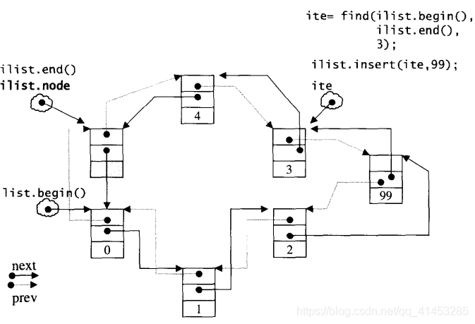
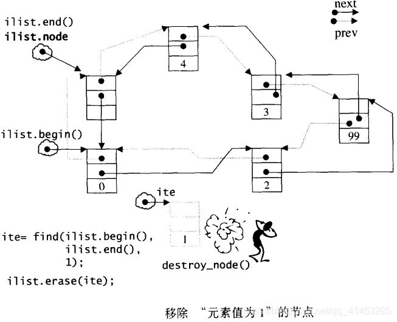

# list

## list概述

**环形双向链表**

**特点：**

- 底层是使用链表实现的，支持双向顺序访问
- 在list中任何位置进行**插入和删除的速度都很快**
- **不支持随机访问**，为了访问一个元素，必须遍历整个容器
- 与其他容器相比，**额外内存开销大**

**设计目的：**令容器在任何位置进行插入和删除都很快

**何时使用：**

- 容器需要不断地在中间插入或删除元素
- 无论删除还是增加，list的迭代器、引用、指针都不会失效

## list使用

* **头文件：**#include <list>

* **using声明：**using std::list;

* **初始化**

  list<T> v1; ==>v1是一个空的list

  list<T> v2(v1); ===>v2是v1的副本，拷贝构造

  list<T> v2=v1; ===>同上

  list<T> v1(n,val); ===>初始化n个value

  list<T> v1(iter1,iter2); ===>用迭代器iter1与iter2所指的区间内元素进行初始化

  list<T> v1(n); ===>初始化n个元素，每个元素使用默认值（int为0，string为空...）

  list<T> v1{a,b,c...}; ===>用元素a,b,c进行初始化

  list<T> v1={a,b,c...}; ===>同上

* **相关操作**

  运算符

  ```c++
  L1==L2;//判断L1和L2是否相等
  L1!=L2;//判断L1和L2是否相等
  >、>=、<、<= //以字典顺序进行比较
  ```

  取值：不能通过索引取值，只能遍历容器

* **相关函数**

  list不支持capacity()和reserve()、at()

  ```c++
  L.empty();//判断是否为空，返回布尔值
  L.size();//返回容器中的元素个数
  L.max_size();//返回容器的容量
  L.reverse();//将元素逆序
  
  L.front();//得到头元素
  L.back();//得到尾元素
  
  L1.swap(L2);//将L1和L2进行交换。容器的成员函数版本
  swap(L1,L2);//同上。系统函数版本
   
  L.assign(iter1,iter2);//将容器元素更换为一个迭代器的区间元素
  L.assign(n,t);//将容器元素变为n个t元素
  
  L.insert(iter,t);//在迭代器iter处插入t。返回所插位置处的迭代器
  L.insert(L.end(),10,t);//在容器L的末尾插入10个元素，每个元素都是t。返回新添加元素的第一个元素的迭代器
  L.insert(L.end(),{"a","b"...});//将后面花括号的每个元素插入容器v的尾部。返回新添加元素的第一个元素的迭代器
  L.insert(L.begin(),L2.end()-2,L2.end());//将容器L2的最后两个元素插入容器L的头部。返回新添加元素的第一个元素的迭代器
  注意：上面这个用法，后面两个参数不能为自身容器的范围（L.insert(L.begin(),L.end()-2,L.end());是错误的）
   
  //利用insert的返回值，下面代码为一直在lst容器的头部插入元素(类似于push_front的功能)
  list<string> lst;
  auto iter=lst.begin();
  while(cin>> word)
      iter=lst.insert(iter,word);//insert函数每回执行完，返回容器的首元素位置
  
  L.push_front(t);//头部追加元素t
  L.push_back(t);//尾部追加元素t
  L.pop_back();//删除尾元素
   
  L.earse(iter);//删除迭代器iter所指位置处的元素。返回删除位置处后一个元素迭代器
  L.erase(iter1,iter2);//删除迭代器iter1与iter2区间内的元素。返回删除最后一个元素的后一个元素迭代器
   
  L.clear();//清空容器，重新初始化容器
  
  L.resize(n);//将容器v的元素变为n个。若n<原始元素个数，删除多于元素。若n>原始元素个数，则用默认初始值初始化容器
  L.resize(n,t);//将容器元素变为n个t。与容器原始个数无关
   
  list<int> L(5,666);
  L.resize(3);//L内有3个元素，都是666
  L.resize(8);;//L内有8个元素，前5个个是666，后3个都是0(默认)
  L.resize(10,666);//L内有10个元素，都是666
  
  //下面的两个函数，是在在内存中创建一个对象，然后添加进相应的位置
  L.empalce(iter,args);//在容器L的位置添加创建一个args对象
  L.emplace_back(args);//在容器L的尾部添加创建一个args对象
  L.emplace_front(args);//在容器L的头部添加创建一个args对象
   
  例如
  class A{
      string name;int age;
  public:
      A(string name, int age);
  };
  int main()
  {
      list<A> L;
      L.emplace_back("C语言", 18);//在尾部创建一个元素
      L.emplace(v.begin(),"C++",18);//在容器L的头部添加一个元素
  }
  
  li.remove_if(t);//调用earse删除第一个值为t元素
  li.remove_if(条件);//删除参数参数为真的条件元素
   
  li.sort();//排序，默认升序
  li.sort(条件);//排序，参数条件取决于降序还是升序
   
  li.unique();//调用earse如果有单/多个相邻且相同的元素，则删除重复的元素
  li.unique(条件);//如果有多个相邻且满足参数条件的元素，则删除重复元素
   
  //m也是list类型
  t.merge(m);//要求t与m都是相同的排序规则(此版本为<)，将m内元素全部插入t内且仍使用此排序规则，m内元素清空
  t.merge(m,条件);//将t与m以参数条件的方式合并，其余规则同上
  ```

* **容器的迭代器、引用、指针**

  无论删除还是增加，list的迭代器、引用、指针都不会失效

## list的节点(__list_node)

- list的每个节点是一个结构体。以下是list的节点（node）结构：

```c++
struct _List_node_base {
  _List_node_base* _M_next;
  _List_node_base* _M_prev;
};

template <class _Tp>
struct _List_node : public _List_node_base {
  _Tp _M_data;
};
```

## list的迭代器

- list不再能够 vector一样以原生指标做为迭代器，因为其节点**不保证在储存空间中连续存在**
- list迭代器必须有能力**指向list的节点，并有能力做正确的递增、递减、取值、成员存取等动作**。所谓“list迭代器正确的递增、递减、取值、成员取用”动作是指：递增时指向下一个节点，递减时指向上一个节点，取值时取的是节点的数据值，成员取用时取用的是节点的成员，如下图所示：


- 由于list是一个双向链表（double linked-list），**迭代器必须具备前移、后移的能力**。所以list提供的是Bidirectional Iterators

* list有以下几个重要性质：
  + **插入动作（insert）和接合动作（splice）都不会造成原有的 list 迭代器失效**。这在vector是不成立的，因为 vector的插入动作可能造成记忆体重新配置，导致原有的迭代器全部失效
  + 甚至list的元素删除动作（erase），也**只有“指向被删除元素”的那个迭代器失效，其他迭代器不受任何影响**

```c++
struct _List_iterator_base {
  typedef size_t                     size_type;
  typedef ptrdiff_t                  difference_type;
  typedef bidirectional_iterator_tag iterator_category;

  _List_node_base* _M_node;

  _List_iterator_base(_List_node_base* __x) : _M_node(__x) {}
  _List_iterator_base() {}

  void _M_incr() { _M_node = _M_node->_M_next; }
  void _M_decr() { _M_node = _M_node->_M_prev; }

  bool operator==(const _List_iterator_base& __x) const {
    return _M_node == __x._M_node;
  }
  bool operator!=(const _List_iterator_base& __x) const {
    return _M_node != __x._M_node;
  }
};  

template<class _Tp, class _Ref, class _Ptr>
struct _List_iterator : public _List_iterator_base {
  typedef _List_iterator<_Tp,_Tp&,_Tp*>             iterator;
  typedef _List_iterator<_Tp,const _Tp&,const _Tp*> const_iterator;
  typedef _List_iterator<_Tp,_Ref,_Ptr>             _Self;

  typedef _Tp value_type;
  typedef _Ptr pointer;
  typedef _Ref reference;
  typedef _List_node<_Tp> _Node;

  _List_iterator(_Node* __x) : _List_iterator_base(__x) {}
  _List_iterator() {}
  _List_iterator(const iterator& __x) : _List_iterator_base(__x._M_node) {}

  // 以下对迭代器取值（dereference），取的是节点的数据值
  reference operator*() const { return ((_Node*) _M_node)->_M_data; }

#ifndef __SGI_STL_NO_ARROW_OPERATOR
  // 以下是迭代器的成员存取（member access）运算子的标准作法
  pointer operator->() const { return &(operator*()); }
#endif /* __SGI_STL_NO_ARROW_OPERATOR */

  //对迭代器累加1，就是前进一个节点
  _Self& operator++() { 
    this->_M_incr();
    return *this;
  }
  _Self operator++(int) { 
    _Self __tmp = *this;
    this->_M_incr();
    return __tmp;
  }
  //对迭代器递减1，就是后退一个节点
  _Self& operator--() { 
    this->_M_decr();
    return *this;
  }
  _Self operator--(int) { 
    _Self __tmp = *this;
    this->_M_decr();
    return __tmp;
  }
};
```

## list的数据结构

list不仅是一个双向链表，而且还是一个环状双向链表，所以它只需要一个指针，便可以完整表现整个链表

> node节点是指向于list最后一个节点的指针
>
> ```c++
> template <class _Tp, class _Alloc>
> class _List_base 
> {
> public:
>   typedef _Alloc allocator_type;
>   allocator_type get_allocator() const { return allocator_type(); }
> 
>   _List_base(const allocator_type&) {
>     _M_node = _M_get_node();
>     _M_node->_M_next = _M_node;
>     _M_node->_M_prev = _M_node;
>   }
> protected:
>   _List_node<_Tp>* _M_node; // 只要一个指针，便可表示整个环状双向链表
> };
> ```

> ### begin()、end()等函数
>
> - 如果让指标node指向刻意置于尾端的一个空白节点，node便能符合STL对于“前闭后开”区间的要求，成为last迭代器，如下图所示。这么一来，以几个函数便都可以轻易完成：
>
> ```c++
> iterator begin()           { return (_Node*)(_M_node->_M_next); }
> iterator end()             { return _M_node; }
> bool empty() const { return _M_node->_M_next == _M_node; }
> size_type size() const {
>     size_type __result = 0;
>     distance(begin(), end(), __result);
>     return __result;
> }
> reference front() { return *begin(); }
> reference back() { return *(--end()); }
> ```
>
> 

## list的构造与内存管理

list缺省使用alloc做为空间配置器，并据此另外定义了一个_Alloc_type，为的是更方便地以节点大小为配置单位：

```c++
template <class _Tp, class _Alloc>
class _List_base 
{
    ...
    protected:
    typedef simple_alloc<_List_node<_Tp>, _Alloc> _Alloc_type;
    ...
};

template <class _Tp, class _Alloc = __STL_DEFAULT_ALLOCATOR(_Tp) >
class list : protected _List_base<_Tp, _Alloc> {
    ...
};
```

于是，_Alloc_type(n) 表示配置n个节点空间。

```c++
// 配置一个节点并传回  
_List_node<_Tp>* _M_get_node() { return _Alloc_type::allocate(1); }

// 释放一个节点
void _M_put_node(_List_node<_Tp>* __p) { _Alloc_type::deallocate(__p, 1); } 

// 产生（配置并构造）一个节点，带有元素值
_Node* _M_create_node(const _Tp& __x)
{
    _Node* __p = _M_get_node();
    __STL_TRY {
        _Construct(&__p->_M_data, __x);
    }
    __STL_UNWIND(_M_put_node(__p));
    return __p;
}
```

> **构造函数**
>
> - list 提供有许多constructors，其中以个是default constructor，允许我们不指 定任何参数做出一个空的list出来：
>
> ```c++
>   _List_base(const allocator_type&) {
>     _M_node = _M_get_node();
>     _M_node->_M_next = _M_node;
>     _M_node->_M_prev = _M_node;
>   }
> ```
>
> - list为空时， node节点的prev、next指向于自己
>
> 

## list的元素操作

### push_front、push_back

```c++
//插入一个节点，做为头节点  
void push_front(const _Tp& __x) { insert(begin(), __x); }

//插入一个个节点，做为尾节点
void push_back(const _Tp& __x) { insert(end(), __x); }
```

### insert

```c++
// 在迭代器position所指位置插入一个节点，内容为x
iterator insert(iterator __position, const _Tp& __x) {
    _Node* __tmp = _M_create_node(__x);
    //调整双向指针，使 tmp插入进去
    __tmp->_M_next = __position._M_node;
    __tmp->_M_prev = __position._M_node->_M_prev;
    __position._M_node->_M_prev->_M_next = __tmp;
    __position._M_node->_M_prev = __tmp;
    return __tmp;
}
```

> - 如果我们希望在list内的某处安插新节点，首先必须确定安插位置， 例如我希望在数据值为3的节点处插入一个数据值为99的节点，可以这么做：
>
> ```c++
> ilite = find(il.begin(), il.end(), 3);
> if (ilite!=0)
>     il.insert(ilite, 99);
> ```
>
> - 插入之后的list状态如下图所示。注意，插入完成后， **新节点将位于标兵迭代器（标示出插入点）所指之节点的前方——这是STL对于 “插入动作”的标准规范**。由于list不像vector 那样有可能在空间不足时做重新配置、数据移动的操作，所以**插入前的所有迭代器在插入动作之后都仍然有效**
>
> 

### erase

```c++
//移除迭代器position所指节点
iterator erase(iterator __position) {
    _List_node_base* __next_node = __position._M_node->_M_next;
    _List_node_base* __prev_node = __position._M_node->_M_prev;
    _Node* __n = (_Node*) __position._M_node;
    __prev_node->_M_next = __next_node;
    __next_node->_M_prev = __prev_node;
    _Destroy(&__n->_M_data);
    _M_put_node(__n);
    return iterator((_Node*) __next_node);
}
```

由于list是一个双向环状链表，只要我们把边际条件处理好，那么，在头部或尾部插入元素（push_front 和 push_back），动作几乎是一样的，在头部或尾部移除元素（pop_front和pop_back），动作也几乎是一样的。移除（erase） 某个迭代器所指元素，只是做一些指针搬移动作而已，并不复杂。如果上图再经以下搜寻并移除的动作，状况将如下图所示

```c++
ite = find(ilist.begin(), ilist.end(), 1);
if (ite!=0)
    cout << *(ilist.erase(ite)) << endl;
```



### pop_front、pop_back

```c++
//移除头节点  
void pop_front() { erase(begin()); }
//移除尾节点
void pop_back() { 
    iterator __tmp = end();
    erase(--__tmp);
}
```

### clear

```c++
// 清除所有节点（整个链表）
template <class _Tp, class _Alloc>
void 
_List_base<_Tp,_Alloc>::clear() 
{
  _List_node<_Tp>* __cur = (_List_node<_Tp>*) _M_node->_M_next;
  while (__cur != _M_node) { //遍历每一个节点
    _List_node<_Tp>* __tmp = __cur;
    __cur = (_List_node<_Tp>*) __cur->_M_next;
    _Destroy(&__tmp->_M_data);
    _M_put_node(__tmp); // 销毁（析构并释放）一个节点
  }
  //恢复node原始状态
  _M_node->_M_next = _M_node;
  _M_node->_M_prev = _M_node;
}
```

### remove

```c++
//将数值为value之所有元素移除
template <class _Tp, class _Alloc>
void list<_Tp, _Alloc>::remove(const _Tp& __value)
{
  iterator __first = begin();
  iterator __last = end();
  while (__first != __last) { //遍历每一个节点
    iterator __next = __first;
    ++__next;
    if (*__first == __value) erase(__first); //找到就移除
    __first = __next;
  }
}
```

### unique

```c++
//移除数值相同的连续元素。注意，只有“连续而相同的元素”，才会被移除剩一个
template <class _Tp, class _Alloc>
void list<_Tp, _Alloc>::unique()
{
  iterator __first = begin();
  iterator __last = end();
  if (__first == __last) return; //空链表，什么都不必做
  iterator __next = __first;
  while (++__next != __last) { //遍历每一个节点
    if (*__first == *__next) //如果在此区段中有相同的元素
      erase(__next); //移除之
    else
      __first = __next; //调整指针
    __next = __first; //修正区段范围
  }
}
```

### transfer

- list内部提供一个所谓的迁移动作（transfer）：将某连续范围的元素迁移到某个特定位置之前。**技术上很简单，节点间的指针移动而已**
- 这个动作为其他的复杂动作如splice, sort, merge等奠定良好的基础
- **transfer不是公开接口**

```c++
protected:
//将[first,last)内的所有元素搬移到position之前
  void transfer(iterator __position, iterator __first, iterator __last) {
    if (__position != __last) {
      // Remove [first, last) from its old position.
      __last._M_node->_M_prev->_M_next     = __position._M_node; //(1)
      __first._M_node->_M_prev->_M_next    = __last._M_node;     //(2)
      __position._M_node->_M_prev->_M_next = __first._M_node;    //(3)

      // Splice [first, last) into its new position.
      _List_node_base* __tmp      = __position._M_node->_M_prev; //(4)
      __position._M_node->_M_prev = __last._M_node->_M_prev;     //(5)
      __last._M_node->_M_prev     = __first._M_node->_M_prev;    //(6)
      __first._M_node->_M_prev    = __tmp;                       //(7)
    }
  }
```

- 以上七个动作，如下图所示：


### splice

- 上述的transfer并非公开接口。 list公开提供的是所谓的接合动作（splice）：**将某连续范围的元素从一个list搬移到另一个（或同一个）list 的某个定点**

- 下面是一个演示案例：

```c++
int iv[5] = { 5,6,7,8,9 };
list<int> ilist2(iv, iv+5);
 
//假设ilist的内容为0 2 99 3 4
ite = find(ilist.begin(), ilist.end(), 99);
 
ilist.splice(ite,ilist2); // 0 2 5 6 7 8 9 99 3 4
ilist.reverse();          // 4 3 99 9 8 7 6 5 2 0
ilist.sort();             // 0 2 3 4 5 6 7 8 9 99
```

- 很容易便可看出效果。下图显示接合动作。技术上很简单，只是节点间的指针移动而已，这些动作已完全由transfer()做掉了
- 为了提供各种接口弹性**，list::splice有许多版本：**

```c++
//将x接合于position所指位置之前。x必须不同于*this
void splice(iterator __position, list& __x) {
    if (!__x.empty()) 
        this->transfer(__position, __x.begin(), __x.end());
}
//将i所指元素接合于position所指位置之前。position和i可指向同一个list
void splice(iterator __position, list&, iterator __i) {
    iterator __j = __i;
    ++__j;
    if (__position == __i || __position == __j) return;
    this->transfer(__position, __i, __j);
}
//将[first,last) 内的所有元素接合于 position 所指位置之前
//position 和[first,last)可指向同一个list，
//但position不能位于[first,last)之内
void splice(iterator __position, list&, iterator __first, iterator __last) {
    if (__first != __last) 
        this->transfer(__position, __first, __last);
}
```

### merge

```c++
// merge()将x合并到*this身上。两个lists的内容都必须先递增排序
template <class _Tp, class _Alloc>
void list<_Tp, _Alloc>::merge(list<_Tp, _Alloc>& __x)
{
  iterator __first1 = begin();
  iterator __last1 = end();
  iterator __first2 = __x.begin();
  iterator __last2 = __x.end();
  // 注意：前提是，两个list都已经经过递增排序
  while (__first1 != __last1 && __first2 != __last2)
    if (*__first2 < *__first1) {
      iterator __next = __first2;
      transfer(__first1, __first2, ++__next);
      __first2 = __next;
    }
    else
      ++__first1;
  if (__first2 != __last2) transfer(__last1, __first2, __last2);
}
```

### reverse

```c++
inline void __List_base_reverse(_List_node_base* __p)
{
  _List_node_base* __tmp = __p;
  do {
    __STD::swap(__tmp->_M_next, __tmp->_M_prev);
    __tmp = __tmp->_M_prev;     // Old next node is now prev.
  } while (__tmp != __p);
}

//reverse()将*this的内容逆向重置
template <class _Tp, class _Alloc>
inline void list<_Tp, _Alloc>::reverse() 
{
  __List_base_reverse(this->_M_node);
}    
```

### sort

```c++
//list不能使用STL算法sort()，必须使用自己的sort() member function，
//因为STL算法 sort()只接受RamdonAccessIterator.
//本函数采用 quick sort
template <class _Tp, class _Alloc> template <class _StrictWeakOrdering>
void list<_Tp, _Alloc>::sort(_StrictWeakOrdering __comp)
{
  // Do nothing if the list has length 0 or 1.
  if (_M_node->_M_next != _M_node && _M_node->_M_next->_M_next != _M_node) {
    list<_Tp, _Alloc> __carry;
    list<_Tp, _Alloc> __counter[64];
    int __fill = 0;
    while (!empty()) {
      __carry.splice(__carry.begin(), *this, begin());
      int __i = 0;
      while(__i < __fill && !__counter[__i].empty()) {
        __counter[__i].merge(__carry, __comp);
        __carry.swap(__counter[__i++]);
      }
      __carry.swap(__counter[__i]);         
      if (__i == __fill) ++__fill;
    } 

    for (int __i = 1; __i < __fill; ++__i) 
      __counter[__i].merge(__counter[__i-1], __comp);
    swap(__counter[__fill-1]);
  }
}
```

