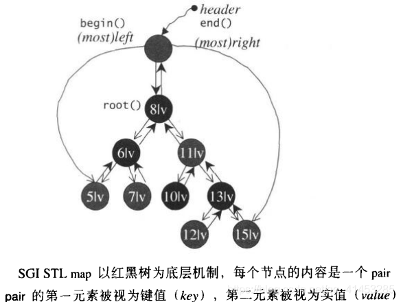

# map

## map概述

每个元素都是key/value pair，其中key是排序准则的基准。每个key只能出现一次，不允许重复。Map也被视为一种关联式数组，也就是“索引可为任意类型”的数组

> ### map的特性
>
> - 所有元素都会根据元素的键值自动被排序

> ### map中的pair结构
>
> - map的所有元素类型都是pair，同时拥有实值（value）和键值（key）
> - pair的第一个元素视为键值，第二个元素视为实值
> - map不允许两个元素拥有相同的键值
> - 下面是stl_pair.h中pair的定义：
>
> ```c++
> //代码摘录于stl_pair.h
> template <class _T1, class _T2>
> struct pair {
>   typedef _T1 first_type;
>   typedef _T2 second_type;
>  
>   _T1 first;
>   _T2 second;
>   pair() : first(_T1()), second(_T2()) {}
>   pair(const _T1& __a, const _T2& __b) : first(__a), second(__b) {}
>  
> #ifdef __STL_MEMBER_TEMPLATES
>   template <class _U1, class _U2>
>   pair(const pair<_U1, _U2>& __p) : first(__p.first), second(__p.second) {}
> #endif
> };
> ```

> ### map的迭代器
>
> - 不可以根据map的迭代器改变节点的键值，但是可以通过map的迭代器改变节点的实值
> - 因此，map iterators既不是一种constant iterators，也不是一种mutable iterators

> ### map拥有与list的相同的某些性质
>
> - 当客户端对它进行元素新增（insert）操作或删除（erase）操作时，操作之前的所有迭代器在操作完成之后依然有效（当然，被删除的那个元素的迭代器无效）

> ### map的底层结构
>
> - 由于RB-tree是一种平衡二叉搜索树，自动排序的效果很不错，所以标准的STL map是以RB-tree为底层机制
> - 又由于map所开放的各种操作接口，RB-tree也都提供了，所以几乎所有的map操作行为，都只是转调用RB-tree的操作行为而已
> - 下面是map的结构：
>
> 

## map使用

- map<key,value>：由“键值（key）与值（value）”两部分组成，这两者形成映射关系
- 头文件：#include <map>

### 特点

- **key是唯一的，**不可重复；但**value可以重复出现**
- key与value必须具有可赋值、可拷贝的性质
- key的数据类型必须是可比较的，根据key来进行排序（默认为升序）
- key与value可以是任何类型：int、doule、字符串、结构体、类......
- map的每一组key与value相当于一个pair容器对象

### key的比较操作

- 我们知道key必须是可以比较的，如果key的类型不能进行比较（例如“<”运算符进行比较），则程序出错

- 如果是我们自定义的类，如果没有提供比较运算符的重载，那么就不能作为关联容器的key使用，因为自定义的类不能进行比较

- 如果key可以进行比较，且遵循下面的规则：

  * 两个关键字不能同时“小于等于”对方；如果k1“小于等于”k2，那么k2绝不能“小于等于”k1。

  * 如果k1“小于等于”k2，且k2“小于等于”k3，那么k1必须“小于等于”k3。

  * 如果存在两个关键字，任何一个都不“小于等于”另一个，那么我们称这两个关键字是“等价”的。如果k1“等价于”k2，且k2“等价于”k3，那么k1必须“等价于”k3。

    如果两个关键字是等价的（即，任何一个都不“小于等于”另一个），那么容器将它们视作相等来处理。当用作map的关键字时，只能有一个元素与这两个关键字关联，我们可以用两者中任意一个来访问对应的值。

### 升序、降序操作

- map的key默认为升序排序，但是我们也可以通过一些操作来实现降序操作，或者显式的进行升序操作
- 下面两个标准库函数（less、greater）都在头文件#include <xfunctional>中
- 演示默认的升序排序

```c++
map<string, int,std::less<string>> word_count;//显式地升序
//map<string, int,> word_count;//默认的升序
 
string word;
while (cin >> word) {
    ++word_count[word];
}
for (const auto &w : word_count) {
    cout << w.first << "  occurs  " << w.second <<
        ((w.second>1) ? "  times" : "  time") << endl;
}
```

- 演示降序排序

```c++
map<string, int,std::greater<string>> word_count;//降序
 
string word;
while (cin >> word) {
    ++word_count[word];
}
for (const auto &w : word_count) {
    cout << w.first << "  occurs  " << w.second <<
        ((w.second>1) ? "  times" : "  time") << endl;
}
```

### 初始化

- 如果没有给出初始化值，就默认为空容器（使用系统的默认值初始化）
- 手动给出值初始化

### 下标运算符和at函数

- map和unordered_map提供下标操作，因为其key唯一；multimap与unordered_multimap不提供下标操作，因为其key不唯一
- 下标运算符可以用来创建一个键值对或访问键所对应的值
- 由于下标运算符可能插入一个新元素，我们只可以对非const的map使用下表操作
- 下标运算符则：
  * c[k]：返回关键字为k的元素；如果k不在c中，添加一个关键字为k的元素，对其进行值初始化
  * c.at(k)：访问关键字为k的元素，带参数检查；若k不在c中，抛出一个out_of_range异常
- 对一个map使用下标操作，其行为与数组或vector上的下标操作很不相同：使用一个不在容器中的关键字作为下标，会添加一个具有此关键字的元素到map中。

```c++
map<string, size_t> word_count;
word_count["a"] = 1; //添加key与value对
word_count["b"] = 2; //添加key与value对
word_count["c"] = 3; //添加key与value对
 
word_count["a"] = 4; //更改key对应的value
cout << word_count["a"] << endl; //打印4
cout << word_count.at("a") << endl; //打印4
```

### 迭代器与遍历

- 当解引用一个关联容器迭代器时，我们得到的是容器的value_type的值的引用
- 对于map来说，value_type为一个pair类型，因此得到pair类型之后，我们就可以调用first和second来访问key与value
- **重点：**得到的迭代器，我们可以改变其second（value）的值，但不能改变其first（key）的值（因为为const类型）

```c++
map<string, int> word_count;
word_count["Hello"] = 3;
word_count["World"] = 3;
 
auto map_it = word_count.begin(); //得到第一个元素的迭代器
//*map_it是指向一个pair<const string,size_t>的引用
cout << map_it->first << endl;;  //打印Hello
cout << map_it->second << endl;  //打印3
 
map_it->first = "new key";//错误，key关键字不可以改变（为const类型）
++map_it->second; //正确，key关键字对应的value可以改变
```

- 通过迭代器遍历容器：可以使用iterator或者const_iterator类型的迭代器遍历

```c++
map<string, int> word_count;
	word_count["Hello"] = 3;
	word_count["World"] = 3;
 
	//map_it为map<string, int>::const_iterator类型
	auto map_it = word_count.cbegin();
	while (map_it != word_count.cend()) {
		cout << map_it->first << "" << map_it->second << endl;
		++map_it;
	}
```

### 添加元素

这里介绍的添加元素方式，适合所有关联容器。规则为：

- 对于key唯一的，插入时会先判断key是否存在，不存在则插入；存在则什么都不做
- 对于key不唯一的，每次插入都插入新值

| 函数                              | 说明                                                         |
| --------------------------------- | ------------------------------------------------------------ |
| c.insert(v) c.emplace(args)       | v是value_type类型的对象；args用来构造一个元素 对于map和set，只有当元素的关键字不在c中时才插入（或构造）元素。函数返回一个pair，包含一个迭代器，指向具有指定关键字的元素，以及一个指示插入是否成功的bool值。对于multimap和multiset，总会插入（或构造）给定元素，并返回一个指向新元素的迭代器 |
| c.insert(b, e) c.insert(il)       | b和e是迭代器，表示一个c::value_type类型值的范围；il是这种值的花括号列表，函数返回void                           对于map和set，只插入关键字不在c中的元素。对于multimap和multiset，则会插入范围中的每个元素 |
| c.insert(p, v) c.emplace(p, args) | 类似insert(v)（或emplace(args)），但将迭代器p作为一个提示，指出从哪里开始搜索新元素应该存储的位置。返回一个迭代器，指向具有给定关键字的元素 |

- **insert有3个版本：**参数为value_type或参数为一对迭代器或者参数为一个初始化列表

* 演示set的插入：

```c++
vector<int> ivec = { 2,4,6,8,10 };
set<int> set1;
set1.insert(ivec.cbegin(), ivec.cend()); //迭代器版本
 
set1.insert({ 1,3,5,7,9 }); //初始化器版本插入
```

* map的插入：

  由于map的元素是pair容器类型，因此map的插入有一些特殊情况

```c++
map<string, size_t> word_count;
word_count.insert({ "a",1 });
word_count.insert(make_pair("a",1));
word_count.insert(pair<string,size_t>("a", 1));
word_count.insert(map<string,size_t>::value_type("a", 1));
```

* Insert/emplace的返回值

  insert(或emplace)返回的值依赖于容器类型和参数，对于不包含重复关键字的容器，添加单一元素的insert和emplace版本返回一个pair，告诉我们插入操作是否成功。pair的first成员是一个迭代器，指向具有给定关键字的元素；second成员是一个bool值，指出元素是插入成功还是已经存在于容器中。如果关键字已在容器中，则insert什么事情也不做，且返回值中的bool部分为false。如果关键字不存在，元素被插入到容器中，且bool值为true。

```c++
//案例：单词计数
map<string, size_t> word_count; //空的
string word;
while (cin >> word) {
    //插入一个元素，关键字等于word，值为1
    //若word已经存在，insert什么都不做
    auto ret = word_count.insert({ word,1 });
    if (!ret.second) //检查返回值的bool部分，若为false，则word已在word_count中
        ++ret.first->second; //递增计数器
}
```

### 删除元素

**关联容器定义了3个版本的erase：**

- ①传递一个key_type参数。如果元素存在（删除所有匹配给定关键字的元素，返回实际删除的元素数量）；如果元素不存在（函数返回0）
- ②传递给erase一个迭代器来删除一个元素，函数返回void（与顺序容器类似）
- ③传递给erase一个迭代器对来删除一个元素范围，函数返回void（与顺序容器类似）

| 函数          | 说明                                                         |
| ------------- | ------------------------------------------------------------ |
| c.erase(k)    | 从c中删除每个关键字为k的元素，返回一个size_type值，指出删除的元素的数量 |
| c.erase(p)    | 从c中删除迭代器p指定的元素，p必须指向c中一个真实元素，不能等于c.end()。返回一个指向之后元素的迭代器，若p指向c中的尾元素，则返回c.end() |
| c.erase(b, e) | 删除迭代器对b和e所表示的范围中的元素，返回e                  |

```c++
map<string, size_t> word_count;
word_count["a"] = 1;
word_count["b"] = 2;
word_count["c"] = 3;
 
string removal_word = "a";
if (word_count.erase(removal_word))
    cout << "ok:"<< removal_word <<"  removed" <<endl;    // ok:a removed
else
    cout << "error:" << removal_word << "  not found" << endl;
```

### 其他操作

- 在一个关联容器中查找元素的操作

lower_bound和upper_bound不适用于无序容器。下标和at操作只适用于非const的map和unordered_map。

| 函数             | 说明                                                         |
| ---------------- | ------------------------------------------------------------ |
| c.find(k)        | 返回一个迭代器，指向第一个关键字为k的元素，若k不在容器中，则返回尾后迭代器 |
| c.count(k)       | 返回关键字等于k的元素的数量。对于不允许重复关键字的容器，返回值永远是0或1 |
| c.lower_bound(k) | 返回一个迭代器，指向第一个关键字不小于k的元素                |
| c.upper_bound(k) | 返回一个迭代器，指向第一个关键字大于k的元素                  |
| c.equal_range(k) | 返回一个迭代器pair，表示关键字等于k的元素的范围。若k不存在，pair的两个成员均等于c.end() |

> **对map使用find代替下标操作**
>
> - 如果使用下标运算符来查找map、unordered_map中的一个关键字，会有一个缺点，就是如果这个关键字不存在，则会插入这个关键字。因此想要寻找一个关键字是否存在map中，最好使用find函数
>
> ```c++
> map<string, size_t> word_count; //空的
> //如果不存在，返回map的尾后迭代器
> if (word_count.find("abcd") == word_count.end())
>     cout <<"abcd is not in the map" << endl;
> ```
>
> **在multimap、multiset中查找元素**
>
> - multimap、multiset中的key可以重复，并且相同的key会相邻存储，因此如果想要查看相同的key键值，可以使用count和find函数配合查看
>
> ```c++
> multimap<string, string> author; //空的
> author.insert({ "C Primer","Bob" });
> author.insert({ "C++ Primer","Tom" });
> author.insert({ "C++ Primer","Alice" });
> author.insert({ "Java","Alan" });
>  
> auto entried = author.count("C++ Primer"); //计算出键为“C++ Primer”的数量
> auto iter= author.find("C++ Primer");//先找到第一个迭代器位置
> while (entried) { //循环遍历
>     cout << iter->second<< endl;
>     ++iter;
>     --entried;
> }
> ```
>
> **lower_bound、upper_bound函数**
>
> - 在key可以重复的容器中，lower_bound返回这个key所对应的第一个位置，upper_bound返回最后一个匹配给定关键字的元素的下一个位置
> - 如果key不存在，lower_bound和upper_bound返回相等的迭代器——指向一个不影响排序的关键字插入位置
>
> lower_bound返回的迭代器可能指向一个具有给定关键字的元素，但也可能不指向。如果关键字不在容器中，则lower_bound会返回关键字的第一个安全插入点----不影响容器中元素顺序的插入位置。
>
> - 根据上面可知，如果key不存在容器中，且大于所有的关键字，则lower_bound返回的就是尾后迭代器
> - 这两个函数可以实现上面在multimap、multiset中查找重复的key。见下面案例
>
> ```c++
> multimap<string, string> author; //空的
> author.insert({ "C Primer","Bob" });
> author.insert({ "C++ Primer","Tom" });
> author.insert({ "C++ Primer","Alice" });
> author.insert({ "Java","Alan" });
>  
> //beg指向于key为"C++ Primer"的第一个位置，end指向于最后一个位置的下一个位置
> for (auto beg = author.lower_bound("C++ Primer"),
>     end = author.upper_bound("C++ Primer");
>     beg != end; ++beg)
> {
>     cout << beg->second << endl;
> }
> ```
>
> **equal_range函数**
>
> - 该函数接受一个关键字，然后返回一个参数为迭代器的pair容器类型
> - 若关键字存在，则pair容器中的第一个迭代器指向于第一个与关键字匹配的元素，第二个迭代器指向最后一个匹配元素之后的位置；若不存在关键字，两个迭代器都指向关键字可以插入的位置
> - 使用此函数也可以实现上面find、lower_bound等函数来遍历相同的key的操作，见下面演示案例
>
> ```c++
> multimap<string, string> author; //空的
> author.insert({ "C Primer","Bob" });
> author.insert({ "C++ Primer","Tom" });
> author.insert({ "C++ Primer","Alice" });
> author.insert({ "Java","Alan" });
>  
> for (auto pos = author.equal_range("C++ Primer");
> pos.first != pos.second; ++pos.first)
> {
>     cout <<pos.first->second << endl;
> }
>  
> /*pos为pair<iterator1,iterator2>类型，
> iterator1为指向于第一个"C++ Primer"的迭代器，
> iterator2指向于最后一个"C++ Primer"的后一个位置*/
> ```

### 演示案例

利用map来输入保存的字符串，然后输出字符串出现的次数

```c++
#include <iostream>
#include <map>
#include <string>
 
using namespace std;
 
int main()
{
    //key为string类型，value为size_类型
    map<string, size_t> word_count;
    string word;
    while (cin >> word) {
        ++word_count[word];
    }
 
    for (const auto &w : word_count) {
        cout <<w.first <<"："<<w.second<<((w.second>1)?"times":"time")<< endl;
    }
    return 0;
}
```

## map源码

```c++
template <class _Key, class _Tp, class _Compare, class _Alloc>
class map {
public:

// requirements:

  __STL_CLASS_REQUIRES(_Tp, _Assignable);
  __STL_CLASS_BINARY_FUNCTION_CHECK(_Compare, bool, _Key, _Key);

// typedefs:

  typedef _Key                  key_type;   // 键值类型
  typedef _Tp                   data_type;  // 数据(实值)类型
  typedef _Tp                   mapped_type;
  typedef pair<const _Key, _Tp> value_type; // 元素类型(键值/实值)
  typedef _Compare              key_compare; // 键值比较函数
    
  class value_compare
    : public binary_function<value_type, value_type, bool> {
  friend class map<_Key,_Tp,_Compare,_Alloc>;
  protected :
    _Compare comp;
    value_compare(_Compare __c) : comp(__c) {}
  public:
    bool operator()(const value_type& __x, const value_type& __y) const {
      return comp(__x.first, __y.first);
    }
  };

private:
  typedef _Rb_tree<key_type, value_type, 
                   _Select1st<value_type>, key_compare, _Alloc> _Rep_type;
  _Rep_type _M_t;  // red-black tree representing map
public:
  typedef typename _Rep_type::pointer pointer;
  typedef typename _Rep_type::const_pointer const_pointer;
  typedef typename _Rep_type::reference reference;
  typedef typename _Rep_type::const_reference const_reference;
  typedef typename _Rep_type::iterator iterator;
  // 注意上一行，map并不像set一样将iterator定义为RB-tree的const_iterator，因为它允许用户通过其迭代器修改元素的实值
  typedef typename _Rep_type::const_iterator const_iterator;
  typedef typename _Rep_type::reverse_iterator reverse_iterator;
  typedef typename _Rep_type::const_reverse_iterator const_reverse_iterator;
  typedef typename _Rep_type::size_type size_type;
  typedef typename _Rep_type::difference_type difference_type;
  typedef typename _Rep_type::allocator_type allocator_type;

  // allocation/deallocation

  map() : _M_t(_Compare(), allocator_type()) {}
  explicit map(const _Compare& __comp,
               const allocator_type& __a = allocator_type())
    : _M_t(__comp, __a) {}

#ifdef __STL_MEMBER_TEMPLATES
  template <class _InputIterator>
  map(_InputIterator __first, _InputIterator __last)
    : _M_t(_Compare(), allocator_type())
    { _M_t.insert_unique(__first, __last); }

  template <class _InputIterator>
  map(_InputIterator __first, _InputIterator __last, const _Compare& __comp,
      const allocator_type& __a = allocator_type())
    : _M_t(__comp, __a) { _M_t.insert_unique(__first, __last); }
#else
  map(const value_type* __first, const value_type* __last)
    : _M_t(_Compare(), allocator_type())
    { _M_t.insert_unique(__first, __last); }

  map(const value_type* __first,
      const value_type* __last, const _Compare& __comp,
      const allocator_type& __a = allocator_type())
    : _M_t(__comp, __a) { _M_t.insert_unique(__first, __last); }

  map(const_iterator __first, const_iterator __last)
    : _M_t(_Compare(), allocator_type()) 
    { _M_t.insert_unique(__first, __last); }

  map(const_iterator __first, const_iterator __last, const _Compare& __comp,
      const allocator_type& __a = allocator_type())
    : _M_t(__comp, __a) { _M_t.insert_unique(__first, __last); }

#endif /* __STL_MEMBER_TEMPLATES */

  map(const map<_Key,_Tp,_Compare,_Alloc>& __x) : _M_t(__x._M_t) {}
  map<_Key,_Tp,_Compare,_Alloc>&
  operator=(const map<_Key, _Tp, _Compare, _Alloc>& __x)
  {
    _M_t = __x._M_t;
    return *this; 
  }

  // accessors:

  key_compare key_comp() const { return _M_t.key_comp(); }
  value_compare value_comp() const { return value_compare(_M_t.key_comp()); }
  allocator_type get_allocator() const { return _M_t.get_allocator(); }

  iterator begin() { return _M_t.begin(); }
  const_iterator begin() const { return _M_t.begin(); }
  iterator end() { return _M_t.end(); }
  const_iterator end() const { return _M_t.end(); }
  reverse_iterator rbegin() { return _M_t.rbegin(); }
  const_reverse_iterator rbegin() const { return _M_t.rbegin(); }
  reverse_iterator rend() { return _M_t.rend(); }
  const_reverse_iterator rend() const { return _M_t.rend(); }
  bool empty() const { return _M_t.empty(); }
  size_type size() const { return _M_t.size(); }
  size_type max_size() const { return _M_t.max_size(); }
  _Tp& operator[](const key_type& __k) {
    iterator __i = lower_bound(__k);
    // __i->first is greater than or equivalent to __k.
    if (__i == end() || key_comp()(__k, (*__i).first))
      __i = insert(__i, value_type(__k, _Tp()));
    return (*__i).second;
  }
  void swap(map<_Key,_Tp,_Compare,_Alloc>& __x) { _M_t.swap(__x._M_t); }

  // insert/erase

  pair<iterator,bool> insert(const value_type& __x) 
    { return _M_t.insert_unique(__x); }
  iterator insert(iterator position, const value_type& __x)
    { return _M_t.insert_unique(position, __x); }
#ifdef __STL_MEMBER_TEMPLATES
  template <class _InputIterator>
  void insert(_InputIterator __first, _InputIterator __last) {
    _M_t.insert_unique(__first, __last);
  }
#else
  void insert(const value_type* __first, const value_type* __last) {
    _M_t.insert_unique(__first, __last);
  }
  void insert(const_iterator __first, const_iterator __last) {
    _M_t.insert_unique(__first, __last);
  }
#endif /* __STL_MEMBER_TEMPLATES */

  void erase(iterator __position) { _M_t.erase(__position); }
  size_type erase(const key_type& __x) { return _M_t.erase(__x); }
  void erase(iterator __first, iterator __last)
    { _M_t.erase(__first, __last); }
  void clear() { _M_t.clear(); }

  // map operations:

  iterator find(const key_type& __x) { return _M_t.find(__x); }
  const_iterator find(const key_type& __x) const { return _M_t.find(__x); }
  size_type count(const key_type& __x) const {
    return _M_t.find(__x) == _M_t.end() ? 0 : 1; 
  }
  iterator lower_bound(const key_type& __x) {return _M_t.lower_bound(__x); }
  const_iterator lower_bound(const key_type& __x) const {
    return _M_t.lower_bound(__x); 
  }
  iterator upper_bound(const key_type& __x) {return _M_t.upper_bound(__x); }
  const_iterator upper_bound(const key_type& __x) const {
    return _M_t.upper_bound(__x); 
  }
  
  pair<iterator,iterator> equal_range(const key_type& __x) {
    return _M_t.equal_range(__x);
  }
  pair<const_iterator,const_iterator> equal_range(const key_type& __x) const {
    return _M_t.equal_range(__x);
  }

#ifdef __STL_TEMPLATE_FRIENDS 
  template <class _K1, class _T1, class _C1, class _A1>
  friend bool operator== (const map<_K1, _T1, _C1, _A1>&,
                          const map<_K1, _T1, _C1, _A1>&);
  template <class _K1, class _T1, class _C1, class _A1>
  friend bool operator< (const map<_K1, _T1, _C1, _A1>&,
                         const map<_K1, _T1, _C1, _A1>&);
#else /* __STL_TEMPLATE_FRIENDS */
  friend bool __STD_QUALIFIER
  operator== __STL_NULL_TMPL_ARGS (const map&, const map&);
  friend bool __STD_QUALIFIER
  operator< __STL_NULL_TMPL_ARGS (const map&, const map&);
#endif /* __STL_TEMPLATE_FRIENDS */
};
```

**insert函数：**

- 返回pair类型。pair参数1位返回的元素，第2个参数为bool，表示是否插入成功。插入成功的话pair参数1才保存返回的节点元素
- 底层交给RB-tree的insert_unique去执行

```c++
  pair<iterator,bool> insert(const value_type& __x) 
    { return _M_t.insert_unique(__x); }
```

**下标运算符（[]）：**

- 左值运用：内容可被修改
- 右值运用：内容不可被修改

```c++
map<std::string, int> simap;
simap[std::string("dongshao")] = 1;         //左值运用
int number = simap[std::string("dongshao")];//右值运用
```

> ### map的使用案例
>
> ```c++
> #include <iostream>
> #include <string>
> #include <map>
> #include <utility>
> using namespace std;
>  
> int main()
> {
> 	map<std::string, int> simap;
> 	simap[std::string("jjhou")] = 1;
> 	simap[std::string("jerry")] = 2;
> 	simap[std::string("jason")] = 3;
> 	simap[std::string("jimmy")] = 4;
>  
> 	std::pair<std::string, int> value(std::string("david"), 5);
> 	simap.insert(value);
>  
> 	map<std::string, int>::iterator simap_iter = simap.begin();
> 	for (; simap_iter != simap.end(); simap_iter++)
> 		std::cout << simap_iter->first << ": " << simap_iter->second << std::endl;
> 	std::cout << std::endl;
>  
> 	int number = simap[std::string("jjhou")];
> 	std::cout << number << std::endl << std::endl;
>  
>  
> 	map<std::string, int>::iterator iter;
> 	iter = simap.find(std::string("mchen"));
> 	if (iter != simap.end())
> 		std::cout << "mchen found" << std::endl;
> 	else
> 		std::cout << "mchen not found" << std::endl;
> 	iter = simap.find(std::string("jerry"));
> 	if (iter != simap.end())
> 		std::cout << "jerry found" << std::endl;
> 	else
> 		std::cout << "jerry not found" << std::endl;
> 	std::cout << std::endl;
>  
> 	iter->second = 9;
> 	int number2 = simap[std::string("jerry")];
> 	std::cout << number2 << std::endl;
> 	return 0;
> }
> 
> /*
> 输出：
> david: 5
> jason: 3
> jerry: 2
> jimmy: 4
> jjhou: 1
> 
> 1
> 
> mchen not found
> jerry found
> 
> 9
> */
> ```
>
> 