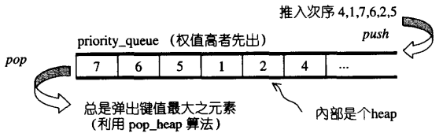
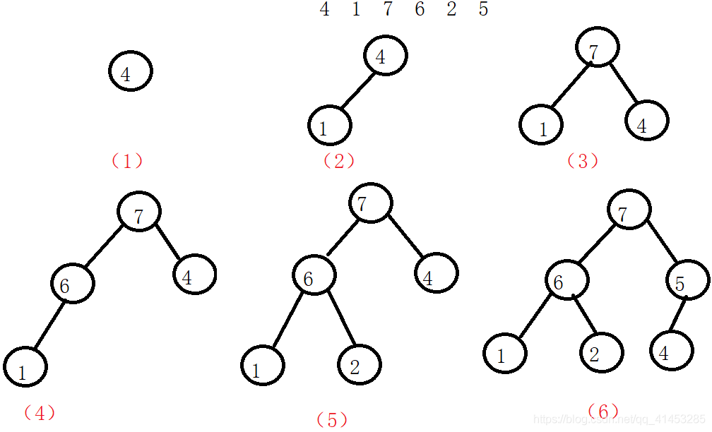

# priority_queue

## priority_queue概述

- priority_queue是一种**以权值进行排序的queue**。由于其也是一个队列，因此也遵循先进先出（FIFO）的原则，其形式如下图所示：



- **特点：**

  priority_queue会对队列中的元素根据权值进行排序（权值默认为元素的值），权值最高的在队列的头部

- **底层实现：**

  SGI STL默认用一个max-heap来实现priority_queue，而max-heap又是以vector实现的complete binary tree。因此priority_queue是默认以vector实现的。

- **priority_queuequeue是一种配接器（Adapter）：**由于queue系以底部容器完成其所有工作，而具有这种“修改某物接口，形成另一种风貌”之性质者，称为adapter（配接器），因此 STL priority_queue往往不被归类为container（容器），**而被归类为container adapter**

## priority_queue源码

```c++
template <class _Tp, 
          class _Sequence __STL_DEPENDENT_DEFAULT_TMPL(vector<_Tp>),
          class _Compare
          __STL_DEPENDENT_DEFAULT_TMPL(less<typename _Sequence::value_type>) >
class priority_queue {

  // requirements:

  __STL_CLASS_REQUIRES(_Tp, _Assignable);
  __STL_CLASS_REQUIRES(_Sequence, _Sequence);
  __STL_CLASS_REQUIRES(_Sequence, _RandomAccessContainer);
  typedef typename _Sequence::value_type _Sequence_value_type;
  __STL_CLASS_REQUIRES_SAME_TYPE(_Tp, _Sequence_value_type);
  __STL_CLASS_BINARY_FUNCTION_CHECK(_Compare, bool, _Tp, _Tp);

public:
  typedef typename _Sequence::value_type      value_type;
  typedef typename _Sequence::size_type       size_type;
  typedef          _Sequence                  container_type;

  typedef typename _Sequence::reference       reference;
  typedef typename _Sequence::const_reference const_reference;
protected:
  _Sequence c;  // 底层容器
  _Compare comp; // 元素大小比较标准
public:
  priority_queue() : c() {}
  explicit priority_queue(const _Compare& __x) :  c(), comp(__x) {}
  // 以下用到的 make_heap(), push_heap(), pop_heap()都是泛型算法
  // 注意，任一个建构式都立刻于底层容器内产生一个 implicit representation heap
  priority_queue(const _Compare& __x, const _Sequence& __s) 
    : c(__s), comp(__x) 
    { make_heap(c.begin(), c.end(), comp); }

#ifdef __STL_MEMBER_TEMPLATES
  template <class _InputIterator>
  priority_queue(_InputIterator __first, _InputIterator __last) 
    : c(__first, __last) { make_heap(c.begin(), c.end(), comp); }

  template <class _InputIterator>
  priority_queue(_InputIterator __first, 
                 _InputIterator __last, const _Compare& __x)
    : c(__first, __last), comp(__x) 
    { make_heap(c.begin(), c.end(), comp); }

  template <class _InputIterator>
  priority_queue(_InputIterator __first, _InputIterator __last,
                 const _Compare& __x, const _Sequence& __s)
  : c(__s), comp(__x)
  { 
    c.insert(c.end(), __first, __last);
    make_heap(c.begin(), c.end(), comp);
  }

#else /* __STL_MEMBER_TEMPLATES */
  priority_queue(const value_type* __first, const value_type* __last) 
    : c(__first, __last) { make_heap(c.begin(), c.end(), comp); }

  priority_queue(const value_type* __first, const value_type* __last, 
                 const _Compare& __x) 
    : c(__first, __last), comp(__x)
    { make_heap(c.begin(), c.end(), comp); }

  priority_queue(const value_type* __first, const value_type* __last, 
                 const _Compare& __x, const _Sequence& __c)
    : c(__c), comp(__x) 
  { 
    c.insert(c.end(), __first, __last);
    make_heap(c.begin(), c.end(), comp);
  }
#endif /* __STL_MEMBER_TEMPLATES */

  bool empty() const { return c.empty(); }
  size_type size() const { return c.size(); }
  const_reference top() const { return c.front(); }
  void push(const value_type& __x) {
    __STL_TRY {
      // push_heap是泛型算法，先利用底层容器的 push_back() 将新元素推入末端，再重排heap
      c.push_back(__x); 
      push_heap(c.begin(), c.end(), comp);
    }
    __STL_UNWIND(c.clear());
  }
  void pop() {
    __STL_TRY {
      //pop_heap 是泛型算法，从heap内取出一个元素。它并不是真正将元素
      //弹出，而是重排 heap，然后再以底层容器的 pop_back() 取得被弹出的元素
      pop_heap(c.begin(), c.end(), comp);
      c.pop_back();
    }
    __STL_UNWIND(c.clear());
  }
};
```

## priority_queue没有迭代器

- priority_queue的所有元素，进出都有一定的规则，只有queue顶端的元素（权值最高者），才有机会被外界取用。priority_queue 不提供遍历功能，也不提供迭代器

## priority_queue测试实例

```c++
#include <iostream>
#include <queue>
#include <algorithm>
 
using namespace std;
 
int main()
{
 
	int arr[6] = { 4,1,7,6,2,5 };
	std::priority_queue<int> ipq(arr, arr + 6);
 
	std::cout << ipq.size() << std::endl; //6
	
	//因为队列只能先进先出，所以不能够遍历队列
	for (int i = 0; i < ipq.size(); ++i)
		std::cout << ipq.top();   //7 7 7 7 7 7
	std::cout << std::endl;
 
	//先获取队列首部元素，然后再弹出
	while (!ipq.empty()) {
		std::cout << ipq.top()<<" "; //7 6 5 1 2 4
		ipq.pop();
	}
	std::cout << std::endl;
	return 0;
}
```

