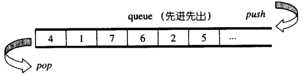

# queue

## queue概述

**队列，先进先出（First In First Out，FIFO）**的数据结构



**特点：**

- queue允许新增元素、移除元素、从最底端加入元素、取得最顶端元素
- 但除了最底端可以加入、最顶端可以取出外，没有任何其他方法可以存取queue的其他元素。换言之queue不允许有遍历行为
- 将元素推入queue的动作称为push，将元素推出 queue的动作称为pop

**底层实现：**

- SGI STL默认以deque作为缺省情况下的queu底部结构（因为deque是双向开口的数据结构，所以只要封闭其底端的出口和前端的入口就可以形成一个queue）

**queue是一种配接器（Adapter）：**由于queue系以底部容器完成其所有工作，而具有这种“修改某物接口，形成另一种风貌”之性质者，称为adapter（配接器），因此 STL queue往往不被归类为container（容器），**而被归类为container adapter**

## queue使用

- **头文件：**#include<queue>
- **默认创建**：queue<int> num;//创建一个元素类型为int的queue适配器，其底层容器类型**默认基于deque**实现
- **显式创建**：queue<string,list<string>> str;//创建一个元素类型为string的queue适配器，其底层容器类型为list

* **相关操作与函数**

  ```c++
  size_type：无符号整型，用于表示当前容器的大小、索引等
  value_type：适配器中存在的元素类型
  container_type：实现适配器的底层容器类型
   
  queue<int,list<int>> num;
  queue<int,queue<int>>::value_type i;//i为int类型
  queue<int,queue<int>>::container_type j;//j为queue类型
  
  //构造函数
  A a;//创建一个名为a的空适配器
  A a(b);//创建一个a的适配器，内容为b的拷贝
  
  q.empty();//判断当前适配器是否为空
  q.size();//返回s中的元素个数
   
  q.pop();//删除队首元素
  q.front();//返回首元素，但不删除
  q.back();//返回尾元素，但不删除
   
  q.push(t);//在队尾添加元素t
  q.emplace(args);//在队尾添加由args构造的对象
   
  q.swap(b);//交换q和b。成员函数版本
  swap(q,b);//同上。系统函数版本
  ```

## queue的源码

```c++
template <class _Tp, 
          class _Sequence __STL_DEPENDENT_DEFAULT_TMPL(deque<_Tp>) >
class queue;

template <class _Tp, class _Sequence>
class queue {

  // requirements:

  __STL_CLASS_REQUIRES(_Tp, _Assignable);
  __STL_CLASS_REQUIRES(_Sequence, _FrontInsertionSequence);
  __STL_CLASS_REQUIRES(_Sequence, _BackInsertionSequence);
  typedef typename _Sequence::value_type _Sequence_value_type;
  __STL_CLASS_REQUIRES_SAME_TYPE(_Tp, _Sequence_value_type);


#ifdef __STL_MEMBER_TEMPLATES 
  template <class _Tp1, class _Seq1>
  friend bool operator== (const queue<_Tp1, _Seq1>&,
                          const queue<_Tp1, _Seq1>&);
  template <class _Tp1, class _Seq1>
  friend bool operator< (const queue<_Tp1, _Seq1>&,
                         const queue<_Tp1, _Seq1>&);
#else /* __STL_MEMBER_TEMPLATES */
  friend bool __STD_QUALIFIER
  operator== __STL_NULL_TMPL_ARGS (const queue&, const queue&);
  friend bool __STD_QUALIFIER
  operator<  __STL_NULL_TMPL_ARGS (const queue&, const queue&);
#endif /* __STL_MEMBER_TEMPLATES */

public:
  typedef typename _Sequence::value_type      value_type;
  typedef typename _Sequence::size_type       size_type;
  typedef          _Sequence                  container_type;

  typedef typename _Sequence::reference       reference;
  typedef typename _Sequence::const_reference const_reference;
protected:
  _Sequence c;  //底层容器
public:
  queue() : c() {}
  explicit queue(const _Sequence& __c) : c(__c) {}

  //以下完全利用_Sequence c的操作，完成queue的操作
  bool empty() const { return c.empty(); }
  size_type size() const { return c.size(); }
  reference front() { return c.front(); }
  const_reference front() const { return c.front(); }
  reference back() { return c.back(); }
  const_reference back() const { return c.back(); }
  void push(const value_type& __x) { c.push_back(__x); }
  void pop() { c.pop_front(); }
};
```

运算符

```c++
template <class _Tp, class _Sequence>
bool 
operator==(const queue<_Tp, _Sequence>& __x, const queue<_Tp, _Sequence>& __y)
{
  return __x.c == __y.c;
}

template <class _Tp, class _Sequence>
bool
operator<(const queue<_Tp, _Sequence>& __x, const queue<_Tp, _Sequence>& __y)
{
  return __x.c < __y.c;
}

#ifdef __STL_FUNCTION_TMPL_PARTIAL_ORDER

template <class _Tp, class _Sequence>
bool
operator!=(const queue<_Tp, _Sequence>& __x, const queue<_Tp, _Sequence>& __y)
{
  return !(__x == __y);
}

template <class _Tp, class _Sequence>
bool 
operator>(const queue<_Tp, _Sequence>& __x, const queue<_Tp, _Sequence>& __y)
{
  return __y < __x;
}

template <class _Tp, class _Sequence>
bool 
operator<=(const queue<_Tp, _Sequence>& __x, const queue<_Tp, _Sequence>& __y)
{
  return !(__y < __x);
}

template <class _Tp, class _Sequence>
bool 
operator>=(const queue<_Tp, _Sequence>& __x, const queue<_Tp, _Sequence>& __y)
{
  return !(__x < __y);
}

#endif /* __STL_FUNCTION_TMPL_PARTIAL_ORDER */
```

## queue没有迭代器

- queue所有元素的进出都必须符合“先进后出”的条件，只有queue顶端的元素， 才有机会被外界取用。queue不提供遍历功能，也不提供迭代器

## 以list作为queue的底层容器

除了deque之外，list也是双向开口的数据结构，上述queue源代码中使用的底层容器的函数有empty，size，back，push_back，pop_back，凡此种种，list都具备。因此，若以list为底部结构并封闭其头端开口，一样能够轻易形成一个queue。

```c++
#include <iostream>
#include <list>
#include <queue>
 
using namespace std;
 
int main()
{
	std::queue<int,std::list<int>> st; //显式声明queue底层以list实现
	st.push(1);
	st.push(3);
	st.push(5);
	st.push(7);
 
	std::cout << st.size() << std::endl;
	std::cout << st.front() << std::endl << std::endl;
 
	st.pop();
	std::cout << st.front() << std::endl;
	st.pop();
	std::cout << st.front() << std::endl;
	st.pop();
	std::cout << st.front() << std::endl;
 
	return 0;
}
```

