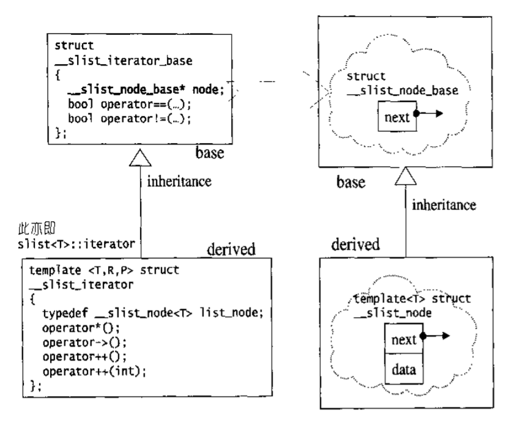

# slist

## slist概述

- SGI STL另提供了一个单向链表（single linked list），名为slist。这个容器**不属于STL的标准规范**之内。
- 它与标准list的主要不同在于迭代器。slist的迭代器是Forward iterator，而list的迭代器是Bidirectional iterator，所以slist有着更多的限制。从另一方面看，slist消耗空间更小，一些操作更快。由于slist是单向的，所以在查找迭代器的前一个结点时比较麻烦，要从头开始找。
- 根据STL的习惯，插入操作会将新元素插入于指定位置之前，而非之后。然而作为一个单向链表，slist没有任何方便的办法可以回头定出前一个位置，因此它必须从头找起。换句话说，除了slist起点处附近的区域之外，在其它位置上采用insert或erase操作函数，都属不智之举，这便是slist相较于list之下的大缺点。为此，slist特别提供了insert_after()和erase_after()供灵活运用。基于通用的(效率)考虑，slist不提供push_back()，只提供push_front()，因此slist的元素次序会和元素插入进来的次序相反。

## slist的节点

slist节点和其迭代器的设计，结构上比list复杂许多，运用了继承关系。



```c++
// 单向链表的节点基本结构
struct _Slist_node_base
{
  _Slist_node_base* _M_next;
};

// 单向链表的节点结构，继承了_Slist_node_base，其中有next指针
//next指针是_Slist_node_base*类型，基类指针可以指向派生类对象
template <class _Tp>
struct _Slist_node : public _Slist_node_base
{
  _Tp _M_data;
};

// 全局函数：已知某一节点，插入新节点于其后
inline _Slist_node_base*
__slist_make_link(_Slist_node_base* __prev_node,
                  _Slist_node_base* __new_node)
{
  // 令new节点的下一节点为prev节点的下一节点
  __new_node->_M_next = __prev_node->_M_next;
  __prev_node->_M_next = __new_node; // 令prev节点的下一节点指向new节点
  return __new_node;
}

// 全局函数：单向链表的大小(元素个数) 计算node结点到尾结点的距离，如果node是头结点，就是计算slist长度
inline size_t __slist_size(_Slist_node_base* __node)
{
  size_t __result = 0;
  for ( ; __node != 0; __node = __node->_M_next)
    ++__result; // 一个一个累计
  return __result;
}
```

```c++
//单向链表反转，反转node后面的结点（包括node）反转后node为尾结点
inline _Slist_node_base* __slist_reverse(_Slist_node_base* __node)
{
  _Slist_node_base* __result = __node;
  __node = __node->_M_next;
  __result->_M_next = 0;
  /*非递归反转单向链表。维护两个指针node和result，node在前，result在后
    node->next = result;使两个结点反转。依次移动指针直到末尾。
  */    
  while(__node) {
    _Slist_node_base* __next = __node->_M_next;
    __node->_M_next = __result;
    __result = __node;
    __node = __next;
  }
  return __result;
}
```

## slist的迭代器

```c++
// 单向链表的迭代器基本结构
struct _Slist_iterator_base
{
  typedef size_t               size_type;
  typedef ptrdiff_t            difference_type;
  typedef forward_iterator_tag iterator_category;

  _Slist_node_base* _M_node; // 指向节点基本结构

  _Slist_iterator_base(_Slist_node_base* __x) : _M_node(__x) {}
  void _M_incr() { _M_node = _M_node->_M_next; } // 前进一个节点

  bool operator==(const _Slist_iterator_base& __x) const {
    return _M_node == __x._M_node;
  }
  bool operator!=(const _Slist_iterator_base& __x) const {
    return _M_node != __x._M_node;
  }
};

// 单向链表的迭代器结构
template <class _Tp, class _Ref, class _Ptr>
struct _Slist_iterator : public _Slist_iterator_base
{
  typedef _Slist_iterator<_Tp, _Tp&, _Tp*>             iterator;
  typedef _Slist_iterator<_Tp, const _Tp&, const _Tp*> const_iterator;
  typedef _Slist_iterator<_Tp, _Ref, _Ptr>             _Self;

  typedef _Tp              value_type;
  typedef _Ptr             pointer;
  typedef _Ref             reference;
  typedef _Slist_node<_Tp> _Node;

  _Slist_iterator(_Node* __x) : _Slist_iterator_base(__x) {}
  _Slist_iterator() : _Slist_iterator_base(0) {}
  _Slist_iterator(const iterator& __x) : _Slist_iterator_base(__x._M_node) {}

  reference operator*() const { return ((_Node*) _M_node)->_M_data; }
#ifndef __SGI_STL_NO_ARROW_OPERATOR
  pointer operator->() const { return &(operator*()); }
#endif /* __SGI_STL_NO_ARROW_OPERATOR */

  _Self& operator++()
  {
    _M_incr();
    return *this;
  }
  _Self operator++(int)
  {
    _Self __tmp = *this;
    _M_incr();
    return __tmp;
  }
};
```

## slist的数据结构

```c++
template <class _Tp, class _Alloc> 
struct _Slist_base {
  typedef _Alloc allocator_type;
  allocator_type get_allocator() const { return allocator_type(); }

  _Slist_base(const allocator_type&) { _M_head._M_next = 0; }
  ~_Slist_base() { _M_erase_after(&_M_head, 0); }

protected:
  typedef simple_alloc<_Slist_node<_Tp>, _Alloc> _Alloc_type;
  _Slist_node<_Tp>* _M_get_node() { return _Alloc_type::allocate(1); }
  void _M_put_node(_Slist_node<_Tp>* __p) { _Alloc_type::deallocate(__p, 1); }

  _Slist_node_base* _M_erase_after(_Slist_node_base* __pos)
  {
    _Slist_node<_Tp>* __next = (_Slist_node<_Tp>*) (__pos->_M_next);
    _Slist_node_base* __next_next = __next->_M_next;
    __pos->_M_next = __next_next;
    destroy(&__next->_M_data);
    _M_put_node(__next);
    return __next_next;
  }
  _Slist_node_base* _M_erase_after(_Slist_node_base*, _Slist_node_base*);

protected:
  _Slist_node_base _M_head;
};  
```

```c++
template <class _Tp, class _Alloc = __STL_DEFAULT_ALLOCATOR(_Tp) >
class slist : private _Slist_base<_Tp,_Alloc>
{
public:
  typedef _Tp                value_type;
  typedef value_type*       pointer;
  typedef const value_type* const_pointer;
  typedef value_type&       reference;
  typedef const value_type& const_reference;
  typedef size_t            size_type;
  typedef ptrdiff_t         difference_type;

  typedef _Slist_iterator<_Tp, _Tp&, _Tp*>             iterator;
  typedef _Slist_iterator<_Tp, const _Tp&, const _Tp*> const_iterator;    

private:
  typedef _Slist_node<_Tp>      _Node;
  typedef _Slist_node_base      _Node_base;
  typedef _Slist_iterator_base  _Iterator_base;    
    
  _Node* _M_create_node(const value_type& __x) {
    _Node* __node = this->_M_get_node();
    __STL_TRY {
      construct(&__node->_M_data, __x);
      __node->_M_next = 0;
    }
    __STL_UNWIND(this->_M_put_node(__node));
    return __node;
  }
```

## slist的元素操作

### push_front

```c++
// 从头部插入元素(新元素成为slist的第一个元素)
void push_front(const value_type& __x)   {
  __slist_make_link(&this->_M_head, _M_create_node(__x));
}
```

### pop_front

```c++
// 从头部取走元素(删除之)，修改head
void pop_front() {
  _Node* __node = (_Node*) this->_M_head._M_next;
  this->_M_head._M_next = __node->_M_next;
  destroy(&__node->_M_data);
  this->_M_put_node(__node);
}
```

