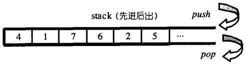

# stack

## stack概述

**栈，先进后出（First In Last Out，FILO）**的数据结构。



**特点：**

- stack允许新增元素、移除元素、取得最顶端元素。但除了最顶端外，没有任何其他方法可以存取stack的其他元素。换言之stack不允许有遍历行为
- 将元素推入stack的动作称为push，将元素推出stack的动作称为pop

**底层实现：**

- SGI STL默认以deque作为缺省情况下的stack底部结构（因为deque是双向开口的数据结构，所以只要封闭其头端开口既可以形成一个stack）

**stack是一种配接器（Adapter）：**由于stack系以底部容器完成其所有工作，而具有这种“修改某物接口，形成另一种风貌”之性质者，称为adapter（配接器），因此 STL stack往往不被归类为container（容器），**而被归类为container adapter**

> - **什么是适配器（container adapter）：**
>   - 一个适配器是一种机制，能使某种事物的行为看起来像另外一种事物一样
>   - **容器、迭代器、函数**都有适配器
> - 容器适配器就是通过上面这些容器底层实现，使上面那些容器能拥有一些行为和特点
> - **标准库提供的容器适配器有：**
>   * **stack：**栈。具有先进后出的特点。
>   * **queue：**队列。具有先进先出的特点。
>   * **priority_queue：**优先级队列。其内的元素拥有各种优先权。所谓优先权是基于程序员提供的排序准则（默认为操作符<）而定义。这种特殊容器的效果相当于这样一个缓冲区：“下一个元素永远是容器中优先权最高的元素”。如果同时有多个元素具备最高优先权，则其次序无明确定义
> - **其他注意事项：**
>   - 一种容器适配器只能接受一种已有的容器类型
>   - **array**和**forward_list**没有容器适配器

## stack使用

- **头文件：**#include<stack>

- **默认创建**：stack<int> num;//创建一个元素类型为int的stack适配器，其底层容器类型**默认基于deque**实现

- **显式创建**：stack<string,vector<string>> str;//创建一个元素类型为string的stack适配器，其底层容器类型为vector

- **相关操作与函数**

  ```c++
  size_type：无符号整型，用于表示当前容器的大小、索引等
  value_type：适配器中存在的元素类型
  container_type：实现适配器的底层容器类型
   
  stack<int,vector<int>> num;
  stack<int,vector<int>>::value_type i;//i为int类型
  stack<int,vector<int>>::container_type j;//j为vector类型
  
  //构造函数
  A a;//创建一个名为a的空适配器
  A a(b);//创建一个a的适配器，内容为b的拷贝
  
  s.empty();//判断当前适配器是否为空
  s.size();//返回s中的元素个数
   
  s.top();//返回栈顶元素但不删除
  s.pop();//删除栈顶元素，但是不返回该元素
  s.push(t);//压入元素t
  s.empalce(args);//压入一个有args创建的对象
   
  s.swap(b);//交换s和b。成员函数版本
  swap(s,b);//同上。系统函数版本
  ```

## stack的源码

```c++
template <class _Tp, 
          class _Sequence __STL_DEPENDENT_DEFAULT_TMPL(deque<_Tp>) >  //默认以deque实现
class stack;

template <class _Tp, class _Sequence>
class stack {

  // requirements:

  __STL_CLASS_REQUIRES(_Tp, _Assignable);
  __STL_CLASS_REQUIRES(_Sequence, _BackInsertionSequence);
  typedef typename _Sequence::value_type _Sequence_value_type;
  __STL_CLASS_REQUIRES_SAME_TYPE(_Tp, _Sequence_value_type);
    
#ifdef __STL_MEMBER_TEMPLATES
  template <class _Tp1, class _Seq1>
  friend bool operator== (const stack<_Tp1, _Seq1>&,
                          const stack<_Tp1, _Seq1>&);
  template <class _Tp1, class _Seq1>
  friend bool operator< (const stack<_Tp1, _Seq1>&,
                         const stack<_Tp1, _Seq1>&);
#else /* __STL_MEMBER_TEMPLATES */
  friend bool __STD_QUALIFIER
  operator== __STL_NULL_TMPL_ARGS (const stack&, const stack&);
  friend bool __STD_QUALIFIER
  operator< __STL_NULL_TMPL_ARGS (const stack&, const stack&);
#endif /* __STL_MEMBER_TEMPLATES */

public:
  typedef typename _Sequence::value_type      value_type;
  typedef typename _Sequence::size_type       size_type;
  typedef          _Sequence                  container_type;

  typedef typename _Sequence::reference       reference;
  typedef typename _Sequence::const_reference const_reference;
protected:
  _Sequence c;  //底层容器
public:
  stack() : c() {}
  explicit stack(const _Sequence& __s) : c(__s) {}

  // 以下完全利用Sequence c的操作，完成stack的操作
  bool empty() const { return c.empty(); }
  size_type size() const { return c.size(); }
  reference top() { return c.back(); }
  const_reference top() const { return c.back(); }
  void push(const value_type& __x) { c.push_back(__x); }
  void pop() { c.pop_back(); }
};
```

运算符

```c++
template <class _Tp, class _Seq>
bool operator==(const stack<_Tp,_Seq>& __x, const stack<_Tp,_Seq>& __y)
{
  return __x.c == __y.c;
}

template <class _Tp, class _Seq>
bool operator<(const stack<_Tp,_Seq>& __x, const stack<_Tp,_Seq>& __y)
{
  return __x.c < __y.c;
}

#ifdef __STL_FUNCTION_TMPL_PARTIAL_ORDER

template <class _Tp, class _Seq>
bool operator!=(const stack<_Tp,_Seq>& __x, const stack<_Tp,_Seq>& __y)
{
  return !(__x == __y);
}

template <class _Tp, class _Seq>
bool operator>(const stack<_Tp,_Seq>& __x, const stack<_Tp,_Seq>& __y)
{
  return __y < __x;
}

template <class _Tp, class _Seq>
bool operator<=(const stack<_Tp,_Seq>& __x, const stack<_Tp,_Seq>& __y)
{
  return !(__y < __x);
}

template <class _Tp, class _Seq>
bool operator>=(const stack<_Tp,_Seq>& __x, const stack<_Tp,_Seq>& __y)
{
  return !(__x < __y);
}

#endif /* __STL_FUNCTION_TMPL_PARTIAL_ORDER */
```

## stack没有迭代器

- stack所有元素的进出都必须符合“先进后出”的条件，只有stack顶端的元素， 才有机会被外界取用。stack不提供走访功能，也不提供迭代器

## 以list作为stack的底层容器

演示案例

```c++
#include <iostream>
#include <list>
#include <stack>
 
using namespace std;
 
int main()
{
	std::stack<int,std::list<int>> st;
	st.push(1);
	st.push(3);
	st.push(5);
	st.push(7);
 
	std::cout << st.size() << std::endl;
	std::cout << st.top() << std::endl << std::endl;
 
	st.pop();
	std::cout << st.top() << std::endl;
	st.pop();
	std::cout << st.top() << std::endl;
	st.pop();
	std::cout << st.top() << std::endl;
 
	return 0;
}
```

