# tree

- **树状图**是一种数据结构，它是由n（n>=1）个有限结点组成一个具有层次关系的集合。把它叫做“树”是因为它看起来像一棵倒挂的树，也就是说它是根朝上，而叶朝下的

## 树的种类

- **按功能：**
  - 一般树（简单树）、二叉树
  - 堆（heap）、左高树（leftist tree）、竞标赛树、二叉搜索树、AVL树、红黑树、伸展树、B树
  - 配对堆、区间堆、双端优先级队列的树结构、字典树（也称前缀数、单词查找树、键树）、后缀树等等......
- **按顺序：**
  - 有序树：树中的节点，其子树从左至右是有次序的（不能互换），例如二叉树
  - 无序数：树中的节点，其子树从左至右是无次序的（可以互换），例如普通树

## 树的术语、名词

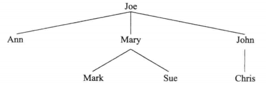

- **以上图为例：**

  - **根：**一棵树t是一个非空的有限元素的集合，其中最顶级的元素称为根。Joe就是根
  - **子树：**一个树除了根节点之外，其余的称为子树。除了Joe节点之外，其余节点全是子树
  - **孩子：**Ann、John是Joe的孩子、Mark是Mary的孩子，以此类推...
  - **父母：**Mary是Mark、Sue节点的父母，以此类推...
  - **兄弟：**Sue是Mark的兄弟，Ann是John的兄弟，以此类推...
  - **孙子、祖父、祖先、后代：**Mark是Joe的孙子，其他名词以此类推...
  - **叶子：**树种没有孩子的元素称为叶子，例如Ann、Mark、Sue等

- **另一些术语：**

  - **备注：**有的术语中级数/深度/高度会以0开始计算

  - **节点的级数/层数：**树根是1级（Joe节点），Ann、Mary、John节点是2级、Mark节点等是3级，以此类推...

  - **深度（从上到下）：**

    - 节点的深度：**根节点至任一节点的路径长度，即为该节点的深度**。树根的深度1，Ann、Mary、John节点的深度2，Mark节点的深度3，以此类推...
    - 树的深度：是指树深度的最大数，例如本图中，树的深度为3

  - **高度（从下到上）：**

    - 节点的高度：**某节点至其最深子节点的路径长度，称为该节点的高度。**从最底部的叶节点开始计算，每增一层高度加1。例如Ann、Mark、Sue、Chris的高度为1，Mary、John的高度为2，Joe的高度为3
    - 树的高度：高度最高的节点值，也就是根节点的高度。此图中的树的高度为3

  - **节点的度：**

    是指其孩子的个数。例如Joe的度为3、Ann的度为0，以此类推...

    - 度为0的节点称为叶节点或终端节点
    - 度不为0的节点称为分支节点或非终端节点

  - **树的度：**是指树种最大节点的那个度。例如本图中，树的度为3，因为树种最大的度节点为Joe，其度为3

## 二叉树

- **定义：**一棵二叉树t是有限个元素的集合（可以为空）。当二叉树非空时，其中有一个元素称为根，余下的元素被划分为两颗二叉树，分别称为t的左子树和右子树。

  所谓二叉树，其意义是：“任何节点最多只允许两个子节点”。这两个子节点称为左子节点和右子节点，如果以递归方式来定义二叉树，我们可以说：“一个二叉树如果不为空，便是由一个根节点和左右两子树构成；左右子树都可能为空”。

- **二叉树与树的根本区别：**
  - 1.二叉树的每个元素都恰好有两颗子树（其中一个或两个可能为空）。而树的每个元素可有任意数量的子树
  - 2.在二叉树中，每个元素的子树都是有序的，也就是所，有左子树和右子树之分。而树的子树是无序的

> ### 图例
>
> 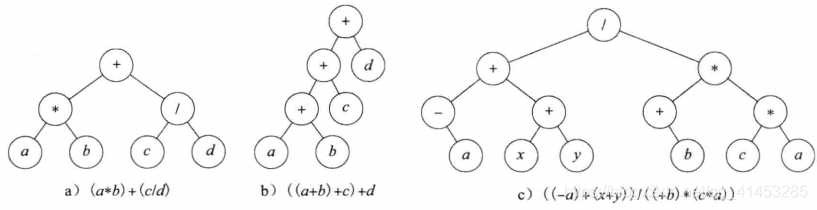
>
> - 本图中展示的就是二叉树，此二叉树用于表示算术表达式
> - 算术表达式树的一个应用是生成优化的计算机代码以计算表达式的值

## 二叉树的特性

* **特性1**：

  - **一棵二叉树有n个元素，n>0，则其有n-1条边**
  - **证明：**二叉树的每个元素（除了根节点）有且只有一个父节点。在子节点与父节点间有且只有一条边，因此边数为n-1
* **特性2**：

  - **一棵二叉树的高度为h，h>=0，它最少有h个元素，最多有$2^h-1$个元素**

  - **证明：**因为每一级最少有1个元素，因此元素的个数最少为h。每个元素最多有2个子节点，则第i层节点最多为$2^{i-1}$个，i>0。当h=0时，元素的总数为0，也就是$2^0-1$。当h>0时，元素的总数不会超过$\sum_{i=1}^{h}2^{i-1}=2^h-1$
* **特性3**：
  - **一棵二叉树有n个元素，n>0，它的高度最大为n，最小高度为[log(n+1)]**
  - **证明：**因为每层至少有一个元素，因此高度不会超过n。有特性②可以知道，高度为h的二叉树最多有$2^h-1$。由于h是整数，所以h>=[log (n+1)]
* **特性4**：
  - 这个特性是属于完全二叉树的
  - 设完全二叉树的一个元素其编号为i，1<=i<=n，则由有以下关系：
    - 1.如果i=1，则该元素为二叉树的根。若i>1，则其父节点的编号为**i/2**
    - 2.如果2i>n，则元素无左孩子。否则，其**左孩子的编号为2i**
    - 3.如果2i+1>n，则该元素无右孩子。否则， 其**右孩子的编号为2i+1**

## 满二叉树

- 当高度为h的二叉树恰好有$2^h-1$个元素时，称其为满二叉树
- **特点：**
  - 第i层上的节点数必为$2^{i-1}$个
  - 高度为h的二叉树恰好有$2^h-1$个元素
  - 满二叉树不存在度为1的节点

## 完全二叉树

* **定义：**对高度为h的满二叉树的元素，从第一层到最后一层，在每一次中从左至右，顺序编号，从1到$2^h-1$，假设从满二叉树中删除k个其编号为$2^h-i$元素，1<=i<=k<$2^h$，所得到的的二叉树被称为完全二叉树。

* **设完全二叉树的一个元素其编号为i，1<=i<=n，则由以下关系：**
  - 1.如果i=1，则该元素为二叉树的根。若i>1，则其父节点的编号为**i/2**
  - 2.如果2i>n，则元素无左孩子。否则，其**左孩子的编号为2i**
  - 3.如果2i+1>n，则该元素无右孩子。否则， 其**右孩子的编号为2i+1**

- 满二叉树是完全二叉树的一个特例

- 下面是3颗完全二叉树

  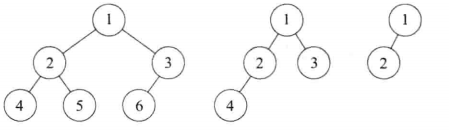

## 二叉搜索树

- 所谓二叉搜索树，可**提供对数时间**的元素插入和访问
- **节点放置规则：**任何节点的键值一定大于其左子树的每一个节点的键值；并小于其右子树中的每一个节点的键值

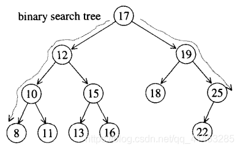

* **最大值、最小值：**

  最小值：从根节点出发，一直往左走，直至无左路可走，即得到最小元素

  最大值：从根节点出发，一直往右走，直至无右路可走，即得到最大元素

> ### **二叉搜索树的查找**
>
> - 从根节点出发，根据值的大小，逐个向左或向右查找，就可以查找到元素
>
> ### **二叉搜索树的插入**
>
> - 插入新元素时，从根节点开始，遇键值较大者就向左，遇键值较小者就向右，一直到尾端，即为插入点
>
> 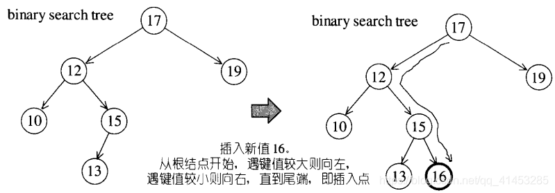
>
> ### **二叉搜索树的删除**
>
> - **如果要删除的节点只有一个子节点：**直接将其子节点连至其父节点即可。例如下面第一张图删除节点15
> - **如果要删除的节点有二个子节点：**以右子树中的最小节点代替删除节点（从删除节点的右子节点开始开始一直向左即可找到）。例如下面第二张图删除节点12
>
> 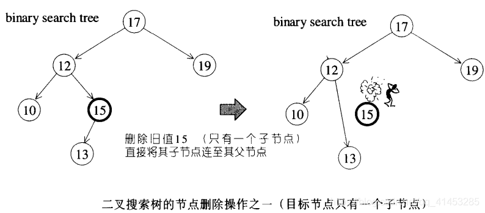
>
> 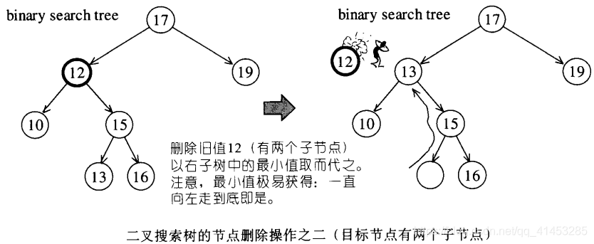

## 平衡二叉搜索树

- 如果因为输入值不够随机，或者经过某些插入和删除操作，二叉搜索树可能会失去平衡，**造成搜寻效率低落的情况**，如下图所示

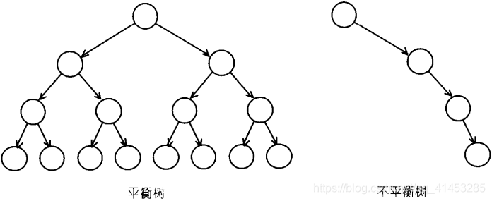

- 树是否平衡，没有一个绝对的测量标准。**“平衡”的大致意义是：没有任何一个节点过深（深度过大）**。
- 不同的平衡条件，造就出不同的效率表现，以及不同的实现复杂度。有数种特殊结构如AVL-tree、RB-tree、AA-tree，均可实现平衡二叉搜索树，它们都比一般的二叉搜索树复杂，因此，插入节点和删除节点的平均时间也比较长，但是它们可以避免极难应付的最坏（高度不平衡）情况，而且由于它们**总是保持某种程序的平衡**，所以元素的访问时间平均而言也就比较少，一般而言其搜索时间可节省25%左右。
- **关联式容器的内部结构是一个balanced vinary tree（平衡二叉树）**
- 平衡二叉树的种类很多，包括AVL-tree、RB-tree、AA-tree等。其中广泛运用于STL的是RB-tree（红黑树）

### AVL tree(Adelson-Velskii-Landis tree)

- AVL tree是一个“加上了额外平衡条件”的二叉搜索树。其平衡条件的建立是为了确保整棵树的深度为$O(logN)$。
- AVL tree要求任何节点的左右子树**高度相差最多为1**
- 例如：下面左图是一个AVL tree，但是插入了节点11之后就不是AVL tree了

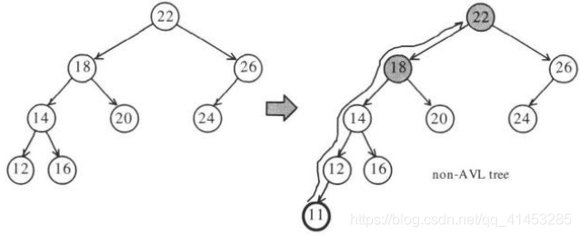

#### 非AVL tree的调整

- 如果是添加、删除节点导致一个AVL tree变为非AVL tree。只要调整“插入点至根节点”路径上、平衡状态被破坏之各节点中最深的那一个，便可使整棵树重新获得平衡。

> ### 演示说明
>
> - 假设该最深节点为X，由于节点最多拥有两个子节点，而所谓“平衡被破坏”意味着X的**左右两棵子树的高度相差2**，因此我们可以轻易将情况分为4种：
>   - 1.插入点位于X的左子节点的左子树——左左
>   - 2.插入点位于X的左子节点的右子树——左右
>   - 3.插入点位于X的右子节点的左子树——右左
>   - 4.插入点位于X的右子节点的右子树——右右
> - 情况1,4彼此对称，称为**外侧（outside）插入**，可以采用**单旋转操作**调整解决
> - 情况2,3彼此对称，称为**内侧（inside）插入**，可以采用**双旋转操作**调整解决
>
> 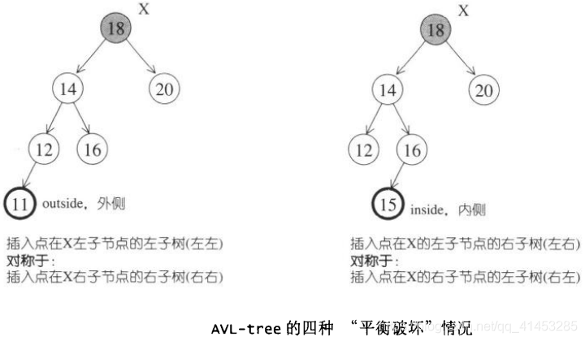

#### 非AVL tree的调整之“单旋转”

- 为了调整平衡状态，我们希望将A子树提高一层，并将C子树下降一层，解析如下：
  - 把K1向上提起，使K2自然下滑，并将B子树挂到K2的左侧
  - 因为K2>k1，所以K2必须称为新树中K1的右子节点
  - 未旋转前B位于K1-K2之间，所以旋转之后，B必须位于K1右侧，K2的左侧
- 下图显示的是“左左”外侧插入，至于“右右”外侧插入也是如此

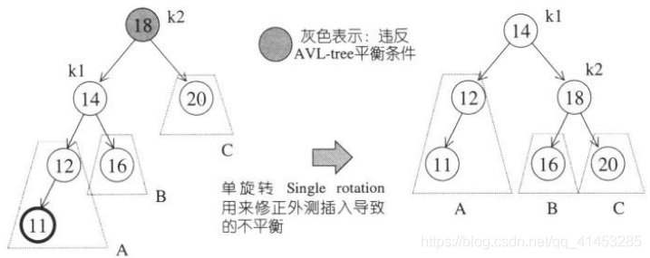

#### 非AVL tree的调整之“双旋转”

- 下图左侧为内侧插入所造成的不平衡状态
- **单旋转不能解决这种情况：**
  - 因为，我们不能再以K3为根节点
  - 其次，我们不能将K3和K1做一次单旋转，因为旋转之后还是不平衡
- **双旋转可以解决这种情况：**
  - 以K2为新的根节点
  - 这使得K1必须成为K2的左子节点，K3必须成为K2的右子节点

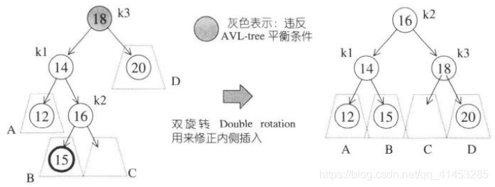

- 为什么称为双旋转哪，因为它利用两次单旋转，如下图所示

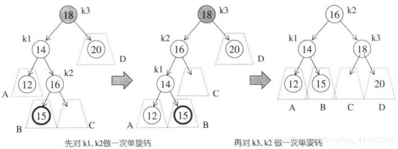

- 上图显示的是“左右”外侧插入，至于“右左”外侧插入也是如此

### RB-tree

参考[RB-tree](./RB-tree.md)

