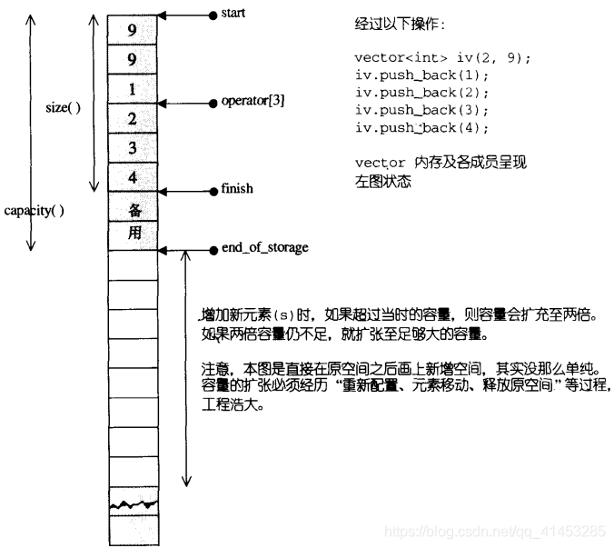
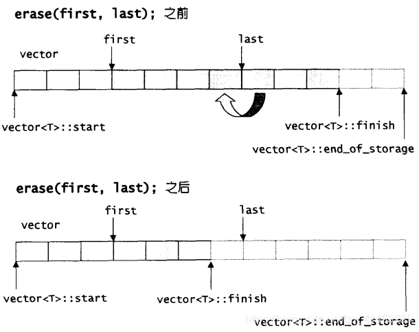

# vector

## vector概述

**vector是**可变大小数组

vector与array非常相似，两者的唯一差别在于空间的运用的灵活性。array是静态空间，一旦配置了就不能改变；vector是动态空间，随着元素的加入，它的内部机制会自行扩产空间以容纳新元素。vector的实现技术，关键在于其对大小的控制以及重新配置时的数据移动效率。

**特点：**

- 支持快速随机访问。在尾部之外的位置插入或删除元素可能很慢
- 元素保存在**连续的内存空间**中，因此通过下标取值非常快
- 在容器中间位置添加或删除元素**非常耗时**
- 一旦vector内存不足，重新申请内存之后，和原vector相关的指针，引用，迭代器都失效。内存重分配耗时很长

通常，使用vector是最好的选择，如果没有什么特殊要求，最好使用vector

与其他容器的比较：

| 名称         | 特性                                                         |
| ------------ | ------------------------------------------------------------ |
| vector       | **可变大小数组**。支持快速随机访问。在尾部之外的位置插入或删除元素可能很慢 |
| deque        | **双端队列**。支持快速随机访问。在头尾插入/删除速度很快      |
| list         | **双向链表**。只支持双向顺序访问。在list中任何位置进行插入和删除的速度都很快 |
| forward_list | **单向链表**。只支持单向顺序访问。在链表任何位置进行插入和删除操作速度都很快 |
| array        | **固定大小数组**。支持快速随机访问。不能添加或删除元素       |
| string       | **与vector相似的容器**，但专门用于保存字符。随机访问快。在尾部插入或删除速度快 |

## vector使用

* **头文件：**#include <vector>

* **using声明：**using std::vector;

* **初始化**

  vector<T> v1; ==>v1是一个空的vector

  vector<T> v2(v1); ===>v2是v1的副本，拷贝构造

  vector<T> v2=v1; ===>同上

  vector<T> v1(n,val); ===>初始化n个value

  vector<T> v1(iter1,iter2); ===>用迭代器iter1与iter2所指的区间内元素进行初始化

  vector<T> v1(n); ===>初始化n个元素，每个元素使用默认值（int为0，string为空...）

  vector<T> v1{a,b,c...}; ===>用元素a,b,c进行初始化

  vector<T> v1={a,b,c...}; ===>同上

* **相关操作**

  运算符

  ```c++
  v1==v2;//判断v1和v2是否相等
  v1!=v2;//判断v1和v2是否相等
  >、>=、<、<= //以字典顺序进行比较
  ```

  取值 索引取值：v[0]，v[1]，v[2]...

* **相关函数**

```c++
v.empty();//判断是否为空，返回布尔值
v.size();//返回容器中的元素个数
v.max_size();//返回容器的容量

v.front();//得到头元素
v.back();//得到尾元素
v.at(int i);//得到下标i处的元素，若下标越界，会抛出异常

v1.swap(v2);//将v1和v2进行交换。容器的成员函数版本
swap(v1,v2);//同上。系统函数版本
 
assign(iter1,iter2);//将容器元素更换为一个迭代器的区间元素
assign(n,t);//将容器元素变为n个t元素

v.insert(iter,t);//在迭代器iter处插入t。返回所插位置处的迭代器
v.insert(v.end(),10,t);//在容器v的末尾插入10个元素，每个元素都是t。返回新添加元素的第一个元素的迭代器
v.insert(v.end(),{"a","b"...});//将后面花括号的每个元素插入容器v的尾部。返回新添加元素的第一个元素的迭代器
v.insert(v.begin(),v2.end()-2,v2.end());//将容器v2的最后两个元素插入容器v的头部。返回新添加元素的第一个元素的迭代器
注意：上面这个用法，后面两个参数不能为自身容器的范围（v.insert(v.begin(),v.end()-2,v.end());是错误的）
 
 
//利用insert的返回值，下面代码为一直在lst容器的头部插入元素(类似于push_front的功能)
vector<string> v;
auto iter=lst.begin();
while(cin>> word)
    iter=v.insert(iter,word);//insert函数每回执行完，返回容器的首元素位置

//vector不支持pop_front
 
v.push_back(t);//尾部追加元素t
v.pop_back();//删除尾元素
 
v.earse(iter);//删除迭代器iter所指位置处的元素。返回删除位置处后一个元素迭代器
v.erase(iter1,iter2);//删除迭代器iter1与iter2区间内的元素。返回删除最后一个元素的后一个元素迭代器
 
v.clear();//清空容器，重新初始化容器

v.resize(n);//将容器v的元素变为n个。若n<原始元素个数，删除多于元素。若n>原始元素个数，则用默认初始值初始化容器
v.resize(n,t);//将容器元素变为n个t。与容器原始个数无关
 
vector<int> v(5,666);
v.resize(3);//v内有3个元素，都是666
v.resize(8);;//v内有8个元素，前5个个是666，后3个都是0(默认)
v.resize(10,666);//v内有10个元素，都是666

//vector不支持emplace_front();
//下面的两个函数，是在内存中创建一个对象，然后添加进相应的位置
v.empalce(iter,args);//在容器v的位置添加创建一个args对象
v.emplace_back(args);//在容器v的尾部添加创建一个args对象
 
例如
class A{
    string name;int age;
public:
    A(string name, int age);
};
int main()
{
    vector<A> v;
    v.emplace_back("C语言", 18);//在尾部创建一个元素
    v.emplace(v.begin(),"C++",18);//在容器v的头部添加一个元素
}

v.capacity();//返回当前容器的容量(总共能存多少个)
v.reserve(n);//为容器v重新分配n个内存空间（如果n<=当前容器大小，则什么都不做）
```

* **容器操作使迭代器、引用、指针失效**

向容器中添加或者删除元素可能会使容器的迭代器、引用、指针失效。失效的迭代器、引用、指针不再表示任何元素，使用起来非常危险。如果vector**没有内存重分配**。插入位置之前的元素的迭代器、引用、指针有效，插入位置之后的迭代器、引用、指针都失效。如果**内存重分配**，则所有的迭代器、引用、指针都失效。删除元素之前的迭代器、引用、指针有效，之后的失效

## vector的迭代器

vector维护的是一个**连续线性空间**，所以不论其元素类别是什么，普通指针都可以作为vector的迭代器而满足所有必要条件

vector迭代器支持有操作有（普通指针也具备）：operator*、operator->、operator++、operator--、operator+、operator-、operator+=、operator-=

vector支持随机存取，而普通指针正有着这样的能力，所以，**vector提供的是随机访问迭代器**（Random Access iterators）

vector的迭代器定义如下：

```c++
  typedef _Tp value_type;
  typedef value_type* iterator;
```

```c++
vector<int>::iterator ivite;   //等同于int* ivite;
vector<Shape>::iterator svite; //等同于Shape* svite;
```

## vector的数据结构

vector的数据结构非常简单：**一个线性连续空间**。它以两个迭代器start和finish分别指向配置得来的连续空间中目前已被使用的范围，并以迭代器end_of_storage指向整块连续空间（含备用空间）的尾端。

```c++
template <class _Tp, class _Alloc> 
class _Vector_base {
...
  protected:
  _Tp* _M_start; // 表示目前使用空间的头
  _Tp* _M_finish; // //表示目前使用空间的尾
  _Tp* _M_end_of_storage; //表示目前可用空间的尾
...
};
```

为了降低空间配置时的速度成本，vector实际配置的大小可能比客户端需求量更大一些，以备将来可能的扩充。这便是容量的概念。也就是说，一个vector的容量永远大于或等于其大小。一旦容量等于大小，下次再新增元素时就需要新开辟一块空间。



运用start、finish、end_of_storage三个迭代器，vector**提供了首尾标示、大小、容量、空容器判断、注标[]运算符、最前端元素值、最后端元素值....等机能**，如下：

```c++
  iterator begin() { return _M_start; }
  iterator end() { return _M_finish; }
  size_type size() const { return size_type(end() - begin()); }
  size_type capacity() const { return size_type(_M_end_of_storage - begin()); }
  bool empty() const { return begin() == end(); }
  reference operator[](size_type __n) { return *(begin() + __n); }
  reference front() { return *begin(); }
  reference back() { return *(end() - 1); }
```

## vector的构造与内存管理

vector默认使用alloc做为空间配置器，并据此另外定义了一个data_allocator，为的是更方便以元素大小为配置单位：

```c++
template <class _Tp, class _Alloc> 
class _Vector_base {
protected:
    typedef simple_alloc<_Tp, _Alloc> _M_data_allocator;
...
};
```

data_allocator::allocate(n) 表示配置n个元素空间

vector提供许多构造函数，其中一个允许我们指定空间大小及初值：

```c++
vector(size_type __n, const _Tp& __value, const allocator_type& __a = allocator_type()): _Base(__n, __a)
  { _M_finish = uninitialized_fill_n(_M_start, __n, __value); }
```

当我们以push_back() 将新元素安插入于vector尾端时，该函式首先检查是否还有备用空间，如果有就直接在备用空间上建构元素，并调整迭代器finish，使vector变大。如果没有备用空间了，就扩充空间（重新配置、搬移数据、释放原空间）

```c++
  void push_back(const _Tp& __x) {
    if (_M_finish != _M_end_of_storage) { //还有备用空间
      construct(_M_finish, __x);
      ++_M_finish; // 调整水位高度
    }
    else // 已无备用空间
      _M_insert_aux(end(), __x);
  }
```

```c++
template <class _Tp, class _Alloc>
void vector<_Tp, _Alloc>::_M_insert_aux(iterator __position, const _Tp& __x)
{
  if (_M_finish != _M_end_of_storage) {
    // 在备用空间起始处建构一个元素，并以 vector 最后一个元素值为其初值。
    construct(_M_finish, *(_M_finish - 1));
    ++_M_finish;
    _Tp __x_copy = __x;
    copy_backward(__position, _M_finish - 2, _M_finish - 1);
    *__position = __x_copy;
  }
  else {
    const size_type __old_size = size();
    const size_type __len = __old_size != 0 ? 2 * __old_size : 1;
    // 以上配置原则：如果原大小为0，则配置 1（个元素大小）
    // 如果原大小不为 0，则配置原大小的两倍，
    // 前半段用来放置原数据，后半段准备用来放置新数据
    iterator __new_start = _M_allocate(__len);
    iterator __new_finish = __new_start;
    __STL_TRY {
      // 将原 vector 的内容拷贝到新vector
      __new_finish = uninitialized_copy(_M_start, __position, __new_start);
      // 为新元素设定初值 x
      construct(__new_finish, __x);
      // 调整水位
      ++__new_finish;
      // 将原vector的备用空间中的内容也忠实拷贝过来
      __new_finish = uninitialized_copy(__position, _M_finish, __new_finish);
    }
    __STL_UNWIND((destroy(__new_start,__new_finish), 
                  _M_deallocate(__new_start,__len)));
    //析构并释放原vector
    destroy(begin(), end());
    _M_deallocate(_M_start, _M_end_of_storage - _M_start);
    // 调整迭代器，指向新vector
    _M_start = __new_start;
    _M_finish = __new_finish;
    _M_end_of_storage = __new_start + __len;
  }
}
```

- **vector的内存重分配策略：**

  - vector是以数组的形式存储的，当往vector中增加元素时，如果vector的容量不足，那么vector就会进行扩容
  - **扩容的规则是：**所谓动态增加大小，并不是在原空间之后接续新空间（因为无法保证原空间之后尚有可供配置的空间），而是申请一块比现在大的新的内存空间（gcc和vc申请规则不同，见下面介绍），然后原来内存中的内容拷贝到新内存中，然后才开始在原内容之后构造新元素，并释放原来的内存。
  - **重点：**在gcc和vc的环境下，vector的扩容规则是不一样的

  > ### Windows下
  >
  > - vector内存重分配即容量的增长是有规律的，***\*可以通过下面的公式描述：\****
  >
  > ```c++
  > maxSize = maxSize + ((maxSize >> 1) > 1 ? (maxSize >> 1) : 1)
  > ```
  >
  > - 就是由1、2、3、4、6、9、13、19......依次增长
  > - 从4之后开始有规则：当前索引处的值等于前一个元素值和前前前元素的值之和
  >
  > ### Linux下
  >
  > - **Linux下的扩容规则是：**其比较简单，就是将大小扩充为原来的2倍
  >
  > ```
  > maxSize = maxSize*2;
  > ```
  >
  > - 就是由1、2、4、8、16......依次增长

- **注意（重点）：** 对vector 的任何操作，一旦引起空间重新配置，**指向原vector的所有迭代器就都失效了**。这是程序员易犯的一个错误，务需小心

## vector的元素操作

### pop_back

```c++
//将尾端元素拿掉，并调整大小  
void pop_back() {
    --_M_finish; //将尾端标记往前移一格，表示将放弃尾端元素
    destroy(_M_finish);
  }
```

### erase

```c++
// 清除某个位置上的元素
iterator erase(iterator __position) {
    if (__position + 1 != end())
      copy(__position + 1, _M_finish, __position);
    --_M_finish;
    destroy(_M_finish);
    return __position;
  }
```

```c++
// 清除[first,last)中的所有元素
iterator erase(iterator __first, iterator __last) {
    iterator __i = copy(__last, _M_finish, __first);
    destroy(__i, _M_finish);
    _M_finish = _M_finish - (__last - __first);
    return __first;
  }
```

