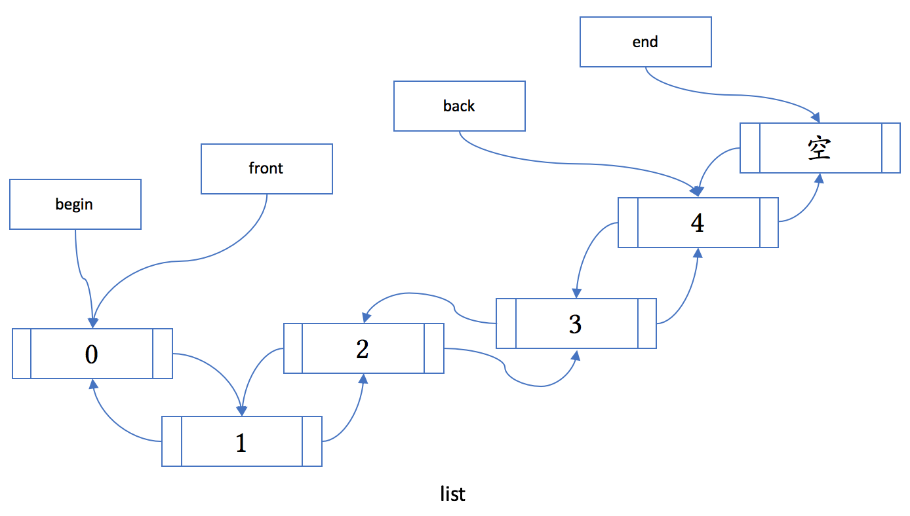

# C++ STL容器和算法

两个重要的函数对象

* less

  ```c++
  template <class T>
  struct less
    : binary_function<T, T, bool> {
    bool operator()(const T& x,
                    const T& y) const
    {
      return x < y;
    }
  };
  ```

  less 是一个函数对象，并且是个二元函数，执行对任意类型的值的比较，返回布尔类型。作为函数对象，它定义了函数调用运算符（operator()），并且缺省行为是对指定类型的对象进行 < 的比较操作。

  在需要大小比较的场合，C++ 通常默认会使用 less，包括若干容器和排序算法 sort。如果我们需要产生相反的顺序的话，则可以使用 greater，大于关系。

* hash

  计算哈希值的函数对象 hash目的是把一个某种类型的值转换成一个无符号整数哈希值，类型为 size_t。它没有一个可用的默认实现。对于常用的类型，系统提供了需要的特化

  ```c++
  template <class T> struct hash;
  
  template <>
  struct hash<int>
    : public unary_function<int, size_t> {
    size_t operator()(int v) const
      noexcept
    {
      return static_cast<size_t>(v);
    }
  };
  ```

  对于每个类，类的作者都可以提供 hash 的特化，使得对于不同的对象值，函数调用运算符都能得到尽可能均匀分布的不同数值。

## 顺序容器

标准库定义了三种顺序容器类型：

* vector：支持快速随机访问

* list：支持快速插入删除

* deque：双端队列

还提供了三种顺序容器适配器：

* stack：后进先出(LIFO)栈

* queue：先进先出(FIFO)队列

* priority_queue：有优先级管理的队列

> 适配器是使一事物的行为类似于另一事物的行为的一种机制。容器适配器让一种已存在的容器类型采用另一种不同的抽象类型的工作方式实现。例如，stack适配器可使任何一种顺序容器以栈的方式工作。
>
> 默认的stack和queue都基于deque容器实现，而priority_queue则在vector容器上实现。在创建适配器时，可通过将一个顺序容器指定为适配器的第二个类型实参，可覆盖其关联的基础容器类型。

### 迭代器

迭代器是一种检查容器内元素并遍历元素的数据类型。

标准库为每一种标准容器定义了一种迭代器类型，迭代器类型提供了比下标操作更通用化的方法。

> begin()返回的迭代器指向第一个元素
>
> end()返回的迭代器执行末端元素的下一个，通常称为**超出末端迭代器**，表明它执行一个不存在的元素。

每种容器还定义了一种名为const_iterator的类型，该类型只能用于读取容器内元素，而不能改变其值。

我们对普通iterator类型解引用时，得到对某个元素的非const引用。而如果对const_iterator类型解引用时，则可以得到一个指向const对象的引用。

```c++
for(vector<string>::const_iterator iter = text.begin(); iter != text.end(); ++iter){
    cout<<*iter<<endl;
}
```

### 容器元素的初始化

```c++
C<T> c; // 创建一个名为c的空容器。C是容器类型名，如vector，T是元素类型，如int或string，适用用所有容器
C<T> c(c2) // 创建容器c2的副本c；c和c2必须具有相同的容器类型，并存放相同类型的元素。适用于所有容器
C<T> c(b, e) // 创建c，其元素是迭代器b和e标示的范围内元素的副本，适用于所有容器
C<T> c(n, t) // 用n个值为t的元素创建容器c，其中值t必须是容器类型C的元素类型的值，或者是可转换为该类型的值 只适用于顺序容器
C<T> c(n) // 创建有n个值初始化元素的容器c  只适用于顺序容器
    
vector<int> ivec;
vector<int> ivec2(ivec); // 将一个容器复制给另一个容器时，类型必须匹配：容器类型和元素类型都必须相同

// 初始化为一段元素的副本
// 适用迭代器时，不要钱容器类型相同。容器内的元素类型也可以不相同，只有它们相互兼容，能够将要复制的元素转换为所构建的新容器的元素类型时，即可实现复制
list<string> slist(svec.begin(), svec.end());
vector<string>::iterator mid = svec.begin()+svec.size()/2;
deque<string> front(svec.begin(), mid); // 不包括mid
```

### 顺序容器的操作

* 容器定义的类型别名

| 别名                   | 说明                                             |
| ---------------------- | ------------------------------------------------ |
| size_type              | 无符号整型，足以存储此容器类型的最大可能容器长度 |
| iterator               | 此容器类型的迭代器类型                           |
| const_iterator         | 元素的只读迭代器类型                             |
| reverse_iterator       | 按逆序寻址元素的迭代器                           |
| const_reverse_iterator | 元素的只读逆序迭代器                             |
| difference_type        | 足够存储两个迭代器差值的有符号整型，可为负数     |
| value_type             | 元素类型                                         |
| reference              | 元素的左值类型，是value_type&的同义词            |
| const_reference        | 元素的常量左值类型，等效于const value_type&      |

* 添加元素

  ```c++
  c.push_back(t)  //在容器c的尾部添加值为t的元素
  c.push_front(t)  //在容器c的前端添加值为t的元素    只适用于list和deque容器类型
  c.insert(p, t) //在迭代器p所指向的元素前面插入值为t的新元素
  c.insert(p, n, t) //在迭代器p所指向的元素前面插入n个值为t的新元素
  c.insert(p, b, e) //在迭代器p所指向的元素前面插入由迭代器b和e标记的范围内的元素    
  ```

* 容器大小的操作

  ```c++
  c.size() // 返回容器c的元素个数，返回类型为c::size_type
  c.max_size() // 返回容器c可容纳的最多元素个数
  c.empty()  // 返回标记容器大小是否为0的布尔值
  c.resize(n) // 调整容器c的长度大小，使其能容纳n个元素 如果n<c.size()，则删除多出来的元素，否则添加采用值初始化的新元素
  c.resize(n, t) // 调整容器c的大小，使其能容纳n个元素。所有新添加的元素值都为t
  ```

* 访问元素

  ```c++
  c.back() // 返回容器c的最后一个元素的引用
  c.front() // 返回容器c的第一个元素的引用
  c[n]  // 返回下标为n的元素的引用 只适用于vector和deque容器
  c.at(n) // 返回下标为n的元素的引用 只适用于vector和deque容器  越界会抛出out_of_range异常
  ```

  必须是已存在的元素才能用下标操作符进行索引。通过下标操作进行赋值时，不会添加任何元素。

* 删除元素

  ```c++
  c.earse(p) // 删除迭代器p所指向的元素 返回一个迭代器，指向被删除元素后面的元素
  c.earse(b,e) // 删除迭代器b和e所标记的范围内所有的元素 返回一个迭代器，指向被删除元素段后面的元素
  c.clear() // 删除容器c内的所有元素
  c.pop_back() // 删除容器c内的最后一个元素
  c.pop_front() // 删除容器c内的第一个元素  只适用于list和deque容器
  
  ```

* 赋值与swap

  ```c++
  c1=c2 // 删除容器c1的所有元素，然后将c2的元素复制给c1，c1和c2的类型(包括容器类型和元素类型)必须相同
  c1.swap(c2) // 交换内容：调用完该函数后，c1中存放的是c2原来的元素，c2中存放的则是c1原来的元素。c1和c2的类型必须相同。该函数的执行速度通常要比将c2中的元素复制到c1的操作快
  c.assign(b,e) // 重新设置c的元素：将迭代器b和e标记的范围内所有的元素复制到c中。b和e必须不是指向c中元素的迭代器
  c.assign(n,t) // 将容器重新设置为存储n个值为t的元素
  ```
  
  swap()操作不会删除或插入任何元素，而且保证在常量时间内实现交换。由于容器内没有移动任何元素，因此迭代器不会失效。

### string

string 是模板 basic_string 对于 char 类型的特化，可以认为是一个只存放字符 char 类型数据的容器。“真正”的容器类与 string 的最大不同点是里面可以存放任意类型的对象。

string 当然是为了存放字符串。和简单的 C 字符串不同：

* string 负责自动维护字符串的生命周期
* string 支持字符串的拼接操作（ + 和 +=）
* string 支持字符串的查找操作（如 find 和 rfind）
* string 支持从 istream 安全地读入字符串（使用 getline）
* string 支持给期待 const char* 的接口传递字符串内容（使用 c_str）
* string 支持到数字的互转（stoi 系列函数和 to_string）

### array

C 数组的替代品。C 数组在 C++ 里继续存在，主要是为了保留和 C 的向后兼容性。C 数组本身和 C++ 的容器相差是非常大的：

* C 数组没有 begin 和 end 成员函数（虽然可以使用全局的 begin 和 end 函数）

* C 数组没有 size 成员函数（得用一些模板技巧来获取其长度）

* C 数组作为参数有退化行为，传递给另外一个函数后那个函数不再能获得 C 数组的长度和结束位置

* 此外，C 数组也没有良好的复制行为。你无法用 C 数组作为 map 或 unordered_map 的键类型。下面的代码演示了失败行为：

  ```c++
  #include <map>  // std::map
  
  typedef char mykey_t[8];
  
  int main()
  {
    std::map<mykey_t, int> mp;
    mykey_t mykey{"hello"};
    mp[mykey] = 5;
    // 轰，大段的编译错误
  }
  ```

如果不用 C 数组的话，我们该用什么来替代呢？我们有三个可以考虑的选项：

* 如果数组较大的话，应该考虑 vector。vector 有最大的灵活性和不错的性能。

* 对于字符串数组，当然应该考虑 string。

* 如果数组大小固定（C 的数组在 C++ 里本来就是大小固定的）并且较小的话，应该考虑 array。array 保留了 C 数组在栈上分配的特点，同时，提供了 begin、end、size 等通用成员函数。

array 可以避免 C 数组的种种怪异行径。上面的失败代码，如果使用 array 的话，稍作改动就可以通过编译：

```c++
#include <array>     // std::array
#include <iostream>  // std::cout/endl
#include <map>       // std::map
#include "output_container.h"

typedef std::array<char, 8> mykey_t;

int main()
{
  std::map<mykey_t, int> mp;
  mykey_t mykey{"hello"};
  mp[mykey] = 5;  // OK
  std::cout << mp << std::endl;
}
```


### vector

动态数组，相当于Java的ArrayList和Python的list。vector的成员在内存里连续存放。


#include <vector>

* data()获得指向其内容的裸指针。
* capacity 来获得当前分配的存储空间的大小，以元素数量计
* reserve 来改变所需的存储空间的大小，成功后 capacity() 会改变
* resize 来改变其大小，成功后 size() 会改变
* pop_back 来删除最后一个元素
* push_back 在尾部插入一个元素
*  insert 在指定位置前插入一个元素
* erase 在指定位置删除一个元素 
* emplace 在指定位置构造一个元素
* emplace_back 在尾部新构造一个元素

* 初始化

  如果没有指定元素的初始化式，那么标准库将自行提供一个元素初始值进行值初始化。如果vector保存内置类型(如int类型)，那么标准库将用0值创建元素初始化式。如果vector保存的含有构造函数的类类型(如string)的元素，那么标准库将用该类型的默认构造函数创建元素初始化式。

* 自增长

  每当vector容器不得不分配新的存储空间时，以加倍当前容量的分配策略实现重新分配。

  ```c++
  v.capacity() // 获取在容器需要分配更多的存储空间之前能够存储的元素个数
  v.reserve(n) // 告诉vector容器应该预留多少个元素的存储空间
  ```

  capacity(容量)和size(长度)的区别：size指容器当前拥有的元素个数，而capacity则指容器必须分配新存储空间之前可以存储的元素总数。
  
  > 当 push_back、insert、reserve、resize 等函数导致内存重分配时，或当 insert、erase 导致元素位置移动时，vector 会试图把元素“移动”到新的内存区域。vector 通常保证强异常安全性，如果元素类型没有提供一个**保证不抛异常的移动构造函数**，vector 通常会使用拷贝构造函数。因此，对于拷贝代价较高的自定义元素类型，我们应当定义移动构造函数，并标其为 noexcept，或只在容器中放置对象的智能指针。
  >
  > C++11 开始提供的 emplace… 系列函数是为了提升容器的性能而设计的。
  >
  > 你可以试试把 v1.emplace_back() 改成 v1.push_back(Obj1())。对于 vector 里的内容，结果是一样的；但使用 push_back 会额外生成临时对象，多一次（移动或拷贝）构造和析构。如果是移动的情况，那会有小幅性能损失；如果对象没有实现移动的话，那性能差异就可能比较大了。
  >
  > 
  >
  > vector 的一个主要缺陷是大小增长时导致的元素移动。如果可能，尽早使用 reserve 函数为 vector 保留所需的内存，这在 vector 预期会增长很大时能带来很大的性能提升。
  
  

### deque

double-ended queue，双端队列。

它主要是用来满足下面这个需求：容器不仅可以从尾部自由地添加和删除元素，也可以从头部自由地添加和删除。


deque 的接口和 vector 相比，有如下的区别：

* deque 提供 push_front、emplace_front 和 pop_front 成员函数。
* deque 不提供 data、capacity 和 reserve 成员函数。(容器里的元素只是部分连续的，因而没法提供 data 成员函数)

由于元素的存储大部分仍然连续，它的遍历性能是比较高的。

由于每一段存储大小相等，deque 支持使用下标访问容器元素，大致相当于 index\[i / chunk_size][i % chunk_size]，也保持高效。

### list

双向链表



和 vector 相比，它优化了在容器中间的插入和删除：

* list 提供高效的、O(1) 复杂度的任意位置的插入和删除操作。
* list 不提供使用下标访问其元素。
* list 提供 push_front、emplace_front 和 pop_front 成员函数（和 deque 相同）。
* list 不提供 data、capacity 和 reserve 成员函数（和 deque 相同）。

另外一个需要注意的地方是，因为某些标准算法在 list 上会导致问题，list 提供了成员函数作为替代，包括下面几个：merge、remove、remove_if、reverse、sort、unique

```c++
sort(vec.begin(), vec.end());     // 正常
// sort(lst.begin(), lst.end());  // 会出错
lst.sort();                       // 正常
```

### forward_list

从 C++11 开始，前向列表 forward_list 成了标准的一部分。


大部分 C++ 容器都支持 insert 成员函数，语义是从指定的位置之前插入一个元素。对于 forward_list，这不是一件容易做到的事情。标准库提供了一个 insert_after 作为替代。此外，它跟 list 相比还缺了下面这些成员函数：back、size、push_back、emplace_back、pop_back。

为什么会需要这么一个阉割版的 list 呢？原因是，在元素大小较小的情况下，forward_list 能节约的内存是非常可观的；在列表不长的情况下，不能反向查找也不是个大问题。提高内存利用率，往往就能提高程序性能，更不用说在内存可能不足时的情况了。

### stack

#include <stack>

栈容器适配器支持的操作

| 函数         | 说明                                  |
| ------------ | ------------------------------------- |
| s.empty()    | 如果栈为空，则返回true，否则返回false |
| s.size()     | 返回栈中元素的个数                    |
| s.pop()      | 删除栈顶元素，但不返回其值            |
| s.top()      | 返回栈顶元素的值，但不删除该元素      |
| s.push(item) | 往栈顶压入新元素                      |


### queue和priority_queue

进入队列的对象被放置在尾部，下一个被取出的元素则取自队列的首部。标准库提供了两种风格的队列：FIFO队列以及优先级队列。

priority_queue允许用户为队列中存储的元素设置优先级。这种队列不是直接将新元素放置在队列尾部，而是放在比它优先级低的元素前面。

> 优先队列是一种容器适配器，采用了堆这样的数据结构，保证了第一个元素总是整个优先队列中最大的(或最小的)元素。
>
> 优先队列默认使用vector作为底层存储数据的容器，在vector上使用了堆算法将vector中的元素构造成堆的结构，所以其实我们就可以把它当作堆，凡是需要用堆的位置，都可以考虑优先队列。

#include <queue>

队列和优先级队列支持的操作

| 函数         | 说明                                                         |
| ------------ | ------------------------------------------------------------ |
| q.empty()    | 如果队列为空，则返回true，否则返回false                      |
| q.size()     | 返回队列中元素的个数                                         |
| q.pop()      | 删除队首元素，但不返回其值                                   |
| q.front()    | 返回队首元素的值，但不删除该元素。 该操作只适用于队列        |
| q.back()     | 返回队尾元素的值，但不删除该元素。 该操作只适用于队列        |
| q.top()      | 返回具有最高优先级的元素值，但不删除该元素。  该操作只适用于优先级队列 |
| q.push(item) | 对于queue，在队尾压入一个新元素。对于priority_queue，在基于优先级的适当位置插入新元素 |

priority_queue类模板参数

```c++
template <class T, class Container = vector<T>,class Compare = less<typename Container::value_type> >
class priority_queue;
```

class T：T是优先队列中存储的元素的类型。

class Container = vector<T>：Container是优先队列底层使用的存储结构，可以看出来，默认采用vector。
class Compare = less<typename Container::value_type> ：Compare是定义优先队列中元素的比较方式的类。

Compare后面跟着的less<typename Container::value_type>就是默认的比较类，默认是按小于(less)的方式比较，这种比较方式创建出来的就是大堆。所以优先队列默认就是大堆。

> **less**类的内部函数。参数列表中有左右两个参数，左边小于右边的时候返回true，此时优先队列就是大堆。
>
> ```c++
> template <class T> 
>         struct less : binary_function <T,T,bool> {
>           bool operator() (const T& x, const T& y) const {return x<y;}
> };
> ```
>
> **greater**类的内部函数，参数列表中有左右两个参数，左边大于右边的时候返回true，此时优先队列就是小堆。
>
> ```c++
> template <class T> 
>         struct greater : binary_function <T,T,bool> {
>           bool operator() (const T& x, const T& y) const {return x>y;}
> }; 
> ```
>
> 注意：less类和greater类只能比较内置类型的数据的大小，如果用户需要比较自定义类型的数据，就需要自己定义一个比较类，并且重载()。
>
> 同时less类和greater类也具有模板参数，因为他们也是模板，所以我们如果要存储自定义类型的元素，就要将自定义类型作为模板参数传递给less类和greater类。

如果需要创建小堆，就需要将less改为greater。


priority_queue构造函数：

```c++
priority_queue (const Compare& comp = Compare(), const Container& ctnr = Container());
```

构造函数中有两个参数，都具有默认值。这两个参数分别是**Compare**类和**Container**类的对象。

**构造函数默认将vector的对象传入构造函数作为底层结构，将less的对象传入构造函数按小于的方式比较构造大堆。**


#### 示例代码

priority_queue存储自定义类型元素

```c++
//Date是日期类
priority_queue<Date, vector<Date>, less<Date>> q1;

#include "iostream"
#include "queue"
using namespace std;
 
class Date {
private:
	int year;
	int month;
	int day;
public:
	//构造函数
	Date(int _year, int _month, int _day)
		:year(_year)
		, month(_month)
		, day(_day)
	{}
	//重载< 
	//当this指向的对象小于d对象返回true
	bool operator<(const Date& d) const {
		if ((year < d.year) || (year == d.year && month < d.month) ||
			(year == d.year && month == d.month && day < d.day)) {
			return true;
		}
		else {
			return false;
		}
	}
	//重载>
	//当this指向的对象大于d对象返回true
	bool operator>(const Date& d) const {
		if ((year > d.year) || (year == d.year && month > d.month) ||
			(year == d.year && month == d.month && day > d.day)) {
			return true;
		}
		else {
			return false;
		}
	}
};
 
 
int main() {
	Date d1(2021, 12, 12);
	Date d2(2020, 12, 12);
	Date d3(2022, 1, 1);
 
	priority_queue<Date, vector<Date>, less<Date>> q1;
	q1.push(d1);
	q1.push(d2);
	q1.push(d3);
 
	priority_queue<Date, vector<Date>, greater<Date>> q2;
	q2.push(d1);
	q2.push(d2);
	q2.push(d3);
}
```


## 关联容器

### pair类型

pair包含两个数据值。在创建pair对象时，必须提供两个类型名：pair对象所包含的两个数据成员各自对应的类型名字

pair类型提供的操作

| 操作                     | 说明                                                         |
| ------------------------ | ------------------------------------------------------------ |
| pair<T1, T2> p1;         | 创建一个空的pair对象，它的两个元素分别是T1和T2类型           |
| pair<T1, T2> p1(v1, v2); | 创建一个pair对象，它的两个元素分别是T1和T2类型，其中first成员初始化为v1，second成员初始化为v2 |
| make_pair(v1, v2);       | 以v1和v2值创建一个新的pair对象，其元素类型分别是v1和v2的类型 |
| p1 < p2                  | 两个pair对象之间的小于运算                                   |
| p1 == p2                 | 相等                                                         |
| p.first                  | 返回p中名为first的(公有)数据成员                             |
| p.second                 | 返回p中名为second的(公有)数据成员                            |


关联容器有 set（集合）、map（映射）、multiset（多重集）和 multimap（多重映射）。

关联容器支持通过键来高效地查找和读取元素。map的元素以键-值(key-value)对的形式组织：键用作元素在map中的索引，而值则表示所存储和读取的数据。set则包含一个键值，并有效地支持关于某个键是否存在的查询。

关联容器是一种有序的容器。名字带“multi”的允许键重复，不带的不允许键重复。set 和 multiset 只能用来存放键，而 map 和 multimap 则存放一个个键值对。

与序列容器相比，关联容器没有前、后的概念及相关的成员函数，但同样提供 insert、emplace 等成员函数。此外，关联容器都有 find、lower_bound、upper_bound 等查找函数，结果是一个迭代器：

* find(k) 可以找到任何一个等价于查找键 k 的元素（!(x < k || k < x)）
* lower_bound(k) 找到第一个不小于查找键 k 的元素（!(x < k)）
* upper_bound(k) 找到第一个大于查找键 k 的元素（k < x）


一般来说，如果希望有效地存储不同值的集合，那么使用set容器比较合适，而map容器则更适用于需要存储(乃至修改)每个键所关联的值的情况。

### 严格弱排序

如果在声明关联容器时没有提供比较类型的参数，缺省使用 less 来进行排序。如果键的类型提供了比较算符 < 的重载，我们不需要做任何额外的工作。否则，我们就需要对键类型进行 less 的特化，或者提供一个其他的函数对象类型。对于自定义类型，推荐尽量使用标准的 less 实现，通过重载 <（及其他标准比较运算符）对该类型的对象进行排序。存储在关联容器中的键一般应满足严格弱序关系（strict weak ordering；即：

* 对于任何该类型的对象 x：!(x < x)（非自反）
* 对于任何该类型的对象 x 和 y：如果 x < y，则 !(y < x)（非对称）
* 对于任何该类型的对象 x、y 和 z：如果 x < y 并且 y < z，则 x < z（传递性）
* 对于任何该类型的对象 x、y 和 z：如果 x 和 y 不可比（!(x < y) 并且 !(y < x)）并且 y 和 z 不可比，则 x 和 z 不可比（不可比的传递性）

### map

#include <map>

map对象的元素是键-值对。map的value_type是存储元素的键以及值的pair类型，而且键为const。

map迭代器进行解引用将产生pair类型的对象

map容器额外定义了两种类型：key_type和mapped_type，以获得键或值的类型。

> 使用下标访问map与使用下标访问数组或vector的行为截然不同：用下标访问不存在的元素将导致在map容器中添加一个新的元素，它的键即为该下标值。

* insert

  ```c++
  m.insert(e); // e是一个用在m上的value_type类型的值。如果键(e.first)不在m中，则插入一个值为e.second的新元素；如果该键在m中已存在，则保持m不变。该函数返回一个pair类型对象，包含指向键为e.first的元素的map迭代器，以及一个bool类型的对象，表示是否插入了该元素
  m.insert(beg, end); //beg和end是标记元素范围的迭代器。返回void类型
  m.insert(iter, e); // 如果键(e.first)不在m中，则创建新元素，并以迭代器iter为起点搜索新元素存储的位置。返回一个迭代器，指向m中具有给定键的元素
  ```

  使用insert可避免使用下标操作符所带来的副作用：不必要的初始化

  检测insert的返回值：

  map对象中一个给定键只对应一个元素。如果试图插入的元素所对应的键已在容器中，则inset将不做任何操作。含有一个或一对迭代器形参的insert函数版本并不说明是否有或有多少个元素插入到容器中。但是，带有一个键-值pair形参的insert版本将返回一个值：包含一个迭代器和一个bool值的pair对象。其中迭代器指向map中具有相应键的元素，而bool值则表示是否插入了该元素。

  ```c++
  // 单词统计程序
  map<string, int> word_count;
  string word;
  while(cin>>word){
      // 对于每个单词，都尝试insert它，并将它的值赋为1。
      pair<map<string, int>::iterator, bool> ret = word_count.insert(make_pair(word, 1));
      // if语句检测insert函数返回值的bool值。如果该值为false，则表示没有做插入操作，按word索引的元素已在word_count中存在，此时，将该元素所关联的值加1。
      if(!ret.second){
          ++ret.first->second;
      }
  }
  ```

* 查找

  m.count(k); //返回m中k的出现次数

  m.find(k); // 如果m容器中存在按k索引的元素，则返回指向该元素的迭代器，如果不存在，则返回超出末端迭代器
  
* 删除

  m.erase(k); // 删除m中键为k的元素。返回size_type类型的值，表示删除的元素个数

  m.erase(p); // 从m中删除迭代器p所指向的元素。返回void类型。

  m.erase(b, e); // 从m中删除一段范围内的元素，该范围由迭代器对 b 和 e 标记。

### set

#include <set>

set容器只是单纯的键的集合。

set容器不支持下标操作符。

* 添加元素

  ```c++
  set<string> set1;
  set1.insert("the");
  set1.insert("and");
  ```

  与map容器一样，带有一个键参数的insert版本返回pair类型对象，包含一个迭代器和一个bool值，迭代器指向拥有该键的元素，而bool值表明是否添加了元素。使用迭代器的insert版本返回void类型。

* 获取元素

  set容器不提供下标操作符。为了通过键从set中获取元素，可使用find。如果只需简单地判断某个元素是否存在，同样可以使用count。

### multimap

multimap和multiset允许一个键对应多个实例

```c++
multimap<string, int> mmp{
  {"one", 1},
  {"two", 2},
  {"three", 3},
  {"four", 4}
};

mmp.insert({"four", -4});
```


m.lower_bound(k); // 返回一个迭代器，指向键不小于k的第一个元素

m.upper_bound(k); // 返回一个迭代器，指向键大于k的第一个元素

m.equal_range(k); // 返回一个迭代器的pair对象，它的first成员等价于m.lower_bound(k)，而second成员等价于m.upper_bound(k)。

如果你需要在 multimap 里精确查找满足某个键的区间的话，建议使用 equal_range，可以一次性取得上下界（半开半闭）。

```c++
#include <tuple>
multimap<string, int>::iterator lower, upper;
std::tie(lower, upper) = mmp.equal_range("four");
```


### multiset


## 无序关联容器

从 C++11 开始，每一个关联容器都有一个对应的无序关联容器，它们是：unordered_set、unordered_map、unordered_multiset、unordered_multimap。

这些容器和关联容器非常相似，主要的区别就在于它们是“无序”的。这些容器不要求提供一个排序的函数对象，而要求一个可以计算哈希值的函数对象。你当然可以在声明容器对象时手动提供这样一个函数对象类型，但更常见的情况是，我们使用标准的 hash 函数对象及其特化。

```c++
#include <complex>        // std::complex
#include <iostream>       // std::cout/endl
#include <unordered_map>  // std::unordered_map
#include <unordered_set>  // std::unordered_set
#include "output_container.h"

using namespace std;

namespace std {

template <typename T>
struct hash<complex<T>> {
  size_t
  operator()(const complex<T>& v) const
    noexcept
  {
    hash<T> h;
    return h(v.real()) + h(v.imag());
  }
};

}  // namespace std

int main()
{
  unordered_set<int> s{
    1, 1, 2, 3, 5, 8, 13, 21
  };
  cout << s << endl;

  unordered_map<complex<double>,
                double>
    umc{{{1.0, 1.0}, 1.4142},
        {{3.0, 4.0}, 5.0}};
  cout << umc << endl;
}
```

请注意我们在 std 名空间中添加了特化，这是少数用户可以向 std 名空间添加内容的情况之一。正常情况下，向 std 名空间添加声明或定义是禁止的，属于未定义行为。

从实际的工程角度，无序关联容器的主要优点在于其性能。关联容器和 priority_queue 的插入和删除操作，以及关联容器的查找操作，其复杂度都是 O(log(n))，而无序关联容器的实现使用哈希表，可以达到平均 O(1)！但这取决于我们是否使用了一个好的哈希函数：在哈希函数选择不当的情况下，无序关联容器的插入、删除、查找性能可能成为最差情况的 O(n)，那就比关联容器糟糕得多了。
