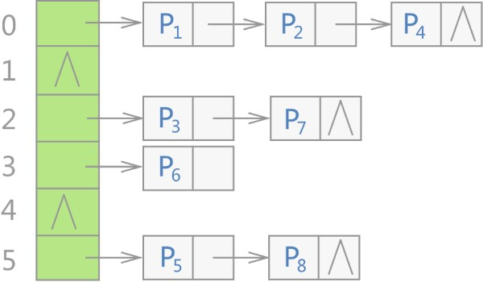

# C++ STL无序容器底层实现原理

在了解哈希表存储结构的基础上，本节将具体分析 C++ STL 无序容器（哈希容器）底层的实现原理。

C++ STL 标准库中，不仅是 unordered_map 容器，所有无序容器的底层实现都采用的是哈希表存储结构。更准确地说，是用“链地址法”（又称“开链法”）解决数据存储位置发生冲突的哈希表，整个存储结构如图1所示：



> 其中，Pi 表示存储的各个键值对。

可以看到，当使用无序容器存储键值对时，会先申请一整块连续的存储空间，但此空间并不用来直接存储键值对，而是存储各个链表的头指针，各键值对真正的存储位置是各个链表的节点。

> 注意，STL 标准库通常选用 vector 容器存储各个链表的头指针。

不仅如此，在 C++ STL 标准库中，将图 1 中的各个链表称为桶（bucket），每个桶都有自己的编号（从 0 开始）。当有新键值对存储到无序容器中时，整个存储过程分为如下几步：

1. 将该键值对中键的值带入设计好的哈希函数，会得到一个哈希值（一个整数，用 H 表示）；
2. 将 H 和无序容器拥有桶的数量 n 做整除运算（即 H % n），该结果即表示应将此键值对存储到的桶的编号；
3. 建立一个新节点存储此键值对，同时将该节点链接到相应编号的桶上。


另外值得一提的是，哈希表存储结构还有一个重要的属性，称为负载因子（load factor）。该属性同样适用于无序容器，用于衡量容器存储键值对的空/满程序，即负载因子越大，意味着容器越满，即各链表中挂载着越多的键值对，这无疑会降低容器查找目标键值对的效率；反之，负载因子越小，容器肯定越空，但并不一定各个链表中挂载的键值对就越少。

举个例子，如果设计的哈希函数不合理，使得各个键值对的键带入该函数得到的哈希值始终相同（所有键值对始终存储在同一链表上）。这种情况下，即便增加桶数是的负载因子减小，该容器的查找效率依旧很差。

无序容器中，负载因子的计算方法为：

负载因子 = 容器存储的总键值对 / 桶数

默认情况下，无序容器的最大负载因子为 1.0。如果操作无序容器过程中，使得最大复杂因子超过了默认值，则容器会自动增加桶数，并重新进行哈希，以此来减小负载因子的值。需要注意的是，此过程会导致容器迭代器失效，但指向单个键值对的引用或者指针仍然有效。

> 这也就解释了，为什么我们在操作无序容器过程中，键值对的存储顺序有时会“莫名”的发生变动。


C++ STL 标准库为了方便用户更好地管控无序容器底层使用的哈希表存储结构，各个无序容器的模板类中都提供表 2 所示的成员方法。

| 成员方法           | 功能                                                         |
| ------------------ | ------------------------------------------------------------ |
| bucket_count()     | 返回当前容器底层存储键值对时，使用桶的数量。                 |
| max_bucket_count() | 返回当前系统中，unordered_map 容器底层最多可以使用多少个桶。 |
| bucket_size(n)     | 返回第 n 个桶中存储键值对的数量。                            |
| bucket(key)        | 返回以 key 为键的键值对所在桶的编号。                        |
| load_factor()      | 返回 unordered_map 容器中当前的负载因子。                    |
| max_load_factor()  | 返回或者设置当前 unordered_map 容器的最大负载因子。          |
| rehash(n)          | 尝试重新调整桶的数量为等于或大于 n 的值。如果 n 大于当前容器使用的桶数，则该方法会是容器重新哈希，该容器新的桶数将等于或大于 n。反之，如果 n 的值小于当前容器使用的桶数，则调用此方法可能没有任何作用。 |
| reserve(n)         | 将容器使用的桶数（bucket_count() 方法的返回值）设置为最适合存储 n 个元素的桶数。 |
| hash_function()    | 返回当前容器使用的哈希函数对象。                             |


下面的程序以学过的 unordered_map 容器为例，演示了表 2 中部分成员方法的用法：

```c++
#include <iostream>
#include <string>
#include <unordered_map>
using namespace std;
int main()
{
    //创建空 umap 容器
    unordered_map<string, string> umap;
   
    cout << "umap 初始桶数: " << umap.bucket_count() << endl;
    cout << "umap 初始负载因子: " << umap.load_factor() << endl;
    cout << "umap 最大负载因子: " << umap.max_load_factor() << endl;

    //设置 umap 使用最适合存储 9 个键值对的桶数
    umap.reserve(9);
    cout << "*********************" << endl;
    cout << "umap 新桶数: " << umap.bucket_count() << endl;
    cout << "umap 新负载因子: " << umap.load_factor() << endl;
    //向 umap 容器添加 3 个键值对
    umap["Python教程"] = "http://c.biancheng.net/python/";
    umap["Java教程"] = "http://c.biancheng.net/java/";
    umap["Linux教程"] = "http://c.biancheng.net/linux/";
    //调用 bucket() 获取指定键值对位于桶的编号
    cout << "以\"Python教程\"为键的键值对，位于桶的编号为:" << umap.bucket("Python教程") << endl;
    //自行计算某键值对位于哪个桶
    auto fn = umap.hash_function();
    cout << "计算以\"Python教程\"为键的键值对，位于桶的编号为：" << fn("Python教程") % (umap.bucket_count()) << endl;
    return 0;
}
```

程序执行结果为：

```c++
umap 初始桶数: 8
umap 初始负载因子: 0
umap 最大负载因子: 1
*********************
umap 新桶数: 16
umap 新负载因子: 0
以"Python教程"为键的键值对，位于桶的编号为:9
计算以"Python教程"为键的键值对，位于桶的编号为：9
```

从输出结果可以看出，对于空的 umap 容器，初始状态下会分配 8 个桶，并且默认最大负载因子为 1.0，但由于其未存储任何键值对，因此负载因子值为 0。

与此同时，程序中调用 reverse() 成员方法，使 umap 容器的桶数改为了 16，其最适合存储 9 个键值对。从侧面可以看出，一旦负载因子大于 1.0（9/8 > 1.0），则容器所使用的桶数就会翻倍式（8、16、32、...）的增加。

程序最后还演示了如何手动计算出指定键值对存储的桶的编号，其计算结果和使用 bucket() 成员方法得到的结果是一致的。