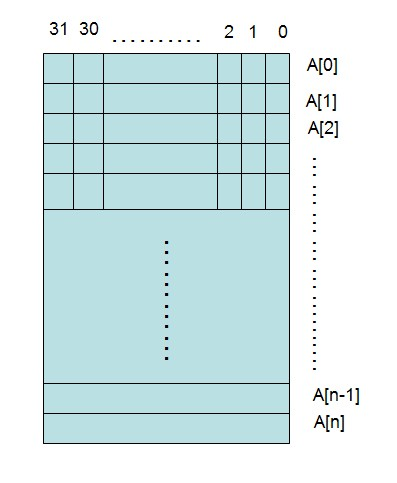

# 位图法排序

## 问题描述

输入：一个最多包含n个正整数的文件，每个数都小于n，其中n=10000000。如果在输入文件中有任何正数重复出现就是致命错误。没有其他数据与该正数相关联。
输出：按升序排列的输入正数的列表。
约束：最多有1MB的内存空间可用，有充足的磁盘存储空间可用。运行时间最多几分钟，运行时间为10秒就不需要进一步优化。

## 程序设计与实现概要

应用位图或位向量表示集合。可用一个10位长的字符串来表示一个所有元素都小于10的简单的非负整数集合，例如，可以用如下字符串表示集合{1,2,3,5,8}:

0  1  1  1  0  1  0  0  1  0  0

代表集合中数值的位都置为1，其他所有的位置为0。编程珠玑当中建议是一个具有1000万个位的字符串来表示这个文件，那么这个文件的所占容量为10000000 bit=107bit，不到1MB的大小，其中，当且仅当整数 `i` 在文件中存在，第`i`位为1，这个表示利用了该问题的三个在排序问题中不常见的属性：输入数据限制在相对较小的范围内；数据没有重复；而且对于每条记录而言，除了单一个整数外没有其他关联数据。

如给定表示文件中整数集合的位图数据结构，则可以分三个阶段来编写程序
第一阶段：将所有的位都置为0，从而将集合初始化为空。
第二阶段：通过读入文件中的每个整数来建立集合，将每个对应的位置都置为1。
第三阶段：检验每一位，如果该为为1，就输出对应的整数，由此产生有序的输出文件。

下面的C语言的实现和C++的实现代码

c语言：

所申请的int数组如图所示：

字节位置=数据/32;(采用位运算即右移5位)
位位置=数据%32;(采用位运算即跟0X1F进行与操作)。

[bitset.c](./bitset.c)

C++(使用bitset)

[bitset.cpp](./bitset.cpp)

## 扩展

给40亿个不重复的unsigned int的整数，没有排过序，然后再给一个数，如果快速判断这个数是否在那40亿个数当中。（腾讯面试题)

用位图法：40亿unsigned int，则用位图表示的话需要大小为40亿个bit=4*10^9 bit=0.5*10^9 bytes 因此申请的内存只需要大小约为512MB左右，这样在内存每个bit代表一个unsigned int整数，并将每个bit初始化为0，然后将40亿个unsigned int的整数读入，每个unsigned int的整数对应bit设置为1，读入后，最后看所给定的数对应的bit是否为1，是1存在，否则不存在。