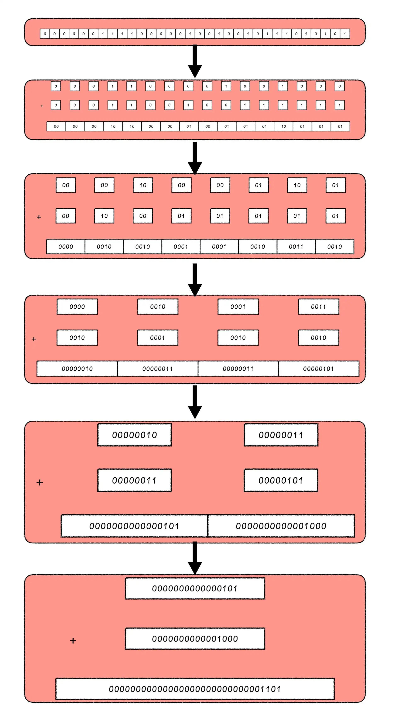
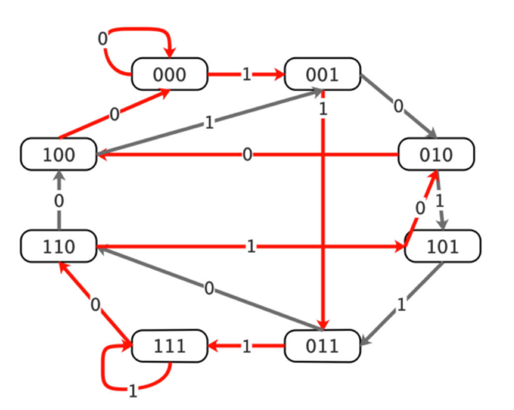
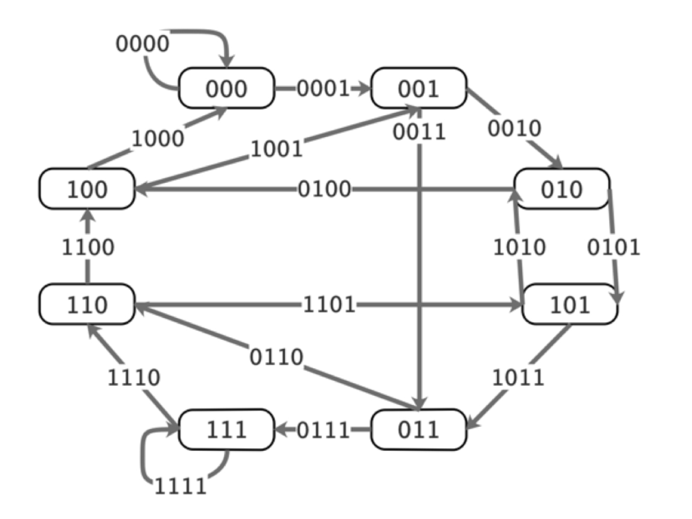

# 位运算

程序中的所有数在计算机内存中都是以二进制的形式储存的。位运算就是直接对整数在内存中的二进制位进行操作。

由于位运算直接对内存数据进行操作，不需要转成十进制，因此处理速度非常快。

## 位运算符

| 符号 | 描述 | 运算规则                                                     |
| ---- | ---- | ------------------------------------------------------------ |
| &    | 与   | 两个位都为1时，结果才为1                                     |
| \|   | 或   | 两个位都为0时，结果才为0                                     |
| ^    | 异或 | 两个位相同为0，相异为1                                       |
| ~    | 取反 | 按位取反，0变1，1变0                                         |
| <<   | 左移 | 各二进制位全部左移若干位，高位丢弃，低位补0                  |
| >>   | 右移 | 各二进制位全部右移若干位，对无符号数，高位补0。有符号位，各编译器处理方法不一样，有的补符号位（算术右移），有的补0（逻辑右移） |

与（&）操作可以看作是取位操作，例如："x & (1 << n)"就是取出整数x的第n位。

或（|）操作可以看作是赋值操作，例如："x | (1 << n)"就是将x的第n位赋值为1。

XOR-异或

> 异或：相同为0，不同为1。也可用“不进位加法”来理解。

异或操作可以看作是统计位的奇偶性，如果这个位出现了奇数个1则为1，出现了偶数个1则为0。

异或操作的一些特点：

```
x ^ 0 = x
x ^ 1s = ~x //  1s = ~0 全部二进制都是1
x ^ (~x) = 1s
x ^ x = 0 // interesting and important!
a ^ b = c => a ^ c = b, b ^ c = a // swap
a ^ b ^ c = a ^ (b ^ c) = (a ^ b) ^ c // associative
```

## 编程常用的位运算操作

* X & 1 == 1 OR == 0  => 判断奇偶性(X % 2 == 1)
* X = X & (X -1)  =>  清0最低位的1
* X & -X => 得到最低位的1

```c++
int lowbit(int x) {
  // 计算 x 的二进制中，最低位的 1 以及后面所有 0 组成的数。
  // lowbit(0b01011000) == 0b00001000
  //          ~~~~^~~~
  // lowbit(0b01110010) == 0b00000010
  //          ~~~~~~^~
  return x & -x;  // lowbit另一种写法 x&(x^(x-1))
}

```


### 更为复杂的位运算操作

1.  将 `x` 最右边的 `n` 位清0： `x & (~0 << n)`
2.  获取 `x` 的第 `n` 位值(0或者1)：`(x >> n) & 1`
3.  获取 `x` 的第 `n` 位的幂值： `x & (1 << (n - 1))`
4.  仅将第 `n` 位置为 `1`：`x | (1 << n)`
5.  仅将第 `n` 位置为 `0`：`x & (~(1 << n))`
6.  将 `x` 最高位至第 `n` 位(含)清0：`x & ((1 << n) - 1)`
7.  将第 `n` 位至第0位(含)清0： `x & (~((1 << (n + 1)) - 1))`

## C++ \_\_builtin_系列函数

在用到位运算的时候用这些函数会更加快捷


__builtin_ffs(x); // 返回 x 的最后一位 1 是从后向前第几位

```c++
__builtin_ffs(0100) == 3;
```

__builtin_clz(x); // 返回 x 的二进制下前导的 0 的个数(一共有32位)

```c++
__builtin_clz(0100) == 29;
```

__builtin_ctz(x); // 返回 x的二进制下末尾的 0 的个数

```c++
__builtin_ctz(0100) == 2;
```

__builtin_popcount(x); // 返回 x 的二进制下 1 的个数

```c++
__builtin_popcount(0100) == 1;
```

__builtin_parity(x); // 返回 x 的二进制下 1 的个数的奇偶性(奇数为1，偶数为0)

```c++
__builtin_parity(0100) == 1;
```

## 位运算的应用技巧

在解决实际问题的时候，我们经常会使用 2 种位运算技巧，分别是按位统计法和分组统计法。

### 1.按位统计法

如果要在所有的 4 位素数中，找到数字组成是一样的素数（素数是指在大于 1 的自然数中，除了 1 和它本身以外不再有其他因数的自然数）。比如说，9937 和 9973，它们两个都是由 2 个 9、1 个 7、1 个 3 组成，所以它们两个的数字组成就是一样的。

首先利用素数筛找到所有的4位素数。找到所有的 4 位素数之后，我们就要去统计计算每个素数的组合。最简单的办法就是，我们给每一个 4 位数开一个长度为 10 的数组，记录其中 0 到 9 出现的次数。计算完之后，我们再判断一下这些统计数组中是否有完全相同的就可以了。

有没有更好的解决方法呢？首先，我们可以想一想，在 4 位的素数中，每一个数字至多出现几次呢？你首先想到的可能是 4 次，但这并不可能。因为如果一个四位数每一位都是一样的，那它一定可以被 11 整除，也就是说它不会是一个素数。所以，4 位素数中，每一个数字出现的次数最多是 3 次。因此，在一个 4 位素数中，每个数字只会有 4 种状态，那就是出现 0 次、1 次、2 次和 3 次，这 4 种状态我们用两个 bit 就能够存储起来了。

所以，我们可以分别用两个 bit 来存储每个数字的状态。因为一共有 10 个数字，那我们用 20bit 就可以将它们都存储下来。这么一看，刚好一个整数（32 bit）就可以把这 10 个数字的状态存储下来了。统计一个数 x 的具体操作如下：

```c++
int count = 0;
while (x > 0) {
    count += 1 << (x % 10 * 2);
    x /= 10;
}
```

最后，我们用哈希表存储下每个统计结果对应的数，就可以得到组成一样的 4 位素数了。这种方法就叫做按位统计法。简单来说，就是分别统计所有可能出现的数的状态。

### 2.分组统计法

已知一个序列中，其他数出现了偶数次，只有一个数出现了奇数次，你能求出出现奇数次的那个数吗？

```typescript
int x = 0;
for (int i = 0; i < n; i++) {
    x ^= a[i];
}
```

一道和它类似的题目：在一个序列中，其他数出现了 3 次，只有一个数的出现次数小于 3 次，请你求出出现次数小于 3 次的那个数 。

这道题显然就不像上一道题那么简单了，我们使用直接异或没有办法解决。不过，想要解决这个问题，我们可以从上一题出发，借助它的思路。我们先来想想在解决上一题的过程中，我们使用异或运算到底是在算什么。

题目中给出的信息很明确，每一个 bit 的状态有两个，分别是奇和偶，奇为 1、偶为 0。所以，我们可以用一个 bit 来存储这两个状态，用异或操作来统计 bit 上的奇偶性。简单来说，我们实际上就是在统计所有数中，在每个 bit 上出现 1 的次数的奇偶性。

那我们回到这个问题中想一想，每个 bit 上的状态有几种呢？其实是 4 种，分别是出现 0 次 1、1 次 1、2 次 1 和 3 次 1，而出现 3 次的数是需要排除掉的，那出现 3 次可以被视作出现 0 次。因此，这 4 种状态我们就可以用 2 个 bit 来存储，分别是出现 0 次 1 就是 00，1 次就是 01，2 次就是 10，3 次就是 00。

那当这个 bit 遇到一个新的数的时候，状态会怎么转换呢？假设 a 和 b 是分别存储每个 bit 状态的高位和低位：

|  a   |  b   | num  |  a'  |  b'  |
| :--: | :--: | :--: | :--: | :--: |
|  0   |  0   |  0   |  0   |  0   |
|  0   |  1   |  0   |  0   |  1   |
|  1   |  0   |  0   |  1   |  0   |
|  0   |  0   |  1   |  0   |  1   |
|  0   |  1   |  1   |  1   |  0   |
|  1   |  0   |  1   |  0   |  0   |

通过上面的表格，我们看到，要想让a' = 1，则必有a == 1 && b == 0 && num == 0或a == 0 && b == 1 && num == 1，因此我们就得到了new_a = (a & ~b & ~num) | (~a & b & num)这个状态转移代码。同理，要想让 b’ = 1，就会有new_b = (~a & b & ~num) | (~a & ~b & num)这个状态转移代码。这个式子我们还可以化简一下，首先化简低位b，得到new_b = ~a & ((b & ~num) | (~b & num)) = b ^ num & ~a。然后我们用计算好的b'去重新求取a'，就能得到new_a = (a & ~num & ~new_b) | (~a & num & ~new_b) = ~new_b & ((a & ~num) | (~a & num)) = a ^ num & ~new_b。

由于我们要求的那个数要么出现了 2 次，要么出现了 1 次，因此，这个数要么存储在了 a 中，要么存储在了 b 中。想要取出它，我们只需要求a | b即可。

上面的这种技巧，就叫做分组统计法。简单来说，分组统计法就是将 bit 按照一定规则分成若干个不同的组分别统计。

### 3.分治思想结合分组统计法

给定一个整数，请你求出这个整数二进制表示中 1 的个数。

```typescript
int count = 0;
while (x > 0) {
    x = (x & (x - 1));
    count += 1;
}
```

这个方法的时间复杂度是有多少个 1 就计算多少次，最坏情况是 $O(log_2N) $的，其实这个方法的效率已经非常高了。但如果是在相当频繁的操作中，这个效率还是有些吃力的，比如在游戏这种追求极致效率的应用场景中。接下来，我们就一起来探索更快的解决思路。

那么，我们先来看一个数的二进制表示，例如 62989781 的二进制表示为 11110000010010010111010101。我们知道，在计算机中，一个整数通常是 32 个 bit 的，所以我们会在 11110000010010010111010101 的前面补齐 0。好，那么我们想求取这个二进制表示里面有多少个 1，除了一个一个地把 1 消掉之外，是不是也可以想办法把所有的 1 都累加到低位上，使得最终的计算结果就等于 1 的个数呢？

这个想法看似天马行空，但我们可以慢慢尝试去实现它。我们从最高位开始，两位两位地计算，将两位中的高位拿出来加到低位上。

那我们怎么才能分别取出高位数和低位数呢？这就用到了，我们刚才讲的与（&）操作。两个 bit 取低位就是使用0b01来操作，取高位就是0b10。那么，32bit 的数分别来取高位和地位，就是 16 个0b01和 16 个0b10。与二进制最方便转换的一种进制就是 16 进制，16 个01就是 8 个0101，所以取低位的 16 进制数就是0x55555555，同理，16 个10就是 8 个1010，所以取高位的 16 进制数就是0xAAAAAAAA。这样，我们让 x = x & 0x55555555 + ((x & 0xAAAAAAAA) >> 1)，就可以把相邻位置的高位 1 累加到低位 1 上。

做完了这个操作之后，下一步我们就是要把之前的 2bit 分组再每两个取一组，将高位累加到低位上。这次我们取低位用的数是 8 个0011，也就是0x33333333，取高位用的数是 8 个1100，也就是0xCCCCCCCC。

接下来，我们再次取相邻分组，这次相邻分组是 8 位。那我们取低位是 4 个00001111，即0x0F0F0F0F，取高位是 4 个11110000，即0xF0F0F0F0，依此类推。



最终，我们得到的数字就是我们当前这个数中 1 的个数。我们的最终计算结果是 13 个 1。

```typescript
int count_one(int x) {
    x = x & 0x55555555 + ((x & 0xAAAAAAAA) >> 1);
    x = x & 0x33333333 + ((x & 0xCCCCCCCC) >> 2);
    x = x & 0x0F0F0F0F + ((x & 0xF0F0F0F0) >> 4);
    x = x & 0x00FF00FF + ((x & 0xFF00FF00) >> 8);
    x = x & 0x0000FFFF + ((x & 0xFFFF0000) >> 16);
    return x;
}
```

整个过程中，我们一共只计算了 5 次就可以得到一个数的二进制表示中 1 的个数，是不是很神奇？

这个解法实际上是利用了分治的基本思想，结合分组统计法得到了最终的结果，由于整数的 bit 长度是固定的 32 个，所以在有限次操作（5 次）一定能够得到结果，它的时间复杂度是 $O(log_2log_2N)$。

## 典型例题

在 O(1) 的时间复杂度内，求一个以二进制表示的整数末尾有多少个 0

* 常规解法：

```c++
while ((n & (1 << count)) == 0) {
	count += 1;
}
```

时间复杂度$O(log_2N)$

* 位运算解法

对于正整数x，它在计算机中的存储是它本身的二进制表示，而-x在计算机中的存储则是将它取反之后再加上 1，即~x+1。一个数取反之后，它的二进制表示中，最低位的那个 1 会变成 0，从它往低全都变成了 1，而加 1 之后，最低位 1 的那个 bit 还会变成 1，从它往低又全都变成了 0。也就是说，x和-x在计算机中的表示，以x的二进制表示中最低位的 1 为界，从它开始，低位全都一样，高位全都互反，所以我们可以通过 x & (-x)，就能取出最低位 1。这样可以通过取对数$log_2(n \& (-n))$ 或查表求解。

时间复杂度O(1)

* 斯坦福大学的位扫描解法：

```c++
unsigned int v; // find the number of trailing zeros in 32-bit v
int r; // result goes here
static const int MultiplyDeBruijnBitPosition[32] =
{
0, 1, 28, 2, 29, 14, 24, 3, 30, 22, 20, 15, 25, 17, 4, 8,
31, 27, 13, 23, 21, 19, 16, 7, 26, 12, 18, 6, 11, 5, 10, 9
};
r = MultiplyDeBruijnBitPosition[((uint32_t)((v & -v) * 0x077CB531U)) >> 27];
```

利用这一段代码，我们就可以在真 O(1) 的时间复杂度下，求出一个整数的二进制表示中末尾有多少个 0。

> **De Bruijn序列**
>
> 一个整数是以 32bit 的长度存储在计算机中的，如果不算符号位，它的最高 5 位，一共有多少种情况呢？自然是 32 种情况，从00000到11111。我们将常量0x077CB531展开成二进制表示，就是00000111011111001011010100110001。我们将它看作是一个循环的圆，然后从中依次取出相邻的 5 个 bit，如下图：
>
> 
>
> 这个时候，我们就发现了一个问题，我们取出的这些数刚好是从00000到11111的所有数，既没有重复，也没有遗漏。这样的序列被称作De Bruijn序列。它的定义是，B(n, k)为 n 个元素组成的一个循环序列，在这个循环序列中所有长度为 k，且由 n 个元素构成的序列都在它的子序列中，且仅出现一次，那0x077CB531这个常量的二进制表示就是B(2, 5)的一个序列。

上面的代码我们就可以这样来解释：我们去看这个常量乘上了一个 2^x^ 之后，它的前 5bit 是什么。由于这个常量中，每一个长度为 5 的窗口互相之间都是不一样的，或者说，每一个长度为 5 的窗口都只对应了一个x，因此，它们就可以用一个长度为 32 的数组存储起来了。

这样一来，当我们将整数n最低位的 1 取出与常量相乘，再查看它前 5 位的时候，直接查表就可以找到那个对应的x，即n的二进制表示中末尾 0 的位置。

比如说整数 104，经过计算就是104 & -104 = 8，也就是1000，因为 8=2^3，所以需要把它左移 3 位：

000001110111110010110101001100001  -->  001110111110010110101001100001000

我们看到它的前五位是00111=7，查表可以看到MultiplyDeBruijnBitPosition[7]=3，结果是正确的。那如果左移超过了 27 位呢？其实也没有关系，这个常量的前 5 位都是 0，左移也是用 0 来补低位，所以刚好形成了循环。


上面我们解释了这个常量的意义，那根据这个常量的意义，接下来我们就要来看，这个常量我们可以用什么样的方式来得到呢？

首先还是要确定状态。想要构造出来这样一个常量，最基本的单元就是那个长度为 5 的窗口，也就是说，这个问题里面有 32 种状态。接下来状态转移：我们从一个窗口转移到相邻的另一个窗口是什么样的操作呢？自然就是左移一位之后在最右边补一个 0 或者 1，或者右移一位之后在最左边补一个 0 或者 1。所以，在这些状态中，如果某一个状态 u 的前 4 位和另一个状态 v 的后 4 位是一样的就可以转移。比如，10001和00011就是可以转移的，只考虑向右侧补位可以连边的话，我们就能得到一个图，这个图就叫做De Bruijn 图，我们用一个简单的版本B(2, 3)为例：



接下来，我们只需要找到一条回路，即这条路的起点到终点都一样，且途经这个图中所有的点一次。也就是说，我们如果在这个图中找到一条汉密尔顿回路（上图中红色的箭头），就可以构造出来一个常量。很遗憾，汉密尔顿回路问题是一个 NP 完全问题。也就是说，我们没有有效的方法能够快速找出它（该问题不存在多项式时间解法）。这该怎么办呢？我们可以把图中的思路稍微修改一下，如果我们把状态值和状态转移上补位的那一个数，直接变成边的编号呢？比如000和001之间的那条边，我们就编号成为0001 =1，101到011就编号成为如下图：



我们发现，图里面刚好有 16(2^4^) 条边，而且每一个边的编号还都是不一样的，它们刚好对应了窗口为 4 的所有情况。这是不是就说明，如果我们能够找到一条回路，它途径这个图中所有的边一次，就找到了一个新的序列B(2, 4)呢？没错，这个回路就是欧拉回路。而欧拉回路就有比较快速的解决方法了。由此，我们就能看出来一个规律，就是B(n, k)对应的汉密尔顿回路和B(n, k - 1)对应的欧拉回路是等价的。回归到今天的问题中，我们想找到那个神秘的常量，只需要找到B(2, 4)对应的图中的欧拉回路就可以了。
