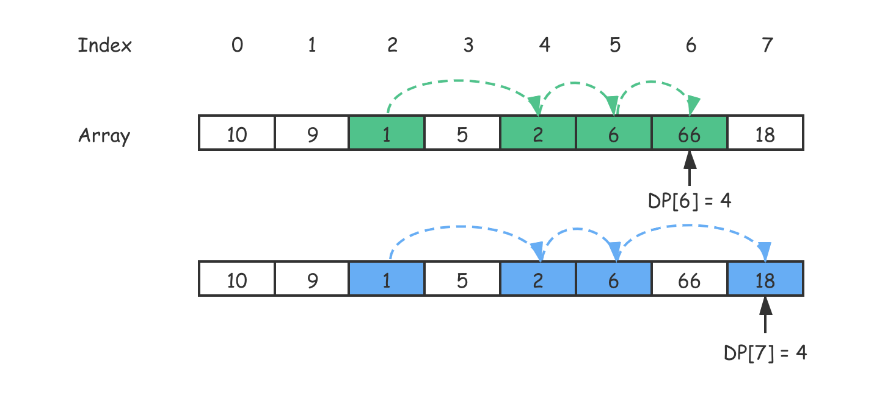

# 动态规划


动态规划（Dynamic programming）是一种在数学、计算机科学和经济学中使用的，通过把原问题分解为相对简单的子问题的方式求解复杂问题的方法。 动态规划常常适用于有重叠子问题和最优子结构性质的问题，动态规划方法所耗时间往往远少于朴素解法。 

动态规划背后的基本思想非常简单。大致上，若要解一个给定问题，我们需要解其不同部分（即子问题），再合并子问题的解以得出原问题的解。 通常许多子问题非常相似，为此动态规划法试图仅仅解决每个子问题一次，从而减少计算量： 

一旦某个给定子问题的解已经算出，则将其记忆化存储，以便下次需要同一个 子问题解之时直接查表。这种做法在重复子问题的数目关于输入的规模呈指数增长时特别有用。 

算法步骤
1、最优子结构性质。如果问题的最优解所包含的子问题的解也是最优的，我们就称该问题具有最优子结构性质（即满足最优化原理）。最优子结构性质为动态规划算法解决问题提供了重要线索。 

2、子问题重叠性质。子问题重叠性质是指在用递归算法自顶向下对问题进行求解时，每次产生的子问题并不总是新问题，有些子问题会被重复计算多次。 动态规划算法正是利用了这种子问题的重叠性质，对每一个子问题只计算一次，然后将其计算结果保存在一个表格中，当再次需要计算已经计算过的子问题时，只是 在表格中简单地查看一下结果，从而获得较高的效率。


动态规划两步曲：

* DP状态的定义

* DP状态转移方程

动态规划（Dynamic Programming）比较适合用来求解最优问题，比如求最大值、最小值等等。它可以非常显著地降低时间复杂度，提高代码的执行效率。

动态规划的题目分为两大类，一种是求最优解类，典型问题是背包问题，另一种就是计数类，比如统计方案数的问题，它们都存在一定的递推性质。前者的递推性质还有一个名字，叫做 **「最优子结构」** ——即当前问题的最优解取决于子问题的最优解，后者类似，当前问题的方案数取决于子问题的方案数。所以在遇到求方案数的问题时，我们可以往动态规划的方向考虑。

**「滚动数组思想」**是一种常见的动态规划优化方法，当我们定义的状态在动态规划的转移方程中只和某几个状态相关的时候，就可以考虑这种优化方法，目的是给空间复杂度「降维」。


## 动态规划理论

什么样的问题适合用动态规划来解决呢？换句话说，动态规划能解决的问题有什么规律可循呢？

### 一个模型三个特征

“一个模型”指的是动态规划适合解决的问题的模型，即**分阶段决策最优解模型**。我们一般是用动态规划来解决最优问题。而解决问题的过程，需要经历多个决策阶段。每个决策阶段都对应着一组状态。然后我们寻找一组决策序列，经过这组决策序列，能够产生最终期望求解的最优值。

“三个特征”指的是**最优子结构**、**无后效性**和**重复子问题**。

* **1.最优子结构**

  最优子结构指的是，问题的最优解包含子问题的最优解。反过来说就是，我们可以通过子问题的最优解，推导出问题的最优解。如果我们把最优子结构，对应到我们前面定义的动态规划问题模型上，那我们也可以理解为，后面阶段的状态可以通过前面阶段的状态推导出来。

* **2.无后效性**

  无后效性有两层含义：

  第一层含义是，在推导后面阶段的状态的时候，我们只关心前面阶段的状态值，不关心这个状态是怎么一步一步推导出来的。

  第二层含义是，某阶段状态一旦确定，就不受之后阶段的决策影响。

  无后效性是一个非常“宽松”的要求。只要满足前面提到的动态规划问题模型，其实基本上都会满足无后效性。

* **3.重复子问题**

  不同的决策序列，到达某个相同的阶段时，可能会产生重复的状态。

两种动态规划的解题思路，分别是状态转移表法和状态转移方程法。其中，状态转移表法解题思路大致可以概括为，**回溯算法实现 - 定义状态 - 画递归树 - 找重复子问题 - 画状态转移表 - 根据递推关系填表 - 将填表过程翻译成代码**。状态转移方程法的大致思路可以概括为，**找最优子结构 - 写状态转移方程 - 将状态转移方程翻译成代码**。

### 两种动态规划解题思路总结

解决动态规划问题，一般有状态转移表法和状态转移方程法两种思路。

#### 1. 状态转移表法

一般能用动态规划解决的问题，都可以使用回溯算法的暴力搜索解决。所以可以先用简单的回溯算法解决，然后定义状态，每个状态表示一个节点，画出对应的递归树。从递归树中，可以很容易看出来是否存在重复子问题，以及重复子问题是如何产生的。以此来寻找规律，看是否能用动态规划解决。

找到重复子问题之后，接下来有两种处理思路，第一种是直接用**回溯加“备忘录”**的方法，来避免重复子问题。从执行效率上来讲，这跟动态规划的解决思路没有差别。第二种是使用动态规划的解决方法，**状态转移表法**。

先画出一个状态表。状态表一般都是二维的。其中，每个状态包含三个变量，行、列、数组值。根据决策的先后过程，从前往后，根据递推关系，分阶段填充状态表中的每个状态。最后，将这个递推填表的过程，翻译成代码，就是动态规划代码了。

尽管大部分状态表都是二维的，但是如果问题的状态比较复杂，需要很多变量来表示，那对应的状态表可能就是高维的，比如三维、四维。那这个时候就不适合用状态转移表法来解决了。一方面是因为高维状态转移表不好画图表示，另一方面是因为人脑确实很不擅长思考高维的东西。

#### 2. 状态转移方程法

状态转移方程法有点类似递归的解题思路，需要分析某个问题如何通过子问题来递归求解，也就是所谓的最优子结构。根据最优子结构，写出递归公式，也就是所谓的状态转移方程。有了状态转移方程，代码实现就非常简单了。一般情况下有**递归加“备忘录”和迭代递推**两种代码实现方法。

### 贪心/分治/回溯和动态规划的区别和联系

贪心、回溯、动态规划都可以抽象成**多阶段决策最优解模型**，而分治单独尽管大部分也是最优解问题却都不能抽象成多阶段决策模型。

回溯算法是个“万金油”。基本上能用的动态规划、贪心解决的问题都可以用回溯算法解决。回溯算法相当于穷举搜索。穷举所有的情况，然后对比得到最优解。不过，回溯算法的时间复杂度非常高，是指数级别的，只能用来解决小规模数据的问题。对于大规模数据的问题，用回溯算法解决的执行效率就很低了。

能用动态规划解决的问题，需要满足最优子结构、无后效性和重复子问题三个特征。在重复子问题这一点上，动态规划和分治算法的区分非常明显。分治算法要求分割成的子问题，不能有重复子问题，而动态规划正好相反。

贪心算法实际上是动态规划算法的一种特殊情况。它解决问题起来更加高效，代码实现也更加简洁。不过，它可以解决的问题也更加有限。它能解决的问题需要满足三个条件，最优子结构、无后效性和贪心选择性。“贪心选择性”的意思是，通过局部最优的选择，能产生全局的最优选择。每一个阶段，我们都选择当前看起来最优的决策，所有阶段的决策完成之后，最终由这些局部最优解构成全局最优解。

解决复杂算法问题的小技巧：

**先单纯考虑“人脑”会如何去解决这个问题**，把抽象问题具象化，实例化几个测试数据，通过人脑去分析具体实例的解，然后总结规律，再尝试套用学过的算法，看是否能够解决。

再就是要**多练**，做多了题目之后，自然就会有感觉，看到问题，立马就能想到能否用动态规划解决，然后直接就可以寻找最优子结构，写出动态规划方程，然后将状态转移方程翻译成代码。

## 从贪心算法到动态规划

首先，贪心算法是根据当前阶段得到局部最优解，然后再看下一个阶段，逐个求解。这样导致的问题就是，我们可能永远无法得到真正的最优解：整体最优解。

为了解决这个问题，我们在贪心算法中加入了回溯的过程。如果无法求解的时候，就会返回，然后重新尝试当前阶段的“局部次优方案”，重新计算这种情况下的解。这样一来，我们至少保证了所有问题都能求得一个解。

但是如果遇到一些局部最优解前提条件不一定满足全局最优解的情况，这种方法也不一定能让我们找到整体最优解，因为贪心算法里我们找到一个解就结束了，如果约束不足，那么返回可能不一定是整体最优解。

为了解决贪心算法的问题，真正求得整体最优解，我们就必须得到问题解的所有可能组合。这个时候我们就要利用递归来解决问题。

递归就是自顶向下求得满足问题条件的所有组合，并计算这些组合的解，最后从这些组合的解中取出最优解，这样暴力计算出来的结果必定是整体最优解。

但是这样就又出现了效率问题，暴力递归在计算量巨大的情况下，时间复杂度实在太高了，几乎会呈现指数爆炸形式。那么我们就得考虑是否有些问题可以进行剪枝优化。

我提出了一些剪枝优化的方法，重点介绍的就是利用重叠子问题进行优化。在递归求解过程中我们会把一个大问题分解成多个子问题，那些在求解计算分支中可能被反复求解的子问题就是所谓的重叠子问题。

如果这些重叠子问题无后效性，那么我们就可以利用缓存的方法，在求得每个子问题的解之后将求解结果存入缓存数组中。如果在后续的计算分支中遇到相同的子问题，就直接从备忘录中取出我们已经计算过的结果。

这样一来，我们就不需要浪费时间重复求解已经求解的问题，在这种情况下可以将时间复杂度约束在多项式级别。

但是递归求解最后还是会有性能损耗问题，因此这时正式引入了动态规划。在经历了这些讨论与探索后，你现在应该能够理解动态规划与贪心、回溯、递归的关系了。


带备忘录的递归解法从传统意义上说已经是动态规划思想的范畴了，但它使用的是自顶向下的处理方式来解题，它离我们日常看到的动态规划还有差距。

这个差距不仅仅体现在代码的形式上，更重要的是它仍然还不够好：递归本身的性质导致了算法执行时额外的存储开销。

为此，我们正式引入自底向上的一种处理方式，并用迭代代替了递归，实现了较为简洁的硬币找零动归解法。在多项式级别的算法时间复杂度内，我们用最快的速度得到了我们想要的结果。

另外，动态规划的关键是状态转移方程，为了写出它，我们需要按照套路找出以下项目：

1. 初始化状态：由于动态规划是根据已经计算好的子问题推广到更大问题上去的，因此我们需要一个“原点”作为计算的开端；
2. 状态：找出子问题与原问题之间会发生变化的变量，这个变量就是状态转移方程中的参数；
3. 决策：改变状态，让状态不断逼近初始化状态的操作。这个决策，就是状态转移方程状态转移的方向。

最后，我们要将以上信息组装起来，一般来说就可以得到动态规划的状态转移方程了。

## 0-1背包问题

对于一组不同重量、不可分割的物品，选择一些装入背包，在满足背包最大重量限制的前提下，背包中物品总重量的最大值是多少呢？

> 0-1背包问题回溯的解决方法：
>
> 穷举搜索所有可能的装法，然后找出满足条件的最大值。指数级别的复杂度。
>
> ```java
> 
> // 回溯算法实现。
> private int maxW = Integer.MIN_VALUE; // 结果放到maxW中
> private int[] weight = {2，2，4，6，3};  // 物品重量
> private int n = 5; // 物品个数
> private int w = 9; // 背包承受的最大重量
> public void f(int i, int cw) { // 调用f(0, 0)
>   if (cw == w || i == n) { // cw==w表示装满了，i==n表示物品都考察完了
>     if (cw > maxW) maxW = cw;
>     return;
>   }
>   f(i+1, cw); // 选择不装第i个物品
>   if (cw + weight[i] <= w) {
>     f(i+1,cw + weight[i]); // 选择装第i个物品
>   }
> }
> ```
>
> 可以使用备忘录记录已经计算好的f(i,cw)，当再次计算到重复的f(i,cw)的时候，可以直接从备忘录中取出来用，就不用再递归计算了，这样就可以避免冗余计算
>
> ```java
> 
> private int maxW = Integer.MIN_VALUE; // 结果放到maxW中
> private int[] weight = {2，2，4，6，3};  // 物品重量
> private int n = 5; // 物品个数
> private int w = 9; // 背包承受的最大重量
> private boolean[][] mem = new boolean[5][10]; // 备忘录，默认值false
> public void f(int i, int cw) { // 调用f(0, 0)
>   if (cw == w || i == n) { // cw==w表示装满了，i==n表示物品都考察完了
>     if (cw > maxW) maxW = cw;
>     return;
>   }
>   if (mem[i][cw]) return; // 重复状态
>   mem[i][cw] = true; // 记录(i, cw)这个状态
>   f(i+1, cw); // 选择不装第i个物品
>   if (cw + weight[i] <= w) {
>     f(i+1,cw + weight[i]); // 选择装第i个物品
>   }
> }
> ```
>
> 

动态规划的解决思路：

将整个求解过程分为n 个阶段，每个阶段会决策一个物品是否放到背包中。每个物品决策（放入或者不放入背包）完之后，背包中的物品的重量会有多种情况，即达到多种不同的状态，对应到递归树中，就是有很多不同的节点。

把每一层重复的状态（节点）合并，只记录不同的状态，然后基于上一层的状态集合，来推导下一层的状态集合。通过合并每一层重复的状态，保证每一层不同状态的个数都不会超过 w 个（w 表示背包的承载重量），从而避免每层状态个数的指数级增长。

用一个二维数组 states\[n][w+1]，来记录每层可以达到的不同状态。

第 0 个（下标从 0 开始编号）物品的重量是 2，要么装入背包，要么不装入背包，决策完之后，会对应背包的两种状态，背包中物品的总重量是 0 或者 2。可用states\[0][0]=true和states\[0][2]=true来表示这两种状态。

第 1 个物品的重量也是 2，基于之前的背包状态，在这个物品决策完之后，不同的状态有 3 个，背包中物品总重量分别是 0(0+0)，2(0+2 or 2+0)，4(2+2)。用states\[1][0]=true，states\[1][2]=true，states\[1][4]=true来表示这三种状态。

考察完所有的物品后，整个 states 状态数组就都计算好了。

在最后一层，找一个值为 true 的最接近 w（这里是 9）的值，就是背包中物品总重量的最大值。

```java
//weight: 物品重量，n: 物品个数，w: 背包可承载重量
public int knapsack(int[] weight, int n, int w) {
  boolean[][] states = new boolean[n][w+1]; // 默认值 false
  states[0][0] = true;  // 第一行的数据要特殊处理，可以利用哨兵优化
  states[0][weight[0]] = true;
  for (int i = 1; i < n; ++i) { // 动态规划状态转移
    for (int j = 0; j <= w; ++j) {// 不把第 i 个物品放入背包
      if (states[i-1][j] == true) states[i][j] = states[i-1][j];
    }
    for (int j = 0; j <= w-weight[i]; ++j) {// 把第 i 个物品放入背包
      if (states[i-1][j]==true) states[i][j+weight[i]] = true;
    }
  }
  for (int i = w; i >= 0; --i) { // 输出结果
    if (states[n-1][i] == true) return i;
  }
  return 0;
}
```

这就是一种用动态规划解决问题的思路：把问题分解为多个阶段，每个阶段对应一个决策，然后记录每一个阶段可达的状态集合（去掉重复的），通过当前阶段的状态集合，来推导下一个阶段的状态集合，动态地往前推进。

用回溯算法解决这个问题的时间复杂度是 O(2^n^)指数级的。而动态规划解决方案的时间复杂度是 O(n*w)，n 表示物品个数，w 表示背包可以承载的总重量。


上述代码实现额外申请一个 n 乘以 w+1 的二维数组，对空间的消耗比较多。但实际上只需要一个大小为 w+1 的一维数组就可以解决这个问题，动态规划状态转移的过程，都可以基于这个一维数组来操作：

```java
public static int knapsack2(int[] items, int n, int w) {
  boolean[] states = new boolean[w+1]; // 默认值 false
  states[0] = true;  // 第一行的数据要特殊处理，可以利用哨兵优化
  states[items[0]] = true;
  for (int i = 1; i < n; ++i) { // 动态规划
    for (int j = w-items[i]; j >= 0; --j) {// 把第 i 个物品放入背包
      if (states[j]==true) states[j+items[i]] = true;
    }
  }
  for (int i = w; i >= 0; --i) { // 输出结果
    if (states[i] == true) return i;
  }
  return 0;
}
```

注意：内层for循环j必须从大到小来处理，否则会出现 for 循环重复计算的问题。

### 0-1背包问题升级版

上面的背包问题只涉及背包重量和物品重量。现在引入物品价值这一变量。对于一组不同重量、不同价值、不可分割的物品，选择将某些物品装入背包，在满足背包最大重量限制的前提下，背包中可装入物品的总价值最大是多少呢？

> 回溯解决方法：
>
> ```java
> 
> private int maxV = Integer.MIN_VALUE; // 结果放到maxV中
> private int[] items = {2，2，4，6，3};  // 物品的重量
> private int[] value = {3，4，8，9，6}; // 物品的价值
> private int n = 5; // 物品个数
> private int w = 9; // 背包承受的最大重量
> public void f(int i, int cw, int cv) { // 调用f(0, 0, 0)
>   if (cw == w || i == n) { // cw==w表示装满了，i==n表示物品都考察完了
>     if (cv > maxV) maxV = cv;
>     return;
>   }
>   f(i+1, cw, cv); // 选择不装第i个物品
>   if (cw + weight[i] <= w) {
>     f(i+1,cw+weight[i], cv+value[i]); // 选择装第i个物品
>   }
> }
> ```
>
> 在递归树中，每个节点表示一个状态。现在我们需要 3 个变量（i, cw, cv）来表示一个状态。其中，i 表示即将要决策第 i 个物品是否装入背包，cw 表示当前背包中物品的总重量，cv 表示当前背包中物品的总价值。
>
> 在递归树中，有几个节点的 i 和 cw 是完全相同的，比如 f(2,2,4) 和 f(2,2,3)。在背包中物品总重量一样的情况下，f(2,2,4) 这种状态对应的物品总价值更大，我们可以舍弃 f(2,2,3) 这种状态，只需要沿着 f(2,2,4) 这条决策路线继续往下决策就可以。也就是说，对于 (i, cw) 相同的不同状态，那我们只需要保留 cv 值最大的那个，继续递归处理，其他状态不予考虑。如果用回溯算法，这个问题就没法再用“备忘录”解决了。

动态规划解决：

把整个求解过程分为 n 个阶段，每个阶段会决策一个物品是否放到背包中。每个阶段决策完之后，背包中的物品的总重量以及总价值，会有多种情况，也就是会达到多种不同的状态。

用一个二维数组 states\[n][w+1]，来记录每层可以达到的不同状态，数组存储当前状态对应的最大总价值。

把每一层中 (i, cw) 重复的状态（节点）合并，只记录 cv 值最大的那个状态，然后基于这些状态来推导下一层的状态。

```java
public static int knapsack3(int[] weight, int[] value, int n, int w) {
  int[][] states = new int[n][w+1];
  for (int i = 0; i < n; ++i) { // 初始化 states
    for (int j = 0; j < w+1; ++j) {
      states[i][j] = -1;
    }
  }
  states[0][0] = 0;
  states[0][weight[0]] = value[0];
  for (int i = 1; i < n; ++i) { // 动态规划，状态转移
    for (int j = 0; j <= w; ++j) { // 不选择第 i 个物品
      if (states[i-1][j] >= 0) states[i][j] = states[i-1][j];
    }
    for (int j = 0; j <= w-weight[i]; ++j) { // 选择第 i 个物品
      if (states[i-1][j] >= 0) {
        int v = states[i-1][j] + value[i];
        if (v > states[i][j+weight[i]]) {
          states[i][j+weight[i]] = v;
        }
      }
    }
  }
  // 找出最大值
  int maxvalue = -1;
  for (int j = 0; j <= w; ++j) {
    if (states[n-1][j] > maxvalue) maxvalue = states[n-1][j];
  }
  return maxvalue;
}
```

上述代码时间复杂度和空间复杂度都是 O(n*w)。空间复杂度可以优化为O(w)。

### 背包问题模板代码

```c++
int main(){
    // 各个物品的重量
    vector<int> weight = {2, 3, 4, 7};
    // 对应的价值
    vector<int> value = {1, 3, 5, 9};

    // 背包最大能放下多重的物品
    int bagWeight = 10;

    // 二维数组状态定义：dp[i][j]表示从前 i 个物品中选择不超过 j 重量的物品的最大价值
    // 初始化：第一列都是0，第一行也都是0
    // dp[0][j] = 0, dp[i][0] = 0
    // 1.因为在背包容量为 0 的情况下，无法放入任何东西，价值为 0
    // 2.因为在前 0 个物品中，表示没有物品可以选，背包无法放入任何东西，价值为 0
    auto dp = vector<vector<int>>(weight.size() + 1, vector<int>(bagWeight + 1));

    for(int i = 1; i <= weight.size(); i++){
        // 遍历背包容量
        for(int j = 1; j <= bagWeight; j++){
            // 背包容量小于当前物品的容量，即背包容量已经不足以放第 i 个物品了
            if(j < weight[i-1]){
                // 最大价值就是去考虑当前背包容量情况下，从前 i-1 个物品中选择出最大价值
                dp[i][j] = dp[i-1][j];
            }
            // 背包容量足够放第 i 个物品，那么可以选择放或者不放
            // 1.选择放，那么最大价值是第 i-1 个物品扣除第 i 个物品的重量的情况下的最大价值，再加上第 i 个物品的价值
            // 2.选择不放，那么就是从前 i-1 个物品中选择出的最大价值
            // 两者进行比较取较大的
            else{
                dp[i][j] = max(dp[i-1][j], dp[i-1][j-weight[i-1]] + value[i-1]);
            }
        }
    }
    return dp[weight.size()][bagWeight];    
}
```

使用滚动数组优化：

```c++
int main(){
    // 各个物品的重量
    vector<int> weight = {2, 3, 4, 7};
    // 对应的价值
    vector<int> value = {1, 3, 5, 9};

    // 背包最大能放下多重的物品
    int bagWeight = 10;

    // 二维数组状态定义：dp[i][j]表示从前 i 个物品中选择不超过 j 重量的物品的最大价值
    // 滚动数组优化为一维数组
    auto dp = vector<int>(bagWeight + 1);

    for(int i = 1; i <= weight.size(); i++){
        // 遍历背包容量
        for(int j = bagWeight; j >= 1; j--){
            // 背包容量足够放第 i 个物品，那么可以选择放或者不放
            if(j >= weight[i-1]){
                dp[j] = max(dp[j], dp[j-weight[i-1]] + value[i-1]);
            }
        }
    }
    return dp[bagWeight];
}
```


## 双11购物的凑单问题

淘宝的“双十一”购物节有各种促销活动，比如“满 200 元减 50 元”。假设你的购物车中有 n 个（n>100）想买的商品，希望从里面选几个，在凑够满减条件的前提下，让选出来的商品价格总和最大程度地接近满减条件（200 元），如何编程解决这个问题？

思路：

动态规划，购物车中有 n 个商品，针对每个商品都决策是否购买。每次决策之后，对应不同的状态集合。用一个二维数组 states\[n][x]，来记录每次决策之后所有可达的状态。

对于这个问题来说，要找的是大于等于 200（满减条件）的值中最小的，所以就不能设置为 200 加 1 了。就这个实际的问题而言，如果要购买的物品的总价格超过 200 太多，比如 1000，那这个羊毛“薅”得就没有太大意义了。所以，可以限定 x 值为 1001。

求出大于等于 200 的总价格中的最小的，还要找出这个最小总价格对应都要购买哪些商品。可以利用 states 数组，倒推出这个被选择的商品序列。

```java
// items 商品价格，n 商品个数, w 表示满减条件，比如 200
public static void double11advance(int[] items, int n, int w) {
  boolean[][] states = new boolean[n][3*w+1];// 超过 3 倍就没有薅羊毛的价值了
  states[0][0] = true;  // 第一行的数据要特殊处理
  states[0][items[0]] = true;
  for (int i = 1; i < n; ++i) { // 动态规划
    for (int j = 0; j <= 3*w; ++j) {// 不购买第 i 个商品
      if (states[i-1][j] == true) states[i][j] = states[i-1][j];
    }
    for (int j = 0; j <= 3*w-items[i]; ++j) {// 购买第 i 个商品
      if (states[i-1][j]==true) states[i][j+items[i]] = true;
    }
  }
 
  int j;
  for (j = w; j < 3*w+1; ++j) { 
    if (states[n-1][j] == true) break; // 输出结果大于等于 w 的最小值
  }
  if (j == 3*w+1) return; // 没有可行解
  for (int i = n-1; i >= 1; --i) { // i 表示二维数组中的行，j 表示列
    if(j-items[i] >= 0 && states[i-1][j-items[i]] == true) {
      System.out.print(items[i] + " "); // 购买这个商品
      j = j - items[i];
    } // else 没有购买这个商品，j 不变。
  }
  if (j != 0) System.out.print(items[0]);
}
```

利用 states 数组倒推选择购买了哪些商品的方法：

状态 (i, j) 只有可能从 (i-1, j) 或者 (i-1, j-value[i]) 两个状态推导过来。所以，我们就检查这两个状态是否是可达的，也就是 states\[i-1][j] 或者 states\[i-1][j-value[i]] 是否是 true。

如果  states\[i-1][j] 可达，就说明我们没有选择购买第 i 个商品，如果 states\[i-1][j-value[i]] 可达，那就说明选择了购买第 i 个商品。从中选择一个可达的状态（如果两个都可达，就随意选择一个），然后，继续迭代地考察其他商品是否有选择购买。

## 搜索引擎中的拼写纠错功能

利用 Trie 树，可以实现搜索引擎的关键词提示功能。实际上在搜索框中，一不小心输错单词时，搜索引擎会非常智能地检测出你的拼写错误，并且用对应的正确单词来进行搜索。

### 如何量化两个字符串的相似程度

量化两个字符串之间的相似程度，有一个非常著名的量化方法是编辑距离（Edit Distance）。

**编辑距离**指将一个字符串转化成另一个字符串，需要的最少编辑操作次数（比如增加一个字符、删除一个字符、替换一个字符）。编辑距离越大，说明两个字符串的相似程度越小；相反，编辑距离就越小，说明两个字符串的相似程度越大。对于两个完全相同的字符串来说，编辑距离就是 0。

根据所包含的编辑操作种类的不同，编辑距离有多种不同的计算方式，比较著名的有**莱文斯坦距离**（Levenshtein distance）和**最长公共子串长度**（Longest common substring length）。其中，莱文斯坦距离允许增加、删除、替换字符这三个编辑操作，最长公共子串长度只允许增加、删除字符这两个编辑操作。

莱文斯坦距离的大小，表示两个字符串差异的大小；而最长公共子串的大小，表示两个字符串相似程度的大小。

下图中两个字符串 mitcmu 和 mtacnu 的莱文斯坦距离是 3，最长公共子串长度是 4。


**如何计算莱文斯坦距离？**

这个问题是求把一个字符串变成另一个字符串，需要的最少编辑次数。整个求解过程，涉及多个决策阶段，需要依次考察一个字符串中的每个字符，跟另一个字符串中的字符是否匹配，匹配的话如何处理，不匹配的话又如何处理。所以，这个问题符合**多阶段决策最优解模型**。

1.回溯算法解决

回溯是一个递归处理的过程。如果 a[i]与 b[j]匹配，我们递归考察 a[i+1]和 b[j+1]。如果 a[i]与 b[j]不匹配，那我们有多种处理方式可选：

* 可以删除 a[i]，然后递归考察 a[i+1]和 b[j]；
* 可以删除 b[j]，然后递归考察 a[i]和 b[j+1]；
* 可以在 a[i]前面添加一个跟 b[j]相同的字符，然后递归考察 a[i]和 b[j+1];
* 可以在 b[j]前面添加一个跟 a[i]相同的字符，然后递归考察 a[i+1]和 b[j]；
* 可以将 a[i]替换成 b[j]，或者将 b[j]替换成 a[i]，然后递归考察 a[i+1]和 b[j+1]。

```java

private char[] a = "mitcmu".toCharArray();
private char[] b = "mtacnu".toCharArray();
private int n = 6;
private int m = 6;
private int minDist = Integer.MAX_VALUE; // 存储结果
// 调用方式 lwstBT(0, 0, 0);
public lwstBT(int i, int j, int edist) {
  if (i == n || j == m) {
    if (i < n) edist += (n-i);
    if (j < m) edist += (m - j);
    if (edist < minDist) minDist = edist;
    return;
  }
  if (a[i] == b[j]) { // 两个字符匹配
    lwstBT(i+1, j+1, edist);
  } else { // 两个字符不匹配
    lwstBT(i + 1, j, edist + 1); // 删除a[i]或者b[j]前添加一个字符
    lwstBT(i, j + 1, edist + 1); // 删除b[j]或者a[i]前添加一个字符
    lwstBT(i + 1, j + 1, edist + 1); // 将a[i]和b[j]替换为相同字符
  }
}
```

根据回溯算法的代码实现，我们可以画出递归树，看是否存在重复子问题。如果存在重复子问题，那我们就可以考虑能否用动态规划来解决；如果不存在重复子问题，那回溯就是最好的解决方法。

在递归树中，每个节点代表一个状态，状态包含三个变量 (i, j, edist)，其中，edist 表示处理到 a[i]和 b[j]时，已经执行的编辑操作的次数。在递归树中，(i, j) 两个变量重复的节点很多，比如 (3, 2) 和 (2, 3)。对于 (i, j) 相同的节点，我们只需要保留 edist 最小的，继续递归处理就可以了，剩下的节点都可以舍弃。所以，状态就从 (i, j, edist) 变成了 (i, j, min_edist)，其中 min_edist 表示处理到 a[i]和 b[j]，已经执行的最少编辑次数。

2.动态规划解决

定义状态(i, j, min_edist)，其中 min_edist 表示处理到 a[i]和 b[j]，已经执行的最少编辑次数。

状态转移方程：

```
如果：a[i]!=b[j]，那么：min_edist(i, j)就等于：
min(min_edist(i-1,j)+1, min_edist(i,j-1)+1, min_edist(i-1,j-1)+1)

如果：a[i]==b[j]，那么：min_edist(i, j)就等于：
min(min_edist(i-1,j)+1, min_edist(i,j-1)+1，min_edist(i-1,j-1))

其中，min表示求三数中的最小值。     
```

代码实现：

```java
public int lwstDP(char[] a, int n, char[] b, int m) {
  int[][] minDist = new int[n][m];
  for (int j = 0; j < m; ++j) { // 初始化第0行:a[0..0]与b[0..j]的编辑距离
    if (a[0] == b[j]) minDist[0][j] = j;
    else if (j != 0) minDist[0][j] = minDist[0][j-1]+1;
    else minDist[0][j] = 1;
  }
  for (int i = 0; i < n; ++i) { // 初始化第0列:a[0..i]与b[0..0]的编辑距离
    if (a[i] == b[0]) minDist[i][0] = i;
    else if (i != 0) minDist[i][0] = minDist[i-1][0]+1;
    else minDist[i][0] = 1;
  }
  for (int i = 1; i < n; ++i) { // 按行填表
    for (int j = 1; j < m; ++j) {
      if (a[i] == b[j]) minDist[i][j] = min(
          minDist[i-1][j]+1, minDist[i][j-1]+1, minDist[i-1][j-1]);
      else minDist[i][j] = min(
          minDist[i-1][j]+1, minDist[i][j-1]+1, minDist[i-1][j-1]+1);
    }
  }
  return minDist[n-1][m-1];
}

private int min(int x, int y, int z) {
  int minv = Integer.MAX_VALUE;
  if (x < minv) minv = x;
  if (y < minv) minv = y;
  if (z < minv) minv = z;
  return minv;
}
```

**如何编程计算最长公共字串长度**

最长公共子串作为编辑距离中的一种，只允许增加、删除字符两种编辑操作。

这个问题也可以用动态规划解决，现在定义状态，然后写状态转移方程。

每个状态包括三个变量 (i, j, max_lcs)，max_lcs 表示 a[0…i] 和 b[0…j] 的最长公共子串长度。那 (i, j) 这个状态都是由哪些状态转移过来的呢？

回溯的处理思路从 a[0] 和 b[0] 开始，依次考察两个字符串中的字符是否匹配。

- 如果 a[i] 与 b[j] 互相匹配，将最大公共子串长度加一，并且继续考察 a[i+1] 和 b[j+1]。
- 如果 a[i] 与 b[j] 不匹配，最长公共子串长度不变，然后有两个不同的决策路线：
  1. 删除 a[i]，或者在 b[j] 前面加上一个字符 a[i]，然后继续考察 a[i+1] 和 b[j]；
  2. 删除 b[j]，或者在 a[i] 前面加上一个字符 b[j]，然后继续考察 a[i] 和 b[j+1]。

反过来看，如果要求 a[0…i] 和 b[0…j] 的最长公共长度 max_lcs(i, j)，只有可能通过下面三个状态转移过来：

- (i-1, j-1, max_lcs)，其中 max_lcs 表示 a[0…i-1] 和 b[0…j-1] 的最长公共子串长度；
- (i-1, j, max_lcs)，其中 max_lcs 表示 a[0…i-1] 和 b[0…j] 的最长公共子串长度；
- (i, j-1, max_lcs)，其中 max_lcs 表示 a[0…i] 和 b[0…j-1] 的最长公共子串长度。

状态转移方程：

```
如果：a[i]==b[j]，那么：max_lcs(i, j) 就等于：
max(max_lcs(i-1,j-1)+1, max_lcs(i-1, j), max_lcs(i, j-1))；
 
如果：a[i]!=b[j]，那么：max_lcs(i, j) 就等于：
max(max_lcs(i-1,j-1), max_lcs(i-1, j), max_lcs(i, j-1))；
 
其中 max 表示求三数中的最大值。
```

java代码：

```java
public int lcs(char[] a, int n, char[] b, int m) {
  int[][] maxlcs = new int[n][m];
  for (int j = 0; j < m; ++j) {// 初始化第 0 行：a[0..0] 与 b[0..j] 的 maxlcs
    if (a[0] == b[j]) maxlcs[0][j] = 1;
    else if (j != 0) maxlcs[0][j] = maxlcs[0][j-1];
    else maxlcs[0][j] = 0;
  }
  for (int i = 0; i < n; ++i) {// 初始化第 0 列：a[0..i] 与 b[0..0] 的 maxlcs
    if (a[i] == b[0]) maxlcs[i][0] = 1;
    else if (i != 0) maxlcs[i][0] = maxlcs[i-1][0];
    else maxlcs[i][0] = 0;
  }
  for (int i = 1; i < n; ++i) { // 填表
    for (int j = 1; j < m; ++j) {
      if (a[i] == b[j]) maxlcs[i][j] = max(
          maxlcs[i-1][j], maxlcs[i][j-1], maxlcs[i-1][j-1]+1);
      else maxlcs[i][j] = max(
          maxlcs[i-1][j], maxlcs[i][j-1], maxlcs[i-1][j-1]);
    }
  }
  return maxlcs[n-1][m-1];
}
 
private int max(int x, int y, int z) {
  int maxv = Integer.MIN_VALUE;
  if (x > maxv) maxv = x;
  if (y > maxv) maxv = y;
  if (z > maxv) maxv = z;
  return maxv;
}
```

### 搜索引擎中的拼写纠错功能实现与优化思路

拼写纠错最基本的原理是当用户在搜索框内，输入一个拼写错误的单词时，就拿这个单词跟词库中的单词一一进行比较，计算编辑距离，将编辑距离最小的单词，作为纠正之后的单词，提示给用户。

针对纠错效果不好的问题，我们有很多种优化思路，我这里介绍几种。

- 取出编辑距离最小的 TOP 10，然后根据其他参数，决策选择哪个单词作为拼写纠错单词。比如使用搜索热门程度来决定哪个单词作为拼写纠错单词。
- 用多种编辑距离计算方法，分别求编辑距离最小的 TOP 10，然后求交集，用交集的结果，再继续优化处理。
- 通过统计用户的搜索日志，得到最常被拼错的单词列表，以及对应的拼写正确的单词。搜索引擎在拼写纠错的时候，首先在这个最长被拼错单词列表中查找。如果一旦找到，直接返回对应的正确的单词。
- 更加高级一点的做法是引入个性化因素。针对每个用户，维护这个用户特有的搜索喜好，也就是常用的搜索关键词。当用户输入错误的单词的时候，首先在这个用户常用的搜索关键词中，计算编辑距离，查找编辑距离最小的单词。

纠错性能的两种分治的优化思路：

- 如果纠错功能的 TPS 不高，可以部署多台机器，每台机器运行一个独立的纠错功能。当有一个纠错请求的时候，通过负载均衡，分配到其中一台机器，来计算编辑距离，得到纠错单词。
- 如果纠错系统的响应时间太长，也就是，每个纠错请求处理时间过长，可以将纠错的词库，分割到很多台机器。当有一个纠错请求的时候，就将这个拼写错误的单词，同时发送到这多台机器，让多台机器并行处理，分别得到编辑距离最小的单词，然后再比对合并，最终决定出一个最优的纠错单词。

## 硬币找零问题

假设有几种不同币值的硬币 v1，v2，……，vn（单位是元）。如果要支付 w 元，求最少需要多少个硬币。比如，有 1 元、3 元、5 元3 种不同的硬币，要支付 9 元最少需要 3 个硬币（3 个 3 元的硬币）。

动态规划分析思路：

求支付w元最少需要多少个硬币，可以分解为求支付w-v1,w-v2,，……，w-vn元需要硬币数的最小值+1，

用memo[w+1]作为状态数组来记录支付x元，最少所需要的硬币数。

初始化支付0元需要0个硬币，即memo[0]=0.

然后以此状态为基础，依次计算出支付1元，支付2元，...，直到支付w元，最少需要的硬币数。

```python
def coins_dp(values: List[int], w: int) -> int:
    # memo[i]表示w为i的时候，最少需要的硬币数
    memo = [0] * (w + 1)
    # 初始化支付0元需要0个硬币
    memo[0] = 0
    # 可选硬币列表从小到大排序
    values.sort()
    for i in range(1, w + 1):
        min_num = 99999  # 假设最大金额为100000
        # 假设values的值为n1,n2,n3,...
        # 故memo[i]=min(memo[i-n1], memo[i-n2], ...) + 1
        for n in values:
            if i - n < 0: break
            if min_num > memo[i - n]:
                min_num = memo[i - n]
        memo[i] = min_num + 1
    return memo[-1]
```


c++实现：

```c++
int GetMinCounts(int k, const std::vector<int>& values) {
    int memo[k + 1]; // 创建备忘录
    memo[0] = 0; // 初始化状态
    for (int i = 1; i < k + 1; i++) { memo[i] = k + 1; }
    
    for (int i = 1; i < k + 1; i++) {
        for (auto coin : values) {
            if (i - coin < 0) { continue; }
            memo[i] = min(memo[i], memo[i - coin] + 1); // 作出决策
        }
    }

    return memo[k] == k + 1 ? -1 : memo[k];
}

int GetMinCountsDPSolAdvance() {
    std::vector<int> values = { 3, 5 }; // 硬币面值
    int total = 11; // 总值

    return GetMinCounts(total, values); // 输出答案
}
```

## 子数组问题

所谓动态规划的子数组问题，就是从一个数组中寻找满足条件，并可以得到最优结果的一个最长的子数组序列的问题。

如果一道题目给定的输入是一个数组，那么满足以下条件的问题就是动归子数组问题：

1.问题符合动归典型特征：a. 求“最”优解问题（最大值和最小值）；b. 求可行性（True 或 False）；c. 求方案总数。

2.题目的答案是题设数组的子数组，或者来源于子数组。

### 回文子串个数

问题：给定一个字符串，你的任务是计算这个字符串中有多少个回文子串。具有不同开始位置或结束位置的子串，即使是由相同的字符组成，也会被视作不同的子串。

示例1：

```
输入："dp"
输出：2
解释：共有两个回文子串，分别为 "d", "p"。
```

示例2：

```
输入："aaa"
输出：6
解释：共有六个回文子串，分别为 "a", "a", "a", "aa", "aa", "aaa"。注意题设，具有不同开始位置或结束位置的子串，即使是由相同的字符组成，也会被视作不同的子串，因此像 "aa" 和 "aa" 就是两个不同的回文子串。
```

首先，我们先来确定初始化状态。从问题的示例就可以看出（当然也很容易想到），单个字符一定是它自己的回文。

接着，再来确定状态参数。由于我们需要在整个字符串（数组）中确定子串（子数组）的位置，因此需要两个变量来约束和确定子串，一个是子串的起始位置，另一个是结束位置。在算法的执行过程中，起始和结束位置是变化的，因此它们是状态参数。

既然有两个状态参数，因此我们考虑使用二维数组作为动归解法的备忘录。设 DP\[i][j]，其中 i 是子数组的起始位置，j 是结束位置，而 DP\[i][j] 又代表什么含义呢？

这里我们需要分析一下。我们说，动态规划的当前问题是根据它的子问题 ➕ 当前决策推导出来的。从数组的角度上看，无非就是：一个范围较小的回文子数组 ➕ 额外元素后，再看它是不是回文子数组。


从图中可以看到，更大范围的问题是由前面的子问题 ➕ 当前决策推导出来的，当前的决策就是如果向子问题的两边分别扩充一个元素，那么当前问题是否还是回文呢？

在上图给出的示例中，当前问题仍然是回文，如果设 DP\[4][6] 为子问题，那么当前问题 DP\[3][7] = DP\[4][6] + 决策。现在问题已经很明显了，这个决策就是 True 或者 False。

因此， DP\[i][j] 所对应的值是子串 i…j 是否为回文（True 或 False）。

一切就绪了，现在给出回文子串问题的状态转移方程。我们把字符串当作数组来访问，当 s[i]\==s[j] 时，当前子问题的答案就是 DP\[i+1][j−1] && s[i]\==s[j]（其中 s[i]==s[j] 即为 True，因此在状态转移方程中没有写出来）；而当 s[i]!=s[j] 时，显然当前子问题的答案就是 False。
$$
DP(i,j)=\left\{
\begin{aligned}&DP[i+1][j-1],&s[i]==s[j] \\
&False,&s[i]\neq s[j]
\end{aligned}
\right.
$$
C++实现：

```c++
int CountSubstrings(string s) {
    int n = static_cast<int>(s.size());
    if (0 == n) return 0;

    int ans = 0;
    bool dp[n][n]; memset(dp, 0, sizeof(dp));
    for (int i = 0; i < n; i++) {
        dp[i][i] = true;
        ans++;
    }

    for (int j = 1; j < n; j++) {
        for (int i = 0; i < j; i++) {
            dp[i][j] = s[i]==s[j] && (j-i <3 || dp[i+1][j-1]);
            if (dp[i][j]) { ans++; }
        }
    }

    return ans;
}
```

事实上，在编写这个问题的状态转移方程时，有技巧可以利用。我们仍然分析以下回文的特征：

1. 当子问题局限于单字符时，它一定是回文（如 “a”），因此子问题的答案是 True；
2. 当子问题是由相同的两个字符构成的，它一定是回文（如 “aa”），因此子问题的答案是 True；
3. 当子问题是由左右两个相同字符外加一个任意字符，共三个字符构成时，它一定是回文（如 “aba”），因此子问题的答案是 True。

综上所述，只要 s[i]==s[j] 且 j−i < 3 的时候，那个子问题一定是回文，其对应的 dp\[i][j] 一定是 True。因此，我们对状态转移方程做一个调整：
$$
DP(i,j)=\left\{
\begin{aligned}&DP[i+1][j-1],&s[i]==s[j] \\
&s[i]==s[j]\&\&j-i<3,
\end{aligned}
\right.
$$
这样一来，我们就用比较优雅的方式解决了回文子串问题。算法的时间复杂度为 O(n^2^)，空间复杂度为 O(n^2^)。

### 最大子数组之和

问题：给定一个整数数组 nums ，找到一个具有最大和的连续子数组（子数组最少包含一个元素），返回其最大和。

```
示例：

输入：[-2, 1, -3, 4, -1, 3, -5, 1, 2]
输出：6
解释：连续子数组 [4,-1, 3] 的和最大为 6。
```

先来确认初始化状态。我们试着用回文子串中的方法来定义备忘录，即 DP\[i][j] 对应的值是起始位置为 i 结束位置为 j 构成的最大子的子数组和。按照这个思路，那么原问题的答案应该存放在 DP\[0][n] 当中。但是这样设计备忘录，问题就复杂了。由于我们要求的只是一个最值，所有子问题最终要规约到从索引 0 到 n，因此没有必要同时记录子数组的起始和结束位置。

在这里我们对备忘录存储的状态进行简化，将 DP\[i][j] 简化成 DP[i]，其对应值表示的是 nums[0…i] 中的最大子数组之和。 接着，状态参数就清晰明了，即 n。

我们再来看看如何进行决策。对于这类子数组问题，我们需要重新定义备忘录的含义，即 DP[i] 表示的是以 i 为结束位置的最大子数组之和。这样一来，以结束位置作为导向，就一定能跟后续子问题相连。现在，我们可以写出状态转移方程了。
$$
DP(i,j)=\left\{
\begin{aligned}&0&i=0 \\
&DP[i]=max(nums[i],nums[i]+DP[i-1],&i>0
\end{aligned}
\right.
$$
C++实现：

```c++
int MaxSubArray(vector<int>& nums) {
    int n = nums.size(); if (0 == n) return 0;
    int dp[n];
    for (int i = 0; i < n; i++) dp[i] = INT_MIN; // 初始化状态
    
    dp[0] = nums[0];

    int res = dp[0];
    for (int i = 1; i < n; i++) {
        dp[i] = max(nums[i], dp[i-1] + nums[i]);
        res = max(res, dp[i]);
    }

    return res;
}
```

代码的第 1 行中，我们首先处理了边界情况。如果数组长度为 0，不包含任何元素，那么结果肯定为 0。接着，定义了备忘录数组 dp，并通过循环将数组的值全部初始化为 INT_MIN，这样就能确保每次求出来的有效值可以直接当作最大值使用。然后，我们令 dp[0] 为 nums[0]，也就是以 0 这个位置结尾的数组，其最大子数组之和就是 dp 的第 1 个元素。

到了算法的主要计算部分，我们不断遍历整个数组。每次遍历时，首先确定是需要开始一个新的连续子数组，还是扩展之前的连续子数组。如果当前位置的元素大于前面最优解子数组与当前元素之和，说明应该以当前位置开始一个新的子数组；否则说明当前元素应该是前一个最优解的扩展，得到一个更大的连续子数组。

接着，我们将当前连续子数组的和与之前遍历过程中保存的最大子数组之和进行比较，如果更大则替换掉之前保存的结果，这说明相对于之前保存的结果，我们遇到了求和更大的一个子串；否则说明当前子串之和小于之前找到过的最大值，因此依然保留之前的结果。

最后我们返回存储的最大值即可。这也就是我们整个数组的最大连续子数组之和。

**空间复杂度优化**

根据前面的分析，我们知道 DP[i] 仅和 DP[i−1] 的状态有关，因此可以进行状态压缩，即降低备忘录的空间复杂度。我们无需保存一个长度为 n 的数组来存储状态，只需要两个整数型变量就够了。

```c++
int MaxSubArrayAdvanced(vector<int>& nums) {
    int n = nums.size(); if (0 == n) return 0;
    int dp_0 = nums[0], dp_1 = 0; // 初始化状态

    int res = dp_0;
    for (int i = 1; i < n; i++) {
        dp_1 = max(nums[i], dp_0 + nums[i]);
        dp_0 = dp_1;
        res = max(res, dp_1);
    }

    return res;
}
```

### 最长连续递增序列

问题：给定一个未经排序的整数数组 nums，找到最长且连续的的递增序列，并返回该序列的长度。

示例1：

```
输入: nums = [6, 6, 6, 6, 6]
输出: 1
解释: 最长连续递增序列是 [6], 长度为 1。
```

示例2：

 ```
输入: nums = [1, 3, 5, 0, 7]
输出: 3
解释: 最长连续递增序列是 [1, 3, 5], 长度为 3。你会发现 [1, 3, 5, 7] 也是升序的子序列, 但它不是连续的。因为 5 和 7 在原数组中被 0 隔开。因此，这不是原问题的答案。
 ```

首先，我们先来确定初始化状态。考虑一下，如果只考虑某个特定位置的数字，从开头到它为止的最长上升序列一定 ≥ 1。因此，我们可以将即将设计的备忘录的每一个位置都初始化成 1。这就是针对这个简单问题的初始化状态。

接着，再来确定状态参数。在这个问题的计算过程中，不断变化的变量是什么呢？显然，就是移动数组的索引。因此，我们只需要一个变量，就足以描述整个状态转移过程了。如果我们设状态存储（即备忘录）为 DP[i]，那么它所对应的值表达的含义是什么呢？

动态规划是数学归纳法的一种很好的体现，即如何从已知的答案推导出未知的部分。基于这个理论，我们该如何定义 DP[i] 的含义呢？有几种可以考虑的选项：

1. DP[i] 表示从位置 i 开始到结束位置的最长连续递增序列的长度；
2. DP[i] 表示从位置 0 到位置 i 的最长连续递增序列的长度。

你觉得以上两个论述，哪个是可行的？如果从原问题出发，我们的最终答案应该包含在从 0 ... n-1 的序列上。因此，第一种表述不合适，它没有体现出数学归纳法的思想，我们很难从中提取出这样的概念，DP[i] 无法从 DP[i−1] ➕ 决策中求出。综上所述，第二种表述是合理的，即 DP[i] 表示从位置 0 到位置 i 中以 i 为结尾的最长连续递增序列的长度。基于这个定义，我们显然可以通过 DP[i−1] 推导出 DP[i]，因为这两个状态是连续的，可以通过状态转移实现子问题的求解。

最后，我们来看一看决策是什么。考虑一下，在什么情况下，当前子问题的解需要根据子问题的子问题计算得出呢？原问题问的是最长连续递增序列。因此，当 nums[i]>nums[i−1] 时，我们需要更新当前子问题的答案，这就是该问题的决策。

基于以上分析，我们就可以写出状态转移方程了。
$$
DP(i)=\left\{
\begin{aligned}&1+DP[i-1],&nums[i]>nums[i-1] \\
&1,&otherwise
\end{aligned}
\right.
$$
C++ 实现：

```c++
int FindLengthOfLCIS(std::vector<int>& nums) {
    int n = nums.size(); if (n == 0)  { return 0; }
    int dp[n]; for (int i = 0; i < n; i++) { dp[i] = 1; } // 初始化状态

    int res = 1; // 记录答案的变量
    for (int i = 1; i < n; i++) {
        if (nums[i] > nums[i-1]) { // 决策
            dp[i] = dp[i-1] + 1;
            res = max(res, dp[i]);
        }
    }

    return res; // 输出答案
}
```


## 子序列问题

动态规划领域中，所谓子序列问题，就是从给定字符序列中随意地（不一定连续）去掉若干个字符（可能一个也不去掉）后所形成的字符序列；而对子数组问题，则是从给定的序列中提取连续的序列。

相较于子数组问题而言，子序列问题要更复杂一些。这是因为，子数组问题是连续的，而子序列问题是不连续的。

### 最长回文子序列

问题：给定一个字符串 s ，找到其中最长的回文子序列，并返回该序列的长度。可以假设 s 的最大长度为 1000。

示例1：

```
输入："asssasms"
输出：5
解释：一个可能的最长回文子序列为 "sssss"，另一种可能的答案是 "asssa"。
```

示例2：

```
输入："abba"
输出：4
解释：有三个子序列满足题设要求："aa"、"bb" 和 "abba"，因此答案为 4。
```

首先，我们先来确定初始化状态。从问题的示例就可以看出，单个字符一定是它自己的回文。

接着，再来确定状态参数。跟回文子串问题类似，我们需要确定子序列的位置：一个是起始位置，另一个是结束位置。在算法的执行过程中，起始和结束位置是变化的，因此它们是状态参数。

既然有两个状态，我们用二维数组来定义备忘录。设 DP\[i][j]，其对应的值是字符串 i…j 中最长回文子序列的长度。

动态规划是数学归纳法的一种很好的体现，即如何从已知的答案推导出未知的部分。回到最长回文子序列问题上来，如果知道了 s[i+1…j−1] 中最长回文子序列的长度（即 DP\[i+1][j−1]），我们能通过它推导出 s[i…j] 中最长回文子序列的长度（即 DP\[i][j]）吗？


根据以上决策示意图，我们显然可以通过 DP\[i+1][j−1] 求出 DP\[i][j]。这是因为状态转移是连续的，我们可以通过向左移动一位或向右移动一位，得到更大规模子问题的答案。

那么让状态转移的决策是什么呢？其实这里的决策跟回文子串问题类似，当前子问题的答案就是通过前面的子问题 ➕ 当前的决策推导出来的。而当前的决策就是：计算出向子问题的两边分别扩充一个元素后得到的答案。

一切就绪了，现在就可以给出回文子串问题的状态转移方程了。我们仍然把字符串当作数组来访问，并考虑当 s[i]\==s[j] 和 s[i]!=s[j] 两种情况进行讨论：

1.如果 s[i]==s[j]（示意图是相等的），那么 DP\[i][j]=2+DP\[i+1][j−1]；

2.如果 s[i]!=s[j]，就意味着 s[i] 和 s[j] 是不可能同时出现在 s[i…j] 的最⻓回文子序列中的。这时我们该怎么做？这里需要进一步作出决策。

既然 s[i]!=s[j]，我们可以考虑把 s[i] 和 s[j] 分别放入 s[i+1…j−1] 中试试，这样就会产生两个子状态，其中状态 A：s[i…j−1]；状态 B：s[i+1…j]。接着，再看看哪个子串产生的回文子序列更⻓，即 max(状态 A, 状态 B)。


这个过程可以用以上示意图进行描述。在示意图中，状态 A：DP\[0][4]=5；状态 B：DP\[1][5]=4。因此，这里通过决策后得到的状态应该是 max(状态 A, 状态 B) = 5。
$$
DP(i,j)=\left\{
\begin{aligned}&2+DP[i+1][j-1],&s[i]==s[j] \\
&max(DP[i+1][j],DP[i][j+1],&s[i]\neq s[j]
\end{aligned}
\right.
$$
C++实现：

```c++
int GetLongestPalindromeSubseq(string s) {
    int n = static_cast<int>(s.size());
    if (0 == n) return 0;

    int dp[n][n]; memset(dp, 0, sizeof(dp));
    for (int i = 0; i < n; i++) dp[i][i] = 1; // 初始化状态

    for (int i = n-1; i >= 0; i--) {
        for (int j = i+1; j < n; j++) {
            if (s[i]==s[j]) {
                dp[i][j] = 2 + dp[i+1][j-1];
            } else {
                dp[i][j] = max(dp[i+1][j], dp[i][j-1]); // 作出进一步决策
            }
        }
    }

    return dp[0][n-1]; // 输出答案
}
```

这里对字符串迭代的顺序作了特别处理？没错，这是刻意为之的。为什么我们需要这样迭代字符串呢？这就涉及到了动态规划的计算方向问题了。

对于回文子序列问题来说，根据备忘录的定义，由于我们最终需要的答案存放在 DP\[0][n−1] 中，因此需要从最右下角反向推导：DP\[i][j] 需要的是其左侧 DP\[i][j−1]、左下角 DP\[i+1][j−1] 以及正下方 DP\[i+1][j] 的值来满足上述状态转移方程。

### 最长公共子序列

最长公共子序列（Longest Common Subsequence，LCS）问题需要从两个字符串中寻找公共子序列。

问题：给定两个字符串 text1 和 text2，返回这两个字符串的最长公共子序列的长度。若这两个字符串没有公共子序列，则返回 0。其中：

* 1 ≤ text1.length ≤ 1000；
* 1 ≤ text2.length ≤ 1000；
* 输入的字符串只含有小写英文字符。

示例1：

```
输入：text1 = "abcde", text2 = "ade" 
输出：3  
解释：最长公共子序列是 "ade"，它的长度为 3。
```

示例2：

```
输入：text1 = "abc", text2 = "def"
输出：0
解释：显然，两个字符串没有公共子序列，返回 0。
```

最长公共子序列问题的备忘录定义。DP\[i][j] 表示的是 text1[0…i] 和 text2[0…j] 的最长公共子序列的长度。

接着，我们再来看状态参数。根据前面的描述，我们用变量 i 和变量 j 描述了整个问题的求解空间，备忘录是基于二维数组构建的。因此，我们的状态参数就是变量 i 和变量 j。

最后，我们该如何决策状态的转移？对于 text1 和 text2 这两个字符串中的每个字符 text1[i] 和 text2[j]，其实只有两种选择：

1. text1[i−1]==text2[j−1]，即当前遍历的两个字符在最长公共子序列中，此时 DP\[i][j]=1+DP\[i−1][j−1]
2. text1[i−1]!=text2[j−1]，即当前遍历的两个字符至少有一个不在最长公共子序列中。仿照最长回文子序列的处理方法，由于两个字符至少有一个不在，因此我们需要丢弃一个。因此在不等的情况下，需要进一步作出决策。

由于我们要求的是最长公共子序列，因此哪个子问题的答案比较长，就留下谁：max(DP\[i−1][j], DP\[i][j−1])。通过以上线索，我们得出了求解该问题的状态转移方程。
$$
DP(i,j)=\left\{
\begin{aligned}&1+DP[i-1][j-1],&text1[i]==text2[j] \\
&max(DP[i-1][j],DP[i][j-1],&text1[i]\neq text2[j]
\end{aligned}
\right.
$$
C++实现：

```c++
int GetLongestCommonSubsequence(string text1, string text2) {
    int m = text1.size(), n = text2.size();
    int dp[m+1][n+1]; memset(dp, 0, sizeof(dp)); // 多一行一列为了 i, j=1 时有 base value

    for (int j = 1; j <= n; j++) {
        for (int i = 1; i <= m; i++) {
            if (text2[j-1]==text1[i-1]) {
                dp[i][j] = dp[i-1][j-1] + 1;
            } else {
                dp[i][j] = max(dp[i-1][j], dp[i][j-1]);
            }
        }
    }

    return dp[m][n];
}
```

在代码中，我们先进行了初始化状态的操作，将备忘录初始化为全 0 。

接着，我们分别遍历两个字符串，外层循环遍历第一个字符串，从 1 开始到 n（第一个字符串长度）为止；内层循环遍历第二个字符串，从 1 开始到 m（第二个字符串长度）为止。

每次先比较一下两个字符串的当前字符：

1. 如果当前字符相同，那么说明当前遍历的两个字符均在最长公共子序列中，因此需要将当前序列长度加 1。由于之前的序列长度在 dp\[i−1][j−1]，因此结果是 dp\[i−1][j−1]+1；
2. 如果当前字符不同，我们需要从之前的序列中选取一个最大的，也就是从 dp\[i−1][j] 和 dp\[i][j−1] 中取最大值。

求解结束后，原问题的答案存储在 dp\[m][n] 中。

### 最长上升子序列的长度

问题：给定一个无序的整数数组 nums，找到其中最长上升子序列的长度（Longest Increasing Subsequence，LIS）。附加条件是：

1. 可能会有多种最长上升子序列的组合，你只需要输出对应的长度即可；
2. 你算法的时间复杂度应该为 O(n^2^) 。

```
示例：

输入: nums = [10, 9, 1, 5, 2, 6, 66, 18]
输出: 4 
解释: 其中一个最长的上升子序列是 [1, 2, 6, 66]，它的长度是 4。
```

我们可以几乎照搬“最长连续递增序列”问题的状态存储（备忘录）的定义，即 DP[i] **表示从位置 0 到位置 i 的最长连续递增序列的长度**。

初始化状态：如果我们只考虑某个特定位置的数字，从开头到它为止的最长上升序列一定 ≥ 1。因此，我们可以将即将设计的备忘录的每一个位置都初始化成 1。

接着，再来确定状态参数。我们只需要一个当前遍历的索引位置作为变量，就足以描述整个状态转移过程了。

最后，我们来看看决策。毕竟子序列问题和子数组问题是不一样的：它们求解的答案，一个不一定连续；而另一个必定连续。考虑一下：由于子序列问题的子问题答案不一定是连续的，为此，我们不就需要一个额外的循环，来遍历出子序列中能够供当前子问题推导的那个解么？



按照图示，如果我们用解决“最长连续递增序列”的思路设计一个 res 变量来求解状态转移过程，那就是 res=max(DP[7],DP[6])，答案是 4。另外，我们考察一下 DP[7] 的解是怎么计算出来的？其实，就是从 0 ... 7-1 即 0 ... 6 进行一个遍历，找出比 nums[7] 位置小的数字，并形成上升序列，以此为基准计算出 DP[7] 的长度。

接下来的图示，则展示了整个计算和决策的过程，来帮助你加深理解。


通过图示，我们可以清晰地看到，这种上升序列问题的决策是通过 res=max(res,DP[i]) 来实现的。这个 max 函数就是决策以及状态转移的核心。

你应该已经清楚的是，动态规划不仅是运筹学的重要分支，同时也是数学归纳法这种思想中很好的工程实践的体现。我们说，所谓数学归纳法就是从已知的答案推导出未知的部分。那么，按照图示来说，我们已经知道了 DP[3] 的结果，我们该如何推导出 DP[4] 呢？

根据我们对状态存储（备忘录）的定义，DP[i] 中的 i 表示的是从开始位置 0 到位置 i 的的最长上升子序列的长度。既然我们要求的是上升子序列，nums[4]=2。因此，我们只需找到前面那些结尾比 2 小的子序列，然后将 nums[4]=2 接在其后，就构成了一个新的上升子序列，而这个上升子序列的长度比前面的子问题 ➕ 1。

对于那些结尾比 2 小的子序列，我们要找出最长的那一个，因为原问题要我们求“最长”上升子序列嘛。这也就是 res=max(res,DP[i]) 真正的由来。

同时，需要注意的是，从 DP[3] 的计算开始往后，最长上升子序列的可能性就不唯一了。比如说，[1, 5, 6, 66]、[1, 5, 6, 18]、[1, 2, 6, 66] 和 [1, 2, 6, 18] 其实都是满足计算规则的。但是，原问题只需要我们求出最长上升子序列的长度，因此在上面的状态转移过程中，我没有给出其余可能性的计算过程。

经过分析后，我们就可以利用初始化状态、状态参数（决定了备忘录的设计）和决策来写出状态转移方程了。
$$
DP(j)=\left\{
\begin{aligned}&max\{1+DP[i],i<j,j=|nums|-1\}& \\
&1,otherwise&
\end{aligned}
\right.
$$
C++实现：

```c++
int GetLengthOfLIS(std::vector<int>& nums) {
    int n = nums.size(); if (0 == n) { return 0; }
    int dp[n]; for (int i = 0; i < n; i++) { dp[i] = 1; } // 初始化状态

    int res = 1; // 记录答案的变量
    for (int j = 0; j < n; j++) { // 决策
        for (int i = 0; i < j; i++) {
            if (nums[i] < nums[j]) {
                dp[j] = max(dp[j], dp[i] + 1);
                res = max(dp[j], res);
            }
        }
    }

    return res; // 输出答案
}
```

这个解法的算法复杂度是多少呢？

首先，算法的时间复杂度是 O(n^2^)，其中 n 为数组 nums 的长度。动态规划的状态数为 n，计算状态 dp[j] 时，需要 O(n) 的时间遍历 dp[0...j−1] 的所有状态，所以总时间复杂度为 O(n^2^)；

其次，算法的空间复杂度比较简单，是 O(n)，需要额外使用长度为 n 的 dp 数组。

### 最长上升子序列的数量

问题：给定一个未排序的整数数组 nums，找到最长递增子序列的个数。注意: 给定的数组长度不超过 2000 并且结果一定是 32 位有符号整数。

示例1:

```
输入: nums = [10, 9, 1, 5, 2, 6, 66, 18]
输出: 4
解释: 最长的上升子序列的长度是 4，有以下几种组合：
     1) [1, 5, 6, 66]
     2) [1, 5, 6, 18]
     3) [1, 2, 6, 66]
     4) [1, 2, 6, 18]
因此，原问题的答案是 4。
```

示例2:

```
输入: [2, 2, 2, 2, 2]
输出: 5
解释: 最长递增子序列的长度是 1，并且存在 5 个子序列的长度为 1 ，因此原问题的答案是 5。
```

首先，这个问题肯定依然需要准备一个备忘录 DP。这里的状态存储定义跟上一个问题保持一致，即 DP[i] 表示以第 i 个数字结束的序列的上升子序列的最长长度。这么做的原因在于，如果我们要计算最长上升子序列的个数，首先需要知道最长上升子序列有多长。

现在，假定我们知道了最长上升子序列的长度。那么，最简单的方案肯定是从这个序列里把所有符合该长度的上升子序列全部暴力枚举出来。既然存在穷举，我们肯定不希望使用暴力法进行枚举，因为那么做效率实在太低了。因此，我们来看看如何通过动态规划来解决这个问题。

根据原问题的描述，我们需要计算出最长上升子序列的数量。为此，我们需要创建一个新的备忘录 count，其中 count[i] 表示以第 i 个数字结尾的序列的最长上升子序列的数量。现在，我们考虑一下初始化状态。其实跟 DP 数组一样，每个以自身结尾的初始序列长度肯定是 1，同样序列的数量肯定也是 1。因此，这个数组的初始状态就是将每一个位置都赋值成 1。

接着，再来确定状态参数。和上一个问题一样，我们只需要把一个当前遍历的索引位置作为变量，就足以描述整个状态转移过程了。

最后，我们来看看如何进行决策。这里的关键问题是：寻找当前问题 count[i] 和它的子问题之间的关系，到底如何在子问题的决策上做出新的决策？

其实，我们不必单独去计算最长上升子序列的数量，而完全可以在计算最长上升子序列长度的同时计算数量。另外层循环的数字下标为 j，内部循环的数字下标为 i，那么我们可以按照下面的思路来作出进一步决策：

1. 在内部循环中，如果 nums[i]>nums[j]，那么 count[j] 的值就不需要变化。这意味着，在最终求解的序列组合中，肯定没有同时包含 nums[i] 和 nums[j] 的上升子序列；
2. 如果 DP[i]+1>DP[j]，那么说明我们要更新 DP[j] 的长度。同时（重点来了），要将 count[j] 更新为 count[i]，这是因为 count[j] 代表的是 DP[j] 为最长上升子序列的个数。由于这时的 DP[i] 是 DP[j] 的子问题的解，因此它的个数就是 DP[j] 长度的个数；
3. 与此同时，这里比普通的最长上升子序列问题复杂的地方在于：同为 DP[j] 这个长度的上升子序列，可能不止一个！因此，我们要在 DP[j]==DP[i]+1 时，继续追加 count[j] 的个数；
4. 如果 DP[i]+1<DP[j]，则说明以 nums[i] 结尾的序列加上 nums[j] 形成的序列肯定不是当前的最长上升子序列，count[j] 就不需要变化。

最后，我们从 DP 数组中找出最长的那个 maxLength。然后，再遍历 count 数组，将所有 DP[i]==maxLength 的对应的 count[i] 加起来，就是最终答案。其实，该问题的解法与上面一个求最长上升子序列的问题差不多，唯一区别就是：多了一个数组（即 count）来存储特定索引位置为结尾的最长子序列的个数。

这个问题的状态转移方程需要分成几个部分来写，首先和上一个问题一样，我们先定义 DP 的状态转移方程：
$$
DP(j)=\left\{
\begin{aligned}&max\{1+DP[i],i<j,j=|nums|-1\}& \\
&1,otherwise&
\end{aligned}
\right.
$$
接着定义状态 count 的状态转移方程：
$$
count(j)=\left\{
\begin{aligned}&sum\{count[i],i<j,DP[i]+1=DP[j],j=|nums|-1\}& \\
&1,otherwise&
\end{aligned}
\right.
$$
这个状态转移方程怎么理解呢？其实，就是求所有序列长度加 1 后 ➕ 与当前数字结尾的“最长上升子序列的长度”相同的上升子序列数量的和。

最后的最后，我们还要定义一下结果函数：
$$
result=sum\{count[i],DP[i]=max(DP),i<|nums|\}
$$
这里，我们简单地将所有子序列长度，与最长上升子序列长度相同的序列数量，进行了相加。

C++实现：

```c++
int FindNumberOfLIS(std::vector<int>& nums) {
    int n = nums.size(); if (n==0) return 0;
    int dp[n], count[n];
    for (int i = 0; i < n; i++) { dp[i] = count[i] = 1; } // 初始化状态

    for (int j = 0; j < n; j++) {
        for (int i = 0; i < j; i++) {
            if (nums[i] < nums[j]) {
                if (dp[i]+1 > dp[j]) {
                    dp[j] = dp[i]+1;
                    count[j] = count[i];
                } else if (dp[i]+1==dp[j]) {
                    count[j] += count[i];
                }
            }
        }
    }

    int maxLength = 0; // 求出 maxLength
    for (auto it : dp) { maxLength = max(maxLength, it); } 

    int res = 0; // 定义备选答案的变量
    for (int i = 0; i < n; i++) {
        if (maxLength == dp[i]) {
            res+=count[i];
        }
    }

    return res; // 输出答案
}
```

现在，我们分析一下这个解法的算法复杂度：

首先，算法的时间复杂度是 O(n^2^)。其中 n 是 nums 的长度。与此同时，另外还有两个 for 循环是 O(1)。因此，总的算法时间复杂度为 O(n^2^)；

其次，我们创建了两个长度为 n 的备忘录（分别是 dp 和 count），因此算法的空间复杂度为 O(n)。

### 子序列问题的解题模板

#### 用一维备忘录求解子序列问题

当状态存储（备忘录）的定义类似于 DP[i] 表示数组 A[0...i] 中子序列的长度，那么这个问题你可以考虑使用一维备忘录来进行求解。

我们需要根据原问题的特性，来确定初始化状态、状态参数（其实不用确定了，就是索引 i）和决策。至于决策，是这个解题模板的关键。你可以直接照搬下面的代码块来实现你的题解。

```c++
int Solution(std::vector<int>& nums) {
  int n = nums.size(); if (n == 0) { return 0; }
  int dp[n]; // 注意，需要初始化状态
  
  for (int j = 0; j < n; j++) { // 决策
    for (int i = 0; i < j; i++) {
      dp[j] = 最值函数(dp[j], dp[i] + ...);
    }
  }
}
```

#### 用高维备忘录求解子序列问题

当原问题涉及两个数组或字符串（甚至多个时），就需要考虑使用高维备忘录来求解子序列问题。比如说，我们在之前讲解“最长公共子序列”“最长回文子序列”时，就用到了这个解题模板。

但这里需要注意的是，针对原问题的特性，有两种不同的情况决定了备忘录的具体含义：

1. 如果原问题只涉及一个字符串或数组时，比如“最长回文子序列”问题。那么，DP\[i][j] 表示的是数组 A[i...j] 中要求的子序列的长度；
2. 如果原问题涉及两个（或多个）字符串或数组时，比如“最长公共子序列”问题。那么，DP\[i][j] 表示的是在数组 A[0...i] 和 B[0...j] 中要求的子序列的长度。

考虑好备忘录的具体定义后，就可以确定初始化状态和决策了。至于决策，同样是该解题模板的关键。你可以参照下面的代码块外加一些特定的调整，来实现你的题解。

```c++
int Solution(std::vector<int>& text1, std::vector<int>& text2) {
  int m = text1.size(), n = text2.size();
  int dp[m+1][n+1]; memset(dp, 0, sizeof(dp)); // 注意，需要初始化状态
  
  for (int j = 1; j <= n; j++) { // 决策
    for (int i = 1; i <= m; i++) {
      if (text1[i-1] == text[j-1]) {
        dp[i][j] = dp[i-1][j-1] + ...
      } else {
        dp[i][j] = 最值函数(..., ...);
      }
    }
  }
}
```


## 求方案总数问题

### 简单的路径规划

问题：一个机器人位于一个 m * n 网格的左上角 ，机器人每次只能向下或者向右移动一步，现在机器人试图达到网格的右下角。问总共有多少条不同的路径？

比如一个 7 * 3 的网格，我们希望知道从起点到终点能有多少条不同的路径。

```
示例：

输入：m = 3, n = 2
输出： 3 
解释: 从左上角开始，总共有 3 条路径可以到达右下角：
1. 向右 -> 向右 -> 向下
2. 向右 -> 向下 -> 向右
3. 向下 -> 向右 -> 向右
```

先要确定初始化状态。从原问题可以看出，初始化状态是网格的第一行和第一列。网格的第一行永远只能从左侧的格子往前走，第一列永远只能从上方的格子向下走。由于我们只能向右或向下走，因此，第一行和第一列的格子永远只能存在 1 条路径。

接着，确定状态参数。原问题的状态参数其实就是格子的行数和列数，只要知道行数 i 和列数 j 就能知道这个格子的路径数量。因此，我们得到两个状态参数，分别是代表行数的 i 和代表列数的 j。

那么，在确定了初始化状态和状态参数后，就要进行状态存储。这里我们的状态存储空间是一个二维数组 DP\[i][j]，表示第 i 行、第 j 列的路径数量。

现在一切就绪，我们来写状态转移方程。
$$
DP(i,j)=\left\{
\begin{aligned}&DP[i-1][j]+DP[i][j-1],&i\neq0\ and\ j\neq0 \\
&1,&i==0\ or\ j==0
\end{aligned}
\right.
$$
C++实现：

```c++
int GetPathCount(int m, int n) {
    int dp[m][n];

    // 初始化状态
    for (int i = 0; i < m; i ++) { dp[i][0] = 1; }
    for (int j = 0; j < n; j ++) { dp[0][j] = 1; }

    for (int i = 1; i < m; i ++) { // 状态转移过程
        for (int j = 1; j < n; j ++) {
            dp[i][j] = dp[i - 1][j] + dp[i][j - 1];
        }
    }

    return dp[m - 1][n - 1]; // 输出答案
}
```

### 带障碍的路径规划

问题：一个机器人位于一个 m * n 网格的左上角 。机器人每次只能向下或者向右移动一步，现在机器人试图达到网格的右下角。考虑网格中有障碍物，那么从左上角到右下角将会有多少条不同的路径？

网格中的障碍物和空位置分别用 1 和 0 来表示。

```
示例：

输入：
[ 
  [0, 0, 0], 
  [0, 1, 0], 
  [0, 0, 0] 
]
输出: 2
解释：3 * 3 网格的正中间有一个障碍物。
从左上角到右下角一共有 2 条不同的路径：
1. 向右 -> 向右 -> 向下 -> 向下
2. 向下 -> 向下 -> 向右 -> 向右
```

首先，我们还是确定初始化状态。依然先考虑网格的第一行和第一列，第一行永远只能从左侧的格子往前走；第一列永远只能从上方的格子往下走。由于我们只能向右或向下走，所以第一行和第一列的格子永远只能存在 1 条路径。但是，我们还需要再考虑那些有障碍的格子，对这些格子来说，它们的路径总数应该是 0 而不是 1。

由于该问题的基本计算规则没有发生变化。因此，状态参数依然是格子的行数和列数，我们只要知道了行数 i 和列数 j 就能知道这个格子的路径数量。

同理可得，状态存储空间依然是一个二维数组 DP\[i][j]，表示第 i 行、第 j 列的路径数量。

写出我们的状态转移方程。这个时候我们需要注意：对这些存在障碍的格子，它们的状态需要设为 0。为此，我们得到了以下状态转移方程：
$$
DP(i,j)=\left\{
\begin{aligned}&1,&(i==0\ or\ j==0)\ and\ u(i,j)==0 \\
&0,&u(i,j)==1\\
&DP[i-1][j]+DP[i][j-1],&otherwise
\end{aligned}
\right.
$$
从公式中可以得知，u(i, j) 表示格子 (i, j) 的编码：1 为有障碍物，0 为无障碍物。因此，当 u(i, j) 为 1 的时候，DP\[i][j]=0；否则的话，状态转移函数就跟上一个问题没有区别。

C++实现：

```c++
int GetPathCount(const vector<vector<int>>& v) {
    int m = v.size();
    int n = v[0].size();

    int dp[m][n]; memset(dp, 0, sizeof(dp));

    // 初始化状态
    for (int i = 0; i < m; i ++) { dp[i][0] = v[i][0] ? 0 : 1; }
    for (int j = 0; j < n; j ++) { dp[0][j] = v[0][j] ? 0 : 1; }

    for (int i = 1; i < m; i ++) { // 状态转移过程
        for (int j = 1; j < n; j ++) {
            if (v[i][j]) {
                dp[i][j] = 0;
            } else {
                dp[i][j] = dp[i - 1][j] + dp[i][j - 1];
            }
        }
    }

    return dp[m - 1][n - 1]; // 输出答案
}
```

## 可行性问题

### 跳跃游戏

题目：给出一个非负整数数组 A，你最初定位在数组的第一个位置。数组中的每个元素代表你在那个位置可以跳跃的最大长度。判断你是否能到达数组的最后一个位置。

示例1：

```
输入：A = [2, 3, 1, 1, 6]
输出： True
解释: 我们可以先跳 1 步，从位置 0 到达位置 1, 然后再从位置 1 跳 3 步到达最后一个位置。
```

示例2：

```
输入：A = [4, 2, 1, 0, 0, 6]
输出： False
解释: 无论从开头怎么跳跃，你最多都只能到达位置 3 或位置 4，但这两个位置的最大跳跃长度是 0，所以你永远不可能到达最后一个位置。
```

首先，我们要考虑初始化状态。这个问题的初始化状态就是 0 这个位置。因为这个位置是出发点，因此肯定可以到达，所以我们可以将其初始化成 True。而对其他位置，则可以根据状态转移方程来计算得出。

接着，状态参数也比较容易看出，只有数组的位置是变化的，因此状态参数就是当前位置 i。

由于只有一个状态参数，因此我们可以使用一维数组 DP[i] 来表示能否从出发点到达位置 i。

那么，状态转移方程中的决策是什么呢？就像前面所说的，如果我们想要知道能否到达位置 i，就需要逐个看前面的位置，判定能否从位置 i−1、i−2、i−3 … 跳到位置 i 上。然后，再看 i−1 这个位置是否能够到达。

通过以上分析，我们就可以给出状态转移方程的定义了。
$$
DP(i)=\left\{
\begin{aligned}&True,&i==0 \\
&(DP[j]=True)and(max(A[j]+j)\geq i),&i\neq0\ and\ j<i
\end{aligned}
\right.
$$
C++实现：

```c++
bool canJump(vector<int>& nums) {
      int n = nums.size();
      if (n <= 1) { return true; }

      bool dp[n]; memset(dp, 0, sizeof(dp));
      dp[0] = true; // 初始化状态

      for (int i = 1; i < n; i++) {
          for (int j = 0; j < i; j++) { // j < i
              if (dp[j] && j + nums[j] >= i) {
                  dp[i] = true;
                  break;
              }
          }
      }

      return dp[n - 1]; // 输出答案
}
```

## 买卖股票问题

问题：给定一个数组，它的第 i 个元素是一支给定的股票在第 i 天的价格。请你设计一个算法来计算你所能获取的最大利润，你最多可以完成两笔交易。注意：你不能同时参与多笔交易（你必须在再次购买前出售掉之前的股票）。

示例1：

```
输入：[3, 3, 5, 0, 0, 3, 1, 4]
输出：6
解释：在第 4 天（股票价格 = 0）的时候买入，在第 6 天（股票价格 = 3）的时候卖出，这笔交易所能获得利润 = 3 - 0 = 3 。随后，在第 7 天（股票价格 = 1）的时候买入，在第 8 天 （股票价格 = 4）的时候卖出，这笔交易所能获得利润 = 4 - 1 = 3 。
```

示例2：

```
输入：[1, 2, 3, 4, 5]
输出：4
解释: 在第 1 天（股票价格 = 1）的时候买入，在第 5 天 （股票价格 = 5）的时候卖出, 这笔交易所能获得利润 = 5 - 1 = 4。需要注意的是，你不能在第 1 天和第 2 天接连购买股票，之后再将它们卖出。因为这样属于同时参与了多笔交易，你必须在再次购买前出售掉之前的股票。
```

示例3：

```
输入：[7, 6, 4, 3, 1] 
输出：0 
解释：在这个情况下, 没有交易完成, 所以最大利润为 0。
```

首先，我们要确定初始化状态，思考一下有哪些边界情况。

第一种边界情况是：如果当天结束时没有持股，而且到当天结束时从未卖出过股票，这种情况利润肯定为 0；

第二种边界情况是：当天持股，而且卖出过两次股票，这种情况是不存在的，这也就是我们的终止条件。

然后，可以看出这个问题的状态参数之一是天数（变量），也就是当前是第几天，毕竟没有天数也就没有我们的子问题。

根据前面的分析，得知问题的形式是前一天赚取的总利润 ➕ 当天的决策——也就是在当天结束时是否持有这支股票，以及我们当天买卖当前这支股票（每支股票最多只能买卖两次），进而确定当天结束时赚取的总利润。

现在我们得知，在每一天结束时的总利润取决于以下三个因素：

1.前一天赚取的总利润；

2.当天结束时是否持有股票；

3.当天是否买进或者卖出股票。

此时，由于买卖股票是有次数限制的，即只能有 2 次。因此，对于第三个因素，我们需要进一步具体化才能做出决策——未卖出过股票、卖出过一次股票和卖出过两次股票。

所以，这里我们就找出了三个状态参数，它们决定了某一天结束时得到的总利润，分别是：

1.天数；

2.当天结束时是否持有股票；

3.股票卖出的次数。

根据这三个状态参数（因素），再结合前一天赚取的总利润，就可以得到当前这一天这个状态下的最优解了。只不过前一天赚取的总利润肯定也会受到这三个参数的影响。为此，还需要根据当天的参数来思考前一天的参数有哪些可能性，才能知道使用前一天哪种状态下的总利润（毕竟有三个参数）。

经过上面对状态参数的分析，我们可以知道状态存储空间，即备忘录是一个三维数组 DP\[i]\[j][k]，表示在第 i 天，是否持有（其中 j 为 0 表示未持有，1 表示持有）以及卖出了几次（其中 k 为 0 表示卖出 0 次，1 表示卖出 1 次，2 表示卖出 2 次）股票的情况下，最大利润是多少。

基于以上分析，我们就可以写出状态转移方程了。
$$
DP(i)=\left\{
\begin{aligned}&0,&case1:j=0\ and\ k=0 \\
&max(DP[i-1][1][0]+p[i],DP[i-1][0][1]),&case2:j=0\ and\ k=1\\
&max(DP[i-1][1][1]+p[i],DP[i-1][0][2]),&case3:j=0\ and\ k=2\\
&max(DP[i-1][0][0]-p[i],DP[i-1][1][0]),&case4:j=1\ and\ k=0\\
&max(DP[i-1][0][1]-p[i],DP[i-1][1][1]),&case5:j=1\ and\ k=1\\
&-INF,&case2:j=1\ and\ k=2\\
\end{aligned}
\right.
$$

1. 初始化状态，如果当天未持股，而且到当天结束时从未卖出过股票，利润必定为 0。

2. 如果当日结束时未持股，卖出过 1 次股票。那么在这种情况下，可能是今天卖出；也可能是之前卖出的，所以当天的利润可能存在两种情况。同时，我们需要从这两种情况中取最大值作为当天的最大利润：

   > a. 股票是当天卖出的；
   >
   > b. 股票是前一天卖出的（前一天肯定是未持股状态，而且已经卖出过 1 次股票）。

3. 如果当日结束时未持股，卖出过 2 次股票。那么在这种情况下，可能是今天卖出；也可能是之前卖出的，所以当天的利润可能存在两种情况。同时，我们需要从这两种情况中取最大值作为当天的最大利润：

   > a. 股票是当天卖的；
   >
   > b. 股票是前一天已经卖出的（前一天肯定是未持股状态，而且已经卖出过 2 次股票）。

4. 如果当日结束时持股，未卖出过股票。那么在这种情况下，可能是今天买进；也可能是之前买进的，所以当天的利润可能存在两种情况：

   > a. 股票是当天买进的；
   >
   > b. 股票是前一天已经买进的（前一天肯定是持股状态，而且从未卖出过股票）；
   >
   > 因此，当天的最大利润就是从这两种情况中取最大值。需要注意的是，由于这里是买进股票的情况，所以如果当日买进了股票，那么利润需要减去当天的股票价值。

5. 如果当日结束时持股，卖出过 1 次股票。那么在这种情况下，可能是今天买进；也可能是之前买进的，所以当天的利润可能存在两种情况：

   > a. 股票是当天买进的；
   >
   > b. 股票是前一天已经买进的（前一天肯定是持股状态，而且卖出过 1 次股票）；
   >
   > 因此，当天的最大利润就是从这两种情况中取最大值。需要注意的是，由于这里是买进股票的情况，所以如果当日买进了股票，那么利润需要减去当天的股票价值。

6. 如果当日结束后持有股票，卖出过 2 次股票。这种情况不存在，直接设置为 -INF （代码中要做对应的处理）。

C++实现：

```c++
int GetMaxStock(const vector<int>& prices) {
    int m = prices.size();
    int dp[m][2][3];

    // 处理第一天
    // 假设第一天没有买入
    dp[0][0][0] = 0;
    dp[0][0][1] = 0;
    dp[0][0][2] = 0;

    // 第一天不可能已卖出
    dp[0][1][0] = -prices[0];
    dp[0][1][1] = -prices[0];
    dp[0][1][2] = -prices[0];

    // 处理后续日期
    for (int i = 1; i < m; i ++) {
        dp[i][0][0] = 0;
        dp[i][0][1] = max(dp[i - 1][1][0] + prices[i], dp[i - 1][0][1]);
        dp[i][0][2] = max(dp[i - 1][1][1] + prices[i], dp[i - 1][0][2]);
        dp[i][1][0] = max(dp[i - 1][0][0] - prices[i], dp[i - 1][1][0]);
        dp[i][1][1] = max(dp[i - 1][0][1] - prices[i], dp[i - 1][1][1]);
        dp[i][1][2] = 0;
    }

    return max(dp[m - 1][0][1], dp[m - 1][0][2]); // 输出答案
}
```

### 买卖股票问题的解题模板

买卖股票问题的条件设定比较灵活多变（比如问题中可能限定只能买卖一次，卖出一次之后可能需要等待一定时间才能买入），也就是有交易冷冻期，每次交易需要支付手续费等。稍作修改就可以变成另一道题。

因此，买卖股票问题是一类容易考察的问题，我们很有必要提炼出攻破该类问题的解题模板。

我们可以这样描述买卖股票类型的问题。

给定一个数组，它的第 i 个元素是一支给定的股票在第 i 天的价格。设计一个算法来计算你所能获取的最大利润，你最多可以完成 k 笔交易。附加条件是：

1. 每次卖出股票之后 t 天内你无法进行任何交易，同时买入股票的时候会收取 c 元的交易手续费；
2. 你不能同时参与多笔交易，即你必须在再次购买前出售掉之前的股票。

对于解题模板中多出来的这些因素，都不会影响状态参数。因此状态参数没有发生变化，分别是：

1. 天数；
2. 当天结束时是否持有股票；
3. 股票卖出的次数。

接着，我们来考虑状态存储，即备忘录的设计问题。由于现在交易次数上限从 2 次变成了 k 次，因此状态存储空间需要改变。

在前面的具体买卖股票问题中，交易次数的上限是 2 次。那时，状态存储空间是三维数组 DP[i][2][3]，其中第三个维度表示股票卖出次数。那么，如果交易上限变成 k 次，状态转移数组就变成了 DP[i][j][k+1]，**表示在第 i 天，是否持有（其中 j 为 0 表示未持有，1 表示持有）以及卖出了几次（其中 k 为 0 表示卖出 0 次，1 表示卖出 1 次，2 表示卖出 2 次 … 以此类推）股票的情况下，最大利润是多少**。

此外，我们还要考虑一下，求解这个问题存在哪些边界情况：

1. 第一种边界情况没有变化：如果当天结束时没有持股而且到当天结束时从未卖出过股票，这种情况利润肯定为 0；
2. 第二种边界情况发生了变化：由于交易次数限制从 2 次变成了 k 次，因此这里边界变成：当天持股，而且卖出过 k 次股票，而对于情况不存在的，利润设定为负无穷（实际情况下可能需要在编写代码时进行调整）。

我们发现这个问题的状态参数基本没有发生改变，只有交易上限 k 影响了状态存储和初始化参数。现在，给出状态转移方程。
$$
DP(i)=\left\{
\begin{aligned}&0,&case1:j=0\ and\ k=0 \\
&max(DP[i-1][1][k-1]+p[i],DP[i-1][0][k]),&case2:j=0\ and\ k<=k_{max}\\
&max(DP[i-1-t][0][k]-p[i]-c,DP[i-1][1][k]),&case3:j=1\ and\ k<k_{max}\\
&-INF,&case4:j=1\ and\ k=k_{max}\\
\end{aligned}
\right.
$$

1. 初始化状态，如果当天未持股，而且到当天结束时从未卖出过股票，利润必定为 0。

2. 如果当日结束时未持股，卖出过 k 次股票。那么在这种情况下，可能是今天卖出；也可能是之前卖出的，所以当天的利润可能存在两种情况。同时，我们需要从这两种情况中取最大值作为当天的最大利润：

   > a. 股票是当前卖出的（前一天肯定是持股状态，而且已经卖出过 k−1 次股票）；
   >
   > b. 股票是前一天已经卖出的（前一天肯定是未持股状态，而且已经卖出过 k 次股票）。

3. 如果当日结束时持股，卖出过 k 次股票。那么在这种情况下，可能是今天买进；也可能是之前买进的，所以当天的利润可能存在两种情况。同时，我们需要从这两种情况中取最大值作为当天的最大利润：

   > a. 股票是当天买进的（前 t+1 天肯定是持股状态，而且已经卖出过 k−1 次股票），这里需要考虑 t 天的冻结期，t 天之内无法交易的，所以上一个状态是 (1+t) 天之前，而不是 1 天前；
   >
   > b. 股票是前一天已经买进的（前一天肯定是持股状态，而且卖出过 1 次股票）；因此，当天的最大利润就是从这两种情况中取最大值。需要注意的是，由于这里是买进股票的情况。所以，如果当日买进了股票，那么利润需要减去当天的股票价值。另外，由于我们可能涉及 c 元的手续费，因此这里买入的时候需要扣去 c 元的手续费，相当于股票的购入价格上升。

4. 如果当日结束后持有股票，卖出过 Kmax 次股票，这种情况不存在，直接设置为 INF（编码时需要考虑这个怎么处理）。

这样我们就能求出最后一天的最优解了。其实，冻结期 t 和 c 元手续费只影响了问题中的部分参数，比如冻结期 t 影响了在买入股票时的状态转移参数（从 -1 变成了 −(1+t)）；而手续费 c 则影响了买入股票时的成本（多减去了 c 元）；而最大售出次数则影响了边界条件。

## 动态规划的解题套路

1. 根据特征判断是否用动态规划来解；

   判断该问题是否满足动态规划特征：

   重叠子问题

   无后效性

   最优子结构

2. 确定初始化状态和状态参数；

3. 确定状态存储数组（即备忘录）；

4. 写出关键的状态转移方程；

5. 编写代码进行求解。