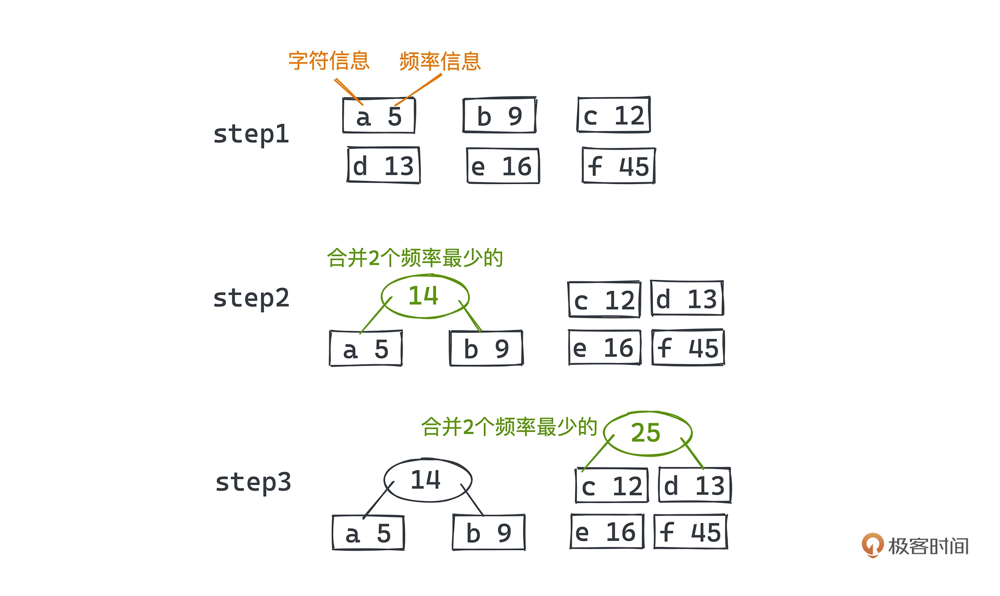
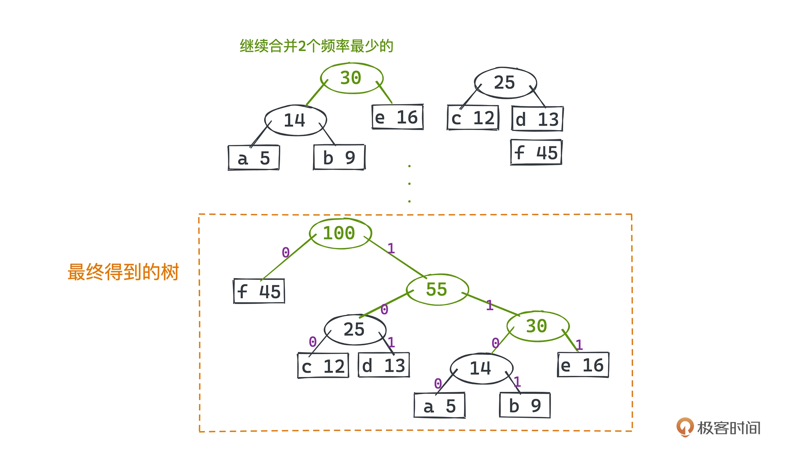

# 哈夫曼树

## 哈夫曼编码

哈夫曼思想非常简单，就是让出现概率更高的字符用更短的编码表示，出现概率低一些的字符则用更长的编码表示。

什么叫更短的编码呢，或者说什么是编码呢？

我们日常在用的 ASCII 编码就是对字符串的一种编码，每个字符都被编码到 0-127 的范围里，这也是在绝大部分编程语言里，一个 char 类型的字符只占用一个字节的原因；当然，一个字节实际可以表示 0-255 种可能，ASCII 编码规范本身没有定义 128-255 的范围，所以各大厂商都可以有自己的扩展定义去表示更多的字符。

所以 ASCII 作为一种典型的每个字符都等长编码的编码方法，有没有办法被压缩呢？是可以的。

比如，在自然语言场景里，我们知道字母 e 可能是最常出现的字符，如果用更短的编码去表示 e，而用其他更长的编码表示其他字符，就可以达到压缩文本编码长度的效果。

不过这里还有个问题，用等长编码比如 ASCII 编码，我们解码的时候直接 8 位、8 位的读，就很容易解出编码前的字符串，但**如果用变长编码，我们就需要处理解码歧义的问题**。

比如在字符串“ABCD”里，我们假设把 A 用 0 编码、B 用 1 编码、C 用 10 编码、D 用 11 编码。“ABCD”可以编码成二进制编码为“011011”，没问题，但如果中间不加任何分隔符，你并不能知道这个编码结果是由“ABCD”产生的还是由“ABBABB”产生的。

如果加了分隔符，分隔符本身也会引入额外的编码成本，甚至可能导致一个负向的优化。

为了解决这个问题，学生时代的哈夫曼（huffman）在 1952 年提出了最优前缀码的算法，也就是广泛应用在压缩领域的哈夫曼编码，它除了用更短的编码表示出现概率更高的字母，还引入了一个约束：**不同的字符编码间不能彼此成为对方的前缀**。

这条约束在解码的时候完美地避免了歧义的问题。比如刚刚如果把 A 编码成 0、B 编码成 10、C 编码成 110、D 编码成 111，这就是一种符合约束的前缀码编码方式。ABCD 就会编码成 010110111，一定只有一种解码方式。

那在不能成为对方前缀的约束下，具体如何根据出现频率选择合适的编码方式呢？

哈夫曼采用了**贪心的算法思想：用一棵二叉树来标记每个字符的编码方式，左分支代表 0、右分支代表 1，所有需要编码的字符都对应二叉树的叶子节点，根结点到该叶子结点的路径就代表着该字符的编码方式**。由于各节点是独立的不可能重复，每个字符又都唯一对应着一个叶子节点，所以它们一定不会互相成为对方的前缀。

下面我们要做的就是找到这样一个可以达到最大压缩效率的二叉树。

## 贪心的哈夫曼树

让我们举一个例子来理解哈夫曼树的编码方式。假设要对 a b c d e f 进行编码，它们在需要编码的文本中出现的频率分别是 5 9 12 13 16 45。 

那么如何编码可以让整个文本编码出来的二进制所占空间最少呢？

最开始，我们先把每个字符都看成一个独立的二叉树节点，节点中同时包含了字符信息和频率信息

然后，从中选两个出现频率最少的节点，a 和 b，我们把这两个节点合并成一棵子树，也就是用一个父节点的左右节点指针分别链向 a 和 b 两个节点，把两者的频率之和作为父节点的频率。

之后，我们把这个频率为 14 的树放回所有的节点里（14 12 13 16 45），再从中继续选择最小的两个节点 c 和 d 合并成一棵新的树。更新之后的所有节点就是下面这些，其中 a、b、c、d 节点都被替换成了新的合成节点：

(a, b)   14

(c, d)    25

e           16

f            45

不断进行这样的操作，最终就可以得到这样一棵树：

假设树的左链代表 0，右链代表 1，a b c d e f 对应的编码为：

f   0

c  100

d  101

a   1100

b   1101

e    111

看完这个过程，相信你对为什么这样编码也有一些想法了，它非常直观，我们来一起研究一下。

* 首先为了不用额外的分隔符，一种让解码不产生歧义的办法就是引入前缀码规则，对应到树上就是每个字符都编码成根节点到某个叶子节点的路径。
* 然后为了“出现频率最高的字符用最短的方式编码”的策略，显然，我们需要让出现频率最高的树出现在最短的路径里，出现频率最低的树则放到更长的路径里。

因为每次将两颗树合并到一起时，都会导致这两颗树里所有叶子节点的高度加 1，也就是其中所有的字符编码长度都会 +1，所以，为了达到最优编码的目标，我们会从出现频率最低的节点开始合并。最后我们合并完新的树，也要把新树的频率变成这两颗树的频数之和，它代表了这颗树下所有字符出现的频率。

**这样每次找出最低的两个树合并，就必然能得到一个整体最优的编码方式，也就是哈夫曼编码的思路了。**

这背后的思想其实就是贪心算法，也就是在每一次决策时都采取在当前状态下最优的选择，从而得到整体最优解的算法。当然，也不是所有的场景都能使用贪心算法的，比如经典的背包问题，采用贪心算法虽然能得到局部最优解，但就不能得到全局最优解。而哈夫曼树则是一个贪心算法发挥作用的很好的例子。

## 哈夫曼树实现

现在有了思路，相关的实现其实就非常简单了。

先说编码的部分，实质就是要建立这样一棵基于贪心算法的哈夫曼树。二叉树的相关概念相信你已经非常熟悉了，所以这里的核心就是如何做到每次都可以快速选出频率最低的两棵树。

怎么做呢？相信你已经想到了，我们之前学的堆就是用来维护动态序列中最小值的利器。

假设一共要对 N 个节点进行编码，堆中最多有 N 个节点，每次合并涉及两次取出元素和一次放回元素，时间复杂度都是 O(logN)，整体时间复杂度为 O(N*logN)。

C++ 代码参考：

[huffman.cpp](./code/huffman.cpp)

## HPACK

HTTP 是当今最广为使用的互联网传输协议。HTTP/2.0 在编码方面做了什么样的改进，比 HTTP/1.1 的传输更快呢？

HPACK 是 HTTP/2.0 为了降低 HTTP payload 大小从而提高传输效率的杀招，应用了静态表、动态表和哈夫曼编码三种技术，把冗余的 HTTP 头信息大大压缩，常常可以达到 50% 以上的压缩率。

### 引入 HPACK 的价值

早期采用 HTTP 的互联网应用，只涉及数据的展示，所以我们最初设计 HTTP 的时候没有引入状态，但是后期随着 Web2.0 的繁荣发展，网站不再只是展示这么简单，会和用户产生更多的交互，让用户产生内容，于是也引入了“登录”等有状态的功能。

要基于 HTTP 实现相关应用，我们常用的做法就是把用于鉴权的令牌或者其他“状态”携带在 HTTP 头里，在客户端和服务端之间来回传递。

出于安全需要，这种鉴权的令牌往往非常冗长，http header 常常比 http body 还要大，这就带来了很大的开销。所以 HTTP/2.0 通过引入 HPACK 压缩协议头，就带来了很大的价值。

而且 HTTP/1.1 之前的 HTTP 协议传输的内容很简单，可以认为就是一串文本在互联网上直接传递，没有任何编码，这也给我们的压缩算法带来了很大的压缩空间。

1.HPACK 中的静态表

首先我们来看一下 HPACK 的第一个手段：静态表，它其实就是对 HTTP 头报文里最常见的文本进行了一种编码。静态表也是非常常用的压缩手段。HTTP/2.0 一共对 61 个常用的头，以及头和值的组合做了编码。

比如 HTTP 的几种请求方法，GET、POST 等，都编码到了一张范围为 1-61 的索引表里，这样原来的":method GET"等字符串需要的空间就小多了。

2.HPACK 中的动态表

但是只是如此的话，我们能压缩的报文就非常有限了，怎么办呢？

我们应该还允许客户端和服务端，通过通信的方式，维护一张动态的“字典”，这样用索引号就可以代表一串很长的文本，减少在这次 HTTP/2 连接里反复出现的一些自定义字段的载荷。

尤其是常常用来保留用户身份凭证的cookies，因为安全性和加密算法的需要，它们往往设计的比较长，很多时候甚至导致 header 的长度比 body 还要长。

在 http/1.1 之前的协议里，每次通信都需要传递冗长且重复的信息，显然会带来巨大的开销。动态表就很好地解决了这个问题。

3.HPACK 中的哈夫曼编码

其实只用动态表和静态表已经可以做到很好的压缩 header 了，但是受限于静态表和动态表的大小，我们并不能用它们压缩任意字符。

哈夫曼编码，就是对静态表和动态表能力的一种补充，HPACK 在引入了哈夫曼编码之后，可以达到对 HTTP 报文高达 30%-80% 的压缩率。

### 小结

HPACK 是 HTTP/2.0 为了降低 HTTP payload 大小从而提高传输效率的杀招，应用了静态表、动态表和哈夫曼编码三种技术，把冗余的 HTTP 头信息大大压缩，常常可以达到 50% 以上的压缩率。

前两招静态表和动态表的思想其实非常常见。

比如在设计消息系统时，微服务架构下经常涉及消息在不同系统间传递的需求，如果只是为了定位消息而不用真的读取消息体，我们完全可以把消息编码成“消息 ID + 消息体”的格式，存储在数据库或者其他缓存系统中，这样，在系统间传递的时候只需要传递 ID 即可，等真的需要取出消息体的时候，再到数据库等系统里读取具体内容。这可以大大减少系统通信的开销，背后其实就是类似动态表的思想，你可以举一反三。

第三招哈夫曼编码，引入不同的字符编码间不能彼此成为对方前缀的约束下，使用哈夫曼树来编码。哈夫曼树基于贪心的思想，以及用树对编码进行抽象的想法，也非常精巧。