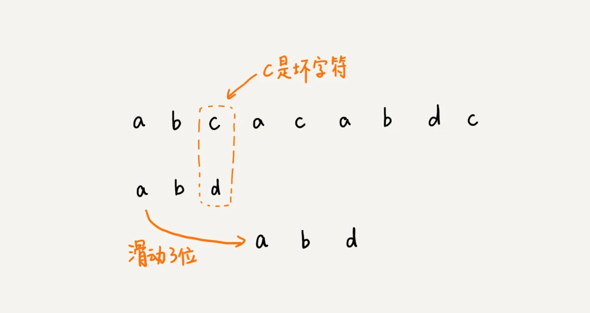
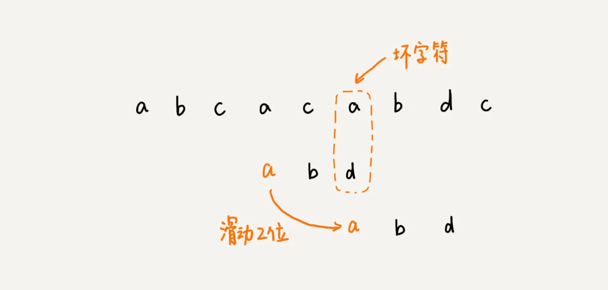
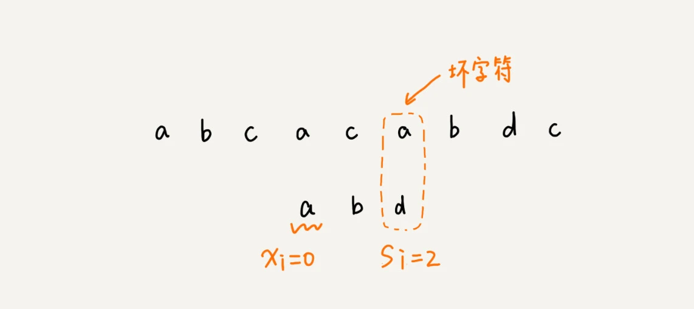
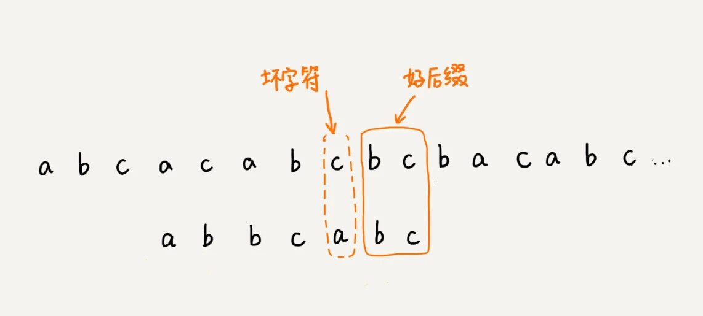
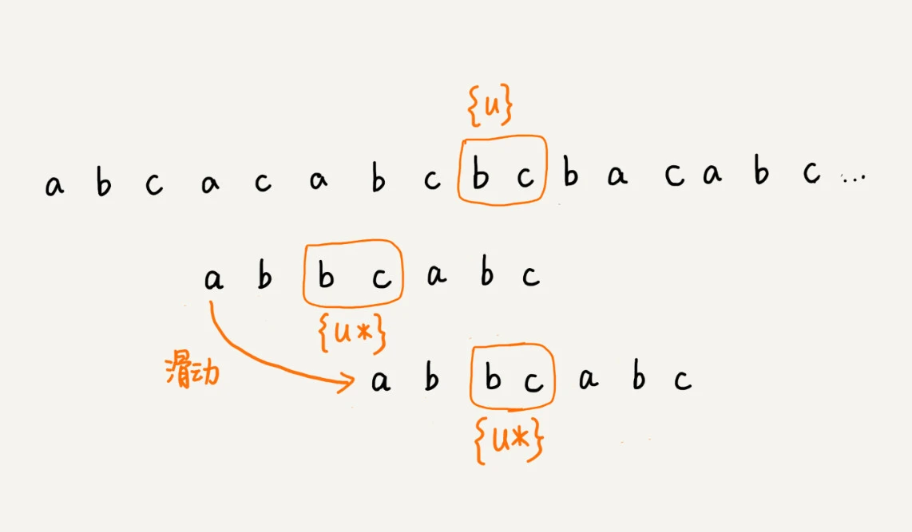
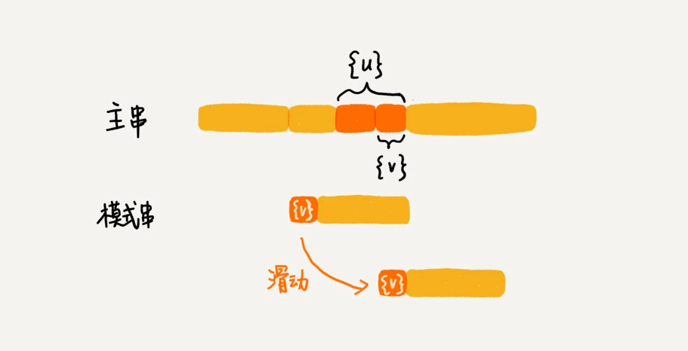

# 字符串匹配算法

单模式字符串匹配算法有简单的BF 算法和 RK 算法，难懂的BM 算法和 KMP 算法。

多模式字符串匹配算法，就是在一个串中同时查找多个串，有 Trie 树和 AC 自动机。

## BF算法

BF(Brute Force) 算法是最简单、粗暴的字符串匹配算法，它的实现思路是，拿模式串与主串中所有子串匹配，看是否有能匹配的子串。BF算法的思想可以用一句话来概括，那就是，**我们在主串中，检查起始位置分别是 0、1、2....n-m 且长度为 m 的 n-m+1 个子串，看有没有跟模式串匹配的。**

时间复杂度也比较高，是 O(n*m)，n、m 表示主串和模式串的长度。不过，在实际的软件开发中，因为这种算法实现简单，对于处理小规模的字符串匹配很好用。

## RK算法

RK 算法的全称叫 Rabin-Karp 算法，是由它的两位发明者 Rabin 和 Karp 的名字来命名的。

RK 算法的思路是这样的：我们通过哈希算法对主串中的 n-m+1 个子串分别求哈希值，然后逐个与模式串的哈希值比较大小。如果某个子串的哈希值与模式串相等，那就说明对应的子串和模式串匹配了。因为哈希值是一个数字，数字之间比较是否相等是非常快速的，所以模式串和子串比较的效率就提高了。

> 假设要匹配的字符串的字符集中只包含 K 个字符，我们可以用一个 K 进制数来表示一个子串，这个 K 进制数转化成十进制数，作为子串的哈希值。比如要处理的字符串只包含 a～z 这 26 个小写字母，那我们就用二十六进制来表示一个字符串。我们把 a～z 这 26 个字符映射到 0～25 这 26 个数字，a 就表示 0，b 就表示 1，以此类推，z 表示 25。
>
> 这种哈希算法有一个特点，在主串中，相邻两个子串的哈希值的计算公式有一定关系。相邻两个子串 s[i-1]和 s[i]（i 表示子串在主串中的起始位置，子串的长度都为 m），对应的哈希值计算公式有交集，也就是说，我们可以使用 s[i-1]的哈希值很快的计算出 s[i]的哈希值：
> $$
> h[i-1]对应子串s[i-1,i+m-2]的哈希值，h[i]对应子串s[i,i+m-1]的哈希值\\
> h[i-1]=26^{m-1}*(s[i-1]-'a')+26^{m-2}*(s[i]-'a')+...+26^0*(s[i+m-1]-'a')\\
> h[i]=26^{m-1}*(s[i]-'a')+...+26^1*(s[i+m-2]-'a')+26^0*(s[i+m-1]-'a')\\
> h[i]=(h[i-1] - 26^{m-1}*s[i-1]-'a'))*26+26^0*(s[i+m-1]-'a')
> $$
> 不过，这里有一个小细节需要注意，那就是 26^(m-1) 这部分的计算，我们可以通过查表的方法来提高效率。我们事先计算好 26^0^、26^1^、26^2^……26^(m-1)^，并且存储在一个长度为 m 的数组中，公式中的“次方”就对应数组的下标。当我们需要计算 26 的 x 次方的时候，就可以从数组的下标为 x 的位置取值，直接使用，省去了计算的时间。
>
> 这里还有一个问题就是，模式串很长，相应的主串中的子串也会很长，通过上面的哈希算法计算得到的哈希值就可能很大，超过了计算机中整型数据可以表示的范围。这样设计的哈希算法是没有散列冲突的，也就是说，一个字符串与一个二十六进制数一一对应，不同的字符串的哈希值肯定不一样。实际上，我们为了能将哈希值落在整型数据范围内，可以牺牲一下，允许哈希冲突。
>
> 哈希算法的设计方法有很多。假设字符串中只包含 a～z 这 26 个英文字母，那我们每个字母对应一个数字，比如 a 对应 1，b 对应 2，以此类推，z 对应 26。我们可以把字符串中每个字母对应的数字相加，最后得到的和作为哈希值。这种哈希算法产生的哈希值的数据范围就相对要小很多了。不过这种哈希算法的哈希冲突概率也是挺高的。当然，还有很多更加优化的方法，比如将每一个字母从小到大对应一个素数，而不是 1，2，3……这样的自然数，这样冲突的概率就会降低一些。当我们发现一个子串的哈希值跟模式串的哈希值相等的时候，我们只需要再对比一下子串和模式串本身就好了。
>
> 所以，哈希算法的冲突概率要相对控制得低一些，如果存在大量冲突，就会导致 RK 算法的时间复杂度退化，效率下降。极端情况下，如果存在大量的冲突，每次都要再对比子串和模式串本身，那时间复杂度就会退化成 O(n*m)。但也不要太悲观，一般情况下，冲突不会很多，RK 算法的效率还是比 BF 算法高的。

整个 RK 算法包含两部分，计算子串哈希值和模式串哈希值与子串哈希值之间的比较。第一部分，前面分析了，可以通过设计特殊的哈希算法，只需要扫描一遍主串就能计算出所有子串的哈希值了，所以这部分的时间复杂度是 O(n)。模式串哈希值与每个子串哈希值之间的比较的时间复杂度是 O(1)，总共需要比较 n-m+1 个子串的哈希值，所以，这部分的时间复杂度也是 O(n)。所以，RK 算法整体的时间复杂度就是 O(n)。

RK 算法是借助哈希算法对 BF 算法进行改造，即对每个子串分别求哈希值，然后拿子串的哈希值与模式串的哈希值比较，减少了比较的时间。所以，理想情况下，RK 算法的时间复杂度是 O(n)，跟 BF 算法相比，效率提高了很多。不过这样的效率取决于哈希算法的设计方法，如果存在冲突的情况下，时间复杂度可能会退化。极端情况下，哈希算法大量冲突，时间复杂度就退化为 O(n*m)。

## BM算法

BM（Boyer-Moore）算法，是一种非常高效的字符串匹配算法，有实验统计，它的性能是著名的KMP 算法的 3 到 4 倍。

模式串和主串的匹配过程可以看作模式串在主串中不停地往后滑动。当遇到不匹配的字符时，BF 算法和 RK 算法的做法是模式串往后滑动一位，然后从模式串的第一个字符开始重新匹配。而BM算法则是根据规则，跳过一些肯定不会匹配的情况，一次性把模式串往后多滑动几位:

BF和RK算法按模式串的下标从小到大的顺序，依次与主串中的字符进行匹配的。而 BM 算法是按照模式串下标从大到小的顺序，倒着匹配的。

BM 算法包含**坏字符规则**（bad character rule）和**好后缀规则**（good suffix shift）。

模式串的末尾最后一个字符如果无法匹配，这个没有匹配的字符叫作**坏字符**（主串中的字符），此时使用**坏字符规则**进行滑动。

模式串的末尾最后一个字符可以匹配，末尾最大可匹配字符串称为好后缀，此时使用**好后缀规则**进行滑动。

### 坏字符规则

从模式串的末尾往前倒着匹配，当发现某个字符没法匹配的时候，我们把这个没有匹配的字符叫作坏字符（主串中的字符）。

拿坏字符 c 在模式串中查找，发现模式串中并不存在这个字符，这时可以将模式串直接往后滑动到坏字符c 后面的位置，继续匹配：

这时坏字符 a 在模式串中是存在的，则将模式串滑动到让两个 a 上下对齐，如果坏字符在模式串出现多次，则将模式串最后出现的坏字符与主串中的坏字符对齐：

当发生不匹配的时候，我们把坏字符对应的模式串中的字符下标记作 si。如果坏字符在模式串中存在，我们把这个坏字符在模式串中的下标记作 xi。如果不存在，我们把 xi 记作 -1。那模式串往后移动的位数就等于 si-xi。（注意，我这里说的下标，都是字符在模式串的下标）。特别说明一点，如果坏字符在模式串里多处出现，那我们在计算 xi 的时候，选择最靠后的那个，因为这样不会让模式串滑动过多，导致本来可能匹配的情况被滑动略过。

假设模式串末尾角标si，坏字符最后一次在模式串出现的位置是xi（未出现记为-1），则模式串往后移动的位数等于 si-xi。

BM 算法单纯使用坏字符规则，在最好情况下的时间复杂度是 O(n/m)。比如，主串是 aaabaaabaaabaaab，模式串是 aaaa。每次比对，模式串都可以直接后移四位。

不过，单纯使用坏字符规则还是不够的。因为根据 si-xi 计算出来的移动位数，有可能是负数，比如主串是 aaaaaaaaaaaaaaaa，模式串是 baaa。不但不会向后滑动模式串，还有可能倒退。所以，BM 算法还需要用到“好后缀规则”。

### 好后缀规则

如果模式串和主串末尾的字符可以匹配，如下最大可匹配字符bc是好后缀：

将好后缀bc记作{u}。如果在模式串中可以找到其他匹配{u}的子串，将最后一个匹配的子串记为{u*}。

将模式串滑动到{u*}与主串的{u}对齐的位置：

如果在模式串中找不到另一个可以匹配{u}的子串，此时还需要根据主串{u}的后缀子串和模式串的前缀子串是否匹配分两种情况。比如 abc 的后缀子串有c和bc，前缀子串有 a和ab。

如果主串{u}的后缀子串和模式串的前缀子串能够匹配，则将最长的能够匹配的部分记为{v}。然后可以将模式串滑动到如下图所示的位置：

1.模式串的任何前缀子串也无法与{u}的任何后缀子串匹配，则可以将模式串滑动到{u}后面的位置：

2.模式串的前缀子串{v}与{u}的后缀子串匹配，则可以将模式串滑动到模式串的前缀子串与主串{u}的后缀子串对齐的位置：