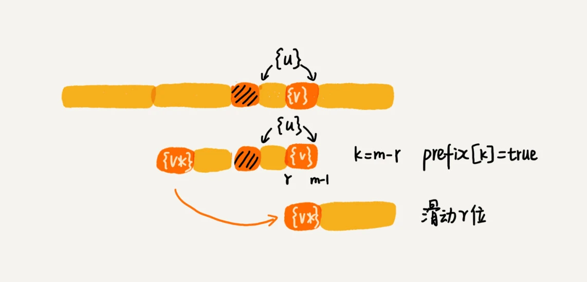
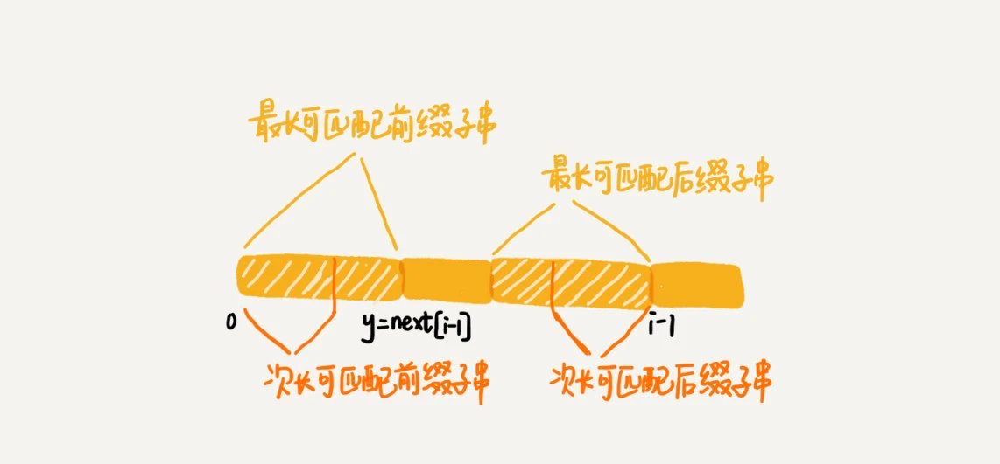
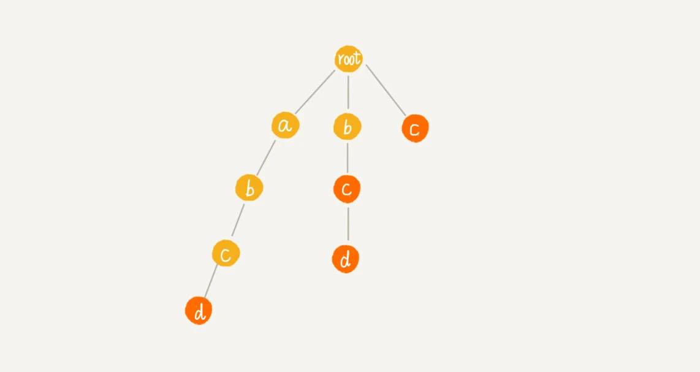
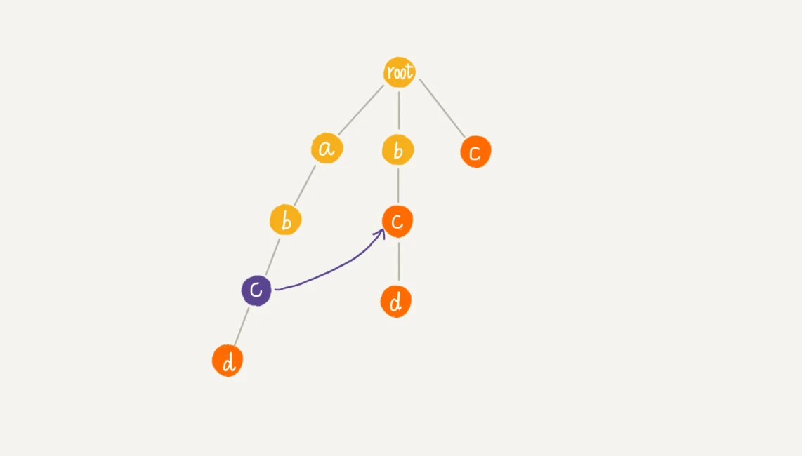
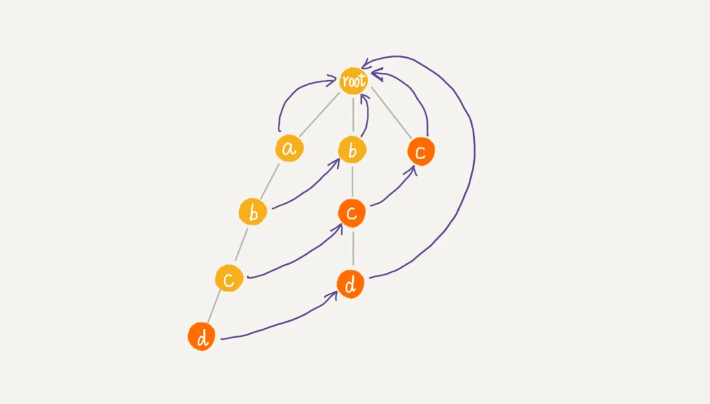
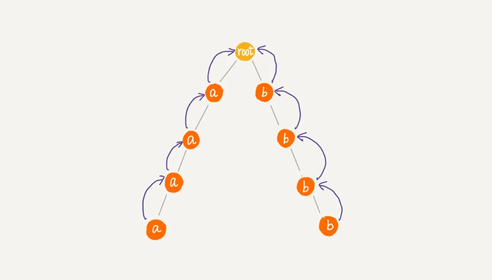
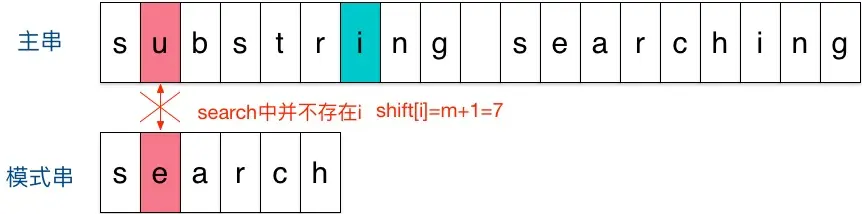
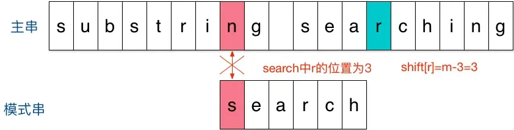
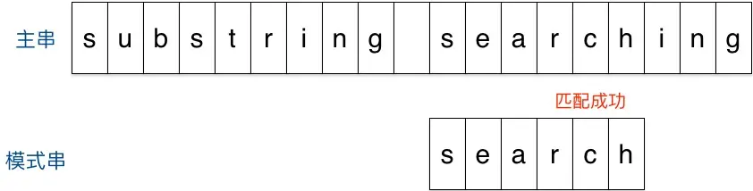

# 字符串匹配算法

单模式字符串匹配算法，是在一个模式串和一个主串之间进行匹配，也就是说，在一个主串中查找一个模式串。有简单的BF 算法和 RK 算法，难懂的BM 算法和 KMP 算法。

多模式字符串匹配算法，就是在多个模式串和一个主串之间做匹配，也就是说，在一个主串中查找多个模式串。有 Trie 树和 AC 自动机。

## BF算法

BF(Brute Force) 算法是最简单、粗暴的字符串匹配算法，它的实现思路是，拿模式串与主串中所有子串匹配，看是否有能匹配的子串。BF算法的思想可以用一句话来概括，那就是，**我们在主串中，检查起始位置分别是 0、1、2....n-m 且长度为 m 的 n-m+1 个子串，看有没有跟模式串匹配的。**

时间复杂度也比较高，是 O(n*m)，n、m 表示主串和模式串的长度。不过，在实际的软件开发中，因为这种算法实现简单，对于处理小规模的字符串匹配很好用。

## RK算法

RK 算法的全称叫 Rabin-Karp 算法，是由它的两位发明者 Rabin 和 Karp 的名字来命名的。

RK 算法的思路是这样的：我们通过哈希算法对主串中的 n-m+1 个子串分别求哈希值，然后逐个与模式串的哈希值比较大小。如果某个子串的哈希值与模式串相等，那就说明对应的子串和模式串匹配了。因为哈希值是一个数字，数字之间比较是否相等是非常快速的，所以模式串和子串比较的效率就提高了。

> 假设要匹配的字符串的字符集中只包含 K 个字符，我们可以用一个 K 进制数来表示一个子串，这个 K 进制数转化成十进制数，作为子串的哈希值。比如要处理的字符串只包含 a～z 这 26 个小写字母，那我们就用二十六进制来表示一个字符串。我们把 a～z 这 26 个字符映射到 0～25 这 26 个数字，a 就表示 0，b 就表示 1，以此类推，z 表示 25。
>
> 这种哈希算法有一个特点，在主串中，相邻两个子串的哈希值的计算公式有一定关系。相邻两个子串 s[i-1]和 s[i]（i 表示子串在主串中的起始位置，子串的长度都为 m），对应的哈希值计算公式有交集，也就是说，我们可以使用 s[i-1]的哈希值很快的计算出 s[i]的哈希值：
> $$
> h[i-1]对应子串s[i-1,i+m-2]的哈希值，h[i]对应子串s[i,i+m-1]的哈希值\\
> h[i-1]=26^{m-1}*(s[i-1]-'a')+26^{m-2}*(s[i]-'a')+...+26^0*(s[i+m-1]-'a')\\
> h[i]=26^{m-1}*(s[i]-'a')+...+26^1*(s[i+m-2]-'a')+26^0*(s[i+m-1]-'a')\\
> h[i]=(h[i-1] - 26^{m-1}*s[i-1]-'a'))*26+26^0*(s[i+m-1]-'a')
> $$
> 不过，这里有一个小细节需要注意，那就是 26^(m-1) 这部分的计算，我们可以通过查表的方法来提高效率。我们事先计算好 26^0^、26^1^、26^2^……26^(m-1)^，并且存储在一个长度为 m 的数组中，公式中的“次方”就对应数组的下标。当我们需要计算 26 的 x 次方的时候，就可以从数组的下标为 x 的位置取值，直接使用，省去了计算的时间。
>
> 这里还有一个问题就是，模式串很长，相应的主串中的子串也会很长，通过上面的哈希算法计算得到的哈希值就可能很大，超过了计算机中整型数据可以表示的范围。这样设计的哈希算法是没有散列冲突的，也就是说，一个字符串与一个二十六进制数一一对应，不同的字符串的哈希值肯定不一样。实际上，我们为了能将哈希值落在整型数据范围内，可以牺牲一下，允许哈希冲突。
>
> 哈希算法的设计方法有很多。假设字符串中只包含 a～z 这 26 个英文字母，那我们每个字母对应一个数字，比如 a 对应 1，b 对应 2，以此类推，z 对应 26。我们可以把字符串中每个字母对应的数字相加，最后得到的和作为哈希值。这种哈希算法产生的哈希值的数据范围就相对要小很多了。不过这种哈希算法的哈希冲突概率也是挺高的。当然，还有很多更加优化的方法，比如将每一个字母从小到大对应一个素数，而不是 1，2，3……这样的自然数，这样冲突的概率就会降低一些。当我们发现一个子串的哈希值跟模式串的哈希值相等的时候，我们只需要再对比一下子串和模式串本身就好了。
>
> 所以，哈希算法的冲突概率要相对控制得低一些，如果存在大量冲突，就会导致 RK 算法的时间复杂度退化，效率下降。极端情况下，如果存在大量的冲突，每次都要再对比子串和模式串本身，那时间复杂度就会退化成 O(n*m)。但也不要太悲观，一般情况下，冲突不会很多，RK 算法的效率还是比 BF 算法高的。

整个 RK 算法包含两部分，计算子串哈希值和模式串哈希值与子串哈希值之间的比较。第一部分，前面分析了，可以通过设计特殊的哈希算法，只需要扫描一遍主串就能计算出所有子串的哈希值了，所以这部分的时间复杂度是 O(n)。模式串哈希值与每个子串哈希值之间的比较的时间复杂度是 O(1)，总共需要比较 n-m+1 个子串的哈希值，所以，这部分的时间复杂度也是 O(n)。所以，RK 算法整体的时间复杂度就是 O(n)。

RK 算法是借助哈希算法对 BF 算法进行改造，即对每个子串分别求哈希值，然后拿子串的哈希值与模式串的哈希值比较，减少了比较的时间。所以，理想情况下，RK 算法的时间复杂度是 O(n)，跟 BF 算法相比，效率提高了很多。不过这样的效率取决于哈希算法的设计方法，如果存在冲突的情况下，时间复杂度可能会退化。极端情况下，哈希算法大量冲突，时间复杂度就退化为 O(n*m)。

## BM算法

BM（Boyer-Moore）算法，是一种非常高效的字符串匹配算法，有实验统计，它的性能是著名的KMP 算法的 3 到 4 倍。

模式串和主串的匹配过程可以看作模式串在主串中不停地往后滑动。当遇到不匹配的字符时，BF 算法和 RK 算法的做法是模式串往后滑动一位，然后从模式串的第一个字符开始重新匹配。而BM算法则是根据规则，跳过一些肯定不会匹配的情况，一次性把模式串往后多滑动几位:

BF和RK算法按模式串的下标从小到大的顺序，依次与主串中的字符进行匹配的。而 BM 算法是按照模式串下标从大到小的顺序，倒着匹配的。

BM 算法包含**坏字符规则**（bad character rule）和**好后缀规则**（good suffix shift）。

模式串的末尾最后一个字符如果无法匹配，这个没有匹配的字符叫作**坏字符**（主串中的字符），此时使用**坏字符规则**进行滑动。

模式串的末尾最后一个字符可以匹配，末尾最大可匹配字符串称为好后缀，此时使用**好后缀规则**进行滑动。

### 坏字符规则

从模式串的末尾往前倒着匹配，当发现某个字符没法匹配的时候，我们把这个没有匹配的字符叫作坏字符（主串中的字符）。

拿坏字符 c 在模式串中查找，发现模式串中并不存在这个字符，这时可以将模式串直接往后滑动到坏字符c 后面的位置，继续匹配：


这时坏字符 a 在模式串中是存在的，则将模式串滑动到让两个 a 上下对齐，如果坏字符在模式串出现多次，则将模式串最后出现的坏字符与主串中的坏字符对齐：


当发生不匹配的时候，我们把坏字符对应的模式串中的字符下标记作 si。如果坏字符在模式串中存在，我们把这个坏字符在模式串中的下标记作 xi。如果不存在，我们把 xi 记作 -1。那模式串往后移动的位数就等于 si-xi。（注意，我这里说的下标，都是字符在模式串的下标）。特别说明一点，如果坏字符在模式串里多处出现，那我们在计算 xi 的时候，选择最靠后的那个，因为这样不会让模式串滑动过多，导致本来可能匹配的情况被滑动略过。

假设模式串末尾角标si，坏字符最后一次在模式串出现的位置是xi（未出现记为-1），则模式串往后移动的位数等于 si-xi。


BM 算法单纯使用坏字符规则，在最好情况下的时间复杂度是 O(n/m)。比如，主串是 aaabaaabaaabaaab，模式串是 aaaa。每次比对，模式串都可以直接后移四位。

不过，单纯使用坏字符规则还是不够的。因为根据 si-xi 计算出来的移动位数，有可能是负数，比如主串是 aaaaaaaaaaaaaaaa，模式串是 baaa。不但不会向后滑动模式串，还有可能倒退。所以，BM 算法还需要用到“好后缀规则”。

### 好后缀规则

如果模式串和主串末尾的字符可以匹配，如下最大可匹配字符bc是好后缀：


将好后缀bc记作{u}。如果在模式串中可以找到其他匹配{u}的子串，将最后一个匹配的子串记为{u*}。

将模式串滑动到{u*}与主串的{u}对齐的位置：


如果在模式串中找不到另一个可以匹配{u}的子串，此时还需要根据主串{u}的后缀子串和模式串的前缀子串是否匹配分两种情况。比如 abc 的后缀子串有c和bc，前缀子串有 a和ab。

如果主串{u}的后缀子串和模式串的前缀子串能够匹配，则将最长的能够匹配的部分记为{v}。然后可以将模式串滑动到如下图所示的位置：


1.模式串的任何前缀子串也无法与{u}的任何后缀子串匹配，则可以将模式串滑动到{u}后面的位置。

2.模式串的前缀子串{v}与{u}的后缀子串匹配，则可以将模式串滑动到模式串的前缀子串与主串{u}的后缀子串对齐的位置。


当模式串和主串中的某个字符不匹配的时候，如何选择用好后缀规则还是坏字符规则，来计算模式串往后滑动的位数？

我们可以分别计算好后缀和坏字符往后滑动的位数，然后取两个数中最大的，作为模式串往后滑动的位数。

### BM算法代码实现

为了快速查找坏字符在模式串中出现的位置，可以将每个坏字符对应的角标位置存储在散列表中，键为字符，值为坏字符在模式串最后一次出现的位置。

假设字符串的字符集是 ASCII 码值，可以用大小为 256 的数组实现散列表，用数组的下标来代表字符的ASCII 码值，具体存储坏字符在模式串中最后一次出现的位置。如果字符串的字符集范围非常大，就使用常规方法实现散列表。


代码实现：

```java
private static final int SIZE = 256; // 全局变量或成员变量
private void generateBC(char[] b, int m, int[] bc) {
  for (int i = 0; i < SIZE; ++i) {
    bc[i] = -1; // 初始化bc
  }
  for (int i = 0; i < m; ++i) {
    int ascii = (int)b[i]; // 计算b[i]的ASCII值
    bc[ascii] = i;
  }
}
```


前面讲过好后缀的处理规则中最核心的内容：

* 在模式串中，查找跟好后缀匹配的另一个子串；
* 在好后缀的后缀子串中，查找最长的、能跟模式串前缀子串匹配的后缀子串；


为了快速查找跟好后缀{u}最后一个相匹配的后缀子串{u\*}，将后缀子串的长度和相匹配的{u*}位置保存起来。

用suffix 数组来保存，下标表示后缀子串的长度，值存储在模式串中跟好后缀{u}最后一个相匹配的子串{u*}的起始下标值。

另外用boolean类型的prefix 数组存储该长度的后缀是否与前缀匹配。


计算过程：拿下标从 0 到 i 的子串（i 可以是 0 到 m-2）与整个模式串，求公共后缀子串。

如果公共后缀子串的长度是 k，就记录 suffix[k]=j（j 表示公共后缀子串的起始下标）。如果 j 等于 0，公共后缀子串也是模式串的前缀子串，就记录 prefix[k]=true。


代码实现：

```java
// b表示模式串，m表示长度，suffix，prefix数组事先申请好了
private void generateGS(char[] b, int m, int[] suffix, boolean[] prefix) {
  for (int i = 0; i < m; ++i) { // 初始化
    suffix[i] = -1;
    prefix[i] = false;
  }
  for (int i = 0; i < m - 1; ++i) { // b[0, i]
    int j = i;
    int k = 0; // 公共后缀子串长度
    while (j >= 0 && b[j] == b[m-1-k]) { // 与b[0, m-1]求公共后缀子串
      --j;
      ++k;
      suffix[k] = j+1; //j+1表示公共后缀子串在b[0, i]中的起始下标
    }
    if (j == -1) prefix[k] = true; //如果公共后缀子串也是模式串的前缀子串
  }
}
```

有了这两个数组之后，我们现在来看，在模式串跟主串匹配的过程中，遇到不能匹配的字符时，如何根据好后缀规则，计算模式串往后滑动的位数？

假设好后缀的长度是 k。

如果 suffix[k] 不等于 -1(-1表示不存在匹配的字串)，就将模式串往后滑动 j-suffix[k]+1 位（j 表示坏字符对应的模式串中的字符下标）。


如果 suffix[k] 等于 -1，表示模式串中不存在另一个跟好后缀匹配的子串片段。

好后缀的后缀子串 b[r, m-1]（其中，r 取值从 j+2 到 m-1）的长度 k=m-r，如果 prefix[k]等于 true，表示长度为 k 的后缀子串，有可匹配的前缀子串，这样我们可以把模式串后移 r 位。



如果两条规则都没有找到可以匹配好后缀及其后缀子串的子串，我们就将整个模式串后移 m 位。


BM 算法的完整版代码实现：

```java

// a,b表示主串和模式串；n，m表示主串和模式串的长度。
public int bm(char[] a, int n, char[] b, int m) {
  int[] bc = new int[SIZE]; // 记录模式串中每个字符最后出现的位置
  generateBC(b, m, bc); // 构建坏字符哈希表
  int[] suffix = new int[m];
  boolean[] prefix = new boolean[m];
  generateGS(b, m, suffix, prefix);
  int i = 0; // j表示主串与模式串匹配的第一个字符
  while (i <= n - m) {
    int j;
    for (j = m - 1; j >= 0; --j) { // 模式串从后往前匹配
      if (a[i+j] != b[j]) break; // 坏字符对应模式串中的下标是j
    }
    if (j < 0) {
      return i; // 匹配成功，返回主串与模式串第一个匹配的字符的位置
    }
    int x = j - bc[(int)a[i+j]];
    int y = 0;
    if (j < m-1) { // 如果有好后缀的话
      y = moveByGS(j, m, suffix, prefix);
    }
    i = i + Math.max(x, y);
  }
  return -1;
}

// j表示坏字符对应的模式串中的字符下标; m表示模式串长度
private int moveByGS(int j, int m, int[] suffix, boolean[] prefix) {
  int k = m - 1 - j; // 好后缀长度
  if (suffix[k] != -1) return j - suffix[k] +1;
  for (int r = j+2; r <= m-1; ++r) {
    if (prefix[m-r] == true) {
      return r;
    }
  }
  return m;
}
```

### BM算法的性能分析及优化

我们先来分析 BM 算法的内存消耗。整个算法用到了额外的 3 个数组，其中 bc 数组的大小跟字符集大小有关，suffix 数组和 prefix 数组的大小跟模式串长度 m 有关。如果我们处理字符集很大的字符串匹配问题，bc 数组对内存的消耗就会比较多。因为好后缀和坏字符规则是独立的，如果我们运行的环境对内存要求苛刻，可以只使用好后缀规则，不使用坏字符规则，这样就可以避免 bc 数组过多的内存消耗。不过，单纯使用好后缀规则的 BM 算法效率就会下降一些了。

BM 算法的时间复杂度分析起来是非常复杂，这篇论文“[A new proof of the linearity of the Boyer-Moore string searching algorithm](https://dl.acm.org/doi/10.1109/SFCS.1977.3)”证明了在最坏情况下，BM 算法的比较次数上限是 5n。这篇论文“[Tight bounds on the complexity of the Boyer-Moore string matching algorithm](http://dl.acm.org/citation.cfm?id=127830)”证明了在最坏情况下，BM 算法的比较次数上限是 3n。

### BM算法小结

BM 算法核心思想是，利用模式串本身的特点，在模式串中某个字符与主串不能匹配的时候，将模式串往后多滑动几位，以此来减少不必要的字符比较，提高匹配的效率。BM 算法构建的规则有两类，坏字符规则和好后缀规则。好后缀规则可以独立于坏字符规则使用。因为坏字符规则的实现比较耗内存，为了节省内存，我们可以只用好后缀规则来实现 BM 算法。

## KMP算法

**K**nuth-**M**orris-**P**ratt 字符串查找算法，简称为 **KMP算法**，用于在一个主串S内查找一个模式串P的出现位置。

这个算法由 Donald Knuth、Vaughan Pratt、James H. Morris 三人于 1977 年联合发表，故取这 3 人的姓氏命名此算法。

KMP 算法的核心思想是在模式串和主串匹配的过程中，每当遇到坏字符后，对于已经比对过的好前缀，根据某种规律将模式串一次性滑动很多位。

### KMP算法基本原理

在模式串和主串匹配的过程中，把不能匹配的那个字符仍然叫作**坏字符**，把已经匹配的那段字符串叫作**好前缀**。

在好前缀本身的所有后缀子串中，查找最长的可以跟好前缀的前缀子串匹配的。假设最长的可匹配的前缀子串是{v}，长度是 k。每次遇到坏字符的时候就把 j 更新为 k，i 不变，然后继续比较。相当于把模式串一次性往后滑动 j-k 位。


**前缀** 指除了最后一个字符以外，一个字符串的全部头部组合；**后缀** 指除了第一个字符以外，一个字符串的全部尾部组合。

为了表述起来方便，将好前缀的所有后缀子串中，最长的前缀子串匹配的后缀子串，叫作**最长可匹配后缀子串**；对应的前缀子串，叫作**最长可匹配前缀子串**。


如何来求好前缀的最长可匹配前缀和后缀子串呢？这个问题不涉及主串，只需要通过模式串本身就能求解。可以事先预处理计算好。

KMP 算法提前构建一个数组，用来存储模式串中每个前缀（这些前缀都有可能是好前缀）的最长可匹配前缀子串的结尾字符下标。我们把这个数组定义为 next 数组，很多书中还给这个数组起了一个名字，叫失效函数（failure function）。**数组的下标是每个前缀结尾字符下标，数组的值是这个前缀的最长可以匹配前缀子串的结尾字符下标。**


有了 next 数组，我们很容易就可以实现 KMP 算法了。我先假设 next 数组已经计算好了，先给出 KMP 算法的框架代码。

```java
// a, b分别是主串和模式串；n, m分别是主串和模式串的长度。
public static int kmp(char[] a, int n, char[] b, int m) {
  int[] next = getNexts(b, m);
  int j = 0;
  for (int i = 0; i < n; ++i) {
    while (j > 0 && a[i] != b[j]) { // 一直找到a[i]和b[j]
      j = next[j - 1] + 1;
    }
    if (a[i] == b[j]) {
      ++j;
    }
    if (j == m) { // 找到匹配模式串的了
      return i - m + 1;
    }
  }
  return -1;
}
```


### 失效函数计算方法

我们按照下标从小到大，依次计算 next 数组的值。当我们要计算 next[i]的时候，前面的 next[0]，next[1]，……，next[i-1]应该已经计算出来了。利用已经计算出来的 next 值，我们是否可以快速推导出 next[i]的值呢？

如果 next[i-1]=k-1，也就是说，子串 b[0, k-1]是 b[0, i-1]的最长可匹配前缀子串。如果子串 b[0, k-1]的下一个字符 b[k]，与 b[0, i-1]的下一个字符 b[i]匹配，那子串 b[0, k]就是 b[0, i]的最长可匹配前缀子串。所以，next[i]等于 k。但是，如果 b[0, k-1]的下一字符 b[k]跟 b[0, i-1]的下一个字符 b[i]不相等呢？这个时候就不能简单地通过 next[i-1]得到 next[i]了。这个时候该怎么办呢？


我们假设 b[0, i]的最长可匹配后缀子串是 b[r, i]。如果我们把最后一个字符去掉，那 b[r, i-1]肯定是 b[0, i-1]的可匹配后缀子串，但不一定是最长可匹配后缀子串。所以，既然 b[0, i-1]最长可匹配后缀子串对应的模式串的前缀子串的下一个字符并不等于 b[i]，那么我们就可以考察 b[0, i-1]的次长可匹配后缀子串 b[x, i-1]对应的可匹配前缀子串 b[0, i-1-x]的下一个字符 b[i-x]是否等于 b[i]。如果等于，那 b[x, i]就是 b[0, i]的最长可匹配后缀子串。


可是，如何求得 b[0, i-1]的次长可匹配后缀子串呢？次长可匹配后缀子串肯定被包含在最长可匹配后缀子串中，而最长可匹配后缀子串又对应最长可匹配前缀子串 b[0, y]。于是，查找 b[0, i-1]的次长可匹配后缀子串，这个问题就变成，查找 b[0, y]的最长匹配后缀子串的问题了。



按照这个思路，我们可以考察完所有的 b[0, i-1]的可匹配后缀子串 b[y, i-1]，直到找到一个可匹配的后缀子串，它对应的前缀子串的下一个字符等于 b[i]，那这个 b[y, i]就是 b[0, i]的最长可匹配后缀子串。

```java
// b表示模式串，m表示模式串的长度
private static int[] getNexts(char[] b, int m) {
  int[] next = new int[m];
  next[0] = -1;
  int k = -1;
  for (int i = 1; i < m; ++i) {
    while (k != -1 && b[k + 1] != b[i]) {
      k = next[k];
    }
    if (b[k + 1] == b[i]) {
      ++k;
    }
    next[i] = k;
  }
  return next;
}
```

### KMP算法复杂度分析

KMP 算法只需要一个额外的 next 数组，数组的大小跟模式串相同。所以空间复杂度是 O(m)，m 表示模式串的长度。

KMP 算法包含两部分，第一部分是构建 next 数组，第二部分是借助 next 数组进行匹配。

构建 next 数组，仅一层循环，循环次数跟模式串长度m有关，所以构建 next 数组的时间复杂度是 O(m)。

借助 next 数组进行匹配，i 从 0 循环增长到 n-1，j 的总增长量与 i一致也为n。j = next[j]让 j 的值减少，但总减少量不会超过总增长量n。所以 while 循环的循环次数小于2n，借助 next 数组进行匹配的时间复杂度是 O(n)。

故综合两部分的时间复杂度，KMP 算法的时间复杂度是 O(m+n)。

### KMP算法小结

KMP 算法和 BM 算法的本质非常类似，都是根据规律在遇到坏字符的时候，把模式串往后多滑动几位。

BM 算法有两个规则，坏字符和好后缀。KMP 算法借鉴 BM 算法的思想，可以总结成好前缀规则。 next 数组的计算用一种类似动态规划的方法，按照下标 i 从小到大，依次计算 next[i]，并且 next[i]的计算通过前面已经计算出来的 next[0]，next[1]，……，next[i-1]来推导。

KMP 算法的时间复杂度是 O(n+m)。

c++代码实现：[kmp.cpp](./code/kmp.cpp)

## 敏感词过滤系统

很多支持用户发表文本内容的网站，比如 BBS，大都会有敏感词过滤功能，用来过滤掉用户输入的一些淫秽、反动、谩骂等内容。

实际上，这些功能最基本的原理就是字符串匹配算法，也就是通过维护一个敏感词的字典，当用户输入一段文字内容之后，通过字符串匹配算法，来查找用户输入的这段文字，是否包含敏感词。如果有，就用“***”把它替代掉。

对于访问量巨大的网站来说，比如淘宝，用户每天的评论数有几亿、甚至几十亿。对敏感词过滤系统的性能要求就要很高。**那如何才能实现一个高性能的敏感词过滤系统呢**？AC自动机这种**多模式串匹配算法**是这个系统的原型。

### Trie树实现的敏感词过滤

与单模式匹配算法相比，多模式匹配算法只需要扫描一遍主串，就能在主串中一次性查找多个模式串是否存在，从而大大提高匹配效率。

Trie 树就是一种多模式串匹配算法，用 Trie 树即可实现敏感词过滤功能：

对敏感词字典进行预处理，构建成 Trie 树结构，如果敏感词字典动态更新了，比如删除、添加了一个敏感词，那只需要动态更新一下 Trie 树就可以了。

当用户输入一个文本内容后，把用户输入的内容作为主串，从第一个字符（假设是字符 C）开始，在 Trie 树中匹配。当匹配到 Trie 树的叶子节点，或者中途遇到不匹配字符的时候，将主串的开始匹配位置后移一位，也就是从字符 C 的下一个字符开始，重新在 Trie 树中匹配。

基于 Trie 树的这种处理方法，有点类似单模式串匹配的 BF 算法。KMP 算法对 BF 算法进行改进，引入了 next 数组，让匹配失败时，尽可能将模式串往后多滑动几位。借鉴单模式串的优化改进方法，对多模式串 Trie 树进行改进的算法就是 AC 自动机。

### AC自动机

AC 自动机算法，全称是 Aho-Corasick 算法。

其实，Trie 树跟 AC 自动机之间的关系，就像单串匹配中朴素的串匹配算法，跟 KMP 算法之间的关系一样，只不过前者针对的是多模式串而已。所以，**AC 自动机实际上就是在 Trie 树之上，加了类似 KMP 的 next 数组，只不过此处的 next 数组是构建在树上罢了**。

如果代码表示，就是下面这个样子：

```java

public class AcNode {
  public char data; 
  public AcNode[] children = new AcNode[26]; // 字符集只包含a~z这26个字符
  public boolean isEndingChar = false; // 结尾字符为true
  public int length = -1; // 当isEndingChar=true时，记录模式串长度
  public AcNode fail; // 失败指针
  public AcNode(char data) {
    this.data = data;
  }
}
```

AC 自动机的构建，包含两个操作：

- 将多个模式串构建成 Trie 树；

- 在Trie树上构建失败指针。

  > 如果节点 i 的fail指针指向节点 j，就是说在Trie树中从root 到 j 所形成的字符串是 root到 i 所形成的字符串的最长后缀。 

**构建好 Trie 树之后，如何在它之上构建失败指针？**

有 4 个模式串 c，bc，bcd，abcd；主串是 abcd。



Trie 树中的每一个节点都有一个失败指针，它的作用和构建过程，跟 KMP 算法中的 next 数组极其相似。

例如下图中abc的c节点的失败指针指向abc的最长可匹配后缀子串bc的最后一个节点c。



树中相同深度的节点放到同一层，那么某个节点的失败指针只有可能出现在它所在层的上一层。

求某个节点的失败指针，可以通过已经求得的、深度更小的那些节点的失败指针来推导。失败指针的构建过程，是一个按层遍历树的过程。

首先 root 的失败指针为 NULL，也就是指向自己。

假设节点 p 的失败指针指向节点 q，然后看节点 p 的子节点 pc 对应的字符，是否也可以在节点 q 的子节点中找到。如果 pc和qc对应的字符相同，则将节点 pc 的失败指针指向节点 qc。

我们假设节点 p 的失败指针指向节点 q，我们看节点 p 的子节点 pc 对应的字符，是否也可以在节点 q 的子节点中找到。如果找到了节点 q 的一个子节点 qc，对应的字符跟节点 pc 对应的字符相同，则将节点 pc 的失败指针指向节点 qc。


如果节点 q 中没有子节点的字符等于节点 pc 包含的字符，则令 q=q->fail（fail 表示失败指针），继续上面的查找，直到 q 是 root 为止，如果还没有找到相同字符的子节点，就让节点 pc 的失败指针指向 root。


构建失败指针的java描述代码：

```java

public void buildFailurePointer() {
  Queue<AcNode> queue = new LinkedList<>();
  root.fail = null;
  queue.add(root);
  while (!queue.isEmpty()) {
    AcNode p = queue.remove();
    for (int i = 0; i < 26; ++i) {
      AcNode pc = p.children[i];
      if (pc == null) continue;
      if (p == root) {
        pc.fail = root;
      } else {
        AcNode q = p.fail;
        while (q != null) {
          AcNode qc = q.children[pc.data - 'a'];
          if (qc != null) {
            pc.fail = qc;
            break;
          }
          q = q.fail;
        }
        if (q == null) {
          pc.fail = root;
        }
      }
      queue.add(pc);
    }
  }
}
```

通过层级遍历来计算每个节点的子节点的失效指针，上面的例子，最后构建完成之后的 AC 自动机就是下面这个样子：



**在 AC 自动机上匹配主串的过程：**

在匹配过程中，主串从 i=0 开始，AC 自动机从指针 p=root 开始，假设模式串是 b，主串是 a。

- 如果 p 指向的节点有一个等于 b[i] 的子节点 x，就更新 p 指向 x，然后通过失败指针，检测一系列失败指针为结尾的路径是否是模式串。
- 如果 p 指向的节点没有等于 b[i] 的子节点，那让p指向p的失败指针p=p->fail，继续这 2 个过程。

java代码实现：

```java

public void match(char[] text) { // text是主串
  int n = text.length;
  AcNode p = root;
  for (int i = 0; i < n; ++i) {
    int idx = text[i] - 'a';
    while (p.children[idx] == null && p != root) {
      p = p.fail; // 失败指针发挥作用的地方
    }
    p = p.children[idx];
    if (p == null) p = root; // 如果没有匹配的，从root开始重新匹配
    AcNode tmp = p;
    while (tmp != root) { // 打印出可以匹配的模式串
      if (tmp.isEndingChar == true) {
        int pos = i-tmp.length+1;
        System.out.println("匹配起始下标" + pos + "; 长度" + tmp.length);
      }
      tmp = tmp.fail;
    }
  }
}
```

在上述代码基础上再遍历一遍文本内容（主串），就可以将文本中的所有敏感词替换成“***”。

**AC自动机构建的时间复杂度：**

将敏感词构建成 AC 自动机，包括构建 Trie 树以及构建失败指针。

Trie 树构建的时间复杂度是 O(m*len)，其中 len 表示敏感词的平均长度，m 表示敏感词的个数。

构建失败指针的时间复杂度是O(k*len)，其中k表示Trie 树中总的节点个数。每个节点构建失败指针的时候，最耗时的环节是 while 循环中的 q=q->fail，每运行一次这个语句，q 指向节点的深度都会减少 1，而树的高度最高也不会超过 len，所以每个节点构建失败指针的时间复杂度是 O(len)。

**用 AC 自动机做匹配的时间复杂度：**

for 循环依次遍历主串中的每个字符，for 循环内部最耗时的部分也是 while 循环，而这一部分的时间复杂度也是 O(len)，所以总的匹配的时间复杂度就是 O(n*len)。因为敏感词并不会很长，而且这个时间复杂度只是一个非常宽泛的上限，实际情况下，可能近似于 O(n)。

只有在极端情况下，AC 自动机的性能才会退化的跟 Trie 树一样：



c++代码实现：[aho_corasick.cpp](./code/aho_corasick.cpp)

### AC自动机小结

AC 自动机是基于 Trie 树的一种改进算法，它跟 Trie 树的关系，就像单模式串中，KMP 算法与 BF 算法的关系一样。KMP 算法中有一个非常关键的 next 数组，类比到 AC 自动机中就是失败指针。而且，AC 自动机失败指针的构建过程，跟 KMP 算法中计算 next 数组极其相似。 AC 自动机其实就是 KMP 算法在多模式串上的改造。

整个 AC 自动机算法包含两个部分，第一部分是将多个模式串构建成 AC 自动机，第二部分是在 AC 自动机中匹配主串。第一部分又分为两个小的步骤，一个是将模式串构建成 Trie 树，另一个是在 Trie 树上构建失败指针。

## Sunday算法

著名的KMP算法（Knuth-Morris-Pratt算法），让字符串匹配的时间复杂度降低到了`O(m+n)`，但现代文字处理器中，却很少使用KMP算法来做字符串匹配，因为还是太慢了。现在主流的算法是BM算法（Boyer-Moore算法），成功让平均时间复杂度降低到了`O(m/n)`，而Sunday算法，则是对BM算法的进一步小幅优化。

Sunday算法和BM算法稍有不同的是，Sunday算法是从前往后匹配，在匹配失败时关注的是主串中参加匹配的最末位字符的下一位字符。

- 如果该字符没有在模式串中出现则直接跳过，即移动位数 = 模式串长度 + 1；
- 否则，其移动位数 = 模式串长度 - 该字符最右出现的位置(以0开始) = 模式串中该字符最右出现的位置到尾部的距离 + 1。

下面举个例子说明下Sunday算法。假定现在要在主串”substring searching”中查找模式串”search”。

- 刚开始时，把模式串与文主串左边对齐：

  

- 结果发现在第2个字符处发现不匹配，不匹配时关注主串中参加匹配的最末位字符的下一位字符，即标粗的字符 `i`，因为模式串search中并不存在`i`，所以模式串直接跳过一大片，向右移动位数 = 匹配串长度 + 1 = 6 + 1 = 7，从 `i` 之后的那个字符（即字符`n`）开始下一步的匹配，如下图：

  

- 结果第一个字符就不匹配，再看主串中参加匹配的最末位字符的下一位字符，是’r’，它出现在模式串中的倒数第3位，于是把模式串向右移动3位（m - 3 = 6 - 3 = r 到模式串末尾的距离 + 1 = 2 + 1 =3），使两个’r’对齐，如下：

  

- 匹配成功

详细代码：

```java
static final int ASCII_SIZE = 126;   

int sunday(char[] total,char[] part){
        int tSize = total.length;
        int pSize = part.length;
        int[] move = new int[ASCII_SIZE];
        //主串参与匹配最末位字符移动到该位需要移动的位数
        for (int i= 0;i<ASCII_SIZE;i++){
            move[i] = pSize+1;
        }
       
        for (int i = 0;i<pSize;i++){
            move[part[i]] = pSize-i;
        }
        
        int s = 0;//模式串头部在字符串位置
        
        int j;//模式串已经匹配了的长度
        
        while(s<=tSize-pSize){//到达末尾之前
            j = 0;
            while(total[s+j]==part[j]){
                j++;
                if (j>=pSize){
                    return s;
                }
            }
            s+=move[total[s+pSize]];
        }
        return -1;
    }
```

其中`total`为主串，`part`为模式串。定义一个长为ASCII码长度大小的数组，用于存放存入匹配失败时模式串需要移动的长度。这里看到，除了part中不存在的字符，移动长度都直接是模式串长度+1；而part中存在的字符，则需要移动的长度则依次减小。这也很好理解，因为我们匹配的是`模式串首部位置+模式串长度+1`位置的字母存在于模式串中的位置，这个位置越靠后，则整个模式串需要移动的距离就越短。

`s`为模式串首部在字符串的位置，一开始为0；`j`是模式串已经匹配了的长度，一开始也是0

```java
while(s<=tSize-pSize){ // 1
    j = 0; // 2
    while(total[s+j]==part[j]){// 3
        j++;// 4
        if (j>=pSize){ 
            return s;// 5
        }
    }
    s+=move[total[s+pSize]]; // 6
}
```

这里是最关键的代码了

1. 首先循环继续的判定条件为`s<=tSize-pSize`，`s`作为模式串首部在字符串的位置，加上`pSize`肯定要比`tSize`小，不然就越界了
2. `j`是模式串已经匹配了的长度，匹配开始或者匹配失败后都要给`j`赋值为0，重新开始计数
3. 接下就是一个字符一个字符的比较的循环
4. 已经比较成功，则`j`加1
5. 如果`j`已经大于等于`pSize`，就返回模式串首部在字符串当前的位置
6. 这是最关键的一句，涉及到Sunday算法的核心，也就是模式串在主串中的“跳跃”，我们把这句代码分解一下就好理解的多

```java
int nextCompare = s+pSize; //跳到s+pSize，也就是模式串后的一个字符的位置
int ascii_number = total[nextCompare];//获取转跳后位置的字符的ascii码值
int moveLength = move[ascii_number];//根据ascii码值在move数组中查找模式串需要跳跃的长度
s += moveLength; //让模式串首部在字符串的位置加上跳跃的长度，完成跳跃
```

**一个例子**

```java
 String str1 = "searching substring";
 String str2 = "substr";
 sunday(str1.toCharArray(),str2.toCharArray());
```

其实最关键的，就是要计算move[]数组中的各个值，我们来手动算一下

```java
pSize = 6;
i = 0 : part[i] = s; move[s] = 6;
i = 1 : part[i] = u; move[u] = 5;
i = 2 : part[i] = b; move[b] = 4;
i = 3 : part[i] = s; move[s] = 3;
i = 4 : part[i] = t; move[t] = 2;
i = 5 : part[i] = r; move[r] = 1;

final:
move[s] = 3，
move[u] = 5, 
move[b] = 4, 
move[s] = 3，
move[t] = 2, 
move[r] = 1 , 
move[其他] = 7
```

然后进行匹配

1. `s = 0, j = 1`时，匹配失败

   `total[s+pSize]` = `total[6]` = `i`

   `move[i]` = 7

   `s`+=7

   待匹配串为`ing substring`

2. `s = 7 , j = 0 时`，匹配失败

   `total[s+pSize]` = `total[13]` = `u`

   `move[u]` = 5

   `s`+=5

   待匹配串为`substring`

3. 匹配成功

### Sunday算法的缺点

看上去简单高效非常美好的Sunday算法，也有一些缺点。因为Sunday算法的核心依赖于move数组，而move数组的值则取决于模式串，那么就可能存在模式串构造出很差的move数组。例如下面一个例子

主串：baaaabaaaabaaaabaaaa

模式串：aaaaa

这个模式串使得move[a]的值为1，即每次匹配失败时，只让模式串向后移动一位再进行匹配。这样就让Sunday算法的时间复杂度飙升到了`O(m*n)`，也就是字符串匹配的最坏情况

## 总结

各个字符串匹配算法的特点和比较适合的应用场景：

一、单模式串匹配： 

1. BF： 简单场景，主串和模式串都不太长, O(m*n) 

2. KP：字符集范围不要太大且模式串不要太长， 否则hash值可能冲突，O(n)

3.  naive-BM：模式串最好不要太长（因为预处理较重），比如IDE编辑器里的查找场景； 预处理O(m\*m), 匹配O(n)， 实现较复杂，需要较多额外空间.。

4.  KMP：适合所有场景，整体实现起来也比BM简单，O(n+m)，仅需一个next数组的O(n)额外空间；但统计意义下似乎BM更快，原因不明. 

5. 另外查资料的时候还看到一种比BM/KMP更快，且实现+理解起来都更容易的的Sunday算法：

    https://www.jianshu.com/p/2e6eb7386cd3 

二、多模式串匹配： 

1. naive-Trie: 适合多模式串公共前缀较多的匹配(O(n*k)) 或者 根据公共前缀进行查找(O(k))的场景，比如搜索框的自动补全提示.。
2. AC自动机: 适合大量文本中多模式串的精确匹配查找，可以到O(n)。

