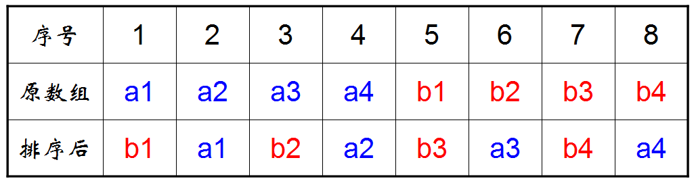
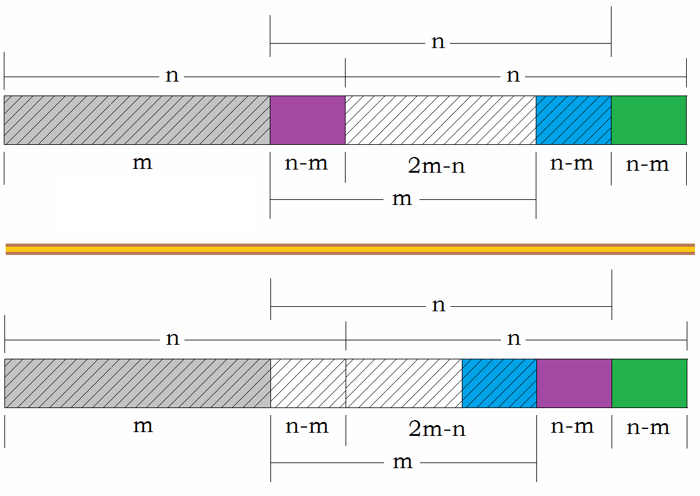
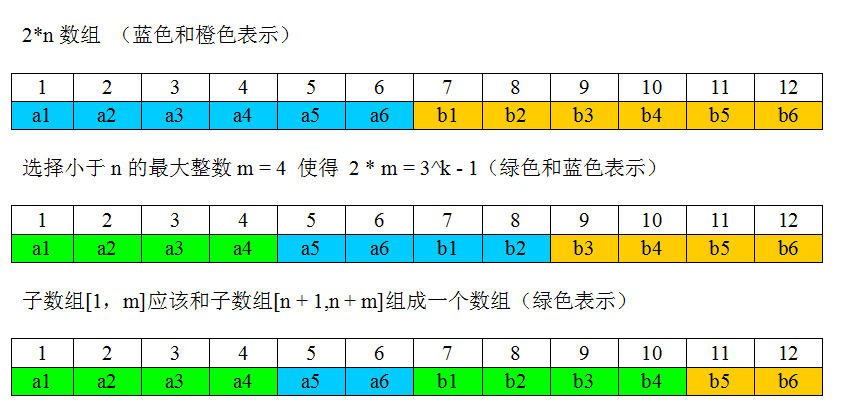
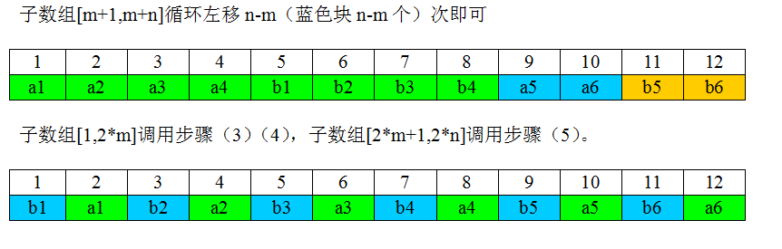

# 完美洗牌算法

有个长度为2n的数组{a1,a2,a3,…,an,b1,b2,b3,…,bn}，希望排序后{a1,b1,a2,b2,….,an,bn}，请考虑有无时间复杂度o(n)，空间复杂度o(1)的解法。

玩过扑克牌的朋友都知道，在一局完了之后洗牌，洗牌人会习惯性的把整副牌大致分为两半，两手各拿一半对着对着交叉洗牌。2004年，microsoft的Peiyush Jain在他发表一篇名为：“A Simple In-Place Algorithm for In-Shuffle”的论文中提出了完美洗牌算法。

什么是完美洗牌问题呢？即给定一个数组a1,a2,a3,…an,b1,b2,b3..bn,最终把它置换成b1,a1,b2,a2,…bn,an。这个完美洗牌问题本质上与本题完全一致，只要在完美洗牌问题的基础上对它最后的序列swap两两相邻元素即可。

1. 对原始位置的变化做如下分析：

   

2. 依次考察每个位置的变化规律：

   a1：1 -> 2 
   a2：2 -> 4 
   a3：3 -> 6 
   a4：4 -> 8 
   b1：5 -> 1 
   b2：6 -> 3 
   b3：7 -> 5 
   b4：8 -> 7

   对于原数组位置i的元素，新位置是(2*i)%(2n+1)，注意，这里用2n表示原数组的长度。后面依然使用该表述方式。有了该表达式，困难的不是寻找元素在新数组中的位置，而是为该元素“腾位置”。如果使用暂存的办法，空间复杂度必然要达到O(N)，因此，需要换个思路。

3. 我们这么思考：a1从位置1移动到位置2，那么，位置2上的元素a2变化到了哪里呢？继续这个线索，我们得到一个“封闭”的环：

   1 -> 2 -> 4 -> 8 -> 7 -> 5 -> 1

   沿着这个环，可以把a1、a2、a4、b4、b3、b1这6个元素依次移动到最终位置；显然，因为每次只移动一个元素，代码实现时，只使用1个临时空间即可完成。(即：a=t;t=b;b=a) 
   此外，该变化的另外一个环是：

   3 -> 6 -> 3

   沿着这个环，可以把a3、b2这2个元素依次移动到最终位置。

4. 上述过程可以通过若干的“环”的方式完整元素的移动，这是巧合吗？事实上，该问题的研究成果已经由Peiyush Jain在10年前公开发表在A Simple In-Place Algorithm for In-Shuffle, Microsoft, 2004中。原始论文直接使用了一个结论，这里不再证明：

   对于$2 * n =（3^k-1）$这种长度的数组，恰好只有k个环，且每个环的起始位置分别是1, 3, 9，…, $3^{k-1}$。 
   对于上面的例子，长度为8，是$3^2-1$，因此，只有2个环。环的起始位置分别是1和3。

5. 至此，完美洗牌算法的“主体工程”已经完工，只存在一个“小”问题：如果数组长度不是（$3^k-1$）呢？

   若$2n !=（3^k-1）$，则总可以找到最大的整数m，使得m< n，并且$2m=（3^k-1）$。

   对于长度为2m的数组，调用（3）和（4）中的方法整理元素，剩余的2（n-m）长度，递归调用（5）即可。

6. 需要交换一部分数组元素

   

   （下面使用[a,b]表示从a到b的一段子数组，包括端点） 
   ①图中斜线阴影部分的子数组[1，m]应该和[n + 1,n + m]组成一个数组，调用（3）和（4）中的算法； 
   ②数组[m+1,m+n]循环左移n-m次即可。（循环位移是存在空间复杂度为O(1)，时间复杂度为O(n)的算法）

7. 原始问题要输出a1,b1,a2,b2……an,bn，而完美洗牌却输出的是b1,a1,b2,a2,……bn,an。解决办法非常简单：忽略原数组中的a1和bn，对于a2,a3,……an,b1,b2,……bn-1调用完美洗牌算法，即为结论。

   举个例子： n = 6 
   a1,a2,a3,a4,a5,a6,b1,b2,b3,b4,b5,b6

   

   

代码如下：

[perfect.cpp](./perfect.cpp)

