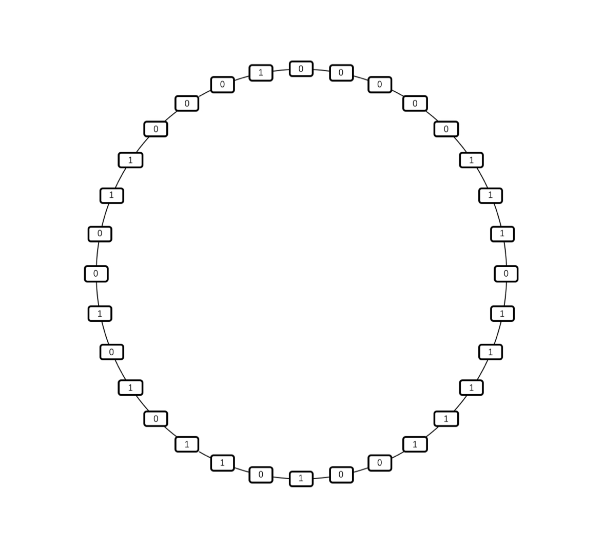

# 常见算法题

## 1. 龟兔赛跑判断链表是否带环

* 题目

  有一个单链表，已知其头指针，判断它是否带环？要求时空复杂度尽可能低。

* 分析

  一、 标记解法。把走过结点的地址，塞入到hashmap中，每走过一个结点，就判断结点地址是否已在hashmap中。可是，这里引入了哈希表，所以，空间复杂度就是O(N)了。

  二、龟兔赛跑。

  利用龟兔赛跑的启发，我们可以有比较圆满的解答，让时间复杂度和空间复杂度尽可能低。对于直赛道而言，在龟兔赛跑中，乌龟是永远没法追赶上兔子的。对于环形赛道而言，兔子的速度远大于乌龟，所以，总有一天，兔子会再次追上乌龟。受此启发，我们可以在链表中考虑快慢指针，快指针每次走2步，慢指针每次走1步

* 解答

  [ListHasRing.cpp](./code/ListHasRing.cpp)

  ```c++
  #include<iostream>
  using namespace std;
   
  typedef struct node
  {
      int data;  
      struct node *next;
  }Node;
   
  Node *createList(int n)
  {
      Node *p = new Node[n];
      for( int i = 1; i < n; ++i)
      {
          p[i - 1].next = &p[i];
          p[i - 1].data = i;
      }
      p[n - 1].next = NULL;
      p[n - 1].data = n;
      return p;
  }
   
  Node *createListWithRing(int n)
  {
      Node *p = new Node[n];
      for( int i = 1; i < n; ++i)
      {
          p[i - 1].next = &p[i];
          p[i - 1].data = i;
      }
      p[n - 1].next = &p[n/2];
      p[n - 1].data = n;
      return p;
  }
   
  //pFast相当于兔子，pSlow相当于乌龟
  bool listHasRing(Node *p)
  {
      Node *pSlow = &p[0];
      Node *pFast = &p[1];
      while(NULL != pSlow && NULL != pFast -> next) 
      {
          if(pSlow == pFast)
      {
        return true;
      }
  
          pSlow = pSlow -> next;
          pFast = pFast -> next ->next;
      }
    
      return false;
  }
  
   
  int main()
  {
      Node *head = createList(10);
      cout << listHasRing(head) << endl;
      delete [] head; 
   
      head = createListWithRing(10);
      cout << listHasRing(head) << endl;
      delete [] head; 
      return 0;
  }
  ```

## 2. 删除未知头节点的链表节点

* 题目

  有一个足够长的单链表，并且头指针未知。靠近中间位置附近有一个结点，指针是p，请把该结点删除。

* 分析

  要删除p指向的节点，就得把p前面的节点和后面的节点连接上，这样才能形成删除后的链表。可是，现在的问题是不知道单链表的头指针，所以也就没法知道p前面节点的指针。

  可以考虑先把p节点的值改一下，然后考虑把p后面的节点删除。

* 解答

  ```c++
  // 先把p节点的值改一下
  p->data = p->next->data;
  // 然后把p后面的节点删除
  q = p->next;
  p->next = p->next->next;
  free(q);
  ```


## 3. 寻找多数元素问题

* 题目

  令a[1..n]是一个整数序列，a中的整数x如果在a中出现的次数多于n/2，那么x称为多数元素。
  设计一个性能比较优异的算法求解这个问题，找出一个整数序列中的多数元素。当然多数元素要么不存在，要么就只有一个

* 分析

  解决这个问题有好多种方法，蛮力方法就是把序列中的每个元素和其他每个元素比较，并且对每个元素计数，如果某个元素的计数大于n/2，就可以判断它是多数元素，否则无多数元素。但是这样的比较次数是n(n-1)/2=O(n$^2$)，复杂度高。比较有效的算法是先对这些元素排序，并且计算每个元素在序列中出现的次数，最坏情况下是O(nlogn)。因为排序这一步需要O(nlogn)次比较。

  观察结论：在原序列中去除两个不同的元素以后，原序列中的多数元素在新的序列中还是多数元素。
  将计数器置1，并令c=a[1]，从a[2]开始扫，被扫描的元素和c相等，计数器+1,不相等计数器-1，如果所有元素都扫描完毕并且计数器大于0，返回c作为多数元素的候选者。如果在c和a[j](1<j<n)比较时计数器为0，那么返回对于a[j+1,...n]上的元素递归调用上述过程。这里从j+1开始下一轮扫就是去除两个不同元素的思想的实现。得到候选者以后，需要验证候选者的准确性。

* 解答

  [majority.cpp](./code/majority.cpp)

  ```c++
  //寻找a[m...n]中多数元素候选者     
  int candidate(int a[], int m, int n)
  {
  	int j = m, c = a[m], count = 1; //计数器置1 
  
  	while (j < n && count > 0)
  	{
  		++j;
  		if (a[j] == c)
  			++count;
  		else
  			--count;
  	}
  
  	if (j == n)
  		return c;
  	else
  		return candidate(a, j + 1, n); //对a[j+1...n]寻找多数元素候选者，即却掉了前面两个不等的值，继续在后面的区间内寻找候选者 
  }
  
  //检查候选者是否真的是多数元素
  int Majority(int a[], int n)
  {
  	int c = candidate(a, 1, 10);
  	int count = 0;
  
  	for (int i = 1; i <= n; ++i)
  	if (a[i] == c)
  		++count;
  
  	if (count > n / 2)
  		return c;
  	else
  		return -1;
  }
  
  int main()
  {
  	int a[11];
  
  	for (int i = 1; i < 11; ++i)
  		scanf("%d", a + i);
  
  	printf("%d\n", Majority(a, 10));
  	getchar();
  	getchar();
  	return 0;
  }
  ```


## 4. 在 O(1) 的时间复杂度内，求一个以二进制表示的整数末尾有多少个 0

* 常规解法：

```c++
while ((n & (1 << count)) == 0) {
	count += 1;
}
```

时间复杂度$O(log_2N)$

* 位运算解法

对于正整数x，它在计算机中的存储是它本身的二进制表示，而-x在计算机中的存储则是将它取反之后再加上 1，即-x+1。一个数取反之后，它的二进制表示中，最低位的那个 1 会变成 0，从它往低全都变成了 1，而加 1 之后，最低位 1 的那个 bit 还会变成 1，从它往低又全都变成了 0。也就是说，x和-x在计算机中的表示，以x的二进制表示中最低位的 1 为界，从它开始，低位全都一样，高位全都互反，所以我们可以通过 x & (-x)，就能取出最低位 1。这样可以通过取对数$log_2(n \& (-n))$ 或查表求解。

时间复杂度O(1)

* 位扫描解法：

```c++
unsigned int v; // find the number of trailing zeros in 32-bit v
int r; // result goes here
static const int MultiplyDeBruijnBitPosition[32] =
{
0, 1, 28, 2, 29, 14, 24, 3, 30, 22, 20, 15, 25, 17, 4, 8,
31, 27, 13, 23, 21, 19, 16, 7, 26, 12, 18, 6, 11, 5, 10, 9
};
r = MultiplyDeBruijnBitPosition[((uint32_t)((v & -v) * 0x077CB531U)) >> 27];
```

利用这一段代码，我们就可以在真 O(1) 的时间复杂度下，求出一个整数的二进制表示中末尾有多少个 0。

> **De Bruijn序列**
>
> 一个整数是以 32bit 的长度存储在计算机中的，如果不算符号位，它的最高 5 位，一共有多少种情况呢？自然是 32 种情况，从00000到11111。我们将常量0x077CB531展开成二进制表示，就是00000111011111001011010100110001。我们将它看作是一个循环的圆，然后从中依次取出相邻的 5 个 bit，如下图：
>
> 
>
> 这个时候，我们就发现了一个问题，我们取出的这些数刚好是从00000到11111的所有数，既没有重复，也没有遗漏。这样的序列被称作De Bruijn序列。它的定义是，B(n, k)为 n 个元素组成的一个循环序列，在这个循环序列中所有长度为 k，且由 n 个元素构成的序列都在它的子序列中，且仅出现一次，那0x077CB531这个常量的二进制表示就是B(2, 5)的一个序列。

上面的代码我们就可以这样来解释：我们去看这个常量乘上了一个 2^x^ 之后，它的前 5bit 是什么。由于这个常量中，每一个长度为 5 的窗口互相之间都是不一样的，或者说，每一个长度为 5 的窗口都只对应了一个x，因此，它们就可以用一个长度为 32 的数组存储起来了。

这样一来，当我们将整数n最低位的 1 取出与常量相乘，再查看它前 5 位的时候，直接查表就可以找到那个对应的x，即n的二进制表示中末尾 0 的位置。

比如说整数 104，经过计算就是104 & -104 = 8，也就是1000，因为 8=2^3，所以需要把它左移 3 位：

000001110111110010110101001100001  -->  001110111110010110101001100001000

我们看到它的前五位是00111=7，查表可以看到MultiplyDeBruijnBitPosition[7]=3，结果是正确的。那如果左移超过了 27 位呢？其实也没有关系，这个常量的前 5 位都是 0，左移也是用 0 来补低位，所以刚好形成了循环。

# 常见算法面试题

## 1. 请尽可能多地说出二叉排序树与快速排序算法之间的联系

* 二叉排序树是快速排序算法的思维逻辑结构。
* 快速排序每一轮选出的基准值，就是二叉排序树当前子树的根节点。
* 快排中的 Partition（分区）操作后的左右两个集合，对应了二叉排序树中的左右两个子树。
* 分析快速排序的时间复杂度，其实可以对应到建立一棵二叉排序树的时间复杂度。
* 二叉排序树上查找第 k 大元素，与快速排序的拓展算法快速选择算法相对应。

## 2. 请总结出 AVL 树的失衡调整方式

* LL 型失衡，左子树的左子树更高，直接大右旋即可。
* LR 型失衡，左子树的右子树更高，先抓着左子树进行小左旋，再大右旋。
* RL 型失衡，右子树的左子树更高，先抓着右子树进行小右旋，再大左旋。
* RR 型失衡，右子树的右子树更高，直接大左旋即可。

## 3. 简述红黑树的五条性质

1. 节点非黑即红。
2. 根节点是黑色。
3. 叶子（NIL）节点是黑色。
4. 红色节点下面的两个孩子，一定是黑色节点。
5. 从根节点到所有叶子结点路径上，黑色节点数量相同。

## 4. 请对比一下二叉排序树和哈希表

* 本质上二者都是做数据的索引查找。
* 二叉排序树维护了数据的有序性，哈希表则会破坏这种有序性。
* 单纯的查找操作的话，哈希表要比二叉排序树更优秀一些，哈希表的时间复杂度是 O(1) 的，二叉排序树是 O(logn) 的。
* 二叉排序树由于维持了数据的有序性，因此在一些需要数据之间这种有序的拓展查找问题上，二叉排序树比哈希表更具备优势。例如：查找第 k 大元素。
* 二叉树中的节点是依次添加进去的，所以在扩容方面显得更简单一些。哈希表的扩容操作，通常都比二叉排序树要麻烦一些。

## 5. 请你说出 4 种生活中需要查找的例子，并且分析需要的查找算法和数据结构

* 在图书馆中，我们需要按照图书的编号到对应的书架上查找图书。这更像是块状链表。
* 收费站处，经过车牌识别系统以后，我们需要到资料库中找到对应车辆的具体信息。这的过程我们可以采用哈希表。
* 快递小哥在送快递的时候，会根据快递地址找到具体的物理位置，再把快递送出去。地址信息更像是一个树形索引结构。
* 期末考试成绩公布了以后，爸爸妈妈会在成绩单上快速查找你的名字。这就是普通的顺序查找。