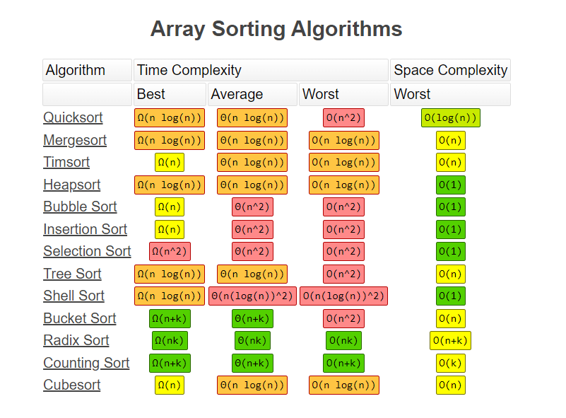

# 排序算法

* 排序算法时间复杂度



* 排序算法的内存消耗

  针对排序算法的空间复杂度，引入了一个新的概念：原地排序（Sorted in place）。原地排序算法，就是特指空间复杂度是 O(1) 的排序算法。

* 排序算法的稳定性

  针对排序算法，还有一个重要的度量指标：**稳定性**。

  如果待排序的序列中存在值相等的元素，经过排序之后，相等元素之间原有的先后顺序不变。

  

| 排序算法 | 平均时间复杂度 | 最好情况   | 最坏情况   | 空间复杂度 | 排序方式  | 稳定性 |
| -------- | -------------- | ---------- | ---------- | ---------- | --------- | ------ |
| 冒泡排序 | O(n^2)         | O(n)       | O(n^2)     | O(1)       | In-place  | 稳定   |
| 选择排序 | O(n^2)         | O(n^2)     | O(n^2)     | O(1)       | In-place  | 不稳定 |
| 插入排序 | O(n^2)         | O(n)       | O(n^2)     | O(1)       | In-place  | 稳定   |
| 希尔排序 | O(nlogn)       | O(nlog^2n) | O(nlog^2n) | O(1)       | In-place  | 不稳定 |
| 归并排序 | O(nlogn)       | O(nlogn)   | O(nlogn)   | O(n)       | Out-place | 稳定   |
| 快速排序 | O(nlogn)       | O(nlogn)   | O(n^2)     | O(logn)    | In-place  | 不稳定 |
| 堆排序   | O(nlogn)       | O(nlogn)   | O(nlogn)   | O(1)       | In-place  | 不稳定 |
| 计数排序 | O(n+k)         | O(n+k)     | O(n+k)     | O(k)       | Out-place | 稳定   |
| 桶排序   | O(n+k)         | O(n+k)     | O(n^2)     | O(n+k)     | Out-place | 稳定   |
| 基数排序 | O(nxk)         | O(nxk)     | O(nxk)     | O(n+k)     | Out-place | 稳定   |

* 有序度、逆序度

  **有序度**是数组中具有有序关系的元素对的个数（默认从小到大为有序）。**逆序度**是数组中具有逆序关系的元素对的个数。

  对于一个倒序排列的数组，比如 6，5，4，3，2，1，有序度是 0；对于一个完全有序的数组，比如 1，2，3，4，5，6，有序度就是 n*(n-1)/2，也就是 15。我们把这种完全有序的数组的有序度叫作**满有序度**。

  逆序度 = 满有序度 - 有序度

  我们排序的过程就是一种增加有序度，减少逆序度的过程，最后达到满有序度，就说明排序完成了。

## 冒泡排序(Bubble Sort)

冒泡排序只会操作相邻的两个数据。每次冒泡操作都会对相邻的两个元素进行比较，看是否满足大小关系要求。如果不满足就让它俩互换。一次冒泡会让至少一个元素移动到它应该在的位置，重复 n 次，就完成了 n 个数据的排序工作。

每一轮遍历，依次比较两个相邻的元素，如果顺序错误，将这两个元素交换，使得较小的元素放到较大的元素前面，这样，一轮遍历之后，最大的元素被交换到了序列尾部。

```c++
void bubbleSort(int a[], int length)
{
    if (length < 2)
        return;
    for (int i = 0; i < length - 1; i++) //需length-1趟排序确定后length-1个数，剩下第一个数不用排序；
    {
        for (int j = 0; j < length - 1 - i; j++)
        {
            if (a[j + 1] < a[j])
            {
                int temp = a[j + 1];
                a[j + 1] = a[j];
                a[j] = temp;
            }
        }
    }
}

```

优化：当某次冒泡操作已经没有数据交换时，说明已经达到完全有序，不用再继续执行后续的冒泡操作。

```c++
// 冒泡排序，a表示数组，n表示数组大小
public void bubbleSort(int[] a, int n) {
  if (n <= 1) return;
 
  for (int i = 0; i < n; ++i) {
    // 提前退出冒泡循环的标志位
    boolean flag = false;
    for (int j = 0; j < n - i - 1; ++j) {
      if (a[j] > a[j+1]) { // 交换
        int tmp = a[j];
        a[j] = a[j+1];
        a[j+1] = tmp;
        flag = true;  // 表示有数据交换      
      }
    }
    if (!flag) break;  // 没有数据交换，提前退出
  }
}
```

* 冒泡的过程只涉及相邻数据的交换操作，只需要常量级的临时空间，所以它的空间复杂度为 O(1)，是一个原地排序算法。
* 在冒泡排序中，只有交换才可以改变两个元素的前后顺序。为了保证冒泡排序算法的稳定性，当有相邻的两个元素大小相等的时候，我们不做交换，相同大小的数据在排序前后不会改变顺序，所以冒泡排序是稳定的排序算法。
* 最好情况时间复杂度 O(n)：要排序的数据已经是有序的了，我们只需要进行一次冒泡操作
* 最坏情况时间复杂度O(n^2)：要排序的数据刚好是倒序排列的，我们需要进行 n 次冒泡操作
* 平均情况时间复杂度O(n^2)

## 插入排序(Insertion Sort)

首先，我们将数组中的数据分为两个区间，已排序区间和未排序区间。初始已排序区间只有一个元素，就是数组的第一个元素。插入算法的核心思想是取未排序区间中的元素，在已排序区间中找到合适的插入位置将其插入，并保证已排序区间数据一直有序。重复这个过程，直到未排序区间中元素为空，算法结束。

```c++
// 插入排序，a表示数组，n表示数组大小
public void insertionSort(int[] a, int n) {
  if (n <= 1) return;

  for (int i = 1; i < n; ++i) {
    int value = a[i];
    int j = i - 1;
    // 查找插入的位置
    for (; j >= 0; --j) {
      if (a[j] > value) {
        a[j+1] = a[j];  // 数据移动
      } else {
        break;
      }
    }
    a[j+1] = value; // 插入数据
  }
}
```

* 插入排序算法的运行并不需要额外的存储空间，所以空间复杂度是 O(1)，是一个原地排序算法。

* 在插入排序中，对于值相同的元素，我们可以选择将后面出现的元素，插入到前面出现元素的后面，这样就可以保持原有的前后顺序不变，所以插入排序是稳定的排序算法。
* 最好情况时间复杂度 O(n)：**从尾到头遍历已经有序的数据**。
* 最坏情况时间复杂度 O(n^2)：如果数组是倒序的，每次插入都相当于在数组的第一个位置插入新的数据
* 平均时间复杂度O(n^2)：在数组中插入一个数据的平均时间复杂度是O(n)。所以，对于插入排序来说，每次插入操作都相当于在数组中插入一个数据，循环执行 n 次插入操作，所以平均时间复杂度为 O(n^2)。

> 冒泡排序和插入排序的时间复杂度都是 O(n^2)，都是原地排序算法，为什么插入排序要比冒泡排序更受欢迎呢？
>
> 冒泡排序不管怎么优化，元素交换的次数是一个固定值，是原始数据的逆序度。插入排序是同样的，不管怎么优化，元素移动的次数也等于原始数据的逆序度。但是，从代码实现上来看，冒泡排序的数据交换要比插入排序的数据移动要复杂，冒泡排序需要 3 个赋值操作，而插入排序只需要 1 个。
>
> ```c++
> 冒泡排序中数据的交换操作：
> if (a[j] > a[j+1]) { // 交换
>    int tmp = a[j];
>    a[j] = a[j+1];
>    a[j+1] = tmp;
>    flag = true;
> }
> 
> 插入排序中数据的移动操作：
> if (a[j] > value) {
>   a[j+1] = a[j];  // 数据移动
> } else {
>   break;
> }
> ```
>
> 我们把执行一个赋值语句的时间粗略地计为单位时间（unit_time），然后分别用冒泡排序和插入排序对同一个逆序度是 K 的数组进行排序。用冒泡排序，需要 K 次交换操作，每次需要 3 个赋值语句，所以交换操作总耗时就是 3*K 单位时间。而插入排序中数据移动操作只需要 K 个单位时间。
>
> 所以，虽然冒泡排序和插入排序在时间复杂度上是一样的，都是 O(n^2)，但是如果我们希望把性能优化做到极致，那肯定首选插入排序。

## 选择排序(Selection Sort)

选择排序算法的实现思路有点类似插入排序，也分已排序区间和未排序区间。但是选择排序每次会从未排序区间中找到最小的元素，将其放到已排序区间的末尾。

```c++
// 选择排序，a表示数组，length表示数组大小
void selectSort(int a[], int length)
{
    if (length < 2)
        return;
    for (int i = 0; i < length; i++)
    {
        int minIndex = i;
        for (int j = i + 1; j < length; j++) //已确定a[0]~a[i-1],从i-1开始查找最小的数，然后与a[i]交换位置；
        {
            if (a[j] < a[minIndex])
                minIndex = j;
        }
        int temp = a[i];
        a[i] = a[minIndex];
        a[minIndex] = temp;
    }
}
```

* 选择排序空间复杂度为 O(1)，是一种原地排序算法
* 选择排序是一种不稳定的排序算法：选择排序每次都要找剩余未排序元素中的最小值，并和前面的元素交换位置，这样破坏了稳定性。
* 选择排序的最好情况时间复杂度、最坏情况和平均情况时间复杂度都为 O(n^2)

## 希尔排序(Shell Sort)

希尔排序，也称**递减增量排序算法**，是插入排序的一种更高效的改进版本。

希尔排序是基于插入排序的以下两点性质而提出改进方法的：

- 插入排序在对几乎已经排好序的数据操作时，效率高，即可以达到线性排序的效率
- 但插入排序一般来说是低效的，因为插入排序每次只能将数据移动一位

希尔排序通过将比较的全部元素分为几个区域来提升插入排序的性能。这样可以让一个元素可以一次性地朝最终位置前进一大步。然后算法再取越来越小的步长进行排序，算法的最后一步就是普通的插入排序，但是到了这步，需排序的数据几乎是已排好的了（此时插入排序较快）。

他的目的是为了减少交换的次数 优化了直接插入算法。希尔排序算法的基本思想是 将待排序的表 按照间隔 切割成若干个子表，然后对这些子表进行 插入排序。 一般来说 第一次的间隔为整个排序表的一半。 然后对按照这些间隔划分的子表进行直接插入排序，第二次间隔又是第一次的一半，然后对按照这些间隔划分的子表进行直接插入排序。一直到间隔等于1为止，此时表内全部的数据都已是有序的。


```c++
//Shell Sort 希尔排序
void shellSort(int a[], int length)
{
    if (length < 2)
        return;
    int gap = length / 2; //整个数组分为gap个组，即每隔 gap-1 个位置的元素为一组
    while (gap > 0)       //最终整个数组分为一组 即所有元素为一组；
    {
        for (int i = gap; i < length; i++)
        {
            int cur = a[i];
            int preIndex = i - gap;
            while (preIndex >= 0 && a[preIndex] > cur) //对每一组元素进行插入排序
            {
                a[i] = a[preIndex];
                preIndex -= gap;
            }
            a[preIndex + gap] = cur;
        }
        gap /= 2;
    }
}
```

wiki版本(https://zh.wikipedia.org/wiki/%E5%B8%8C%E5%B0%94%E6%8E%92%E5%BA%8F)：

```c++
template<typename T>
void shell_sort(T array[], int length) {
    int h = 1;
    while (h < length / 3) {
        h = 3 * h + 1;
    }
    while (h >= 1) {
        for (int i = h; i < length; i++) {
            for (int j = i; j >= h && array[j] < array[j - h]; j -= h) {
                std::swap(array[j], array[j - h]);
            }
        }
        h = h / 3;
    }
}
```


## 归并排序(Mergesort)

归并排序的核心思想：如果要排序一个数组，我们先把数组从中间分成前后两部分，然后对前后两部分分别排序，再将排好序的两部分合并在一起，这样整个数组就都有序了。

```c++
递推公式：
merge_sort(p…r) = merge(merge_sort(p…q), merge_sort(q+1…r))

终止条件：
p >= r 不用再继续分解
```

归并排序使用的就是分治思想。分治，顾名思义，就是分而治之，将一个大问题分解成小的子问题来解决。小的子问题解决了，大问题也就解决了。

1、分解(Divide)：将n个元素分成2个包含n/2个元素的子序列

2、解决(Conquer)：用合并排序法对两个子序列递归的排序

3、合并(Combine)：合并两个已排序的子序列得到排序结果

> 归并排序伪代码
>
> ```c++
> // 归并排序算法, A是数组，n表示数组大小
> merge_sort(A, n) {
>   merge_sort_c(A, 0, n-1)
> }
> 
> // 递归调用函数
> merge_sort_c(A, p, r) {
>   // 递归终止条件
>   if p >= r  then return
> 
>   // 取p到r之间的中间位置q
>   q = (p+r) / 2
>   // 分治递归
>   merge_sort_c(A, p, q)
>   merge_sort_c(A, q+1, r)
>   // 将A[p...q]和A[q+1...r]合并为A[p...r]
>   merge(A[p...r], A[p...q], A[q+1...r])
> }
> ```
>
> 

```c++
// 归并排序（C++-递归版）
template<typename T>
void merge_sort_recursive(T arr[], T reg[], int start, int end) {
    // 1、分解到最小需要解决的地步，无法再分解了
    if (start >= end)
        return;
    // 2、解决
    int len = end - start, mid = (len >> 1) + start;
    int start1 = start, end1 = mid;
    int start2 = mid + 1, end2 = end;
    // 调用 merge_sort_recursive 函数，将 arr 数组中的 start1 到 end1 这一区间的数字排序后，并存放到 reg 中
    merge_sort_recursive(arr, reg, start1, end1);
    // 调用 merge_sort_recursive 函数，将 arr 数组中的 start2 到 end2 这一区间的数字排序后，并存放到 reg 中
    merge_sort_recursive(arr, reg, start2, end2);
    
    // 3、合并
     // 将左右区间中较小的数字存放到 result 中，从 k 开始
    int k = start;
    while (start1 <= end1 && start2 <= end2)
        reg[k++] = arr[start1] < arr[start2] ? arr[start1++] : arr[start2++];
    while (start1 <= end1)
        reg[k++] = arr[start1++];
    while (start2 <= end2)
        reg[k++] = arr[start2++];
    
    // 最后，把结果赋值到 arr 中
    for (k = start; k <= end; k++)
        arr[k] = reg[k];
}

// merge_sort
template<typename T>
void merge_sort(T arr[], const int len) {
    T reg[len];
    merge_sort_recursive(arr, reg, 0, len - 1);
}
```

* 归并排序是一个稳定的排序算法
* 归并排序的执行效率与要排序的原始数组的有序程度无关，所以其时间复杂度是非常稳定的，不管是最好情况、最坏情况，还是平均情况，时间复杂度都是 O(nlogn)。
* 归并排序不是原地排序算法。这是因为归并排序的合并函数，在合并两个有序数组为一个有序数组时，需要借助额外的存储空间。空间复杂度是 O(n)。

## 快速排序(Quicksort)

快速排序的思想是这样的：如果要排序数组中下标从 p 到 r 之间的一组数据，我们选择 p 到 r 之间的任意一个数据作为 pivot（分区点）。我们遍历 p 到 r 之间的数据，将小于 pivot 的放到左边，将大于 pivot 的放到右边，将 pivot 放到中间。经过这一步骤之后，数组 p 到 r 之间的数据就被分成了三个部分，前面 p 到 q-1 之间都是小于 pivot 的，中间是 pivot，后面的 q+1 到 r 之间是大于 pivot 的。根据分治、递归的处理思想，我们可以用递归排序下标从 p 到 q-1 之间的数据和下标从 q+1 到 r 之间的数据，直到区间缩小为 1，就说明所有的数据都有序了。

```c++
递推公式：
quick_sort(p…r) = quick_sort(p…q-1) + quick_sort(q+1… r)

终止条件：
p >= r
```

快速排序，这是一个典型的分治算法。我们对数组 a[l⋯r] 做快速排序的过程是（参考《算法导论》）：

* **分解**： 将数组 a[l⋯r]「划分」成两个子数组 a[l⋯q−1]、a[q+1⋯r]，使得 a[l⋯q−1] 中的每个元素小于等于 a[q]，且 a[q] 小于等于 a[q+1⋯r] 中的每个元素。其中，计算下标 q 也是「划分」过程的一部分。
* **解决**： 通过递归调用快速排序，对子数组 a[l⋯q−1] 和 a[q+1⋯r] 进行排序。
* **合并**： 因为子数组都是原址排序的，所以不需要进行合并操作，a[l⋯r] 已经有序。
* 上文中提到的 **「划分」** 过程是：从子数组 a[l⋯r] 中选择任意一个元素 x 作为主元，调整子数组的元素使得左边的元素都小于等于它，右边的元素都大于等于它， x 的最终位置就是 q。

> 快排伪代码
>
> ```c++
> // 快速排序，A是数组，n表示数组的大小
> quick_sort(A, n) {
>   quick_sort_c(A, 0, n-1)
> }
> // 快速排序递归函数，p,r为下标
> quick_sort_c(A, p, r) {
>   if p >= r then return
>   
>   q = partition(A, p, r) // 获取分区点
>   quick_sort_c(A, p, q-1)
>   quick_sort_c(A, q+1, r)
> }
> ```
>
> partition() 原地分区函数伪代码
>
> ```c++
> partition(A, p, r) {
>   pivot := A[r]
>   i := p
>   for j := p to r-1 do {
>     if A[j] < pivot {
>       swap A[i] with A[j]
>       i := i+1
>     }
>   }
>   swap A[i] with A[r]
>   return i
> 
> ```
>
> 处理有点类似选择排序。我们通过游标 i 把 A[p...r-1]分成两部分。A[p...i-1]的元素都是小于 pivot 的，我们暂且叫它“已处理区间”，A[i...r-1]是“未处理区间”。我们每次都从未处理的区间 A[i...r-1]中取一个元素 A[j]，与 pivot 对比，如果小于 pivot，则将其加入到已处理区间的尾部，也就是 A[i]的位置。


利用哨兵减少了交换两个元素的复杂步骤

```c++
//Quick Sort 快速排序
void quickSort(int a[], int left, int right)
{
    if (left >= right)
        return;
    int key = a[left]; //以第一个数为基数进行快排；
    int pointL = left, pointR = right;

    while (pointL < pointR)
    {
        //一定要先动右指针，否则右指针所指向的元素无处存放
        while (pointR > pointL && a[pointR] >= key) //若右指针指向的元素大于key 则右指针左移，直到右指针指向的元素小于key 或者 左右指针坐标相同
            pointR--;
        a[pointL] = a[pointR]; //把这个小于key的元素放到key的左边，即左指针指向的位置

        while (pointR > pointL && a[pointL] <= key) //若左指针指向的元素小于key 则左指针右移，直到左指针指向的元素大于key 或者 左右指针坐标相同
            pointL++;
        a[pointR] = a[pointL]; //把这个大于key的元素放到key的右边，即右指针指向的位置
    }
    a[pointR] = key; //此时左右指针指向同一位置，这个位置就是key应该放的位置

    //对key两边的元素同样使用快排
    quickSort(a, left, pointR - 1);
    quickSort(a, pointR + 1, right);
}
```

* 快排是一种原地、不稳定的排序算法。

* 快排和归并用的都是分治思想，递推公式和递归代码也非常相似，那它们的区别在哪里呢？

  归并排序的处理过程是由下到上的，先处理子问题，然后再合并。而快排正好相反，它的处理过程是由上到下的，先分区，然后再处理子问题。归并排序虽然是稳定的、时间复杂度为 O(nlogn) 的排序算法，但是它是非原地排序算法。我们前面讲过，归并之所以是非原地排序算法，主要原因是合并函数无法在原地执行。快速排序通过设计巧妙的原地分区函数，可以实现原地排序，解决了归并排序占用太多内存的问题。

* 最坏情况下的时间复杂度是 O(n^2)，平均情况下时间复杂度是 O(nlogn)。不仅如此，快速排序算法时间复杂度退化到 O(n^2) 的概率非常小，我们可以通过合理地选择 pivot 来避免这种情况。

> 基础的快速排序算法思想很简单，核心就是一句话：找到基准值的位置。
>
> 具体的过程可以分成三步：
>
> 第一步，选择一个值作为基准值；
>
> 第二步，找到基准值的位置，并将小于基准值的元素放在基准值的前面，大于基准值的元素放在基准值的后面；
>
> 第三步，对基准值的左右两侧递归地进行这个过程。

**三种快排优化**

* 优化一：单边递归优化

  单边递归优化的方式，就是当本层完成了 partition 操作以后，让本层继续完成基准值左边的 partition 操作，而基准值右边的排序工作交给下一层递归函数去处理。

  ```c++
  void quick_sort(int *arr, int l, int r) {
      while (l < r) {
          // 进行一轮 partition 操作
          // 获得基准值的位置
          int ind = partition(arr, l, r);
          // 右侧正常调用递归函数 
          quick_sort(arr, ind + 1, r);
          // 用本层处理左侧的排序
          r = ind - 1;
      }
      return ;
  }
  ```

  这样可以减少函数调用的次数，加快一点程序运行的速度。

* 优化二：基准值选取优化

  我们知道，如果基准值选取不合理的话，快速排序的时间复杂度有可能达到 O(n^2^) 这个量级，也就是退化成和选择排序、插入排序等算法一样的时间复杂度。只有当基准值每次都能将排序区间中的数据平分时，时间复杂度才是最好情况下的 O(nlogn)。

  关于基准值选取的一个优化策略，三点取中法，就是每一轮取排序区间的头、尾和中间元素这三个值，然后把它们排序以后的中间值作为本轮的基准值。

* 优化三：partition 操作优化

  我们先来回顾一下 partition 的实现过程：先从后向前找个小于基准值的数字放到前面，再从前向后找个大于基准值的数字放到后面，直到首尾指针相遇为止。我们可以假设基准值的位置是数组中间的一条分割线，小于基准值的都是绿色元素，大于基准值的都是红色元素。在什么情况下，我们才需要将基准值后面的元素调换到前面？一定是因为这个分割线后面有绿色的元素。而且，基准值的客观位置不变，红色与绿色元素数量是确定的，所以存在多少个绿色元素在基准值位置的后面，就一定存在多少个红色元素在基准值位置的前面。

  那 partition 操作的目的，就是要把基准值位置后面的绿色元素调整到前面，将基准值位置前面的红色元素调整到后面。既然需要调换的红色与绿色元素的数量相同，我们就可以让头指针向后查找红色元素，尾指针向前查找绿色元素，然后交换头尾指针所指向的元素，重复这个过程，直到头尾指针交错后停止。这就是对 partition 操作进行的优化。

关于快速排序的三种优化方法中，第二种优化，是为了使快速排序的时间复杂度尽量稳定在 O(nlogn) 而提出来的，而第一种和第三种优化，没有对时间复杂度做优化，而是对程序的实际运行时间做了优化。

### 快速选择算法(quick select)


## 堆排序(Heapsort)

1、将无序序列构建成一个堆，根据升序降序需求选择大顶堆或小顶堆

2、将堆顶元素与末尾元素交换，将最大元素“沉”到数组末端，此时数组末端存储了当前区间最大的元素

3、调整堆，使得它依旧是大顶堆或小顶堆

4、重复2和3的步骤

```c++
#include <iostream>
using namespace std;

//交换函数
void swap(int &a, int &b)
{
    int temp = a;
    a = b;
    b = temp;
}

// 调整堆
void adjust_heap(int arr[], int i, int n)
{
    int j = 2 * i + 1; // 左子节点索引 
    while (j < n){
        if (j+1 < n && arr[j+1] > arr[j]) // 找到左右子节点中较大的一个 
        {
            j++;
        }
        if (arr[j] > arr[i]) // 如果较大的子节点比父节点大，则交换它们 
        {
            swap(arr[j], arr[i]);
            i = j;
            j = 2 * i + 1;
        }
        else {
            break;
        }
    }
}

// 堆排序
void heap_sort(int arr[], int n)
{
    // 构建初始大根堆 
    for (int i = n/2 - 1; i >= 0; i--)
    {
        adjust_heap(arr, i, n);
    }
    //依次取出堆顶元素，调整堆 
    for (int i = n - 1; i > 0; i--)
    {
        swap(arr[0], arr[i]);
        adjust_heap(arr,0, i);
    }
}

int main()
{
    int arr[] = {1,3,9,6,5,4,7,2,8};
    int n = sizeof(arr) / sizeof(int);
    heap_sort(arr, n);
    for (int i =0; i < n; i++)
    {
        cout << arr[i] << " ";
    }
    cout << endl;
    system("pause");
    return 0;
}
```

* 堆的存储表示是**顺序的**。因为堆所对应的二叉树为完全二叉树，而完全二叉树通常采用顺序存储方式。当想得到一个序列中第 **k** 个最小的元素之前的部分排序序列，最好采用堆排序。因为堆排序的时间复杂度是**O(n+klogn)**，若k≤n/logn，则可得到的时间复杂度为**O(n)**。

* 堆排序是一种**不稳定**的排序方法。因为在堆的调整过程中，对于相同的关键字就可能出现排在后面的关键字被交换到前面来的情况。

## 计数排序(Counting Sort)

计数排序其实是桶排序的一种特殊情况。当要排序的n个数据所处范围并不大时，比如最大值为k，则分为k个桶。每个桶内的数据值都是相同的，就省掉了桶内排序的时间。

创建一个计数数组count。以原数组中的元素作为count数组的索引，以原数组中的元素出现次数作为count数组的元素值

**步骤一**：扫描待排序数据arr[N]，使用计数数组counting[MAX-MIN]，对每一个arr[N]中出现的元素进行计数；

**步骤二**：扫描计数数组counting[]，还原arr[N]，排序结束；

```c++
//Counting Sort 计数排序
void countingSort(int a[], int length)
{
    if (length < 2)
        return;
    int min = a[0], max = a[0];
    int bios; //偏移量

    for (int i = 0; i < length; i++) //找最大最小值
    {
        if (a[i] < min)
            min = a[i];
        if (a[i] > max)
            max = a[i];
    }

    bios = 0 - min;
    vector<int> count(max - min + 1, 0);

    for (int i = 0; i < length; i++) //把出现了的元素作为count的下标 计数
    {
        count[a[i] + bios]++;
    }

    int index = 0;
    for (int i = 0; i < max - min + 1; i++) //顺序扫描一遍vector即可
    {
        while (count[i])
        {
            a[index++] = i - bios;
            count[i]--;
        }
    }
}
```

如果要排序的是对象，需要对计数数组依次累加求和，转为计数前缀和数组，然后从后往前遍历原数组(从后往前是为了确保稳定排序)，根据计数前缀和数组，定位每个对象在有序数组中对应的位置（有多个相同值的时候是这个值在排序后的数组中的最后位置，用一次以后减少1），这样就可以用对象属性将对象进行排序了。

```c++

// 计数排序，a是数组，n是数组大小。假设数组中存储的都是非负整数。
public void countingSort(int[] a, int n) {
  if (n <= 1) return;

  // 查找数组中数据的范围
  int max = a[0];
  for (int i = 1; i < n; ++i) {
    if (max < a[i]) {
      max = a[i];
    }
  }

  int[] c = new int[max + 1]; // 申请一个计数数组c，下标大小[0,max]
  for (int i = 0; i <= max; ++i) {
    c[i] = 0;
  }

  // 计算每个元素的个数，放入c中
  for (int i = 0; i < n; ++i) {
    c[a[i]]++;
  }

  // 依次累加
  for (int i = 1; i <= max; ++i) {
    c[i] = c[i-1] + c[i];
  }

  // 临时数组r，存储排序之后的结果
  int[] r = new int[n];
  // 计数排序的关键步骤，有点难理解
  for (int i = n - 1; i >= 0; --i) {
    int index = c[a[i]]-1;
    r[index] = a[i];
    c[a[i]]--;
  }

  // 将结果拷贝给a数组
  for (int i = 0; i < n; ++i) {
    a[i] = r[i];
  }
}
```

* 计数排序只能用在数据范围不大的场景中，如果数据范围 k 比要排序的数据 n 大很多，就不适合用计数排序了。而且，计数排序只能给非负整数排序，如果要排序的数据是其他类型的，要将其在不改变相对大小的情况下，转化为非负整数。

## 桶排序(Bucket Sort)

桶排序，核心思想是将要排序的数据分到几个有序的桶里，每个桶里的数据再单独进行排序。桶内排完序之后，再把每个桶里的数据按照顺序依次取出，组成的序列就是有序的了。

```c++
//Bucket Sort 桶排序
void bucketSort(int a[], int length)
{
    if (length < 2)
        return;
    int min = a[0], max = a[0];
    for (int i = 0; i < length; i++)
    {
        if (a[i] < min)
            min = a[i];
        if (a[i] > max)
            max = a[i];
    }

    int buckNum = (max - min) / length + 1; //桶的数量
    vector<vector<int>> bucketArr;
    for (int i = 0; i < buckNum; i++)
    {
        vector<int> temp;
        bucketArr.push_back(temp);
    }

    //每个元素入桶
    for (int i = 0; i < length; i++)
    {
        int num = (a[i] - min) / length;
        bucketArr[num].push_back(a[i]);
    }

    //对每个桶排序 并且排序完后赋值
    int index = 0;
    for (int i = 0; i < bucketArr.size(); i++)
    {
        if (bucketArr[i].size())
        {
            sort(bucketArr[i].begin(), bucketArr[i].end()); //快排
            for (int j = 0; j < bucketArr[i].size(); j++)
            {
                a[index++] = bucketArr[i][j];
            }
        }
    }
}
```

* 如果要排序的数据有 n 个，我们把它们均匀地划分到 m 个桶内，每个桶里就有 k=n/m 个元素。每个桶内部使用快速排序，时间复杂度为 O(k * logk)。m 个桶排序的时间复杂度就是 O(m * k * logk)，因为 k=n/m，所以整个桶排序的时间复杂度就是 O(n*log(n/m))。当桶的个数 m 接近数据个数 n 时，log(n/m) 就是一个非常小的常量，这个时候桶排序的时间复杂度接近 O(n)。

* 桶排序对要排序数据的要求是非常苛刻的。

  首先，要排序的数据需要很容易就能划分成 m 个桶，并且，桶与桶之间有着天然的大小顺序。这样每个桶内的数据都排序完之后，桶与桶之间的数据不需要再进行排序。

  其次，数据在各个桶之间的分布是比较均匀的。如果数据经过桶的划分之后，有些桶里的数据非常多，有些非常少，很不平均，那桶内数据排序的时间复杂度就不是常量级了。在极端情况下，如果数据都被划分到一个桶里，那就退化为 O(nlogn) 的排序算法了。

* 桶排序比较适合用在外部排序中。所谓的外部排序就是数据存储在外部磁盘中，数据量比较大，内存有限，无法将数据全部加载到内存中。如磁盘的读写可以分成多个小文件并对每个小文件排序，然后直接写到大文件里。

* 稳定性: 取决于每个桶的排序方式，快排就不稳定，归并就稳定。

  

## 基数排序(Radix Sort)

按位分割，按照每位来排序。根据每一位用桶排序或者计数排序

```c++
//Base Sort 基数排序
void baseSort(int a[], int length) 
{
    //得到最大位数；
    int max = a[0];
    int d = 0;//最大位数
    for (int i = 0; i < length; i++)
    {
        if (a[i] > max)
            max = a[i];
    }
    while (max)
    {
        max /= 10;
        d++;
    }

    int factor = 1;
    for (int i = 1; i <= d; i++) //从个位数排到d位数
    {
        vector<int> bucket[10]; //初始化十个桶
        for (int i = 0; i < length; i++)
        {
            int temp = (a[i] / factor) % 10; //得到a[i]的now_d位数，并放入对应桶中
            bucket[temp].push_back(a[i]);
        }
        int j = 0;
        for (int i = 0; i < 10; i++) //遍历十个桶，按从小到大顺序放入原数组
        {
            int size = bucket[i].size();
            for (int k = 0; k < size; k++)
            {
                a[j++] = bucket[i][k];
            }
            bucket[i].clear(); //桶置空
        }
        factor *= 10;
    }
}
```

* 基数排序对要排序的数据是有要求的，需要可以分割出独立的“位”来比较，而且位之间有递进的关系，如果 a 数据的高位比 b 数据大，那剩下的低位就不用比较了。除此之外，每一位的数据范围不能太大，要可以用线性排序算法来排序，否则，基数排序的时间复杂度就无法做到 O(n) 了。
* 根据每一位来排序，用桶排序或者计数排序，它们的时间复杂度可以做到 O(n)。如果要排序的数据有 k 位，那我们就需要 k 次桶排序或者计数排序，总的时间复杂度是 O(k*n)。当 k 不大的时候，比如手机号码排序的例子，k 最大就是 11，所以基数排序的时间复杂度就近似于 O(n)。
* 有时候要排序的数据并不都是等长的，比如我们排序牛津字典中的 20 万个英文单词，最短的只有 1 个字母，最长的有 45 个字母，中文翻译是尘肺病。对于这种不等长的数据，我们可以把所有的单词补齐到相同长度，位数不够的可以在后面补“0”，因为根据ASCII 值，所有字母都大于“0”，所以补“0”不会影响到原有的大小顺序。这样就可以继续用基数排序了。

## 其他

### 快速选择算法(quick select)

快速选择算法可以用来快速查找一个序列中排名第 k 位的元素；

> 使用快排分区的思想。
>
> 选择数组区间 A[0...n-1]的最后一个元素 A[n-1]作为 pivot，对数组 A[0...n-1]原地分区，这样数组就分成了三部分，A[0...p-1]、A[p]、A[p+1...n-1]。如果 p+1=K，那 A[p]就是要求解的元素；如果 K>p+1, 说明第 K 大元素出现在 A[p+1...n-1]区间，我们再按照上面的思路递归地在 A[p+1...n-1]这个区间内查找。同理，如果 K<p+1，那我们就在 A[0...p-1]区间查找。
>
> 为什么上述解决思路的时间复杂度是 O(n)？第一次分区查找，我们需要对大小为 n 的数组执行分区操作，需要遍历 n 个元素。第二次分区查找，我们只需要对大小为 n/2 的数组执行分区操作，需要遍历 n/2 个元素。依次类推，分区遍历元素的个数分别为、n/2、n/4、n/8、n/16.……直到区间缩小为 1。如果我们把每次分区遍历的元素个数加起来，就是：n+n/2+n/4+n/8+...+1。这是一个等比数列求和，最后的和等于 2n-1。所以，上述解决思路的时间复杂度就为 O(n)。

快速选择算法的基本思想是，当我们需要快速找到一个元素 X，并且使得小于 X 的元素数量是 k-1 个时，那 X 就是我们要查找的排名第 k 位的元素了。

用快速排序的 partition 过程实现快速选择。让我们先来分析一轮 partition 过后，基准值元素的排名 ind 与 k 之间的关系。我把可能出现的三种情况都列了出来：

* 如果 ind 正好等于 k，那说明当前的基准值，就是我们要找的排名第 k 位的元素；
* 如果 ind 大于 k，说明排名第 k 位的元素在基准值的前面。接下来，我们要解决的问题就是，在基准值的前面查找排名第 k 位的元素；
* 如果 ind 小于 k ，就说明排名第 k 位的元素在基准值的后面，并且，当前包括基准值在内的 ind 个元素，都是小于基准值的元素。那么，问题就转化成了，在基准值的后面查找排名第 k - ind 位的元素。

```c++
// arr  : 待查找数组
// l--r : 待查找区间
// k : 待查找元素的排名
// 在 arr 数组的 l 到 r 区间内，查找排名为 k 的元素
int quick_select(int *arr, int l, int r, int k) {
    // 首先选取基准值，完成 partition 操作
    int x = l, y = r, z = arr[l];
    while (x < y) {
        while (x < y && arr[y] >= z) --y;
        if (x < y) arr[x++] = arr[y];
        while (x < y && arr[x] <= z) ++x;
        if (x < y) arr[y--] = arr[x];
    }
    arr[x] = z;
    // ind 为当前基准值的排名
    // 用基准值的排名与 k 做比较
    // 如果相等，则为基准值
    // 如果 ind > k，在前半部分查找排名第 k 位的元素
    // 如果 ind < k, 在后半部分查找排名第 k - ind 位的元素
    int ind = x - l + 1;
    if (ind == k) return arr[x];
    if (ind > k) return quick_select(arr, l, x - 1, k);
    return quick_select(arr, x + 1, r, k - ind);
}
```

### Top K问题

TopK问题：从arr[1, n]这n个数中，找出最大的k个数

* 全局排序 O(nlogn)

  将n个数排序之后，取出最大的k个

* 局部排序 O(n*k)

  每冒一个泡，找出最大值，冒k个泡，就得到TopK

* 堆 O(n*log(k))

  思路：只找到TopK，不排序TopK。

  先用前k个元素生成一个小顶堆，这个小顶堆用于存储，当前最大的k个元素。接着，从第k+1个元素开始扫描，和堆顶（堆中最小的元素）比较，如果被扫描的元素大于堆顶，则替换堆顶的元素，并调整堆，以保证堆内的k个元素，总是当前最大的k个元素。直到，扫描完所有n-k个元素，最终堆中的k个元素，就是TopK。

  伪代码：

  ```c++
  heap[k] = make_heap(arr[1, k]);
  for(i=k+1 to n){
    adjust_heap(heep[k],arr[i]);
  }
  return heap[k];
  ```

* 随机选择+partition O(n)

  通过随机选择（randomized_select），找到arr[1, n]中第k大的数，再进行一次partition，就能得到TopK的结果。

  随机选择算法伪代码如下：

  ```c++
  int RS(arr, low, high, k){
    if(low== high) return arr[low];
    i= partition(arr, low, high);
    temp= i-low; //数组前半部分元素个数
    if(temp>=k)
        return RS(arr, low, i-1, k); //求前半部分第k大
    else
        return RS(arr, i+1, high, k-i); //求后半部分第k-i大
  }
  ```

### 相关问题

1. 冒泡、插入、选择排序算法，都是基于数组实现的。如果数据存储在链表中，这三种排序算法还能工作吗？如果能，那相应的时间、空间复杂度又是多少呢？

   有个前提，是否允许修改链表的节点value值，还是只能改变节点的位置。一般而言，考虑只能改变节点位置，冒泡排序相比于数组实现，比较次数一致，但交换时操作更复杂；插入排序，比较次数一致，不需要再有后移操作，找到位置后可以直接插入，但排序完毕后可能需要倒置链表；选择排序比较次数一致，交换操作同样比较麻烦。综上，时间复杂度和空间复杂度并无明显变化，若追求极致性能，冒泡排序的时间复杂度系数会变大，插入排序系数会减小，选择排序无明显变化。

2. 如何在O(n) 时间复杂度内求无序数组中的第 K 大元素？

   参考上面快速选择算法

3. 如何实现一个通用的、高性能的排序函数？

   如何选择合适的排序算法？

   > 线性排序算法的时间复杂度比较低，适用场景比较特殊。所以如果要写一个通用的排序函数，不能选择线性排序算法。如果对小规模数据进行排序，可以选择时间复杂度是O(n^2)的算法；如果对大规模数据进行排序，时间复杂度是O(nlogn)的算法更加高效。所以，为了兼顾任意规模数据的排序，一般都会首选时间复杂度是O(nlogn)的排序算法来实现排序函数。归并排序不是原地排序算法。

   如何优化快速排序？

   > 最坏情况下快速排序的时间复杂度是O(n^2^)。这种O(n^2^)时间复杂度出现的主要原因还是因为我们分区点选得不够合理。最理想的分区点是：**被分区点分开的两个分区中，数据的数量差不多**。为了提高排序算法的性能，我们要尽可能地让每次分区都比较平均。这里介绍两个比较常用、比较简单的分区算法：
   >
   > * 三数取中法
   >
   >   从区间的首、尾、中间，分别取出一个数，然后对比大小，取这3个数的中间值作为分区点。
   >
   > * 随机法
   >
   >   随机法就是每次从要排序的区间中，随机选择一个元素作为分区点。
   >
   > 快速排序是用递归来实现的。为了避免快速排序里递归过深而堆栈过小，导致堆栈溢出，有两种解决办法：第一种是限制递归深度。一旦递归过深，超过了我们事先设定的阈值，就停止递归。第二种是通过在堆上模拟实现一个函数调用栈，手动模拟递归压栈、出栈的过程，这样就没有了系统栈大小的限制。(将递归调用改写为循环非递归方式)

   举例分析排序函数

   > Glibc中的qsort()函数
   >
   > **qsort()会优先使用归并排序来排序输入数据**，因为归并排序的空间复杂度是O(n)，所以对于小数据量的排序，比如1KB、2KB等，这个问题不大。**要排序的数据量比较大的时候，qsort()会改为用快速排序算法来排序**，qsort()选择分区点的方法是“三数取中法”。对于递归太深会导致堆栈溢出的问题，qsort()是通过自己实现一个堆上的栈，手动模拟递归来解决的。
   >
   > 实际上，qsort()并不仅仅用到了归并排序和快速排序，在快速排序的过程中，当要排序的区间中，元素的个数小于等于4时，qsort()就退化为插入排序，不再继续用递归来做快速排序。因为在小规模数据面前，O(n^2^)时间复杂度的算法并不一定比O(nlogn)的算法执行时间长。(因为O(nlogn)在没有省略低阶、系数、常数之前可能是O(knlogn+c)，而且k和c有可能还是一个比较大的数。假设k=1000，c=200，当我们对小规模数据(比如n=100)排序时，n^2^的值实际上比knlogn+c还要小)
   >
   > 还有在qsort()插入排序的算法实现中，用哨兵来简化代码，提高执行效率。虽然哨兵可能只是少做一次判断，但是毕竟排序函数是非常常用、非常基础的函数，性能的优化要做到极致。
   >
   > 
   >
   > [谈谈STL中的std::sort](https://liam.page/2018/09/18/std-sort-in-STL/)
   >
   > - 快速排序在大多数情况下效率最高，应当是首选的排序算法。但是它在某些情况下，会掉入陷阱，复杂度恶化到 Θ(n^2^)。
   > - 堆排序虽然在大多数情况下不如快速排序效率高，但在所有的情况下复杂度都是 Θ(nlog⁡n)。因此若能检测到快速排序掉入陷阱，则堆排序会是一个很好的补充。
   > - 插入排序虽然复杂度虽然只能达到 O(n^2^)，但若能已知「几乎已经排好序」，切换到插入排序的效率又要比快速排序和堆排序高出不少，能做到 Θ(n)。
   >
   > 显然，三种排序各有优点也各有缺点。若能将它们的优点组合起来，同时避免它们各自的缺点，形成内省式排序，那就能做到在所有情况下都能以较快的速度完成排序任务了。
   >
   > 不难归纳，这样的内省式排序，策略应该如下：
   >
   > 1. 在数据量足够大的情况使用快速排序；
   >
   >    一般来说，当递归调用带来的开销大于递归调用后实际操作的开销时，调用快排、堆排就不太恰当了。因此，如果存在一个阈值，当待排序元素的数量小于该阈值时递归调用的开销相对较大，则该阈值的大小应当取决于机器硬件的特性（位宽、cache 性能）和待排序元素本身的特性（体积、是否对缓存友好）。
   >
   >    这一阈值某种意义上可以算作是算法的「超参数」，它不会在算法执行时带来额外的开销。
   >
   > 2. 在快速排序掉入陷阱时，主动切换到堆排序；
   >
   >    (快速排序在理想状态下，应当递归约 log⁡n 次。因此，我们可以说，如果递归深度明显大于 log⁡n，快速排序就掉进陷阱了。于是，我们可以将该阈值设置为 log⁡n 的某一倍数，比如 2log⁡n；一旦递归深度超过 2log⁡n，就从快速排序切换到堆排序。)
   >
   > 3. 在快速排序和堆排序已经做到基本有序的情况下，或者数据量较小的情况下，主动切换到插入排序。
   >
   >    对于一个几乎已经排好序的序列（逆序对很少），使用堆排或快排仍然能达到 Θ(nlog⁡n) 的时间复杂度。但是插入排序在这种情况下，只需要从头到尾扫描一遍，交换、移动少数元素即可；时间复杂度近乎 Θ(n)。究其原因，堆排或快排按照各自的要求，将已经近似排好序的序列打乱，而后又排序整理，没有用到「几乎已经排好序」的先验知识，所以在这种情况下不如插入排序快就是自然的了。
   >
   > SGI STL 2.91 版本 std::sort
   >
   > ```c++
   > template <class RandomAccessIterator>
   > inline void sort(RandomAccessIterator first, RandomAccessIterator last) {
   >     if (first != last) {
   >         __introsort_loop(first, last, value_type(first), __lg(last - first) * 2);
   >         __final_insertion_sort(first, last);
   >     }
   > }
   > ```
   >
   > 内部的 `__introsort_loop` 即是上面介绍的内省式排序的实现。`__final_insertion_sort` 则是插入排序，它在几乎有序的情况下效率很高。因此 `std::sort` 在内省式排序基本完成任务后调用插入排序以提升效率。
   >
   > ```c++
   > template <class RandomAccessIterator, class T, class Size>
   > void __introsort_loop(RandomAccessIterator first,
   >                       RandomAccessIterator last, T*,
   >                       Size depth_limit) {
   >     while (last - first > __stl_threshold) {
   >         if (depth_limit == 0) {
   >             partial_sort(first, last, last);
   >             return;
   >         }
   >         --depth_limit;
   >         RandomAccessIterator cut = __unguarded_partition
   >           (first, last, T(__median(*first, *(first + (last - first) / 2),
   >                                    *(last - 1))));
   >         __introsort_loop(cut, last, value_type(first), depth_limit);
   >         last = cut;
   >     }
   > }
   > ```
   >
   > 这是内省式排序的实现，它接收 4 个参数：前两个参数对应 `std::sort` 的左闭右开区间，第三个参数利用 Type Traits 获取待排序区间元素的类型，第四个参数则是递归深度限制。`__stl_threshold` 是一个预定义的宏，它对应前面提到的超参数。当左闭右开区间的长度不大于该超参数时，可以认为序列基本有序，于是退出内省式排序，转向插入排序。
   >
   > `if (depth_limit == 0)` 与 `--depth_limit`
   >
   > 这是内省式排序判断快排递归恶化的一步。每次 `__introsort_loop` 的递归，参数 `depth_limit` 都会自减一次；当该参数为 0 时，意味着递归深度已经很深，很可能快排掉入了陷阱，因此调用堆排，并退出递归。
   >
   > ```c++
   > template <class RandomAccessIterator, class T, class Compare>
   > void __partial_sort(RandomAccessIterator first, RandomAccessIterator middle,
   >                     RandomAccessIterator last, T*, Compare comp) {
   >     make_heap(first, middle, comp);
   >     for (RandomAccessIterator i = middle; i < last; ++i)
   >         if (comp(*i, *first))
   >             __pop_heap(first, middle, i, T(*i), comp, distance_type(first));
   >     sort_heap(first, middle, comp);
   > }
   > 
   > template <class RandomAccessIterator, class Compare>
   > inline void partial_sort(RandomAccessIterator first,
   >                          RandomAccessIterator middle,
   >                          RandomAccessIterator last, Compare comp) {
   >     __partial_sort(first, middle, last, value_type(first), comp);
   > }
   > ```
   >
   > 快排是一个典型的递归算法无非是先分割，然后递归分别处理左右子序列。但是 `std::sort` 里的快排，生生写成了类似这样：
   >
   > ```c++
   > qsort(first, last):
   >     while (valid) {
   >         cut = partition(first, last, pivot)
   >         qsort(cut + 1, last)
   >         last = cut
   >     }
   > ```
   >
   > 这里先分割，然后递归处理右子序列，左子序列则通过重新设置 `last` 的位置交由下一轮循环处理。这种处理方式节省了一半的递归调用开销；在待排序序列非常长的时候，无疑能提高不少效率。
   >
   > ### `__unguarded_partition`
   >
   > 快排的核心是根据主元对序列进行分割。`std::sort` 当中使用了 `__unguarded_partition` 函数进行这一操作
   >
   > ```c++
   > template <class RandomAccessIterator, class T>
   > RandomAccessIterator __unguarded_partition(RandomAccessIterator first,
   >                                            RandomAccessIterator last,
   >                                            T pivot) {
   >     while (true) {
   >         while (*first < pivot) ++first;      // 1.2
   >         --last;                              // 2.1
   >         while (pivot < *last) --last;        // 2.2
   >         if (!(first < last)) return first;   // 3.
   >         iter_swap(first, last);              // 4.
   >         ++first;                             // 1.1
   >     }
   > }
   > ```
   >
   > 对于该函数有两个地方值得一提：
   >
   > - 函数没有进行任何边界判断而不会陷入死循环的原因是 `pivot` 是 `[first, last)` 内的元素，因此在循环中 `first` 和 `last` 必然会破坏先序关系（不一定是交错）。避免边界判断，又节省了不少比较开销。
   > - 不同于标准的 partition 返回主元的分割位置，`__unguarded_partition` 返回的是第一个不小于主元的元素位置。由于在 `[first, last)` 长度足够小时，函数会退出并交由插入排序实现，这种设计并不会影响算法的正确性。
   >
   > ## `__final_insertion_sort`
   >
   > 在 `__introsort_loop` 将 `[first, last)` 调整为基本有序后，就会转而进入插入排序。
   >
   > ```c++
   > template <class RandomAccessIterator>
   > void __final_insertion_sort(RandomAccessIterator first,
   >                             RandomAccessIterator last) {
   >     if (last - first > __stl_threshold) {
   >         __insertion_sort(first, first + __stl_threshold);
   >         __unguarded_insertion_sort(first + __stl_threshold, last);
   >     } else {
   >         __insertion_sort(first, last);
   >     }
   > }
   > ```
   >
   > 函数模板内有一个 `if` 分支。当区间长度较小时，直接调用 `__insertion_sort`；当区间长度较大时，对前 `__stl_threshold` 个元素调用 `__insertion_sort`，而对前 `__stl_threshold` 个元素之后的元素调用 `__unguarded_insertion_sort`。
   >
   > 1. `__insertion_sort` 和 `__unguarded_insertion_sort` 分别是什么？它们与标准的插入排序有什么区别？各自的适用条件又是什么？
   >
   >    - `__insertion_sort` 实现了标准的插入排序的功能。但由于内部使用了 `__linear_insert` 和 `__unguarded_linear_insert` 内部函数，其效率比标准的插入排序效率要高。
   >    - `__unguarded_insertion_sort` 基本上也实现了插入排序的思想，但它实现的功能比标准的插入排序稍弱。它要求在 `first` 左边的有效位置上，存在不大于 `[first, last)` 中所有元素的元素。
   >
   > 2. 在区间长度较长时，为什么要将前 `__stl_threshold` 个元素单独处理？
   >
   >    - `__unguarded_insertion_sort` 的效率比 `__insertion_sort` 高，因此我们应该尽可能对更多的元素使用 `__unguarded_insertion_sort`。但使用它是有前提的，因此至少对最头部的一些元素，我们不能使用 `__unguarded_insertion_sort`。
   >
   >    证明：头部 `__stl_threshold` 个元素中一定存在不小于区间 `[first + __stl_threshold, last)` 中所有元素的元素。
   >
   >    > 由于 `__final_insertion_sort` 在 `__introsort_loop` 之后调用，这个问题某种程度上是显然的。考虑 `__introsort_loop` 的两个退出条件，然后分类讨论：
   >    >
   >    > 1. 因递归切分，导致 `last - first > __stl_threshold` 不成立而退出。
   >    > 2. 因递归过深，调用堆排序而退出。
   >    >
   >    > 对第一种情况，考虑快排特性可知，最左侧的 `[first, last)` 区间的所有元素，都不大于右侧所有元素。又因为 `last - first <= __stl_threshold`，因此在 `[first, first + __stl_threshold)` 中必然存在一个元素，不大于 `[first + __stl_threshold, last)` 中的所有元素。
   >    >
   >    > 对第二种情况，同样考虑快排特性，最左侧的 `[first, last)` 区间的所有元素，都不大于右侧所有元素。尽管此时不一定成立 `last - first <= __stl_threshold`，但堆排保证了 `first` 元素是该区间内值最小的元素。因此至少它不大于 `[first + __stl_threshold, last)` 中的所有元素。
   >    >
   >    > 因此我们说，经过 `__introsort_loop` 之后，头部 `__stl_threshold` 个元素中一定存在不小于区间 `[first + __stl_threshold, last)` 中所有元素的元素。
   >
   > 3. 为什么要对区间长度的大小进行划分？这与 `__introsort_loop` 中 `while` 循环的区间长度限制有什么联系？
   >
   >    - 若 `last - first > __stl_threshold` 不成立，则事实上 `__introsort_loop` 不会对序列做任何实际操作——这是由内省式排序 `while` 循环的条件确保的。这种情况下，不能使用 `__unguarded_insertion_sort`，而是要使用具有完整排序能力的 `__insertion_sort` 来执行最终的插入排序操作。
   >
   > 纵观整个 `std::sort` 的实现，可以看到很多为了效率，而无所不用其极地对代码进行精雕细琢。作为程序员，相信没有人能对这种精湛技艺熟视无睹。欣赏 STL 代码时，我们一方面需要去理解这样做为什么是对的，还要去理解这样做为什么能提高效率。如此，才能真正吃透 STL 的代码，并能有自己的收获。

   
