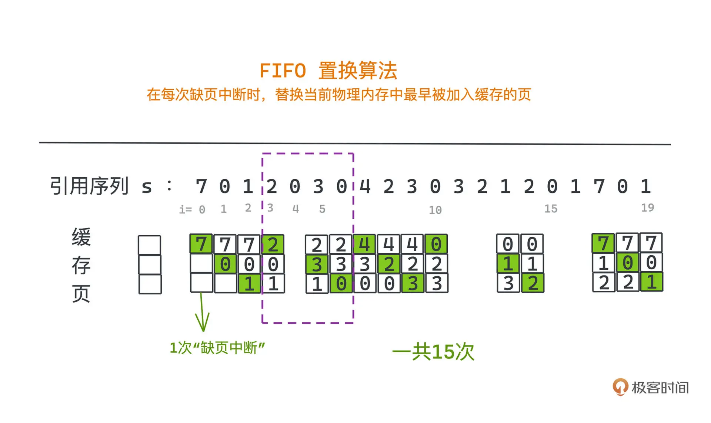

# 操作系统常见算法

## 进程调度算法

进程调度算法，也就是 Process Scheduling Algorithms。

### 进程是什么

在聊进程调度算法之前，我们先简单复习一些操作系统相关的基础概念。

首先，我们要明白进程是什么？

我想“Process”最早被翻译成“进程”，应该指的就是“正在进行的程序”的意思。我们知道计算机是可以同时进行很多任务的，比如你现在可能就边开着浏览器阅读这篇文章，边打开着微信软件随时可以处理好友的消息。你的计算机就像一个真正的时间管理大师一样，并发而有条不紊地处理着各种复杂的任务。

但事实上，每个 CPU 核在同一时间只能同时运行一个程序，那计算机是如何做到看起来可以同时执行很多任务的呢？

这里就需要用到进程、线程之类的抽象了，这也是**早期计算机引入多进程的主要目的，让你的计算机看起来可以同时执行不同的任务**。

我们通常会把不同的程序分配给不同的独立进程去执行，让计算机基于一定的策略，把 CPU 的计算时间调度给不同的进程使用；但因为进程间切换的时间一般比较短，并不能达到人们能感知到的阈值，所以用户在使用计算机的时候就会觉得多个程序或者任务是同时，也就是并发，执行的。

### 进程状态

以 Linux 内核为例，进程的状态还是比较多的，它们都被定义在 include/linux/sched.h 下

```c++
#define TASK_RUNNING                    0
#define TASK_INTERRUPTIBLE              1
#define TASK_UNINTERRUPTIBLE            2
#define __TASK_STOPPED                  4
#define __TASK_TRACED                   8

#define EXIT_DEAD                       16
#define EXIT_ZOMBIE                     32
#define EXIT_TRACE                      (EXIT_ZOMBIE | EXIT_DEAD)

#define TASK_DEAD                       64
#define TASK_WAKEKILL                   128
#define TASK_WAKING                     256
#define TASK_PARKED                     512
#define TASK_NOLOAD                     1024
#define TASK_NEW                        2048
#define TASK_STATE_MAX                  4096
```

**进程状态，本质上就是为了用有限的计算机资源合理且高效地完成更多的任务**。我们就看一种简化的模型来学习，把操作系统进程的状态分为 3 类：READY (就绪的) 、 RUNNING（运行的）、BLOCK（阻塞的）。

RUNNING 就是程序正在执行的状态，非常好理解，READY 和 BLOCK 要涉及程序执行中一块比较重要的耗时来源 IO。因为程序运行除了计算之外，也经常需要与外界进行交互，比如等待用户输入一串文本、或者往显示器上输出一副画面，或者从网卡接受一些数据等等，这些操作，我们一般称为 IO，也就是输入输出。

计算机执行程序的时候是单进程的，如果需要等待一个 IO 操作才能执行后续指令，那在 IO 数据返回前，整个 CPU 就不会执行任何有意义的计算了，也就是只能放在那边空跑。用公司 - 员工的例子就是某个员工被一个任务阻塞了，其他员工也都只能闲着，什么都干不了，这显然不是一个好的策略。

如果有了多进程就不一样了。一个正在运行的进程，如果需要等待一个 IO 操作才能执行后续命令，我们就让这个进程的状态变成阻塞的。操作系统就会把当前阻塞的进程调度开，换一个可以被执行的也就是就绪的进程去运行，被调度执行的新进程现在就成为一个运行中的进程了，而那个被调度到一边的进程 I/O 结束后，也就会重新进入就绪状态。过程切换就像这样：


这是进程的第二个意义：可以提高程序的性能，让我们不必再空等 IO 的耗时，尽可能多地利用 CPU 的计算资源。

### 调度算法

一个合理的调度算法对 CPU 的利用率、程序的总体运行效率、不同任务间的公平性起着决定性的作用，这并不是一件容易的事情，因为 CPU 的算力是各进程所需的资源，但它非常有限，于是人们发明了许多不同的调度策略。

考虑到不同任务的耗时和优先级两项指标，一般可以分为两大类策略：

* 非抢占式调度

操作系统调度到某个进程之后，不会对进程做任何干预，直到该进程阻塞或者结束，才会切换到其他就绪的进程。

* 抢占式调度

操作系统调度到某个进程之后会给它分配一个时间片，如果超过时间片还没有结束或者中途被阻塞，该进程会被操作系统挂起，调度其他进程来执行其他程序。

这里进程的切换主要依赖操作系统的时钟中断，是一个比较复杂的机制，涉及计算机硬件，可以搜索时钟中断了解相关知识。显然，抢占式调度会有更好的公平性，不容易让资源永远被个别耗时长的程序长期霸占，而让其他任务迟迟得不到运行的机会，被饿死；**但抢占式调度也带来了更多的切换次数，这会造成更高的上下文切换的成本**。

就好像不同员工如果用同一个电脑工作，那每次员工被调度开的时候，肯定要保存自己的工作状态，比如保存自己操作的一些数据并关闭文档；下一个员工来的时候，也要恢复自己之前的工作状态。这些都会产生成本。

进程的切换也是一样的，我们需要保留程序运行的状态，然后重新恢复另一个进程的运行状态，像虚拟地址空间映射也需要做相应的转换以保证进程间的隔离性。如果频繁切换就会让 CPU 真正用于计算的时间比例降低。

所以我们很难一概而论说哪种调度方式就是更好的，一般来说：

* 非抢占式调度，更适合调度可以忍受延迟执行的普通进程。

* 抢占式调度，更适合调度交互性要求高的实时进程。

操作系统的应用场景和任务类型很多，有些场景实时性要求就更高。像在自动驾驶场景中，一些碰撞检测或者视觉信号的检测关乎驾驶员和行人的生命安全，显然不能让它们随意被其他播放音乐之类的任务阻塞。我们一定要让这些高优先级的任务可以随时抢占优先使用 CPU，而一些批处理之类的后台任务可以按照先来先到的顺序慢慢执行。

接下来，我们就以 Linux 中进程调度的实现为例，讲一讲基于这两类调度策略的一些常用调度算法；按相同的思路，Linux 进程其实也分为两类，一类是有实时交互需要的，它们需要尽快返回结果，不能一直得不到执行；另一类则是普通进程，大部分优先级要求不高，可以忍受更长时间的得不到执行。

我们先来看实时交互进程中的调度算法。

#### Round-Robin 算法

一种最经典的实现就是 Round-Robin 调度算法，这种算法也常常作为服务器负载均衡的算法，其主要特点就是比较简单且比较公平。

具体做法非常好理解，Round-Robin 本身从字面意义上来说就带有循环的意思，所以顾名思义，我们固定时间片段的长度，然后把所有的进程用一个队列维护，每个进程只能最多执行时间片的最大长度，比如 50ms，如果还没执行完或者因为 IO 等原因阻塞，就得换下一个进程执行了。

实时进程调度的算法衡量指标之一就是平衡性，因为有实时交互需要的进程不能一直得不到执行，需要雨露均沾。比如在图形化的交互任务中，平衡性比较好的调度算法，往往就不会出现有一些计算密集型的任务过多占用 CPU 导致用户体验到卡顿的情况。

所以 Round-Robin 算法最大的优势就是不会存在某个进程执行时间太长，每个程序都可以有机会得到较早的执行。

看 Round-Robin 的例子，一共有 ABCDE5 个进程，arrival time 代表进程产生的时间，service time 代表进程总共需要执行的时间，单位就是时间片的长度。


可以看到，在整个操作系统运行的时间里，这些进程都是轮流执行的，不会一直等待。

那我们选择的时间片是不是越短越好呢？

当然不是。前面说过进程切换是有开销的，每次切换都需要保存程序运行的状态，并将新的状态装载进寄存器中，这些都需要时间，这个时间大约需要 1ms。

如果我们极端一点假设每个时间片只有 2ms，那么每次切换到新的进程，大约需要花费 1ms 恢复现场和保留现场，那真正留给计算机计算的时间只占了总 CPU 运行时间的 50%，这显然是一个极大的浪费，可能直接导致系统上所有的程序运行速度直接拖慢一倍！一般来说，**为了平衡公平性和效率，在目前的硬件架构下，常见的时间片长度为 30-50ms**。

Round-Robin 算法的相应逻辑翻译成伪代码也非常简单：

```c++
time_slot = 50
cur_time = 0 // 用于表示运行的时间
tasks = new queue() // 用于存储所有的进程
while (!tasks.empty()) {
  task = tasks.pop() // 选出队列前的进程运行
  if (task.time > 50) { // 如果运行时间超过时间片长度，需要挂起当前进程
    tastk.time -= 50
    tasks.insert(task) // 并将该进程重新放回队列中重新排队等待下一次调度
    cur_time += time_slot
  } else {
    cur_time += task.time
  }
}
```

当然真实的上下文切换是由时钟中断所触发的，并且如果出现阻塞，当前进程也会直接被调度走，就不在代码中演示了。

在实时进程调度算法中，常用的还有高响应比优先调度 HRRN 算法和多级反馈队列调度 MFQ 算法等，简单介绍一下感兴趣可以自己搜索相关资料学习：

* HRRN 算法是一个非抢占式调度算法，按照“等待时间 / 执行时间”作为优先级排列，每次选择优先级最高的进程执行，直至完成。

* MFQ 算法比较复杂，建立了多个等级的队列，优先级高的队列中的进程总是优先得到调度且时间片短；优先级低的队列则不太容易调度，但调度到可以运行的时间片也更长一些。

我们再来看看实时性要求没有那么强的普通进程是如何被调度的。

在这种场景下，我们通常关注的指标主要有两个：

* 吞吐量，系统单位时间内完成的任务数量。

* 周转时间，每个任务从提交到完成的时间。

常见的算法也都比较简单，主要有三种：FCFS 先到先服务算法、SJF 最短任务优先算法、SRTF 最短剩余时间优先算法，这三种算法都是非抢占式的。

#### FCFS

FCFS（First Come First Serve）是最简单也最直接的，其实它和我们学过的队列很像。

按照进程产生的顺序将它们放到一个队列中，每次调度的时候，直接取队列中第一个进程执行，这是一个非抢占式算法，所以直到这个任务完成或者被阻塞前，我们都会一直执行这个任务；如果这个任务被阻塞了，就重新将它加回队尾重新排队。


但不好的地方就是对短任务不是很公平，如果短任务之前有长任务，长任务就会一直执行，这样一来短任务的周转时间就被拉长了，即使完成它的时间其实很短。整体的平均周转时间也就变得比较差。

#### SJF

有了 FCFS 的基础，我们自然想到，让短任务更优先执行，是不是就能降低平均周转时间了呢？这就是 SJF（Shortest Job First）的思路，SJF 在从队列取出任务的时候，按照作业时间把待作业的任务排序，优先调度最短可以完成的任务。


SJF 因为按各任务的需要时长排序，可能导致长任务一直得到不到执行，会被饿死，而因为最短可完成时长没有把有 IO 的情况纳入计算，也就出现了下一个 SRTF 算法。

#### SRTF

SRTF（Shortest Remaining Time First）从思想上来说和 SJF 差不多，只不过放回队列的时候按照作业剩余时间排序，优先调度剩余完成时间最短的任务。


因为都是非抢占式的调度，在没有 IO 的时候，SRTF 其实和 SJF 的机制是一样的，只不过它可以把有 IO 的情况也纳入到考虑范畴中，如果任务因为阻塞主动调度开，我们再次出队的时候不会再傻傻的按照任务总时长进行排序，而是按照剩余需要的时长进行排序，尽量提高调度整体的吞吐量。

同样，SRTF 基于时长的排序策略也一定程度上放弃了公平性，和 SJF 一样，可能导致长任务一直得到不到执行。

当然，其实还有许多特定场景的调度算法。比如有些系统中，我们会关心某些任务的截止时间，如果任务快到截止时间了，我们需要优先完成接近截止时间的任务。

### 总结

我们讲了几个主要的 CPU 调度算法，大致可以分为抢占式调度和非抢占式调度两大类，分别更加适合调度交互性要求高的实时进程和可以忍受延迟执行的普通进程。在实时交互进程中，有简单且较公平的 Round-Robin 调度算法，在普通进程调度时，有非抢占式的 FCFS 先到先服务算法、SJF 最短任务优先算法、SRTF 最短剩余时间优先算法。

不同的调度算法，有不同的使用场景，很难说哪个算法一定比另一个更好，不同的算法只是在公平性、效率、吞吐量、等待时间等因素间做了不同的取舍，我们要根据实际的需要选择合适的调度算法。

而在许多操作系统之外的场景，相关的调度思想也有许多应用。比如服务器的负载均衡等场景下，我们就可以采用公平的 Round-Robin 算法进行类似的轮训请求；甚至在前端领域也有应用；比如，React 的 fiber 机制也是源于操作系统的进程调度，它很好地解决了 React 网页应用可能因为一些 diff 等需要 cpu 密集计算的操作所带来的卡顿现象，让单线程的 JS 运行时有了“多线程”般的神奇能力。

## 缓存置换算法

### 操作系统的缓存淘汰

我们知道，计算机是建立在物理世界上的，底层的存储计算需要依赖许多复杂的硬件：比如内存、磁盘、纷繁的逻辑电路等。所以**操作系统的一大作用就是，通过虚拟和抽象为应用开发者提供了一套操作硬件的统一接口**，而分页机制的发明，就是为了不需要让用户过度操心物理内存的管理和容量。

通过虚拟内存和分页机制，用户可以在一个大而连续的逻辑地址和非连续的物理地址之间，建立起映射。其中，物理地址既可以真的指向物理内存，也可以指向硬盘或者其他可以被寻址的外部存储介质。

用户的程序可以使用比物理内存容量大得多的连续地址空间；而计算机在运行程序的时候，也不再需要把进程所有信息都加载到内存里，只加载几个当前需要的页就可以了。

但是内存容量并不是无限的，访问到不在内存中的其他页，硬件会触发“缺页”中断，操作系统会在内存中选出一个页，把它替换为需要访问的目标页。这样我们才能访问到需要的数据。

这种场景在各种需要缓存的系统中也很常见。比如知名的缓存中间件 Redis，就是利用内存读取数据的高效性，去缓存其他可能更慢的数据源的数据，以达到更快的 IO 速度，也用到了缓存置换算法。毕竟任何系统的存储空间都不是无限的，当我们缓存的数据越来越多，必然需要置换掉其中一部分数据。

### 置换策略

具体怎么样的置换策略是更合理的呢？

我们主要观察的指标是**缓存命中率**：在整个系统的生命周期里对比数据访问时，可以直接从缓存中读到的次数和数据访问的总次数。

命中率越高，就代表越多数据可以直接从缓存中获取到，系统更少访问成本更高的存储，系统的整体时延就会降低。以操作系统为例，命中率高，就意味着我们发生缺页中断和从外存中获取数据的次数会减少，而访问内存的速度比访问外存要快得多，CPU 利用率当然也就会更高。

在操作系统中，页面置换策略其实有很多种，比较常见的包括 FIFO（先进先出）、LFU（最不经常使用）、LRU（最近最少使用）等。页面置换算法，在上世纪六七十年代曾经是学术界讨论的热点。

其中 LRU 是实际应用最广的策略，因为它有着比较高的命中率并且实现非常简单，在虚拟内存系统中效果非常好。主要思想就是，**当我们需要置换内存的时候，首先去替换最久没有被访问过的数据，这能很好利用数据的时间局部性**，因为我们倾向认为最近被访问过的数据，在整个系统的生命周期里，有更大机会被访问到。

当然，LRU 也不都是最优的，比如在特定负载的网络代理缓存场景下，很可能使用 LRU 就并不是一个最佳选择，因为网络负载很可能在不同的时候变化很大。但是毫无疑问，LRU 在内存管理上有着绝佳的应用。

下面我们结合具体例子来看看这几个页面置换策略的区别。

#### 随机页面置换算法

既然发生缺页中断时，我们需要确定一个主存中需要被替换的页，那么一种很自然而然的想法就是通过软硬件的随机发生器选择一个页面替换。也就是第一种策略，随机页面置换算法。

这种思想非常简单也易于实现，但是很显然，这种算法并不令人很满意。因为它没有用到任何历史访问记录的信息，而历史信息是很有用的，也是我们唯一能用于优化命中率的依据。

另外，这个算法导致同一个引用序列的产生的缺页中断次数是不稳定的，这会导致系统的性能不稳定，所以我们也不太会在实际系统中见到这样的策略。

#### 最优页面置换算法

从这个名字也能看出来，这个算法是一种最优的解法，但只是理论上存在的“上帝”算法，因为它的工作方式是，在替换页面的时候，永远优先替换内存中最久不被访问的那个页面，尽可能晚地触发缺页中断。

第一行就是引用序列，从高到低顺次排列的三个方块就代表三个缓存页，其中绿色的块代表新替换上的页面。


在例子中，我们访问 s[10] = 0 时，就可以把内存中的 4 替换掉，因为 4 在之后的访问中没有出现过。按照类似的策略，观察后续少出现的页码，尽量少触发缺页中断。所以一共只需要触发 9 次缺页中断。

很明显，这并不是一个真的能被实现的算法，因为当运行程序时，并没有很好的办法去预测之后访问的页码是哪些，唯一能做的就是尽量从历史的访问记录里推测出，哪些页码可能会很长一段时间不被访问。

总的来说，这个仅存在于理论上的算法主要的意义就是可以为我们衡量其他算法的好坏做一个参考。

#### FIFO算法

既然要利用历史记录，你是不是很自然想到放得久的数据先置换出去，也就是 First In, First out。这也就是我们要介绍的第三种策略，FIFO，先进先出算法。

在页面置换中，先进先出的策略是这样工作的：在每次缺页中断时，替换当前物理内存中最早被加入缓存的页。实现也很简单，可以通过一个循环链表来存储所有页。这看似比较符合直觉，但在操作系统的实际应用中表现很差。我们结合刚才引用序列的例子来看，可以画出这样的示意图：



可以看到，我们进行了 15 次缺页中断，和最优解相比多了很多次置换。比如在序列是 s[4…6] = 0 3 0 的时候，这里的 0 因为出现的比较早，在 s[5]时被替换成 3 后，又遇到马上要读取 0 的情况，又要做一次缺页中断的操作。

所以对于符合直觉的 FIFO 算法，先加入的页面可能会被多次访问，如果经常让更早被加入但访问频繁的页面被淘汰，显然不是一个很好的策略。这意味着我们不但要用历史数据，还要更好地设计利用的方式，让策略更接近于最优算法。

#### LRU算法

LRU 最近最少使用算法，就是这样一种直观简单、实际检验效果也非常好的页面置换策略。

通过刚才的几个例子，结合你实际使用体验，会发现在操作系统的场景下，**引用序列有明显的局部相关性，每个出现的页码有比较高的概率会在相邻的一段时间里反复出现**。

上一个 FIFO 算法的一大失误就在于没有考虑局部性，当一个页码多次出现时，FIFO 并没有将这个信息记录并反映到淘汰页面的选择策略里，所以可能就会淘汰了一个近期出现过，但是之后又很快就会再次出现的页码。

既然我们不能预测未来，简单替换最早的页码也不好用，那么一种很自然的想法就是，**如果某个页码在过去访问过，就尽量晚点去淘汰它**。我们可以选择内存中最近最少使用的页码进行替换，这也正是 LRU 的策略。


比如在获取数据 3 时，我们在 LRU 中替换的是最久没有被访问的 1，而在 FIFO 中我们替换了 0。但是，0 刚访问过，理论上来说之后访问的概率也会更高，不过在 FIFO 策略下，因为 0 是最早进入的被替换了，就导致了后面访问 0 时产生了一次缺页中断。

相比于 FIFO，同样的例子我们只进行了 12 次缺页中断。采用 LRU 算法，大多数时候会比 FIFO 和随机策略有更好的性能。

### 实现思路

对于从指定页获取数据的操作，可以用一个 HashMap 来模拟，可以用 key 代表页面号，用 value 代表页面中具体的数据。

所以问题可以更通用地抽象为设计一个数据结构，提供 get 和 put 两个接口。get 的时候输入一个 key，我们可以快速地访问 key 所对应的 value；put 的时候设置某个 key 对应的 value。同时这个数据结构初始化时需要设定一个 capaticy，当数据结构中的 key 数量超过 capacity 时，按照淘汰最近最少使用元素的策略进行替换，使得数据结构中最多只有 capacity 个 key-value 对。

之所以说是一种更通用的抽象，就是因为这不止适用于页面置换场景，也适用于许多其他缓存场景，比如在 Redis 中你就可以看到类似的数据结构。

对应在页面置换场景下，每次缺页中断就相当于，对该数据结构进行了 key 为指定页码的 put 操作，而 capacity，自然就是物理内存能存放的最多页数啦。

为了高效地实现内存置换算法，我们大致有两个需求：

1. 找到一种数据结构，使得我们可以随时快速地找到最近最少访问的页码。

2. 在每次缺页中断替换页面的时候，维护这个数据结构不会带来太多额外的成本。

通过维护哈希表，就可以在 O(1) 时间内判断某个 key 是否存在 LRU 中，或者访问到该 key 对应的 value。

但我们还要保证最近最少使用的替换策略，要想办法记录下内存中数据访问的先后关系，才可以保证最近访问过的，要比更早之前访问过的后淘汰。一种很自然的想法就是维护一个基于最近访问时间的有序列表。

这当然有很多种实现方式。比如我们可以维护一个数组，从前到后依次存放最近访问过到最久没有访问过的 key。可是这样每次 get 的时候，我们就需要把数组中某个位置的 key 移动到数组的开始位置，并把后续的元素全部顺移一位。这样整体移动数组的操作的复杂度是 O(N)。双链表就可以实现，在 O(1) 内，删除节点并移动到指定位置的操作。我们可以构建一个双链表，让链表元素按照访问时间顺序从前到后依次排列。

通过双链表 + 哈希表，就可以完美实现 LRU 基于最近访问时间排序的有序列表，这两种数据结构的组合非常常见，也有人称之为 LinkedHashMap。

代码实现参考:

[leetcode0146：LRU 缓存](./../leetcode/0146.LRU 缓存/0146.LRU 缓存.md)

### 总结

通过分页和虚拟内存的抽象，操作系统解放了用户对内存管理和容量的心智负担。当缓存的数据越来越多，如何选择一个合适的页面或缓存内容来替换，就是缓存置换算法的用武之地。

页面置换策略有多种，包括随机置换、FIFO、LRU 等，非常重要且常见的 LRU 通过利用引用列表的局部相关性，提高了页面的命中率。 LRU 的实现也并不是非常复杂，但需要对链表和哈希表有很好的理解才行。

## 日志型文件系统

我们知道计算机的内存一旦断电，数据就会全部丢失，所以如果需要持久化一些数据，磁盘就是必不可少的硬件，甚至在计算机上运行的整个操作系统的大部分代码逻辑，其实也是存储在磁盘中的。

计算机要和磁盘打交道，就需要用到文件系统。文件系统，其实就是操作系统中用于管理文件的子系统，它通过建立一系列诸如文件、目录，以及许多类似于 inode 这样的元数据的数据结构，把基础的文件访问能力抽象出来，给用户提供了一套好用的文件接口。

和一般的数据结构和算法主要考虑性能不同，文件系统还需要考虑一件非常重要的事情——数据的可持久化。因为文件系统一定要保证，计算机断电之后整个文件系统还可以正常运作，只要磁盘没有损坏，上面的数据在重新开机之后都可以正常访问。

这件事听起来感觉很简单，但是真正实践起来可要难得多，在过去几十年里为了解决各种各样不同的问题，文件系统层出不穷，今天我们就来讨论其中一个问题：写文件写到一半断电了，或者因为各种各样的原因系统崩溃了，系统重启之后文件是否还能被正常地读写呢？如果不能的话，我们应该怎么办呢？

这个问题，我们一般叫崩溃一致性问题（crash-consistent problem）。目前最流行的解决方案是 Linux 中的 Ext3 和 Ext4 文件系统所采用的日志方案，也就是 journaling，而 Ext3 和 Ext4 自然也就是所谓的日志型文件系统。

### 崩溃一致性

在讲解问题的具体解决方案之前，我们还是得先来认真审视一下崩溃一致性问题的本质：写文件的时候我们具体做了哪些事情呢？崩溃后为什么可能会产生一致性问题？

这自然也就关系到文件在系统中到底是如何存储的了。不过，不同的文件系统对文件的组织方式千差万别，我们会以 Ext4 中的存储方式为例，带你简单了解演化了许多年之后现在主流的文件系统是如何存储数据的。

目前最主流的持久化存储介质还是磁盘。限于磁盘的物理结构，它读写的最小单位是扇区，大小是 512B，但是每次都只读一个扇区，不利于读写效率的提升；所以文件系统普遍会把多个扇区组成一个块，也就是 block。在 Ext4 中，逻辑块的大小是 4KB，包含 8 个扇区。

我们的数据自然也就是放在这一个个数据块上的。不过和内存一样，磁盘空间大小虽然大的多，但仍然是有限的，我们需要为不同的文件划分出自己的区域，也就是数据具体要存储在哪些块上的。

为了更灵活地存储文件、更高效地利用磁盘空间、更快速地访问到每个文件的数据存储在哪些块上，Linux 的做法是把文件分成几块区域：至少包括超级块、索引节点区、数据块区。


* 超级块，是文件系统中的第一个块，用来存放文件系统本身的信息，比如可以用于记录每块区域的大小；
* 索引节点区，每个文件对应索引节点区中的一个块，我们称为索引节点，也就是 Inode，存放每个文件中所用到的数据块的地址，Inode 也是元数据主要存储的地方；
* 数据块区，也就是 Data Blocks，这里是真实数据存放的区域，一个文件的 inode 可能存有多个指向数据块的指针。

另外，为了标记哪些 Inodes 和 Data Blocks 可以被使用，操作系统还建立了两块存放 Bitmap 的区域。

这样我们就可以非连续地表示各种大小的文件了，因为在索引节点上就会有很多指针链到数据区的不同区块；我们也就可以快速地获取文件所需要的数据内容了，只要在访问文件的时候根据索引节点中的指针和操作系统的磁盘调度算法，读取文件中数据块中的内容即可。

### 引入元数据的问题

但是在文件系统中引入了元数据带来了灵活性的同时，也带来了问题。

现在每个文件都对应一个 Inode，它记录了所有数据块的位置，可以预想到，之后在修改、创建文件的时候，除了修改数据块区的内容，也需要修改文件的元数据和 Bitmaps。比如，当我们往某个文件里追加数据，很可能就需要创建新的数据块把数据写入其中，并且在 Inode 上追加一个指向这个数据块的指针。

总之这么看，每次写文件的操作其实都是一个操作序列，而不是一个单一的操作。但是，磁盘在同一时间里肯定只能接受一次读写的请求，因此文件系统就引入了崩溃一致性问题。

这很好理解，我们看一个具体的例子。

已知我们写一个文件至少会碰到 Bitmaps、Inodes 和 Data Blocks 三块数据的修改，在不会遇到崩溃的时候，我们可能顺利修改了每个部分，此时文件系统没有任何问题。

但假设，修改完 Inodes 了，我们把 Inodes 中某个指针指向了一段即将要存放数据内容的数据块，此时如果遭遇了断电，Data Blocks 上的内容是未知的，很可能是很早之前别的程序写过的数据，我们可以认为此时上面的数据是脏的垃圾数据。等系统恢复，我们重新去读取文件数据的时候，会发现也没有什么有效的依据供我们检验文件是否正常。

在这种情况下，Inodes 指向的文件内容和我们的预期就会不一致，从而产生文件损坏的情况。其实和我们平时说的事务性、原子性是类似的场景。

这也只是不一致的一种情况。事实上，因为操作系统会对磁盘读写的顺序做调度，以提高读写的效率，我们其实不能知道这几个写磁盘的独立步骤确切的执行顺序。

不过可以想见，在其他几种写 Inodes、Data Blocks 和 Bitmaps 的顺序下，**如果没有执行完全部步骤就遭遇了断电等情况，文件系统在大部分时候仍然都会进入不正确的状态，这就是崩溃一致性问题**，如果你感兴趣可以模拟其他几种情况。

### 如何解决

现在，我们搞清楚了崩溃一致性问题的本质，自然就要尝试解决它。历史上比较流行的解决方案有两种：一种是早期操作系统普遍采用的 FSCK 机制（file system check），另一种就是我们今天主要学习的日志机制（journaling file system）。

解决方案 1：FSCK

FSCK 机制的策略很简单：错误会发生，没关系，我们挂载磁盘的时候检查这些错误并修复就行。

比如，检查发现 Inodes 和 Bitmaps 不一致的时候，我们选择相信 Inodes，而更新 Bitmaps 的状态；或者当两个 Inodes 都指向同一个 block 时，我们会把其中明显是异常的一个 Inodes 移除。

但因为崩溃，毕竟有一部分信息是丢失了的，所以很多时候我们也没有办法智能地解决所有问题，尤其是前面说的 Inodes 指向脏数据的情况，事实上这种情况下，FSCK 没有办法做任何事情，因为它本质上只是让文件系统元数据的状态内部保持一致而已。但是，这还不是 FSCK 最大的问题。

**FSCK 真正的问题是，每次出现问题需要执行 FSCK 的时候的时间非常久**。

因为需要扫描全部磁盘空间，并对每种损坏的情况都做校验，才能让磁盘恢复到一个合法的状态，对普通的家用电脑来说，很可能需要长达几十分钟甚至几小时的时间。所以，现在 FSCK 基本上已经不再流行，取而代之的就是日志型文件系统。

解决方案 2：Journaling

日志型文件系统这个方案，其实是从 DBMS 也就是数据库系统中借鉴而来的。

journaling file system 的核心思想是鼎鼎大名的预写日志 WAL 也就是 write-ahead logging，这个也正是数据库系统中用于实现原子事务的主要机制，也很好理解，毕竟事务和文件系统一样，都需要保证一致性。

那具体是怎么做的呢？思想也很简单，就是**每次在真正更新磁盘中的数据结构之前，我们把要做的操作先记录下来，然后再执行真正的操作，这也就是先写日志，WAL 中 write-ahead 的意思**。这样做的好处在于，如果真的发生错误的时候，没有关系，我们回去查阅一下日志，按照日志记录的操作从头到尾重新做一遍就可以了。

这样我们通过每次写操作时增加一点额外的操作，就可以做到任何时候遭遇崩溃，都可以有一个修复系统状态的依据，从而永远能恢复到一个正确的状态。

对于文件系统的布局，我们也只是需要增加一块区域用于存放日志就行，改动不是很大，这块区域我们叫做日志区（Journal）。

那 Journal 区里到底要存放点什么样的内容呢？

这里会涉及一次完整的写文件对磁盘的一系列操作，你不熟悉的话也没有关系，就当这是几个独立的操作就行。**我们核心就是要实现：希望可以通过某种记录日志的方式，让这些操作一旦决定被提交，即使后续对磁盘上元数据和数据块上数据结构的改动进行到一半，系统断电了，仍然可以根据这个日志恢复出来**。

那要怎么做呢？和数据库一样，我们为了让一系列操作看起来具有原子性，需要引入“事务”的概念。

我们每次进行一次对文件的写操作，除了会先在预写日志中，记录对 Inodes 的修改记录、对 Bitmaps 的修改记录，以及对具体数据块的修改记录之外，还会同时在这几条记录的前后，分别引入一个事务开始记录和一个事务结束记录。

第一个写入的记录是 TxB，也就是 Transaction Begin 记录，最后一个写入的记录就是 TxE 也就是 Transaction End 记录，在 TxE 记录完成后，就意味着整个写文件的操作全过程都被记录在案了，我们把这个步骤叫做 Journal Write。

从而，日志的组织形式就是由这样一个个事务拼接而成，日志的首尾是 TxB 和 TxE 块，中间是具体对元数据和数据块修改的记录块。

当我们完成 Journal Write 操作之后，就可以放心大胆地把这些实际的元数据或文件数据覆写到磁盘上对应的数据结构中了，这个步骤我们叫做 checkpointing。

当这个步骤也成功完成，我们就可以说整个写文件的操作被完成了，在全部成功的情况下当然没什么特别的，**但整个设计的关键之处就在于，面对任意时刻崩溃的情况，我们也能把文件系统恢复到某一合法状态的能力**。


我们具体看看崩溃出现的时候，引入了 journaling 的文件系统会有什么不同吧。

* 如果崩溃出现在 journal write 步骤中

假设崩溃是出现在 TxE 块完成写操作之前，那其实对系统也没有任何影响。因为相当于事务没有被成功提交，而我们写的是日志，对文件本身也没有任何实际影响。

当系统断电又恢复之后，只要发现某个事务 ID 没有对应的 TxE 块，说明这个事务没有提交成功，不可能进入 checkpointing 阶段，丢弃它们对文件系统没有任何不良影响，只是相当于上次写文件的操作失败了而已。

* 如果崩溃刚好发生在 journal write 结束之后

不管是刚刚写完 TxE，还是已经进入了 checkpointing 的某一步，我们的处理也都是一样的。既然事务已经被提交，系统断电恢复之后，我们也不用关心之前到底 checkpointing 执行到了哪一步，比如是已经更新了 inodes？还是 bitmaps？都没有任何影响，直接按照日志重做一遍就可以，最坏的下场也不过就是重新执行了一遍执行过的操作。

顾名思义，这种重做一遍的日志我们也把它称为 redo logging，它也是一种最基本、最常见的日志记录方式。不只在文件系统中，在数据库等场景下也使用非常广泛。

### 总结

我们就通过引入预写日志的手段，完美解决了操作系统文件状态在崩溃后可能不一致的问题，相比于从头到尾扫描检查的 FSCK 机制。预写日志，在每次写操作的时候引入一些额外的写成本，让文件系统始终得以始终处于一种可以恢复到一致的状态，如果崩溃，只需要按照日志重放即可。

当然我们其实还有很多优化可以做。比如，可以进行批量日志的更新，把多个独立的文件写操作放到一个事务里提交，提高吞吐量；或者记录日志的时候只记录元数据，而不记录文件写操作的大头数据块等等。如果你仔细看 Linux 文件系统的实现就会发现，做的优化非常多，集结了许多前人的智慧，我们可以从中领略到很多思想，也许有一天在你的工作中，这些想法就会成为你解决一些问题的关键。