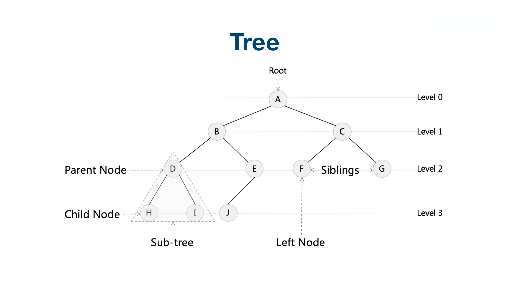
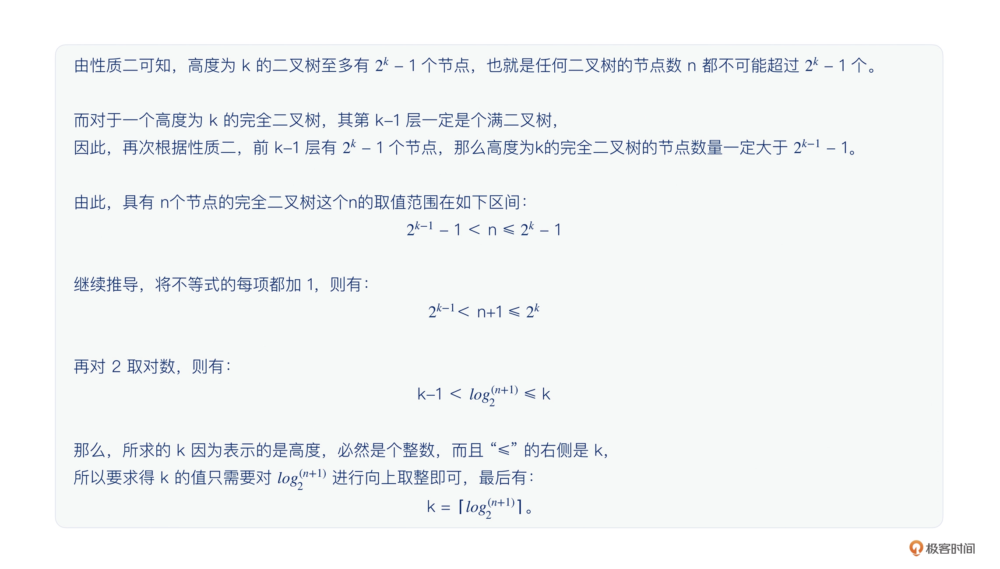
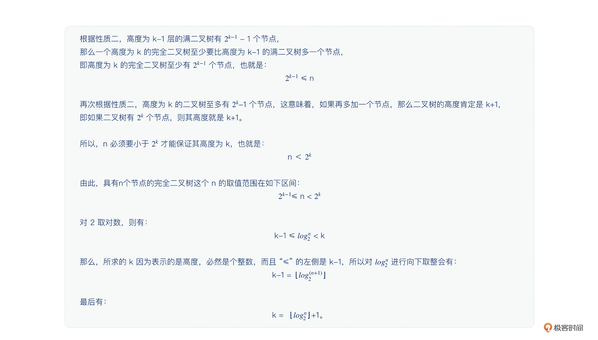
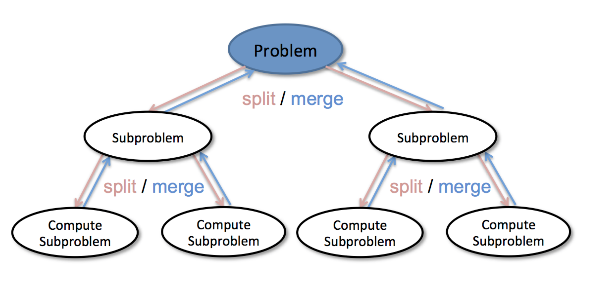

# 数据结构与算法学习笔记

**数据结构**指的是数据之间的结构组织。数据组织的结构不同，数据的存取效率就会产生巨大的差异。

数据结构的三要素分别是逻辑结构、存储结构、数据的运算。我们可以将数据结构理解为一组数据在计算机中的存储结构，或者是相互之间存在一种或多种特定关系的数据集合。

**算法**是操作数据，解决特定问题的求解步骤和方法。

算法通常具备五个特性：

1. 输入：传递给算法的参数或数据。算法可以有零个或多个输入。
2. 输出：算法处理的结果。算法必须有输出，否则算法就没有存在的意义。
3. 有穷性：在有限的步骤内执行完。不会出现无限循环，每个步骤也能在可接受的时间内完成。
4. 确定性：相同的输入只能产生唯一的输出结果。换句话说，算法的每个步骤都具有确定的含义，不会出现二义性。
5. 可行性：可以用已有的基本操作来实现算法，算法的每一步都能够通过执行有限次数来完成。

一个好的算法在设计上通常需要满足四个要求：

1. 正确性：算法能够正确反映问题的需求，能够正确解决问题。
2. 可读性：对算法的描述及实现代码要具备良好的可读性，以便于阅读、理解和交流。
3. 健壮性：输入数据不合法时，算法能做适当处理，而不是产生异常或无法预知的结果。
4. 满足高时间效率和低存储量需求：高时间效率指算法运行的速度快，节省时间，低存储量指算法运行时所需的内存空间少。


## 1.算法时间复杂度

算法的时间复杂度用于度量算法的执行时间。

### 大O时间复杂度表示法

Big O notation

$T(n)=O(f(n))$

* n，表示问题规模的大小
* T(n)，表示算法的执行时间，也就是算法的时间复杂度
* f(n)，表示代码的执行次数总和
* O，表示代码的执行时间T(n)与f(n)的函数关系(正比关系)

算法时间复杂度表示的不是代码真正的执行时间，而是代码执行时间随问题规模增长的变化趋势，或者说代码的执行时间与问题规模之间的增长关系。所以，我们也把它叫作算法的渐进时间复杂度，简称时间复杂度。

在大O时间复杂度表示法中，当算法的问题规模 n 足够大的时候，f(n)中的系数、常量、低阶都变得无关紧要，可以忽略掉，不会影响代码执行时间随问题规模增长的变化趋势。

### 算法时间复杂度计算规则

* 规则 1：只关注循环中的代码段

  在分析一个算法的时间复杂度时，我们只需要关注循环中的代码段，该代码段的执行次数对应的问题规模 n 的阶数（数量级）就是整个算法的时间复杂度。

* 规则 2：加法规则

  加法规则的算法时间复杂度取决于阶数最高的代码段的复杂度。

  $若有T1(n)=O(f(n))，T2(n)=O(g(n))，则T(n)=T1(n)+T2(n)=O(f(n))+O(g(n))=O(max(f(n),g(n)))$

* 规则 3：乘法规则

  乘法规则的算法时间复杂度取决于内外循环代码段时间复杂度的乘积。

  $若有T1(n)=O(f(n))，T2(n)=O(g(n))，则T(n)=T1(n)*T2(n)=O(f(n))*O(g(n))=O(f(n)*g(n))$

### 常见算法时间复杂度分析

* O(1): Constant Complexity，常数阶复杂度

* O($logn$): Logarithmic Complexity，对数阶时间复杂度    

  > 讨论对数阶时间复杂度时，统一认为以2为底，而且书写时间复杂度时，通常这个底数2也忽略不写。
  >
  > 根据对数换底公式 $log_bn =log_ba* log_an$可知，对数之间可以相互转换，所以$ log_3n=log_32 log_2n$，因此 $O(log_3n)=O(log_32log_2n)$，而其中的 $log_32$是一个常数，作为系数可以忽略。

* O(n): Linear Complexity，线性阶时间复杂度

* O($nlogn$): 线性对数阶时间复杂度

* O($n^2$): N square Complexity，平方阶时间复杂度

* O($n^3$): N square Complexity，立方阶（由平方阶、立方阶，其实可以扩展出k次方阶，用O($n^k$)表示

* O($2^n$): Exponential Growth，指数阶

* O($n!$): Factorial，阶乘阶


O($2^n$)、O($n!$)、O($n^n$)这三个时间复杂度对应的算法，在问题规模n逐渐增大时，所需要的执行时间将急剧增加，效率很低，计算机往往无法承受，因此这三个时间复杂度又被称为**非多项式量级**的时间复杂度，一般很少讨论。而其余的时间复杂度被称为**多项式量级**的时间复杂度。不论怎样，在计算机可以承受的前提下，写出阶数更低的算法是每个开发者都应该追求的目标。

### 最好、最坏、平均情况时间复杂度

**最好情况时间复杂度**就是在最理想情况下执行这段代码的时间复杂度。

**最坏情况时间复杂度**就是在最差情况下执行这段代码的时间复杂度。

**平均情况时间复杂度**表示平均情况下的时间复杂度。

当讨论算法复杂度时，通常指最坏情况时间复杂度，平均情况时间复杂度也应该给予关注。

## 2.算法空间复杂度

算法的空间复杂度就是用于衡量算法运行所需要的存储空间与问题规模之间的增长关系。

算法的空间复杂度同样采用大 O 表示法，与时间复杂度很类似，引入大 O 空间复杂度表示法，有公式 $S(n) = O(f(n))$。

* n：表示问题规模的大小。
* S(n)：表示算法执行所需要的空间（S 指的是 Space），也就是算法的空间复杂度。既然 S(n) 这对圆括号中包含了一个 n，则表示算法执行所需要的空间必然与问题规模有紧密的关系。
* f(n)：表示代码的执行次数总和。f(n) 中的系数、常量、低阶同样都可以忽略掉，这一点与算法的时间复杂度一样。
* O：表示代码执行所需的空间 S(n) 与 f(n) 的函数关系（正比关系）。

### 常见算法空间复杂度分析

* O(1)：常数阶空间复杂度  

  **这种算法在执行过程中只需要固定大小内存空间的情形，也叫作算法原地工作。**

* O(n)：线性阶空间复杂度

  如果每次递归调用所需要的内存空间大小固定不变，那么算法的空间复杂度一般都是等于递归调用深度。

* $O(n^2)$：平方阶空间复杂度

## 3.数据结构

### 通用数据结构的时间空间复杂度

来源：https://www.bigocheatsheet.com/


### 栈

**栈(stack)**是一种特殊的线性表，其插入（也称入栈或压栈）和删除（也称出栈或弹栈）操作都在表的同一端进行。这一端称为**栈顶**(top)，另一端称为**栈底**(bottom)。栈是一个后进先出（last-in-first-out，LIFO）的数据结构。

### 队列

**队列(queue)**是一个特殊的线性表，其插入和删除操作分别在表的不同端进行。插入元素的那一端称为**队尾**(back 或 rear)，删除元素的那一端称为**队首**(front)。队列是一个先进先出（FIFO）的数据结构。

### 哈希表

**散列表**（**Hash table**，也叫**哈希表**），是根据键（Key）而直接访问在内存存储位置的数据结构。也就是说，它通过计算一个关于键值的函数，将所需查询的数据映射到表中一个位置来访问记录，这加快了查找速度。这个映射函数称做散列函数，存放记录的数组称做**散列表**。

### 树

一棵树 t 是一个非空的有限元素的集合，其中一个元素为根(root)，其余的元素（如果有的话）组成 t 的子树。



**级(level)**：树根是1级，其孩子（如果有）是2级，孩子的孩子是3级。

一棵树的**高度(height)**或**深度(depth)**是树中级的个数。

一个**元素的度(degree of an element)**是指其孩子的个数。**一棵树的度(degree of a tree)**是其元素的度的最大值。

#### 二叉树

一棵二叉树 t 是有限个元素的集合。当二叉树非空时，其中有一个元素称为根，余下的元素被划分为两棵二叉树，分别称为 t 的左子树和右子树。

```c++
 struct TreeNode {
     int val;
     TreeNode *left;
     TreeNode *right;
     TreeNode() : val(0), left(nullptr), right(nullptr) {}
     TreeNode(int x) : val(x), left(nullptr), right(nullptr) {}
     TreeNode(int x, TreeNode *left, TreeNode *right) : val(x), left(left), right(right) {}
 };
```

##### 满二叉树

满二叉树的特点：

1. 所有的分支节点都存在左子树和右子树（非叶节点的度一定是 2）。

2. 所有的叶子都在同一层上（这也意味着叶节点只能出现在最下一层）。
3. 不存在度为非 0 和非 2 的节点。

满二叉树的定义：满二叉树是指一棵高度为 h，且含有 $2^h-1$ 个节点的二叉树。

##### 完全二叉树

完全二叉树的特点：

1. 叶节点都在最底下两层。
2. 最后一层的叶节点都靠左侧排列（左侧连续），并且除最后一层，其他层的节点个数都要达到最大。
3. 倒数第二层如果有叶节点，则叶节点都靠右侧排列（右侧连续）。
4. 如果节点度为 1，则该节点只有左子树，不可以只有右子树。而且最多只有一个度为 1 的节点。

**满二叉树一定是一棵完全二叉树，但完全二叉树不一定是满二叉树。**

完全二叉树的定义：一棵高度为 h 的完全二叉树，当且仅当其每个节点都与高度为 h 的满二叉树中编号为 1~n 的节点一一对应时，称为完全二叉树。

##### 二叉树的性质

* 性质一：在二叉树的第 i 层上，最多有$2^{i−1}$个节点（i≥1）

* 性质二：高度为 k 的二叉树至多有$2^k-1$ 个节点（k≥1）

* 性质三：二叉树节点的总数量等于节点的总度数 +1

* 性质四：对任何一棵二叉树，如果其叶节点数量为n0，度为 2 的节点数量为n2，则叶节点的数量比有两棵子树的节点数量多一个，即：n0=n2+ 1。

  > 非完全二叉树，除了叶节点（度为 0），其他的节点度数要么为 1 要么为 2，如果假设度为 1 的节点数量是 n1，那么该二叉树的节点总数量 n = n0 + n1 + n2。再算一算节点的总度数，节点的总度数应该等于 2 度节点数量 *2+1 度节点数量 *1，因此，节点的总度数 = 2n2 + n1。再根据性质三，节点的总数量 = 节点的总度数 + 1，就有：节点总数量 n = 2n2 + n1+ 1。结合刚才的节点总数量式子，可以得到：n0 + n1 + n2 = 2n2 + n1+ 1。两边同时减少一个 n1 和一个 n2，不难得到：n0  =  n2+ 1，得出了性质四的结论。

* 性质五：具有 n（n>0）个节点的完全二叉树的高度为$⌈log_2(n+1)⌉$ 或者 $⌊log_2n⌋ +1$。

  > 
  >
  > 第一个式子推导：
  >
  > 第二个式子推导：
  >
  > 

扩展一下性质五：一个完全二叉树的第 k 的节点的高度为$⌈log_2(k+1)⌉$ 或者 $⌊log_2k⌋ +1$。

* 性质六：如果对一棵有 n 个节点的完全二叉树的节点按层从 1 开始编号（从上到下从左到右编号），对任意节点 i（1≤i≤n），有：

  如果 i=1，则节点 i 是二叉树的根，无父节点，如果 i>1，则其父节点编号是⌊i/2⌋。

  如果 2i>n，则节点 i 为叶子节点（无孩子节点），否则，其左孩子是节点 2i。

  如果 2i+1>n，则节点 i 无右孩子（但可能有左孩子），否则其右孩子是节点 2i+1。

##### 二叉树遍历

根据根的位置

* 前序(Pre-order)：根-左-右
* 中序(In-order)：左-根-右
* 后序(Post-order)：左-右-根

#### 二叉搜索树

二叉搜索树(Binary Search Tree)，也称二叉搜索树、有序二叉树(ordered binary tree)，排序二叉树(sorted binary tree)，是指一棵空树或者具有下列性质的二叉树：

1. 若任意节点的左子树不空，则左子树上所有结点的值均小于它的根结点的值；
2. 若任意节点的右子树不空，则右子树上所有结点的值均大于它的根节点的值；
3. 任意节点的左 、右子树也分别为二叉查找树。

### 图

#### 图的遍历

在树(图/状态集)中寻找特定节点。

* **广度优先搜索(breadth first search，BFS)**

  从一个顶点开始，搜索所有可到达顶点的方法叫做**广度优先搜索**。这种搜索方法可使用队列实现。

  ```c++
  void BFS(Node start){
      queue<xxx> q;
      q.push(start);
      set<xxx> visited;
      visited.insert(start);
      
      while(!q.empty()){
          node = q.pop();
          visited.insert(node);
          
          process(node);
          // 1.找node后继节点 2.判断后端节点没有被访问过
          nodes = generate_related_nodes(node);
          q.push(nodes);
      }
  }
  ```

  为了防止重复访问，需要一个判重的数组或集合，记录节点是否已经被访问过。

  搜索开始，把开始节点放到队列里，并标记为已经访问过。接下来对队列进行循环，只要队列不为空，我们就把队列头元素取出。取出后首先标记为已经访问过，然后进行一系列的操作。操作完后，我们将这个节点的后继节点取出来，且判断没有被访问过，则加到队列里。然后继续循环，一直到整个队列都访问完为空。

* **深度优先搜索(depth first search，DFS)**

  从一个顶点v出发，首先将v标记为已到达的顶点，然后选择一个邻接于v的尚未到达的顶点u。如果这样的u不存在，则搜索终止。假设这样的u存在，那么从u又开始一个新的DFS。

  **递归写法**

  ```c++
  set<XXX> visited;
  void DFS(Node node){
      visited.insert(node);
      
      //process current node here
      ...
      for (next_node in node.children()){
          if (!visited.count(next_node)){
              dfs(next_node)
          }
      }
  }
  ```

  标记当前节点已经访问，并对当前节点进行操作。接下来遍历当前节点的所有后继节点，如果没有被访问过，则递归调用继续访问。递归本身给我们实现了栈的数据结构来存所有的节点。

  **非递归写法**

  ```c++
  void DFS(Node root){
      set<XXX> visited;
      
      stack<XXX> stk;
      stk.push(root);
      
      while(!stk.empty()){
          node = stk.top();
          stk.pop();
          visited.insert(node);
          
          nodes = generate_related_nodes(node);
          stk.push(nodes);
      }
  }
  ```

  使用栈，每次从栈中弹出当前栈顶元素进行处理，同时把当前元素的后继节点推入到栈中。不断循环直到栈中元素为空。

## 4.算法


### 滑动窗口

滑动窗口模板化解题，五步走策略：

1、定义需要维护的变量

2、定义窗口的首尾端 (start, end)， 然后滑动窗口

3、更新需要维护的变量, 有的变量需要一个 if 语句来维护 (比如最大最小长度)

4、如果题目的窗口长度可变: 这个时候一般涉及到窗口是否合法的问题

如果当前窗口不合法时, 用一个 while 去不断移动窗口左指针, 从而剔除非法元素直到窗口再次合法

5、返回所需要的答案


### 递归

通过函数体来进行的循环

递归代码模板

```c++
void recursion(level, param1, param2, ...){
    // 递归终止条件 recursion terminator
    if(level > MAX_LEVEL){
        print_result();
        return
    }
    // 当前层业务逻辑 process logic in current level
    process_data(level, data...);
    // 递归调用下一层 drill down
    recursion(level + 1, p1, ...);
    // 如果需要，返回当前层收尾工作 reverse the current status if needed
    reverse_state(level);
}
```

### 分治

递归经常会在一些高阶的算法用到，其中一种是"分治(Divide & Conquer)"。

分治：先把一个大的问题剖析成子问题，子问题再一一进行解决。



好处是可以并行计算，因为每一个子问题是互不相关的。

Note：分治可以解决的问题，是它没有中间结果，也就是没有重复计算。如果有大量重复计算，分治可能效率并不高。那时可以有更适合的算法，比如动态规划、把中间结果保存起来下次直接使用(子问题记忆)。

分治算法代码模板：

```c++
void divide_conquer(problem, param1, param2, ...){
    // 递归终止条件 recursion terminator
    if(problem is None){
        print_result();
        return;
    }
    
    // 准备数据，拆分子问题 prepare data
    data = prepare_data(problem);
    subproblems = split_problem(problem, data);
    
    // 解决子问题 conquer subproblems
    subresult1 = divide_conquer(subproblems[0], p1, ...);
    subresult2 = divide_conquer(subproblems[1], p1, ...);
    subresult3 = divide_conquer(subproblems[2], p1, ...);
    ...
    
    // 子结果合并 process and generate the final result
    result = process_result(subresult1, subresult2, subresult3, ...);
}
```


### 回溯算法

回溯（backtrack）：一种通过探索所有可能的候选解来找出所有的解的算法。如果候选解被确认不是一个解（或者至少不是最后一个解），回溯算法会通过在上一步进行一些变化抛弃该解，即回溯并且再次尝试。


回溯算法的思考步骤如下：

1、画出递归树，找到状态变量(回溯函数的参数)

2、寻找结束条件，由于回溯算法是借助递归实现，所以也就是去寻找递归终止条件

3、确定选择列表，即需要把什么数据存储到结果里面

4、判断是否需要剪枝，去判断此时存储的数据是否之前已经被存储过

5、做出选择，递归调用该函数，进入下一层继续搜索

6、撤销选择，回到上一层的状态

回溯算法解题的一个模板：

```c++
// 1、画出递归树，找到状态变量(回溯函数的参数)
private void backtrack("原始参数") {
  
    // 2、寻找结束条件，由于回溯算法是借助递归实现，所以也就是去寻找递归终止条件
    if ("终止条件") {
        // 一些逻辑操作（可有可无，视情况而定）
       // 比如，在 N 皇后问题中，在这一步把数据加入到了结果里面
       添加操作
        return;
    }
  
   // 3、确定选择列表，即需要把什么数据存储到结果里面
   // for 循环就是一个选择的过程
    for ("遍历本层集合中元素") {
      
        // 一些逻辑操作（可有可无，视情况而定）
       // 4、判断是否需要剪枝，去判断此时存储的数据是否之前已经被存储过
    
        // 5、做出选择，递归调用该函数，进入下一层继续搜索
        // 递归
        backtrack("新的参数");
      
        // 一些逻辑操作（可有可无，视情况而定）

        // 6、撤销选择，回到上一层的状态
    }
}
```

### 二分查找

Binary Search

三个要求：

1. Sorted（查找的数在一个有序的数组里，单调递增或者递减）
2. Bounded（存在上下界）
3. Accessible by index（能够通过索引访问）

二分查找代码模板

```c++
left, right = 0, len(array) - 1
while left <= right:
	mid = left + (right - left) / 2
    if array[mid] == target:
		//find the target!!
		break or return result
    elif array[mid] < target:
		left = mid + 1
    else:
		right = mid - 1
```

把一个递增的数组一分为二，每次和中间数比较，小于中间数则在左边继续查找，大于中间数则在右边继续查找，找到则返回
