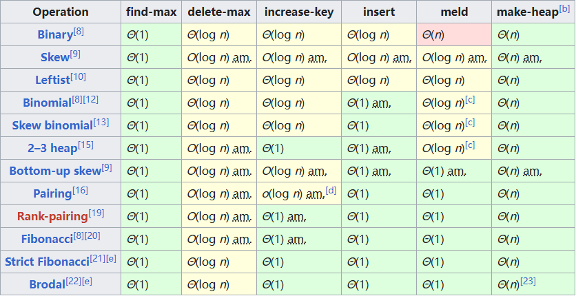
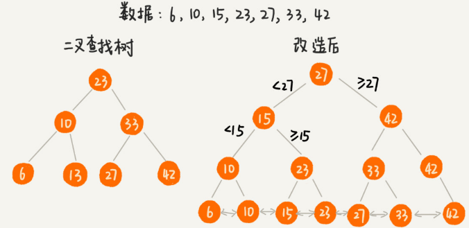
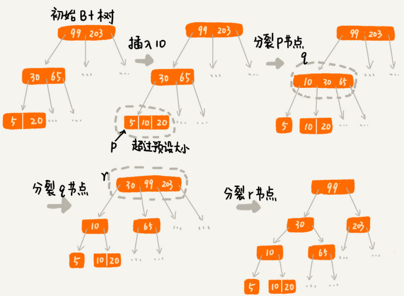
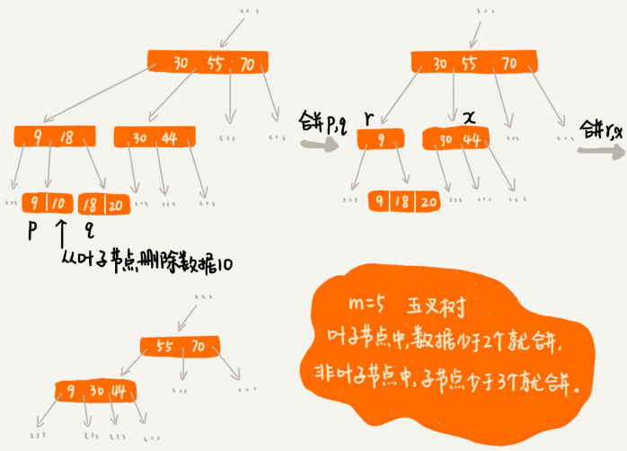
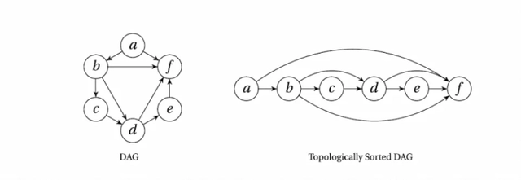

# 数据结构与算法学习笔记

**数据结构**指的是数据之间的结构组织。数据组织的结构不同，数据的存取效率就会产生巨大的差异。

数据结构的三要素分别是逻辑结构、存储结构、数据的运算。我们可以将数据结构理解为一组数据在计算机中的存储结构，或者是相互之间存在一种或多种特定关系的数据集合。

**算法**是操作数据，解决特定问题的求解步骤和方法。

算法通常具备五个特性：

1. 输入：传递给算法的参数或数据。算法可以有零个或多个输入。
2. 输出：算法处理的结果。算法必须有输出，否则算法就没有存在的意义。
3. 有穷性：在有限的步骤内执行完。不会出现无限循环，每个步骤也能在可接受的时间内完成。
4. 确定性：相同的输入只能产生唯一的输出结果。换句话说，算法的每个步骤都具有确定的含义，不会出现二义性。
5. 可行性：可以用已有的基本操作来实现算法，算法的每一步都能够通过执行有限次数来完成。

一个好的算法在设计上通常需要满足四个要求：

1. 正确性：算法能够正确反映问题的需求，能够正确解决问题。
2. 可读性：对算法的描述及实现代码要具备良好的可读性，以便于阅读、理解和交流。
3. 健壮性：输入数据不合法时，算法能做适当处理，而不是产生异常或无法预知的结果。
4. 满足高时间效率和低存储量需求：高时间效率指算法运行的速度快，节省时间，低存储量指算法运行时所需的内存空间少。


## 1.算法时间复杂度

算法的时间复杂度用于度量算法的执行时间。

### 大O时间复杂度表示法

Big O notation

$T(n)=O(f(n))$

* n，表示问题规模的大小
* T(n)，表示算法的执行时间，也就是算法的时间复杂度
* f(n)，表示代码的执行次数总和
* O，表示代码的执行时间T(n)与f(n)的函数关系(正比关系)

算法时间复杂度表示的不是代码真正的执行时间，而是代码执行时间随问题规模增长的变化趋势，或者说代码的执行时间与问题规模之间的增长关系。所以，我们也把它叫作算法的渐进时间复杂度，简称时间复杂度。

在大O时间复杂度表示法中，当算法的问题规模 n 足够大的时候，f(n)中的系数、常量、低阶都变得无关紧要，可以忽略掉，不会影响代码执行时间随问题规模增长的变化趋势。

### 算法时间复杂度计算规则

* 规则 1：只关注循环中的代码段

  在分析一个算法的时间复杂度时，我们只需要关注循环中的代码段，该代码段的执行次数对应的问题规模 n 的阶数（数量级）就是整个算法的时间复杂度。

* 规则 2：加法规则

  加法规则的算法时间复杂度取决于阶数最高的代码段的复杂度。

  $若有T1(n)=O(f(n))，T2(n)=O(g(n))，则T(n)=T1(n)+T2(n)=O(f(n))+O(g(n))=O(max(f(n),g(n)))$

* 规则 3：乘法规则

  乘法规则的算法时间复杂度取决于内外循环代码段时间复杂度的乘积。

  $若有T1(n)=O(f(n))，T2(n)=O(g(n))，则T(n)=T1(n)*T2(n)=O(f(n))*O(g(n))=O(f(n)*g(n))$

### 常见算法时间复杂度分析

* O(1): Constant Complexity，常数阶复杂度

* O($logn$): Logarithmic Complexity，对数阶时间复杂度    

  > 讨论对数阶时间复杂度时，统一认为以2为底，而且书写时间复杂度时，通常这个底数2也忽略不写。
  >
  > 根据对数换底公式 $log_bn =log_ba* log_an$可知，对数之间可以相互转换，所以$ log_3n=log_32 log_2n$，因此 $O(log_3n)=O(log_32log_2n)$，而其中的 $log_32$是一个常数，作为系数可以忽略。

* O(n): Linear Complexity，线性阶时间复杂度

* O($nlogn$): 线性对数阶时间复杂度

* O($n^2$): N square Complexity，平方阶时间复杂度

* O($n^3$): N square Complexity，立方阶（由平方阶、立方阶，其实可以扩展出k次方阶，用O($n^k$)表示

* O($2^n$): Exponential Growth，指数阶

* O($n!$): Factorial，阶乘阶


O($2^n$)、O($n!$)、O($n^n$)这三个时间复杂度对应的算法，在问题规模n逐渐增大时，所需要的执行时间将急剧增加，效率很低，计算机往往无法承受，因此这三个时间复杂度又被称为**非多项式量级**的时间复杂度，一般很少讨论。而其余的时间复杂度被称为**多项式量级**的时间复杂度。不论怎样，在计算机可以承受的前提下，写出阶数更低的算法是每个开发者都应该追求的目标。

### 最好、最坏、平均情况时间复杂度

**最好情况时间复杂度**：代码在最理想情况下执行的时间复杂度。

**最坏情况时间复杂度**：代码在最差情况下执行的时间复杂度。

**平均情况时间复杂度**：表示平均情况下的时间复杂度。用代码在所有情况下执行的次数的加权平均值表示。

当讨论算法复杂度时，通常指最坏情况时间复杂度，平均情况时间复杂度也应该给予关注。

**均摊时间复杂度**：在代码执行的所有复杂度情况中绝大部分是低级别的复杂度，个别情况是高级别复杂度且发生具有时序关系时，可以将个别高级别复杂度均摊到低级别复杂度上。基本上均摊结果就等于低级别复杂度。

## 2.算法空间复杂度

算法的空间复杂度就是用于衡量算法运行所需要的存储空间与问题规模之间的增长关系。

算法的空间复杂度同样采用大 O 表示法，与时间复杂度很类似，引入大 O 空间复杂度表示法，有公式 $S(n) = O(f(n))$。

* n：表示问题规模的大小。
* S(n)：表示算法执行所需要的空间（S 指的是 Space），也就是算法的空间复杂度。既然 S(n) 这对圆括号中包含了一个 n，则表示算法执行所需要的空间必然与问题规模有紧密的关系。
* f(n)：表示代码的执行次数总和。f(n) 中的系数、常量、低阶同样都可以忽略掉，这一点与算法的时间复杂度一样。
* O：表示代码执行所需的空间 S(n) 与 f(n) 的函数关系（正比关系）。

### 常见算法空间复杂度分析

* O(1)：常数阶空间复杂度  

  **这种算法在执行过程中只需要固定大小内存空间的情形，也叫作算法原地工作。**

* O(n)：线性阶空间复杂度

  如果每次递归调用所需要的内存空间大小固定不变，那么算法的空间复杂度一般都是等于递归调用深度。

* $O(n^2)$：平方阶空间复杂度

## 3.数据结构

### 通用数据结构的时间空间复杂度

来源：https://www.bigocheatsheet.com/


### 数组

数组(array)是一种线性表数据结构。它用一组连续的内存空间，来存储一组具有相同类型的数据。

数组支持随机访问，根据下标随机访问的时间复杂度为O(1)。插入、删除操作的平均情况时间复杂度为O(n)。

> 插入：如果数组中存储的数据没有任何规律，数组只是被当作一个存储数据的集合。在这种情况下，如果要将某个数据插入到第k个位置，为了避免大规模的数据搬移，有一个简单的办法就是，直接将第k位的数据搬移到数组元素的最后，把新的元素直接放入第k个位置。利用这种处理技巧，在特定场景下，在第k个位置插入一个元素的时间复杂度就会降为O(1)。这个处理思想在快排中会用到。
>
> 删除：多次删除操作集中在一起执行，提高删除效率。可以先记录下已经删除的数据，每次的删除操作并不是真正地删除数据，只是记录数据已经被删除。当数组没有更多空间存储数据时，我们再触发执行一次真正的删除操作，这样就大大减少了删除操作导致的数据搬移。这正是JVM标记清除垃圾回收算法的核心思想。

数组在定义的时候需要预先指定大小，因为需要分配连续的内存空间。

针对数组类型，很多语言都提供了容器类，比如Java中的ArrayList、C++ STL中的vector。容器类与数组相比，优势有：

* 可以将很多数组操作的细节封装起来。比如数组插入、删除数据时需要搬移其他数据等。
* 支持动态扩容。

> 为什么大多数编程语言中，数组要从0开始编号，而不是从1开始呢？
>
> 从数组存储的内存模型上看，“下标”最确切的定义应该时“偏移”。如果用a来表示数组的首地址，a[0]就是偏移为0的位置，也就是首地址，a[k]就表示偏移 k 个type_size的位置，所以计算a[k]的内存地址只需要用这个公式：
>
> ```c++
> a[k]_address = base_address + k * type_size
> ```
>
> 但是，如果数组从1开始计数，那我们计算数组元素a[k]的内存地址就会变为：
>
> ```c++
> a[k]_address = base_address + (k-1) * type_size
> ```
>
> 对比两个公式，从1开始编号，每次随机访问数组元素都多了一次减法运算，对于CPU来说，就是多了一次减法指令。数组作为非常基础的数据结构，通过下标随机访问数组元素又是其非常基础的编程操作，效率的优化就要尽可能做到极致。所以为了减少一次减法操作，数组选择了从0开始编号，而不是从1开始。

数组是由相同类型的元素线性排列的数据结构，在计算机上会分配一段连续的内存对元素进行顺序存储。

三个关键词：**相同类型**、**连续内存**、**顺序存储**。之所以这样设计，本质就是为了能做到基于下标，对数组进行O(1)时间复杂度的快速随机访问。

### 链表

链表通过“指针”将一组零散的内存块串联在一起。其中，我们把内存块称为链表的“结点”。

在链表中插入或者删除一个数据，我们并不需要为了保持内存的连续性而搬移结点，因为链表的存储空间本身就不是连续的。所以，在链表中插入和删除一个数据是非常快速的，只需要考虑相邻结点的指针改变，对应的时间复杂度是O(1)。

链表要随机访问第k个元素，需要根据指针一个结点一个结点地依次遍历，直到找到相应的结点。链表随机访问的时间复杂度是O(n)。

* 单链表：只有一个方向，结点只有一个后继指针next指向后面的结点。
* 循环链表：是一种特殊的单链表，尾结点指针指向链表的头结点。
* 双向链表：支持两个方向，每个结点不止有一个后继指针next指向后面的结点，还有一个前驱指针prev指向前面的结点。双向链表需要额外的两个空间来存储后继结点和前驱结点的地址。所以，如果存储同样多的数据，双向链表要比单链表占用更多的内存空间。虽然两个指针比较浪费存储空间，但可以支持双向遍历，这样也带来了双向链表操作的灵活性。

双向链表可以支持O(1)时间复杂度的情况下找到前驱结点，正是这样的特点，使双向链表在某些情况下的插入、删除等操作都要比单链表简单、高效。

**数组和链表的对比：**

数组简单易用，在实现上使用的是连续的内存空间，可以借助CPU的缓存机制，预读数组中的数据，所以访问效率更高。而链表在内存中并不是连续存储，所以对CPU缓存不友好，没办法有效预读。

数组的缺点是大小固定，一经声明就要占用整块连续内存空间。如果声明的数组过大，系统可能没有足够的连续内存空间分配给它，导致“内存不足”。如果声明的数组过小，则可能出现不够用的情况。这时只能再申请一个更大的内存空间，把原数组拷贝进去，非常费时。链表本身没有大小的限制，天然地支持动态扩容。

如果你的代码对内存的使用非常苛刻，那数组更适合。因为链表中的每个结点都需要消耗额外的存储空间去存储一份指向下一个结点的指针，所以内存消耗会翻倍。而且，对链表进行频繁的插入、删除操作，还会导致频繁的内存申请和释放，容易造成内存碎片。如果是Java语言，就有可能会导致频繁的GC(Garbage Collection，垃圾回收)。

#### LRU缓存

缓存是一种提高数据读取性能的技术，在硬件设计、软件开发中都有着非常广泛的应用，比如常见的 CPU 缓存、数据库缓存、浏览器缓存等等。

常见的缓存淘汰策略

* 先进先出策略 FIFO（First In，First Out）
* 最少使用策略 LFU（Least Frequently Used）
* 最近最少使用策略 LRU（Least Recently Used）

> 如何基于链表实现LRU缓存淘汰算法？
>
> 我们维护一个有序单链表，越靠近链表尾部的结点是越早之前访问的。当有一个新的数据被访问时，我们从链表头开始顺序遍历链表。
>
> 1.如果此数据之前已经被缓存在链表中了，我们遍历得到这个数据对应的结点，并将其从原来的位置删除，然后再插入到链表的头部。
>
> 2.如果此数据没有在缓存链表中，又可以分为两种情况：
>
> * 如果此时缓存未满，则将此结点直接插入到链表的头部；
> * 如果此时缓存已满，则链表尾结点删除，将新的数据结点插入链表的头部。
>
> 这种基于链表的实现思路，缓存访问的时间复杂度为O(n)。优化：引入散列表来记录每个数据的位置，将缓存访问的时间复杂度降到O(1)。
>
> 代码实现参考[leetcode146](../leetcode/0146.LRU 缓存/0146.LRU 缓存.md)

### 跳表

链表加多级索引的结构，就是跳表。

跳表(Skip list)使用空间换时间的设计思路，通过构建多级索引来提高查询的效率，实现了基于链表的“二分查找”。跳表是一种动态数据结构，支持快速地插入、删除、查找操作，时间复杂度都是O(logn)。跳表的空间复杂度是O(n)。不过，跳表的实现非常灵活，可以通过改变索引构建策略，有效平衡执行效率和内存消耗。很多时候，为了代码的简单、易读，比起红黑树，我们更倾向用跳表。

> 在一个具有多级索引的跳表中，查询某个数值的时间复杂度是多少呢？
>
> 如果链表里有n个结点，按照每两个结点抽出一个结点作为上一级索引的结点，那第一级索引的结点个数大约就是n/2，第二级索引的结点个数大约就是n/4，第三级索引的结点个数大约就是n/8，依次类推，第k级索引的结点个数是第k-1级索引的结点个数的1/2，那第k级索引的结点个数就是$n/(2^k)$。假设索引有h级，最高级的索引有2个结点。通过上面公式得到n/(2^h^)=2，从而求得$h=log_2n-1$。如果包含原始链表这一层，整个跳表的高度就是logn。我们在跳表中查询某个数据的时候，如果每一层都要遍历m个结点，那在跳表中查询一个数据的时间复杂度就是O(m*logn)。按照前面这种每两个结点抽出一个结点的索引结构，我们每一级索引都最多只需要遍历3个结点，也就是说m=3。所以在跳表中查询任意数据的时间复杂度就是O(logn)。
>
> 跳表需要存储多级索引，假设原始链表大小为n，那第一级索引大约有n/2个结点，第二级索引大约有n/4个结点，依此类推，每上升一级就减少一半，直到剩下2个结点。这几级索引的结点总和就是n/2+n/4+n/8...+8+4+2=n-2。所以，跳表的空间复杂度是O(n)。也就是说，如果将包含n个结点的单链表构造成跳表，我们需要额外再用接近n个结点的存储空间。
>
> 在实际软件开发中，原始链表中存储的有可能是很大的对象，而索引结点只需要存储关键值和几个指针，并不需要存储对象，所以当对象比索引结点大很多时，那索引占用的额外空间就可以忽略了。

**跳表索引动态更新**

当我们不停地往跳表中插入数据时，如果我们不更新索引，就有可能出现某2个索引结点之间数据非常多的情况。极端情况下，跳表还会退化成单链表。作为一种动态数据结构，我们需要某种手段来维护索引与原始链表大小之间的平衡。也就是说，如果链表中结点多了，索引结点就相应地增加一些，避免复杂度退化，以及查找、插入、删除操作性能下降。

跳表是通过随机函数来维护“平衡性”。当我们往跳表中插入数据的时候，我们可以选择同时将这个数据插入到部分索引层中。我们通过一个随机函数，来决定将这个结点插入到哪几级索引中，比如随机函数生成了值K，那我们就将这个结点添加到第一级到第K级这K级索引中。

**Redi用跳表实现有序集合**

Redis 中的有序集合是通过跳表来实现的，严格点讲，其实还用到了散列表。

Redis 中的有序集合支持的核心操作主要有：

- 插入一个数据；
- 删除一个数据；
- 查找一个数据；
- 按照区间查找数据；
- 迭代输出有序序列。

其中，插入、删除、查找以及迭代输出有序序列这几个操作，红黑树也可以完成，时间复杂度跟跳表是一样的。但是，按照区间来查找数据这个操作，红黑树的效率没有跳表高。对于按照区间查找数据这个操作，跳表可以做到 O(logn) 的时间复杂度定位区间的起点，然后在原始链表中顺序往后遍历就可以了。这样做非常高效。

跳表相对红黑树而言代码更容易实现，简单就意味着可读性好，不容易出错。还有，跳表更加灵活，它可以通过改变索引构建策略，有效平衡执行效率和内存消耗。

**跳表的简易代码实现**：

[跳表的java实现](./code/skiplist/SkipList.java)

[跳表的python实现](./code/skiplist/SkipList.py)

### 栈

**栈(stack)**是一种特殊的线性表，其插入（也称入栈或压栈）和删除（也称出栈或弹栈）操作都在表的同一端进行。这一端称为**栈顶**(top)，另一端称为**栈底**(bottom)。栈是一个后进先出（last-in-first-out，LIFO）的数据结构。

栈既可以用数组来实现，也可以用链表来实现。用数组实现的栈，叫作**顺序栈**，用链表实现的栈，叫作**链式栈**。

入栈、出栈只涉及栈顶个别数据的操作，时间复杂度是O(1)。入栈和出栈过程中只需要一两个临时变量存储空间，空间复杂度是O(1)。

> 分析一下支持动态扩容的顺序栈的入栈、出栈操作的时间复杂度：
>
> 出栈操作不会涉及内存的重新申请和数据的搬移，所以出栈的时间复杂度仍然是O(1)。但入栈操作情况不一样：当栈中有空闲空间时，入栈操作的时间复杂度为O(1)，但当空间不够时，就需要重新申请内存和数据搬移，所以时间富足度就变成了O(n)。也就是说，对于入栈操作来说，最好情况时间复杂度是O(1)，最坏情况时间复杂度是O(n)。平均情况下的时间复杂度用摊还分析法分析：如果当前栈大小为K，并且已满，当再有新的数据要入栈时，就需要重新申请2倍大小的内存，并且做K 个数据的搬移操作，然后再入栈。但是，接下来的K-1次入栈操作，都不需要再重新申请内存和搬移数据，所以这K-1次入栈操作都只需要一个simple-push操作。可以看出来，这K次入栈操作，总共涉及了K个数据的搬移，以及K次simple-push操作。将K个数据搬移均摊到K次入栈操作，那每个入栈操作只需要1个数据搬移和一个simple-push操作。依次类推，入栈操作的均摊时间复杂度就为O(1)。
>
> 在大部分情况下，入栈操作的时间复杂度都是O(1)，只有在个别时刻才会退化为O(n)，所以把耗时多的入栈操作的时间均摊到其他入栈操作上，平均情况下的耗时就接近O(1)。

函数调用栈：

操作系统给每个线程分配了一块独立的内存空间，这块内存被组织成“栈”这种结构，用来存储函数调用时的临时变量。每进入一个函数，就会把临时变量作为一个栈帧入栈，当被调用函数执行完成，返回之后，将这个函数对应的栈帧出栈。

编译器如何利用栈来实现表达式求值：

通过两个栈来实现。其中一个保存操作数的栈，另一个保存运算符的栈。从左到右遍历表达式，当遇到数字，我们就直接压入操作数栈；当遇到运算符，就与运算符栈的栈顶元素进行比较：如果比运算符栈顶元素的优先级高，就将当前运算符压入栈；如果比运算符栈顶元素的优先级低或者相同，从运算符栈中取栈顶运算符，从操作数栈的栈顶取2个操作数，然后进行计算，再把计算完的结果压入操作数栈，继续比较。

栈在括号匹配中的应用：

用栈来保存未匹配的左括号，从左到右依次扫描字符串。当扫描到左括号时，则将其压入栈中；当扫描到右括号时，从栈顶取出一个左括号。如果能够匹配，则继续扫描剩下的字符串。如果扫描的过程中，遇到不能配对的右括号，或者栈中没有数据，则说明为非法格式。

### 队列

**队列(queue)**是一个特殊的线性表，其插入和删除操作分别在表的不同端进行。插入元素的那一端称为**队尾**(back 或 rear)，删除元素的那一端称为**队首**(front)。队列是一个先进先出（FIFO）的数据结构。

队列既可以用数组来实现，也可以用链表来实现。用数组实现的队列，叫作**顺序队列**，用链表实现的队列，叫作**链式队列**。

**循环队列**：首尾相连的队列。循环队列队空的判断条件：head == tail，队满的判断条件：(tail + 1)%n = head

**阻塞队列**：在队的基础上增加了阻塞操作。简单来说，就是在队列为空的时候，从队头取数据会被阻塞，因为此时还没有数据可取，直到队列中有了数据才能返回；如果队列已经满了，那么插入数据的操作就会被阻塞，直到队列中有空闲位置后再插入数据，然后再返回。

基于阻塞队列实现的“生产者-消费者模型”，可以有效地协调生产和消费的速度，当“生产者”生产数据的速度过快，“消费者”来不及消费时，存储数据的队列很快就会满了。这个时候，生产者就阻塞等待，直到“消费者”消费了数据，“生产者”才会被唤醒继续“生产”。

如何实现一个线程安全的队列？

线程安全的队列叫作**并发队列**。最简单直接的实现方式是直接在enqueue()、dequeue()方法上加锁，但是锁粒度大并发度会比较低，同一时刻仅允许一个存或者取操作。实际上，基于数组的循环队列，利用CAS原子操作，可以实现非常高效的并发队列。这也是循环队列比链式队列应用更加广泛的原因。

### Heap

堆有很多种实现方式，Fibonacci堆以及Strict Fibonacci堆效率最好。

各种堆数据结构的时间复杂度



### 优先队列

PriorityQueue 正常入，按照优先级出

实现机制：

1.Heap (Binary, Binomial, Fibonacci)

2.Binary Search Tree

### 哈希表

**散列表**（**Hash table**，也叫**哈希表**），是根据键（Key）而直接访问在内存存储位置的数据结构。也就是说，它通过计算一个关于键值的函数，将所需查询的数据映射到表中一个位置来访问记录，这加快了查找速度。这个映射函数称做散列函数，存放记录的数组称做**散列表**。

散列表来源于数组，它借助散列函数对数组这种数据结构进行扩展，利用的是数组支持按照下标随机访问元素的特性。散列表两个核心问题是**散列函数设计**和**散列冲突解决**。散列冲突有两种常用的解决方法，开放寻址法和链表法。散列函数设计的好坏决定了散列冲突的概率，也就决定散列表的性能。

散列表的英文叫“Hash Table”，也叫它“哈希表”或者“Hash 表”，**散列表用的是数组支持按照下标随机访问数据的特性，是数组的一种扩展。**

散列表利用了数组按照下标随机访问的时候时间复杂度是 O(1) 的特性。通过散列函数把元素的键值映射为下标，然后将数据存储在数组中对应下标的位置。当按照键值查询元素时，用同样的散列函数，将键值转化数组下标，从对应的数组下标的位置取数据。

#### 散列函数

散列函数，可以定义成hash(key)，其中 key 表示元素的键值，hash(key) 的值表示经过散列函数计算得到的散列值。

散列函数，顾名思义，它是一个函数。我们可以把它定义成**hash(key)**，其中 key 表示元素的键值，hash(key) 的值表示经过散列函数计算得到的散列值。

散列函数设计的三点基本要求：

1. 散列函数计算得到的散列值是一个非负整数；
2. 如果 key1 = key2，那 hash(key1) == hash(key2)；
3. 如果 key1 ≠ key2，那 hash(key1) ≠ hash(key2)。

对于第一点，因为数组下标是从 0 开始的，所以散列函数生成的散列值也要是非负整数。

对于第二点，相同的 key，经过散列函数得到的散列值也应该是相同的。

对于第三点，几乎无法找到一个完美的无冲突的散列函数，即便像业界著名的[MD5](https://zh.wikipedia.org/wiki/MD5)、[SHA](https://zh.wikipedia.org/wiki/SHA家族)、[CRC](https://zh.wikipedia.org/wiki/循環冗餘校驗)等哈希算法，也无法完全避免这种**散列冲突**。而且，因为数组的存储空间有限，也会加大散列冲突的概率。针对散列冲突问题，需要通过其他途径来解决。

#### 解决散列冲突问题的两种方法

常用的散列冲突解决方法有两类，开放寻址法（open addressing）和链表法（chaining）。

**1、开放寻址法**

开放寻址法的核心思想是，如果出现了散列冲突，就重新探测一个空闲位置，将其插入。

探测新的位置的方法有**线性探测**（Linear Probing）、**二次探测**（Quadratic probing）和**双重散列**（Double hashing）

* **线性探测**：往散列表中插入数据时，如果某个数据经过散列函数散列之后，存储位置已经被占用了，就从当前位置开始，依次往后查找，看是否有空闲位置，直到找到为止。

  使用线性探测法解决冲突的散列表，对于删除操作，会将被删除的元素特殊标记为 deleted。当线性探测查找的时候，遇到标记为 deleted 的空间，并不是停下来，而是继续往下探测。

  **线性探测法存在的问题：**

  当散列表中插入的数据越来越多时，散列冲突发生的可能性越来越大，空闲位置越来越少，线性探测的时间越来越久。极端情况下，可能需要探测整个散列表，所以最坏情况下的时间复杂度为 O(n)。同理，在删除和查找时，也有可能会线性探测整张散列表，才能找到要查找或者删除的数据。

* **二次探测**：

  线性探测每次探测的步长是 1，它探测的下标序列是 ℎashℎ(key)+0，$hash(key)+1$，$hash(key)+2$……而二次探测探测的步长就变成了原来的“二次方”，也就是说，它探测的下标序列就是 ℎasℎ(key)+0，$hash(key)+1^2$，$hash(key)+2^2$……

* **双重散列**：

  并不只用一个散列函数，而是同时使用一组散列函数 ，，ℎahℎ1(key)，ℎasℎ2(key)，ℎasℎ3(key)……先用第一个散列函数，如果计算得到的存储位置已经被占用，再用第二个散列函数，依次类推，直到找到空闲的存储位置。

**2、链表法**

在散列表中，每个“桶（bucket）”或者“槽（slot）”会对应一条链表，所有散列值相同的元素我们都放到相同槽位对应的链表中。

插入的时候只需要通过散列函数计算出对应的散列槽位，将其插入到对应链表中即可，所以插入的时间复杂度是 O(1)。当查找、删除一个元素时，同样通过散列函数计算出对应的槽，然后遍历链表查找或者删除。

查找或删除操作的时间复杂度跟链表的长度 k 成正比，即 O(k)。对于散列比较均匀的散列函数来说，理论上讲，k=n/m，其中 n 表示散列中数据的个数，m 表示散列表中“槽”的个数。

> Word的单词拼写检查功能是如何实现的？
>
> 解决思路：
>
> 常用的英文单词有 20 万个左右，假设单词的平均长度是 10 个字母，平均一个单词占用 10 个字节的内存空间，那 20 万英文单词大约占 2MB 的存储空间，就算放大 10 倍也就是 20MB。对于现在的计算机来说，这个大小完全可以放在内存里面。所以可以用散列表来存储整个英文单词词典。
>
> 当用户输入某个英文单词时，我们拿用户输入的单词去散列表中查找。如果查到，则说明拼写正确；如果没有查到，则说明拼写可能有误，给予提示。借助散列表这种数据结构，就可以轻松实现快速判断是否存在拼写错误。
>
> 
>
> 假设我们有 10 万条 URL 访问日志，如何按照访问次数给 URL 排序？
>
> 解决思路：
>
> 遍历 10 万条数据，以 URL 为 key，访问次数为 value，存入散列表，同时记录下访问次数的最大值 K，时间复杂度 O(N)。
>
> 如果 K 不是很大，可以使用桶排序，时间复杂度 O(N)。如果 K 非常大（比如大于 10 万），就使用一般的排序方法，复杂度 O(NlogN)。

#### 散列表的设计

> 散列表碰撞攻击的基本原理：
>
> 散列表的查询效率并不都是 O(1)，它跟散列函数、装载因子、散列冲突等都有关系。如果散列函数设计得不好，或者装载因子过高，都可能导致散列冲突发生的概率升高，查询效率下降。
>
> 在极端情况下，有些恶意的攻击者，还有可能通过精心构造的数据，使得所有的数据经过散列函数之后，都散列到同一个槽里。如果我们使用的是基于链表的冲突解决方法，那这个时候，散列表就会退化为链表，查询的时间复杂度就从O(1)急剧退化为O(n)。
>
> 如果散列表中有10万个数据，退化后的散列表查询的效率就下降了10万倍。这样就有可能因为查询操作消耗大量CPU或者线程资源，导致系统无法响应其他请求，从而达到拒绝服务攻击(DoS)的目的。这也就是散列表碰撞攻击的基本原理。

如何设计一个可以应对各种异常情况的工业级散列表，来避免在散列冲突的情况下，散列表性能的急剧下降，并且能抵抗散列碰撞攻击？

**工业级的散列表的特性：**

- 支持快速的查询、插入、删除操作；
- 内存占用合理，不能浪费过多的内存空间；
- 性能稳定，极端情况下，散列表的性能也不会退化到无法接受的情况。

**散列表的设计思路：**

- 设计一个合适的散列函数；
- 定义装载因子阈值，并且设计动态扩容策略；
- 选择合适的散列冲突解决方法。

##### 1、设计良好的散列函数

首先，**散列函数的设计也不能太复杂**，过于复杂的散列函数，势必会消耗很多计算时间，也就间接影响到散列表的性能。其次，**散列函数生成的值要尽可能随机并且均匀分布**，这样才能避免或者最小化散列冲突，而且即便出现冲突，散列到每个槽里的数据也会比较平均，不会出现某个槽内数据特别多的情况。

需要综合考虑关键字的长度、特点、分布、还有散列表的大小等各种因素。

实现 Word 拼写检查功能的散列函数可以这样设计：将单词中每个字母的ASCll 码“进位”相加，然后再跟散列表的大小求余、取模，作为散列值。

比如，英文单词 nice，我们转化出来的散列值就是下面这样：

```
hash("nice")=(("n" - "a") * 26*26*26 + ("i" - "a")*26*26 + ("c" - "a")*26+ ("e"-"a")) / 78978
```

散列函数的设计方法还有直接寻址法、平方取中法、折叠法、随机数法等，根据实际情况设计即可。

##### 2、装载因子过大时需要进行动态扩容

装载因子的计算公式：

**散列表的装载因子 = 填入表中的元素个数 / 散列表的长度**

装载因子越大说明散列表中的元素越多，空闲位置越少，散列冲突的概率就越大。不仅插入数据的过程要多次寻址或者拉很长的链，查找的过程也会因此变得很慢。

对于动态散列表来说，数据集合是频繁变动的，事先无法预估将要加入的数据个数。随着数据慢慢加入，装载因子就会慢慢变大。当装载因子大到一定程度之后，散列冲突就会变得不可接受。

装载因子过大时，就需要进行动态扩容，重新申请一个更大的散列表，将数据搬移到这个新散列表中。假设每次扩容都申请一个原来散列表大小两倍的空间。如果原来散列表的装载因子是 0.8，那经过扩容之后，新散列表的装载因子就下降为原来的一半，变成了 0.4。

针对散列表的扩容，数据搬移操作相对数组要复杂很多。散列表的大小变了，数据的存储位置也变了需要通过散列函数重新计算每个数据的存储位置。

插入一个数据，最好情况下，不需要扩容，最好时间复杂度是 O(1)。最坏情况下，启动扩容需要重新申请内存空间，重新计算哈希位置，并且搬移数据，时间复杂度是 O(n)。用摊还分析法，均摊情况下，时间复杂度接近最好情况，就是 O(1)。

对于动态散列表，随着数据的删除，散列表中的数据会越来越少，空闲空间会越来越多。如果对空间消耗非常敏感，可以在装载因子小于某个值之后，启动动态缩容。

装载因子阈值的设置要权衡时间、空间复杂度。如果内存空间不紧张，对执行效率要求很高，可以降低负载因子的阈值；相反，如果内存空间紧张，对执行效率要求又不高，可以增加负载因子的值，甚至可以大于 1。

**如何避免低效扩容？**

当装载因子已经到达阈值，需要先进行扩容，再插入数据。这个时候，插入数据就会变得很慢，甚至会无法接受。

为了解决一次性扩容耗时过多的情况，可以将扩容操作穿插在插入操作的过程中，分批完成。当装载因子触达阈值之后，只申请新空间，但并不将老的数据搬移到新散列表中。

当有新数据要插入时，将新数据插入新散列表中，并且从老的散列表中拿出一个数据放入到新散列表。每次插入一个数据到散列表，都重复上面的过程。经过多次插入操作之后，老的散列表中的数据就一点一点全部搬移到新散列表中了。这样就没有了集中的一次性数据搬移，而是分摊到了每一次插入操作上。

对于查询操作，先从新散列表中查找，如果没有找到，再去老的散列表中查找。

通过这样均摊的方法，将一次性扩容的代价，均摊到多次插入操作中，就避免了一次性扩容耗时过多的情况。这种实现方式，任何情况下，插入一个数据的时间复杂度都是 O(1)。

##### 3、选择合适的散列冲突解决方法

开放寻址法和链表法，这两种冲突解决办法在实际的软件开发中都非常常用。比如，Java 中 **LinkedHashMap** 就采用了链表法解决冲突，**ThreadLocalMap** 是通过线性探测的开放寻址法来解决冲突。

* 开放寻址法

  **优点：**散列表中的数据都存储在数组中，可以有效地利用 CPU 缓存加快查询速度，序列化起来比较简单。

  **缺点：**

  * 删除数据的时候需要特殊标记已经删除掉的数据。
  * 所有的数据都存储在一个数组中，比起链表法来说，冲突的代价更高。
  * 使用开放寻址法解决冲突的散列表，装载因子的上限不能太大。
  * 相比链表法更浪费内存空间。

  **当数据量比较小、装载因子小的时候，适合采用开放寻址法。**

* 链表法

  **优点：**

  * 对内存的利用率比开放寻址法要高，链表结点可以在需要的时候再创建。
  * 对大装载因子的容忍度更高：开放寻址法只能适用装载因子小于 1 的情况。对于链表法来说，只要散列函数的值随机均匀，即便装载因子变成 10，也只是是链表的长度变长了而已。

  **缺点：**

  * 链表要存储指针对于比较小的对象的存储，是比较消耗内存的，还有可能会让内存的消耗翻倍。
  * 链表中的结点是零散分布在内存中的，不是连续的，对 CPU 缓存不友好对于执行效率有一定的影响。

  如果存储的是大对象，即存储的对象的大小远远大于一个指针的大小（4 个字节或者 8 个字节），那链表中指针的内存消耗在大对象面前可以忽略了。

  链表法中的链表可以改造为跳表、红黑树等其他的动态数据结构，这样即便所有的数据都散列到同一个桶内，那最终退化成的散列表的查找时间也只不过是 O(logn)。

  **基于链表的散列冲突处理方法比较适合存储大对象、大数据量的散列表**

> Java中的HashMap
>
> ### 1. 初始大小
>
> HashMap 默认的初始大小是 16，当然这个默认值是可以设置的，如果事先知道大概的数据量有多大，可以通过修改默认初始大小，减少动态扩容的次数，这样会大大提高 HashMap 的性能。
>
> ### 2. 装载因子和动态扩容
>
> 最大装载因子默认是 0.75，当 HashMap 中元素个数超过 0.75*capacity（capacity 表示散列表的容量）的时候，就会启动扩容，每次扩容都会扩容为原来的两倍大小。
>
> ### 3. 散列冲突解决方法
>
> HashMap 底层采用链表法来解决冲突。
>
> 在 JDK1.8 版本中， HashMap 的链表长度默认超过 8时，链表就转换为红黑树。当红黑树结点个数少于 8 个的时，红黑树又会转化为链表。
>
> ### 4. 散列函数
>
> 散列函数的设计并不复杂，追求的是简单高效、分布均匀：
>
> ```
> int hash(Object key) {
>     int h = key.hashCode()；
>     return (h ^ (h >>> 16)) & (capitity -1); //capicity 表示散列表的大小
> }
> ```
>
> 其中，hashCode() 返回的是 Java 对象的 hash code。比如 String 类型的对象的 hashCode() ：
>
> ```
> public int hashCode() {
>   int var1 = this.hash;
>   if(var1 == 0 && this.value.length > 0) {
>     char[] var2 = this.value;
>     for(int var3 = 0; var3 < this.value.length; ++var3) {
>       var1 = 31 * var1 + var2[var3];
>     }
>     this.hash = var1;
>   }
>   return var1;
> }
> ```

#### 散列表+链表

散列表这种数据结构虽然支持非常高效的数据插入、删除、查找操作，但是散列表中的数据都是通过散列函数打乱之后无规律存储的。也就说，它无法支持按照某种顺序快速地遍历数据。如果希望按照顺序遍历散列表中的数据，那需要将散列表中的数据拷贝到数组中，然后排序，再遍历。

因为散列表是动态数据结构，不停地有数据的插入、删除，按顺序遍历散列表中的数据的时候，都需要先排序，效率很低。为了解决这个问题，可以将散列表和链表（或者跳表）结合在一起使用。

用链表来实现 LRU 缓存淘汰算法，时间复杂度是 O(n)，通过散列表可以将这个时间复杂度降低到 O(1)。


>双向链表的每个结点包含存储数据的data和prev、next、hnext三个指针。
>
>hnext是散列表的**拉链**指针，前驱prev和后继next是双向链表的串联指针。
>
>**查找一个数据：**通过散列表的拉链指针可以很快地在缓存中找到一个数据。找到数据之后将它移动到双向链表的尾部。
>
>**删除一个数据：**找到数据所在的结点，然后将结点删除。借助散列表可以在 O(1) 时间复杂度里找到要删除的结点。
>
>**添加一个数据：**查看这个数据是否已经在缓存中。如果已经在其中将其移动到双向链表的尾部；如果不在其中，再看缓存有没有满。如果满了，则将双向链表头部的结点删除，然后再将数据放到链表的尾部；如果没有满，就直接将数据放到链表的尾部。

**Redis** 有序集合不仅使用了跳表，还用到了散列表。

>在Redis有序集合中，每个成员对象有两个重要的属性，**key**（键值）和**score**（分值）。可以同时通过key 和 score 来查找数据。
>
>比如用户积分排行榜有这样一个功能：可以通过用户的 ID 来查找积分信息，也可以通过积分区间来查找用户 ID 或者姓名信息。这里包含 ID、姓名和积分的用户信息，就是成员对象，用户 ID 就是 key，积分就是 score。
>
>Redis 有序集合的操作：
>
>- 添加一个成员对象；
>- 按照键值来删除一个成员对象；
>- 按照键值来查找一个成员对象；
>- 按照分值区间查找数据，比如查找积分在 [100, 356] 之间的成员对象；
>- 按照分值从小到大排序成员变量；
>
>如果仅仅按照分值将成员对象组织成跳表的结构，那按照键值来删除、查询成员对象就会很慢。
>
>可以再按照键值构建一个散列表，这样按照 key 来删除、查找一个成员对象的时间复杂度就变成了 O(1)。
>
>

**LinkedHashMap**也用到了散列表和链表两种数据结构。

>LinkedHashMap 是通过散列表和链表组合在一起实现的。它不仅支持按照插入顺序遍历数据，还支持按照访问顺序来遍历数据。
>
>LinkedHashMap本身就是一个支持LRU缓存淘汰策略的缓存系统。
>
>LinkedHashMap 中的“Linked”相当于在HashMap的基础上加了一层双向链表。"Linked"实际上指的是双向链表，并非指用链表法解决散列冲突。
>
>

假设猎聘网有 10 万名猎头，每个猎头都可以通过做任务（比如发布职位）来积累积分，然后通过积分来下载简历。假设你是猎聘网的一名工程师，如何在内存中存储这 10 万个猎头 ID 和积分信息，让它能够支持这样几个操作：

1. 根据猎头的 ID 快速查找、删除、更新这个猎头的积分信息；
2. 查找积分在某个区间的猎头 ID 列表；
3. 查找按照积分从小到大排名在第 x 位到第 y 位之间的猎头 ID 列表。

答：

构建一个散列表，并在链表节点上增加用于构建跳表的指针，散列表根据猎头的 ID 计算hash值，跳表根据积分从小到大排序。

1. ID 在散列表中存储，可以根据ID在O(1)的时间复杂度内快速查找、删除、更新这个猎头的积分信息。
2. 积分在跳表存储，可以做到 O(logn) 的时间复杂度定位积分区间的起点，然后在原始链表中顺序往后遍历到积分的终点就可以了。
3. 对跳表进行改造，每个索引结点中加入一个 span 字段，记录这个索引结点到下一个索引结点的包含的链表结点的个数。这样就可以利用跳表索引，快速计算出排名在某个区间的猎头列表。

实际开发中，可以直接利用 Redis 的有序集合来完成这些需求。

### Map & Set

经常使用的Map和Set背后的实现有两种：

HashMap vs TreeMap

HashSet vs TreeSet

(hashtable vs binary-search-tree)

效果是一样的，只不过元素的排列和储存的方式不同。左边的使用哈希表存储，右边的使用二叉搜索树存储。所以前者查询是O(1)的时间复杂度，后者是O(longn)的时间复杂度。右边的好处是元素是排好序的，是相对有序的排列，而左边是乱序的。

如果对时间复杂度要求高，则尽量用HashMap或HashSet，如果要求相对有序进行储存，需要使用TreeMap或TreeSet。

**HashMap best practices**

* Python: dict   

  hashmap = {key : value}

* C++： std::unordered_map   std::map

* Java：HashMap  TreeMap

* C#：Dictionary<TKey, TValue>   Hashtable    StringDictionary    SortedDictionary

**HashSet best practices**

* Python：hashset={value1, value2}
* C++：std::unordered_set   std::set
* Java：HashSet    TreeSet
* C#：HashSet  SortedSet

### 树

一棵树 t 是一个非空的有限元素的集合，其中一个元素为根(root)，其余的元素（如果有的话）组成 t 的子树。


**高度(Height)、深度(Depth)、层(Level)**的定义：

节点的高度=节点到叶子节点的最长路径(边数)

节点的深度=根节点到这个节点所经历的边的个数

节点的层数=节点的深度+1

树的高度=根节点的高度

“高度”是从下往上度量，从最底层开始计数计数的起点是 0。“深度”是从上往下度量，从根结点开始度量计数起点也是 0。“层数”跟深度的计算类似，不过计数起点是 1。

#### 二叉树

二叉树的每个节点最多有两个子节点，分别是左子节点和右子节点。

一棵二叉树 t 是有限个元素的集合。当二叉树非空时，其中有一个元素称为根，余下的元素被划分为两棵二叉树，分别称为 t 的左子树和右子树。

```c++
 struct TreeNode {
     int val;
     TreeNode *left;
     TreeNode *right;
     TreeNode() : val(0), left(nullptr), right(nullptr) {}
     TreeNode(int x) : val(x), left(nullptr), right(nullptr) {}
     TreeNode(int x, TreeNode *left, TreeNode *right) : val(x), left(left), right(right) {}
 };
```

二叉树既可以用链式存储，也可以用数组顺序存储。数组顺序存储的方式比较适合完全二叉树，其他类型的二叉树用数组存储会比较浪费存储空间。

##### 满二叉树

叶子节点全都在最底层，除了叶子节点之外，每个节点都有左右两个子节点，这种二叉树就叫作**满二叉树**。

满二叉树的特点：

1. 所有的分支节点都存在左子树和右子树（非叶节点的度一定是 2）。

2. 所有的叶子都在同一层上（这也意味着叶节点只能出现在最下一层）。
3. 不存在度为非 0 和非 2 的节点。

满二叉树的定义：满二叉树是指一棵高度为 h，且含有 $2^h-1$ 个节点的二叉树。

##### 完全二叉树

叶子节点都在最底下两层，最后一层的叶子节点都靠左排列，并且除了最后一层，其他层的节点个数都要达到最大，这种二叉树叫作**完全二叉树**。

完全二叉树的特点：

1. 叶节点都在最底下两层。
2. 最后一层的叶节点都靠左侧排列（左侧连续），并且除最后一层，其他层的节点个数都要达到最大。
3. 倒数第二层如果有叶节点，则叶节点都靠右侧排列（右侧连续）。
4. 如果节点度为 1，则该节点只有左子树，不可以只有右子树。而且最多只有一个度为 1 的节点。

**满二叉树一定是一棵完全二叉树，但完全二叉树不一定是满二叉树。**

完全二叉树的定义：一棵高度为 h 的完全二叉树，当且仅当其每个节点都与高度为 h 的满二叉树中编号为 1~n 的节点一一对应时，称为完全二叉树。

##### 二叉树的性质

* 性质一：在二叉树的第 i 层上，最多有$2^{i−1}$个节点（i≥1）

* 性质二：高度为 k 的二叉树至多有$2^k-1$ 个节点（k≥1）

* 性质三：二叉树节点的总数量等于节点的总度数 +1

* 性质四：对任何一棵二叉树，如果其叶节点数量为n0，度为 2 的节点数量为n2，则叶节点的数量比有两棵子树的节点数量多一个，即：n0=n2+ 1。

  > 非完全二叉树，除了叶节点（度为 0），其他的节点度数要么为 1 要么为 2，如果假设度为 1 的节点数量是 n1，那么该二叉树的节点总数量 n = n0 + n1 + n2。再算一算节点的总度数，节点的总度数应该等于 2 度节点数量 *2+1 度节点数量 *1，因此，节点的总度数 = 2n2 + n1。再根据性质三，节点的总数量 = 节点的总度数 + 1，就有：节点总数量 n = 2n2 + n1+ 1。结合刚才的节点总数量式子，可以得到：n0 + n1 + n2 = 2n2 + n1+ 1。两边同时减少一个 n1 和一个 n2，不难得到：n0  =  n2+ 1，得出了性质四的结论。

* 性质五：具有 n（n>0）个节点的完全二叉树的高度为$⌈log_2(n+1)⌉$ 或者 $⌊log_2n⌋ +1$。

  > 
  >
  > 第一个式子推导：
  >
  > 第二个式子推导：
  >
  > 

扩展一下性质五：一个完全二叉树的第 k 的节点的高度为$⌈log_2(k+1)⌉$ 或者 $⌊log_2k⌋ +1$。

* 性质六：如果对一棵有 n 个节点的完全二叉树的节点按层从 1 开始编号（从上到下从左到右编号），对任意节点 i（1≤i≤n），有：

  如果 i=1，则节点 i 是二叉树的根，无父节点，如果 i>1，则其父节点编号是⌊i/2⌋。

  如果 2i>n，则节点 i 为叶子节点（无孩子节点），否则，其左孩子是节点 2i。

  如果 2i+1>n，则节点 i 无右孩子（但可能有左孩子），否则其右孩子是节点 2i+1。

##### 二叉树遍历

将二叉树所有节点都遍历打印出来有三种方法，**前序遍历**、**中序遍历**和**后序遍历**。其中，前、中、后序，表示的是节点与它的左右子树节点遍历打印的先后顺序。

根据根的位置

* 前序(Pre-order)：根-左-右
* 中序(In-order)：左-根-右
* 后序(Post-order)：左-右-根

**实际上，二叉树的前、中、后序遍历就是一个递归的过程**。比如，前序遍历，其实就是先打印根节点，然后再递归地打印左子树，最后递归地打印右子树。

前、中、后序遍历的递推公式：

```
前序遍历的递推公式：
preOrder(r) = print r->preOrder(r->left)->preOrder(r->right)
 
中序遍历的递推公式：
inOrder(r) = inOrder(r->left)->print r->inOrder(r->right)
 
后序遍历的递推公式：
postOrder(r) = postOrder(r->left)->postOrder(r->right)->print r
```

java伪代码：

```java
void preOrder(Node* root) {
  if (root == null) return;
  print root // 此处为伪代码，表示打印 root 节点
  preOrder(root->left);
  preOrder(root->right);
}
 
void inOrder(Node* root) {
  if (root == null) return;
  inOrder(root->left);
  print root // 此处为伪代码，表示打印 root 节点
  inOrder(root->right);
}
 
void postOrder(Node* root) {
  if (root == null) return;
  postOrder(root->left);
  postOrder(root->right);
  print root // 此处为伪代码，表示打印 root 节点
}
```

**二叉树遍历的时间复杂度：**遍历过程中每个节点最多会被访问两次，所以遍历操作的时间复杂度跟节点的个数 n 成正比，二叉树遍历的时间复杂度是 O(n)。


**按层次遍历二叉树**

除了前、中、后序三种二叉树遍历方式外还有按层遍历这种遍历方式。

实现思路：

按照 广度优先的遍历算法的思路，引入一个队列，根节点先入队列，然后开始从队列头部取元素，每取一个元素则先打印当前元素，然后依次将左右子节点加入队列，若左子节点或右子节点为空则跳过此步。

```python
from collections import deque

# 层级遍历
def layer_order(root: TreeNode):
    if not root: return
    queue = deque([root])
    while queue:
        e: TreeNode = queue.popleft()
        yield e.val
        if e.left: queue.append(e.left)
        if e.right: queue.append(e.right)
```


#### 二叉搜索树

二叉搜索树(Binary Search Tree)，也称二叉查找树、有序二叉树(ordered binary tree)，排序二叉树(sorted binary tree)，是指一棵空树或者具有下列性质的二叉树：

1. 若任意节点的左子树不空，则左子树上所有结点的值均小于它的根结点的值；
2. 若任意节点的右子树不空，则右子树上所有结点的值均大于它的根节点的值；
3. 任意节点的左 、右子树也分别为二叉查找树。

二叉查找树支持动态数据集合的快速插入、删除、查找操作。

##### 二叉查找树的查找操作

先取根节点，如果它等于要查找的数据就返回。如果要查找的数据比根节点的值小，那就在左子树中递归查找；如果要查找的数据比根节点的值大，那就在右子树中递归查找。

```java
public class BinarySearchTree {
  private Node tree;
 
  public Node find(int data) {
    Node p = tree;
    while (p != null) {
      if (data < p.data) p = p.left;
      else if (data > p.data) p = p.right;
      else return p;
    }
    return null;
  }
 
  public static class Node {
    private int data;
    private Node left;
    private Node right;
 
    public Node(int data) {
      this.data = data;
    }
  }
}
```

##### 二叉查找树的插入操作

二叉查找树的插入过程需要从根节点开始，依次比较要插入的数据和节点的大小关系。

如果要插入的数据比节点的数据大，并且节点的右子树为空，就将新数据直接插到右子节点的位置；如果不为空，就再递归遍历右子树，查找插入位置。同理，如果要插入的数据比节点数值小，并且节点的左子树为空，就将新数据插入到左子节点的位置；如果不为空，就再递归遍历左子树，查找插入位置。

```java
public void insert(int data) {
  if (tree == null) {
    tree = new Node(data);
    return;
  }
 
  Node p = tree;
  while (p != null) {
    if (data > p.data) {
      if (p.right == null) {
        p.right = new Node(data);
        return;
      }
      p = p.right;
    } else { // data < p.data
      if (p.left == null) {
        p.left = new Node(data);
        return;
      }
      p = p.left;
    }
  }
}
```

##### 二叉查找树的删除操作

针对要删除节点的子节点个数的不同需要分2种情况来处理。

如果要删除的节点只有一个子节点（只有左子节点或者右子节点）或没有子节点（左右子节点均为Null），只需要要将要删除节点的父节点的指针指向要删除节点的子节点。

如果要删除的节点有两个子节点。需要找到这个节点的右子树中的最小节点，把它替换到要删除的节点上。然后再按照上面方法删除掉这个最小节点。（用左子树的最大节点进行替换也可以）

```java
public void delete(int data) {
  Node p = tree; // p 指向要删除的节点，初始化指向根节点
  Node pp = null; // pp 记录的是 p 的父节点
  while (p != null && p.data != data) {
    pp = p;
    if (data > p.data) p = p.right;
    else p = p.left;
  }
  if (p == null) return; // 没有找到
 
  // 要删除的节点有两个子节点
  if (p.left != null && p.right != null) { // 查找右子树中最小节点
    Node minP = p.right;
    Node minPP = p; // minPP 表示 minP 的父节点
    while (minP.left != null) {
      minPP = minP;
      minP = minP.left;
    }
    p.data = minP.data; // 将 minP 的数据替换到 p 中
    p = minP; // 下面就变成了删除 minP 了
    pp = minPP;
  }
 
  // 删除节点是叶子节点或者仅有一个子节点
  Node child; // p 的子节点
  if (p.left != null) child = p.left;
  else if (p.right != null) child = p.right;
  else child = null;
 
  if (pp == null) tree = child; // 删除的是根节点
  else if (pp.left == p) pp.left = child;
  else pp.right = child;
}
```

关于二叉查找树的删除操作，最简单的方法是单纯将要删除的节点标记为“已删除”并不真正从树中将这个节点去掉。这样原本删除的节点还需要存储在内存中，缺点是比较浪费内存空间。

##### 二叉查找树的其他操作

二叉查找树中还可以支持**快速地查找最大节点和最小节点、前驱节点和后继节点**。

二叉查找树也叫作二叉排序树，**中序遍历二叉查找树，可以输出有序的数据序列，时间复杂度是 O(n)**。

##### 支持重复数据的二叉查找树

在实际的软件开发中，在二叉查找树中存储的，是一个包含很多字段的对象。利用对象的某个字段作为键值（key）来构建二叉查找树，对象中的其他字段叫作卫星数据。

如果存储的两个对象键值相同的两种解决方法：

1.二叉查找树中每一个节点存储链表或支持动态扩容的数组，把值相同的数据都存储在同一个节点上。

2.每个节点仍然只存储一个数据。在查找插入位置的过程中，如果碰到一个节点的值，与要插入数据的值相同，就把这个新插入的数据当作大于这个节点的值来处理，放到这个节点的右子树。

查找数据的时候，遇到值相同的节点并不停止查找操作，而是继续在右子树中查找，直到遇到叶子节点，才停止。这样就可以把键值等于要查找值的所有节点都找出来。

对于删除操作也需要先查找到每个要删除的节点，然后再依次删除。

##### 二叉查找树的时间复杂度分析

不管操作是插入、删除还是查找，时间复杂度其实都跟树的高度成正比，也就是 O(height)。

两个极端情况的时间复杂度分别是 O(n) 和 O(logn)，分别对应二叉树退化成链表的情况和完全二叉树。

##### 散列表vs二叉查找树

散列表的优势：

散列表的插入、删除、查找操作的时间复杂度可以做到常量级的 O(1)，而二叉查找树在比较平衡的情况下，插入、删除、查找操作时间复杂度才是 O(logn)。

散列表的劣势：

我认为有下面几个原因：

第一，散列表要输出有序的数据，需要先进行排序；二叉查找树只需要中序遍历，就可以在 O(n) 的时间复杂度内，输出有序的数据序列。

第二，散列表扩容耗时很多，而且当遇到散列冲突时，性能不稳定；最常用的平衡二叉查找树的性能非常稳定，时间复杂度稳定在 O(logn)。

第三，因为哈希冲突的存在，散列表的实际的查找速度可能不一定比 O(logn) 快。加上哈希函数的耗时，也不一定就比平衡二叉查找树的效率高。

第四，散列表的构造比二叉查找树要复杂，需要考虑的东西很多。比如散列函数的设计、冲突解决办法、扩容、缩容等。平衡二叉查找树只需要考虑平衡性这一个问题，而且这个问题的解决方案比较成熟、固定。

最后，为了避免过多的散列冲突，散列表装载因子不能太大，特别是基于开放寻址法解决冲突的散列表，不然会浪费一定的存储空间。

综合这几点，平衡二叉查找树在某些方面还是优于散列表的。

#### 红黑树

Java和C++标准库里实现的二叉搜索树都是用红黑树来实现的。

参考[红黑树](./红黑树.md)

#### 字典树

Trie树，即字典树，又称单词查找树或键树，是一种树形结构，是一种哈希树的变种。典型应用是用于统计和排序大量的字符串（但不仅限于字符串），所以经常被搜索引擎系统用于文本词频统计。

它的优点是：最大限度地减少无谓的字符串比较，查询效率比哈希表高。

> Trie 树是一种专门处理字符串匹配的树形结构，用来解决在一组字符串集合中快速查找某个字符串的问题。
>
> Trie 树特有的优点，决定它特别适合做搜索引擎的搜索关键词提示功能：在搜索引擎的搜索框中，输入要搜索的文字的某一部分的时候，搜索引擎就会自动弹出下拉框，里面是各种关键词提示。可以直接从下拉框中选择你要搜索的东西，而不用把所有内容都输入进去，一定程度上节省了我们的搜索时间。

Trie树的核心思想是空间换时间。利用字符串的公共前缀来降低查询时间的开销以达到提高效率的目的。

基本性质

1. 根节点不包含字符，除根节点外每一个节点都只包含一个字符。
2. 从根节点到某一节点，路径上经过的字符连接起来，为该节点对应的字符串。
3. 每个节点的所有子节点包含的字符都不相同。

##### 实现Trie树

Trie 树主要有两个操作：

1. 将字符串插入到 Trie 树中
2. 在 Trie 树中查询一个字符串

Trie 树是一个多叉树，经典的存储方式是通过一个下标与字符一一映射的数组，来存储子节点的指针。

假设字符串中只有从 a 到 z 这 26 个小写字母，可以设置一个固定大小为26的数组，下标 0 位置存储指向子节点 a 的指针，下标1位置存储指向子节点 b 的指针，以此类推，下标为 25 的位置，存储指向的子节点 z 的指针。不存在的字符对应下标的位置存储 null。

```java
class TrieNode {
  char data;
  TrieNode children[26];
  boolean isEndingChar;
}
```

在 Trie 树中查找字符串的时候，就可以通过字符的ASCII码减去“a”的 ASCII 码，迅速找到匹配的子节点的指针。比如，d的ASCII码减去a的ASCII码就是 3，那子节点 d 的指针就存储在数组中下标为 3 的位置中。

```java
public class Trie {
  private TrieNode root = new TrieNode('/'); // 存储无意义字符
 
  // 往 Trie 树中插入一个字符串
  public void insert(char[] text) {
    TrieNode p = root;
    for (int i = 0; i < text.length; ++i) {
      int index = text[i] - 'a';
      if (p.children[index] == null) {
        TrieNode newNode = new TrieNode(text[i]);
        p.children[index] = newNode;
      }
      p = p.children[index];
    }
    p.isEndingChar = true;
  }
 
  // 在 Trie 树中查找一个字符串
  public boolean find(char[] pattern) {
    TrieNode p = root;
    for (int i = 0; i < pattern.length; ++i) {
      int index = pattern[i] - 'a';
      if (p.children[index] == null) {
        return false; // 不存在 pattern
      }
      p = p.children[index];
    }
    return p.isEndingChar;
  }
 
  public class TrieNode {
    public char data;
    public TrieNode[] children = new TrieNode[26];
    public boolean isEndingChar = false;
    public TrieNode(char data) {
      this.data = data;
    }
  }
}
```

构建 Trie 树的过程，需要扫描所有的字符串，时间复杂度是 O(n)（n 表示所有字符串的长度和）。

假设字符串长度是 k，Trie树查找某个字符串只需要比对大约 k 个节点，所以在Trie树查找某个字符串的时间复杂度是 O(k)，k 表示要查找的字符串的长度。

上面 Trie 树的实现，如果字符串中包含从 a 到 z 这 26 个字符，每个节点要维护一个长度为 26 的数组，每个数组存储一个 8 字节指针（或者是 4 字节，这个大小跟 CPU、操作系统、编译器等有关）。那每个节点就会额外需要 26*8=208 个字节。

如果字符串中不仅包含小写字母，还包含大写字母、数字、甚至是中文，那需要的存储空间就更多了。

针对这个问题可以稍微牺牲一点查询的效率，将每个节点中的数组换成有序数组、跳表、散列表、红黑树等数据结构，来存储一个节点的子节点指针。

##### Trie树的适用场景

关于字符串的匹配问题，对于精确匹配查找，这种问题更适合用散列表或者红黑树来解决。

对于查找前缀匹配的字符串，使用Trie树效率会更高。例如自动输入补全，比如输入法自动补全功能、IDE 代码编辑器自动补全功能、浏览器网址输入的自动补全功能等等。

例如实现搜索关键词的提示功能：

假设关键词库由用户的热门搜索关键词组成，将这个词库构建成一个 Trie 树。当用户输入其中某个单词的时候，把这个词作为一个前缀子串在 Trie 树中匹配。

假设词库里只有 hello、her、hi、how、so、see 这 6 个关键词。当用户输入了字母 h 的时候，就把以 h 为前缀的 hello、her、hi、how 展示在搜索提示框内。当用户继续键入字母 e 的时候，就把以 he 为前缀的 hello、her 展示在搜索提示框内。

#### B+树

B+树：MySQL数据库索引的数据结构

发明B+树的思考过程

1.理清需求

对于数据库两个最基本的查询需求：

- 根据某个值查找数据，比如 select * from user where id=1234；
- 根据区间值来查找某些数据，比如 select * from user where id > 1234 and id < 2345。

即单值查找和区间查找。

2.尝试用已知的数据结构解决问题

支持快速查询、插入等操作的动态数据结构有散列表、平衡二叉查找树、跳表。

先看**散列表**，散列表的查询性能的时间复杂度是 O(1)，但散列表不能支持按照区间快速查找数据，所以散列表不能满足需求。

再看**平衡二叉查找树**，查询性能时间复杂度是 O(logn)。对树进行中序遍历可以得到一个从小到大有序的数据序列，但不支持按照区间快速查找数据。

最后看**跳表**。跳表是在链表之上加上多层索引构成的。它支持快速地插入、查找、删除数据，对应的时间复杂度是 O(logn)。并且，跳表也支持按照区间快速地查找数据。只需要定位到区间起点值对应在链表中的结点，然后从这个结点开始，顺序遍历链表，直到区间终点对应的结点为止，这期间遍历得到的数据就是满足区间值的数据。

3.改造二叉查找树来解决这个问题

结合平衡二叉查找树和跳表的优点进行改造：

为了让二叉查找树支持按照区间来查找数据，我们可以对它进行这样的改造：树中的节点并不存储数据本身，而是只是作为索引。除此之外，我们把每个叶子节点串在一条链表上，链表中的数据是从小到大有序的。经过改造之后的二叉树，就像图中这样



改造之后要求某个区间的数据，只需要拿区间的起始值，在树中进行查找，当查找到某个叶子节点之后，我们再顺着链表往后遍历，直到链表中的结点数据值大于区间的终止值为止。所有遍历到的数据，就是符合区间值的所有数据。

索引的内存占用可能比较高，比如给一亿个数据构建二叉查找树索引，那索引中会包含大约 1 亿个节点，每个节点假设占用 16 个字节，那就需要大约 1GB 的内存空间。给一张表建立索引，需要 1GB 的内存空间。如果要给10 张表建立索引，内存就可能超过了单台机器的承受极限。

4.如何优化减少索引的内存占用

可以借助时间换空间的思路，把索引存储在硬盘中，而非内存中。但硬盘是一个非常慢速的存储设备。通常内存的访问速度是纳秒级别的，而磁盘访问的速度是毫秒级别的。读取同样大小的数据，从磁盘中读取花费的时间，是从内存中读取所花费时间的上万倍，甚至几十万倍。

把树结构的索引存储在硬盘中，在数据查找的过程中需读取n个树节点（n表示树的高度），每个节点的读取（或者访问）都对应一次磁盘IO操作，即每次查询数据时磁盘IO操作的次数就等于树的高度。

那么只要降低树的高度就可以减少磁盘 IO次数。

5.如何降低树的高度呢？

如果把索引构建成m叉树，高度是不是比二叉树要小呢？

m叉树实现B+树索引的java代码描述：

```java
/**
 * 这是 B+ 树非叶子节点的定义。
 *
 * 假设 keywords=[3, 5, 8, 10]
 * 4 个键值将数据分为 5 个区间：(-INF,3), [3,5), [5,8), [8,10), [10,INF)
 * 5 个区间分别对应：children[0]...children[4]
 *
 * m 值是事先计算得到的，计算的依据是让所有信息的大小正好等于页的大小：
 * PAGE_SIZE = (m-1)*4[keywordss 大小]+m*8[children 大小]
 */
public class BPlusTreeNode {
  public static int m = 5; // 5 叉树
  public int[] keywords = new int[m-1]; // 键值，用来划分数据区间
  public BPlusTreeNode[] children = new BPlusTreeNode[m];// 保存子节点指针
}
 
/**
 * 这是 B+ 树中叶子节点的定义。
 *
 * B+ 树中的叶子节点跟内部结点是不一样的,
 * 叶子节点存储的是值，而非区间。
 * 这个定义里，每个叶子节点存储 3 个数据行的键值及地址信息。
 *
 * k 值是事先计算得到的，计算的依据是让所有信息的大小正好等于页的大小：
 * PAGE_SIZE = k*4[keyw.. 大小]+k*8[dataAd.. 大小]+8[prev 大小]+8[next 大小]
 */
public class BPlusTreeLeafNode {
  public static int k = 3;
  public int[] keywords = new int[k]; // 数据的键值
  public long[] dataAddress = new long[k]; // 数据地址
 
  public BPlusTreeLeafNode prev; // 这个结点在链表中的前驱结点
  public BPlusTreeLeafNode next; // 这个结点在链表中的后继结点
}
```

6.构建m叉树索引m多大最合适呢？

不管是内存中的数据，还是磁盘中的数据，操作系统都是按页（一页大小通常是 4KB，这个值可以通过 getconfig PAGE_SIZE 命令查看）来读取的，一次会读一页的数据。如果要读取的数据量超过一页的大小，就会触发多次 IO 操作。所以，在选择 m 大小的时候，要尽量让每个节点的大小等于一个页的大小。读取一个节点，只需要一次磁盘 IO 操作。

##### B+树的插入和删除操作

* 插入操作

  对于一个 B+ 树来说，m 值是根据页的大小事先计算好的，也就是说，每个节点最多只能有 m 个子节点。

  在写入数据的过程中，有可能使索引中某些节点的子节点个数超过 m，这个节点的大小超过了一个页的大小，读取这样一个节点，就会导致多次磁盘 IO 操作。这时只需要将这个节点分裂成两个节点。但是，节点分裂之后，其上层父节点的子节点个数就有可能超过 m 个，需要再将父节点也分裂成两个节点。这种级联反应会从下往上，一直影响到根节点。

  插入数据的分裂过程：

  

  （图中的 B+ 树是一个三叉树。限定叶子节点中，数据的个数超过 2 个就分裂节点；非叶子节点中，子节点的个数超过 3 个就分裂节点）

* 删除操作

  删除数据时的索引更新：

  删除某个数据的时候，也要对应的更新索引节点。这个处理思路有点类似跳表中删除数据的处理思路。频繁的数据删除，就会导致某些结点中，子节点的个数变得非常少，长此以往，如果每个节点的子节点都比较少，势必会影响索引的效率。

  可以设置一个阈值。在 B+ 树中，这个阈值等于 m/2。如果某个节点的子节点个数小于m/2，就将它跟相邻的兄弟节点合并。不过，合并之后结点的子节点个数有可能会超过 m。针对这种情况，可以借助插入数据时候的处理方法，再分裂节点。

  删除操作的合并过程：

  

  （图中的 B+ 树是一个五叉树。我们限定叶子节点中，数据的个数少于 2 个就合并节点；非叶子节点中，子节点的个数少于 3 个就合并节点。）

##### B+树的特点

- 每个节点中子节点的个数不能超过 m，也不能小于 m/2；
- 根节点的子节点个数可以不超过 m/2，这是一个例外；
- m 叉树只存储索引，并不真正存储数据，这个有点儿类似跳表；
- 通过链表将叶子节点串联在一起，这样可以方便按区间查找；
- 一般情况，根节点会被存储在内存中，其他节点存储在磁盘中。

##### B树

B-树就是B树，英文翻译都是 B-Tree，这里的“-”并不是相对 B+ 树中的“+”，而只是一个连接符。

而 B 树实际上是低级版的 B+ 树，或者说 B+ 树是 B 树的改进版。B 树跟 B+ 树的不同点主要集中在这几个地方：

- B+ 树中的节点不存储数据，只是索引，而 B 树中的节点存储数据；
- B 树中的叶子节点并不需要链表来串联。

也就是说，B 树只是一个每个节点的子节点个数不能小于 m/2 的 m 叉树。

#### 并查集

并查集(union & find)是一种**树型**的数据结构，用于处理一些**不相交集合（disjoint sets）的合并及查询问题**，常常在使用中以森林来表示。

在一些有N个元素的集合应用问题中，我们通常是在**开始时让每个元素构成一个单元素的集合**，然后按一定顺序**将属于同一组的元素所在的集合合并**，其间要**反复查找**一个元素在哪个集合中。其特点是看似并不复杂，但数据量极大，若用正常的数据结构来描述的话，往往在空间上过大，计算机无法承受；即使在空间上勉强通过，运行的时间复杂度也极高，根本就不可能在比赛规定的运行时间（1～3秒）内计算出试题需要的结果，只能用并查集来描述。

**Find**：确定元素属于哪一个子集。它可以被用来确定两个元素是否属于同一子集。

**Union**：将两个子集合并成同一个集合。

* 初始化

  开始时候森林中每个元素没有任何操作，它们之间是相互独立的。我们通常会使用数组来表示这个森林(数组下标对应第几个元素)，在初始化的时候数组中的各个值为**-1**，表示各自自己是一个集合。

* 并 union(int a, int b)

  **合并是合并a所在的集合和b所在的集合**

  正常情况的union(int a,int b)，假设我们就是a合并到b上，把b当成父集合来看。a、b都可能是叶子节点，也可能是根节点。

  此时你可以**先分别找到a,b的父节点**`fa`,`fb`(这个根可能是它自己),**然后合并fa和fb两个节点**

* 查 search(int a)

  查询，其实就是查询这个节点的根节点是啥(也称代表元)，这个过程也有点类似递归的过程，叶子节点值如果为正，那么就继续查找这个值得位置的结果，一直到值为负数的时候说明找到根节点，可以直接返回。

  不过在查询的过程中可以顺便路径优化，这样在频繁查询能够大大降低时间复杂度。

* 优化

  两种优化方式：

  1.**降低深度**

  a,b合并，究竟是a的祖先合并在b的祖先上，还是b的祖先合并在a上？

  树的高度+1的话那么整个元素查询的效率都会降低！

  **小树指向大树(或者低树指向高树)，这个使得查询效率能够增加！**

  

  2.**路径压缩**

  每次查询，自下向上。当我们**调用递归**的时候，可以顺便压缩路径(将当前数组的值等于递归返回的根节点的值)，我们查找一个元素只需要直接找到它的祖先，所以**当它距离祖先近**那么下次查询就很快。并且压缩路径的代价并不大！

  

### 图

**图**（Graph）和树比起来，是一种更加复杂的非线性表结构。

图中的元素叫作**顶点**（vertex）。图一个顶点可以与任意其他顶点建立连接关系，这种建立的关系叫**边**（edge）。顶点的**度**（degree），就是跟顶点相连接的边的条数。

边有方向的图叫作**“有向图”**。边没有方向的图就叫作**“无向图”**。

无向图中的“度”表示一个顶点有多少条边，在有向图中度分为**入度**（In-degree）和**出度**（Out-degree）。

顶点的入度，表示有多少条边指向这个顶点；顶点的出度，表示有多少条边是以这个顶点为起点指向其他顶点。

对应到微博的例子，入度就表示有多少粉丝，出度就表示关注了多少人。

#### 图的存储

* 邻接矩阵存储方法

  邻接矩阵的底层依赖一个二维数组。对于无向图来说，如果顶点 i 与顶点 j 之间有边，我们就将 A\[i][j] 和 A\[j][i]标记为 1；对于有向图来说，如果顶点 i 到顶点 j 之间，有一条箭头从顶点 i 指向顶点 j 的边，那我们就将 A\[i][j]标记为 1。同理，如果有一条箭头从顶点 j 指向顶点 i 的边，我们就将 A\[j][i] 标记为 1。对于带权图，数组中就存储相应的权重。

  用邻接矩阵来表示一个图，虽然简单、直观，但是比较浪费存储空间。

  对于无向图来说，如果 A\[i][j] 等于 1，那  A\[j][i] 也肯定等于 1，只需要存储上三角矩阵或下三角矩阵可以节省一半的空间。

  **稀疏图**（Sparse Matrix）是指每个顶点的边不多的图，用邻接矩阵的存储方法会非常浪费空间。

  但邻接矩阵的存储方式简单、直接，因为基于数组，所以在获取两个顶点的关系时，就非常高效。其次用邻接矩阵的方式存储图，可以将很多图的运算转换成矩阵之间的运算。比如求解最短路径的Floyd-Warshall 算法，就是利用矩阵循环相乘若干次得到结果。

* 邻接表存储方法

  **邻接表**（Adjacency List）的每个顶点对应一条链表，链表中存储的是与这个顶点相连接的其他顶点。

  无向图可以看作每条边都是双方向的有向图。

  邻接矩阵存储起来比较浪费空间，但是使用起来比较节省时间。相反，邻接表存储起来比较节省空间，但是使用起来就比较耗时间。这是时间、空间复杂度互换的设计思想，前者是空间换时间，后者是时间换空间。

  如果链过长，可以将链表换成红黑树、跳表、散列表等来提高查找效率，还可以将链表改成有序动态数组，通过二分查找的方法来快速定位两个顶点之间否存在边。

> 如何存储微博、微信等社交网络中的好友关系？
>
> 假设需要支持下面这几个操作：
>
> - 判断用户 A 是否关注了用户 B；
> - 判断用户 A 是否是用户 B 的粉丝；
> - 用户 A 关注用户 B；
> - 用户 A 取消关注用户 B；
> - 根据用户名称的首字母排序，分页获取用户的粉丝列表；
> - 根据用户名称的首字母排序，分页获取用户的关注列表。
>
> 用两个邻接表来存储，一个邻接表存储某个用户关注了哪些用户，即用户的关注关系；另一个邻接表称为逆邻接表存储某个用户被哪些用户关注，即用户的粉丝列表。
>
> 如果要查找某个用户关注了哪些用户，在邻接表中查找即可；如果要查找某个用户被哪些用户关注了，从逆邻接表中查找即可。
>
> 因为需要按照用户名称的首字母排序，分页来获取用户的粉丝列表或者关注列表，用跳表替换邻接表中的链表比较合适。
>
> 跳表插入、删除、查找时间复杂度都是O(logn)，空间复杂度上是 O(n)。最重要的一点，跳表中存储的数据本来就是有序的了，分页获取粉丝列表或关注列表，就非常高效。
>
> 如果对于小规模的数据，可以将整个社交关系存储在内存中。
>
> 如果对于大规模的数据，可以通过哈希算法等数据分片方式，将邻接表存储在不同的机器上。
>
> 当要查询顶点与顶点关系的时候，就利用同样的哈希算法，先定位顶点所在的机器再在相应的机器上查找。
>
> 另外一种解决思路，就是利用外部存储（比如硬盘），数据库是经常用来持久化存储关系数据的

#### 图的遍历

广度优先搜索和深度优先搜索是图上的两种最常用、最基本的搜索算法，仅适用于状态空间不大的搜索。它们比$A*$、$IDA*$ 等启发式搜索算法要简单粗暴，没有什么优化，所以也叫作暴力搜索算法。

广度优先搜索，采用地毯式层层推进，从起始顶点开始，依次往外遍历。广度优先搜索需要借助队列来实现，遍历得到的路径就是起始顶点到终止顶点的最短路径。

深度优先搜索，采用回溯思想，适合用递归或栈来实现。遍历得到的路径并不是最短路径。

深度优先和广度优先搜索的时间复杂度都是 O(E)，空间复杂度都是 O(V)。其中E代表边，O代表顶点。

在树(图/状态集)中寻找特定节点。

##### 广度优先搜索

breadth first search，BFS

从一个顶点开始，搜索所有可到达顶点的方法叫做**广度优先搜索**。

它是一种“地毯式”层层推进的搜索策略，即先查找离起始顶点最近的，然后是次近的，依次往外搜索。这种搜索方法可使用队列实现。

广度优先搜索的原理是：选择一个顶点作为起始点，依次访问该起始点的所有邻接点，再根据邻接点访问他们各自的邻接点，并保证先访问节点的邻接点先于后访问节点的邻接点被访问。

```c++
void BFS(Node start){
    queue<xxx> q;
    q.push(start);
    set<xxx> visited;
    visited.insert(start);
    
    while(!q.empty()){
        node = q.pop();
        visited.insert(node);
        
        process(node);
        // 1.找node后继节点 2.判断后端节点没有被访问过
        nodes = generate_related_nodes(node);
        q.push(nodes);
    }
}
```

```python
def BFS(graph, start, end):
    queue = []
    queue.append([start])
    visited.add(start)
    
    while queue:
        node = queue.pop()
        visited.add(node)
        
        process(node)
        nodes = generate_related_nodes(node)
        queue.push(nodes)
        
    # other processing work
    ...
```

为了防止重复访问，需要一个判重的数组或集合，记录节点是否已经被访问过。

搜索开始，把开始节点放到队列里，并标记为已经访问过。接下来对队列进行循环，只要队列不为空，我们就把队列头元素取出。取出后首先标记为已经访问过，然后进行一系列的操作。操作完后，我们将这个节点的后继节点取出来，且判断没有被访问过，则加到队列里。然后继续循环，一直到整个队列都访问完为空。

> java代码实现广度优先搜索
>
> bfs() 函数用于搜索一条从 s 到 t 的最短路径，其中 s 表示起始顶点，t 表示终止顶点。
>
> **visited**是用来记录已经被访问的顶点，用来避免顶点被重复访问。如果顶点 q 被访问，那相应的 visited[q] 会被设置为 true。
>
> **queue**是一个队列，用来存储已经被访问、但相连的顶点还没有被访问的顶点。
>
> **prev**用来记录搜索路径。prev[w] 存储的是，顶点 w 是从哪个前驱顶点遍历过来的。比如，通过顶点 2 的邻接表访问到顶点 3，那 prev[3] 就等于 2。为了正向打印出路径需要递归地来打印。
>
> ```java
> public void bfs(int s, int t) {
>     if (s == t) return;
>     boolean[] visited = new boolean[v];
>     visited[s]=true;
>     Queue<Integer> queue = new LinkedList<>();
>     queue.add(s);
>     int[] prev = new int[v];
>     for (int i = 0; i < v; ++i) {
>     	prev[i] = -1;
>     }
> 
>     while (queue.size() != 0) {
>         int w = queue.poll();
>         for (int i = 0; i < adj[w].size(); ++i) {
>             int q = adj[w].get(i);
>             if (!visited[q]) {
>                 prev[q] = w;
>                 if (q == t) {
>                     print(prev, s, t);
>                     return;
>                 }
>                 visited[q] = true;
>                 queue.add(q);
>             }
>         }
>     }
> }
> 
> private void print(int[] prev, int s, int t) { // 递归打印 s->t 的路径
>     if (prev[t] != -1 && t != s) {
>         print(prev, s, prev[t]);
>     }
> 	System.out.print(t + " ");
> }
> ```
>
> 

##### 深度优先搜索

depth first search，DFS

深度优先搜索的原理是：首先选择一个顶点作为起始点，接着从他各个相邻点出发进行依次访问，直到所有与起始点有路径相通的顶点都被访问到。若此时有没被访问到的节点，则选择一个其他顶点进行再次访问。

从一个顶点v出发，首先将v标记为已到达的顶点，然后选择一个邻接于v的尚未到达的顶点u。如果这样的u不存在，则搜索终止。假设这样的u存在，那么从u又开始一个新的DFS。

深度优先搜索用的是回溯思想，回溯思想非常适合用递归来实现。

**递归写法**

```c++
set<XXX> visited;
void DFS(Node node){
    visited.insert(node);
    
    //process current node here
    ...
    for (next_node in node.children()){
        if (!visited.count(next_node)){
            dfs(next_node)
        }
    }
}
```

```python
visited = set()
def dfs(node, visited):
    visited.add(node)
    # process current node here.
    ...
    for next_node in node.children():
        if not next_node in visited:
            dfs(next_node, visited)
```

标记当前节点已经访问，并对当前节点进行操作。接下来遍历当前节点的所有后继节点，如果没有被访问过，则递归调用继续访问。递归本身给我们实现了栈的数据结构来存所有的节点。

> java代码实现深度优先搜索
>
> 其中的 prev、visited 变量跟广度优先搜索的作用一样，变量found的作用是已经找到终止顶点 t 之后，就不再递归地继续查找了。
>
> ```java
> boolean found = false; // 全局变量或者类成员变量
> 
> public void dfs(int s, int t) {
>     found = false;
>     boolean[] visited = new boolean[v];
>     int[] prev = new int[v];
>     for (int i = 0; i < v; ++i) {
>     	prev[i] = -1;
>     }
>     recurDfs(s, t, visited, prev);
>     print(prev, s, t);
> }
> 
> private void recurDfs(int w, int t, boolean[] visited, int[] prev) {
>     if (found == true) return;
>     visited[w] = true;
>     if (w == t) {
>     	found = true;
>     	return;
>     }
>     
>     for (int i = 0; i < adj[w].size(); ++i) {
>         int q = adj[w].get(i);
>         if (!visited[q]) {
>             prev[q] = w;
>             recurDfs(q, t, visited, prev);
>         }
>     }
> }
> ```
>
> 

**非递归写法**

```c++
void DFS(Node root){
    set<XXX> visited;
    
    stack<XXX> stk;
    stk.push(root);
    
    while(!stk.empty()){
        node = stk.top();
        stk.pop();
        visited.insert(node);
        
        nodes = generate_related_nodes(node);
        stk.push(nodes);
    }
}
```

```python
def DFS(self, tree):
    if tree.root is None:
        return []
    visited, stack = [], [tree.root]
    while stach:
        node = stack.pop()
        visited.add(node)
        
        process(node)
        nodes = generate_related_nodes(node)
        stack.push(nodes)
        
    # other processing work
    ...
```

使用栈，每次从栈中弹出当前栈顶元素进行处理，同时把当前元素的后继节点推入到栈中。不断循环直到栈中元素为空。

>
>
>如何将迷宫抽象成图并存储在计算机中？
>
>为迷宫建立二维坐标系，这样每个 分叉路口都会在这个2维坐标系上有一个唯一的坐标。
>
>将所有的分叉路口的坐标作为顶点， 相邻顶点之间连成边，构成一张无向图。
>
>使用散列表来存储，键为所有顶点， 值为该顶点的相邻顶点链表（可将链表替换为有序数组、红黑树或跳表）。

#### 最短路径

参考[最短路径算法](./最短路径算法.md)

#### 拓扑排序

拓扑排序是一种把有向无环图转换成线性序列的排序算法，算法的输入是一个有向无环图，经过算法分析把图中的所有节点按照先后顺序进行拆解，最后得到一个有顺序的队列，在前的节点靠前，越靠后的节点或有多个节点指向该节点，那这个节点再队列中的位置就越靠后。



我们在穿衣服的时候都有一定的顺序，我们可以把这种顺序想成，衣服与衣服之间有一定的依赖关系。比如说，你必须先穿袜子才能穿鞋，先穿内裤才能穿秋裤。假设我们现在有八件衣服要穿，它们之间的两两依赖关系我们已经很清楚了，那如何安排一个穿衣序列，能够满足所有的两两之间的依赖关系？这就是个拓扑排序问题。

拓扑排序本身就是基于有向无环图的一个算法。

```java
// 有向无环图
public class Graph {
  private int v; // 顶点的个数
  private LinkedList<Integer> adj[]; // 邻接表

  public Graph(int v) {
    this.v = v;
    adj = new LinkedList[v];
    for (int i=0; i<v; ++i) {
      adj[i] = new LinkedList<>();
    }
  }

  public void addEdge(int s, int t) { // s先于t，边s->t
    adj[s].add(t);
  }
}
```

拓扑排序有两种实现方法，分别是 Kahn 算法和 DFS 深度优先搜索算法。

* Kahn算法实现拓扑排序

  Kahn 算法实际上用的是贪心算法思想。

  定义数据结构的时候，如果 s 需要先于 t 执行，那就添加一条 s 指向 t 的边。所以，如果某个顶点入度为 0， 也就表示，没有任何顶点必须先于这个顶点执行，那么这个顶点就可以执行了。

  我们先从图中，找出一个入度为 0 的顶点，将其输出到拓扑排序的结果序列中，并且把这个顶点从图中删除（也就是把这个顶点可达的顶点的入度都减 1）。我们循环执行上面的过程，直到所有的顶点都被输出。最后输出的序列，就是满足局部依赖关系的拓扑排序。

  Kahn 算法的时间复杂度就是 O(V+E)（V 表示顶点个数，E 表示边的个数）。

  ```java
  public void topoSortByKahn() {
    int[] inDegree = new int[v]; // 统计每个顶点的入度
    for (int i = 0; i < v; ++i) {
      for (int j = 0; j < adj[i].size(); ++j) {
        int w = adj[i].get(j); // i->w
        inDegree[w]++;
      }
    }
    LinkedList<Integer> queue = new LinkedList<>();
    for (int i = 0; i < v; ++i) {
      if (inDegree[i] == 0) queue.add(i);
    }
    while (!queue.isEmpty()) {
      int i = queue.remove();
      System.out.print("->" + i);
      for (int j = 0; j < adj[i].size(); ++j) {
        int k = adj[i].get(j);
        inDegree[k]--;
        if (inDegree[k] == 0) queue.add(k);
      }
    }
  }
  ```

* DFS实现拓扑排序

  这个算法包含两个关键部分。

  第一部分是通过邻接表构造逆邻接表。邻接表中，边 s->t 表示 s 先于 t 执行，也就是 t 要依赖 s。在逆邻接表中，边 s->t 表示 s 依赖于 t，s 后于 t 执行。为什么这么转化呢？这个跟我们这个算法的实现思想有关。

  第二部分是这个算法的核心，也就是递归处理每个顶点。对于顶点 vertex 来说，我们先输出它可达的所有顶点，也就是说，先把它依赖的所有的顶点输出了，然后再输出自己。

  DFS 算法的时间复杂度也是 O(V+E)。

  ```java
  
  public void topoSortByDFS() {
    // 先构建逆邻接表，边s->t表示，s依赖于t，t先于s
    LinkedList<Integer> inverseAdj[] = new LinkedList[v];
    for (int i = 0; i < v; ++i) { // 申请空间
      inverseAdj[i] = new LinkedList<>();
    }
    for (int i = 0; i < v; ++i) { // 通过邻接表生成逆邻接表
      for (int j = 0; j < adj[i].size(); ++j) {
        int w = adj[i].get(j); // i->w
        inverseAdj[w].add(i); // w->i
      }
    }
    boolean[] visited = new boolean[v];
    for (int i = 0; i < v; ++i) { // 深度优先遍历图
      if (visited[i] == false) {
        visited[i] = true;
        dfs(i, inverseAdj, visited);
      }
    }
  }
  
  private void dfs(
      int vertex, LinkedList<Integer> inverseAdj[], boolean[] visited) {
    for (int i = 0; i < inverseAdj[vertex].size(); ++i) {
      int w = inverseAdj[vertex].get(i);
      if (visited[w] == true) continue;
      visited[w] = true;
      dfs(w, inverseAdj, visited);
    } // 先把vertex这个顶点可达的所有顶点都打印出来之后，再打印它自己
    System.out.print("->" + vertex);
  }
  ```

  

拓扑排序应用非常广泛，解决的问题的模型也非常一致。凡是需要通过局部顺序来推导全局顺序的，一般都能用拓扑排序来解决。除此之外，拓扑排序还能检测图中环的存在。对于 Kahn 算法来说，如果最后输出出来的顶点个数，少于图中顶点个数，图中还有入度不是 0 的顶点，那就说明，图中存在环。

### 位图

位图可以看成是一种比较“特殊”的散列表。比如有 1 千万个整数，要查找某个整数是否在这 1 千万个整数中，就可以使用位图。

如果整数的范围在 1 到 1 亿之间，申请一个大小为 1 亿、数据类型为布尔类型的数组。将这 1 千万个整数作为数组下标，将对应的数组值设置成 true。比如有整数 5 就设置array[5]=true。查询某个整数 K 是否在这 1 千万个整数中的时候，只需要读取array[K]是否等于 true。

不过，很多语言中提供的布尔类型大小是 1 个字节的，实际上，表示 true 和 false 两个值只需要用一个二进制位（bit）。通过位运算用其中的某个位表示某个数字即可：

```java
public class BitMap { // Java中char类型占16bit，也即是2个字节
  private char[] bytes;
  private int nbits;
  
  public BitMap(int nbits) {
    this.nbits = nbits;
    this.bytes = new char[nbits/16+1];
  }

  public void set(int k) {
    if (k > nbits) return;
    int byteIndex = k / 16;
    int bitIndex = k % 16;
    bytes[byteIndex] |= (1 << bitIndex);
  }

  public boolean get(int k) {
    if (k > nbits) return false;
    int byteIndex = k / 16;
    int bitIndex = k % 16;
    return (bytes[byteIndex] & (1 << bitIndex)) != 0;
  }
}
```

位图通过数组下标来定位数据，所以，访问效率非常高。而且，每个数字用一个二进制位来表示，在数字范围不大的情况下，所需要的内存空间非常节省。如果用散列表存储 1 千万的数据，数据是 32 位的整型数，也就是需要 4 个字节的存储空间，那总共至少需要 40MB 的存储空间。如果我们通过位图的话，数字范围在 1 到 1 亿之间，只需要 1 亿个二进制位，也就是 12MB 左右的存储空间就够了。

### 布隆过滤器

布隆过滤器Bloom Filter

一个很长的二进制向量和一个映射函数

布隆过滤器可以用于检索一个元素是否在一个集合中。

它的优点是空间效率和查询时间都远远超过一般的算法，缺点是有一定的误识别率和删除困难。

> 误识别率指的是当它判断一个元素在这个集合中时，有一定的错误概率。但是当它判断这个元素不在这个集合中时，它是百分之百正确的。所以，这里的误识别率只对存在的这种情况下会产生误识别率，当它判断不在，则肯定是不在的。

布隆过滤器本身就是基于位图的，是对位图的一种改进。位图适用于数字所在的范围不是很大的情况，如果数字的范围很大不是 1 到 1 亿而是 1 到 10 亿，那位图的大小消耗的内存空间可能不降反增。布隆过滤器就是解决这个问题，对位图的内存消耗的优化。

对于数据的范围1到10亿，布隆过滤器的仍然使用大小为1亿数组，然后使用 K 个哈希函数，对同一个数字进行求哈希值。每个哈希函数都会将数据映射到数组的某个角标，从而得到 K 个不同的哈希值分别记作 $X_1$，$X_2$，$X_3$，…，$X_K$。把这K个数字对应的 BitMap[$X_1$]，BitMap[$X_2$]，BitMap[$X_3$]，…，BitMap[$X_K$] 都设置成 true。

意味着布隆过滤器用K个二进制位，来表示一个数据是否不存在。

当查询某个数字是否存在的时候，用同样的 K 个哈希函数，对这个数字求哈希值分别得到 $Y_1$，$Y_2$，$Y_3$，…，$Y_K$。再查看这K个哈希值，对应位图中的数值是否都为true。如果都为true则说明这个数字可能存在，如果有其中任意一个不为true，那就说明这个数字必定不存在。

布隆过滤器的误判有一个特点，那就是，它只会对存在的情况有误判。如果某个数字经过布隆过滤器判断不存在，那说明这个数字真的不存在，不会发生误判；如果某个数字经过布隆过滤器判断存在，这个时候才会有可能误判，有可能并不存在。不过，只要我们调整哈希函数的个数、位图大小跟要存储数字的个数之间的比例，那就可以将这种误判的概率降到非常低。

尽管布隆过滤器会存在误判，但这并不影响它发挥大作用。很多场景对误判有一定的容忍度。比如爬虫判重问题，即便一个没有被爬取过的网页被误判为已经被爬取，对于搜索引擎来说也是可以容忍的，毕竟网页太多了搜索引擎也不可能 100% 都爬取到。

> **如何实现网页爬虫中的URL去重功能**
>
> 爬虫的工作原理是，通过解析已经爬取页面中的网页链接，然后再爬取这些链接对应的网页。
>
> **同一个网页链接有可能被包含在多个页面中，为了避免重复爬取**，所以需要记录已经爬取的网页链接（也就是 URL）到已爬列表，爬取前判断是否已经爬取过。
>
> 另外，每爬取一个页面会将解析到的url添加到待爬列表，一个被解析出来的url需要高效的判断是否已经添加到已爬列表被爬取过，还要高效判断是否已经添加到待爬列表中。
>
> 为了增大已爬和待爬列表内存极限，可以采用分治的思想，用多台机器（比如 20 台内存是 8GB 的机器）来存储10亿以上的网页链接。
>
> 实现爬虫判重列表可以使用散列表或布隆过滤器来实现。
>
> **散列表vs布隆过滤器**
>
> 内存消耗对比：
>
> 假设要爬取10亿个网页，一个 URL 的平均长度是 64 字节，那单纯存储这10亿个URL，需要大约60GB的内存空间。
>
> 散列表必须维持较小的装载因子，用链表法解决冲突问题，还需要存储链表指针。如果将这10亿个URL存储到散列表，需要的内存空间有可能会超过100GB。
>
> 但如果用布隆过滤器记录已经爬取过的网页链接，即使用10倍大小（100 亿个二进制位）的位图来存储，也只需要大约1.2GB内存即可。
>
> 查询操作耗时对比：
>
> 如果散列表基于链表的方法解决冲突问题，链表中的结点在内存中是离散存储的，无法一下子加载到CPU缓存中利用CPU高速缓存。这个操作涉及很多内存数据的读取是内存密集型的操作，而且还需要逐个进行字符串匹配。
>
> 而布隆过滤器用多个哈希函数对同一个网页链接进行处理，CPU 只需要将网页链接从内存中读取一次，进行多次哈希计算，这组操作是 CPU 密集型的操作。
>
> 所以对于查询操作，布隆过滤器的速度会比散列表快很多。

布隆过滤器非常适合不需要 100% 准确的、允许存在小概率误判的大规模判重场景。除了爬虫网页去重，还有统计大型网站每日UV都可以使用布隆过滤器，对重复访问的用户，进行去重。

布隆过滤器的误判率，主要跟哈希函数的个数、位图的大小有关。往布隆过滤器中不停地加入数据之后，位图中不是 true 的位置就越来越少了，误判率就越来越高了。所以，对于无法事先知道要判重的数据个数的情况，需要支持自动扩容的功能。

当布隆过滤器中，数据个数与位图大小的比例超过某个阈值的时候，就可以重新申请一个新的位图。后面来的新数据，会被放置到新的位图中。不过判断某个数据是否存在时需要查看多个位图，执行效率会降低一些。

各编程语言对位图、布隆过滤器的实现例子，例如Java中的BitSet，Redis中的BitMap，Google的Guava工具包中的BloomFilter。

## 4.算法

### 哈希算法

将任意长度的二进制值串映射为固定长度的二进制值串，这个映射的规则就是哈希算法，而通过原始数据映射之后得到的二进制值串就是哈希值。

设计一个优秀的哈希算法需要满足的几点要求：

* 从哈希值不能反向推导出原始数据（所以哈希算法也叫单向哈希算法）；
* 对输入数据非常敏感，哪怕原始数据只修改了一个 Bit，最后得到的哈希值也大不相同；
* 散列冲突的概率要很小，对于不同的原始数据，哈希值相同的概率非常小；
* 哈希算法的执行效率要尽量高效，针对较长的文本，也能快速地计算出哈希值。

最常见的应用分别是**安全加密、唯一标识、数据校验、散列函数**。

在分布式系统中的应用有**负载均衡、数据分片、分布式存储**。

#### 应用一：安全加密

最常用于加密的哈希算法是 MD5（MD5 Message-Digest Algorithm，MD5 消息摘要算法）和 SHA（Secure Hash Algorithm，安全散列算法）。除了这两个之外，当然还有很多其他加密算法，比如 DES（Data Encryption Standard，数据加密标准）、AES（Advanced Encryption Standard，高级加密标准）。

对用于加密的哈希算法来说，有两点格外重要。第一点是很难根据哈希值反向推导出原始数据，第二点是散列冲突的概率要很小。

```c++
2^128=340282366920938463463374607431768211456
```

哈希算法产生的哈希值的长度是固定且有限的。比如 MD5 ，哈希值是固定的 128 位二进制串，能表示的数据是有限的，最多能表示 2^128 个数据，而我们要哈希的数据是无穷的。基于鸽巢原理，如果我们对 2^128+1 个数据求哈希值，就必然会存在哈希值相同的情况。

不过，即便哈希算法存在散列冲突的情况，但是因为哈希值的范围很大，冲突的概率极低，所以相对来说还是很难破解的。像 MD5，有 2^128 个不同的哈希值，这个数据已经是一个天文数字了，所以散列冲突的概率要小于 1/2^128。

除此之外，没有绝对安全的加密。越复杂、越难破解的加密算法，需要的计算时间也越长。比如 SHA-256 比 SHA-1 要更复杂、更安全，相应的计算时间就会比较长。密码学界也一直致力于找到一种快速并且很难被破解的哈希算法。我们在实际的开发过程中，也需要权衡破解难度和计算时间，来决定究竟使用哪种加密算法。

#### 应用二：唯一标识

如果要在海量的图库中，搜索一张图是否存在 ，比较笨的办法就是，拿要查找的图片的二进制码串与图库中所有图片的二进制码串一一比对。如果相同，则说明图片在图库中存在。

给每一个图片取一个唯一标识，即信息摘要。比如，从图片的二进制码串开头取 100 个字节，从中间取 100 个字节，从最后再取 100 个字节，然后将这 300 个字节放到一块，通过哈希算法（比如 MD5），得到一个哈希字符串，用它作为图片的唯一标识。通过这个唯一标识来判定图片是否在图库中，这样就可以减少很多工作量。

如果还想继续提高效率，可以把每个图片的唯一标识，和相应的图片文件在图库中的路径信息，都存储在散列表中。当要查看某个图片是不是在图库中的时候，先通过哈希算法对这个图片取唯一标识，然后在散列表中查找是否存在这个唯一标识。

如果不存在，那就说明这个图片不在图库中；如果存在，再通过散列表中存储的文件路径，获取到这个已经存在的图片，跟现在要插入的图片做全量的比对，看是否完全一样。如果一样，就说明已经存在；如果不一样，说明两张图片尽管唯一标识相同，但是并不是相同的图片。

#### 应用三：数据校验

BT 下载是基于 P2P 协议的，比如下载一个电影文件，BT 下载会从多个机器上并行下载一个 2GB 的电影，这个电影文件可能会被分割成很多文件块（比如可以分成 100 块，每块大约 20MB）。等所有的文件块都下载完成之后，再组装成一个完整的电影文件就行了。

但网络传输是不安全的，下载的文件块有可能是被宿主机器恶意修改过的，又或者下载过程中出现了错误，所以下载的文件块可能不是完整的。

种子文件保存了 100 个文件块的哈希值。当文件块下载完成之后，通过相同的哈希算法，对下载好的文件块逐一求哈希值，然后跟种子文件中保存的哈希值比对。如果不同，说明这个文件块不完整或者被篡改了，需要再重新从其他宿主机器上下载这个文件块。

#### 应用四：散列函数

散列函数也是哈希算法的一种应用，相对哈希算法的其他应用，散列函数对于散列算法冲突的要求要低很多。

散列函数对于散列算法计算得到的值，是否能反向解密也并不关心。散列函数中用到的散列算法，更加关注散列后的值是否能平均分布。

另外，散列函数用的散列算法一般都比较简单，比较追求效率。

#### 应用五：负载均衡

负载均衡算法有轮询、随机、加权轮询等。

一个会话粘滞（session sticky）的负载均衡算法是指在同一个客户端上一次会话中的所有请求都路由到同一个服务器上。

实现方法：

**通过哈希算法，对客户端 IP 地址或者会话 ID 计算哈希值，将取得的哈希值与服务器列表的大小进行取模运算，最终得到的值就是应该被路由到的服务器编号。**

#### 应用六：数据分片

哈希算法还可以用于数据的分片：

**1.假如1T 的日志文件，里面记录了用户的搜索关键词，想要快速统计出每个关键词被搜索的次数，该怎么做呢？**

问题：搜索日志很大，没办法放到一台机器的内存中；如果只用一台机器来处理这么巨大的数据，处理时间会很长。

具体解决的思路：为了提高处理的速度，用 n 台机器并行处理。从搜索记录的日志文件中，依次读出每个搜索关键词，并且通过哈希函数计算哈希值，然后再跟 n 取模，最终得到的值分配到指定的机器上。

哈希值相同的搜索关键词会被分配到同一个机器上，同一个搜索关键词会被分配到同一个机器上。每个机器会分别计算关键词出现的次数，最后合并起来就是最终的结果。

这个处理过程也是 MapReduce 的基本设计思想。

**2. 如何快速判断图片是否在图库中（图库中有 1 亿张以上的海量图片）？**

基本方法，即给每个图片取唯一标识（或者信息摘要），然后构建散列表。

问题： 1 亿张图片构建散列表远远超过了单台机器的内存上限。

**解决思路：**

准备 n 台机器，让每台机器只维护某一部分图片对应的散列表。每次从图库中读取一个图片，计算唯一标识与机器个数 n 求余取模，得到的值就对应要分配的机器编号，然后将这个图片的唯一标识和图片路径发往对应的机器构建散列表。

当判断一个图片是否在图库中的时候，通过同样的哈希算法，计算这个图片的唯一标识与机器个数 n 求余取模。假设得到的值是 k，那就去编号 k 的机器构建的散列表中查找。

**给 1 亿张图片构建散列表所需存储空间估算：**

散列表中每个数据单元包含两个信息，哈希值和图片文件的路径。假设通过 MD5 来计算哈希值，那长度就是 128 比特， 16 字节。文件路径长度的上限是 256 字节，可以假设平均长度是 128 字节。如果用链表法来解决冲突，那还需要存储指针，指针只占用 8 字节。所以，散列表中平均每个数据单元就占用 152 字节。

假设一台机器的内存大小为 2GB，散列表的装载因子为 0.75，那一台机器可以给大约 1000 万（2GB*0.75/152）张图片构建散列表。所以对 1 亿张图片构建索引，大约需要十几台机器。

这种估算能事先对需要投入的资源、资金有个大概的了解，能更好地评估解决方案的可行性。

#### 应用七：分布式存储

现在互联网面对的都是海量的数据、海量的用户，为了提高数据的读取、写入能力，一般都采用分布式的方式来存储数据，比如分布式缓存。有海量的数据需要缓存，一个缓存机器肯定是不够的，就需要将数据分布在多台机器上。

随着数据增多就需要增加机器扩容了，但一旦扩容所有的数据都要重新计算哈希值，缓存中的数据一下子都失效了。

引入**一致性哈希算法**可以使得在新加入一个机器后，并不需要做大量的数据搬移。

假设我们有 k 个机器，数据的哈希值的范围是[0, MAX]。我们将整个范围划分成 m 个小区间（m 远大于 k），每个机器负责 m/k 个小区间。当有新机器加入的时候，我们就将某几个小区间的数据，从原来的机器中搬移到新的机器中。这样，既不用全部重新哈希、搬移数据，也保持了各个机器上数据数量的均衡。一致性哈希算法的基本思想就是这么简单。除此之外，它还会借助一个虚拟的环和虚拟结点，更加优美地实现出来。

### 滑动窗口

滑动窗口模板化解题，五步走策略：

1、定义需要维护的变量

2、定义窗口的首尾端 (start, end)， 然后滑动窗口

3、更新需要维护的变量, 有的变量需要一个 if 语句来维护 (比如最大最小长度)

4、如果题目的窗口长度可变: 这个时候一般涉及到窗口是否合法的问题

如果当前窗口不合法时, 用一个 while 去不断移动窗口左指针, 从而剔除非法元素直到窗口再次合法

5、返回所需要的答案

### 搜索

在树(图/状态集)中寻找特定节点

参考[图的遍历](#图的遍历)

#### 剪枝

把较差的枝叶全部剪掉，从中选择一个比较好的，或者是保留数条比较好的分支，以供后面进行进一步的搜索。

通过剪枝其实是解决：

1. 现实中的很多搜索问题状态集合非常大，直接蛮力搜索并不高效。
2. 很多在分叉的时候，我们已经得到一个优先级的判断，或者是所谓的优胜略汰的判断之后，我们就直接找我们认为最好的一个分支即可，把差的分支直接剪掉。

### 递归

方法或函数调用自身的方式称为递归调用，调用称为递，返回称为归。

基本上，所有的递归问题都可以用递推公式来表示。

**递归的优缺点**：

1.优点：代码的表达力很强，写起来简洁。

2.缺点：空间复杂度高，有堆栈溢出风险，存在重复计算、过多的函数调用会耗时多等问题。

**递归需要满足的三个条件**：

1.一个问题的解可以分解为几个子问题的解。子问题就是数据规模更小的问题。

2.问题与子问题，除了数据规模不同，求解的思路完全一样。

3.存在递归终止条件。

**递归常见问题**：

1.警惕堆栈溢出：

系统栈或虚拟机栈空间一般都不大，如果递归求解的数据规模很大，调用层次很深，一直压入栈，就会有堆栈溢出的风险。

可以声明一个全局变量来控制递归的深度，从而避免堆栈溢出。

2.警惕重复计算：通过某种数据结构来保存已经求解过的值，从而避免重复计算。

**如何将递归改写为非递归代码**：

抽象出递推公式、初始值和边界条件，然后用迭代循环实现。


**递归代码模板**

```c++
void recursion(level, param1, param2, ...){
    // 递归终止条件 recursion terminator
    if(level > MAX_LEVEL){
        print_result();
        return
    }
    // 当前层业务逻辑 process logic in current level
    process_data(level, data...);
    // 递归调用下一层 drill down
    recursion(level + 1, p1, ...);
    // 如果需要，返回当前层收尾工作 reverse the current status if needed
    reverse_state(level);
}
```

写递归代码的关键就是找到如何将大问题分解为小问题的规律，并且基于此写出**递推公式**，然后再推敲**终止条件**，最后将递推公式和终止条件翻译成代码。

### 分治

递归经常会在一些高阶的算法用到，其中一种是"分治(Divide & Conquer)"。

分治：先把一个大的问题剖析成子问题，子问题再一一进行解决。


好处是可以并行计算，因为每一个子问题是互不相关的。

Note：分治可以解决的问题，是它没有中间结果，也就是没有重复计算。如果有大量重复计算，分治可能效率并不高。那时可以有更适合的算法，比如动态规划、把中间结果保存起来下次直接使用(子问题记忆)。

分治算法代码模板：

```c++
void divide_conquer(problem, param1, param2, ...){
    // 递归终止条件 recursion terminator
    if(problem is None){
        print_result();
        return;
    }
    
    // 准备数据，拆分子问题 prepare data
    data = prepare_data(problem);
    subproblems = split_problem(problem, data);
    
    // 解决子问题 conquer subproblems
    subresult1 = divide_conquer(subproblems[0], p1, ...);
    subresult2 = divide_conquer(subproblems[1], p1, ...);
    subresult3 = divide_conquer(subproblems[2], p1, ...);
    ...
    
    // 子结果合并 process and generate the final result
    result = process_result(subresult1, subresult2, subresult3, ...);
}
```


### 回溯算法

回溯（backtrack）：一种通过探索所有可能的候选解来找出所有的解的算法。如果候选解被确认不是一个解（或者至少不是最后一个解），回溯算法会通过在上一步进行一些变化抛弃该解，即回溯并且再次尝试。


回溯算法的思考步骤如下：

1、画出递归树，找到状态变量(回溯函数的参数)

2、寻找结束条件，由于回溯算法是借助递归实现，所以也就是去寻找递归终止条件

3、确定选择列表，即需要把什么数据存储到结果里面

4、判断是否需要剪枝，去判断此时存储的数据是否之前已经被存储过

5、做出选择，递归调用该函数，进入下一层继续搜索

6、撤销选择，回到上一层的状态

回溯算法解题的一个模板：

```c++
// 1、画出递归树，找到状态变量(回溯函数的参数)
private void backtrack("原始参数") {
  
    // 2、寻找结束条件，由于回溯算法是借助递归实现，所以也就是去寻找递归终止条件
    if ("终止条件") {
        // 一些逻辑操作（可有可无，视情况而定）
       // 比如，在 N 皇后问题中，在这一步把数据加入到了结果里面
       添加操作
        return;
    }
  
   // 3、确定选择列表，即需要把什么数据存储到结果里面
   // for 循环就是一个选择的过程
    for ("遍历本层集合中元素") {
      
        // 一些逻辑操作（可有可无，视情况而定）
       // 4、判断是否需要剪枝，去判断此时存储的数据是否之前已经被存储过
    
        // 5、做出选择，递归调用该函数，进入下一层继续搜索
        // 递归
        backtrack("新的参数");
      
        // 一些逻辑操作（可有可无，视情况而定）

        // 6、撤销选择，回到上一层的状态
    }
}
```

### 二分查找

二分查找也称折半查找算法、对数查找算法，是一种在有序数组中查找某一特定元素的搜索算法。

搜索过程从数组的中间元素开始，如果中间元素正好是要查找的元素，则搜索过程结束；如果某一特定元素大于或小于中间元素，则在数组大于或小于中间元素的那一半中查找，而且跟开始一样从中间元素开始比较。

如果在某一步骤数组为空，则代表找不到。这种搜索算法每一次比较都使搜索范围缩小一半。

二分查找(Binary Search)是针对有序数据的高效查找算法，时间复杂度O(logn)。核心思想：每次都通过跟区间中的中间元素对比，将待查找的区间缩小为一半，直到找到要查找的元素，或者区间被缩小为0。

三个要求：

1. Sorted（查找的数在一个有序的数组里，单调递增或者递减）
2. Bounded（存在上下界）
3. Accessible by index（能够通过索引访问）

二分查找代码模板

```c++
left, right = 0, len(array) - 1
while left <= right:
	mid = left + (right - left) / 2
    if array[mid] == target:
		//find the target!!
		break or return result
    elif array[mid] < target:
		left = mid + 1
    else:
		right = mid - 1
```

把一个递增的数组一分为二，每次和中间数比较，小于中间数则在左边继续查找，大于中间数则在右边继续查找，找到则返回

需要着重掌握三个容易出错的地方：

* 循环退出条件

  注意是low <= high，而不是low < high

* mid的取值

  mid = (low + high)/2这种写法有问题，因为如果low和high比较大的话，两者之和就有可能溢出。改进方法是写成 low + (high - low)/2。更进一步，如果要将性能优化到极致的话，可以将除以2转化为位运算 low + (high - low) >> 1。

* low和high的更新

  low = mid + 1，high = mid - 1。注意这里的+1和-1，如果直接写成low=mid或high=mid，就可能发生死循环。

二分查找虽然性能比较优秀，但应用场景也比较有限。底层必须依赖数组，并且还要求数据是有序的。对于较小规模的数据查找，我们直接使用顺序遍历就可以了，二分查找的优势并不明显。二分查找更适合处理静态数据，也就是没有频繁的数据插入、删除操作。

#### 二分查找的变形问题

* 查找第一个值等于给定值的元素

  ```c++
  public int bsearch(int[] a, int n, int value){
      int low = 0;
      int high = n - 1;
      while(low <= high){
          int mid = low + (high - low) >> 1;
          if(a[mid] > value){
              high = mid - 1;
          }else if(a[mid] < value){
              low = mid + 1;
          }else{
              if((mid == 0) || a[mid - 1] != value)) return mid;
              else high = mid - 1;
          }
      }
      return -1;
  }
  ```

  如果mid等于0，那这个元素已经是数组的第一个元素，那它肯定是我们要找的；如果mid不等于0，但 a[mid]的前一个元素 a[mid-1]不等于value，那也说明 a[mid] 就是我们要找的第一个值等于给定值的元素。如果经过检查之后发现 a[mid]前面的一个元素 a[mid-1]也等于value，那说明此时的 a[mid]肯定不是我们要查找的第一个值等于给定值的元素。那我们就更新high=mid -1，因为要找的元素肯定出现在[low, mid-1]之间。

* 查找最后一个值等于给定值的元素

  ```c++
  public int bsearch(int[] a, int n, int value){
      int low = 0;
      int high = n - 1;
      while(low <= high){
          int mid = low + (high - low) >> 1;
          if(a[mid] > value){
              high = mid - 1;
          }else if(a[mid] < value){
              low = mid + 1;
          }else{
              if((mid == n - 1) || a[mid + 1] != value)) return mid;
              else low = mid + 1;
          }
      }
      return -1;
  }
  ```

  如果a[mid]这个元素已经是数组中的最后一个元素了，那它肯定是我们要找的；如果 a[mid]的后一个元素 a[mid+1]不等于value，那也说明 a[mid] 就是我们要找的最后一个值等于给定值的元素。如果经过检查之后发现 a[mid]后面的一个元素 a[mid+1]也等于value，那说明此时的 a[mid]并不是我们要查找的最后一个值等于给定值的元素。那我们就更新low=mid +1，因为要找的元素肯定出现在[mid+1, high]之间。

* 查找第一个大于等于给定值的元素

  ```c++
  public int bsearch(int[] a, int n, int value){
      int low = 0;
      int high = n - 1;
      while(low <= high){
          int mid = low + (high - low) >> 1;
          if(a[mid] >= value){
              if((mid == 0) || (a[mid - 1] < value)) return mid;
              else high = mid - 1;
          }else{
              low = mid + 1;
          }
      }
      return -1;
  }
  ```

* 查找最后一个小于等于给定值的元素

  ```c++
  public int bsearch(int[] a, int n, int value){
      int low = 0;
      int high = n - 1;
      while(low <= high){
          int mid = low + (high - low) >> 1;
          if(a[mid] > value){
  			high = mid - 1;
          }else{
              if((mid == n - 1) || (a[mid + 1] > value)) return mid;
              else low = mid + 1;
          }
      }
      return -1;
  }
  ```

凡是用二分查找能解决的，绝大部分我们更倾向于用散列表或者二叉查找树。即便是二分查找在内存使用上更节省，但是毕竟内存如此紧缺的情况并不多。实际上，求"值等于给定值"的二分查找确实不怎么会被用到，二分查找更适合用在“近似”查找问题，在这类问题上，二分查找的优势更加明显。比如上面这几种变体问题，用其他数据结构，比如散列表，二叉树，就比较难实现了。

### 贪心算法

贪心法(Greedy)，又称贪心算法、贪婪算法：在对问题求解时，总是做出在当前看来时最好的选择。

贪心算法总是做出在当前看来是最好的选择。虽然贪心算法不是对所有问题都能得到整体最优解，但对范围相当广的许多问题都能产生整体最优解或是问题的次优解。因此有很好使用它的必要性。贪心算法既是一种解题策略，也是一种解题思路。

适用Greedy的场景：

简单地说，问题能够分解成子问题来解决，子问题的最优解能递推到最终问题的最优解。这种子问题最优解称为最优子结构。

贪心算法与动态规划的不同在于它对每个子问题的解决方案都做出选择，不能回退。动态规划则会保存以前的运算结果，并根据以前的结果对当前进行选择，有回退功能。

从人的思想来看：贪心算法每次只做当前最优的选择，目光短线。而动态规划每次做选择时会综合考虑几种方案，而且还会保存下来，然后一步步走，可以回到之前的状态再做调整，最后调整出最优的方案。

### 动态规划

参考[动态规划](./动态规划.md)

## 5.实战应用

### 短网址服务系统

比如在微博里发布一条带网址的信息，微博会把里面的网址转化成一个更短的网址，只要访问这个短网址，就相当于访问原始的网址。

从功能上讲，短网址服务其实就是把一个长的网址转化成一个短的网址。

短网址服务的一个核心功能就是把原始的长网址转化成短网址。

浏览器会先访问短网址服务，短网址服务返回原始网址给游览器，游览器识别到重定向语法再去访问原始网址。

下面将讲到短网址服务的两种实现方法：

第一种实现思路是通过哈希算法生成短网址。采用MurmurHash 算法，并将计算得到的 10 进制数，转化成 62 进制表示法，进一步缩短短网址的长度。对于哈希算法的哈希冲突问题，通过给原始网址添加特殊前缀字符，重新计算哈希值的方法来解决。

第二种实现思路是通过 ID 生成器来生成短网址。维护一个 ID 自增的 ID 生成器，给每个原始网址分配一个 ID 号码，并且同样转成 62 进制表示法，拼接到短网址服务的域名之后，形成最终的短网址。

#### 哈希算法生成短网址

哈希算法可以将一个不管多长的字符串，转化成一个长度固定的哈希值，所以可以利用哈希算法来生成短网址。

在生成短网址这个问题上，只需要关心哈希算法的计算速度和冲突概率。能够满足这样要求的哈希算法有很多，其中比较著名并且应用广泛的一个哈希算法，那就是[MurmurHash 算法](https://zh.wikipedia.org/wiki/Murmur哈希)。尽管这个哈希算法在 2008 年才被发明出来，但现在它已经广泛应用到 Redis、MemCache、Cassandra、HBase、Lucene 等众多著名的软件中。

MurmurHash 算法提供了两种长度的哈希值，一种是 32bits，一种是 128bits。为了让最终生成的短网址尽可能短，可以选择 32bits 的哈希值。为了让32bits 表示的字符串的更短，可以用0～9、a～z、A～Z组合的62进制表示。具体计算方法是将32bits的数字用10进制表示，然后不断62取余数。

* **解析哈希冲突问题**

  尽管MurmurHash算法，冲突的概率非常低。但是一旦冲突就会导致两个原始网址被转化成同一个短网址。

  当有一个新的原始网址需要生成短网址的时候，先利用 MurmurHash 算法，生成短网址。然后拿这个生成的短网址，在数据库中查找。如果找到了相同的短网址，那就将这个短网址对应的原始网址取出来。如果数据库存储的这个短网址对应的原始网址，跟现在正在处理的原始网址是一样的，就可以拿这个短网址直接用。

  如果数据库中记录的原始网址，跟正在处理的原始网址不一样，那就说明哈希算法发生了冲突。此时给原始网址拼接一串特殊字符，比如“[DUPLICATED]”，再重新计算哈希值，生成短网址，重复上面的步骤。

  假设出现非常极端的情况，又发生冲突了，可以再换一个拼接字符串，比如[OHMYGOD]”，再计算哈希值。然后把计算得到的哈希值，跟原始网址拼接了特殊字符串之后的文本，一并存储在 MySQL 数据库中。

  当用户访问短网址的时候，短网址服务先通过短网址，在数据库中查找到对应的原始网址。如果原始网址有拼接特殊字符，就先将特殊字符去掉，然后再将不包含特殊字符的原始网址返回给浏览器。

* **优化哈希算法生成短网址的性能**

  在短网址生成的过程中，需要跟数据库打两次交道，也就是会执行两条 SQL 语句。第一个 SQL 语句是通过短网址查询短网址与原始网址的对应关系，第二个 SQL 语句是将新生成的短网址和原始网址之间的对应关系存储到数据库。

  两条 SQL 语句的执行需要两次网络通信。这种 IO 通信耗时以及 SQL 语句的执行，才是整个短网址服务的性能瓶颈所在。所以，为了提高性能，需要尽量减少 SQL 语句。将短网址字段设置为主键，这样能自动添加索引还能要求不重复。

  把已经生成的短网址，构建成布隆过滤器。布隆过滤器是比较节省内存的一种存储结构，长度是 10 亿的布隆过滤器，也只需要 125MB 左右的内存空间。

  当有新的短网址生成的时候，先拿这个新生成的短网址，在布隆过滤器中查找。如果查找的结果是不存在，那就说明这个新生成的短网址并没有冲突。此时直接将生成的短网址与对应的原始网址，尝试存储到数据库中。

  如果布隆过滤器出现误判，数据库反馈违反唯一性索引异常，那就重新执行上面讲到的“查询、写入”过程。由于设计良好的布隆过滤器误判率极低，基本只需要执行一条写入的 SQL 语句就可以了。

#### ID生成器生成短网址

维护一个 ID 自增生成器，它可以生成 1、2、3…这样自增的整数 ID。当短网址服务接收到一个原始网址转化成短网址的请求之后，它先从 ID 生成器中取一个号码，然后将其转化成 62 进制表示法，拼接到短网址服务的域名（比如http://t.cn/）后面，就形成了最终的短网址。最后把生成的短网址和对应的原始网址存储到数据库中。

* **相同原始网址可能对应不同的短网址的处理方式**

  直接这种方式可能会导致相同的原始网址对应不同的短网址，有允许和不允许两种处理方式：

  **1.允许相同的原始网址对应不同的短网址**

  实际上，相同的原始网址对应不同的短网址，这个用户是可以接受的。在大部分短网址的应用场景里，用户只关心短网址能否正确地跳转到原始网址。至于短网址长什么样子，其实根本就不关心。所以，即便是同一个原始网址，两次生成的短网址不一样，也并不会影响到用户的使用，所以不做处理也无妨。

  **2.一个原始网址只能对应唯一的一个短网址**

  给一个原始网址生成短网址的时候，先拿原始网址在数据库中查找。如果数据库中已经存在，那就取出对应的短网址，直接返回给用户；否则将短网址插入到数据库。

  不过，这样导致需要给数据库中的短网址和原始网址这两个字段，都添加索引。短网址字段加索引是为了提高用户查询短网址对应的原始网页的速度；原始网址字段加索引是为了加快刚刚讲的通过原始网址查询短网址的速度。

  代价是两个索引需要占用更多的存储空间，还会导致插入、删除等操作性能的下降。

* **提高ID生成器的性能**

  实现 ID 生成器的最简单的方法是利用数据库自增字段。

  如果自己维护一个计数器，如何提高 ID生成器的并发性能呢？

  1.可以给 ID 生成器装多个前置发号器，批量地给每个前置发号器发送 ID 号码。接受到短网址生成请求的时候，就选择一个前置发号器来取号码。这样通过多个前置发号器，明显提高了并发发号的能力。

  2.直接实现多个 ID 生成器同时服务。为了保证每个 ID 生成器生成的 ID 不重复。要求每个 ID 生成器按照一定的规则，来生成 ID 号码。比如，第一个 ID 生成器只能生成尾号为 0 的，第二个只能生成尾号为 1 的，以此类推。这样通过多个 ID 生成器同时工作，也提高了 ID 生成的效率。
