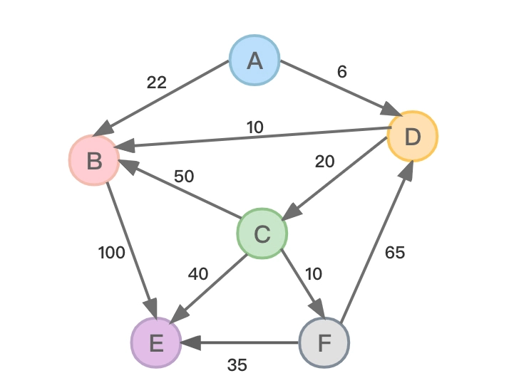
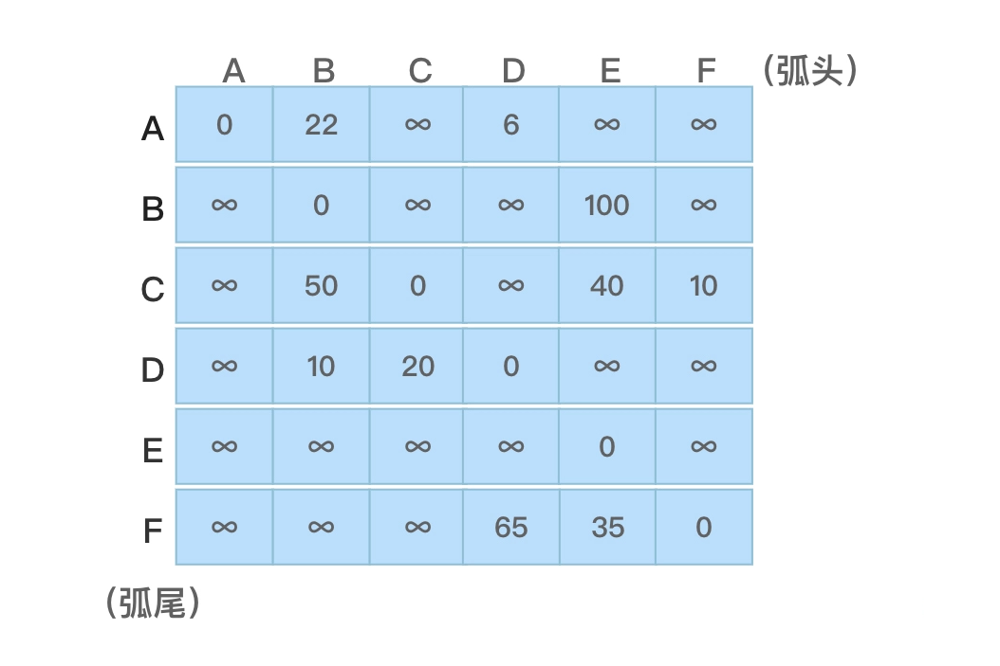

# 最短路径算法

在带权图中，最短路径指的是图中两个顶点之间经过的边上权值之和最小的路径。

最短路径算法除了**Dijkstra**还有**Bellford**算法、**Floyd**算法等等。

对于一个带权有向图，给定一个顶点，如何求得该顶点到其余各个顶点的最短路径呢？



采用带权的邻接矩阵作为图1中有向图的存储结构，



## Dijkstra算法

荷兰籍的一位计算机科学家、计算机先驱之一迪杰斯特拉提出了一个按路径长度递增的次序产生最短路径的算法，称为迪杰斯特拉算法。

1. 设置一个集合 S 用于存放已经找到最短路径的顶点，该集合开始时只包含给定的第一个顶点。这个顶点也叫源顶点 / 起始顶点。我们就是要从该顶点找到其余各个顶点的最短路径。这里先把顶点 A 保存进去，这预示着从源顶点 A 开始已经找到了到目标顶点 A 的最短路径，毕竟本来这两个点就是同一个点。

   S= {A}

   设置一个叫 dist 的数组，元素数量等同于图中顶点数量。该数组用于存放当前起始点到其他各个顶点的最短距离（权值最小）。

   设置一个叫 path 的数组，元素数量等同于图中的顶点数量。该数组用于记录每个顶点在最短路径上的前趋节点，里面的内容需要根据 dist 中的内容得出， dist 中对应下标位置是 0 或$\infty$，则 path 对应位置是 -1。如果 dist 中对应下标位置有权值，那么 path 对应位置是源顶点的下标

2. 开始计算从源顶点 A 到不在集合 S 中的顶点的最短路径。

   $A\rightarrow B：距离=22$

   $A\rightarrow C：距离=\infty$  (表示A到C之间不直接相连)

   $A\rightarrow D：距离=6$

   $A\rightarrow E：距离=\infty$

   $A\rightarrow F：距离=\infty$

   现在，得到了从顶点 A 到其他所有顶点的路径长度。我们从其中选出一条最短的路径，即：$A\rightarrow D$，并把顶点 D 也放入到集合 S 中，表示源顶点 A 到顶点 D 的最短路径已找到。

   S = {A, D}

3. 在增加了 D 顶点到集合后，顶点 A（经过顶点 D）到其他所有顶点是不是有更短的路径存在呢？

   这主要得看顶点 D 到达哪些顶点，D 可以到达顶点 B、C。所以看一下顶点 A 通过顶点 D 到达顶点 B 和到达顶点 C 的距离：

   $A\rightarrow B：距离=(6+10)=16(通过A\rightarrow D\rightarrow B路径)$ 

   $A\rightarrow C：距离=(6+20)=26(通过A\rightarrow D\rightarrow C路径)$ 

   因为原来的顶点 A 到达顶点 B 和顶点 C 的距离是保存在 dist 数组的，dist 数组当前内容为{0,22,∞,6,∞,∞}。可以看到，原来 A→B 的距离是 22，A→C 的距离是∞，而现在 A→B 和 A→C 的距离明显变得更小了，所以我们要更新 dist 数组中源顶点 A 到达顶点 B 和顶点 C 的距离，来保证 dist 数组中始终保存着源顶点 A 到其他各个顶点的最短距离。更新后 dist 数组的内容为{0,16,26,6,∞,∞}。

   因为上述找最短路径找到了 D 顶点（下标 3），dist 数组中有两个位置做了修改，path 数组也要在相应位置做修改，即 path 数组中的内容也从原来的{-1,0,-1,0,-1,-1}更新为{-1,3,3,0,-1,-1}

4. 整理一下源顶点到其他顶点的距离信息：

   $A\rightarrow B：距离=16 (通过A\rightarrow D\rightarrow B路径)$

   $A\rightarrow C：距离=26 (通过A\rightarrow D\rightarrow C路径)$  

   $A\rightarrow D：距离=6$

   $A\rightarrow E：距离=\infty$

   $A\rightarrow F：距离=\infty$

   因为顶点 D 已经在集合 S 中了，所以 A→D 这条路径就不考虑了，从其余的 4 条路径中选出一条最短的路径，注意，这 4 条路径的弧头顶点还没有找到从源顶点 A 到它们的最短路径。所以：

   $A\rightarrow B：距离=16 (通过A\rightarrow D\rightarrow B路径)$

   并把顶点 B 也放入到集合 S 中，表示源顶点 A 到顶点 B 的最短路径已找到，

   S={A, D, B}

5. 重复以上3，4步骤。每次增加了顶点到集合后，需要检测顶点A到其他所有顶点是不是有更短的路径存在，并更新dist数组和path数组。

   ... ...

   在增加了 E 顶点到集合后，顶点 A（经过顶点 E）到其他所有顶点没有更短的路径存在。因为顶点 E 没有到达任何其他顶点。

   至此，集合 S 中已经包含了图中的所有顶点，迪杰斯特拉算法结束。此时：

   dist 数组内容为：{0,16,26,6,66,36}

   path 数组内容为：{-1,3,3,0,2,2}

   通过上面两个数组的内容，就可以分析出从源顶点 A 到其他顶点的最短路径。

比如查找从源顶点 A 到顶点 E 的最短路径长度？

第一就是查找 dist 数组，查找下标为 4（顶点 E）的元素值，发现是 66，这意味着从顶点 A 到顶点 E 的最短路径长度是 66。第二就是看 path 数组以获得从顶点 A 到顶点 E 的最短路径“path[4] = 2；path[2] = 3；path[3] = 0”，因为 0 代表顶点 A 即源顶点，找到源顶点之后，就可以得到结果了，以反序将刚刚 path 数组的结果输出就是最短路径，即 0→3→2，这些数字代表顶点的下标

代码参考[shortest_path](./code/shortest_path.cpp)

```java

```


>数据结构与算法之美 44.最短路径：地图软件是如何计算出最优出行路径的？
>
>Dijkstra算法描述：
>
>vertexes数组，记录从起始顶点到每个顶点的距离（dist）。
>
>首先把所有顶点的dist都初始化为无穷大（Integer.MAX_VALUE）。再把起始顶点的dist值初始化为 0，并放到优先级队列中。
>
>从优先级队列中取出dist最小的顶点minVertex，遍历这个顶点所有的边e，边的权重为w,
>
>若minVertex.dist + e.w < nextVertex.dist，则更新nextVertex.dist=minVertex.dist+w。并把nextVertex加入到优先级队列中，但如果nextVertex已经加入过队列，则更新队列中的数据，不重复加入一个顶点。
>
>重复这个过程，直到找到终止顶点 t 或者队列为空。
>
>其中，predecessor数组记录着每个顶点的前驱顶点，用于为了还原最短路径。
>
>inqueue数组记录着，一个顶点是否已经加入队列中，为了避免将一个顶点多次添加到优先级队列中。


**Dijkstra 算法的时间复杂度：**

循环语句的整体的循环次数最大为图中所有边的个数 E。

for循环内部涉及从优先级队列取数据、往优先级队列中添加或更新优先级队列中的数据，两个主要操作。优先级队列是用堆来实现的，堆中的这几个操作时间复杂度都是 O(logV)（V为顶点的个数 ）。

整个代码的时间复杂度就是 O(E*logV)。

Dijkstra算法对大地图的优化：

打开地图App，缩小放大一下地图，可以发现地图上的路线被划分为不同级别的子地图。

先规划大的主干图的出行路线。例如把北京海淀区或者北京看作一个顶点，把上海黄浦区或者上海看作一个顶点。从北京到上海，必须要经过某几个顶点，或者某几条干道，然后再细化每个阶段的小路线。

划分小路线时，划出一个小的区块，这个小区块恰好可以覆盖住两个点，然后在这个小区块内部运行Dijkstra算法。


图的最短路径求解问题在实际生活中有非常实用的价值，应用广泛。比如城市公交或者城市地铁站都可以看作是一张图，其中的各个站点都可以看作是图中顶点。如果把全国交通图看成是一张图的话，那么各个城市就可以看作是图中的顶点。

从一个城市到达另外一个城市有多种走法。

* 如果把城市之间的距离作为权值，利用最短路径算法，可以找到从某个城市去到另外一个城市如何走距离最短。
* 如果把城市之间驱车所花费的时间作为权值，利用最短路径算法，可以找到从某个城市到另外一个城市如何走最节省时间。
* 如果把城市之间坐车所花费的金钱作为权值，利用最短路径算法，可以求解出如何乘车花费的金钱最少。