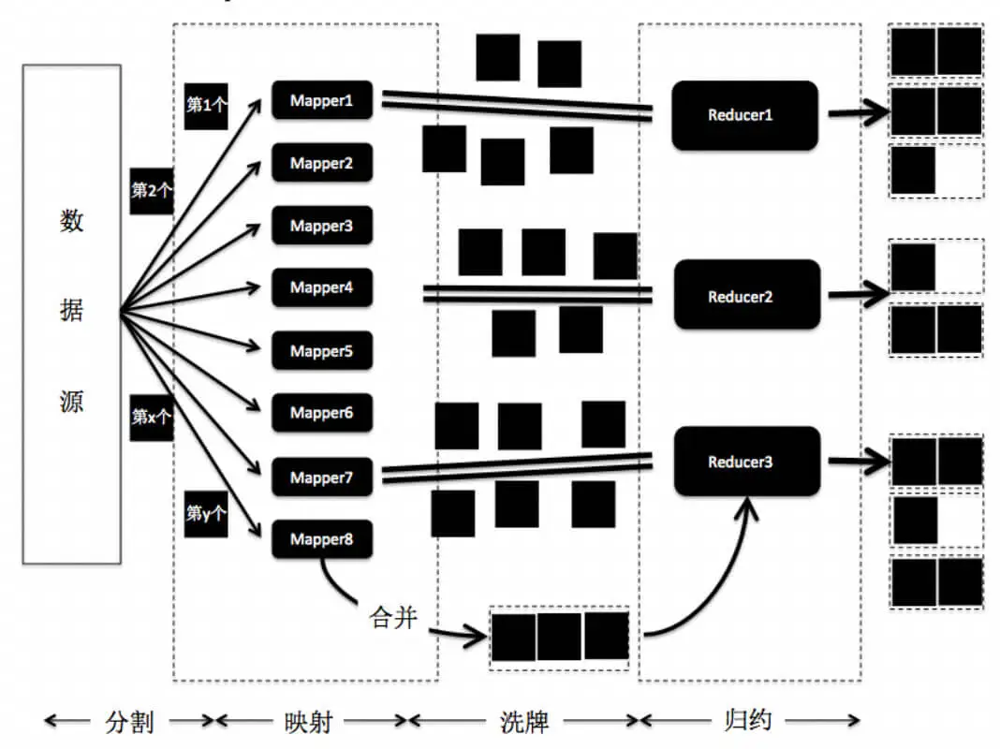
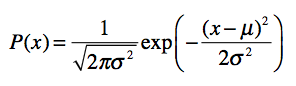
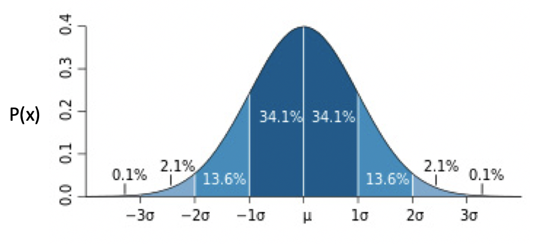

# 程序员的数学基础课

## 01. 二进制

### 什么是二进制

十进制计数使用10作为基数，二进制使用2作为基数，二进制的数位就是$2^n$的形式。

### 计算机为什么使用二进制

计算机使用二进制和现代计算机系统的硬件实现有关。组成计算机系统的逻辑电路通常只有两个状态，即开关的接通与断开。二进制的数据表达具有抗干扰能力强、可靠性高的优点；另外，二进制也非常适合逻辑运算。

### 原码、补码和反码

* 原码

  原码使用第一位表示符号，其余位表示值。

* 反码

  反码的表示方法为：

  * 正数的反码是其本身
  * 负数的反码是在其原码的基础上，符号位不变，其余各个位取反

* 补码

  补码的表示方法为：

  * 正数的补码是其本身
  * 负数的补码是在其原码的基础上，符号位不变，其余各个位取反，最后+1。(即在反码的基础上+1)

* 反码和补码存在的意义

  1. 电脑计算减法是转换成加法进行计算，且符号位参与到运算中。但是这样会产生一些问题：

     1-1=1+(-1)=[00000001]原+[10000001]原=[10000010]原=-2

  2. 为了解决减法转换加法错误的问题，反码出现了。但是这会产生一个新的问题：

     1-1=1+(-1)=[0000 0001]原+[1000 0001]原=[0000 0001]反+[1111 1110]反=[1111  1111]反=[1000 0000]原=-0

  3. 为了解决-0的问题，出现了补码。并且把-0的编码作为数字范围内的最小值，所以数字范围增加了一个。于是使用补码不仅可以将符号位和数值域统一处理，还能够统一处理加法与减法(间接支持了乘除法)。

     因此在计算机系统中，**数值统一使用补码来进行表示与存储**。

### 二进制的位操作

* 移位操作

  二进制左移一位，就是将数字翻倍。二进制右移一位，就是将数字除以2并求整数商。

  > Java 里定义了两种右移，逻辑右移和算术右移。
  >
  > 逻辑右移 1 位，左边补 0 即可。
  >
  > 算术右移时保持符号位不变，除符号位之外的右移一位并补符号位 1。补的 1 仍然在符号位之后。
  >
  > 逻辑右移在 Java 和 Python 语言中使用 >>> 表示，而算术右移使用 >> 表示。
  >
  > 在 C 或 C++ 语言中，逻辑右移和算数右移共享同一个运算符 >>。那么，编译器是如何决定使用逻辑右移还是算数右移呢？答案是，取决于运算数的类型。如果运算数类型是 unsigned，则采用逻辑右移；而是 signed，则采用算数右移。如果你针对 unsigned 类型的数据使用算数右移，或者针对 signed 类型的数据使用逻辑右移，那么你首先需要进行类型的转换。
  >
  > 由于左移位无需考虑高位补 1 还是补 0（符号位可能为 1 或 0），所以不需要区分逻辑左移和算术左移。

* 逻辑操作

  “或”：参与操作的位中只要有一个是1，最终结果就是1。

  “与”：参与操作的位中必须全部都是1，最终结果就是1，否则就为0。

  “异或”：参与操作的位相同，最终结果就为0，否则为1。

  > “异或”操作的本质其实就是，所有数值和自身进行按位的“异或”操作之后都为 0。而且要通过“异或”操作得到 0，也必须通过两个相同的数值进行按位“异或”。这表明了两个数值按位“异或”结果为 0，是这两个数值相等的必要充分条件，可以作为判断两个变量是否相等的条件。

## 02. 余数

### 余数的特性

整数是没有边界的，它可能是正无穷，也可能是负无穷。余数总是在一个固定的范围内

### 同余定理

两个整数 a 和 b，如果它们除以正整数 m 得到的余数相等，我们就可以说 a 和 b 对于模 m 同余。

同余定理其实就是用来分类的。通过余数，你就能将任何数值，转换为有限范围内的一个数值，然后根据这个新的数值，来确定将数据存放在何处。

### 求余过程就是个哈希函数

每个编程语言都有对应的哈希函数。哈希有的时候也会被翻译为散列，简单来说就是将任意长度的输入，通过哈希算法压缩为某一固定长度的输出。

## 03. 迭代法

### 什么是迭代法？

迭代法，其实就是不断地用旧的变量值，递推计算新的变量值。迭代法的思想，很容易通过计算机语言中的循环语言来实现。我们可以通过循环语句，让计算机重复执行迭代中的递推步骤，然后推导出变量的最终值。

### 迭代法的基本步骤是什么？

确定用于迭代的变量。

建立迭代变量之间的递推关系。

控制迭代的过程。

### 迭代法有什么具体应用？

* **求数值的精确或者近似解**。典型的方法包括二分法（Bisection method）和牛顿迭代法（Newton’s method）。

* **在一定范围内查找目标值**。典型的方法包括二分查找。

* **机器学习算法中的迭代**。相关的算法或者模型有很多，比如 K- 均值算法（K-means clustering）、PageRank 的马尔科夫链（Markov chain）、梯度下降法（Gradient descent）等等。迭代法之所以在机器学习中有广泛的应用，是因为**很多时候机器学习的过程，就是根据已知的数据和一定的假设，求一个局部最优解**。而迭代法可以帮助学习算法逐步搜索，直至发现这种解。

> 迭代法计算某个给定正整数 n（n>1）的平方根
>
> ```java
> public class Lesson3_2 {
>  
>  /**
>     * @Description: 计算大于1的正整数之平方根
>     * @param n-待求的数, deltaThreshold-误差的阈值, maxTry-二分查找的最大次数
>     * @return double-平方根的解
>     */
>     public static double getSqureRoot(int n, double deltaThreshold, int maxTry) {
>      
>      if (n <= 1) {
>       return -1.0;
>      }
>      
>      double min = 1.0, max = (double)n;
>      for (int i = 0; i < maxTry; i++) {
>       double middle = (min + max) / 2;
>       double square = middle * middle;
>       double delta = Math.abs((square / n) - 1);
>       if (delta <= deltaThreshold) {
>        return middle;
>       } else {
>        if (square > n) {
>         max = middle;
>        } else {
>         min = middle;
>        }
>       }
>      }
>      
>      return -2.0;
> 
>     }
> }
> ```
>
> 测试代码：
>
> ```java
> public static void main(String[] args) {
>   
>   int number = 10;
>   double squareRoot = Lesson3_2.getSqureRoot(number, 0.000001, 10000);
>   if (squareRoot == -1.0) {
>    System.out.println("请输入大于1的整数");
>   } else if (squareRoot == -2.0) {
>    System.out.println("未能找到解");
>   } else {
>    System.out.println(String.format("%d的平方根是%f", number, squareRoot));
>   }
>   
>  }
> ```
>
> 两个小细节
>
> 第一，使用了 deltaThreshold 来控制解的精度。虽然理论上来说，可以通过二分的无限次迭代求得精确解，但是考虑到实际应用中耗费的大量时间和计算资源，绝大部分情况下，我们并不需要完全精确的数据。
>
> 第二，使用了 maxTry 来控制循环的次数。之所以没有使用 while(true) 循环，是为了避免死循环。虽然，在这里使用 deltaThreshold，理论上是不会陷入死循环的，但是出于良好的编程习惯，我们还是尽量避免产生的可能性。

## 04. 数学归纳法

### 数学归纳法和归纳有什么不一样？

平时我们谈的“归纳”，是一种从经验事实中找出普遍特征的认知方法。

数学归纳法的一般步骤是这样的：

* 证明基本情况（通常是 n=1 的时候）是否成立；
* 假设 n=k−1 成立，再证明 n=k 也是成立的（k 为任意大于 1 的自然数）。

### 数学归纳法和迭代法有什么不一样？

和使用迭代法的计算相比，数学归纳法最大的特点就在于“归纳”二字。它已经总结出了规律。只要我们能够证明这个规律是正确的，就没有必要进行逐步的推算，可以节省很多时间和资源。

### 递归调用和数学归纳的逻辑是一致的

递归调用的代码和数学归纳法的逻辑是一致的。只要数学归纳证明的逻辑是对的，递归调用的逻辑就是对的，我们没有必要纠结递归函数是如何嵌套调用和返回的。

## 05. 递归(上)

### 递归的思想

递归就是将复杂的问题，每次都解决一点点，并将剩下的任务转化成为更简单的问题等待下次求解，如此反复，直到最简单的形式。

### 递归和循环

递归和循环其实都是迭代法的实现，而且在某些场合下，它们的实现是可以相互转化的。但是，对于某些应用场景，递归确实很难被循环取代。我觉得主要有两点原因：

第一，递归的核心思想和数学归纳法类似，并更具有广泛性。这两者的类似之处体现在：将当前的问题化解为两部分：一个当前所采取的步骤和另一个更简单的问题。我们只需要保证递归编程能够体现这种将复杂问题逐步简化的思想，那么它就能帮助我们解决很多类似的问题。

第二，递归会使用计算机的函数嵌套调用。而函数的调用本身，就可以保存很多中间状态和变量值，因此极大的方便了编程的处理。

## 06. 递归(下)

### 分治思想

分而治之，我们通常简称为分治。它的思想就是，将一个复杂的问题，分解成两个甚至多个规模相同或类似的子问题，然后对这些子问题再进一步细分，直到最后的子问题变得很简单，很容易就能被求解出来，这样这个复杂的问题就求解出来了。

### 归并排序

我们把归并和分治的思想结合起来，这就是归并排序算法。这种算法每次把数列进行二等分，直到唯一的数字，也就是最基本的有序数列。然后从这些最基本的有序数列开始，两两合并有序的数列，直到所有的数字都参与了归并排序。用一句话说就是，**归并排序使用了分治的思想，而这个过程需要使用递归来实现。**

```java
import java.util.Arrays;

public class Lesson6_1 {
  
  /**
    * @Description:  使用函数的递归（嵌套）调用，实现归并排序（从小到大）
    * @param to_sort-等待排序的数组
    * @return int[]-排序后的数组
    */
  
  public static int[] merge_sort(int[] to_sort) {
    
    if (to_sort == null) return new int[0];
    
    // 如果分解到只剩一个数，返回该数
    if (to_sort.length == 1) return to_sort;
    
    // 将数组分解成左右两半
    int mid = to_sort.length / 2;
    int[] left = Arrays.copyOfRange(to_sort, 0, mid);
    int[] right = Arrays.copyOfRange(to_sort, mid, to_sort.length);
    
    // 嵌套调用，对两半分别进行排序
    left = merge_sort(left);
    right = merge_sort(right);
    
    // 合并排序后的两半
    int[] merged = merge(left, right);
    
    return merged;
    
  }
  
}
```

合并过程代码：

```java
/**
    * @Description: 合并两个已经排序完毕的数组（从小到大）
    * @param a-第一个数组，b-第二个数组
    * @return int[]-合并后的数组
    */
    
    public static int[] merge(int[] a, int[] b) {
     
     if (a == null)  a = new int[0];
     if (b == null) b = new int[0];
     
     int[] merged_one = new int[a.length + b.length];
     
     int mi = 0, ai = 0, bi = 0;
     
     // 轮流从两个数组中取出较小的值，放入合并后的数组中
     while (ai < a.length && bi < b.length) {
      
      if (a[ai] <= b[bi]) {
       merged_one[mi] = a[ai];
       ai ++;
      } else {
       merged_one[mi] = b[bi];
       bi ++;
      }
      
      mi ++;
      
     }
     
     // 将某个数组内剩余的数字放入合并后的数组中
     if (ai < a.length) {
      for (int i = ai; i < a.length; i++) {
       merged_one[mi] = a[i];
       mi ++;
      }
     } else {
      for (int i = bi; i < b.length; i++) {
       merged_one[mi] = b[i];
       mi ++;
      }
     }
     
     return merged_one;
     
    }
```

### 分布式系统中的分治思想

在单台机器上实现归并排序的时候，我们只需要在递归函数内，实现数据分组以及合并就行了。而在多个机器之间分配数据的时候，递归函数内除了分组及合并，还要把数据分发到某台机器上。如果分治的时候只进行一次问题切分，那层级型分布式架构就可以转化为类似MapReduce的架构，其中有三个步骤用到了分治，分别是数据分割和映射、归约、合并。



#### 1.数据分割和映射

分割是指将数据源进行切分，并将分片发送到 Mapper 上。映射是指 Mapper 根据应用的需求，将内容按照键 - 值的匹配，存储到哈希结构中。这两个步骤将大的数据集合切分为更小的数据集，降低了每台机器节点的负载，因此和分治中的问题分解类似。不过，MapReduce 采用了哈希映射来分配数据，而普通的分治或递归不一定需要。

#### 2.归约

归约是指接受到的一组键值配对，如果是键内容相同的配对，就将它们的值归并。这和本机的递归调用后返回结果的过程类似。不过，由于哈希映射的关系，MapReduce 还需要洗牌的步骤，也就是将键 - 值的配对不断地发给对应的 Reducer 进行归约。普通的分治或递归不一定需要洗牌的步骤。

#### 3.合并

为了提升洗牌阶段的效率，可以选择减少发送到归约阶段的键 - 值配对。具体做法是在数据映射和洗牌之间，加入合并的过程，在每个 Mapper 节点上先进行一次本地的归约。然后只将合并的结果发送到洗牌和归约阶段。这和本机的递归调用后返回结果的过程类似。


分治主要就是用在将复杂问题转化为若干个规模相当的小问题上。分治思想通常包括问题的细分和结果的合并，正好对应于递归编程的函数嵌套调用和函数结果的返回。细分后的问题交给嵌套调用的函数去解决，而结果合并之后交由函数进行返回。所以，分治问题适合使用递归来实现。同时，分治的思想也可以帮助我们设计分布式系统和并行计算，细分后的问题交给不同的机器来处理，而其中的某些机器专门负责收集来自不同机器的处理结果，完成结果的合并。

## 07. 排列(Permutation)

### 定义

从 n 个不同的元素中取出 m（1≤m≤n）个不同的元素，按照一定的顺序排成一列，这个过程就叫排列（Permutation）。当 m=n 时，就是全排列（All Permutation）。

如果选择出的这 m 个元素可以有重复的，这样的排列就是为重复排列（Permutation with Repetition），否则就是不重复排列（Permutation without Repetition）。

* 对于 n 个元素的全排列，所有可能的排列数量就是 nx(n-1)x(n-2)x…x2x1，也就是 n!；
* 对于 n 个元素里取出 m(0<m≤n) 个元素的不重复排列数量是 nx(n-1)x(n-2)x…x(n - m + 1)，也就是 n!/(n-m)!。

### 应用

排列可以穷举出随机变量取值的所有可能性，所以它在概率中有很大的作用，比如用于生成这个变量的概率分布。排列在计算机领域中也有很多应用场景，比如暴力破解密码。

## 08. 组合(Combination)

### 定义

组合是指，从 n 个不同元素中取出 m（1≤m≤n）个不同的元素。

对于所有 m 取值的组合之全集合，我们可以叫作全组合（All Combination）。

* n 个元素里取出 m 个的组合，可能性数量就是 n 个里取 m 个的排列数量，除以 m 个全排列的数量，也就是 (n! / (n-m)!) / m!。
* 对于全组合而言，可能性为 2^n 种。

### 应用

组合在计算机领域中也有很多的应用场景。比如大型比赛中赛程的自动安排、多维度的数据分析以及自然语言处理的优化等等。

举例：如何高效处理词组

在自然语言处理中，我们需要用多元文法把临近的几个单词合并起来，组合成一个新的单词。普通的多元文法定死了每个元组中单词出现的顺序。但是事实上，多个单词出现时，我们可以不用关心它们的顺序，而只关心它们的组合。这样我们就可以对多元组内的单词进行某种形式的标准化。即使原来的单词出现顺序有所不同，经过这个标准化过程之后，都会变成唯一的顺序。

### 小结

组合和排列有相似之处，都是从 n 个元素中取出若干个元素。不过，排列考虑了取出的元素它们之间的顺序，而组合无需考虑这种顺序。这是排列和组合最大的区别。因此，组合适合找到多个元素之间的联系而并不在意它们之间的先后顺序，例如多元文法中的多元组，这有利于避免不必要的数据保存或操作。

具体到编程，组合和排列两者的实现非常类似。区别在于，组合并不考虑挑选出来的元素之间，是如何排序的。所以，在递归的时候，传入下一个嵌套调用函数的剩余元素，只需要包含当前被选元素之后的那些，以避免重复的组合。

## 09-10. 动态规划

### 什么是动态规划？

通过不断分解问题，将复杂的任务简化为最基本的小问题，我们需要在各种可能的局部解中，找出那些可能达到最优的局部解。这个寻找最优解的过程就是动态规划。

### 动态规划的关键是什么？

动态规划需要通过子问题的最优解，推导出最终问题的最优解，因此这种方法特别注重子问题之间的转移关系。我们通常把这些子问题之间的转移称为状态转移，并把用于刻画这些状态转移的表达式称为状态转移方程。找到合适的状态转移方程，是动态规划的关键。

### 状态转移方程是什么？

从上一个状态到下一个状态之间可能存在的一些变化，以及基于这些变化的最终决策结果。我们把这样的表达式称为状态转移方程。

>编辑距离的状态转移方程：
>
>我们假设字符数组 A[]和 B[]分别表示字符串 A 和 B，A[i]表示字符串 A 中第 i 个位置的字符，B[i]表示字符串 B 中第 i 个位置的字符。二维数组 d[,]表示用于推导的二维表格，而 d[i,j]表示这张表格中第 i 行、第 j 列求得的最终编辑距离。函数 r(i, j) 表示替换时产生的编辑距离。如果 A[i]和 B[j]相同，函数的返回值为 0，否则返回值为 1。
>
>* 如果 i 为 0，且 j 也为 0，那么 d[i, j]为 0。
>* 如果 i 为 0，且 j 大于 0，那么 d[i, j]为 j。
>* 如果 i 大于 0，且 j 为 0，那么 d[i, j]为 i。
>* 如果 i 大于 0，且 j 大于 0，那么 d[i, j]=min(d[i-1, j] + 1, d[i, j-1] + 1, d[i-1, j-1] + r(i, j))。

### 基于编辑距离的算法有什么局限性？

基于编辑距离的算法也有局限性，它只适用于拉丁语系的相似度衡量，所以通常只用于英文或者拼音相关的查询。如果是在中文这种亚洲语系中，差一个汉字（或字符）语义就会差很远，所以并不适合使用基于编辑距离的算法。

## 11-12.树的深度优先搜索

### 图论的一些概念

如果一个图里所有的边都是有向边，那么这个图就是有向图。如果一个图里所有的边都是无向边，那么这个图就是无向图。既含有向边，又含无向边的图，称为混合图。

在有向图中，以结点 v 为出发点的边的数量，我们叫作 v 的**出度**。而以 v为 终点的边之数量，称为 v 的**入度**。

结点和边的交替序列组成的就是**通路**。所以，通路上的任意两个结点其实就是互为连通的。如果一条通路的起始点 v1 和终止点 vn 相同，这种特殊的通路我们就叫作**回路**。从起始点到终止点所经过的边之数量，就是通路的长度。

**树**是一种特殊的图，它是没有简单回路的连通无向图。这里的简单回路，其实就是指，除了第一个结点和最后一个结点相同外，其余结点不重复出现的回路。

**有向树**是一种特殊的树，其中的边都是有向的，而且它满足以下几个条件：

* 有且仅有一个结点的入度为 0，这个结点被称为根；
* 除根以外的所有结点，入度都为 1。从树根到任一结点有且仅有一条有向通路。

从树顶层的根结点一直遍历到最下层的叶子结点，最终逐步构成单词前缀的过程。对应的数据结构就是**前缀树（prefix tree）**，或者叫**字典树（trie）**。

### 前缀树的构建和查询

有向树可以用来实现前缀树。其实现过程包括构建前缀树和查询前缀树。

1. 构建前缀树

   首先，我们把空字符串作为树的根。对于每个单词，其中每一个字符都代表了有向树的一个结点。而前一个字符就是后一个字符的父结点，后一个字符是前一个字符的子结点。这也意味着，每增加一个字符，其实就是在当前字符结点下面增加一个子结点，相应地，树的高度也增加了 1。

2. 查询前缀树

   从前缀树的根开始，查找下一个结点，顺着这个通路走下去，一直走到某个结点。如果这个结点及其前缀代表了一个存在的单词，而待查找的单词和这个结点及其前缀正好完全匹配，那就说明成功找到了一个单词。否则，就表示无法找到。

   这里还有几种特殊情况，需要注意。

   * 如果还没到叶子结点的时候，待查的单词就结束了。这个时候要看最后匹配上的非叶子结点是否代表一个单词；如果不是，那说明被查单词并不在字典中。
   * 如果搜索到前缀树的叶子结点，但是被查单词仍有未处理的字母。由于叶子结点没有子结点，这时候，被查单词不可能在字典中。
   * 如果搜索到一半，还没到达叶子结点，被查单词也有尚未处理的字母，但是当前被处理的字母已经无法和结点上的字符匹配了。这时候，被查单词不可能在字典中。

前缀树的构建和查询这两者在本质上其实是一致的。构建的时候，我们需要根据当前的前缀进行查询，然后才能找到合适的位置插入新的结点。而且，这两者都存在一个不断重复迭代的查找过程，我们把这种方式称为**深度优先搜索（Depth First Search）**。

所谓树的深度优先搜索，其实就是从树中的某个结点出发，沿着和这个结点相连的边向前走，找到下一个结点，然后以这种方式不断地发现新的结点和边，一直搜索下去，直到访问了所有和出发点连通的点、或者满足某个条件后停止。

如果到了某个点，发现和这个点直接相连的所有点都已经被访问过，那么就回退到在这个点的父结点，继续查看是否有新的点可以访问；如果没有就继续回退，一直到出发点。由于单棵树中所有的结点都是连通的，所以通过深度优先的策略可以遍历树中所有的结点，因此也被称为**深度优先遍历**。

### 如何用数据结构表示树

我们可以设计一个TreeNode类，表示有向树的结点和边。这个类需要体现前缀树结点最重要的两个属性。

* 这个结点所代表的字符，要用 label 变量表示。
* 这个结点有哪些子结点，要用 sons 哈希映射表示。之所以用哈希，是为了便于查找某个子结点（或者说对应的字符）是否存在。

我们还可以用变量prefix表示当前结点之前的前缀，用变量explanation表示某个单词的解释。

```java
/**
* @Description: 前缀树的结点
* 
*/
 
 public class TreeNode {
  
  public char label;  // 结点的名称，在前缀树里是单个字母
  public HashMap<Character, TreeNode> sons = null; // 使用哈希映射存放子结点。哈希便于确认是否已经添加过某个字母对应的结点。
  public String prefix = null;   // 从树的根到当前结点这条通路上，全部字母所组成的前缀。例如通路b->o->y，对于字母o结点而言，前缀是b；对于字母y结点而言，前缀是bo
  public String explanation = null;  // 词条的解释
  
  // 初始化结点
  public TreeNode(char l, String pre, String exp) {
   label = l;
   prefix = pre; 
   explanation = exp;
   sons = new HashMap<>();
   
  }
  
 }
```

我们需要动态地构建这棵树。每当接收一个新单词时，代码都需要扫描这个单词的每个字母，并使用当前的前缀树进行匹配。如果匹配到某个结点，发现相应的字母结点并不存在，那么就建立一个新的树结点。

```java
// 处理当前字符串的第一个字母
char c = str.toCharArray()[0];
TreeNode found = null;

// 如果字母结点已经存在于当前结点(父节点)的子节点之下，找出它。否则就新生成一个
if (parent.sons.containsKey(c)) {
  found = parent.sons.get(c);
} else {
  TreeNode son = new TreeNode(c, pre, "");
  parent.sons.put(c, son);
  found = son;
}
```

### 如何实现深度优先搜索

前缀树构建和查询，你会发现这两个不断重复迭代的过程，都可以使用递归编程来实现。换句话说，**深度优先搜索的过程和递归调用在逻辑上是一致的**。

尽管函数递归调用非常直观，但是在遍历整个字典中所有单词的时候，函数的每次嵌套，都可能产生新的变量来保存中间结果，这可能会消耗大量的内存。所以这里我们可以用一个更节省内存的数据结构，栈（Stack）。

## 13-14.树的广度优先搜索

在使用深度优选搜索的时候，一旦遇到产生回路的边，我们需要将它过滤。具体的操作是，**判断新访问的点是不是已经在当前通路中出现过，如果出现过就不再访问**。

### 什么是广度优先搜索？

**广度优先搜索**（Breadth First Search），也叫**宽度优先搜索**，是指从图中的某个结点出发，沿着和这个点相连的边向前走，去寻找和这个点距离为 1 的所有其他点。只有当和起始点距离为 1 的所有点都被搜索完毕，才开始搜索和起始点距离为 2 的点。当所有和起始点距离为 2 的点都被搜索完了，才开始搜索和起始点距离为 3 的点，如此类推。

### 如何实现社交好友推荐？

我们需要先模拟生成一些用户结点及其间的相识关系，然后利用队列的数据结构进行广度优先的搜索。基于此，主要使用的数据结构包括：

* 用户结点 Node。这次设计的用户结点和前缀树结点 TreeNode 略有不同，包含了用户的 ID user_id，以及这个用户的好友集合。我用 HashSet 实现，便于在生成用户关系图的时候，确认是否会有重复的好友。
* 表示整个图的结点数组 Node[]。由于每个用户使用 user_id 来表示，所以我可以使用连续的数组表示所有的用户。用户的 user_id 就是数组的下标。
* 队列 Queue。由于 Java 中 Queue 是一个接口，因此需要用一个拥有具体实现的 LinkedList 类。

```java
public class Node {
    
    public int user_id;    // 结点的名称，这里使用用户id
    public HashSet<Integer> friends = null;  
        // 使用哈希映射存放相连的朋友结点。哈希便于确认和某个用户是否相连。
    public int degree;    // 用于存放和给定的用户结点，是几度好友
    
    // 初始化结点
    public Node(int id) {
      user_id = id;
      friends = new HashSet<>();
      degree = 0;
  }    
  }
```


```java
/**
* @Description:  通过广度优先搜索，查找好友
* @param user_nodes-用户的结点；user_id-给定的用户ID，我们要为这个用户查找好友
* @return void
*/

public static void bfs(Node[] user_nodes, int user_id) {
    
    if (user_id > user_nodes.length) return;  // 防止数组越界的异常
    
    Queue<Integer> queue = new LinkedList<Integer>();  // 用于广度优先搜索的队列
    
    queue.offer(user_id);    // 放入初始结点
    HashSet<Integer> visited = new HashSet<>();  // 存放已经被访问过的结点，防止回路
    visited.add(user_id);
    
    while (!queue.isEmpty()) {
      int current_user_id = queue.poll();    // 拿出队列头部的第一个结点
      if (user_nodes[current_user_id] == null) continue;
      
      // 遍历刚刚拿出的这个结点的所有直接连接结点，并加入队列尾部
      for (int friend_id : user_nodes[current_user_id].friends) {
        if (user_nodes[friend_id] == null) continue;
        if (visited.contains(friend_id)) continue;
        queue.offer(friend_id);
        visited.add(friend_id);  // 记录已经访问过的结点
        user_nodes[friend_id].degree = user_nodes[current_user_id].degree + 1;    // 好友度数是当前结点的好友度数再加1
        System.out.println(String.format("\t%d度好友：%d",  user_nodes[friend_id].degree, friend_id));
      }
    }
    
  }
```

### 如何更高效地求出两个用户间的最短路径？

基本的做法是，从其中一个人出发，进行广度优先搜索，看看另一个人是否在其中。如果不幸的话，两个人相距六度，那么即使是广度优先搜索，同样要达到万亿级的数量。随着社会关系的度数增加，好友数量是呈指数级增长的。所以，如果我们可以控制这种指数级的增长，那么就可以控制潜在好友的数量，达到提升效率的目的。

双向广度优先搜索巧妙地运用了两个方向的广度优先搜索，大幅降低了搜索的度数。


要想实现双向广度优先搜索，首先我们要把结点类 Node 稍作修改，增加一个变量 degrees。这个变量是 HashMap 类型，用于存放从不同用户出发，到当前用户是第几度结点。

有了变量 degrees，我们就能随时知道某个点和两个出发点各自相距多少。所以，在发现交集之后，根据交集中的点和两个出发点各自相距多少，就能很快地算出最短通路的长度。理解了这点之后，我们在原有的 Node 结点内增加 degrees 变量的定义和初始化。

```java
public class Node {
    ......
    public HashMap<Integer, Integer> degrees;    // 存放从不同用户出发，当前用户结点是第几度
    
    // 初始化结点
    public Node(int id) {
      ......
      degrees = new HashMap<>();
      degrees.put(id, 0);
    }
  }

```

为了让双向广度优先搜索的代码可读性更好，我们可以先实现两个模块化的函数：getNextDegreeFriend 和 hasOverlap。函数 getNextDegreeFriend 是根据给定的队列，查找和起始点相距度数为指定值的所有好友。而函数 hasOverlap 用来判断两个集合是不是有交集。有了这些模块化的函数，双向广度优先搜索的代码就更直观了。

在函数一开始，我们先进行边界条件判断。由于同时从两个用户的结点出发，对于所有，有两条搜索的路径，我们都需要初始化两个用于广度优先搜索的队列，以及两个用于存放已经被访问结点的 HashSet。接下来要做的是，从两个结点出发，沿着各自的方向，每次广度优先搜索一度，并查找是不是存在重叠的好友。

```java
/**
* @Description:  通过双向广度优先搜索，查找两人之间最短通路的长度
* @param user_nodes-用户的结点；user_id_a-用户a的ID；user_id_b-用户b的ID
* @return void
*/
  public static int bi_bfs(Node[] user_nodes, int user_id_a, int user_id_b) {
    
    if (user_id_a > user_nodes.length || user_id_b > user_nodes.length) return -1;  // 防止数组越界的异常
    
    if (user_id_a == user_id_b) return 0;    // 两个用户是同一人，直接返回0
      
    Queue<Integer> queue_a = new LinkedList<Integer>();  // 队列a，用于从用户a出发的广度优先搜索
    Queue<Integer> queue_b = new LinkedList<Integer>();  // 队列b，用于从用户b出发的广度优先搜索
    
    queue_a.offer(user_id_a);    // 放入初始结点
    HashSet<Integer> visited_a = new HashSet<>();  // 存放已经被访问过的结点，防止回路
    visited_a.add(user_id_a);
    
    queue_b.offer(user_id_b);    // 放入初始结点
    HashSet<Integer> visited_b = new HashSet<>();  // 存放已经被访问过的结点，防止回路
    visited_b.add(user_id_b);
          
    int degree_a = 0, degree_b = 0, max_degree = 20;    // max_degree的设置，防止两者之间不存在通路的情况

    while ((degree_a + degree_b) < max_degree) {
          degree_a ++;
          getNextDegreeFriend(user_id_a, user_nodes, queue_a, visited_a, degree_a);
      // 沿着a出发的方向，继续广度优先搜索degree + 1的好友
          if (hasOverlap(visited_a, visited_b)) return (degree_a + degree_b);
      // 判断到目前为止，被发现的a的好友，和被发现的b的好友，两个集合是否存在交集

          degree_b ++;
          getNextDegreeFriend(user_id_b, user_nodes, queue_b, visited_b, degree_b);
      // 沿着b出发的方向，继续广度优先搜索degree + 1的好友
          if (hasOverlap(visited_a, visited_b)) return (degree_a + degree_b);
      // 判断到目前为止，被发现的a的好友，和被发现的b的好友，两个集合是否存在交集

        }

        return -1;      
        // 广度优先搜索超过max_degree之后，仍然没有发现a和b的重叠，认为没有通路

      }
}
```


### 如何实现更有效地嵌套型聚合？

广度优先搜索的应用场景有很多，比如它可以帮助我们大幅优化数据分析中的聚合操作。针对一个规模超大的数据集，聚合的嵌套可能会导致性能严重下降。对于只需要返回前若干结果的应用场景，我们可以对这种树状结构进行剪枝，去掉绝大部分不需要的结点和边，这样就能节省大量的内存和CPU计算。

### 小结

广度优先搜索，相对于深度优先搜索，没有函数的嵌套调用和回溯操作，所以运行速度比较快。但是，随着搜索过程的进行，广度优先需要在队列中存放新遇到的所有结点，因此占用的存储空间通常比深度优先搜索多。

相比之下，深度优先搜索法只保留用于回溯的结点，而扩展完的结点会从栈中弹出并被删除。所以深度优先搜索占用空间相对较少。不过，深度优先搜索的速度比较慢，而并不适合查找结点之间的最短路径这类的应用。

## 15. 从树到图

### Dijkstra算法

s：source，表示图中的起始点。

w：weight，表示二维数组，保存了任意边的权重。w[m, n]表示从结点 m 到结点 n 的有向边之权重，大于等于 0。如果 m 到 n 有多条边，而且权重各自不同，那么取权重最小的那条边。

mw：min_weight，表示一维数组，保存了从 s 到任意结点的最小权重。假设从 s 到某个结点 m 有多条通路，而每条通路的权重是这条通路上所有边的权重之和，那么 mw[m]就表示这些通路权重中的最小值。mw[s]=0，表示起始点到自己的最小权重为 0。

F：Finish，表示已经找到最小权重的结点之集合。一旦结点被放入集合 F，这个结点就不再参与将来的计算。

Dijkstra 算法在初始的时候会做三件事情。

第一，把起始点 s 的最小权重赋为 0，也就是 mw[s] = 0。

第二，往集合 F 里添加结点 s，F 包含且仅包含 s。

第三，假设结点 s 能直接到达的边集合为 M，对于其中的每一个对端节点 m，则把 mw[m]设为 w[s, m]，同时对于所有其他 s 不能直接到达的结点，将通路的权重设为无穷大。

然后，Dijkstra 算法会重复下列两个步骤。

**第一步，查找最小 mw**。从 mw 数组选择最小值，则这个值就是起始点 s 到所对应的结点的最小权重，并且把这个点加入到 F 中，针对这个点的计算就算完成了。比如，当前 mw 中最小的值是 mw[x]=10，那么结点 s 到结点 x 的最小权重就是 10，并且把结点 x 放入集合 F，将来没有必要再考虑点 x，mw[x]可能的最小值也就确定为 10 了。

**第二步，更新权重**。然后，我们看看，新加入 F 的结点 x，是不是可以直接到达其他结点。如果是，看看通过 x 到达其他点的通路权重，是否比这些点当前的 mw 更小，如果是，那么就替换这些点在 mw 中的值。

重复上述两步，再次从mw中找出最小值，要求mw对应的结点不属于F，重复上述动作，直到集合F包含了图的所有结点，没有结点需要处理了。

## 16-17. 时间和空间复杂度

### 影响系统性能的因素有哪些？

影响系统性能的因素有很多。把这些因素分为三大类：**算法理论上的计算复杂度、开发实现的方案和硬件设备的规格**。

### 算法复杂度

算法复杂度是一个比较抽象的概念，通常只是一个估计值，它用于衡量程序在运行时所需要的资源，用于比较不同算法的性能好坏。同一段代码处理不同的输入数据所消耗的资源也可能不同，所以分析复杂度时，需要考虑三种情况，最差情况、最好情况和平均情况。

我们通常所说的时间复杂度是指**渐进时间复杂度**，表示程序运行时间随着问题复杂度增加而变化的规律。同理，空间复杂度是指**渐进空间复杂度**，表示程序所需要的存储空间随着问题复杂度增加而变化的规律。我们可以使用大 O 来表示两者。

### 6个通用法则

#### 1.四则运算法则

对于时间复杂度，代码的添加，意味着计算机操作的增加，也就是时间复杂度的增加。如果代码是平行增加的，就是加法。如果是循环、嵌套或者函数的嵌套，那么就是乘法。

#### 2.主次分明法则

这个法则主要是运用了数量级和运算法则优先级的概念。在刚刚介绍的第一个法则中，我们会对代码不同部分所产生的复杂度进行相加或相乘。使用加法或减法时，你可能会遇到不同数量级的复杂度。这个时候，我们只需要看最高数量级的，忽略掉常量、系数和较低数量级的复杂度。

#### 3.齐头并进法则

这个法则主要是运用了多元变量的概念，其核心思想是复杂度可能受到多个因素的影响。在这种情况下，我们要同时考虑所有因素，并在复杂度公式中体现出来。

#### 4.排列组合法则

#### 5.一图千言法则

#### 6.时空互换法则

在给定的计算量下，通常时间复杂度和空间复杂度呈现数学中的反比关系。这就说明，如果我们无法降低整体的计算量，那么也许可以通过增加空间复杂度来达到降低时间复杂度的目的，或者反之，通过增加时间复杂度来降低空间复杂度。

## 18. 数据结构、编程语句和基础算法体现了哪些数学思想？

不同的数据结构，都是在编程中运用数学思维的产物。每种数据结构都有自身的特点，有利于我们更方便地实现某种特定的数学模型。

从数据结构的角度来看，最基本的数组遍历体现了迭代的思想，而链表和树的结构可用于刻画图论中的模型。栈的先进后出、以及队列的先进先出，分别适用于图的深度优先和广度优先遍历。哈希表则充分利用了哈希函数的特点，大幅降低了查询的时间复杂度。

当然，仅仅使用数据结构来存储数据还不够，我们还需要操作这些数据。为了实现操作流程，条件语句使用了布尔代数来控制编程逻辑，循环和函数嵌套使用迭代、递归和排列组合等思想来实现更精细的数学模型。

但是，有时候我们面对的问题太复杂了，除了数据结构和基本的编程语句，我们还需要发明一些算法。为了提升算法的效率，我们需要对其进行复杂度分析。通常，这些算法中的数学思想就更为明显，因为它们都是为了解决特定的问题，根据特定的数学模型而设计的。

有的时候，某个算法会体现多种数学思想，例如 RK 字符串匹配算法，同时使用了迭代法和哈希。此外，多种数学思维可能都是相通的。比如，递归的思想、排列的结果、二进制数的枚举都可以用树的结构来图示化，因此我们可以通过树来理解。

所以，在平时学习编程的时候，你可以多从数学的角度出发，思考其背后的数学模型。这样不仅有利于你对现有知识的融会贯通，还可以帮助你优化数据结构和算法。

## 19. 概率和统计

概率研究的是模型如何产生数据，统计研究的是如何通过数据来推导其背后的模型。所以说，概率和统计其实是互逆的。

概率和统计的运用非常多，这里主要讲了三个方面。

第一，概率可以帮助我们进行更精准的复杂度分析；

第二，概率统计更多是用在机器学习和大数据分析中；

第三，概率统计还可以用在各种机器学习的算法中。

## 20-21. 概率基础

### 随机变量

随机变量（ random variable）和普通的变量（variable）有什么不同？

在没有发生运算之前，普通变量的值并不会发生变化，也就是说，它可以取不同的值，但是一旦取值确定之后，它总会是一个固定的值，除非有新的运算操作。

而随机变量的值并不固定，比如说，某个随机变量可能有 10% 的概率等于 10，有 20% 的概率等于 5，有 30% 的概率等于 28 等等。

随机变量根据其取值是否连续，可分为离散型随机变量和连续型随机变量。

从计算的角度来说就是，**我们可以直接求和得出的，就是“离散的”，需要用积分计算的，就是“连续的”**。

而随机变量的取值对应了随机现象的一种结果。正是结果的不确定性，才导致了随机变量取值的不确定性，于是我们就引入了概率。我们可以说，每种值是以一定的概率出现的。

### 概率分布

随机变量的每种取值的出现都遵循一定的可能性，把这个可能性用具体的数值表示出来就是**概率**。如果将随机变量所有可能出现的值，及其对应的概率都罗列出来，我们就能获得这个变量的概率分布。

常用的离散分布有伯努利分布、分类分布、二项分布、泊松分布等等。

第一个是**伯努利分布**（Bernoulli Distribution），这是单个随机变量的分布，而且这个变量的取值只有两个，0 或 1。伯努利分布通过参数λ来控制这个变量为 1 的概率。
$$
P(x=0)=1-\lambda\\P(x=1)=\lambda
$$
或者写作：
$$
P(x)=\lambda^x(1-\lambda)^{1-x}
$$
其中x只能为0或1。

另一个是**分类分布**（Categorical Distribution），也叫 Multinoulli 分布。它描述了一个具有 k 个不同状态的单个随机变量。这里的 k，是有限的数值，如果 k 为 2 的时候，那么分类分布就变成了伯努利分布。
$$
P(x=k)=\lambda_k
$$
离散型随机变量的状态数量是有限的，所以可以通过伯努利和分类分布来描述。可是对于连续型随机变量来说，状态是无穷多的，这时我们就需要连续分布模型。比较经典的连续分布有正态分布、均匀分布、指数分布、拉普拉斯分布等等。

正态分布可以近似表示日常生活中很多数据的分布，我们经常使用它进行机器学习的特征工程，对原始数据实施标准化，使得不同范围的数据具有可比性。所以，如果想要学习机器学习，一定要掌握正态分布。**正态分布**（Normal Distribution），也叫高斯分布（Gaussian Distribution）。我把这个分布的公式列在这里：



在这个公式中有两个参数，μ表示均值，σ表示标准差。看这个公式不太直观，我们来看一看对应的分布图。



从这个图可以看出，越靠近中心点μ，出现的概率越高，而随着渐渐远离μ，出现的概率先是加速下降，然后减速下降，直到趋近于 0。蓝色区域上的数字，表示了这个区域的面积，也就是数据取值在这个范围内的概率。例如，数据取值在[-1σ, μ]之间的概率为 34.1%。

现实中，很多数据分布都是近似于正态分布的。例如人类的身高体重。拿身高来说，大部分人都是接近平均值身高，偏离平均身高越远，相对应的人数越少。这也是为什么正态分布很常用的原因。正态分布可以扩展到多元正态分布或多维正态分布（Multivariate Normal Distribution），不过最实用的还是一元标准正态分布，这种分布的μ为 0，σ为 1。

### 期望值

期望值，也叫数学期望，是每次随机结果的出现概率乘以其结果的总和。如果我们把每种结果的概率看作权重，那么期望值就是所有结果的加权平均值。它在我们的生活中十分常见，例如计算多个数值的平均值，其实就是求期望值，只不过我们假设每个数值出现的概率是相同的。

离散型的随机变量在计算机编程中的应用更为广泛。它可以和排列组合的思想结合起来，通过不同排列或组合的数量，计算每种情况出现的概率。如果把这种概率和每种情况下的复杂度数值结合起来，就可以计算复杂度的期望值。

### 联合概率、条件概率和边缘概率

由多个随机变量决定的概率我们就叫**联合概率**，它的概率分布就是**联合概率分布**。随机变量 x 和 y 的联合概率使用 P(x, y) 表示。

联合概率和单个随机变量的概率之间有什么关联呢？

对于离散型随机变量，我们可以通过联合概率 P(x, y) 在 y 上求和，就可以得到 P(x)。对于连续型随机变量，我们可以通过联合概率 P(x, y) 在 y 上的积分，推导出概率 P(x)。这个时候，我们称 P(x) 为**边缘概率**。

条件概率也是由多个随机变量决定，但是和联合概率不同的是，它计算了给定某个（或多个）随机变量的情况下，另一个（或多个）随机变量出现的概率，其概率分布叫做**条件概率分布**。给定随机变量 x，随机变量 y 的条件概率使用 P(y | x) 表示。

简单地说，联合概率是条件概率和概率的乘积，采用通用的公式来表达就是：
$$
P(x,y)=P(x|y)*P(y)
$$
同样的道理，我们可以得到：
$$
P(y,x)=P(y|x)*P(x)
$$
其实，概率、条件概率和联合概率之间的这种“三角”关系，也是著名的贝叶斯定理的核心。

### 贝叶斯定理

$$
P(x|y)*P(y)=P(x,y)=P(y,x)=P(y|x)*P(x)\\P(x|y)=\frac{P(y|x)*P(x)}{P(y)}
$$

这就是非常经典的贝叶斯法则。为什么说经典呢？是因为它有很多应用的场景，比如朴素贝叶斯，你可以多多熟悉一下这个公式。在这个公式中，还包含了先验概率（Prior Probability）、似然函数（Likelihood）、边缘概率（Marginal Probability）和后验概率（Posterior Probability）的概念。

在这里面，我们把 P(x) 称为先验概率。之所以称为“先验”，是因为它是从数据资料统计得到的，不需要经过贝叶斯定理的推算。

P(y | x) 是给定 x 之后 y 出现的条件概率。在统计学中，我们也把 P(y | x) 写作似然函数 L(y | x)。在数学里，似然函数和概率是有区别的。概率是指已经知道模型的参数来预测结果，而似然函数是根据观测到的结果数据，来预估模型的参数。不过，当 y 值给定的时候，两者在数值上是相等的，在应用中我们可以不用细究。

另外，我们没有必要事先知道 P(y)。P(y) 可以通过联合概率 P(x, y) 计算边缘概率得来，而联合概率 P(x, y) 可以由 P(y|x) * P(x) 推出。针对离散型和连续型的边缘概率推导分别如下：
$$
P(x)=\sum_yP(x,y)\\P(x)=\int P(x,y)dy
$$
而 P(x|y) 是根据贝叶斯定理，通过先验概率 P(x)、似然函数 P(y | x) 和边缘概率 P(y) 推算而来，因此我们把它称作后验概率。

### 随机变量之间的独立性

| 分数   | [0-60)  | [60-70) | [70-80) | [80-90) | [90-100] | 总人数 |
| ------ | ------- | ------- | ------- | ------- | -------- | ------ |
| 男生   | 2   10% | 2  10%  | 2  10%  | 2  10%  | 2  10%   | 10     |
| 女生   | 2  10%  | 2  10%  | 2  10%  | 2  10%  | 2  10%   | 10     |
| 总人数 | 4       | 4       | 4       | 4       | 4        | 20     |

在成绩分布表中，我们可以得到：p(90-100 | 男生) = 20%，p(90-100 | 女生) = 20%，p(90-100) = 20%所以，p(90-100 | 男生) = p(90-100 | 女生) = p(90-100)，也就是全班中考 90 分及以上的概率、男生中考 90 分及以上的概率、以及女生中考 90 分及以上的概率，这三者都是一样。以此类推到其他的分数区间，同样如此，那么，从这个数据上得出的结论是性别对考分的区间没有影响。反之，我们也可以看到 p(男生 | 90-100) = p(男生 | 80-90) = p(男生 | 70-80) = … = p(男生) = 50%，也就是说考分区间对性别没有影响。这种情况下我们就说性别和分数这两个随机变量是相互独立的。

相互独立会产生一些有趣的现象，刚刚我们提到：$$P(x|y)=P(x)，P(y|x)=P(y)$$，另外，将 p(x | y) = p(x) 带入贝叶斯公式，就可以得出：
$$
P(x,y)=P(x|y)*P(y)=P(x)*P(y)
$$
通过多个变量之间的独立性，我们可以简化联合概率的计算问题

实际项目中，我们会假设多个随机变量是相互独立的，并基于这个假设大幅简化计算，降低对数据统计量的要求。虽然这个假设通常是不成立的，但是仍然可以帮助我们得到近似的解。相比较实现的可行性和求解的精确度，可行性更为重要。

## 22. 朴素贝叶斯

我们现在已经拿到了这 10 个水果的数据，那如果现在我手上有一个新的水果，它也有一定的形状、颜色、口感等等，你怎么判断它是哪种水果呢？

### 朴素贝叶斯的核心思想

贝叶斯公式
$$
P(A|B)=\frac{P(B|A)*P(A)}{P(B)}
$$
贝叶斯定理的核心思想：**用先验概率和条件概率估计后验概率**。

那具体到这里的分类问题，我们该如何运用这个公式呢？为了便于理解，我们可以将上述公式改写成这样：
$$
P(c|f)=\frac{P(f|c)*P(c)}{P(f)}
$$
其中，c 表示一个分类（class），f 表示属性对应的数据字段（field）。如此一来，等号左边的 P(c|f) 就是待分类样本中，出现属性值 f 时，样本属于类别 c 的概率。而等号右边的 P(f|c) 是根据训练数据统计，得到分类 c 中出现属性 f 的概率。P©是分类 c 在训练数据中出现的概率，P(f) 是属性 f 在训练样本中出现的概率。

这里的贝叶斯公式只描述了单个属性值属于某个分类的概率，可是我们要分析的水果每个都有很多属性啊，这该怎么办呢？别急，朴素贝叶斯在这里就要发挥作用了。

这是基于一个简单假设建立的一种贝叶斯方法，并假定数据对象的不同属性对其归类影响时是相互独立的。此时若数据对象 o 中同时出现属性 fi 与 fj，则对象 o 属于类别 c 的概率就是这样：
$$
P(c|o)=P(c|f_i,f_j)=P(c|f_i)*P(c|f_j)
$$
有了这些条件概率，以及各类水果和各个属性出现的先验概率，我们已经建立起了朴素贝叶斯模型。现在，我们就可以用它进行朴素贝叶斯分类了。

朴素贝叶斯分类主要包括这几个步骤：

* 准备数据：针对水果分类这个案例，我们搜集了若干水果的实例，并从水果的常见属性入手，将其转化为计算机所能理解的数据。这种数据也被称为**训练样本**。
* 建立模型：通过手头上水果的实例，我们让计算机统计每种水果、属性出现的先验概率，以及在某个水果分类下某种属性出现的条件概率。这个过程也被称为**基于样本的训练**。
* 分类新数据：对于一个新水果的属性数据，计算机根据已经建立的模型进行推导计算，得到该水果属于每个分类的概率，实现了分类的目的。这个过程也被称为**预测**。

朴素贝叶斯训练过程包括基于样本数据的先验概率和条件概率统计，分类过程就包括了使用贝叶斯法则，结合新样本的属性数据以及训练好的模型数据，进行最终的预测。

### 朴素贝叶斯分类 VS 其他分类算法

我们有很多种分类算法，它们也都有各自的优劣。我这里就把朴素贝叶斯和常用的几种分类算法做个总结和比较。

* 和 **KNN 最近邻**相比，朴素贝叶斯需要更多的时间进行模型的训练，但是它在对新的数据进行分类预测的时候，通常效果更好、用时更短。
* 和**决策树**相比，朴素贝叶斯并不能提供一套易于人类理解的规则，但是它可以提供决策树通常无法支持的模糊分类（一个对象可以属于多个分类）。
* 和 **SVM 支持向量机**相比，朴素贝叶斯无法直接支持连续值的输入。所以，在前面的案例中，我将连续值转化成了离散值，便于朴素贝叶斯进行处理。

为了便于你理解记忆，我这里也做一下总结。

如果一个分类的应用场景中，待分类对象的属性值大部分都是离散的（或者很容易转化为离散的）、需要支持模糊分类，并且需要快速可靠的实时分类，那么这种场景通常就非常适合使用朴素贝叶斯方法。

## 23. 文本分类

如何利用自然语言处理和朴素贝叶斯方法，对新闻这种长篇文本进行分类？

### 文本分类系统的基本框架

想要实现一个完整的文本分类系统，我们通常需要进行这些步骤：

1. 采集训练样本

2. 预处理自然语言

3. 训练模型

   训练模型就是算法通过训练数据进行模型拟合的过程。对于朴素贝叶斯方法而言，训练的过程就是要获取每个分类的先验概率、每个属性的先验概率以及给定某个分类时，出现某个属性的条件概率。

4. 实时分类预测

   算法模型在训练完毕后，根据新数据的属性来预测它属于哪个分类的过程。对于朴素贝叶斯方法而言，分类预测的过程就是根据训练阶段所获得的先验概率和条件概率，来预估给定一系列属性的情况下属于某个分类的后验概率。

整个流程大致可以用下图来描述：


一个文本分类系统的几个关键步骤，其中最重要的是自然语言的处理和分类模型的训练和预测。

### 基于自然语言的预处理

自然语言的处理是关键的预处理步骤，它将文本转换成计算机所能处理的数据。常见方法包括中文分词，英文的取词干和归一化，还有适用于各种语言的停用词、同义词和扩展词等。如果不考虑这些词出现的先后顺序，以及表达的深层次语义，那么我们就可以使用词包的方法，将大段的文章和语句转化成单词所组成的集合。之后，我们就能统计每个单词属于每个分类的条件概率，以及分类和单词的先验概率。

### 运用朴素贝叶斯模型

一旦将文章表示为单词的集合，我们就会发现，朴素贝叶斯的模型非常适合文章的分类。因为所有单词出现的词频都是离散值，非常适合统计概率。此外，许多新闻之类的文章本身也是跨了多个领域，因此有可能属于多个分类，朴素贝叶斯也能支持这点。我们针对“中国航母”这个短语进行了测试，发现其属于“政治”和“军事”分类的可能性最高。不过要注意的是，文章可能包含非常多的单词，朴素贝叶斯模型中的连续乘积会导致过小的值，甚至计算机都无法处理。为了避免这种情况，我们可以使用 log 的数学变换。