# 程序员的数学基础课

## 01. 二进制

### 什么是二进制

十进制计数使用10作为基数，二进制使用2作为基数，二进制的数位就是$2^n$的形式。

### 计算机为什么使用二进制

计算机使用二进制和现代计算机系统的硬件实现有关。组成计算机系统的逻辑电路通常只有两个状态，即开关的接通与断开。二进制的数据表达具有抗干扰能力强、可靠性高的优点；另外，二进制也非常适合逻辑运算。

### 原码、补码和反码

* 原码

  原码使用第一位表示符号，其余位表示值。

* 反码

  反码的表示方法为：

  * 正数的反码是其本身
  * 负数的反码是在其原码的基础上，符号位不变，其余各个位取反

* 补码

  补码的表示方法为：

  * 正数的补码是其本身
  * 负数的补码是在其原码的基础上，符号位不变，其余各个位取反，最后+1。(即在反码的基础上+1)

* 反码和补码存在的意义

  1. 电脑计算减法是转换成加法进行计算，且符号位参与到运算中。但是这样会产生一些问题：

     1-1=1+(-1)=[00000001]原+[10000001]原=[10000010]原=-2

  2. 为了解决减法转换加法错误的问题，反码出现了。但是这会产生一个新的问题：

     1-1=1+(-1)=[0000 0001]原+[1000 0001]原=[0000 0001]反+[1111 1110]反=[1111  1111]反=[1000 0000]原=-0

  3. 为了解决-0的问题，出现了补码。并且把-0的编码作为数字范围内的最小值，所以数字范围增加了一个。于是使用补码不仅可以将符号位和数值域统一处理，还能够统一处理加法与减法(间接支持了乘除法)。

     因此在计算机系统中，**数值统一使用补码来进行表示与存储**。

### 二进制的位操作

* 移位操作

  二进制左移一位，就是将数字翻倍。二进制右移一位，就是将数字除以2并求整数商。

  > Java 里定义了两种右移，逻辑右移和算术右移。
  >
  > 逻辑右移 1 位，左边补 0 即可。
  >
  > 算术右移时保持符号位不变，除符号位之外的右移一位并补符号位 1。补的 1 仍然在符号位之后。
  >
  > 逻辑右移在 Java 和 Python 语言中使用 >>> 表示，而算术右移使用 >> 表示。
  >
  > 在 C 或 C++ 语言中，逻辑右移和算数右移共享同一个运算符 >>。那么，编译器是如何决定使用逻辑右移还是算数右移呢？答案是，取决于运算数的类型。如果运算数类型是 unsigned，则采用逻辑右移；而是 signed，则采用算数右移。如果你针对 unsigned 类型的数据使用算数右移，或者针对 signed 类型的数据使用逻辑右移，那么你首先需要进行类型的转换。
  >
  > 由于左移位无需考虑高位补 1 还是补 0（符号位可能为 1 或 0），所以不需要区分逻辑左移和算术左移。

* 逻辑操作

  “或”：参与操作的位中只要有一个是1，最终结果就是1。

  “与”：参与操作的位中必须全部都是1，最终结果就是1，否则就为0。

  “异或”：参与操作的位相同，最终结果就为0，否则为1。

  > “异或”操作的本质其实就是，所有数值和自身进行按位的“异或”操作之后都为 0。而且要通过“异或”操作得到 0，也必须通过两个相同的数值进行按位“异或”。这表明了两个数值按位“异或”结果为 0，是这两个数值相等的必要充分条件，可以作为判断两个变量是否相等的条件。

## 02. 余数

### 余数的特性

整数是没有边界的，它可能是正无穷，也可能是负无穷。余数总是在一个固定的范围内

### 同余定理

两个整数 a 和 b，如果它们除以正整数 m 得到的余数相等，我们就可以说 a 和 b 对于模 m 同余。

同余定理其实就是用来分类的。通过余数，你就能将任何数值，转换为有限范围内的一个数值，然后根据这个新的数值，来确定将数据存放在何处。

### 求余过程就是个哈希函数

每个编程语言都有对应的哈希函数。哈希有的时候也会被翻译为散列，简单来说就是将任意长度的输入，通过哈希算法压缩为某一固定长度的输出。

## 03. 迭代法

### 什么是迭代法？

迭代法，其实就是不断地用旧的变量值，递推计算新的变量值。迭代法的思想，很容易通过计算机语言中的循环语言来实现。我们可以通过循环语句，让计算机重复执行迭代中的递推步骤，然后推导出变量的最终值。

### 迭代法的基本步骤是什么？

确定用于迭代的变量。

建立迭代变量之间的递推关系。

控制迭代的过程。

### 迭代法有什么具体应用？

* **求数值的精确或者近似解**。典型的方法包括二分法（Bisection method）和牛顿迭代法（Newton’s method）。

* **在一定范围内查找目标值**。典型的方法包括二分查找。

* **机器学习算法中的迭代**。相关的算法或者模型有很多，比如 K- 均值算法（K-means clustering）、PageRank 的马尔科夫链（Markov chain）、梯度下降法（Gradient descent）等等。迭代法之所以在机器学习中有广泛的应用，是因为**很多时候机器学习的过程，就是根据已知的数据和一定的假设，求一个局部最优解**。而迭代法可以帮助学习算法逐步搜索，直至发现这种解。

> 迭代法计算某个给定正整数 n（n>1）的平方根
>
> ```java
> public class Lesson3_2 {
>  
>  /**
>     * @Description: 计算大于1的正整数之平方根
>     * @param n-待求的数, deltaThreshold-误差的阈值, maxTry-二分查找的最大次数
>     * @return double-平方根的解
>     */
>     public static double getSqureRoot(int n, double deltaThreshold, int maxTry) {
>      
>      if (n <= 1) {
>       return -1.0;
>      }
>      
>      double min = 1.0, max = (double)n;
>      for (int i = 0; i < maxTry; i++) {
>       double middle = (min + max) / 2;
>       double square = middle * middle;
>       double delta = Math.abs((square / n) - 1);
>       if (delta <= deltaThreshold) {
>        return middle;
>       } else {
>        if (square > n) {
>         max = middle;
>        } else {
>         min = middle;
>        }
>       }
>      }
>      
>      return -2.0;
> 
>     }
> }
> ```
>
> 测试代码：
>
> ```java
> public static void main(String[] args) {
>   
>   int number = 10;
>   double squareRoot = Lesson3_2.getSqureRoot(number, 0.000001, 10000);
>   if (squareRoot == -1.0) {
>    System.out.println("请输入大于1的整数");
>   } else if (squareRoot == -2.0) {
>    System.out.println("未能找到解");
>   } else {
>    System.out.println(String.format("%d的平方根是%f", number, squareRoot));
>   }
>   
>  }
> ```
>
> 两个小细节
>
> 第一，使用了 deltaThreshold 来控制解的精度。虽然理论上来说，可以通过二分的无限次迭代求得精确解，但是考虑到实际应用中耗费的大量时间和计算资源，绝大部分情况下，我们并不需要完全精确的数据。
>
> 第二，使用了 maxTry 来控制循环的次数。之所以没有使用 while(true) 循环，是为了避免死循环。虽然，在这里使用 deltaThreshold，理论上是不会陷入死循环的，但是出于良好的编程习惯，我们还是尽量避免产生的可能性。

## 04. 数学归纳法

### 数学归纳法和归纳有什么不一样？

平时我们谈的“归纳”，是一种从经验事实中找出普遍特征的认知方法。

数学归纳法的一般步骤是这样的：

* 证明基本情况（通常是 n=1 的时候）是否成立；
* 假设 n=k−1 成立，再证明 n=k 也是成立的（k 为任意大于 1 的自然数）。

### 数学归纳法和迭代法有什么不一样？

和使用迭代法的计算相比，数学归纳法最大的特点就在于“归纳”二字。它已经总结出了规律。只要我们能够证明这个规律是正确的，就没有必要进行逐步的推算，可以节省很多时间和资源。

### 递归调用和数学归纳的逻辑是一致的

递归调用的代码和数学归纳法的逻辑是一致的。只要数学归纳证明的逻辑是对的，递归调用的逻辑就是对的，我们没有必要纠结递归函数是如何嵌套调用和返回的。

## 05. 递归(上)

### 递归的思想

递归就是将复杂的问题，每次都解决一点点，并将剩下的任务转化成为更简单的问题等待下次求解，如此反复，直到最简单的形式。

### 递归和循环

递归和循环其实都是迭代法的实现，而且在某些场合下，它们的实现是可以相互转化的。但是，对于某些应用场景，递归确实很难被循环取代。我觉得主要有两点原因：

第一，递归的核心思想和数学归纳法类似，并更具有广泛性。这两者的类似之处体现在：将当前的问题化解为两部分：一个当前所采取的步骤和另一个更简单的问题。我们只需要保证递归编程能够体现这种将复杂问题逐步简化的思想，那么它就能帮助我们解决很多类似的问题。

第二，递归会使用计算机的函数嵌套调用。而函数的调用本身，就可以保存很多中间状态和变量值，因此极大的方便了编程的处理。

## 06. 递归(下)

### 分治思想

分而治之，我们通常简称为分治。它的思想就是，将一个复杂的问题，分解成两个甚至多个规模相同或类似的子问题，然后对这些子问题再进一步细分，直到最后的子问题变得很简单，很容易就能被求解出来，这样这个复杂的问题就求解出来了。

### 归并排序

我们把归并和分治的思想结合起来，这就是归并排序算法。这种算法每次把数列进行二等分，直到唯一的数字，也就是最基本的有序数列。然后从这些最基本的有序数列开始，两两合并有序的数列，直到所有的数字都参与了归并排序。用一句话说就是，**归并排序使用了分治的思想，而这个过程需要使用递归来实现。**

```java
import java.util.Arrays;

public class Lesson6_1 {
  
  /**
    * @Description:  使用函数的递归（嵌套）调用，实现归并排序（从小到大）
    * @param to_sort-等待排序的数组
    * @return int[]-排序后的数组
    */
  
  public static int[] merge_sort(int[] to_sort) {
    
    if (to_sort == null) return new int[0];
    
    // 如果分解到只剩一个数，返回该数
    if (to_sort.length == 1) return to_sort;
    
    // 将数组分解成左右两半
    int mid = to_sort.length / 2;
    int[] left = Arrays.copyOfRange(to_sort, 0, mid);
    int[] right = Arrays.copyOfRange(to_sort, mid, to_sort.length);
    
    // 嵌套调用，对两半分别进行排序
    left = merge_sort(left);
    right = merge_sort(right);
    
    // 合并排序后的两半
    int[] merged = merge(left, right);
    
    return merged;
    
  }
  
}
```

合并过程代码：

```java
/**
    * @Description: 合并两个已经排序完毕的数组（从小到大）
    * @param a-第一个数组，b-第二个数组
    * @return int[]-合并后的数组
    */
    
    public static int[] merge(int[] a, int[] b) {
     
     if (a == null)  a = new int[0];
     if (b == null) b = new int[0];
     
     int[] merged_one = new int[a.length + b.length];
     
     int mi = 0, ai = 0, bi = 0;
     
     // 轮流从两个数组中取出较小的值，放入合并后的数组中
     while (ai < a.length && bi < b.length) {
      
      if (a[ai] <= b[bi]) {
       merged_one[mi] = a[ai];
       ai ++;
      } else {
       merged_one[mi] = b[bi];
       bi ++;
      }
      
      mi ++;
      
     }
     
     // 将某个数组内剩余的数字放入合并后的数组中
     if (ai < a.length) {
      for (int i = ai; i < a.length; i++) {
       merged_one[mi] = a[i];
       mi ++;
      }
     } else {
      for (int i = bi; i < b.length; i++) {
       merged_one[mi] = b[i];
       mi ++;
      }
     }
     
     return merged_one;
     
    }
```

### 分布式系统中的分治思想

在单台机器上实现归并排序的时候，我们只需要在递归函数内，实现数据分组以及合并就行了。而在多个机器之间分配数据的时候，递归函数内除了分组及合并，还要把数据分发到某台机器上。如果分治的时候只进行一次问题切分，那层级型分布式架构就可以转化为类似MapReduce的架构，其中有三个步骤用到了分治，分别是数据分割和映射、归约、合并。


#### 1.数据分割和映射

分割是指将数据源进行切分，并将分片发送到 Mapper 上。映射是指 Mapper 根据应用的需求，将内容按照键 - 值的匹配，存储到哈希结构中。这两个步骤将大的数据集合切分为更小的数据集，降低了每台机器节点的负载，因此和分治中的问题分解类似。不过，MapReduce 采用了哈希映射来分配数据，而普通的分治或递归不一定需要。

#### 2.归约

归约是指接受到的一组键值配对，如果是键内容相同的配对，就将它们的值归并。这和本机的递归调用后返回结果的过程类似。不过，由于哈希映射的关系，MapReduce 还需要洗牌的步骤，也就是将键 - 值的配对不断地发给对应的 Reducer 进行归约。普通的分治或递归不一定需要洗牌的步骤。

#### 3.合并

为了提升洗牌阶段的效率，可以选择减少发送到归约阶段的键 - 值配对。具体做法是在数据映射和洗牌之间，加入合并的过程，在每个 Mapper 节点上先进行一次本地的归约。然后只将合并的结果发送到洗牌和归约阶段。这和本机的递归调用后返回结果的过程类似。


分治主要就是用在将复杂问题转化为若干个规模相当的小问题上。分治思想通常包括问题的细分和结果的合并，正好对应于递归编程的函数嵌套调用和函数结果的返回。细分后的问题交给嵌套调用的函数去解决，而结果合并之后交由函数进行返回。所以，分治问题适合使用递归来实现。同时，分治的思想也可以帮助我们设计分布式系统和并行计算，细分后的问题交给不同的机器来处理，而其中的某些机器专门负责收集来自不同机器的处理结果，完成结果的合并。

## 07. 排列(Permutation)

### 定义

从 n 个不同的元素中取出 m（1≤m≤n）个不同的元素，按照一定的顺序排成一列，这个过程就叫排列（Permutation）。当 m=n 时，就是全排列（All Permutation）。

如果选择出的这 m 个元素可以有重复的，这样的排列就是为重复排列（Permutation with Repetition），否则就是不重复排列（Permutation without Repetition）。

* 对于 n 个元素的全排列，所有可能的排列数量就是 nx(n-1)x(n-2)x…x2x1，也就是 n!；
* 对于 n 个元素里取出 m(0<m≤n) 个元素的不重复排列数量是 nx(n-1)x(n-2)x…x(n - m + 1)，也就是 n!/(n-m)!。

### 应用

排列可以穷举出随机变量取值的所有可能性，所以它在概率中有很大的作用，比如用于生成这个变量的概率分布。排列在计算机领域中也有很多应用场景，比如暴力破解密码。

## 08. 组合(Combination)

### 定义

组合是指，从 n 个不同元素中取出 m（1≤m≤n）个不同的元素。

对于所有 m 取值的组合之全集合，我们可以叫作全组合（All Combination）。

* n 个元素里取出 m 个的组合，可能性数量就是 n 个里取 m 个的排列数量，除以 m 个全排列的数量，也就是 (n! / (n-m)!) / m!。
* 对于全组合而言，可能性为 2^n 种。

### 应用

组合在计算机领域中也有很多的应用场景。比如大型比赛中赛程的自动安排、多维度的数据分析以及自然语言处理的优化等等。

举例：如何高效处理词组

在自然语言处理中，我们需要用多元文法把临近的几个单词合并起来，组合成一个新的单词。普通的多元文法定死了每个元组中单词出现的顺序。但是事实上，多个单词出现时，我们可以不用关心它们的顺序，而只关心它们的组合。这样我们就可以对多元组内的单词进行某种形式的标准化。即使原来的单词出现顺序有所不同，经过这个标准化过程之后，都会变成唯一的顺序。

### 小结

组合和排列有相似之处，都是从 n 个元素中取出若干个元素。不过，排列考虑了取出的元素它们之间的顺序，而组合无需考虑这种顺序。这是排列和组合最大的区别。因此，组合适合找到多个元素之间的联系而并不在意它们之间的先后顺序，例如多元文法中的多元组，这有利于避免不必要的数据保存或操作。

具体到编程，组合和排列两者的实现非常类似。区别在于，组合并不考虑挑选出来的元素之间，是如何排序的。所以，在递归的时候，传入下一个嵌套调用函数的剩余元素，只需要包含当前被选元素之后的那些，以避免重复的组合。

## 09-10. 动态规划

### 什么是动态规划？

通过不断分解问题，将复杂的任务简化为最基本的小问题，我们需要在各种可能的局部解中，找出那些可能达到最优的局部解。这个寻找最优解的过程就是动态规划。

### 动态规划的关键是什么？

动态规划需要通过子问题的最优解，推导出最终问题的最优解，因此这种方法特别注重子问题之间的转移关系。我们通常把这些子问题之间的转移称为状态转移，并把用于刻画这些状态转移的表达式称为状态转移方程。找到合适的状态转移方程，是动态规划的关键。

### 状态转移方程是什么？

从上一个状态到下一个状态之间可能存在的一些变化，以及基于这些变化的最终决策结果。我们把这样的表达式称为状态转移方程。

>编辑距离的状态转移方程：
>
>我们假设字符数组 A[]和 B[]分别表示字符串 A 和 B，A[i]表示字符串 A 中第 i 个位置的字符，B[i]表示字符串 B 中第 i 个位置的字符。二维数组 d[,]表示用于推导的二维表格，而 d[i,j]表示这张表格中第 i 行、第 j 列求得的最终编辑距离。函数 r(i, j) 表示替换时产生的编辑距离。如果 A[i]和 B[j]相同，函数的返回值为 0，否则返回值为 1。
>
>* 如果 i 为 0，且 j 也为 0，那么 d[i, j]为 0。
>* 如果 i 为 0，且 j 大于 0，那么 d[i, j]为 j。
>* 如果 i 大于 0，且 j 为 0，那么 d[i, j]为 i。
>* 如果 i 大于 0，且 j 大于 0，那么 d[i, j]=min(d[i-1, j] + 1, d[i, j-1] + 1, d[i-1, j-1] + r(i, j))。

### 基于编辑距离的算法有什么局限性？

基于编辑距离的算法也有局限性，它只适用于拉丁语系的相似度衡量，所以通常只用于英文或者拼音相关的查询。如果是在中文这种亚洲语系中，差一个汉字（或字符）语义就会差很远，所以并不适合使用基于编辑距离的算法。

## 11-12.树的深度优先搜索

### 图论的一些概念

如果一个图里所有的边都是有向边，那么这个图就是有向图。如果一个图里所有的边都是无向边，那么这个图就是无向图。既含有向边，又含无向边的图，称为混合图。

在有向图中，以结点 v 为出发点的边的数量，我们叫作 v 的**出度**。而以 v为 终点的边之数量，称为 v 的**入度**。

结点和边的交替序列组成的就是**通路**。所以，通路上的任意两个结点其实就是互为连通的。如果一条通路的起始点 v1 和终止点 vn 相同，这种特殊的通路我们就叫作**回路**。从起始点到终止点所经过的边之数量，就是通路的长度。

**树**是一种特殊的图，它是没有简单回路的连通无向图。这里的简单回路，其实就是指，除了第一个结点和最后一个结点相同外，其余结点不重复出现的回路。

**有向树**是一种特殊的树，其中的边都是有向的，而且它满足以下几个条件：

* 有且仅有一个结点的入度为 0，这个结点被称为根；
* 除根以外的所有结点，入度都为 1。从树根到任一结点有且仅有一条有向通路。

从树顶层的根结点一直遍历到最下层的叶子结点，最终逐步构成单词前缀的过程。对应的数据结构就是**前缀树（prefix tree）**，或者叫**字典树（trie）**。

### 前缀树的构建和查询

有向树可以用来实现前缀树。其实现过程包括构建前缀树和查询前缀树。

1. 构建前缀树

   首先，我们把空字符串作为树的根。对于每个单词，其中每一个字符都代表了有向树的一个结点。而前一个字符就是后一个字符的父结点，后一个字符是前一个字符的子结点。这也意味着，每增加一个字符，其实就是在当前字符结点下面增加一个子结点，相应地，树的高度也增加了 1。

2. 查询前缀树

   从前缀树的根开始，查找下一个结点，顺着这个通路走下去，一直走到某个结点。如果这个结点及其前缀代表了一个存在的单词，而待查找的单词和这个结点及其前缀正好完全匹配，那就说明成功找到了一个单词。否则，就表示无法找到。

   这里还有几种特殊情况，需要注意。

   * 如果还没到叶子结点的时候，待查的单词就结束了。这个时候要看最后匹配上的非叶子结点是否代表一个单词；如果不是，那说明被查单词并不在字典中。
   * 如果搜索到前缀树的叶子结点，但是被查单词仍有未处理的字母。由于叶子结点没有子结点，这时候，被查单词不可能在字典中。
   * 如果搜索到一半，还没到达叶子结点，被查单词也有尚未处理的字母，但是当前被处理的字母已经无法和结点上的字符匹配了。这时候，被查单词不可能在字典中。

前缀树的构建和查询这两者在本质上其实是一致的。构建的时候，我们需要根据当前的前缀进行查询，然后才能找到合适的位置插入新的结点。而且，这两者都存在一个不断重复迭代的查找过程，我们把这种方式称为**深度优先搜索（Depth First Search）**。

所谓树的深度优先搜索，其实就是从树中的某个结点出发，沿着和这个结点相连的边向前走，找到下一个结点，然后以这种方式不断地发现新的结点和边，一直搜索下去，直到访问了所有和出发点连通的点、或者满足某个条件后停止。

如果到了某个点，发现和这个点直接相连的所有点都已经被访问过，那么就回退到在这个点的父结点，继续查看是否有新的点可以访问；如果没有就继续回退，一直到出发点。由于单棵树中所有的结点都是连通的，所以通过深度优先的策略可以遍历树中所有的结点，因此也被称为**深度优先遍历**。

### 如何用数据结构表示树

我们可以设计一个TreeNode类，表示有向树的结点和边。这个类需要体现前缀树结点最重要的两个属性。

* 这个结点所代表的字符，要用 label 变量表示。
* 这个结点有哪些子结点，要用 sons 哈希映射表示。之所以用哈希，是为了便于查找某个子结点（或者说对应的字符）是否存在。

我们还可以用变量prefix表示当前结点之前的前缀，用变量explanation表示某个单词的解释。

```java
/**
* @Description: 前缀树的结点
* 
*/
 
 public class TreeNode {
  
  public char label;  // 结点的名称，在前缀树里是单个字母
  public HashMap<Character, TreeNode> sons = null; // 使用哈希映射存放子结点。哈希便于确认是否已经添加过某个字母对应的结点。
  public String prefix = null;   // 从树的根到当前结点这条通路上，全部字母所组成的前缀。例如通路b->o->y，对于字母o结点而言，前缀是b；对于字母y结点而言，前缀是bo
  public String explanation = null;  // 词条的解释
  
  // 初始化结点
  public TreeNode(char l, String pre, String exp) {
   label = l;
   prefix = pre; 
   explanation = exp;
   sons = new HashMap<>();
   
  }
  
 }
```

我们需要动态地构建这棵树。每当接收一个新单词时，代码都需要扫描这个单词的每个字母，并使用当前的前缀树进行匹配。如果匹配到某个结点，发现相应的字母结点并不存在，那么就建立一个新的树结点。

```java
// 处理当前字符串的第一个字母
char c = str.toCharArray()[0];
TreeNode found = null;

// 如果字母结点已经存在于当前结点(父节点)的子节点之下，找出它。否则就新生成一个
if (parent.sons.containsKey(c)) {
  found = parent.sons.get(c);
} else {
  TreeNode son = new TreeNode(c, pre, "");
  parent.sons.put(c, son);
  found = son;
}
```

### 如何实现深度优先搜索

前缀树构建和查询，你会发现这两个不断重复迭代的过程，都可以使用递归编程来实现。换句话说，**深度优先搜索的过程和递归调用在逻辑上是一致的**。

尽管函数递归调用非常直观，但是在遍历整个字典中所有单词的时候，函数的每次嵌套，都可能产生新的变量来保存中间结果，这可能会消耗大量的内存。所以这里我们可以用一个更节省内存的数据结构，栈（Stack）。

## 13-14.树的广度优先搜索

在使用深度优选搜索的时候，一旦遇到产生回路的边，我们需要将它过滤。具体的操作是，**判断新访问的点是不是已经在当前通路中出现过，如果出现过就不再访问**。

### 什么是广度优先搜索？

**广度优先搜索**（Breadth First Search），也叫**宽度优先搜索**，是指从图中的某个结点出发，沿着和这个点相连的边向前走，去寻找和这个点距离为 1 的所有其他点。只有当和起始点距离为 1 的所有点都被搜索完毕，才开始搜索和起始点距离为 2 的点。当所有和起始点距离为 2 的点都被搜索完了，才开始搜索和起始点距离为 3 的点，如此类推。

### 如何实现社交好友推荐？

我们需要先模拟生成一些用户结点及其间的相识关系，然后利用队列的数据结构进行广度优先的搜索。基于此，主要使用的数据结构包括：

* 用户结点 Node。这次设计的用户结点和前缀树结点 TreeNode 略有不同，包含了用户的 ID user_id，以及这个用户的好友集合。我用 HashSet 实现，便于在生成用户关系图的时候，确认是否会有重复的好友。
* 表示整个图的结点数组 Node[]。由于每个用户使用 user_id 来表示，所以我可以使用连续的数组表示所有的用户。用户的 user_id 就是数组的下标。
* 队列 Queue。由于 Java 中 Queue 是一个接口，因此需要用一个拥有具体实现的 LinkedList 类。

```java
public class Node {
    
    public int user_id;    // 结点的名称，这里使用用户id
    public HashSet<Integer> friends = null;  
        // 使用哈希映射存放相连的朋友结点。哈希便于确认和某个用户是否相连。
    public int degree;    // 用于存放和给定的用户结点，是几度好友
    
    // 初始化结点
    public Node(int id) {
      user_id = id;
      friends = new HashSet<>();
      degree = 0;
  }    
  }
```


```java
/**
* @Description:  通过广度优先搜索，查找好友
* @param user_nodes-用户的结点；user_id-给定的用户ID，我们要为这个用户查找好友
* @return void
*/

public static void bfs(Node[] user_nodes, int user_id) {
    
    if (user_id > user_nodes.length) return;  // 防止数组越界的异常
    
    Queue<Integer> queue = new LinkedList<Integer>();  // 用于广度优先搜索的队列
    
    queue.offer(user_id);    // 放入初始结点
    HashSet<Integer> visited = new HashSet<>();  // 存放已经被访问过的结点，防止回路
    visited.add(user_id);
    
    while (!queue.isEmpty()) {
      int current_user_id = queue.poll();    // 拿出队列头部的第一个结点
      if (user_nodes[current_user_id] == null) continue;
      
      // 遍历刚刚拿出的这个结点的所有直接连接结点，并加入队列尾部
      for (int friend_id : user_nodes[current_user_id].friends) {
        if (user_nodes[friend_id] == null) continue;
        if (visited.contains(friend_id)) continue;
        queue.offer(friend_id);
        visited.add(friend_id);  // 记录已经访问过的结点
        user_nodes[friend_id].degree = user_nodes[current_user_id].degree + 1;    // 好友度数是当前结点的好友度数再加1
        System.out.println(String.format("\t%d度好友：%d",  user_nodes[friend_id].degree, friend_id));
      }
    }
    
  }
```

### 如何更高效地求出两个用户间的最短路径？

基本的做法是，从其中一个人出发，进行广度优先搜索，看看另一个人是否在其中。如果不幸的话，两个人相距六度，那么即使是广度优先搜索，同样要达到万亿级的数量。随着社会关系的度数增加，好友数量是呈指数级增长的。所以，如果我们可以控制这种指数级的增长，那么就可以控制潜在好友的数量，达到提升效率的目的。

双向广度优先搜索巧妙地运用了两个方向的广度优先搜索，大幅降低了搜索的度数。


要想实现双向广度优先搜索，首先我们要把结点类 Node 稍作修改，增加一个变量 degrees。这个变量是 HashMap 类型，用于存放从不同用户出发，到当前用户是第几度结点。

有了变量 degrees，我们就能随时知道某个点和两个出发点各自相距多少。所以，在发现交集之后，根据交集中的点和两个出发点各自相距多少，就能很快地算出最短通路的长度。理解了这点之后，我们在原有的 Node 结点内增加 degrees 变量的定义和初始化。

```java
public class Node {
    ......
    public HashMap<Integer, Integer> degrees;    // 存放从不同用户出发，当前用户结点是第几度
    
    // 初始化结点
    public Node(int id) {
      ......
      degrees = new HashMap<>();
      degrees.put(id, 0);
    }
  }

```

为了让双向广度优先搜索的代码可读性更好，我们可以先实现两个模块化的函数：getNextDegreeFriend 和 hasOverlap。函数 getNextDegreeFriend 是根据给定的队列，查找和起始点相距度数为指定值的所有好友。而函数 hasOverlap 用来判断两个集合是不是有交集。有了这些模块化的函数，双向广度优先搜索的代码就更直观了。

在函数一开始，我们先进行边界条件判断。由于同时从两个用户的结点出发，对于所有，有两条搜索的路径，我们都需要初始化两个用于广度优先搜索的队列，以及两个用于存放已经被访问结点的 HashSet。接下来要做的是，从两个结点出发，沿着各自的方向，每次广度优先搜索一度，并查找是不是存在重叠的好友。

```java
/**
* @Description:  通过双向广度优先搜索，查找两人之间最短通路的长度
* @param user_nodes-用户的结点；user_id_a-用户a的ID；user_id_b-用户b的ID
* @return void
*/
  public static int bi_bfs(Node[] user_nodes, int user_id_a, int user_id_b) {
    
    if (user_id_a > user_nodes.length || user_id_b > user_nodes.length) return -1;  // 防止数组越界的异常
    
    if (user_id_a == user_id_b) return 0;    // 两个用户是同一人，直接返回0
      
    Queue<Integer> queue_a = new LinkedList<Integer>();  // 队列a，用于从用户a出发的广度优先搜索
    Queue<Integer> queue_b = new LinkedList<Integer>();  // 队列b，用于从用户b出发的广度优先搜索
    
    queue_a.offer(user_id_a);    // 放入初始结点
    HashSet<Integer> visited_a = new HashSet<>();  // 存放已经被访问过的结点，防止回路
    visited_a.add(user_id_a);
    
    queue_b.offer(user_id_b);    // 放入初始结点
    HashSet<Integer> visited_b = new HashSet<>();  // 存放已经被访问过的结点，防止回路
    visited_b.add(user_id_b);
          
    int degree_a = 0, degree_b = 0, max_degree = 20;    // max_degree的设置，防止两者之间不存在通路的情况

    while ((degree_a + degree_b) < max_degree) {
          degree_a ++;
          getNextDegreeFriend(user_id_a, user_nodes, queue_a, visited_a, degree_a);
      // 沿着a出发的方向，继续广度优先搜索degree + 1的好友
          if (hasOverlap(visited_a, visited_b)) return (degree_a + degree_b);
      // 判断到目前为止，被发现的a的好友，和被发现的b的好友，两个集合是否存在交集

          degree_b ++;
          getNextDegreeFriend(user_id_b, user_nodes, queue_b, visited_b, degree_b);
      // 沿着b出发的方向，继续广度优先搜索degree + 1的好友
          if (hasOverlap(visited_a, visited_b)) return (degree_a + degree_b);
      // 判断到目前为止，被发现的a的好友，和被发现的b的好友，两个集合是否存在交集

        }

        return -1;      
        // 广度优先搜索超过max_degree之后，仍然没有发现a和b的重叠，认为没有通路

      }
}
```


### 如何实现更有效地嵌套型聚合？

广度优先搜索的应用场景有很多，比如它可以帮助我们大幅优化数据分析中的聚合操作。针对一个规模超大的数据集，聚合的嵌套可能会导致性能严重下降。对于只需要返回前若干结果的应用场景，我们可以对这种树状结构进行剪枝，去掉绝大部分不需要的结点和边，这样就能节省大量的内存和CPU计算。

### 小结

广度优先搜索，相对于深度优先搜索，没有函数的嵌套调用和回溯操作，所以运行速度比较快。但是，随着搜索过程的进行，广度优先需要在队列中存放新遇到的所有结点，因此占用的存储空间通常比深度优先搜索多。

相比之下，深度优先搜索法只保留用于回溯的结点，而扩展完的结点会从栈中弹出并被删除。所以深度优先搜索占用空间相对较少。不过，深度优先搜索的速度比较慢，而并不适合查找结点之间的最短路径这类的应用。

## 15. 从树到图

### Dijkstra算法

s：source，表示图中的起始点。

w：weight，表示二维数组，保存了任意边的权重。w[m, n]表示从结点 m 到结点 n 的有向边之权重，大于等于 0。如果 m 到 n 有多条边，而且权重各自不同，那么取权重最小的那条边。

mw：min_weight，表示一维数组，保存了从 s 到任意结点的最小权重。假设从 s 到某个结点 m 有多条通路，而每条通路的权重是这条通路上所有边的权重之和，那么 mw[m]就表示这些通路权重中的最小值。mw[s]=0，表示起始点到自己的最小权重为 0。

F：Finish，表示已经找到最小权重的结点之集合。一旦结点被放入集合 F，这个结点就不再参与将来的计算。

Dijkstra 算法在初始的时候会做三件事情。

第一，把起始点 s 的最小权重赋为 0，也就是 mw[s] = 0。

第二，往集合 F 里添加结点 s，F 包含且仅包含 s。

第三，假设结点 s 能直接到达的边集合为 M，对于其中的每一个对端节点 m，则把 mw[m]设为 w[s, m]，同时对于所有其他 s 不能直接到达的结点，将通路的权重设为无穷大。

然后，Dijkstra 算法会重复下列两个步骤。

**第一步，查找最小 mw**。从 mw 数组选择最小值，则这个值就是起始点 s 到所对应的结点的最小权重，并且把这个点加入到 F 中，针对这个点的计算就算完成了。比如，当前 mw 中最小的值是 mw[x]=10，那么结点 s 到结点 x 的最小权重就是 10，并且把结点 x 放入集合 F，将来没有必要再考虑点 x，mw[x]可能的最小值也就确定为 10 了。

**第二步，更新权重**。然后，我们看看，新加入 F 的结点 x，是不是可以直接到达其他结点。如果是，看看通过 x 到达其他点的通路权重，是否比这些点当前的 mw 更小，如果是，那么就替换这些点在 mw 中的值。

重复上述两步，再次从mw中找出最小值，要求mw对应的结点不属于F，重复上述动作，直到集合F包含了图的所有结点，没有结点需要处理了。

## 16-17. 时间和空间复杂度

### 影响系统性能的因素有哪些？

影响系统性能的因素有很多。把这些因素分为三大类：**算法理论上的计算复杂度、开发实现的方案和硬件设备的规格**。

### 算法复杂度

算法复杂度是一个比较抽象的概念，通常只是一个估计值，它用于衡量程序在运行时所需要的资源，用于比较不同算法的性能好坏。同一段代码处理不同的输入数据所消耗的资源也可能不同，所以分析复杂度时，需要考虑三种情况，最差情况、最好情况和平均情况。

我们通常所说的时间复杂度是指**渐进时间复杂度**，表示程序运行时间随着问题复杂度增加而变化的规律。同理，空间复杂度是指**渐进空间复杂度**，表示程序所需要的存储空间随着问题复杂度增加而变化的规律。我们可以使用大 O 来表示两者。

### 6个通用法则

#### 1.四则运算法则

对于时间复杂度，代码的添加，意味着计算机操作的增加，也就是时间复杂度的增加。如果代码是平行增加的，就是加法。如果是循环、嵌套或者函数的嵌套，那么就是乘法。

#### 2.主次分明法则

这个法则主要是运用了数量级和运算法则优先级的概念。在刚刚介绍的第一个法则中，我们会对代码不同部分所产生的复杂度进行相加或相乘。使用加法或减法时，你可能会遇到不同数量级的复杂度。这个时候，我们只需要看最高数量级的，忽略掉常量、系数和较低数量级的复杂度。

#### 3.齐头并进法则

这个法则主要是运用了多元变量的概念，其核心思想是复杂度可能受到多个因素的影响。在这种情况下，我们要同时考虑所有因素，并在复杂度公式中体现出来。

#### 4.排列组合法则

#### 5.一图千言法则

#### 6.时空互换法则

在给定的计算量下，通常时间复杂度和空间复杂度呈现数学中的反比关系。这就说明，如果我们无法降低整体的计算量，那么也许可以通过增加空间复杂度来达到降低时间复杂度的目的，或者反之，通过增加时间复杂度来降低空间复杂度。

## 18. 数据结构、编程语句和基础算法体现了哪些数学思想？

不同的数据结构，都是在编程中运用数学思维的产物。每种数据结构都有自身的特点，有利于我们更方便地实现某种特定的数学模型。

从数据结构的角度来看，最基本的数组遍历体现了迭代的思想，而链表和树的结构可用于刻画图论中的模型。栈的先进后出、以及队列的先进先出，分别适用于图的深度优先和广度优先遍历。哈希表则充分利用了哈希函数的特点，大幅降低了查询的时间复杂度。

当然，仅仅使用数据结构来存储数据还不够，我们还需要操作这些数据。为了实现操作流程，条件语句使用了布尔代数来控制编程逻辑，循环和函数嵌套使用迭代、递归和排列组合等思想来实现更精细的数学模型。

但是，有时候我们面对的问题太复杂了，除了数据结构和基本的编程语句，我们还需要发明一些算法。为了提升算法的效率，我们需要对其进行复杂度分析。通常，这些算法中的数学思想就更为明显，因为它们都是为了解决特定的问题，根据特定的数学模型而设计的。

有的时候，某个算法会体现多种数学思想，例如 RK 字符串匹配算法，同时使用了迭代法和哈希。此外，多种数学思维可能都是相通的。比如，递归的思想、排列的结果、二进制数的枚举都可以用树的结构来图示化，因此我们可以通过树来理解。

所以，在平时学习编程的时候，你可以多从数学的角度出发，思考其背后的数学模型。这样不仅有利于你对现有知识的融会贯通，还可以帮助你优化数据结构和算法。

## 19. 概率和统计

概率研究的是模型如何产生数据，统计研究的是如何通过数据来推导其背后的模型。所以说，概率和统计其实是互逆的。

概率和统计的运用非常多，这里主要讲了三个方面。

第一，概率可以帮助我们进行更精准的复杂度分析；

第二，概率统计更多是用在机器学习和大数据分析中；

第三，概率统计还可以用在各种机器学习的算法中。

## 20-21. 概率基础

### 随机变量

随机变量（ random variable）和普通的变量（variable）有什么不同？

在没有发生运算之前，普通变量的值并不会发生变化，也就是说，它可以取不同的值，但是一旦取值确定之后，它总会是一个固定的值，除非有新的运算操作。

而随机变量的值并不固定，比如说，某个随机变量可能有 10% 的概率等于 10，有 20% 的概率等于 5，有 30% 的概率等于 28 等等。

随机变量根据其取值是否连续，可分为离散型随机变量和连续型随机变量。

从计算的角度来说就是，**我们可以直接求和得出的，就是“离散的”，需要用积分计算的，就是“连续的”**。

而随机变量的取值对应了随机现象的一种结果。正是结果的不确定性，才导致了随机变量取值的不确定性，于是我们就引入了概率。我们可以说，每种值是以一定的概率出现的。

### 概率分布

随机变量的每种取值的出现都遵循一定的可能性，把这个可能性用具体的数值表示出来就是**概率**。如果将随机变量所有可能出现的值，及其对应的概率都罗列出来，我们就能获得这个变量的概率分布。

常用的离散分布有伯努利分布、分类分布、二项分布、泊松分布等等。

第一个是**伯努利分布**（Bernoulli Distribution），这是单个随机变量的分布，而且这个变量的取值只有两个，0 或 1。伯努利分布通过参数λ来控制这个变量为 1 的概率。
$$
P(x=0)=1-\lambda\\P(x=1)=\lambda
$$
或者写作：
$$
P(x)=\lambda^x(1-\lambda)^{1-x}
$$
其中x只能为0或1。

另一个是**分类分布**（Categorical Distribution），也叫 Multinoulli 分布。它描述了一个具有 k 个不同状态的单个随机变量。这里的 k，是有限的数值，如果 k 为 2 的时候，那么分类分布就变成了伯努利分布。
$$
P(x=k)=\lambda_k
$$
离散型随机变量的状态数量是有限的，所以可以通过伯努利和分类分布来描述。可是对于连续型随机变量来说，状态是无穷多的，这时我们就需要连续分布模型。比较经典的连续分布有正态分布、均匀分布、指数分布、拉普拉斯分布等等。

正态分布可以近似表示日常生活中很多数据的分布，我们经常使用它进行机器学习的特征工程，对原始数据实施标准化，使得不同范围的数据具有可比性。所以，如果想要学习机器学习，一定要掌握正态分布。**正态分布**（Normal Distribution），也叫高斯分布（Gaussian Distribution）。我把这个分布的公式列在这里：


在这个公式中有两个参数，μ表示均值，σ表示标准差。看这个公式不太直观，我们来看一看对应的分布图。


从这个图可以看出，越靠近中心点μ，出现的概率越高，而随着渐渐远离μ，出现的概率先是加速下降，然后减速下降，直到趋近于 0。蓝色区域上的数字，表示了这个区域的面积，也就是数据取值在这个范围内的概率。例如，数据取值在[-1σ, μ]之间的概率为 34.1%。

现实中，很多数据分布都是近似于正态分布的。例如人类的身高体重。拿身高来说，大部分人都是接近平均值身高，偏离平均身高越远，相对应的人数越少。这也是为什么正态分布很常用的原因。正态分布可以扩展到多元正态分布或多维正态分布（Multivariate Normal Distribution），不过最实用的还是一元标准正态分布，这种分布的μ为 0，σ为 1。

### 期望值

期望值，也叫数学期望，是每次随机结果的出现概率乘以其结果的总和。如果我们把每种结果的概率看作权重，那么期望值就是所有结果的加权平均值。它在我们的生活中十分常见，例如计算多个数值的平均值，其实就是求期望值，只不过我们假设每个数值出现的概率是相同的。

离散型的随机变量在计算机编程中的应用更为广泛。它可以和排列组合的思想结合起来，通过不同排列或组合的数量，计算每种情况出现的概率。如果把这种概率和每种情况下的复杂度数值结合起来，就可以计算复杂度的期望值。

### 联合概率、条件概率和边缘概率

由多个随机变量决定的概率我们就叫**联合概率**，它的概率分布就是**联合概率分布**。随机变量 x 和 y 的联合概率使用 P(x, y) 表示。

联合概率和单个随机变量的概率之间有什么关联呢？

对于离散型随机变量，我们可以通过联合概率 P(x, y) 在 y 上求和，就可以得到 P(x)。对于连续型随机变量，我们可以通过联合概率 P(x, y) 在 y 上的积分，推导出概率 P(x)。这个时候，我们称 P(x) 为**边缘概率**。

条件概率也是由多个随机变量决定，但是和联合概率不同的是，它计算了给定某个（或多个）随机变量的情况下，另一个（或多个）随机变量出现的概率，其概率分布叫做**条件概率分布**。给定随机变量 x，随机变量 y 的条件概率使用 P(y | x) 表示。

简单地说，联合概率是条件概率和概率的乘积，采用通用的公式来表达就是：
$$
P(x,y)=P(x|y)*P(y)
$$
同样的道理，我们可以得到：
$$
P(y,x)=P(y|x)*P(x)
$$
其实，概率、条件概率和联合概率之间的这种“三角”关系，也是著名的贝叶斯定理的核心。

### 贝叶斯定理

$$
P(x|y)*P(y)=P(x,y)=P(y,x)=P(y|x)*P(x)\\P(x|y)=\frac{P(y|x)*P(x)}{P(y)}
$$

这就是非常经典的贝叶斯法则。为什么说经典呢？是因为它有很多应用的场景，比如朴素贝叶斯，你可以多多熟悉一下这个公式。在这个公式中，还包含了先验概率（Prior Probability）、似然函数（Likelihood）、边缘概率（Marginal Probability）和后验概率（Posterior Probability）的概念。

在这里面，我们把 P(x) 称为先验概率。之所以称为“先验”，是因为它是从数据资料统计得到的，不需要经过贝叶斯定理的推算。

P(y | x) 是给定 x 之后 y 出现的条件概率。在统计学中，我们也把 P(y | x) 写作似然函数 L(y | x)。在数学里，似然函数和概率是有区别的。概率是指已经知道模型的参数来预测结果，而似然函数是根据观测到的结果数据，来预估模型的参数。不过，当 y 值给定的时候，两者在数值上是相等的，在应用中我们可以不用细究。

另外，我们没有必要事先知道 P(y)。P(y) 可以通过联合概率 P(x, y) 计算边缘概率得来，而联合概率 P(x, y) 可以由 P(y|x) * P(x) 推出。针对离散型和连续型的边缘概率推导分别如下：
$$
P(x)=\sum_yP(x,y)\\P(x)=\int P(x,y)dy
$$
而 P(x|y) 是根据贝叶斯定理，通过先验概率 P(x)、似然函数 P(y | x) 和边缘概率 P(y) 推算而来，因此我们把它称作后验概率。

### 随机变量之间的独立性

| 分数   | [0-60)  | [60-70) | [70-80) | [80-90) | [90-100] | 总人数 |
| ------ | ------- | ------- | ------- | ------- | -------- | ------ |
| 男生   | 2   10% | 2  10%  | 2  10%  | 2  10%  | 2  10%   | 10     |
| 女生   | 2  10%  | 2  10%  | 2  10%  | 2  10%  | 2  10%   | 10     |
| 总人数 | 4       | 4       | 4       | 4       | 4        | 20     |

在成绩分布表中，我们可以得到：p(90-100 | 男生) = 20%，p(90-100 | 女生) = 20%，p(90-100) = 20%所以，p(90-100 | 男生) = p(90-100 | 女生) = p(90-100)，也就是全班中考 90 分及以上的概率、男生中考 90 分及以上的概率、以及女生中考 90 分及以上的概率，这三者都是一样。以此类推到其他的分数区间，同样如此，那么，从这个数据上得出的结论是性别对考分的区间没有影响。反之，我们也可以看到 p(男生 | 90-100) = p(男生 | 80-90) = p(男生 | 70-80) = … = p(男生) = 50%，也就是说考分区间对性别没有影响。这种情况下我们就说性别和分数这两个随机变量是相互独立的。

相互独立会产生一些有趣的现象，刚刚我们提到：$$P(x|y)=P(x)，P(y|x)=P(y)$$，另外，将 p(x | y) = p(x) 带入贝叶斯公式，就可以得出：
$$
P(x,y)=P(x|y)*P(y)=P(x)*P(y)
$$
通过多个变量之间的独立性，我们可以简化联合概率的计算问题

实际项目中，我们会假设多个随机变量是相互独立的，并基于这个假设大幅简化计算，降低对数据统计量的要求。虽然这个假设通常是不成立的，但是仍然可以帮助我们得到近似的解。相比较实现的可行性和求解的精确度，可行性更为重要。

## 22. 朴素贝叶斯

我们现在已经拿到了这 10 个水果的数据，那如果现在我手上有一个新的水果，它也有一定的形状、颜色、口感等等，你怎么判断它是哪种水果呢？

### 朴素贝叶斯的核心思想

贝叶斯公式
$$
P(A|B)=\frac{P(B|A)*P(A)}{P(B)}
$$
贝叶斯定理的核心思想：**用先验概率和条件概率估计后验概率**。

那具体到这里的分类问题，我们该如何运用这个公式呢？为了便于理解，我们可以将上述公式改写成这样：
$$
P(c|f)=\frac{P(f|c)*P(c)}{P(f)}
$$
其中，c 表示一个分类（class），f 表示属性对应的数据字段（field）。如此一来，等号左边的 P(c|f) 就是待分类样本中，出现属性值 f 时，样本属于类别 c 的概率。而等号右边的 P(f|c) 是根据训练数据统计，得到分类 c 中出现属性 f 的概率。P©是分类 c 在训练数据中出现的概率，P(f) 是属性 f 在训练样本中出现的概率。

这里的贝叶斯公式只描述了单个属性值属于某个分类的概率，可是我们要分析的水果每个都有很多属性啊，这该怎么办呢？别急，朴素贝叶斯在这里就要发挥作用了。

这是基于一个简单假设建立的一种贝叶斯方法，并假定数据对象的不同属性对其归类影响时是相互独立的。此时若数据对象 o 中同时出现属性 fi 与 fj，则对象 o 属于类别 c 的概率就是这样：
$$
P(c|o)=P(c|f_i,f_j)=P(c|f_i)*P(c|f_j)
$$
有了这些条件概率，以及各类水果和各个属性出现的先验概率，我们已经建立起了朴素贝叶斯模型。现在，我们就可以用它进行朴素贝叶斯分类了。

朴素贝叶斯分类主要包括这几个步骤：

* 准备数据：针对水果分类这个案例，我们搜集了若干水果的实例，并从水果的常见属性入手，将其转化为计算机所能理解的数据。这种数据也被称为**训练样本**。
* 建立模型：通过手头上水果的实例，我们让计算机统计每种水果、属性出现的先验概率，以及在某个水果分类下某种属性出现的条件概率。这个过程也被称为**基于样本的训练**。
* 分类新数据：对于一个新水果的属性数据，计算机根据已经建立的模型进行推导计算，得到该水果属于每个分类的概率，实现了分类的目的。这个过程也被称为**预测**。

朴素贝叶斯训练过程包括基于样本数据的先验概率和条件概率统计，分类过程就包括了使用贝叶斯法则，结合新样本的属性数据以及训练好的模型数据，进行最终的预测。

### 朴素贝叶斯分类 VS 其他分类算法

我们有很多种分类算法，它们也都有各自的优劣。我这里就把朴素贝叶斯和常用的几种分类算法做个总结和比较。

* 和 **KNN 最近邻**相比，朴素贝叶斯需要更多的时间进行模型的训练，但是它在对新的数据进行分类预测的时候，通常效果更好、用时更短。
* 和**决策树**相比，朴素贝叶斯并不能提供一套易于人类理解的规则，但是它可以提供决策树通常无法支持的模糊分类（一个对象可以属于多个分类）。
* 和 **SVM 支持向量机**相比，朴素贝叶斯无法直接支持连续值的输入。所以，在前面的案例中，我将连续值转化成了离散值，便于朴素贝叶斯进行处理。

为了便于你理解记忆，我这里也做一下总结。

如果一个分类的应用场景中，待分类对象的属性值大部分都是离散的（或者很容易转化为离散的）、需要支持模糊分类，并且需要快速可靠的实时分类，那么这种场景通常就非常适合使用朴素贝叶斯方法。

## 23. 文本分类

如何利用自然语言处理和朴素贝叶斯方法，对新闻这种长篇文本进行分类？

### 文本分类系统的基本框架

想要实现一个完整的文本分类系统，我们通常需要进行这些步骤：

1. 采集训练样本

2. 预处理自然语言

3. 训练模型

   训练模型就是算法通过训练数据进行模型拟合的过程。对于朴素贝叶斯方法而言，训练的过程就是要获取每个分类的先验概率、每个属性的先验概率以及给定某个分类时，出现某个属性的条件概率。

4. 实时分类预测

   算法模型在训练完毕后，根据新数据的属性来预测它属于哪个分类的过程。对于朴素贝叶斯方法而言，分类预测的过程就是根据训练阶段所获得的先验概率和条件概率，来预估给定一系列属性的情况下属于某个分类的后验概率。

整个流程大致可以用下图来描述：


一个文本分类系统的几个关键步骤，其中最重要的是自然语言的处理和分类模型的训练和预测。

### 基于自然语言的预处理

自然语言的处理是关键的预处理步骤，它将文本转换成计算机所能处理的数据。常见方法包括中文分词，英文的取词干和归一化，还有适用于各种语言的停用词、同义词和扩展词等。如果不考虑这些词出现的先后顺序，以及表达的深层次语义，那么我们就可以使用词包的方法，将大段的文章和语句转化成单词所组成的集合。之后，我们就能统计每个单词属于每个分类的条件概率，以及分类和单词的先验概率。

### 运用朴素贝叶斯模型

一旦将文章表示为单词的集合，我们就会发现，朴素贝叶斯的模型非常适合文章的分类。因为所有单词出现的词频都是离散值，非常适合统计概率。此外，许多新闻之类的文章本身也是跨了多个领域，因此有可能属于多个分类，朴素贝叶斯也能支持这点。我们针对“中国航母”这个短语进行了测试，发现其属于“政治”和“军事”分类的可能性最高。不过要注意的是，文章可能包含非常多的单词，朴素贝叶斯模型中的连续乘积会导致过小的值，甚至计算机都无法处理。为了避免这种情况，我们可以使用 log 的数学变换。

## 24. 语言模型

朴素贝叶斯算法可以利用贝叶斯定理和变量之间的独立性，预测一篇文章属于某个分类的概率。除了朴素贝叶斯分类，概率的知识还广泛地运用在其他机器学习算法中，例如语言模型、马尔科夫模型、决策树等等。

### 语言模型是什么？

在解释语言模型之前，我们先来看两个重要的概念。第一个是链式法则，第二个是马尔科夫假设及其对应的多元文法模型。为什么要先说这两个概念呢？这是因为链式法则可以把联合概率转化为条件概率，而马尔科夫假设通过变量间的独立性来减少条件概率中的随机变量，两者结合就可以大幅简化计算的复杂度。

#### 1.链式法则

链式法则是概率论中一个常用法则。它使用一系列条件概率和边缘概率，来推导联合概率，我用一个公式来给你看看它的具体表现形式。
$$
P(x_1,x_2,...,x_n)=P(x_1)*P(x_2|x_1)*P(x_3|x_1,x_2)*...*P(x_n|x_1,x_2,...,x_{n-1})
$$
其中，$x_1$到$x_n$表示了n个随机变量

> 用联合概率、条件概率和边缘概率之间的“三角”关系推导
> $$
> P(x_1,x_2,...,x_n)\\=P(x_1,x_2,...,x_{n-1})*P(x_n|x_1,x_2,...,x_{n-1})\\=P(x_1,x_2,...,x_{n-2})*P(x_{n-1}|x_1,x_2,...,x_{n-2})*P(x_n|x_1,x_2,...,x_{n-1})\\=...\\==P(x_1)*P(x_2|x_1)*P(x_3|x_1,x_2)*...*P(x_n|x_1,x_2,...,x_{n-1})
> $$
> 

#### 2.马尔科夫假设

这个假设的内容是：任何一个词 $w_i$​​ 出现的概率只和它前面的 1 个或若干个词有关。基于这个假设，我们可以提出**多元文法（Ngram）模型**。Ngram 中的“N”很重要，它表示任何一个词出现的概率，只和它前面的 N-1 个词有关。

我以二元文法模型为例，来给你解释。按照刚才的说法，二元文法表示，某个单词出现的概率只和它前面的 1 个单词有关。也就是说，即使某个单词出现在一个很长的句子中，我们也只需要看前面那 1 个单词。用公式来表示出来就是这样：
$$
P(w_n|w_1,w_2,...,w_{n-1})\approx P(w_n|w_{n-1})
$$
如果是三元文法，就说明某个单词出现的概率只和它前面的 2 个单词有关。即使某个单词出现在很长的一个句子中，它也只看相邻的前 2 个单词。用公式来表达就是这样：
$$
P(w_n|w_1,w_2,...,w_{n-1})\approx P(w_n|w_{n-1},w_{n-2})
$$


弄明白链式法则和马尔科夫假设之后，我们现在来看语言模型。假设我们有一个统计样本文本 d，s 表示某个有意义的句子，由一连串按照特定顺序排列的词 w1，w2,…,wn 组成，这里 n 是句子里单词的数量。现在，我们想知道根据文档 d 的统计数据，s 在文本中出现的可能性，即 P(s∣d)，那么我们可以把它表示为 P(s∣d)=P(w1,w2,…,wn∣d)。假设我们这里考虑的都是在集合 d 的情况下发生的概率，所以可以忽略 d，写为 P(s)=P(w1,w2,…,wn)。

我们就需要使用链式法则。我们可以把这个式子改写为：
$$
P(w_1,w_2,...,w_n)=P(w_1)*P(w_2|w_1)*P(w_3|w_1,w_2)*P(w_4|w_1,w_2,w_3)*...*P(w_n|w_1,w_2,...,w_{n-1})
$$
如果我们使用三元文法模型，上述公式可以改写为：
$$
P(w_1,w_2,...,w_n)=P(w_1)*P(w_2|w_1)*P(w_3|w_2,w_1)*P(w_4|w_3,w_2)*...*P(w_n|w_{n-1},w_{n-2})
$$
这样，系统的复杂度大致在 (C(m, 1) + C(m, 2) + C(m, 3)) 这个数量级，而且 P(wn∣wn−2,wn−1) 为 0 的概率也会大大低于 P(wn∣w1,w2,…,wn−1) （其中 n>>3）为 0 的概率。当然，多元文法模型中的 N 还是不能太大。随着 N 的增大，系统复杂度仍然会快速升高，就无法体现出多元文法的优势了。

### 语言模型的应用

基于概率的语言模型，本身不是新兴的技术。它已经在机器翻译、语音识别和中文分词中得到了成功应用。近几年来，人们也开始在信息检索领域中尝试语言模型。下面我就来讲讲语言模型在信息检索和中文分词这两个方面是如何发挥作用的。

#### 1.信息检索

信息检索很关心的一个问题就是相关性，也就是说，给定一个查询，哪篇文档是更相关的呢？为了解决相关性问题，布尔模型和向量空间检索模型都是从查询的角度出发，观察查询和文档之间的相似程度，并以此来决定如何找出相关的文档。这里的“相似程度”，你可以理解为两者长得有多像。那么，语言模型如何来刻画查询和文档之间的相关度呢？

它不再使用相似度定义，而是采用了概率。一种常见的做法是计算 P(d∣q)，其中 q 表示一个查询，d 表示一篇文档。P(d∣q) 表示用户输入查询 q 的情况下，文档 d 出现的概率是多少？如果这个概率越高，我们就认为 q 和 d 之间的相关性越高。

通过贝叶斯定理，我们可以将 P(d∣q) 重写如下：
$$
P(d|q) = \frac{P(q|d)*P(d)}{P(q)}
$$
对于同一个查询，其出现概率 P(q) 都是相同的，同一个文档 d 的出现概率 P(d) 也是固定的。因此它们可以忽略，我们只要关注如何计算 P(q∣d)。而语言模型，为我们解决了如何计算 P(q∣d) 的问题，让 k1,k2,…,kn 表示查询 q 里包含的 n 个关键词。那么根据之前的链式法则公式，可以重写为这样：
$$
P(q|d)=P(k_1,k_2,k_3,...,k_n|d)=P(k_1|d)*P(k_2|k_1,d)*P(k_3|k_1,k_2,d)*...*P(k_n|k_1,k_2,...,k_{n-1},d)
$$
为了提升效率，我们也使用马尔科夫假设和多元文法。假设是三元文法，那么我们可以写成这样：
$$
P(q|d)=P(k_1,k_2,k_3,...,k_n|d)=P(k_1|d)*P(k_2|k_1,d)*P(k_3|k_2,k_1,d)*...*P(k_n|k_{n-1},k_{n-2},d)
$$
最终，当用户输入一个查询 q 之后，对于每一篇文档 d，我们都能获得 P(d∣q) 的值。根据每篇文档所获得的 P(d∣q) 这个值，由高到低对所有的文档进行排序。这就是语言模型在信息检索中的常见用法。

#### 2.中文分词

和拉丁语系不同，中文存在分词的问题。如果想进行分词，你就可以使用语言模型。

语言模型是基于大量的语料来统计的，所以我们可以使用这个模型来估算，哪种情况更合理。假设整个文档集合是 D，要分词的句子是 s，分词结果为 w1, … wn，那么我们可以求 P(s) 的概率为：
$$
P(s|D)=P(w_1,w_2,kw_3,...,w_n|D)=P(w_1|D)*P(w_2|w_1,D)*P(w_3|w_1,w_2,D)*...*P(w_n|w_1,w_2,...,w_{n-1},D)
$$
请注意，在信息检索中，我们关心的是每篇文章产生一个句子（也就是查询）的概率，而这里可以是整个文档集合 D 产生一个句子的概率。根据链式法则和三元文法模型，那么上面的式子可以重写为：
$$
P(s|D)=P(w_1,w_2,kw_3,...,w_n|D)=P(w_1|D)*P(w_2|w_1,D)*P(w_3|w_2,w_1,D)*...*P(w_n|w_{n-1},w_{n-2},D)
$$
也就是说，语言模型可以帮我们估计某种分词结果，在文档集合中出现的概率。但是由于不同的分词方法，会导致 w1 到 wn 的不同，因此就会产生不同的 P(s)。接下来，我们只要取最大的 P(s)，并假设这种分词方式是最合理的，就可以在一定程度上解决歧义。

我们可以使用这个公式来求解：
$$
arg\ max\ P(W_i|D)
$$
其中，$W_i$表示第i种分词方法

### 小结

第一，使用联合概率，条件概率和边缘概率的“三角”关系，进行相互推导。链式法则就是很好的体现。

第二，使用马尔科夫假设，把受较多随机变量影响的条件概率，简化为受较少随机变量影响的条件概率，甚至是边缘概率。

第三，使用贝叶斯定理，通过先验概率推导后验概率。在信息检索中，给定查询的情况下推导文档的概率，就需要用到这个定理。

## 25. 马尔科夫模型

### 马尔科夫模型

在介绍语言模型的时候，我们提到了马尔科夫假设，这个假设是说，每个词出现的概率和之前的一个或若干个词有关。我们换个角度思考就是，**每个词按照一定的概率转移到下一个词**。

如果把词抽象为一个状态，那么我们就可以认为，状态到状态之间是有关联的。前一个状态有一定的概率可以转移到到下一个状态。如果多个状态之间的随机转移满足马尔科夫假设，那么这类随机过程就是一个马尔科夫随机过程。而刻画这类随机过程的统计模型，就是**马尔科夫模型**（Markov Model）。

在马尔科夫模型中，如果一个状态出现的概率只和前一个状态有关，那么我们称它为**一阶马尔科夫模型**或者**马尔科夫链**。对应于三元、四元甚至更多元的文法，我们也有二阶、三阶等马尔科夫模型。

#### PageRank

Google 公司最引以为傲的 PageRank 链接分析算法，它的核心思想就是基于马尔科夫链。这个算法假设了一个“随机冲浪者”模型，冲浪者从某张网页出发，根据 Web 图中的链接关系随机访问。在每个步骤中，冲浪者都会从当前网页的链出网页中随机选取一张作为下一步访问的目标。在整个 Web 图中，绝大部分网页节点都会有链入和链出。那么冲浪者就可以永不停歇地冲浪，持续在图中走下去。

PageRank 在标准的马尔科夫链上，引入了随机的跳转操作，也就是假设冲浪者不按照 Web 图的拓扑结构走下去，只是随机挑选了一张网页进行跳转。这样的处理是类比人们打开一张新网页的行为，也是符合实际情况的，避免了信息孤岛的形成。最终，根据马尔科夫链的状态转移和随机跳转，可以得到如下的 PageRank 公式。

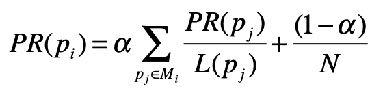

其中，pi 表示第 i 张网页，Mi 是 pi 的入链接集合，pj 是 Mi 集合中的第 j 张网页。PR(pj) 表示网页 pj 的 PageRank 得分，L(pj) 表示网页 pj 的出链接数量，$1 \over L(p_j)$ 就表示从网页 pj 跳转到 pi 的概率。α 是用户不进行随机跳转的概率，N 表示所有网页的数量。

### 隐马尔科夫模型

在某些现实的应用场景中，我们是无法确定马尔科夫过程中某个状态的取值的。这种情况下，最经典的案例就是语音识别。使用概率对语音进行识别的过程，和语言模型类似，因此我们可以把每个等待识别的词对应为马尔科夫过程中的一个状态。

计算机只知道某个词的发音，而不知道它具体怎么写，对于这种情况，我们就认为计算机只能观测到每个状态的部分信息，而另外一些信息被“隐藏”了起来。这个时候，我们就需要用隐马尔科夫模型来解决这种问题。隐马尔科夫模型有两层，一层是我们可以观测到的数据，称为“输出层”，另一层则是我们无法直接观测到的状态，称为“隐藏状态层”。

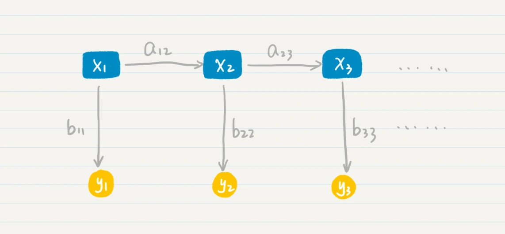

其中，x1，x2，x3 等等属于隐藏状态层，a12 表示了从状态 x1 到 x2 的转移概率，a23 表示了从状态 x2 到 x3 的转移概率。这一层和普通的马尔科夫模型是一致的，可惜在隐马尔科夫模型中我们无法通过数据直接观测到这一层。我们所能看到的是，y1，y2，y3 等等代表的“输出层”。另外，b11 表示了从状态 x1 到 y1 的输出概率，b22 表示了从状态 x2 到 y2 的输出概率，b33 表示了从状态 x3 到 y3 的输出概率等等。

那么在这个两层模型示例中，“隐藏状态层”产生“输出层”的概率是多少呢？这是一系列条件概率决定的，具体的公式我列在这里。
$$
P(x_1)*P(y_1|x_1)*P(x_2|x_1)*P(y_2|x_2)*P(x_3|x_2)*P(y_3|x_3)\\=P(x_1)*b_{11}*a_{12}*b_{22}*a_{23}*b_{33}
$$

#### 一个浅显易懂的例子

假设正在进行普通话语音识别，计算机接受了一个词组的发音。我在下面列出了它的拼音。

```
xiang(四声)mu(四声) kai(一声)fa(一声) shi(四声)jian(四声)
```

假设根据我们手头上的语料数据，这个词组有多种可能，我列出两种。

##### 第一种情况

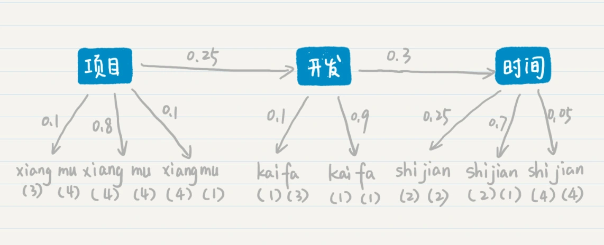

第一种情况下，三个确定的状态是“项目”“开发”和“时间”这三个词。从“项目”转移到“开发”的概率是 0.25，从“开发”转移到“时间”的概率是 0.3。从“项目”输出“xiang（三声）mu（四声）”的概率是 0.1，输出“xiang（四声）mu（四声）”的概率是 0.8，输出“xiang（四声）mu（一声）”的概率是 0.1，“开发”和“时间”也有类似的输出概率。在两层模型的条件概率公式中，我代入了具体的概率值并使用了如下的推导：

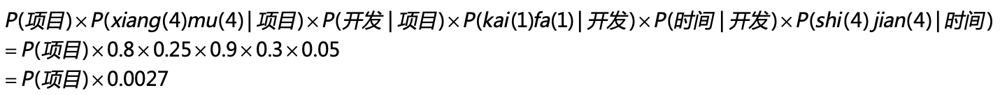

##### 第二种情况

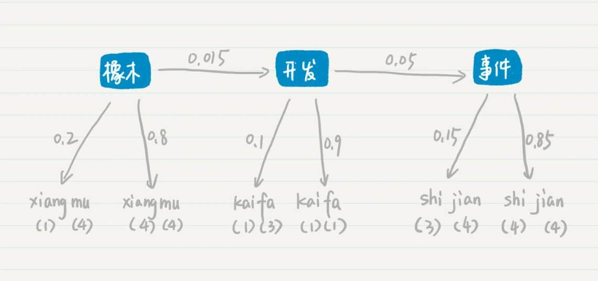

在第二种的可能性中，三个确定的状态是“橡木”“开发”和“事件”这三个词。从“橡木”转移到“开发”的概率是 0.015，从“开发”转移到“事件”的概率是 0.05。从“橡木”输出“xiang（一声）mu（四声）”的概率是 0.2，输出“xiang（四声）mu（四声）”的概率是 0.8，“开发”和“事件”也有类似的输出概率。和第一种情况类似，我们可以计算“橡木开发事件”这个词组最后生成的概率是多少，我用下面这个公式来推导：

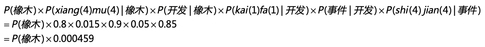

最后比较第一种和第二种情况产生的概率，分别是 P(项目)x0.0027 和 P(橡木)x0.000459。假设 P(项目) 和 P(橡木) 相等，那么“项目开发时间”这个词组的概率更高。所以“xiang（四声）mu（四声）kai（一声）fa（一声）shi（四声）jian（四声）”这组发音，计算机会识别为“项目开发时间”。从中我们可以看出，尽管“事件”这个词产生“shi（四声）jian（四声）”这个发音的可能性更高，但是“橡木开发事件”这个词组出现的概率极低，因此最终计算机还是选择了“项目开发时间”，隐藏的状态层起到了关键的作用。

### 总结

马尔科夫模型考虑了 n 个状态之间的转移及其对应的关系。这个状态是比较抽象的含义，在不同的应用领域代表不同的含义。在概率语言模型中，状态表示不同的词，状态之间的转移就代表了词按照一定的先后顺序出现。在 PageRank 这种链接分析中，状态表示不同的网页，状态之间的转移就代表了人们在不同网页之间的跳转。

在马尔科夫模型中，我们知道了每种状态及其之间转移的概率，然后求解序列出现的概率。然而，有些现实的场景更为复杂，比如说我们观测到的不是状态本身，而是状态按照一定概率分布所产生的输出。针对这种情况，隐马尔科夫模型提出了一种两层的模型，同时考虑了状态之间转移的概率和状态产生输出的概率，为语音识别、手写识别、机器翻译等提供了可行的解决方案。

隐马尔科夫模型需要回答的最主要问题是：给定一个模型和某个特定的输出序列，如何找到最可能产生这个输出的状态序列？在本节中，我使用了“项目开发时间”这个例子展示隐马尔科夫模型是如何工作的。不过这个例子很简单，我只比较了两种可能性。但是，实际中可能性是非常多的，如果我们使用穷举法，那么复杂度一定很高。

我们可以把两层的模型看作图结构。其中，状态和输出是结点，转移和输出关系是边，相应的概率是边的权重，这个时候我们就可以对 Dijkstra 算法稍加修改，来找出权重乘积最大的最优路径，提升查找的效率。我们还可以利用状态序列之间存在的先后关系，使用基于动态规划的维特比（Viterbi）算法来找出最优路径。

## 26. 信息熵

### 信息熵

信息熵，我们通常简称为熵，其实就是用来刻画给定集合的纯净度的一个指标。

比如说，一个集合里的元素全部是属于同一个分组，这个时候就表示最纯净，我们就说熵为 0；如果这个集合里的元素是来自不同的分组，那么熵是大于 0 的值。其具体的计算公式如下：

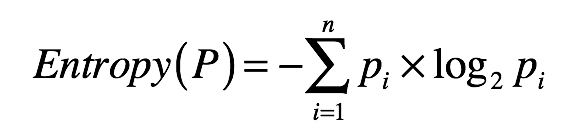

其中，n 表示集合中分组的数量，pi 表示属于第 i 个分组的元素在集合中出现的概率。

熵的公式是用来计算某个随机变量的**信息量**之期望，而信息量是信息论中的一个度量，简单来说就是，当我们观察到某个随机变量的具体值时，接收到了多少信息。而我们接收到的信息量跟发生事件的概率有关。事情发生的概率越大，产生的信息量越小；事情发生的概率越小，产生的信息量越大。

因此，我们想要设计一个能够描述信息量的函数，就要同时考虑到下面这三个特点：

* 信息量应该为正数；
* 一个事件的信息量和它发生的概率成反比；
* H(x) 与 P(x) 的对数有关。其中 H(x) 表示 x 的信息量，P(x) 表示 x 出现的概率。假设有两个不相关的事件 x 和 y，我们观察到这两个事件同时发生时获得的信息量，应该等于这两个事件各自发生时获得的信息量之和，用公式表达出来就是 H(x,y)=H(x)+H(y)。之前我们说过，如果 x，y 是两个不相关的事件，那么就有 P(x,y)=P(x)∗P(y)。

依照上述这三点，我们可以设计出信息量公式：H(x)=−log(P(x),2)。函数 log 的使用是体现了 H(x) 和 P(x) 的对数关系（我们可以使用其他大于 1 的数字作为对数的底，我这里使用 2 只是约定俗成。而最开始的负号是为了保证信息量为正）。这个公式可以量化随机变量某种取值时，所产生的信息量。最后，加上计算随机变量不同可能性所产生的信息量之期望，我们就得到了熵的公式。

从集合和分组的角度来说，如果一个集合里的元素趋向于落在同一分组里，那么告诉你某个元素属于哪个分组的信息量就越小，整个集合的熵也越小，换句话说，整个集合就越“纯净”。相反，如果一个集合里的元素趋向于分散在不同分组里，那么告诉你某个元素属于哪个分组的信息量就越大，整个集合的熵也越大，换句话说，整个集合就越“混乱”。

一个集合中所包含的分组越多、元素在这些分组里分布得越均匀，熵值也越大。而熵值表示了纯净的程度，或者从相反的角度来说，是混乱的程度。

如果将一个集合划分成多个更小的集合之后，又该如何根据这些小集合，来计算整体的熵呢？之前我们提到了信息量和熵具有加和的性质，所以对于包含多个集合的更大集合，它的信息量期望值是可以通过每个小集合的信息量期望值来推算的。具体来说，我们可以使用如下公式：

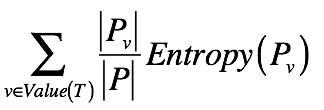

其中，T 表示一种划分，Pv 表示划分后其中某个小集合，Entropy(Pv) 表示某个小集合的熵，而$|P_v|\over |P|$表示某个小集合出现的概率。所以这个公式其实就表示，对于多个小集合而言，其整体的熵等于各个小集合之熵的加权平均。而每个小集合的权重是其在整体中出现的概率。

### 信息增益

如果我们将划分前后的整体熵做个对比，你会发现划分后的整体熵要小于划分之前的整体熵。这是因为每次划分，都可能将不同分组的元素区分开来，降低划分后每个小集合的混乱程度，也就是降低它们的熵。我们将划分后整体熵的下降，称为信息增益（Information Gain）。如果划分后整体熵下降得越多，信息增益就越大。

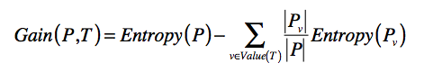

其中 T 表示当前选择的特征，Entropy§ 表示选择特征 T 之前的熵，Entropy(Pv) 表示特征 T 取值为 v 分组的熵。减号后面的部分表示选择 T 做决策之后，各种取值加权平均后整体的熵。Gain(P,T) 表示两个熵值之差，越大表示信息增益越多，应该选择这维特征 T。

## 27. 决策树

如何才能进行高效的问卷调查。最核心的思想是，根据当前的概率分布，挑选在当前阶段区分能力更强的那些问题。具体的步骤有三个。

第一步，根据分组中的人物类型，为每个集合计算信息熵，并通过全部集合的熵值加权平均，获得整个数据集的熵。注意，一开始集合只有一个，并且包含了所有的武侠人物。

第二步，根据信息增益，计算每个问卷题的区分能力。挑选区分能力最强的题目，并对每个集合进行更细的划分。

第三步，有了新的划分之后，回到第一步，重复第一和第二步，直到没有更多的问卷题，或者所有的人物类型都已经被区分开来。这一步也体现了递归的思想。

其实，上述这个过程就体现了训练**决策树**（Decision Tree）的基本思想。决策树学习属于归纳推理算法之一，适用于分类问题。在前面介绍朴素贝叶斯的时候，我说过，分类算法主要包括了建立模型和分类新数据两个阶段。决定问卷题出现顺序的这个过程，其实就是建立决策树模型的过程。

### 决策树构建树的步骤

第一步，根据集合中的样本分类，为每个集合计算信息熵，并通过全部集合的熵值加权平均，获得整个数据集的熵。注意，一开始集合只有一个，并且包含了所有的样本。

第二步，根据信息增益，计算每个特征的区分能力。挑选区分能力最强的特征，并对每个集合进行更细的划分。

第三步，有了新的划分之后，回到第一步，重复第一步和第二步，直到没有更多的特征，或者所有的样本都已经被分好类。

### 几种决策树算法的异同

随着机器学习的快速发展，人们也提出了不少优化版的决策树。采用信息增益来构建决策树的算法被称为ID3（Iterative Dichotomiser 3，迭代二叉树 3 代）。但是这个算法有一个缺点，它一般会优先考虑具有较多取值的特征，因为取值多的特征会有相对较大的信息增益。这是为什么呢？

你仔细观察一下信息熵的定义，就能发现背后的原因。更多的取值会把数据样本划分为更多更小的分组，这样熵就会大幅降低，信息增益就会大幅上升。但是这样构建出来的树，很容易导致机器学习中的过拟合现象，不利于决策树对新数据的预测。为了克服这个问题，人们又提出了一个改进版，C4.5 算法。

这个算法使用**信息增益率**（Information Gain Ratio）来替代信息增益，作为选择特征的标准，并降低决策树过拟合的程度。信息增益率通过引入一个被称作分裂信息（Split Information）的项来惩罚取值较多的特征，我把相应的公式给你列出来了。

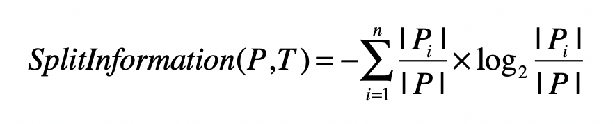

其中，训练数据集 P 通过属性 T 的属性值，划分为 n 个子数据集，∣Pi∣ 表示第 i 个子数据集中样本的数量，∣P∣ 表示划分之前数据集中样本总数量。 这个公式看上去和熵很类似，其实并不相同。

熵计算的时候考虑的是，集合内数据是否属于同一个类，因此即使集合数量很多，但是集合内的数据如果都是来自相同的分类（或分组），那么熵还是会很低。而这里的分裂信息是不同的，它只考虑子集的数量。如果某个特征取值很多，那么相对应的子集数量就越多，最终分裂信息的值就会越大。正是因为如此，人们可以使用分裂信息来惩罚取值很多的特征。具体的计算公式如下：

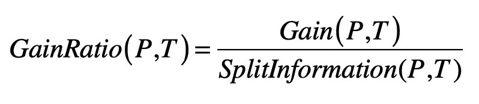

其中 Gain(P,T) 是数据集 P 使用特征 T 之后的信息增益，GainRatio(P,T) 是数据集 P 使用特征 T 之后的信息增益率。

另一种常见的决策树是 **CART 算法**（Classification and Regression Trees，分类与回归树）。这种算法和 ID3、C4.5 相比，主要有两处不同：

* 在分类时，CART 不再采用信息增益或信息增益率，而是采用基尼指数（Gini）来选择最好的特征并进行数据的划分；
* 在 ID3 和 C4.5 决策树中，算法根据特征的属性值划分数据，可能会划分出多个组。而 CART 算法采用了二叉树，每次把数据切成两份，分别进入左子树、右子树。

当然，CART 算法和 ID3、C4.5 也有类似的地方。首先，CART 中每一次迭代都会降低基尼指数，这类似于 ID3、C4.5 降低信息熵的过程。另外，基尼指数描述的也是纯度，与信息熵的含义相似。我们可以用下面这个公式来计算每个集合的纯度。

.webp)

其中，n 为集合 P 中所包含的不同分组（或分类）数量。如果集合 P 中所包含的不同分组越多，那么这个集合的基尼指数越高，纯度越低。

然后，我们需要计算整个数据集的基尼指数。

.webp)

其中，m 为全集使用特征 T 划分后，所形成的子集数量。Pj 为第 j 个集合。

无论是何种决策树算法，来自信息论的几个重要概念：信息熵、信息增益、信息增益率、基尼指数都起到了重要的作用。如果你能很好的学习并运用这些概念，那么决策树这种类型的算法就不难理解了。

决策树算法的优势在于，容易理解和实现。此外，对于通过样本训练所得的树结构，其每个结点都是基于某个数据特征的判定，对于我们的阅读和解释来说都是很方便的。

当然，决策树也有不足。之前我已经提到，这类算法受训练样本的影响很大，比较容易过拟合。在预测阶段，如果新的数据和原来的训练样本差异较大，那么分类效果就会比较差。为此人们也提出了一些优化方案，比如剪枝和随机森林。

## 28. 熵、信息增益和卡方：如何寻找关键特征

### 什么是特征选择

在编程领域中，机器学习已经有了十分广泛的应用，它主要包括监督式学习（Supervised Learning）和非监督式的学习（Unsupervised Learning）。监督式学习，是指通过训练资料学习并建立一个模型，并依此模型推测新的实例，主要包括分类（Classification）和回归（Regression）。

机器学习的步骤主要包括数据的准备、特征工程、模型拟合、离线和在线测试。测试过程也许会产生新的数据，用于进一步提升模型。在这些处理中，特征工程是非常重要的一步。

“特征”（Feature），是机器学习非常常用的术语，它其实就是可用于模型拟合的各种数据。前面讲朴素贝叶斯分类时，我解释了如何把现实世界中水果的各类特征转化为计算机所能理解的数据，这个过程其实就是最初级的特征工程。当然，特征工程远不止原始特征到计算机数据的转化，还包括特征选择、缺失值的填补和异常值的去除等等。这其中非常重要的一步就是特征选择。

越来越多的数据类型和维度的出现，会加大机器学习的难度，并影响最终的准确度。针对这种情形，特征选择尝试发掘和预定义任务相关的特征，同时过滤不必要的噪音特征。它主要包括特征子集的产生、搜索和评估。

### 利用信息熵进行特征选择

对于分类问题，我们更关心的是如何正确地把一篇文章划分到正确的分类中。一个好的特征选择，应该可以把那些对分类有价值的信息提取出来，而过滤掉那些对分类没有什么价值的信息。既然如此，我们能不能充分利用分类标签来进行挑选呢？答案是肯定的。前两节，我描述了信息熵和信息增益的工作原理。这里，我就可以使用它们来进行特征选择。

什么是对分类有价值的特征？如果一个特征，经常只在某个或少数几个分类中出现，而很少在其他分类中出现，那么说明这个特征具有较强的区分力，它的出现很可能预示着整个数据属于某个分类的概率很高或很低。这个时候，对于一个特征，我们可以看看包含这个特征的数据，是不是只属于少数几个类。

是否属于少数几个类这一点，可以使用信息熵来衡量。我用 Dfi 来表示所有出现特征 fi 的数据集合，这个集合一共包含了 n 个分类 C，而 cj 表示这 n 个分类中的第 j 个。然后我们就可以根据 Dfi 中分类 C 的分布，来计算熵。我们用这个公式来计算：
$$
-\sum^n_{j=1}P(c_j|Df_i)*log_2P(c_j|Df_i)
$$
如果熵值很低，说明包含这个特征的数据只出现在少数分类中，对于分类的判断有价值。计算出每个特征所对应的数据集之熵，我们就可以按照熵值由低到高对特征进行排序，挑选出排列靠前的特征。

当然，这个做法只考虑了单个特征出现时，对应数据的分类情况，而并没有考虑整个数据集的分类情况。比如，虽然出现“电影”这个词的文章，经常出现在“娱乐”这个分类中，很少出现在其他分类中，但是可能整个样本数据中，“娱乐”这个分类本来就已经占绝大多数，所以“电影”可能并非一个很有信息含量的特征。

为了改进这一点，我们可以借用决策树中信息增益的概念。我们把单个特征 f 是不是出现作为一个决策条件，将数据集分为 Dfi 和 Dfiˉ ，Dfi 表示出现了这个特征的数据，而 Dfiˉ 表示没有出现这个特征的数据。那么使用特征 fi 进行数据划分之后，我们就能得到基于两个新数据集的熵，然后和没有划分之前的熵进行比较，得出信息增益。

如果基于某个特征的划分，所产生的信息增益越大，说明这个特征对于分类的判断越有价值。所以，我们可以计算基于每个特征的划分所产生的信息增益，然后按照增益值由高到低对特征进行排序，挑选出排列靠前的特征。

### 利用卡方检验进行特征选择

在统计学中，我们使用卡方检验来检验两个变量是否相互独立。把它运用到特征选择，我们就可以检验特征与分类这两个变量是否独立。如果两者独立，证明特征和分类没有明显的相关性，特征对于分类来说没有提供足够的信息量。反之，如果两者有较强的相关性，那么特征对于分类来说就是有信息量的，是个好的特征。为了检验独立性，卡方检验考虑了四种情况的概率：P(fi,cj)  、P(fiˉ,cjˉ)、P(fi,cjˉ) 和 P(fiˉ,cj)。

在这四种概率中，P(fi,cj) 和 P(fiˉ,cjˉ) 表示特征 fi 和分类 cj 是正相关的。如果 P(fi,cj) 很高，表示特征 fi 的出现意味着属于分类 cj 的概率更高；如果 P(fiˉ,cjˉ) 很高，表示特征 fi 不出现意味着不属于分类 cj 的概率更高。

类似地，P(fi,cjˉ) 和 P(fiˉ,cj) 表示特征 fi 和分类 cj 是负相关的。如果 P(fi,cjˉ) 很高，表示特征 fi 的出现意味着不属于分类 cj 的概率更高；如果 P(fiˉ,cj) 很高，表示特征 fi 不出现意味着属于分类 cj 的概率更高。

如果特征和分类的相关性很高，要么是正向相关值远远大于负向相关值，要么是负向相关值远远大于正向相关值。如果特征和分类相关性很低，那么正向相关值和负向相关的值就会很接近。卡方检验就是利用了正向相关和负向相关的特性。

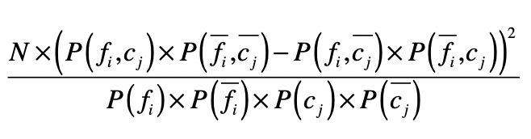

其中，N 表示数据的总个数。通过这个公式，你可以看到，如果一个特征和分类的相关性很高，无论是正向相关还是负向相关，那么正向相关和负向相关的差值就很大，最终计算的值就很高。最后，我们就可以按照卡方检验的值由高到低对特征进行排序，挑选出排列靠前的特征。

### 总结

在之前水果的案例中，可用的特征并不是很多，每种特征都是有价值的。对于文本分类，每种单词或词组都是特征，再加上多元文法，特征的数量会成倍的增加。过多的特征会影响模型分析的速度和准确度。

对于监督式学习而言，我们没有必要进行 $O(2^N) $​这种数量级的特征子集搜索，而是直接考虑特征和分类标签之间的关系。这个时候信息论等统计度量就可以帮上忙了，它们可以衡量特征和分类之间的关联程度，从而判断哪些特征对于分类来说更重要。

无论是使用何种统计度量，我们都可以计算相应的数值、排序、并得到排名靠前的若干特征。从文本分类的角度来说，我们只会挑选对分类最有价值的那些单词或词组，而去除其他不重要的那些词。如果特征选择得当，我们既可以减少模型存储的空间，还可以提升分类的准确度。当然，过度的减少特征最终会导致准确度的下降，所以对于不同的数据集要结合实验，要把握一个合理的度。

## 29. 归一化和标准化

### 为什么需要特征变换？

我们之前介绍的监督式学习会根据某个样本的一系列特征，最后判定它应该属于哪个分类，并给出一个离散的分类标签。除此之外，还有一类监督式学习算法，会根据一系列的特征输入，给出连续的预测值。

因变量连续回归的训练和预测，和分类的相应流程大体类似，不过具体采用的技术有一些不同。它采用的是研究一个或多个随机变量 y1，y2，…，yi 与另一些变量 x1，x2，…，xk 之间关系的统计方法，又称**多重回归分析**。

我们将 y1，y2，…，yi 称为因变量，x1，x2，…，xk 称为自变量。通常情况下，因变量的值可以分解为两部分，一部分是受自变量影响的，即表示为自变量相关的函数，其中函数形式已知，可能是线性也可能是非线性函数，但包含一些未知参数；另一部分是由于其他未被考虑的因素和随机性的影响，即随机误差。

如果因变量和自变量为线性关系时，就称为**线性回归模型**；如果因变量和自变量为非线性关系，则称为**非线性回归分析模型**。今天我们要说的是回归中常用的多元线性回归，它的基本形式是：
$$
y=w_0+w_1x_1+w_2x_2+...+w_nx_n+\epsilon
$$
其中，x1，x2，…，xn 是自变量，y 是因变量，ε 是随机误差，通常假定随机误差的均值为 0。而 w0 是截距，w1，w2，…，wn 是每个自变量的系数，表示每个自变量对最终结果的影响是正面还是负面，以及影响的程度。如果某个系数大于 0，表示对应的自变量对结果是正面影响，这个自变量越大，结果就越大。否则就是负面影响，这个自变量越大，结果就越小。而系数的绝对值表示了影响程度的大小，如果绝对值趋于 0，表示基本没有影响。

线性回归和其他算法相比，有很强的可解释性。我们可以通过回归后为每个自变量确定的系数，来判断哪些自变量对最终的因变量影响更大。可是，在正式开始线性回归分析之前，还有一个问题，那就是不同字段的数据没有可比性。

比如，房屋的面积和建造的年份，它们分别代表了不同的含义，也有不一样的取值范围。在线性回归中，如果直接将没有可比性的数字型特征线性加和，那么模型最终的解释肯定会受影响。

造成这些现象最重要的原因是，不同类型的特征值没有转换到同一个可比较的范围内，所以线性回归后所得到的系数不具有可比性，因此我们无法直接对这些权重加以解释。

总结：

为什么有时候需要转换特征值？因为不同类型的特征取值范围不同，分布也不同，相互之间没有可比性。因此在线性回归中，通过这些原始值分析得到的权重，并不能代表每个特征实际的重要性。

### 两种常见的特征变换方法

该怎么解决这个问题呢？我们就需要对特征值进行转换。今天我介绍两种最常见的变换方法：归一化和标准化。

#### 归一化

归一化（Normalization）其实就是获取原始数据的最大值和最小值，然后把原始值线性变换到[0,1]之间，具体的变换函数为：
$$
x^,=\frac{x-min}{max-min}
$$
其中 x 是原始值，max 为样本数据的最大值，min 为样本数据的最小值，x’ 是变换后的值。这种方法有个不足最大值与最小值非常容易受噪音数据的影响。

#### 标准化

另一种常见的方法是基于正态分布的 z 分数（z-score）标准化（Standardization）。该方法假设数据呈现标准正态分布。正态分布是连续随机变量概率分布的一种。在现实生活中，大量随机现象的数据分布都近似于正态分布。它以经过平均数的垂线为轴，左右对称展开，中间点最高，然后逐渐向两侧下降，分布曲线和 x 轴组成的面积为 1，表示不同事件出现的概率和为 1。平均数和标准差是正态分布的关键参数，它们会决定分布的具体形态。而标准正态分布是正态分布的一种，平均数为 0，标准差为 1。

理解了什么是标准正态分布，我们来看看 z 分数这个方法是如何运作的。实际上，z 分数标准化是利用标准正态分布的特点，计算一个给定分数距离平均数有多少个标准差。它的具体转换公式如下：
$$
x^,=\frac{x-\mu}{σ}
$$
其中 x 为原始值，u 为均值，σ 为标准差，x’ 是变换后的值。

经过 z 分数的转换，高于平均数的分数会得到一个正的标准分，而低于平均数的分数会得到一个负的标准分数。更重要的是，转换后的数据是符合标准正态分布的。你通过理论或者具体的数值来推导一下，就会发现转换后的数据均值为 0，标准差为 1。和归一化相比，z 分数这样的标准化不容易受到噪音数据的影响，并且保留了各维特征对目标函数的影响权重。

## 30-31. 统计意义

A/B 测试，简单来说，就是为同一个目标制定两个或多个方案，让一部分用户使用 A 方案，另一部分用户使用 B 方案，记录下每个部分用户的使用情况，看哪个方案产生的结果更好。这也意味着，通过 A/B 测试的方式，我们可以拿到使用多个不同方法之后所产生的多组结果，用于对比。

### 显著性差异

显著性差异（Significant Difference），其实就是研究多组数据之间的差异是由于不同的数据分布导致的呢，还是由于采样的误差导致的呢？通常，我们也把“具有显著性差异”，称为“差异具有统计意义”或者“差异具有显著性”。

需要注意“差异具有显著性”和“具有显著差异”的区别。如前所说，“差异具有显著性“表示不同的组很可能来自不同的数据分布，也就是说多个组的数据来自同一分布的可能性非常小。而“具有显著差异”，是指差异的幅度很大，比如相差 100 倍。

### 统计假设检验和显著性检验

统计假设检验是指事先对随机变量的参数或总体分布作出一个假设，然后利用样本信息来判断这个假设是否合理。在统计学上，我们称这种假设为**虚无假设**（Null Hypothesis），也叫原假设或零假设，通常记作 H0。而和虚无假设对立的假设，我们称为**对立假设**（Alternative Hypothesis），通常记作 H1。也就是说，如果证明虚无假设不成立，那么就可以推出对立假设成立。

统计假设检验的具体步骤是，先认为原假设成立，计算其会导致什么结果。若在单次实验中产生了小概率的事件，则拒绝原假设 H0，并接受对立假设 H1。若不会产生小概率的事件，则不能拒绝原假设 H0，从而接受它。因此，统计学中的假设是否成立，并不像逻辑数学中的绝对“真”或“假”，而是需要从概率的角度出发来看。

显著性检验是统计假设检验的一种，顾名思义，它可以帮助我们判断多组数据之间的差异，是采样导致的“偶然”，还是由于不同的数据分布导致的“必然“。当然，这里的“偶然”和“必然”都是相对的，和显著性水平α有关。显著性检验的假设是，多个数据分布之间没有差异。如果样本发生的概率小于显著性水平α，证明小概率事件发生了，所以拒绝原假设，也就是说认为多个分布之间有差异。否则呢，接受原假设，认为多个分布之间没有差异。换句话说，显著性水平α即为拒绝原假设的标准。

### P值

P 值中的 P 代表 Probability，就是当 H0 假设为真时，样本出现的概率，或者换句话说，其实就是我们所观测到的样本数据符合原假设 H0 的可能性有多大。如果 P 值很小，说明观测值与假设 H0 的期望值有很大的偏离，H0 发生的概率很小，我们有理由拒绝原假设，并接受对立假设。P 值越小，表明结果越显著，我们越有信心拒绝原假设。反之，说明观测值与假设 H0 的期望值很接近，我们没有理由拒绝 H0。

在显著性检验中，原假设认为多个分组内的数据来自同一个数据分布，如果 P 值足够小，我们就可以拒绝原假设，认为多个分组内的数据来自不同的数据分布，它们之间存在显著性的差异。所以说，只要能计算出 P 值，我们就能把 P 值和显著性水平α进行比较，从而决定是否接受原假设。

### 显著性检验

差异显著性检验是指从统计的角度来说，差异的产生有多大的概率、是不是足够可信。这点和数值差异的大小是有区别的。既然我们不能通过差异的大小来推断差异是否可信，那么有没有什么方法，可以帮助我们检验不同数据分布之间，是否存在显著差异呢？具体的方法有不少，比如方差分析（F 检验）、t 检验、卡方检验等等。我这里以方差分析为例，来讲这个方法是如何帮助我们解决 AB 测试中的问题。

方差分析（Analysis of Variance, ANOVA），也叫 F 检验。这种方法可以检验两组或者多组样本的均值是否具备显著性差异。它有四个前提假设，分别是：

* 随机性：样本是随机采样的；
* 独立性：来自不同组的样本是相互独立的；
* 正态分布性：组内样本都来自一个正态分布；
* 方差齐性：不同组的方差相等或相近。

## 32. 欠拟合和过拟合

拟合（Model Fitting）：在监督式学习中，我们经常提到“训练一个模型”，其实更学术的说法应该是“拟合一个模型”。拟合模型其实就是指通过模型的假设和训练样本，推导出具体参数的过程。有了这些参数，我们就能对新的数据进行预测。

有的时候拟合得到的模型过于简单，和训练样本之间的误差非常大，这种情况就是**欠拟合**（Under Fitting）。这种拟合模型和训练样本之间的差异，我们就称为**偏差**（Bias）。

相对于欠拟合，另一种情况是，拟合得到的模型非常精细和复杂，和训练样本之间的误差非常小，我们称这种情况为**过拟合**（Over Fitting）。

### 如何处理欠拟合和过拟合？

**欠拟合问题，产生的主要原因是特征维度过少，拟合的模型不够复杂，无法满足训练样本，最终导致误差较大**。因此，我们就可以增加特征维度，让输入的训练样本具有更强的表达能力。

相对应的，**过拟合问题产生的主要原因则是特征维度过多，导致拟合的模型过于完美地符合训练样本，但是无法适应测试样本或者说新的数据**。所以我们可以减少特征的维度。

## 33. 线性代数

标量和向量的区别，标量只是单独的一个数，而向量是一组数。矩阵是向量的扩展，就是一个二维数组。我们可以使用哈希表的链地址法表示稀疏矩阵。

标量和向量或矩阵的加法、乘法比较简单，就是把这个标量和向量或矩阵中所有的元素轮流进行相加或相乘。向量之间的加法和矩阵之间的加法，是把两者对应的元素相加。向量之间的相乘分为叉乘和点乘，默认向量乘法为点乘。而矩阵的乘法默认为左矩阵的行向量和右矩阵的列向量两两点乘。

## 34. 向量空间模型

### 什么是向量空间？

首先假设有一个数的集合 F，它满足“F 中任意两个数的加减乘除法（除数不为零）的结果仍然在这个 F 中”，我们就可以称 F 为一个“域”。我们处理的数据通常都是实数，所以这里我只考虑实数域。而如果域 F 里的元素都为实数，那么 F 就是实数域。

如果 x1，x2，……，xn∈F，那么 F 上的 n 维向量就是：

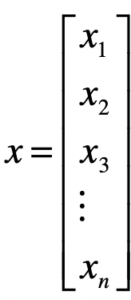

或者写成转置的形式：

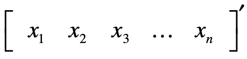

向量中第 i 个元素，也称为第 i 个分量。Fn 是由 F 上所有 n 维向量构成的集合。

假设 V 是 Fn 的非零子集，如果对任意的向量 x、向量 y∈V，都有 (x+y)∈V，我们称为 V 对向量的加法封闭；对任意的标量 k∈V，向量 x∈V，都有 kx 属于 V，我们称 V 对标量与向量的乘法封闭。

如果 V 满足向量的加法和乘法封闭性，我们就称 V 是 F 上的向量空间。向量空间除了满足这两个封闭性，还满足基本运算法则，比如交换律、结合律、分配律等等。

### 向量空间的几个重要概念

#### 向量之间的距离

有了向量空间，我们就可以定义向量之间的各种距离。我们之前说过，可以把一个向量想象为 n 维空间中的一个点。而向量空间中两个向量的距离，就是这两个向量所对应的点之间的距离。距离通常都是大于 0 的，这里我介绍几种常用的距离，包括曼哈顿距离、欧氏距离、切比雪夫距离和闵可夫斯基距离。

* 曼哈顿距离（Manhattan Distance）

  在二维空间中，两个点（实际上就是二维向量）x(x1,x2) 与 y(y1,y2) 间的曼哈顿距离是：

  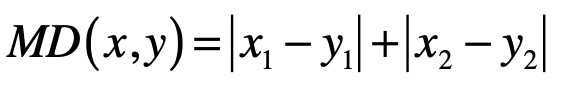

  推广到 n 维空间，曼哈顿距离的计算公式为：

  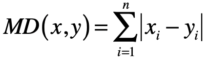

  其中 n 表示向量维度，xi 表示第一个向量的第 i 维元素的值，yi 表示第二个向量的第 i 维元素的值。

* 欧式距离（Euclidean Distance）

  欧氏距离，其实就是欧几里得距离。欧氏距离是一个常用的距离定义，指在 n 维空间中两个点之间的真实距离，在二维空间中，两个点 x(x1,x2) 与 y(y1,y2) 间的欧氏距离是：

  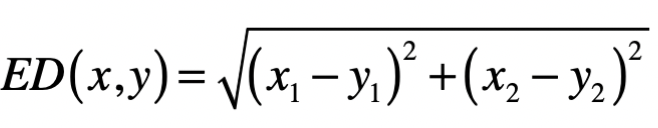

  推广到 n 维空间，欧氏距离的计算公式为：

  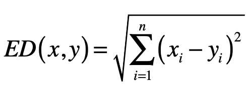

* 切比雪夫距离（Chebyshev Distance）

  切比雪夫其实是在模拟国际象棋里国王的走法。国王可以走临近 8 个格子里的任何一个，那么国王从格子 (x1,x2) 走到格子 (y1,y2) 最少需要多少步呢？其实就是二维空间里的切比雪夫距离。

  一开始，为了走尽量少的步数，国王走的一定是斜线，所以横轴和纵轴方向都会减 1，直到国王的位置和目标位置在某个轴上没有差距，这个时候就改为沿另一个轴每次减 1。所以，国王走的最少格子数是 ∣x1−y1∣ 和 ∣x2−y2∣ 这两者的较大者。所以，在二维空间中，两个点 x(x1,x2) 与 y(y1,y2) 间的切比雪夫距离是：

  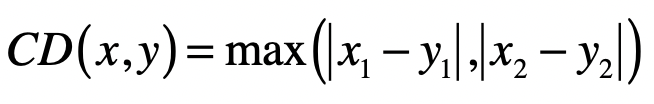

  推广到 n 维空间，切比雪夫距离的计算公式为：

  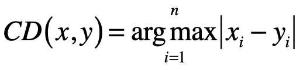

上述三种距离，都可以用一种通用的形式表示，那就是闵可夫斯基距离，也叫闵氏距离。在二维空间中，两个点 x(x1,x2) 与 y(y1,y2) 间的闵氏距离是：

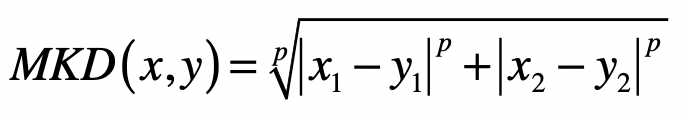

两个 n 维变量 x(x1,x2,…,xn) 与 y(y1,y2,…,yn) 间的闵氏距离的定义为：

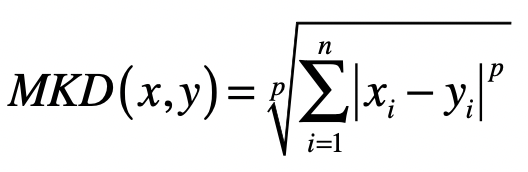

其中 p 是一个变参数，尝试不同的 p 取值，你就会发现：

* 当 p=1 时，就是曼哈顿距离；
* 当 p=2 时，就是欧氏距离；
* 当 p 趋近于无穷大的时候，就是切比雪夫距离。这是因为当 p 趋近于无穷大的时候，最大的 ∣xi−yi∣ 会占到全部的权重。

距离可以描述不同向量在向量空间中的差异，所以可以用于描述向量所代表的事物之差异（或相似）程度。

#### 向量的长度

向量的长度，也叫向量的模，是向量所对应的点到空间原点的距离。通常我们使用欧氏距离来表示向量的长度。

当然，我们也可以使用其他类型的距离。说到这里，我也提一下“范数”的概念。范数满足非负性、齐次性、和三角不等式。你可以不用深究这三点的含义，不过你需要知道范数常常被用来衡量某个向量空间中向量的大小或者长度。

L1 范数 ∣∣x∣∣ ，它是为 x 向量各个元素绝对值之和，对应于向量 x 和原点之间的曼哈顿距离。

L2 范数 ∣∣x∣∣2 ，它是 x 向量各个元素平方和的 21 次方，对应于向量 x 和原点之间的欧氏距离。

Lp 范数 ∣∣x∣∣p ，为 x 向量各个元素绝对值 p 次方和的 1/p 次方，对应于向量 x 和原点之间的闵氏距离。

L∞ 范数 ∣∣x∣∣∞ ，为 x 向量各个元素绝对值最大那个元素的绝对值，对应于向量 x 和原点之间的切比雪夫距离。

所以，在讨论向量的长度时，我们需要弄清楚是 L 几范数。

#### 向量之间的夹角

向量夹角的余弦，它计算了空间中两个向量所形成夹角的余弦值，具体的计算公式我列在了下面：

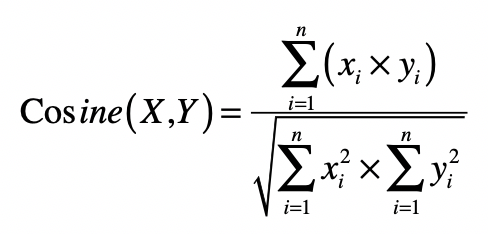

#### 向量空间模型

向量空间模型假设所有的对象都可以转化为向量，然后使用向量间的距离（通常是欧氏距离）或者是向量间的夹角余弦来表示两个对象之间的相似程度。

由于夹角余弦的取值范围已经在 -1 到 1 之间，而且越大表示越相似，所以可以直接作为相似度的取值。相对于夹角余弦，欧氏距离 ED 的取值范围可能很大，而且和相似度呈现反比关系，所以通常要进行 1/(ED+1) 这种归一化。

当 ED 为 0 的时候，变化后的值就是 1，表示相似度为 1，完全相同。当 ED 趋向于无穷大的时候，变化后的值就是 0，表示相似度为 0，完全不同。所以，这个变化后的值，取值范围是 0 到 1 之间，而且和相似度呈现正比关系。

早在上世纪的 70 年代，人们把向量空间模型运用于信息检索领域。由于向量空间可以很形象地表示数据点之间的相似程度，因此现在我们也常常把这个模型运用在基于相似度的一些机器学习算法中，例如 K 近邻（KNN）分类、K 均值（K-Means）聚类等等。

## 35. 文本检索

### 什么是信息检索？

信息检索就是让计算机根据用户信息需求，从大规模、非结构化的数据中，找出相关的资料。

在信息检索中，相关性是个永恒的话题。“这篇文章是否和体育相关？”当被问及这个问题，我们要大致看一下文章的内容，才能做出正确的判断。可是，迄今为止，计算机尚无法真正懂得人类的语言，它们该如何判定呢？好在科学家们设计了很多模型，帮助计算机处理基于文本的相关性。

最简单的模型是布尔模型，它借助了逻辑（布尔）代数的基本思想。如果我想看一篇文章是否关于体育，最简单的方法莫过于看看其中是否提到和体育相关的关键词，比如“足球”“NBA”“奥运会”等等。如果有，就相当于返回值为“真”，我就认为这篇文章就是相关的。如果没有，就相当于返回值为“假”，我就认为这篇文章不相关。这就是布尔模型的核心思想。

和布尔模型相比，向量空间模型更为复杂，也更为合理。如我之前介绍的，此模型的重点是将文档转换为向量，然后比较向量之间的距离或者相似程度。在转换的时候，我们通常会使用词包（Bag Of Word）的方式，忽略了单词在文章中出现的顺序，简化计算复杂度。类似地，这个模型也会把用户输入的查询转换为向量。如此一来，相关性问题就转化为计算查询向量和文档向量之间的距离或者相似度了。距离越小或者说相似度越高，那么我们就认为相关度越高。

相对于标准的布尔数学模型，向量空间模型的主要优势在于，允许文档和查询之间的部分匹配连续的相似程度、以及基于这些的的排序。结果不再局限于布尔模型的“真”“假”值。此外，单词或词组的权重可以不再是二元的，而是可以使用例如tf-idf（term frequency–inverse document frequency）的机制。

### 信息检索中的向量空间模型

整个方法从大体上来说，可以分为四个主要步骤。

第一步，把文档集合都转换成向量的形式。

第二步，把用户输入的查询转换成向量的形式，然后把这个查询的向量和所有文档的向量，进行比对，计算出基于距离或者夹角余弦的相似度。

第三步，根据查询和每个文档的相似度，找出相似度最高的文档，认为它们是和指定查询最相关的。

第四步，评估查询结果的相关性。

#### 把文档转为特征向量

任何向量都有两个主要的构成要素：维度和取值。这里的维度表示向量有多少维分量、每个分量的含义是什么，而取值表示每个分量的数值是多少。而原始的文本和向量差别很大，我们需要经过若干预处理的步骤。

我们首先来看看如何为文本创建向量的维度。简单地说，我们要把文章中唯一的单词或者词组，作为向量的一个维度。

在概率统计的模块中，我说过如何基于词包（Bag of Word）的方式来预处理文本，包括针对中文等语系的分词操作、针对英文等拉丁语系的词干（Stemming）和归一化（Normalization）处理，以及所有语言都会碰到的停用词（Stopword）、同义词和扩展词处理。完成了前面这些预处理，我们就可以获得每篇文档出现的单词和词组。而通过对所有文档中的单词和词组进行去重，我们就可以构建整个文档集合的词典（Vocabulary）。向量空间模型把词典中的每个词条作为向量的一个维度。

有了向量的维度，我们再来考虑每个维度需要取什么值。最简单的方法是用“1”表示这个词条出现在文档中，“0”表示没有出现。不过这种方法没有考虑每个词的权重。有些词经常出现，它更能表达文章的主要思想，对于计算机的分析能起到更大的作用。对于这点，有两种常见的改进方法，分别是使用词频和词频 x 逆文档频率来实现的。

我们先来看基于词频的方法。假设我们有一个文档集合 c，d 表示 c 中的一个文档，t 表示一个单词，那么我们使用 tf 表示词频（Term Frequency），也就是一个词 t 在文档 d 中出现的次数。这种方法的假设是，如果某个词在文档中的 tf 越高，那么这个词对于这个文档来说就越重要。

另一种改进方法，不仅考虑了 tf，还考虑了 idf。这里 idf 表示逆文档频率（Inverse Document Frequency）。

首先，df 表示文档频率（Document Frequency），也就是文档集合 c 中出现某个词 t 的文档数量。一般的假设是，某个词 t 在文档集合 c 中，出现在越多的文档中，那么其重要性越低，反之则越高。

我们通常用 df 的反比例指标 idf 来表示这种重要程度，基本公式如下：
$$
idf=log\frac{N}{df}
$$
其中 N 是整个文档集合中文章数量，log 是为了确保 idf 分值不要远远高于 tf 而埋没 tf 的贡献。这样一来，单词 t 的 df 越低，其 idf 越高，t 的重要性越高。那么综合起来，tf-idf 的基本公式表示如下：
$$
tf-idf=tfXidf
$$
一旦完成了从原始文档到向量的转换，我们就可以接受用户的查询（Query）。

#### 查询和文档的匹配

在计算查询和文档的相似度之前，我们还需要把查询转换成向量。由于用户的查询也是由自然语言组成，所以这个转换的流程和文档的转换流程是基本一致的。不过，查询也有它的特殊性，因此需要注意下面几个问题。

第一，查询和文档长度不一致。人们输入的查询通常都很短，甚至都不是一个句子，而只是几个关键词。这种情况下，你可能会觉得两个向量的维度不同，无法计算它们之间的距离或夹角余弦。对于这种情况，我们可以使用文档字典中所有的词条来构建向量。如果某维分量所对应的词条出现在文档或者查询中，就取 1、tf 或 tf-idf 值，如果没有就取 0。这样，文档向量和查询向量的维度就相同了，只是查询向量更稀疏、拥有多维度的 0。

第二，查询里出现了文档集合里没有的词。简单的做法是直接去除这维分量，也可以使用相对于其他维度来说极小的一个数值，这和分类中的平滑技术类似。

第三，查询里词条的 idf 该如何计算。如果我们使用 tf-idf 机制来计算向量中每个维度的取值，那么就要考虑这个问题。由于查询本身并不存在文档集合的概念，所以也就不存在 df 和 idf。对于这种情况，我们可以借用文档集合里对应词条的 idf。

把查询转换成向量之后，我们就可以把这个查询的向量和所有文档的向量依次对比，看看查询和哪些文档更相似。我们可以结合上一节所说的，计算向量之间的距离或者夹角余弦。由于夹角余弦不用进行归一化，所以这种方法更为流行。需要注意的是，信息检索里，夹角余弦的取值范围通常是[0,1]，而不再是[-1,1]。这是因为在进行文本处理的时候，我们根据单词的出现与否，设置 0、1/tf/tf-idf，因此向量每个分量的取值都是正的。

在概率统计模块中，我介绍过特征选择和特征值的转换。由于文本向量往往是非常稀疏的，我们也可能需要对转换后的文档和查询向量，进行这两项操作。

#### 评估和排序

完成了前两步，后面的排序和评估就很直观了。我们按照和输入查询的相似程度，对所有文档进行相似度由高到低的排序，然后取出前面的若干个文档，作为相关的信息返回。当然，这里你需要注意，这里所说的“相关性”是从向量空间模型的角度出发，不代表所返回的信息一定满足用户的需求。因此，我们还需要设计各种离线或者在线的评估，来衡量向量空间模型的效果。

## 36. 文本聚类

除了文档的相关性，距离或者相似度还可以用在机器学习的算法中。今天，我们就来聊聊如何在聚类算法中使用向量空间模型，并最终实现过滤重复文章。

### 聚类算法

在概率统计模块中，我们介绍了分类（Classification/Categorization）和回归（Regression）这两种监督式学习（Supervised Learning）。监督式学习通过训练资料学习并建立一个模型，并依此模型对新的实例进行预测。

不过，在实际场景中，我们常常会遇到另一种更为复杂的情况。这时候不存在任何关于样本的先验知识，而是需要机器在没人指导的情形下，去将很多东西进行归类。由于缺乏训练样本，这种学习被称为“非监督学习”（Unsupervised Learning），也就是我们通常所说的聚类（Clustering）。在这种学习体系中，系统必须通过一种有效的方法发现样本的内在相似性，并把数据对象以群组（Cluster）的形式进行划分。

 K 均值（K-Means）聚类算法，它让我们可以在一个任意多的数据上，得到一个事先定好群组数量（K）的聚类结果。这种算法的中心思想是：尽量最大化总的群组内相似度，同时尽量最小化群组之间的相似度。群组内或群组间的相似度，是通过各个成员和群组质心相比较来确定的。想法很简单，但是在样本数量达到一定规模后，希望通过排列组合所有的群组划分，来找到最大总群组内的相似度几乎是不可能的。于是人们提出如下的求近似解的方法。

1. 从 N 个数据对象中随机选取 k 个对象作为质心，这里每个群组的质心定义是，群组内所有成员对象的平均值。因为是第一轮，所以第 i 个群组的质心就是第 i 个对象，而且这时候我们只有这一个组员。
2. 对剩余的对象，测量它和每个质心的相似度，并把它归到最近的质心所属的群组。这里我们可以说距离，也可以说相似度，只是两者呈现反比关系。
3. 重新计算已经得到的各个群组的质心。这里质心的计算是关键，如果使用特征向量来表示的数据对象，那么最基本的方法是取群组内成员的特征向量，将它们的平均值作为质心的向量表示。
4. 迭代上面的第 2 步和第 3 步，直至新的质心与原质心相等或相差之值小于指定阈值，算法结束。

### 使用向量空间进行聚类

明白了 K 均值聚类算法的核心思想，再来理解向量空间模型在其中的运用就不难了。我还是以文本聚类为例，讲讲如何使用向量空间模型和聚类算法，去除重复的新闻。

我们在看新闻的时候，一般都希望不断看到新的内容。可是，由于现在的报道渠道非常丰富，经常会出现热点新闻霸占版面的情况。假如我们不想总是看到重复的新闻，应该怎么办呢？有一种做法就是对新闻进行聚类，那么内容非常类似的文章就会被聚到同一个分组，然后对每个分组我们只选择 1 到 2 篇显示就够了。

基本思路确定后，我们可以把整个方法分为三个主要步骤。

第一步，把文档集合都转换成向量的形式。这块我上一节讲过了，你要是不记得了，可以自己回去复习一下。

第二步，使用 K 均值算法对文档集合进行聚类。这个算法的关键是如何确定数据对象和分组质心之间的相似度。针对这点，我们有两个点需要关注。

* 使用向量空间中的距离或者夹角余弦度量，计算两个向量的相似度。

* 计算质心的向量。K 均值里，质心是分组里成员的平均值。所以，我们需要求分组里所有文档向量的平均值。求法非常直观，就是分别为每维分量求平均值，我把具体的计算公式列在这里：

  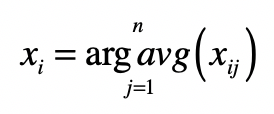

其中，xi 表示向量的第 i 个分量，xij 表示第 j 个向量的第 i 个分量，而 j=1,2,…,n 表示属于某个分组的所有向量。

第三步，在每个分类中，选出和质心最接近的几篇文章作为代表。而其他的文章作为冗余的内容过滤掉。

## 37-38. 矩阵

从数据结构的角度来看，我们可以把向量看作一维数组，把矩阵看作二维数组。

具有了二维数组的特性，矩阵就可以表达二元关系了，例如图中结点的邻接关系，或者是用户对物品的评分关系。而通过矩阵上的各种运算操作，我们就可以挖掘这些二元关系，在不同的应用场景下达到不同的目的。今天我就从图的邻接矩阵出发，展示如何使用矩阵计算来实现 PageRank 算法。

### 回顾 PageRank 链接分析算法

PageRank 是基于马尔科夫链的。它假设了一个“随机冲浪者”模型，冲浪者从某张网页出发，根据 Web 图中的链接关系随机访问。在每个步骤中，冲浪者都会从当前网页的链出网页中，随机选取一张作为下一步访问的目标。此外，PageRank 还引入了随机的跳转操作，这意味着冲浪者不是按 Web 图的拓扑结构走下去，只是随机挑选了一张网页进行跳转。基于之前的假设，PageRank 的公式定义如下：


其中，pi 表示第 i 张网页，Mi 是 pi 的入链接集合，pj 是 Mi 集合中的第 j 张网页。PR(pj) 表示网页 pj 的 PageRank 得分，L(pj) 表示网页 pj 的出链接数量，$1 \over L(p_j)$​ 就表示从网页 pj 跳转到 pi 的概率。α 是用户不进行随机跳转的概率，N 表示所有网页的数量。

PageRank 的计算是采用迭代法实现的：一开始所有网页结点的初始 PageRank 值都可以设置为某个相同的数，然后我们通过上面这个公式，得到每个结点新的 PageRank 值。每当一张网页的 PageRank 发生了改变，它也会影响它的出链接所指向的网页，因此我们可以再次使用这个公式，循环地修正每个网页结点的值。由于这是一个马尔科夫过程，所以我们能从理论上证明，所有网页的 PageRank 最终会达到一个稳定的数值。整个证明过程很复杂，这里我们只需要知道这个迭代计算的过程就行了。

### 简化 PageRank 公式

为了把问题简化，我们暂时不考虑随机跳转的情况，而只考虑用户按照网页间链接进行随机冲浪。那么 PageRank 的公式就简化为：
$$
\sum_{\atop P_j\epsilon M_i}\frac{PR(p_j)}{L(p_j)}
$$
这个公式只包含了原公式中的 Σ部分。我们再来对比看看矩阵点乘的计算公式。
$$
Z_{i,j}=\sum_kX_{i,k}Y_{k,j}
$$
以上两个公式在形式上是基本一致的。因此，我们可以把 Σ的计算，分解为两个矩阵的点乘。一个矩阵是当前每张网页的 PageRank 得分，另一个矩阵就是邻接矩阵。所谓邻接矩阵，其实就是表示图结点相邻关系的矩阵。

假设 xi,j 是矩阵中第 i 行、第 j 列的元素，那么我们就可以使用 xi,j 表示从结点 i 到结点 j 的连接，放到 PageRank 的应用场景，xi,j 就表示网页 pi 到网页 pj 的链接。最原始的邻接矩阵所包含的元素是 0 或 1，0 表示没有链接，而 1 表示有链接。

考虑到 PageRank 里乘积是 $1\over L(p_j)$，我们可以对邻接矩阵的每一行进行归一化，用原始的值（0 或 1）除以 L(pj)，而 L(pj) 表示有某张网页 pj 的出链接，正好是矩阵中 pj 这一行的和。所以，我们可以对原始的邻接矩阵，进行基于行的归一化，这样就能得到每个元素为 $1\over L(p_j)$​ 的矩阵，其中 j 表示矩阵的第 j 行。注意，这里的归一化是指让所有元素加起来的和为 1。

### 考虑随机跳转

经过上面的步骤，我们已经求得 Σ 部分。不过，PageRank 引入了随机跳转的机制。这一部分其实也是可以通过矩阵的点乘来实现的。我们把 Σ 部分用 A 表示，那么完整的 PageRank 公式就可以表示为：
$$
PR_{(P_i)}=\alpha A+\frac {1-\alpha}{N}
$$
于是，我们可以把上述公式分解为如下两个矩阵的点乘：
$$
\begin{bmatrix} 
A&\frac{1}{N}
\end{bmatrix}
\begin{bmatrix}
\alpha \\
1-\alpha
\end{bmatrix}
$$

### 使用 Python 进行实现

首先，我们要进行一些初始化工作，包括设置结点数量、确定随机跳转概率的 α、代表拓扑图的邻接矩阵以及存放所有结点 PageRank 值的数组。

```python
import numpy as np

# 设置确定随机跳转概率的alpha、网页结点数
alpha = 0.9
N = 5

# 初始化随机跳转概率的矩阵
jump = np.full([2,1], [[alpha], [1-alpha]], dtype=float)

# 邻接矩阵的构建
adj = np.full([N,N], [[0,0,1,0,0],[1,0,1,0,0],[1,0,0,0,0],[0,0,0,0,0],[0,1,0,0,0]], dtype=float)

# 对邻接矩阵进行归一化
row_sums = adj.sum(axis=1)      # 对每一行求和
row_sums[row_sums == 0] = 0.1   # 防止由于分母出现0而导致的Nan
adj = adj / row_sums[:, np.newaxis] # 除以每行之和的归一化

# 初始的PageRank值，通常是设置所有值为1.0
pr = np.full([1,N], 1, dtype=float)
```

之后，我们就能采用迭代法来计算 PageRank 值。一般我们通过比较每个结点最近两次计算的值是否足够接近，来确定数值是不是已经稳定，以及是不是需要结束迭代。这里为简便起见，我使用了固定次数的循环来实现。如果你的拓扑图比较复杂，需要更多次迭代。

```python
# PageRank算法本身是采用迭代方式进行的，当最终的取值趋于稳定后结束。
for i in range(0, 20):

    # 进行点乘，计算Σ(PR(pj)/L(pj))
    pr = np.dot(pr, adj)

    # 转置保存Σ(PR(pj)/L(pj))结果的矩阵，并增加长度为N的列向量，其中每个元素的值为1/N，便于下一步的点乘。
    pr_jump = np.full([N, 2], [[0, 1/N]])
    pr_jump[:,:-1] = pr.transpose()

    # 进行点乘，计算α(Σ(PR(pj)/L(pj))) + (1-α)/N)
    pr = np.dot(pr_jump, jump)

    # 归一化PageRank得分
    pr = pr.transpose()
    pr = pr / pr.sum()

    print("round", i + 1, pr)
```

如果成功运行了上述两段代码，你就能看到每个结点最终获得的 PageRank 分数是多少。

### 用矩阵实现推荐系统的核心思想

今天我们来聊聊矩阵操作和推荐算法的关系。

我这里说的推荐，是指为用户提供可靠的建议、并协助用户挑选物品的一种技术。一个好的推荐系统需要建立在海量数据挖掘基础之上，并根据用户所处的情景和兴趣特点，向用户推荐可能感兴趣的信息和商品。

协同过滤（Collaborative Filtering）是经典的推荐算法之一，它充分利用了用户和物品之间已知的关系，为用户提供新的推荐内容。我会从这种二元关系出发，给你讲讲如何使用矩阵计算，来实现协同过滤推荐算法。

矩阵中的二维关系，除了可以表达图的邻接关系，还可以表达推荐系统中用户和物品的关系。如果你不懂推荐系统，不用急，我这里先给你简单讲讲它的核心思想。

简单地理解就是，推荐系统会根据用户所处的场景和个人喜好，推荐他们可能感兴趣的信息和商品。比如，你在阅读一部电影的影评时，系统给你推荐了其他“你可能也感兴趣的电影”。可以看出来，推荐系统中至少有 2 个重要的角色：用户和物品。用户是系统的使用者，物品就是将要被推荐的候选对象。

例如，亚马逊网站的顾客就是用户，网站所销售的商品就是物品。需要注意的是，除了用户角色都是现实中的自然人，某些场景下被推荐的物品可能也是现实中的自然人。例如，一个招聘网站会给企业雇主推荐合适的人才，这时候应聘者承担的是物品角色。

而一个好的推荐算法，需要充分挖掘用户和物品之间的关系。我们可以通过矩阵来表示这种二元关系。我这里有一个例子，我们用矩阵 X 来表示用户对物品喜好程度。
$$
用户\quad X=\begin{bmatrix}
0.11 & 0.20 & 0.0 \\
0.81 & 0.0 & 0.0 \\
0.0 & 0.88 & 0.74 \\
0.0 & 0.0 & 0.42
\end{bmatrix}
$$
其中第 i 行是第 i 个用户的数据，而第 j 列是用户对第 j 个物品的喜好程度。我们用 xi,j 表示这个数值。这里的喜好程度可以是用户购买商品的次数、对书籍的评分等等。

假设我们用一个 0 到 1 之间的小数表示。有了这种矩阵，我们就可以通过矩阵的操作，充分挖掘用户和物品之间的关系。下面，我会使用经典的协同过滤算法，来讲解矩阵在其中的运用。

在此之前，我们先来看什么是协同过滤。你可以把它理解为最直观的“口口相传”。假设我们愿意接受他人的建议，尤其是很多人都向你建议的时候。其主要思路就是利用已有用户群过去的行为或意见，预测当前用户最可能喜欢哪些东西。根据推荐依据和传播的路径，又可以进一步细分为基于用户的过滤和基于物品的过滤。

### 基于用户的过滤

首先，我们来看基于用户的协同过滤。它是指给定一个用户访问（我们假设有访问就表示有兴趣）物品的数据集合，找出和当前用户历史行为有相似偏好的其他用户，将这些用户组成“近邻”，对于当前用户没有访问过的物品，利用其近邻的访问记录来预测。

假设有 m 个用户，n 个物品，那么我们就能使用一个 m×n 维的矩阵 X 来表示用户对物品喜好的二元关系。基于这个二元关系，我们可以列出下面这两个公式：

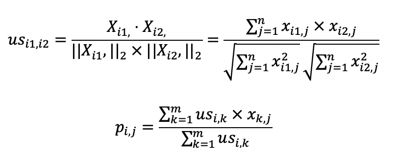

其中，第一个公式比较容易理解，它的核心思想是计算用户和用户之间的相似度。完成了这一步我们就能找到给定用户的“近邻”。

我们可以使用向量空间模型中的距离或者是夹角余弦来处理，在这里我使用了夹角余弦，其中 usi1,i2 表示用户 i1 和 i2 的相似度，而 Xi1, 表示矩阵中第 i1 行的行向量，Xi2, 表示矩阵中第 i2 行的行向量。分子是两个表示用户的行向量之点乘，而分母是这两个行向量 L2 范数的乘积。

第二个公式利用第一个公式所计算的用户间相似度，以及用户对物品的喜好度，预测任一个用户对任一个物品的喜好度。其中 pi,j 表示第 i 用户对第 j 个物品的喜好度，usi,k 表示用户 i 和 k 之间的相似度，xk,j 表示用户 k 对物品 j 的喜好度。注意这里最终需要除以 Σusi,k，是为了进行归一化。

从这个公式可以看出，如果 usi,k 越大，xk,j 对最终 pi,j 的影响越大，反之如果 usi,k 越小，xk,j 对最终 pi,j 的影响越小，充分体现了“基于相似用户”的推荐。

### 基于物品的过滤

基于物品的协同过滤是指利用物品相似度，而不是用户间的相似度来计算预测值。

基于物品的协同过滤同样有两个公式，你可以看一下。

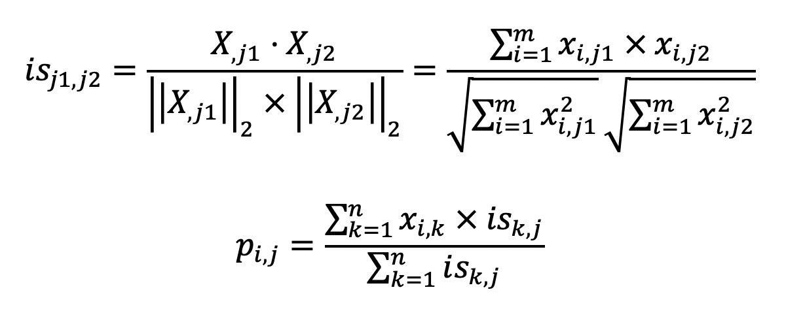

第一个公式的核心思想是计算物品和物品之间的相似度，在这里我仍然使用夹角余弦。其中 isj1,j2 表示物品 j1 和 j2 的相似度，而 Xj1 表示了 X 中第 j1 列的列向量，而 Xj2 表示了 X 中第 j2 列的列向量。分子是两个表示物品的列向量之点乘，而分母是这两个列向量 L2 范数的乘积。

第二个公式利用第一个公式所计算的物品间相似度，和用户对物品的喜好度，预测任一个用户对任一个物品的喜好度。其中 pi,j 表示第 i 用户对第 j 个物品的喜好度，xi,k 表示用户 i 对物品 k 的喜好度，isk,j 表示物品 k 和 j 之间的相似度，注意这里除以 Σisk,j 是为了进行归一化。从这个公式可以看出，如果 isk,j 越大，xi,k 对最终 pi,j 的影响越大，反之如果 isk,j 越小，xi,k 对最终 pi,j 的影响越小，充分体现了“基于相似物品”的推荐。

类似地，用户喜好程度的不一致性，同样会影响相似物品查找的效果，并最终影响推荐结果。我们也需要对于原始的喜好度矩阵，按照用户的维度对用户的所有喜好度，进行归一化或者标准化处理。

## 39-41. 线性回归

机器学习中两类很重要的方法：回归分析以及线性回归。回归分析属于监督式学习算法，主要研究一个或多个随机变量 y1，y2，…，yi 与另一些变量 x1，x2，…，xk 之间的关系。其中，我们将 y1，y2、…，yi 称为因变量，x1，x2，…，xk 称为自变量。按照不同的维度，我们可以把回归分为三种。

* 按照自变量数量，当自变量 x 的个数大于 1 时就是多元回归。
* 按照因变量数量，当因变量 y 个数大于 1 时就是多重回归。
* 按照模型种类，如果因变量和自变量为线性关系时，就是线性回归模型；如果因变量和自变量为非线性关系时，就是非线性回归分析模型。

### 高斯消元法

对于回归分析来说，最简单的情形是只有一个自变量和一个因变量，且它们大体上是有线性关系的，这就是一元线性回归。对应的模型很简单，就是 Y=a+bX+ε。这里的 X 是自变量，Y 是因变量，a 是截距，b 是自变量的系数。前面这些你估计都很熟悉，最后还有个 ε，这表示随机误差，只不过我们通常假定随机误差的均值为 0。

假设我们有多个这样的方程，就能构成线性方程组，如果存在至少一组 x1、x2 和 x3 使得三个方程都成立，那么就叫方程有解；如果没有，那么我们就说方程无解。如果方程有解，那么解可能是唯一，也可能是多个。我们通常关心的是，方程组是不是有解，以及 x1 一直到 xn 分别是多少。

为了实现这个目的，人们想了很多方法来求解方程组，这些方法看起来多种多样，其实主要就是两大类，直接法和迭代法。

直接法就是通过有限次的算术运算，计算精确解。而迭代法，它是一种不断用变量的旧值递推新值的过程。我们可以用迭代法不断地逼近方程的精确解。

高斯消元法主要分为两步，消元（Forward Elimination）和回代（Back Substitution）。所谓消元，就是要减少某些方程中元的数量。如果某个方程中的元只剩一个 xm 了，那么这个自变量 xm 的解就能知道了。所谓的回代，就是把已知的解 xm 代入到方程式中，求出其他未知的解。

### 使用矩阵实现高斯消元法

我们可以把高斯消元法转为矩阵的操作，把方程中的系数转成矩阵。

消元的过程就是把原始的系数矩阵变为上三角矩阵。这里的上三角矩阵表示，矩阵中只有主对角线以及主对角线以上的三角部分里有数字。

回代的过程是把上三角矩阵变为单位矩阵的过程。

为了便于后面的回代计算，我们也可以把方程式等号右边的值加入到系数矩阵，我们称这个新的矩阵为增广矩阵。

对于这个矩阵，我们的最终目标是，把除了最后一列之外的部分，变成单位矩阵，而此时最后一列中的每个值，就是每个自变量所对应的解了。

使用消元法进行线性方程组求解的过程，就是在找系数矩阵的逆矩阵的过程。

### 使用最小二乘法进行直线拟合

求解线性回归和普通的线性方程组最大的不同在于误差ε。在求解线性方程组的时候，我们并不考虑误差的存在，因此存在无解的可能。而线性回归允许误差ε的存在，我们要做的就是尽量把ε最小化，并控制在一定范围之内。这样我们就可以求方程的近似解。

但是现实中的数据一定存在由于各种各样原因所导致的误差，因此即使自变量和因变量之间存在线性关系，也基本上不可能完美符合这种线性关系。总的来说，线性回归分析并不一定需要 100% 精确，而误差ε的存在可以帮助我们降低对精度的要求。

在线性回归中，为了实现最小化 ε 的目标，我们可以使用最小二乘法进行直线的拟合。最小二乘法通过最小化误差的平方和，来寻找和观测数据匹配的最佳函数。

在监督式学习中，拟合模型其实是指通过模型的假设和训练样本，推导出具体参数的过程。有了这些参数，我们就能对新的数据进行预测。而在线性回归中，我们需要找到观测数据之间的线性关系。

#### 最小二乘法

最小二乘法的主要思想就是求解未知参数，使得理论值与观测值之差（即误差，或者说残差）的平方和达到最小。我们可以使用下面这个公式来描述。
$$
\epsilon=\sum^m_{i=1}(y_i-\hat{y})^2
$$
其中，yi 表示来自数据样本的观测值，而 y^ 是假设的函数的理论值，ε 就是我们之前提到的误差，在机器学习中也常被称为损失函数，它是观测值和真实值之差的平方和。最小二乘法里的“二乘”就是指的平方操作。有了这个公式，我们的目标就很清楚了，就是要发现使ε最小化时候的参数。

有了上面的定义之后，我们就可以写出最小二乘问题的矩阵形式。
$$
min||XB-Y||^2
$$
其中 B 为系数矩阵，X 为自变量矩阵，Y 为因变量矩阵。换句话说，我们要在向量空间中，找到一个 B，使向量 XB 与 Y 之间欧氏距离的平方数最小的 B。

结合之前所讲的矩阵点乘知识，我们把上述式子改写为：
$$
||XB-Y||^2=tr((XB-Y)^′(XB-Y))
$$
其中 (XB−Y)′ 表示矩阵 (XB−Y) 的转置。而 tr() 函数表示取对角线上所有元素的和，对于某个矩阵 A 来说，tr(A) 的值计算如下：
$$
tr(A)=\sum^m_{i=1}a_{ii}
$$
进一步，根据矩阵的运算法则，我们有：

tr((XB−Y)‘(XB−Y))=tr(B’X’−Y’)(XB−Y)=tr(B’X’XB−B’X’Y−Y’XB+Y’Y)

因此我们可以得到：

∣∣XB−Y∣∣22=tr((XB−Y)‘(XB−Y))=tr(B’X’−Y’)(XB−Y)=tr(B’X’XB−B’X’Y−Y’XB+Y’Y)

我们知道，求最极值问题直接对应的就是导数为 0，因此我对上述的矩阵形式进行求导，得到如下的式子：

$\frac{d||XB-Y||^2}{dB}\\=\frac{d(tr(B^′X^′XB-B^′X^′Y-Y^′XB+Y^′Y))}{dB}\\=X^′XB+X^′XB-X^′Y-X^′Y\\=2X^′XB-2X^′Y$

最终系数矩阵为：

$B=(X^′X)^{-1}X^′Y$

#### Python代码实现

们使用 Python numpy 库中的矩阵操作来实现最小二乘法。主要的函数操作涉及矩阵的转置、点乘和求逆。

```python
from numpy import *

x = mat([[0,1],[1,-1],[2,8]])
y = mat([[1.4],[-0.48],[13.2]])

# 分别求出矩阵X'、X'X、(X'X)的逆
# 注意，这里的I表示逆矩阵而不是单位矩阵
print("X矩阵的转置X'：\n", x.transpose())
print("\nX'点乘X：\n", x.transpose().dot(x))
print("\nX'X矩阵的逆\n", (x.transpose().dot(x)).I)

print("\nX'X矩阵的逆点乘X'\n", (x.transpose().dot(x)).I.dot(x.transpose()))
print("\n系数矩阵B：\n", (x.transpose().dot(x)).I.dot(x.transpose()).dot(y))
```

除此之外，我们还可把最小二乘法的线性拟合结果和 sklearn 库中的 LinearRegression().fit() 函数的结果相比较

```python
import pandas as pd
from sklearn.linear_model import LinearRegression

df = pd.read_csv("/Users/shenhuang/Data/test.csv")
df_features = df.drop(['y'], axis=1)     #Dataframe中除了最后一列，其余列都是特征，或者说自变量
df_targets = df['y']                     #Dataframe最后一列是目标变量，或者说因变量

print(df_features, df_targets)
regression = LinearRegression().fit(df_features, df_targets)        #使用特征和目标数据，拟合线性回归模型
print(regression.score(df_features, df_targets))        #拟合程度的好坏
print(regression.intercept_)
print(regression.coef_)            #各个特征所对应的系数
```

其中，test.csv 文件的内容我也列在了这里。

x1,x2,y

0,1,1.4

1,−1,−0.48

2,8,13.2

这样写是为了方便我们使用 pandas 读取 csv 文件并加载为 dataframe。

在最终的结果中，1.0 表示拟合程度非常好，而 -0.014545454545452863 表示一个截距，[0.94909091 1.41454545]表示系数 b1 和 b2 的值。这个结果和我们最小二乘法的结果有所差别，主要原因是 LinearRegression().fit() 默认考虑了有线性函数存在截距的情况。那么我们使用最小二乘法是不是也可以考虑有截距的情况呢？答案是肯定的，不过我们首先要略微修改一下方程组和矩阵 X。如果我们假设有截距存在，那么线性回归方程就要改写为：

b0+b1⋅x1+b2⋅x2+…+bn−1⋅xn−1+bn⋅xn=y

其中，b0 表示截距，而我们这里的方程组用例就要改写为：

b0+b1⋅0+b2⋅1=1.4

b0+b1⋅1−b2⋅1=−0.48

b0+b1⋅2+b2⋅8=13.2

而矩阵 X 要改写为：

$X=\begin{bmatrix}1&0&1\\1&1&-1\\1&2&8 \end{bmatrix}$

然后我们再执行下面这段代码。

```python
from numpy import *

x = mat([[1,0,1],[1,1,-1],[1,2,8]])
y = mat([[1.4],[-0.48],[13.2]])

print("\n系数矩阵B：\n", (x.transpose().dot(x)).I.dot(x.transpose()).dot(y))
```

你就会得到：

```python
 系数矩阵B：
     [[-0.01454545]
     [ 0.94909091]
     [ 1.41454545]]
```

这个结果和 LinearRegression().fit() 的结果就一致了。

需要注意的是，使用线性回归的时候，我们都有一个前提假设，那就是数据的自变量和因变量之间呈现线性关系。如果不是线性关系，那么使用线性模型来拟合的效果一定不好。

那么，我们如何判断一个数据集是不是能用线性模型表示呢？在线性回归中，我们可以使用决定系数 R2。这个统计指标使用了回归平方和与总平方和之比，是反映模型拟合度的重要指标。它的取值在 0 到 1 之间，越接近于 1 表示拟合的程度越好、数据分布越接近线性关系。随着自变量个数的增加，R2 将不断增大，因此我们还需要考虑方程所包含的自变量个数对 R2 的影响，这个时候可使用校正的决定系数 Rc2。所以，在使用各种科学计算库进行线性回归时，你需要关注 R2 或者 Rc2，来看看是不是一个好的线性拟合。在之前的代码实践中，我们提到的 regression.score 函数，其实就是返回了线性回归的 R2。

## 42-43. PCA主成分分析

## 44. 奇异值分解

## 45. 矩阵乘法的几何意义

## 46. 缓存系统

## 47-48. 搜索引擎

## 49-50. 推荐系统

## 51. 如何进行个性化用户画像的设计